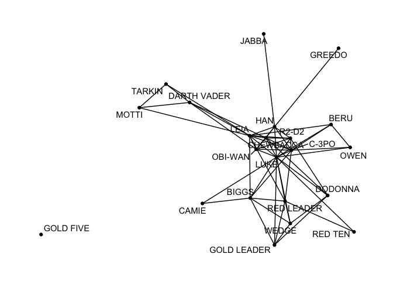
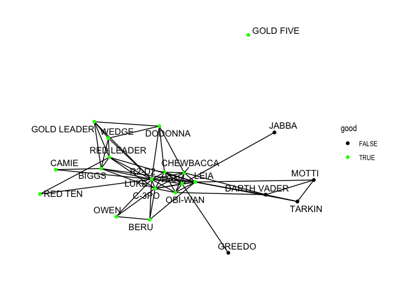
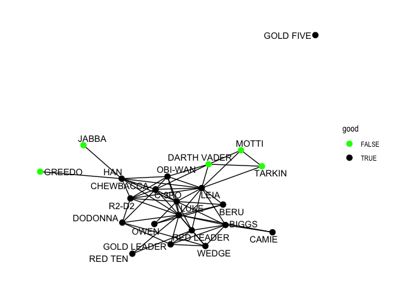
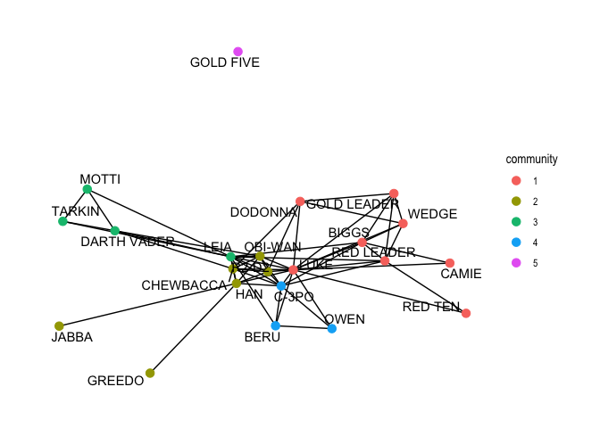
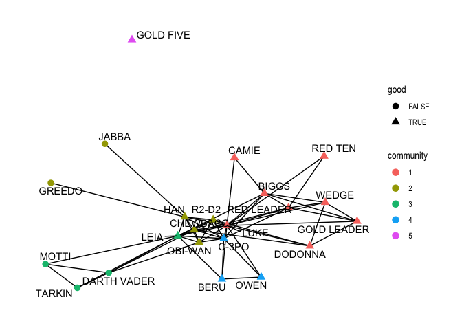
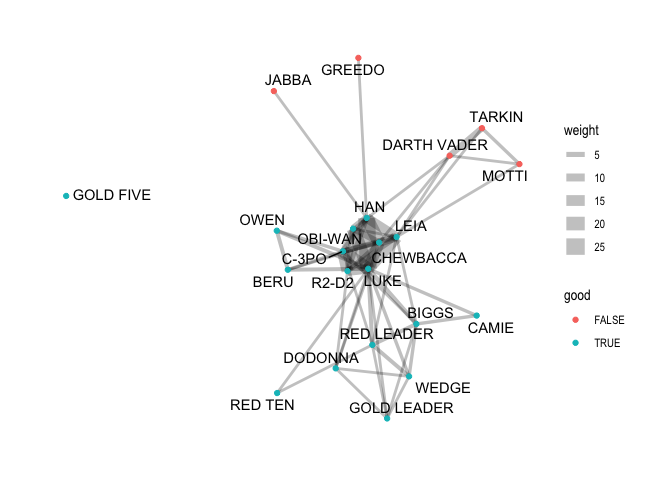
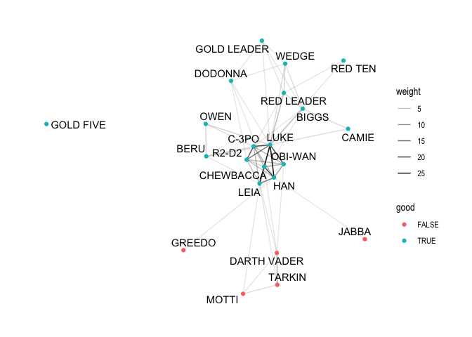
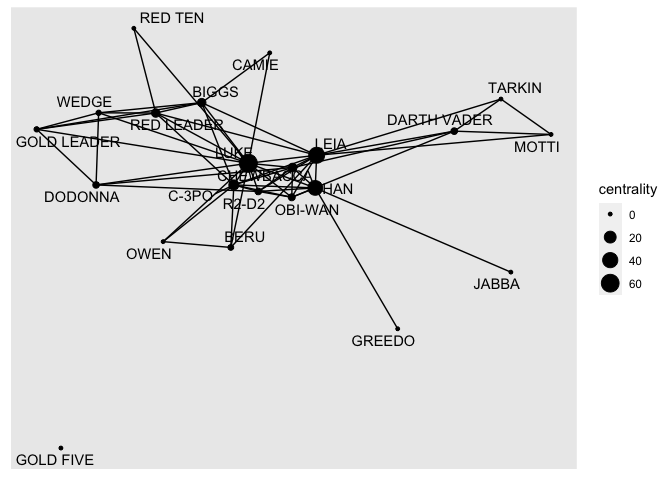

Machine Learning, Text and Networks Demo
================

### Word Clouds

We’ve got a dataset of a Gallup survey from 2014 that asks an open ended
question about how people would feel if Hilary Clinton were to become
president. What is the most positive thing and what is the worst thing
about it? First, we need to do some basic read in and data manipulation.
It’s in a weird format (an SPSS portable file) so I had to do some
cumbersome gymnastics to get it into shape. Not elegant, but very real.

We also create a new roll-up variable of ideology, in which we take the
7 point ideology scale they asked and collapse it into 3 categories:
Conservative, Moderate and Liberal.

``` r
library(haven) # for reading SPSS data files
library(tidyverse)
```

    ## ── Attaching packages ─────────────────────────────────────── tidyverse 1.3.2 ──
    ## ✔ ggplot2 3.3.6      ✔ purrr   0.3.4 
    ## ✔ tibble  3.1.8      ✔ dplyr   1.0.10
    ## ✔ tidyr   1.2.1      ✔ stringr 1.4.1 
    ## ✔ readr   2.1.2      ✔ forcats 0.5.2

    ## Warning: package 'readr' was built under R version 4.0.5

    ## ── Conflicts ────────────────────────────────────────── tidyverse_conflicts() ──
    ## ✖ dplyr::filter() masks stats::filter()
    ## ✖ dplyr::lag()    masks stats::lag()

``` r
d1 <- read_por("g2014tr0315.por")

d2 <- d1 %>% 
   select("ID", "WTFCTR", "LANGUAGE", "P862_1_T", "P862_2_T", "P862_3_T", "P863_1_T", "P863_2_T", "P863_3_T", "D16")

d3 <- d2 %>% 
   filter(as_factor(LANGUAGE) == "English")

d3$P862_1_T <- as.character(d3$P862_1_T)
d3$P862_2_T <- as.character(d3$P862_2_T)
d3$P862_3_T <- as.character(d3$P862_3_T)
d3$P863_1_T <- as.character(d3$P863_1_T)
d3$P863_2_T <- as.character(d3$P863_2_T)
d3$P863_3_T <- as.character(d3$P863_3_T)
d3$D16 <- as.numeric(d3$D16)

d3 <- d3 %>%
   mutate(ideo_x = case_when(D16 <= 2 ~ "Cons",
                             D16 == 3 ~ "Mod",
                             D16 <= 5 ~ "Lib",
                             TRUE ~ NA_character_))

glimpse(d3)
```

    ## Rows: 987
    ## Columns: 11
    ## $ ID       <chr> "017558", "017560", "017562", "017564", "017565", "017539", "…
    ## $ WTFCTR   <dbl> 0.320, 1.409, 1.230, 0.849, 0.668, 0.230, 0.976, 0.230, 0.728…
    ## $ LANGUAGE <chr+lbl> "1", "1", "1", "1", "1", "1", "1", "1", "1", "1", "1", "1…
    ## $ P862_1_T <chr> "I WON'T FATHOM THAT IDEA. I CAN'T IMAGINE THAT HAPPENING.", …
    ## $ P862_2_T <chr> "", "", "", "", "", "do alot more 1 term and out", "", "I THI…
    ## $ P862_3_T <chr> "", "", "", "", "", "", "", "", "", "", "MAYBE SHE WOULD HAVE…
    ## $ P863_1_T <chr> "THE DEMOCRATS THINK THE ONLY WAY TO SOLVE PROBLEMS IS TO SPE…
    ## $ P863_2_T <chr> "", "", "", "", "", "", "", "", "", "", "", "", "", "", "", "…
    ## $ P863_3_T <chr> "", "", "", "", "", "", "", "", "", "", "", "", "", "", "", "…
    ## $ D16      <dbl> 3, 4, 3, 8, 2, 2, 9, 3, 2, 2, 1, 3, 2, 3, 3, 5, 3, 3, 3, 3, 5…
    ## $ ideo_x   <chr> "Mod", "Lib", "Mod", NA, "Cons", "Cons", NA, "Mod", "Cons", "…

Now we are ready to create our first word cloud. Here we do just a
single cloud. First, we have to load the `tidytext` library which allows
us to extract easily extract words from the open ended text using
`unnest_tokens`, and then we also load the `wordcloud` library for
obvious reasons.

``` r
library(tidytext)
library(wordcloud)
```

    ## Loading required package: RColorBrewer

    ## Warning: package 'RColorBrewer' was built under R version 4.0.5

The first thing we’ll need to do is filter out stop words, including
custom ones. Stop words are words that are commonly used that we are NOT
interested in analyzing. The tidytext package comes with a set of
preloaded stop words such as `c("the", "and", "or")` and so on. Here’s
what that built in list looks like:

``` r
stop_words
```

    ## # A tibble: 1,149 × 2
    ##    word        lexicon
    ##    <chr>       <chr>  
    ##  1 a           SMART  
    ##  2 a's         SMART  
    ##  3 able        SMART  
    ##  4 about       SMART  
    ##  5 above       SMART  
    ##  6 according   SMART  
    ##  7 accordingly SMART  
    ##  8 across      SMART  
    ##  9 actually    SMART  
    ## 10 after       SMART  
    ## # … with 1,139 more rows

We can create our own list of custom stop words that we find in the data
and do not want analyzed. For this question, we probably want to filter
out the word “president” because the question is specifically asking
about how they would feel about her being president. We also filter out
“ummm” and “answer”. We turn that vector into a data frame that looks
more like the pre-built stop words list, so that it will play nicely
with it.

``` r
custom_stops <- c("ummm", "answer", "president")

custom_stop_words <- tibble(word = custom_stops) %>%
   mutate(lexicon = "custom")

custom_stop_words
```

    ## # A tibble: 3 × 2
    ##   word      lexicon
    ##   <chr>     <chr>  
    ## 1 ummm      custom 
    ## 2 answer    custom 
    ## 3 president custom

From there we are ready to begin manipulating the actual data to get it
ready for our word cloud. First, we filter out any NAs for ideology.
Second, respondents were able to list three separate answers and they
are available in three different variables, so we combine all three
responses into one master open-ended response that we can do a full
analysis on.

Next we clean up some of the typos in the data and also consolidate
similar responses. For example, we fix a misspelling of Obama’s first
name, and then recode variations of the word “woman” into the same word
so that all of these items are rolled up into one word in the cloud.
This process is necessarily interative. You’ll run the word cloud, look
at the results, see a misspelling and then add it to the statement,
rerun the cloud, see two related words that need to be rolled up
together, rerun the word cloud and so on, until you are satisfied.

``` r
# Suppose Hillary Clinton is elected president in 2016. In your view, what would be the best or most positive thing about a Hillary Clinton presidency? 
# Single word cloud
d4 <- d3 %>% 
   filter(is.na(ideo_x) == F) %>%
   mutate(clinton_oe = str_c(P862_1_T, ";", P862_2_T, ";", P862_3_T)) %>% 
   mutate(clinton_oe = str_replace_all(clinton_oe %>% tolower, "barrack", "barack"),
          clinton_oe = str_replace_all(clinton_oe %>% tolower, "women", "woman"),
          clinton_oe = str_replace_all(clinton_oe %>% tolower, "women's", "woman"),
          clinton_oe = str_replace_all(clinton_oe %>% tolower, "woman's", "woman"))

d4
```

    ## # A tibble: 915 × 12
    ##    ID     WTFCTR LANGUAGE  P862_…¹ P862_…² P862_…³ P863_…⁴ P863_…⁵ P863_…⁶   D16
    ##    <chr>   <dbl> <chr+lbl> <chr>   <chr>   <chr>   <chr>   <chr>   <chr>   <dbl>
    ##  1 017558  0.32  1 [Engli… "I WON… ""      ""      "THE D… ""      ""          3
    ##  2 017560  1.41  1 [Engli… "THAT … ""      ""      ""      ""      ""          4
    ##  3 017562  1.23  1 [Engli… ""      ""      ""      ""      ""      ""          3
    ##  4 017565  0.668 1 [Engli… ""      ""      ""      ""      ""      ""          2
    ##  5 017539  0.23  1 [Engli… "did a… "do al… ""      "huban… ""      ""          2
    ##  6 017567  0.23  1 [Engli… "UMM I… "I THI… ""      "I GUE… ""      ""          3
    ##  7 017544  0.728 1 [Engli… "DONT … ""      ""      ""      ""      ""          2
    ##  8 017575  0.263 1 [Engli… "A CHA… ""      ""      "HER P… ""      ""          2
    ##  9 017554  0.348 1 [Engli… "I LIK… "SHE'S… "MAYBE… "SHE N… ""      ""          1
    ## 10 017579  0.267 1 [Engli… "SHE H… "AND T… ""      "THAT … ""      ""          3
    ## # … with 905 more rows, 2 more variables: ideo_x <chr>, clinton_oe <chr>, and
    ## #   abbreviated variable names ¹​P862_1_T, ²​P862_2_T, ³​P862_3_T, ⁴​P863_1_T,
    ## #   ⁵​P863_2_T, ⁶​P863_3_T

Next we finally create the actual wordcloud. To do so, we
`unnest_tokens` within the variable `clinton_oe` and into a new variable
called `word`. We `anti_join` on the `stop_words` library AND the
`custom_stop_words` library. We then call a `count` function to sum up
the number of times each word occurs, but use our survey weight variable
for that counting, and sort accordingly.

Then lastly, we call the wordcloud function. This has a number of
parameters that we can customize, the maximum number of words to
display, the size of those words, whether they are in a random order,
whether they are rotated and finally, what color they should be.

``` r
d4 %>% 
   unnest_tokens(word, clinton_oe) %>%
   anti_join(stop_words) %>%
   anti_join(custom_stop_words) %>%
   count(word, wt = WTFCTR, sort = T) %>%
   with(wordcloud(word, n, 
                  max.words = 50, 
                  scale=c(3, 0.6), 
                  random.order = F,
                  rot.per = 0,
                  color = "dark green"))
```

    ## Joining, by = "word"
    ## Joining, by = "word"

<!-- -->

Next we’ll do a comparison wordcloud which allows us to create a faceted
wordcloud based on some categorical characteristic. In this case, we’ll
do it on Ideology. We have the same prep work, but this time the `count`
function includes the variable we want to do a comparison on - `ideo_x`.
From there we need to do a few things to get the data into the right
shape for a comparison cloud. First, the comparison cloud requires that
the compared items be in the columns, so we have to `pivot_wider` with
the column names coming from `ideo_x` and the values coming from our `n`
variable. Also, the comparison cloud doesn’t know what to do with NA
values so we set `values_fill` to 0, replacing any NAs with zero.
Finally, the comparison cloud requires that the word data be the row
name (so that it looks more like a term document matrix, which is what
it is actually expecting), so we have to use the `column_to_rownames`
function and set the rownames equal to `word`. Finally, we can call
`comparison.cloud` which has similar parameters to the previous one: we
can set the colors, the scale, the maximum number of words, whether we
want them in a random order, the title size and whether we want the
words rotated.

``` r
# Suppose Hillary Clinton is elected president in 2016. In your view, what would be the best or most positive thing about a Hillary Clinton presidency? 
d4 %>% 
   unnest_tokens(word, clinton_oe) %>%
   anti_join(stop_words) %>%
   anti_join(custom_stop_words) %>%
   count(ideo_x, word, wt = WTFCTR, sort = T) %>%
   pivot_wider(names_from = ideo_x, values_from = n, values_fill = 0) %>% 
   column_to_rownames(var = "word") %>% 
   comparison.cloud(colors = c("red", "blue", "grey"),
                    scale = c(0.6,3),
                    max.words = 30,
                    random.order = F,
                    title.size = .5,
                    rot.per = 0)
```

    ## Joining, by = "word"
    ## Joining, by = "word"

    ## Warning in comparison.cloud(., colors = c("red", "blue", "grey"), scale =
    ## c(0.6, : matters could not be fit on page. It will not be plotted.

<!-- -->

Here we do the same things, but this time for the other open end
question, “What would be the worst or most negative thing about a
Hillary Clinton presidency?”

``` r
# And, what would be the worst or most negative thing about a Hillary Clinton presidency?
# Single word cloud
d3 %>% 
   filter(is.na(ideo_x) == F) %>%
   mutate(clinton_oe_neg = str_c(P863_1_T, ";", P863_2_T, ";", P863_3_T)) %>% 
   mutate(clinton_oe_neg = str_replace_all(clinton_oe_neg %>% tolower, "barrack", "barack"),
          clinton_oe_neg = str_replace_all(clinton_oe_neg %>% tolower, "women", "woman"),
          clinton_oe_neg = str_replace_all(clinton_oe_neg %>% tolower, "women's", "woman"),
          clinton_oe_neg = str_replace_all(clinton_oe_neg %>% tolower, "woman's", "woman")) %>% 
   unnest_tokens(word, clinton_oe_neg) %>%
   anti_join(stop_words) %>%
   anti_join(custom_stop_words) %>%
   count(word, wt = WTFCTR, sort = T) %>%
   with(wordcloud(word, n, 
                  max.words = 50, 
                  scale=c(3, 0.6), 
                  random.order = F,
                  rot.per = 0,
                  color = "black"))
```

    ## Joining, by = "word"
    ## Joining, by = "word"

<!-- -->

Same question, but now a comparison cloud:

``` r
d3 %>% 
   filter(is.na(ideo_x) == F) %>%
   mutate(clinton_oe_neg = str_c(P863_1_T, ";", P863_2_T, ";", P863_3_T)) %>% 
   mutate(clinton_oe_neg = str_replace_all(clinton_oe_neg %>% tolower, "barrack", "barack"),
          clinton_oe_neg = str_replace_all(clinton_oe_neg %>% tolower, "women", "woman"),
          clinton_oe_neg = str_replace_all(clinton_oe_neg %>% tolower, "women's", "woman"),
          clinton_oe_neg = str_replace_all(clinton_oe_neg %>% tolower, "woman's", "woman")) %>% 
   unnest_tokens(word, clinton_oe_neg) %>%
   anti_join(stop_words) %>%
   anti_join(custom_stop_words) %>%
   count(ideo_x, word, wt = WTFCTR, sort = T) %>%
   pivot_wider(names_from = ideo_x, values_from = n, values_fill = 0) %>% 
   column_to_rownames(var = "word") %>% 
   comparison.cloud(colors = c("red", "blue", "grey"),
                    scale = c(0.6,3),
                    max.words = 30,
                    random.order = F,
                    title.size = .5,
                    rot.per = 0)
```

    ## Joining, by = "word"
    ## Joining, by = "word"

<!-- -->

### Network Analysis

For our purposes we will be using the `ggraph` package which allows for
the visualization of network graphs using methods familiar to `ggplot2`.
This package builds on top of `tidygraph` which is in turn built off of
the `igraph` package. `igraph` is the package which allows you to
calculate statistics on network datasets, while `tidygraph` provides
tidy wrappers to it.

``` r
library(igraph)
```

    ## 
    ## Attaching package: 'igraph'

    ## The following objects are masked from 'package:dplyr':
    ## 
    ##     as_data_frame, groups, union

    ## The following objects are masked from 'package:purrr':
    ## 
    ##     compose, simplify

    ## The following object is masked from 'package:tidyr':
    ## 
    ##     crossing

    ## The following object is masked from 'package:tibble':
    ## 
    ##     as_data_frame

    ## The following objects are masked from 'package:stats':
    ## 
    ##     decompose, spectrum

    ## The following object is masked from 'package:base':
    ## 
    ##     union

``` r
library(tidygraph)
```

    ## 
    ## Attaching package: 'tidygraph'

    ## The following object is masked from 'package:igraph':
    ## 
    ##     groups

    ## The following object is masked from 'package:stats':
    ## 
    ##     filter

``` r
library(ggraph)
```

There is an important distinction between traditional ggplot plots and
ggraph plots: network data is fundamentally different from tabular data,
and most network visualizations don’t concern themselves with mapping
variables to x and y aesthetics since they are concerned with showing
the network topology more than relations between two variables. In order
to show network topology the concept of layouts are employed. Layouts
are algorithms that use the network structure to calculate (often
arbitrary) x and y values for each node that can then be used for
visualization purposes. To put it in another way, when plotting tabular
data the x and y aesthetics are almost always mapped to existing
variables in the data (or statistical transformations of existing data)
whereas when plotting network data x and y are mapped to values derived
from the topology of the network and which are by themselves
meaningless.

In other words, in general, network graphs do not have coordinates.
Thus, there is no right way to draw a network graph. Visualizing a graph
is more art than science, but several graph layout algorithms are
popular.

For this demo, we’ll be working with node and edge data from the movie
Star Wars: A New Hope (Episode 4). The data is built by processing the
script for the movie and counting the number of shared scenes between
characters.

``` r
# big thanks to https://dgarcia-eu.github.io/SocialDataScience/5_SocialNetworkPhenomena/057_Tidygraph2/tidygraph2.html
sw_edges <- read_csv("sw_edges.csv")
```

    ## Rows: 60 Columns: 4
    ## ── Column specification ────────────────────────────────────────────────────────
    ## Delimiter: ","
    ## chr (3): source, target, exchange
    ## dbl (1): weight
    ## 
    ## ℹ Use `spec()` to retrieve the full column specification for this data.
    ## ℹ Specify the column types or set `show_col_types = FALSE` to quiet this message.

``` r
sw_nodes <- read_csv("sw_nodes.csv")
```

    ## Rows: 22 Columns: 3
    ## ── Column specification ────────────────────────────────────────────────────────
    ## Delimiter: ","
    ## chr (1): name
    ## dbl (1): id
    ## lgl (1): good
    ## 
    ## ℹ Use `spec()` to retrieve the full column specification for this data.
    ## ℹ Specify the column types or set `show_col_types = FALSE` to quiet this message.

Notice what these data sets look like. First, here are the nodes, or the
characters from the movie, which have an id associated with them, and
they have a categorical designation as to whether they are “good guys”
or “bad guys”:

``` r
glimpse(sw_nodes)
```

    ## Rows: 22
    ## Columns: 3
    ## $ name <chr> "R2-D2", "CHEWBACCA", "C-3PO", "LUKE", "DARTH VADER", "CAMIE", "B…
    ## $ id   <dbl> 0, 1, 2, 3, 4, 5, 6, 7, 8, 9, 10, 11, 12, 13, 14, 15, 16, 17, 18,…
    ## $ good <lgl> TRUE, TRUE, TRUE, TRUE, FALSE, TRUE, TRUE, TRUE, TRUE, TRUE, TRUE…

Now, here are the edges, in which there is a source and a target (two
characters sharing a scene), a weight that in this instance is a count
of the number of shared scenes, and then a categorical variable of the
interaction between these two characters - that is, whether they are
engaging as allies or adversaries.

``` r
glimpse(sw_edges)
```

    ## Rows: 60
    ## Columns: 4
    ## $ source   <chr> "C-3PO", "LUKE", "OBI-WAN", "LEIA", "HAN", "CHEWBACCA", "DODO…
    ## $ target   <chr> "R2-D2", "R2-D2", "R2-D2", "R2-D2", "R2-D2", "R2-D2", "R2-D2"…
    ## $ weight   <dbl> 17, 13, 6, 5, 5, 3, 1, 7, 5, 16, 19, 11, 1, 1, 2, 2, 4, 1, 3,…
    ## $ exchange <chr> "allies", "allies", "allies", "allies", "allies", "allies", "…

In order to visualize these as a network map, the first thing you need
to do is convert the two separate data frames into an `tidygraph`
object. For this, we can use the `tbl_graph` function and pass it
objects for our nodes, our edges, and tell it that the network is
undirected. You’ll see that the new object is of type = `tbl_graph` and
that it contains 2 components, node data and edge data. All the original
data is preserved.

``` r
swnet <- tbl_graph(sw_nodes, sw_edges, directed = FALSE)

swnet
```

    ## # A tbl_graph: 22 nodes and 60 edges
    ## #
    ## # An undirected simple graph with 2 components
    ## #
    ## # Node Data: 22 × 3 (active)
    ##   name           id good 
    ##   <chr>       <dbl> <lgl>
    ## 1 R2-D2           0 TRUE 
    ## 2 CHEWBACCA       1 TRUE 
    ## 3 C-3PO           2 TRUE 
    ## 4 LUKE            3 TRUE 
    ## 5 DARTH VADER     4 FALSE
    ## 6 CAMIE           5 TRUE 
    ## # … with 16 more rows
    ## #
    ## # Edge Data: 60 × 4
    ##    from    to weight exchange
    ##   <int> <int>  <dbl> <chr>   
    ## 1     1     3     17 allies  
    ## 2     1     4     13 allies  
    ## 3     1    11      6 allies  
    ## # … with 57 more rows

There are two ways you can generate a quick plot of the data just to see
what you are dealing with. There is the base R function of `plot` and
also a special ggraph function `autograph` that serves the same
function:

``` r
# quickplot of network map
plot(swnet)
```

<!-- -->

``` r
# quickplot with ggraph function, meant for quick overviews
autograph(swnet)
```

<!-- -->

You initialize the plot with a `ggraph()` call. The first argument is
the data, which can be a tbl_graph or any object convertible to one. The
second argument is the layout argument. If you do not specify the
format, it defaults to a `stress` layout. From there, you’ll note that
the syntax is very similar to ggplot, but with new types of geoms, each
related to edges and nodes. You can, for example, draw a plot with just
nodes:

``` r
# draw basic network map
ggraph(swnet) + 
   geom_node_point() +
   theme_graph()
```

    ## Using "stress" as default layout

<!-- -->

Or you can draw it with just edges:

``` r
# draw basic network map
ggraph(swnet) + 
   geom_edge_link() + 
   theme_graph()
```

    ## Using "stress" as default layout

<!-- -->

But most frequently, you’ll be drawing it with edges AND nodes. Below,
I’ve done exactly that AND I’ve specified a different kind of layout, a
forced layout:

``` r
# draw basic network map
ggraph(swnet, "fr") + 
   geom_edge_link() + 
   geom_node_point() +
   theme_graph()
```

<!-- -->

This isn’t all that helpful, as we don’t know which nodes are which.
Here’s where you can start interacting with it using the tools you’ve
learned as part of ggplot. For example, we can add a new type of text
geom that is specific to nodes, and we have to map its label aesthetic
to `name`:

``` r
ggraph(swnet, "fr") + 
   geom_edge_link() + 
   geom_node_point() + 
   geom_node_text(aes(label = name), repel=TRUE) +
   theme_graph()
```

<!-- -->

That is much better! But we can also add other aesthetics, like mapping
color to whether or not they are good guys:

``` r
ggraph(swnet, "fr") + 
   geom_edge_link() + 
   geom_node_point(aes(color = good)) + 
   geom_node_text(aes(label = name), repel=TRUE) +
   scale_color_manual(values = c("black", "green")) +
   theme_graph()
```

<!-- -->

As I said before, there are a number of different layouts we can use.
Here are a few of them:

``` r
# vary layout methods
# graphopt, kk, grid, circle, tree, unrooted
ggraph(swnet, "graphopt") +
   geom_edge_link() +
   geom_node_point(aes(color = good), size = 3) + 
   geom_node_text(aes(label = name), repel=TRUE) +
   scale_color_manual(values = c("green", "black")) +
   theme_graph()
```

<!-- -->

``` r
ggraph(swnet, "kk") +
   geom_edge_link() +
   geom_node_point(aes(color = good), size = 3) + 
   geom_node_text(aes(label = name), repel=TRUE) +
   scale_color_manual(values = c("green", "black")) +
   theme_graph()
```

<!-- -->

``` r
ggraph(swnet, "grid") +
   geom_edge_link() +
   geom_node_point(aes(color = good), size = 3) + 
   geom_node_text(aes(label = name), repel=TRUE) +
   scale_color_manual(values = c("green", "black")) +
   theme_graph()
```

<!-- -->

``` r
ggraph(swnet, "tree") +
   geom_edge_link() +
   geom_node_point(aes(color = good), size = 3) + 
   geom_node_text(aes(label = name), repel=TRUE) +
   scale_color_manual(values = c("green", "black")) +
   theme_graph()
```

<!-- -->

``` r
ggraph(swnet, "unrooted") +
   geom_edge_link() +
   geom_node_point(aes(color = good), size = 3) + 
   geom_node_text(aes(label = name), repel=TRUE) +
   scale_color_manual(values = c("green", "black")) +
   theme_graph()
```

<!-- -->

Using the tidygraph library, you can calculate a number of metrics,
which can in turn be used in your visualization. Below, we identify
natural “communities” in the data, using a community detection
algorithmn to find densely connected subgraphs. Here we use the Louvain
algorithm, which is a fast and common way to find a division into
communities that maximizes modularity. This uses the `group_louvain()`
function, and we convert the output to a character so that it can
display properly as a categorical variable.

Notice here the new verb that we are using, `activate`. This is specific
to tidygraph and is used to declare whether you are going to be
conducting an operation on the nodes of the graph object or the edges of
the graph object. Since we are calculating a community, it is being done
on our nodes.

We can view the results of this calculation by activating the nodes and
then using `as_tibble`:

``` r
swnet <- swnet %>% 
   activate(nodes) %>% 
   mutate(community = as.character(group_louvain()))

# review it
swnet %>% 
   activate(nodes) %>% 
   as_tibble()
```

    ## # A tibble: 22 × 4
    ##    name           id good  community
    ##    <chr>       <dbl> <lgl> <chr>    
    ##  1 R2-D2           0 TRUE  1        
    ##  2 CHEWBACCA       1 TRUE  1        
    ##  3 C-3PO           2 TRUE  4        
    ##  4 LUKE            3 TRUE  2        
    ##  5 DARTH VADER     4 FALSE 3        
    ##  6 CAMIE           5 TRUE  2        
    ##  7 BIGGS           6 TRUE  2        
    ##  8 LEIA            7 TRUE  3        
    ##  9 BERU            8 TRUE  4        
    ## 10 OWEN            9 TRUE  4        
    ## # … with 12 more rows

And now that we have the community designation, we can plot it:

``` r
# plot it
ggraph(swnet, "fr") +
   geom_edge_link() +
   geom_node_point(aes(color = community), size = 3) + 
   geom_node_text(aes(label = name), repel=TRUE) +
   theme_graph()
```

<!-- -->

We can continue to improve the graph by varying the encodings. Here we
keep the community coloring, but add a shape aesthetic that is mapped to
what side they are on:

``` r
ggraph(swnet, "fr") +
   geom_edge_link() +
   geom_node_point(aes(color = community, shape = good), size = 3) + 
   geom_node_text(aes(label = name), repel=TRUE) +
   theme_graph()
```

<!-- -->

We can also use the weight information (the number of shared scenes) in
the visualization. Below, we attach weight to the width aesthetic, but
also set the alpha to a very low value, since it will undoubtedly get
messy in the middle of that graph.

``` r
# vary the width size by the weight variable, with alpha set appropriately
ggraph(swnet, "fr") +
   geom_edge_link(aes(width = weight), alpha = 0.25) +
   geom_node_point(aes(color = good)) +
   geom_node_text(aes(label = name), repel = TRUE) +
   theme_graph()
```

<!-- -->

This is okay, but maybe we can try something else that will work better,
like setting the alpha as an aesthetic and mapping it to weight:

``` r
ggraph(swnet, "fr") +
   geom_edge_link(aes(alpha = weight)) +
   geom_node_point(aes(color = good)) +
   geom_node_text(aes(label = name), repel = TRUE) +
   theme_graph()
```

<!-- -->

You can also use faceting in ggraph, but the function calls are
specialized to whether you are faceting by a node element, a edge
element, or both. Here we are faceting by the node attribute of `good`:

``` r
# facet by node characteristic
ggraph(swnet, "fr") +
   geom_edge_link() +
   geom_node_point(aes(color = good)) +
   geom_node_text(aes(label = name), repel = TRUE) +
   facet_nodes(~good)
```

<!-- -->

Here we facet by the edge characteristic of whether the interaction was
between allies or adversaries:

``` r
ggraph(swnet, "fr") +
   geom_edge_link() +
   geom_node_point(aes(color = good)) +
   geom_node_text(aes(label = name), repel = TRUE) +
   facet_edges(~exchange)
```

<!-- -->

And finally you can facet by both a node and edge characteristic:

``` r
ggraph(swnet, "fr") +
   geom_edge_link() +
   geom_node_point(aes(color = good)) +
   geom_node_text(aes(label = name), repel = TRUE) +
   facet_graph(exchange~community)
```

<!-- -->

Here’s another example of making a tidygraph calculation and then
plotting it, this time using a measure of centrality:

``` r
# calculate centrality
swnet <- swnet %>% 
   activate(nodes) %>% 
   mutate(centrality = centrality_betweenness())
```

    ## Warning in betweenness(graph = graph, v = V(graph), directed = directed, :
    ## 'nobigint' is deprecated since igraph 1.3 and will be removed in igraph 1.4

``` r
# display it
swnet %>% 
   activate(nodes) %>% 
   arrange(desc(centrality)) %>% 
   as_tibble()
```

    ## # A tibble: 22 × 5
    ##    name           id good  community centrality
    ##    <chr>       <dbl> <lgl> <chr>          <dbl>
    ##  1 LUKE            3 TRUE  2              62.4 
    ##  2 LEIA            7 TRUE  3              45.6 
    ##  3 HAN            13 TRUE  1              37   
    ##  4 C-3PO           2 TRUE  4              12.1 
    ##  5 CHEWBACCA       1 TRUE  1               7.45
    ##  6 RED LEADER     19 TRUE  2               6.75
    ##  7 BIGGS           6 TRUE  2               6.75
    ##  8 OBI-WAN        10 TRUE  1               3.12
    ##  9 R2-D2           0 TRUE  1               2.5 
    ## 10 DARTH VADER     4 FALSE 3               2.5 
    ## # … with 12 more rows

Now we can plot it, mapping the size aesthetic to that centrality
number:

``` r
ggraph(swnet, layout = "fr") + 
   geom_edge_link() + 
   geom_node_point(aes(size = centrality)) + 
   geom_node_text(aes(label = name), repel=TRUE)
```

<!-- -->

There are some other layouts that are more distinctive, like a linear
one:

``` r
# linear 
ggraph(swnet, "linear") +
   geom_edge_arc(aes(color = exchange)) +
   geom_node_text(aes(label = name), repel=TRUE) +
   geom_node_point(aes(color = good), size = 3) + 
   scale_color_manual(values = c("green", "black")) +
   theme_graph()
```

    ## Warning: ggrepel: 3 unlabeled data points (too many overlaps). Consider
    ## increasing max.overlaps

<!-- -->

We can also take this and turn it into a chord diagram, by setting the
circular parameter to TRUE on a linear layout:

``` r
# chord diagram
ggraph(swnet, "linear", circular = TRUE) +
   geom_edge_arc(aes(color = exchange)) +
   geom_node_text(aes(label = name), repel=TRUE) +
   geom_node_point(aes(color = good), size = 3) + 
   scale_color_manual(values = c("green", "black")) +
   theme_graph()
```

<!-- -->
