PPOL 563 - Week 3: Exploratory Data Analysis in R
================

For this demonstration and the ensuing exercise we will be using the
[Gapminder](https://www.gapminder.org/) dataset.

``` r
# install.packages("gapminder")
# load necessary libraries
library(tidyverse)
```

    ## ── Attaching packages ─────────────────────────────────────── tidyverse 1.3.2 ──
    ## ✔ ggplot2 3.3.6      ✔ purrr   0.3.4 
    ## ✔ tibble  3.1.8      ✔ dplyr   1.0.10
    ## ✔ tidyr   1.2.0      ✔ stringr 1.4.1 
    ## ✔ readr   2.1.2      ✔ forcats 0.5.2

    ## Warning: package 'tidyr' was built under R version 4.0.5

    ## Warning: package 'readr' was built under R version 4.0.5

    ## ── Conflicts ────────────────────────────────────────── tidyverse_conflicts() ──
    ## ✖ dplyr::filter() masks stats::filter()
    ## ✖ dplyr::lag()    masks stats::lag()

``` r
library(gapminder)
```

## Dataset Overview

First and foremost, we need to understand the library we just loaded.
Using R’s built-in help function gives us helpful information:

``` r
help(package = "gapminder")
```

From here, we can see there are two datasets available: `gapminder` and
`gapminder_unfiltered`. We can again use the help option to get more
information:

``` r
help(gapminder)
help(gapminder_unfiltered)
```

From here, it’s helpful to get a bird’s eye view of the datasets.

This is easily accomplished with the `glimpse` function. The function
provides us with a succinct look at the row and column count, each
variable and it’s corresponding type, and a brief look at the first few
observations.

Here it is for the `gapminder` dataset:

``` r
glimpse(gapminder)
```

    ## Rows: 1,704
    ## Columns: 6
    ## $ country   <fct> "Afghanistan", "Afghanistan", "Afghanistan", "Afghanistan", …
    ## $ continent <fct> Asia, Asia, Asia, Asia, Asia, Asia, Asia, Asia, Asia, Asia, …
    ## $ year      <int> 1952, 1957, 1962, 1967, 1972, 1977, 1982, 1987, 1992, 1997, …
    ## $ lifeExp   <dbl> 28.801, 30.332, 31.997, 34.020, 36.088, 38.438, 39.854, 40.8…
    ## $ pop       <int> 8425333, 9240934, 10267083, 11537966, 13079460, 14880372, 12…
    ## $ gdpPercap <dbl> 779.4453, 820.8530, 853.1007, 836.1971, 739.9811, 786.1134, …

And here it is for the unfiltered dataset:

``` r
glimpse(gapminder_unfiltered)
```

    ## Rows: 3,313
    ## Columns: 6
    ## $ country   <fct> "Afghanistan", "Afghanistan", "Afghanistan", "Afghanistan", …
    ## $ continent <fct> Asia, Asia, Asia, Asia, Asia, Asia, Asia, Asia, Asia, Asia, …
    ## $ year      <int> 1952, 1957, 1962, 1967, 1972, 1977, 1982, 1987, 1992, 1997, …
    ## $ lifeExp   <dbl> 28.801, 30.332, 31.997, 34.020, 36.088, 38.438, 39.854, 40.8…
    ## $ pop       <int> 8425333, 9240934, 10267083, 11537966, 13079460, 14880372, 12…
    ## $ gdpPercap <dbl> 779.4453, 820.8530, 853.1007, 836.1971, 739.9811, 786.1134, …

We immediately see that the “clean” dataset has 1,704 rows while the
“dirty” one has 3,313. The columns (variables) are identical between the
two.

We know there are two categorical variables (country and continent), a
year designation, and the remainder are numeric.

Of course, sometimes you just want to look at the data:

``` r
# View(gapminder_unfiltered)
```

## Variable Understanding - Categorical Vars

Once you have a bird’s eye view of the data, you need to dig into the
variables themselves, asking yourself a few key questions:

-   What variables do I have?
-   What type of variation occurs within my variables?
-   Which values are most common? Why?
-   Which values are rare? Why? Does that match expectations?
-   Can you see any unusual patterns? What might explain them?

How we understand the variation will depend upon whether the variable is
categorical or continuous.

There are two categorical variables in our data: `country` and
`continent`. For each, a simple bar chart will tell us a lot:

``` r
ggplot(gapminder_unfiltered, aes(continent)) +
   geom_bar()
```

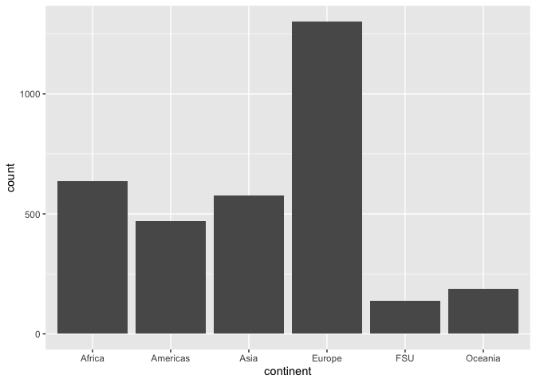<!-- -->

Great, but what the heck is FSU?

``` r
gapminder_unfiltered %>% 
   filter(continent == "FSU") %>% 
   count(country)
```

    ## # A tibble: 9 × 2
    ##   country        n
    ##   <fct>      <int>
    ## 1 Armenia        4
    ## 2 Belarus       18
    ## 3 Georgia        9
    ## 4 Kazakhstan     4
    ## 5 Latvia        42
    ## 6 Lithuania     18
    ## 7 Russia        20
    ## 8 Ukraine       20
    ## 9 Uzbekistan     4

Aha! FSU == Former Soviet Union.

Let’s get a sense of how many countries there are and how many entries
each has:

``` r
count(gapminder_unfiltered, country, sort = T)
```

    ## # A tibble: 187 × 2
    ##    country             n
    ##    <fct>           <int>
    ##  1 Czech Republic     58
    ##  2 Denmark            58
    ##  3 Finland            58
    ##  4 Iceland            58
    ##  5 Japan              58
    ##  6 Netherlands        58
    ##  7 Norway             58
    ##  8 Portugal           58
    ##  9 Slovak Republic    58
    ## 10 Spain              58
    ## # … with 177 more rows

So we know there ar 187 unique countries and that the max number of
observations is 58.

Ok, 58 seems to be the MAX and MODAL number of entries. Let’s see how
many countries meet that criteria:

``` r
gapminder_unfiltered %>% 
   count(country) %>% 
   ggplot(aes(n)) +
   geom_histogram()
```

    ## `stat_bin()` using `bins = 30`. Pick better value with `binwidth`.

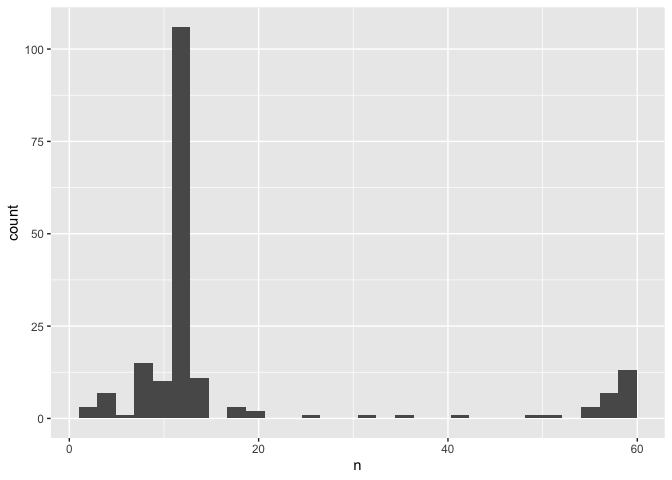<!-- -->

This probably varies greatly by year. Let’s see what this looks like for
year:

``` r
gapminder_unfiltered %>% 
   count(year) %>% 
   ggplot(aes(year, n)) +
   geom_line()
```

<!-- -->

Some interesting periodicity. Clearly we are getting the maximum (or
near maximum) number of observations in years ending in 2 and 7. And
there seems to be a core of about 25 countries that are observed every
year.

## Data Cleaning

All the variable understanding above has moved us to a point where we
are ready to clean up the data. Typically data cleaning in your initial
exploration would focus on:

-   Removing redundant variables
-   Variable selection
-   Removing outliers

The variables in the dataset are already pretty limited - I don’t see
much fat to cut. So we’ll skip right to removing outliers. In this
particular dataset it’s more a question of limiting our data only to
those countries that have a high number of observations.

For our purposes, let’s limit this to its most recent 30 year span, and
take only countries that show up at least 25 times:

``` r
d1 <- gapminder_unfiltered %>% 
   filter(year >= 1977) %>% 
   group_by(country) %>% 
   mutate(n_obs = n()) %>% 
   filter(n_obs >= 25)
```

Let’s see what that looks like by country:

``` r
ggplot(d1, aes(fct_infreq(country))) +
   geom_bar() +
   coord_flip()
```

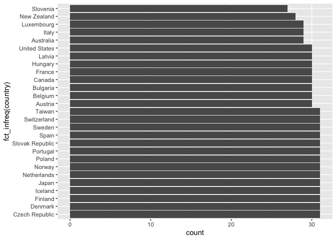<!-- -->

We can then filter the data down to just those countries

``` r
filtered_countries <- d1 %>% select(country) %>% as_vector

d2 <- gapminder_unfiltered %>% 
   filter(country %in% filtered_countries,
          year >= 1977)
```

## Variable Understanding: Continuous Variables

Now let’s focus on understanding our continuous variables. (We’ll
continue to use the unfiltered data just to simulate EDA on a larger
dataset). Here we’ll look specifically at `gdpPercap`. First step here
is to run a basic histogram to get a sense of the “shape” of the data:

``` r
ggplot(gapminder_unfiltered, aes(gdpPercap)) +
   geom_histogram()
```

    ## `stat_bin()` using `bins = 30`. Pick better value with `binwidth`.

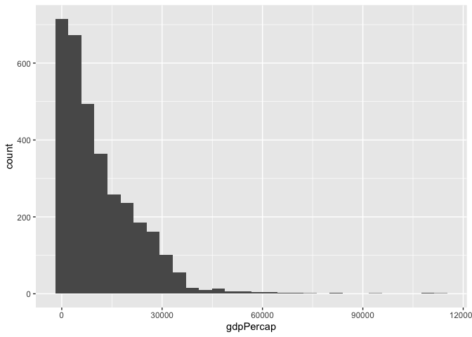<!-- -->

A histogram divides the x-axis into equally spaced bins and then uses
the height of a bar to display the number of observations that fall in
each bin. The tallest bar shows that about 78 observations have a Per
Capita GDP of about \$20,000.

Moreover, the histogram shows that there is not a ton of variability
here. High kurtosis (mode is more common than it would be in a normal
distribution).

Note that the histogram defaulted to 30 “bins” of the data. You can
rerun the histogram with a different number of bins OR you can designate
the bin width. This could really change the “look” of the data, so you
should always try a bunch of different bin widths, because it could
reveal different patterns.

``` r
ggplot(gapminder_unfiltered, aes(gdpPercap)) +
   geom_histogram(binwidth = 1000)
```

<!-- -->

We can also use a boxplot on this, but, as you’ll see below, I don’t
think it’s as useful as the histogram version.

``` r
ggplot(gapminder_unfiltered, aes(gdpPercap)) +
   geom_boxplot() +
   coord_flip()
```

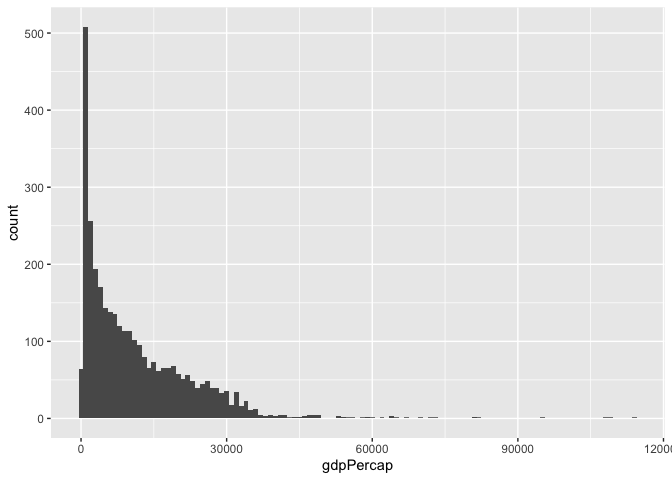<!-- -->

Boxplots are odd, but can be incredibly useful (invented by Tukey, btw).
Here’s a great description of how they work:


## Covariation: Analyzing relationships between variables

### Continuous / Categorical interaction

There’s probably some big variation here depending upon other factors
like `region` so let’s look at that by using `facet_wrap()` a VERY
useful tool for EDA that panels your plot by a categorical variable of
your choosing:

``` r
ggplot(gapminder_unfiltered, aes(gdpPercap)) +
   geom_histogram() +
   facet_wrap(~ continent)
```

    ## `stat_bin()` using `bins = 30`. Pick better value with `binwidth`.

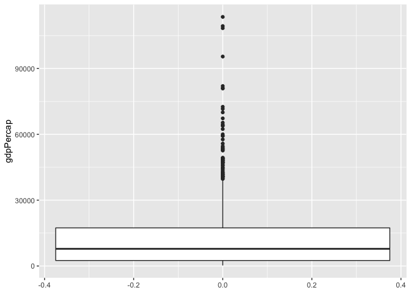<!-- -->

We could again do this through boxplots:

``` r
ggplot(gapminder_unfiltered, aes(x = continent, y = gdpPercap)) +
   geom_boxplot()
```

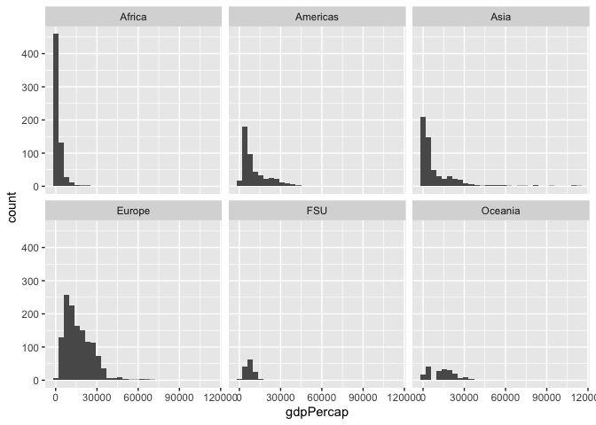<!-- -->

That’s a lot more useful than our previous histogram. We don’t have as
much information as we got with the faceted bars, but everything is more
compact so we can more easily compare them.

We can also do a little manipulation of this to make it slightly more
readable:

``` r
ggplot(gapminder_unfiltered, aes(x = reorder(continent, gdpPercap, FUN = median), y = gdpPercap)) +
   geom_boxplot()
```

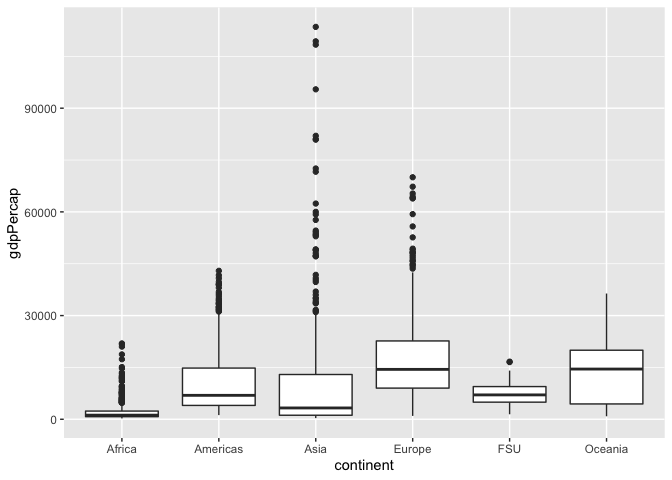<!-- -->

Flipping this might also help:

``` r
ggplot(gapminder_unfiltered, aes(x = reorder(continent, gdpPercap, FUN = median), y = gdpPercap)) +
   geom_boxplot() +
   coord_flip()
```

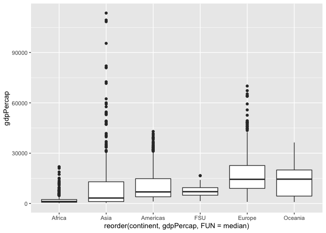<!-- -->

Let’s revisit the facet, but instead of using counts, we can use
`..density..` as the y argument in the `aes` function:

``` r
ggplot(gapminder_unfiltered, aes(gdpPercap, ..density..)) +
   geom_histogram() +
   facet_wrap(~ continent)
```

    ## `stat_bin()` using `bins = 30`. Pick better value with `binwidth`.

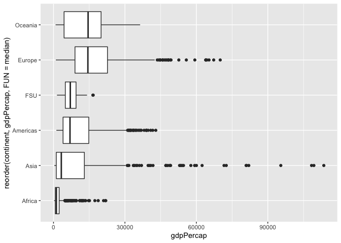<!-- -->

You’ll notice that in this and the previous facet examples, the facets’
axes were fixed. You can change this in an argument to `facet_wrap`,
where you can set `scales = "free"` to have both x and y vary in each
facet, or you could also set them either `free_x` or `free_y`:

``` r
ggplot(gapminder_unfiltered, aes(gdpPercap, ..density..)) +
   geom_histogram() +
   facet_wrap(~ continent, scales = "free")
```

    ## `stat_bin()` using `bins = 30`. Pick better value with `binwidth`.

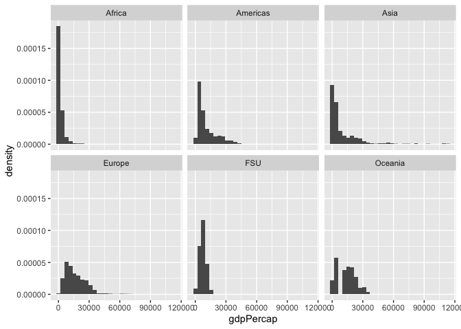<!-- -->

### Numeric / Numeric interaction

A very useful option for visual EDA is the `pairs` function that comes
as part of R’s base graphics option:

``` r
pairs(gapminder_unfiltered)
```

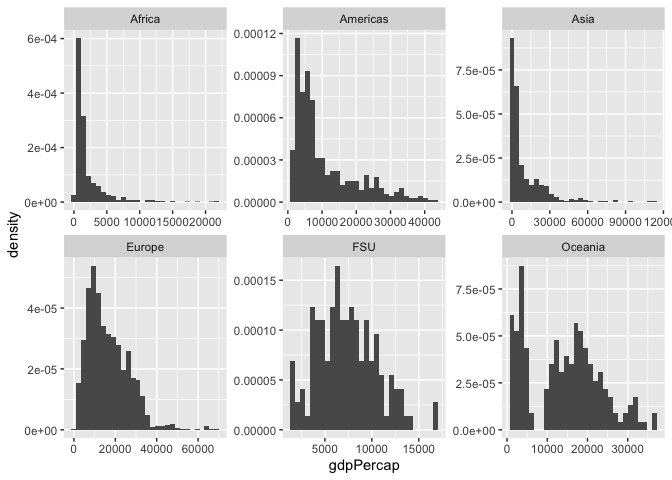<!-- -->

Each text box represents a variable, each of the graphics in the row of
that text box has that variable as the X axis, while each of the
graphics in the column of that text box has that variable as the Y-axis.

Of course, it’s still pretty hard to understand - the boxes are small
and the `country` and `continent` graphs are odd because they’re
categorical data. Let’s get rid of them using a smart select function:

``` r
gapminder_unfiltered %>% 
   select_if(is.numeric) %>% 
   pairs
```

<!-- -->

This is easier to read; life expectancy generally increases over time
and with higher GDP, and population and GDP both increase over time.
Most importantly, it doesn’t point to anything especially wrong with our
data.

## Analyzing Patterns

Now we move into the next part of EDA, in which we’ve gone beyond data
understanding, data cleansing and looking for mistakes. Now we start to
look at patterns and see if we can find anything interesting in the
data. You’re going to run into dead ends, but this is how you refine
your analysis.

More specifically, you are going to engage in an iterative cycle of:

-   Generate questions about your data
-   Search for answers by visualizing, transforming, and modelling your
    data
-   Use what you learn to refine your questions and/or generate new
    questions.

Let’s look specifically at the first pattern we noticed in the `pairs`
chart above - the relationship between GDP and life expectancy.

``` r
ggplot(gapminder_unfiltered, aes(gdpPercap, lifeExp)) +
   geom_point()
```

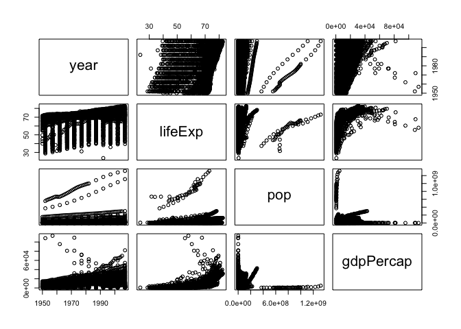<!-- -->

This is pretty interesting! It appears as though higher GDP is
associated with higher life expectancy, but only to a point. Let’s put a
trend line through it to see what the model tells us:

``` r
ggplot(gapminder_unfiltered, aes(gdpPercap, lifeExp)) +
   geom_point() +
   geom_smooth()
```

    ## `geom_smooth()` using method = 'gam' and formula 'y ~ s(x, bs = "cs")'

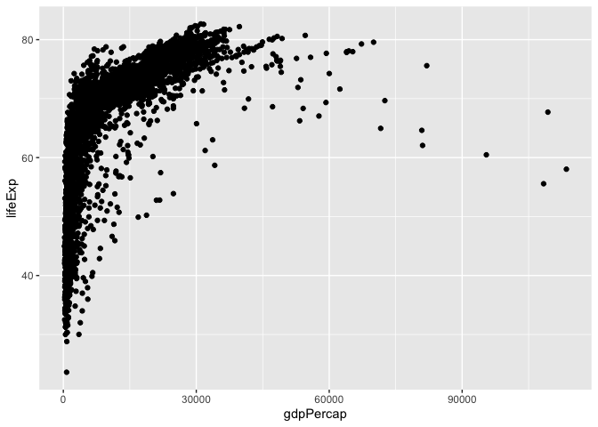<!-- -->

This sort of shape - where there is an obvious and single curve to the
data - makes me think that log-transforming the data might make sense.

``` r
ggplot(gapminder_unfiltered, aes(gdpPercap, lifeExp)) +
   geom_point() +
   scale_x_log10() +
   geom_smooth()
```

    ## `geom_smooth()` using method = 'gam' and formula 'y ~ s(x, bs = "cs")'

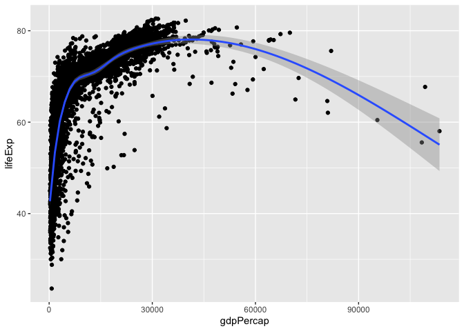<!-- -->

This gives us a nice linear relationship.

Let’s think about how other variables come into play here. Certainly
this will vary by continent:

``` r
ggplot(gapminder_unfiltered, aes(gdpPercap, lifeExp)) +
   geom_point() +
   geom_smooth() +
   scale_x_log10() +
   facet_wrap(~ continent, scales = "free") 
```

    ## `geom_smooth()` using method = 'gam' and formula 'y ~ s(x, bs = "cs")'

<!-- -->

You might also think about how it varies by year. We can add year to the
previous chart encoded by color:

``` r
ggplot(gapminder_unfiltered, aes(gdpPercap, lifeExp)) +
   geom_point(aes(color = year)) +
   geom_smooth() +
   scale_x_log10() +
   facet_wrap(~ continent, scales = "free") 
```

    ## `geom_smooth()` using method = 'gam' and formula 'y ~ s(x, bs = "cs")'

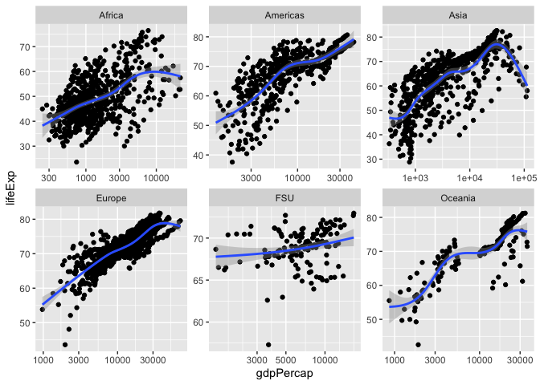<!-- -->

This helps. You can see that a lot of the darker (older) dots are lower
on the life expectancy axis, while lighter (newer) are higher. Let’s do
a more direct comparison here between different epochs of data.

``` r
gapminder_unfiltered %>% 
   mutate(epoch = ifelse(year < 1980, "pre-1980", "1980 +")) %>% 
   ggplot(aes(gdpPercap, lifeExp)) +
   geom_point(aes(color = epoch)) +
   geom_smooth() +
   scale_x_log10() +
   facet_wrap(~ continent, scales = "free")
```

    ## `geom_smooth()` using method = 'gam' and formula 'y ~ s(x, bs = "cs")'

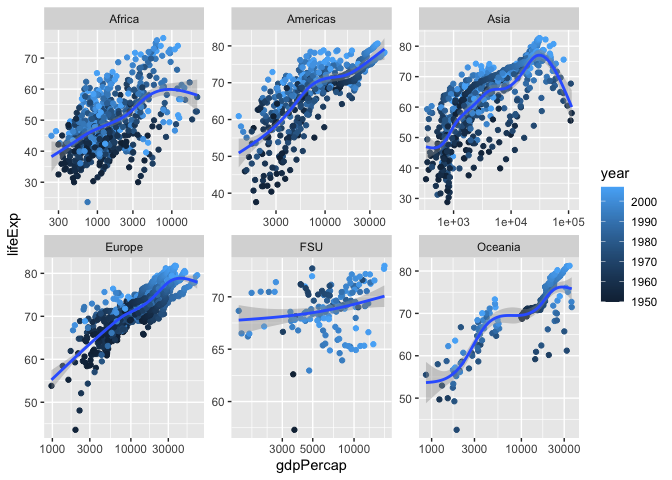<!-- -->

That confirms what we expected, though certainly there are some
interesting outliers.

So we have a pattern, and now we need to ask ourselves some questions
about it:

-   Could this pattern be due to coincidence?
-   How can you describe the relationship implied by the pattern?
-   How strong is the relationship implied by the pattern?
-   What other variables might affect the relationship?
-   Does the relationship change if you look at individual subgroups of
    data?

## Inspiration & Guidance

-   Mike Mahoney’s [“Introduction to Data Exploration and Analysis with
    R”](https://bookdown.org/mikemahoney218/IDEAR/introduction-to-data-analysis.html#exploratory-data-analysis).
-   Terence Shin’s [“An Extensive Step by Step Guide to Exploratory Data
    Analysis”](https://towardsdatascience.com/an-extensive-guide-to-exploratory-data-analysis-ddd99a03199e)
