Mapping Demo
================
Alex Lundry
2022-09-13

There are several ways to create a map in R, and there is a great deal
you can do with geo-spatial data in terms of geocomputation and spatial
analysis. BUT, those are incredibly dense subjects that take up entire
degree programs in and of themselves, so we must be thoughtful about
what we spend time on. For the purposes of this course, we will focus on
just a few specific components of map-making you are most likely to
encounter in the public policy world:

-   Creating basic maps
-   Map projections
-   Adding layers to our maps
-   Creating choropleth maps
-   Adding base image tiles from mapping services
-   Geocoding
-   Geographic Data
-   Using shape files (especially DMAs and CDs)
-   Creating custom regions
-   Cartograms and Hexbins
-   Using Census Data

We’ll rely upon several packages along the way, but here are the first
two you’ll need:

For our initial foray into mapmaking, we’ll be using **ggplot2** along
with data from the **maps** package. There is a special function in
**ggplot** that allows us to reformat `maps` data using a `map_data()`
function.

``` r
world_map <- map_data(map = "world")
state_map <- map_data(map = "state")
va_state_map <- map_data(map = "state", region = "virginia")
county_map <- map_data(map = "county")
va_county_map <- map_data(map = "county", region = "virginia")
```

The `map_data()` function calls `map()` (a function from the **maps**
library) and then reformats the returned data, converting it to a data
frame. Notice that the first argument is the `database =` which
specifies `usa, state, county, world` and others. The `regions =`
argument can limit the map to certain regions.

Take a look at the data frame it generates:

``` r
glimpse(state_map)
```

    ## Rows: 15,537
    ## Columns: 6
    ## $ long      <dbl> -87.46201, -87.48493, -87.52503, -87.53076, -87.57087, -87.5…
    ## $ lat       <dbl> 30.38968, 30.37249, 30.37249, 30.33239, 30.32665, 30.32665, …
    ## $ group     <dbl> 1, 1, 1, 1, 1, 1, 1, 1, 1, 1, 1, 1, 1, 1, 1, 1, 1, 1, 1, 1, …
    ## $ order     <int> 1, 2, 3, 4, 5, 6, 7, 8, 9, 10, 11, 12, 13, 14, 15, 16, 17, 1…
    ## $ region    <chr> "alabama", "alabama", "alabama", "alabama", "alabama", "alab…
    ## $ subregion <chr> NA, NA, NA, NA, NA, NA, NA, NA, NA, NA, NA, NA, NA, NA, NA, …

We have a stunning 15,537 rows! Why? Notice the columns available here,
especially: long, lat, group and order. Each row represents a specific
point on the map (lat/long). The group tells you what specific shape
(state) it is a part of, and order tells you the order in which to draw
lines (the border) from point to point. You need a lot of lines to draw
a good-looking map!

### Map Boundaries

Here is an example for the polygon for the state of Virginia. Remember
how ggplot builds in layers. Let’s first just create the plot, and then
add a `geom_point` to reinforce how our data frame is just a series of
locations that represent points along the border.

``` r
va <- ggplot(va_state_map, aes(long, lat, group = group))

va +
   geom_point()
```

<!-- -->

Now let’s connect those lines to give us an actual border!

``` r
va +
   geom_point() +
   geom_path(color = "blue")
```

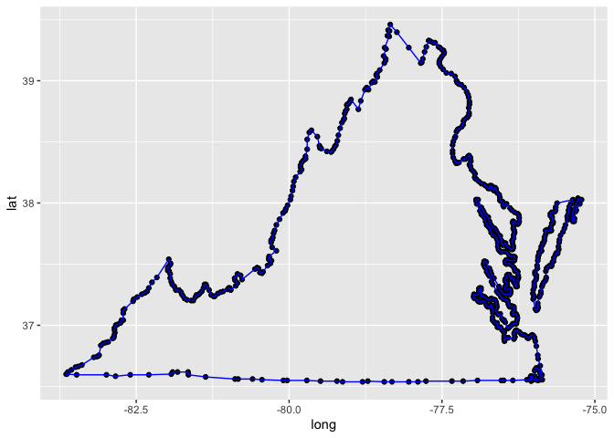<!-- -->

Notice that the data in `va_state_map` is already ordered by the `order`
column. This is done deliberately - it controls how the lines are
connected. If we change the order of the data, we will get a wacky
result:

``` r
unordered <- slice_sample(va_state_map, n = 734) #randomly reorder the rows

ggplot(unordered, aes(long, lat, group = group)) + 
   geom_path(color = "blue")
```

<!-- -->

If you find that the data is not ordered properly (usually the result of
merging datasets), just reorder `arrange()` by `group` and `order`:

``` r
ggplot(arrange(unordered, group, order), aes (long, lat, group = group)) +
   geom_path(color = "blue")
```

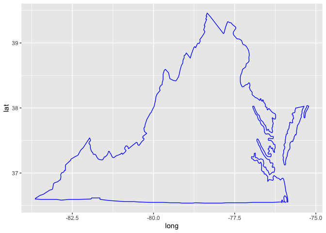<!-- -->

You may have noticed that in each call we use the `group` aesthetic.
This tells ggplot how to segment the drawing of points. This was
necessary in our Virginia maps because there is non-contiguous territory
that is part of the Commonwealth. Take a look at what happens if we
didn’t use the `group` aesthetic:

``` r
ggplot(va_state_map, aes(long, lat)) +
   geom_path()
```

<!-- -->

We get that funky line connecting the Delmarva peninsula to Northern
Virginia. If we were mapping an entirely contiguous territory, such as
Kentucky, we could get away without the group aesthetic. But probably
just better to include it no matter what.

Now, the `group` aesthetic is especially useful if we have map data with
multiple regions/groups. Take, for example, showing the states on a US
map.

``` r
us <- ggplot(state_map, aes(long, lat, group = group))

us +
   geom_path()
```

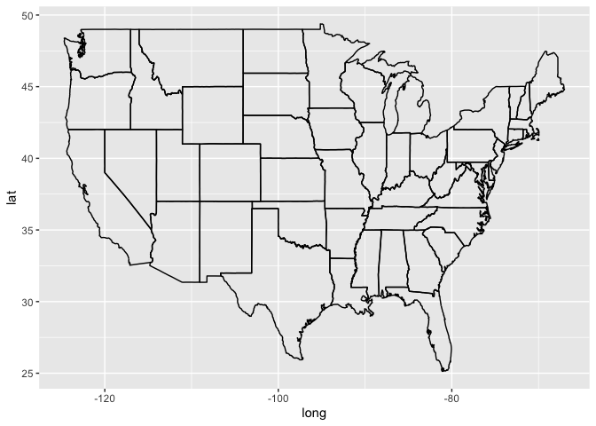<!-- -->

It draws a *path* (border) for each *group* (state). Now, we’ve been
using `geom_path`, but you could just as easily use `geom_polygon`,
which is just like `geom_path` but actually better because it allows for
a fill color:

``` r
us +
   geom_polygon(fill = "white", color = "orange")
```

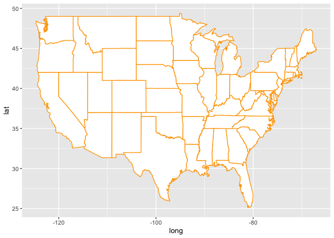<!-- -->

### Map Projections

You may have noticed that our maps don’t look quite right. Look at that
razor sharp edge on the Northern border with Canada! That ain’t right.
We need to use a map projection to better display a non-flat Earth on a
flat surface. Transformations (or spatial projections) can help show a
map with better proportions. To change it, we use the `coord_map`
function and tell it the projection we’d like to use.

``` r
usmap <- us + geom_polygon(fill="white", color="black") # initial map object

#- default coord_map(): mercator projection
usmap + coord_map() + ggtitle("Mercator")
```

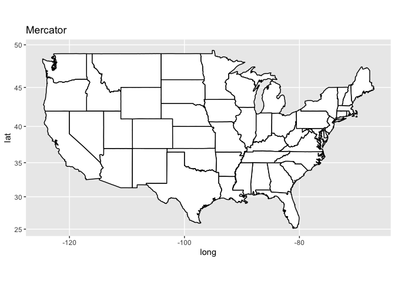<!-- -->

``` r
#- polyconic projection
usmap + coord_map("polyconic") + ggtitle("Polyconic")
```

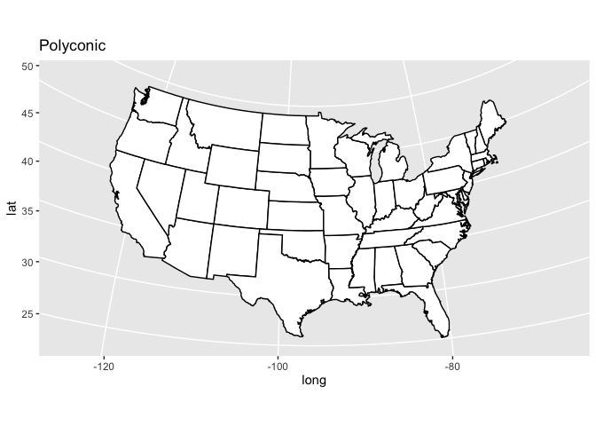<!-- -->

``` r
#- albers projection
usmap + coord_map("albers", lat0=29.5, lat1=45.4) + ggtitle("Albers")
```

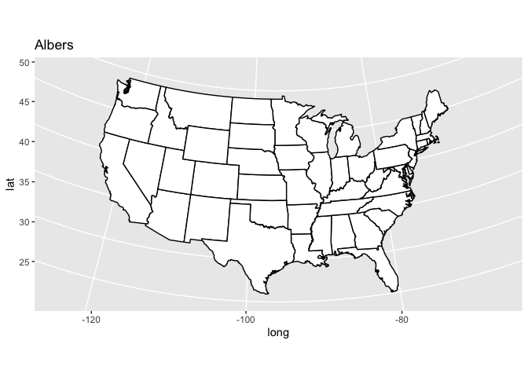<!-- -->

A few things here: notice that Mercator is the default (blegh!) and that
for the Albers projection, which is one we will frequently use, we pass
it two latitude parameters, lat0 and lat1. In the example above, we are
using their conventional values for a US map. (Why those values and what
do they mean? Let’s avoid going down the deep, deep, deep rabbit-hole
that is the Coordinate Reference System).

### Adding Layers

Remember that ggplot is a layered graphics system. So, we can layer
additional data onto the map. Let’s start with just adding some cities
to the map. The `us.cities` dataset in the `maps` package contains lat,
long, and population (2006 estimate) for 1005 of the largest cities in
the US. Let’s add this to our US map.

``` r
#- Create base map
base_map <-  ggplot(state_map, aes(x=long, y=lat)) +
   geom_polygon(aes(group=group), fill="white", color="lightgrey") +
   coord_map("albers", lat0=29.5, lat1=45.4)

base_map
```

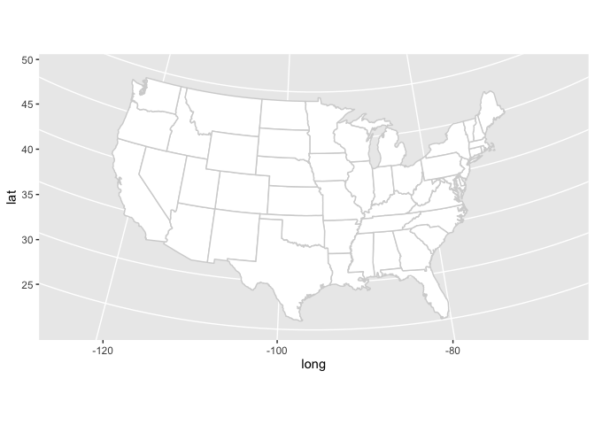<!-- -->

Notice that the group aesthetic is moved to `geom_polygon()`. If this
was left in `ggplot()`, then every other geom must use the group
aesthetic. Since `geom_point()` and `geom_text()` are going to use the
`us.capitals` data, there is no group designation in the initial
declaration.

``` r
# get us city info
data(us.cities) # notice the `capital == 2` for state capitals; no idea why its 2 and not 1

# I only want capital cities for continental US (remove Alaska and Hawaii)
us_capitals <- us.cities %>% filter(capital==2, !country.etc %in% c("AK", "HI"))

# Make the map
base_map +
   geom_point(data=us_capitals, color="blue", size=2) +
   geom_text(data=us_capitals, aes(label=name),
             size=2.5, vjust=1, hjust=1)
```

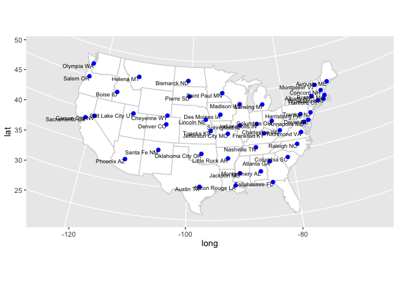<!-- -->

Notice that `aes(x=long, y=lat)` is inherited from `base_map` for
`geom_point()` and `geom_text()`

### Choropleth Maps

Choropleth Maps are thematic maps in which areas are shaded or patterned
in proportion to the measurement of the statistical variable being
displayed on the map, such as population density or per-capita income.
So we need to first begin by having data to display.

The easiest way to do this is simply adding a column to the map data
that contains the value we want to represent with a color. So let’s do
something simple and create a column that has the length of the name of
the county and map this to a fill color.

``` r
county_data_map <- county_map %>%
   mutate(length=str_length(subregion))

head(county_data_map)
```

    ##        long      lat group order  region subregion length
    ## 1 -86.50517 32.34920     1     1 alabama   autauga      7
    ## 2 -86.53382 32.35493     1     2 alabama   autauga      7
    ## 3 -86.54527 32.36639     1     3 alabama   autauga      7
    ## 4 -86.55673 32.37785     1     4 alabama   autauga      7
    ## 5 -86.57966 32.38357     1     5 alabama   autauga      7
    ## 6 -86.59111 32.37785     1     6 alabama   autauga      7

Let’s map it:

``` r
ggplot(county_data_map, aes(x=long, y=lat, group=group)) +
   geom_polygon(aes(fill = length), color='grey') + 
   ggtitle("Length of County Name")
```

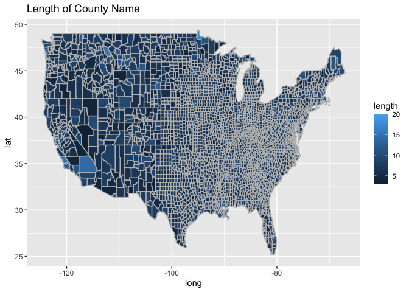<!-- --> Ok!
But those borders are way too over the top, and there’s no projection.
Let’s clean that up:

``` r
ggplot(county_data_map, aes(x=long, y=lat, group=group)) + # use new data_map
   geom_polygon(aes(fill = length), color= NA) +
   geom_path(color = "grey", size = .1, alpha = .2) +
   coord_map("polyconic") +
   ggtitle("Length of County Name")
```

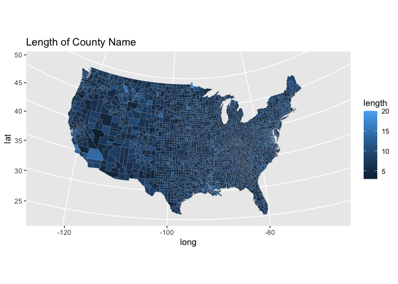<!-- -->

#### Getting actual data

Let’s do a choropleth with some actual data. Let’s use gun violence data
from Wikipedia. The code below uses a web scraping library called
`rvest` which you’ll probably pick up at some point along the way, but
we won’t go into detail here.

``` r
#- get wiki table
library(rvest) # this is web scraping library
```

    ## 
    ## Attaching package: 'rvest'

    ## The following object is masked from 'package:readr':
    ## 
    ##     guess_encoding

``` r
url <- 'https://en.wikipedia.org/wiki/Gun_violence_in_the_United_States_by_state'

guns <- read_html(url) %>% # get webpage html
   html_node("#mw-content-text > div.mw-parser-output > table:nth-child(14)") %>% # figured out the node using "inspect element" in Chrome
   html_table()

#- clean column names
colnames(guns) = c('state','pop', 'murders_manslaughter', 'murders', 'gun_murders',
                'hh_gun_ownership','murders_manslaughter_rate','murder_rate',
                "gun_murder_rate")

# convert data read in as characters to numerics
guns <- guns %>% 
   mutate(murders = as.numeric(murders), 
          gun_murders = as.numeric(gun_murders),
          murder_rate = as.numeric(murder_rate),
          gun_murder_rate = as.numeric(gun_murder_rate))
```

    ## Warning in mask$eval_all_mutate(quo): NAs introduced by coercion

    ## Warning in mask$eval_all_mutate(quo): NAs introduced by coercion

    ## Warning in mask$eval_all_mutate(quo): NAs introduced by coercion

    ## Warning in mask$eval_all_mutate(quo): NAs introduced by coercion

``` r
glimpse(guns)
```

    ## Rows: 50
    ## Columns: 9
    ## $ state                     <chr> "Alabama", "Alaska", "Arizona", "Arkansas", …
    ## $ pop                       <int> 4903185, 731545, 7278717, 3017804, 39512223,…
    ## $ murders_manslaughter      <int> 358, 69, 365, 242, 1690, 218, 104, 48, 1122,…
    ## $ murders                   <dbl> NA, 69, 337, 231, 1679, 209, 104, 48, NA, 44…
    ## $ gun_murders               <dbl> NA, 44, 213, 177, 1142, 135, 65, 40, NA, 367…
    ## $ hh_gun_ownership          <int> 52, 57, 36, 51, 16, 37, 18, 38, 28, 37, 9, 5…
    ## $ murders_manslaughter_rate <dbl> 7.3, 9.4, 5.0, 8.0, 4.3, 3.8, 2.9, 4.9, 5.2,…
    ## $ murder_rate               <dbl> NA, 9.4, 4.6, 7.7, 4.2, 3.6, 2.9, 4.9, NA, 4…
    ## $ gun_murder_rate           <dbl> NA, 6.0, 2.9, 5.9, 2.9, 2.3, 1.8, 4.1, NA, 3…

Now we need to create a new column in our map data that takes our
variable of interest (let’s make it the proportion of murders that are
committed by firearms. There are a few NAs, so let’s replace those with
the mean for all available states (not a best practice, but just doing
it for the sake of the demo here)

``` r
guns <- guns %>% 
   mutate(prop_gun_murders = gun_murders / murders, 
          prop_gun_murders = replace_na(prop_gun_murders, mean(prop_gun_murders, na.rm = T)),
          prop_gun_murders_decile = cut_number(prop_gun_murders, n=10))

ggplot(guns, aes(reorder(state, prop_gun_murders), prop_gun_murders)) +
   geom_bar(stat = "identity") +
   coord_flip()
```

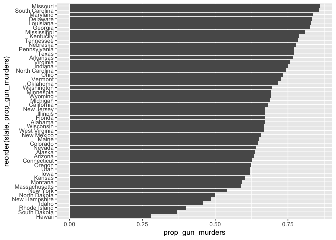<!-- -->

Now that we have the variable of interest, we need to join that into the
US state map data. Take a look at the map data to see what approach our
join needs to take.

``` r
map_data(map = "state") %>% head()
```

    ##        long      lat group order  region subregion
    ## 1 -87.46201 30.38968     1     1 alabama      <NA>
    ## 2 -87.48493 30.37249     1     2 alabama      <NA>
    ## 3 -87.52503 30.37249     1     3 alabama      <NA>
    ## 4 -87.53076 30.33239     1     4 alabama      <NA>
    ## 5 -87.57087 30.32665     1     5 alabama      <NA>
    ## 6 -87.58806 30.32665     1     6 alabama      <NA>

Notice that we have the state name in the `region` variable, but in all
lower case. So let’s get that joined in:

``` r
guns <- guns %>% 
   mutate(region = str_to_lower(state))

state_data <- left_join(map_data(map = "state"), guns)
```

    ## Joining, by = "region"

``` r
glimpse(state_data)
```

    ## Rows: 15,537
    ## Columns: 17
    ## $ long                      <dbl> -87.46201, -87.48493, -87.52503, -87.53076, …
    ## $ lat                       <dbl> 30.38968, 30.37249, 30.37249, 30.33239, 30.3…
    ## $ group                     <dbl> 1, 1, 1, 1, 1, 1, 1, 1, 1, 1, 1, 1, 1, 1, 1,…
    ## $ order                     <int> 1, 2, 3, 4, 5, 6, 7, 8, 9, 10, 11, 12, 13, 1…
    ## $ region                    <chr> "alabama", "alabama", "alabama", "alabama", …
    ## $ subregion                 <chr> NA, NA, NA, NA, NA, NA, NA, NA, NA, NA, NA, …
    ## $ state                     <chr> "Alabama", "Alabama", "Alabama", "Alabama", …
    ## $ pop                       <int> 4903185, 4903185, 4903185, 4903185, 4903185,…
    ## $ murders_manslaughter      <int> 358, 358, 358, 358, 358, 358, 358, 358, 358,…
    ## $ murders                   <dbl> NA, NA, NA, NA, NA, NA, NA, NA, NA, NA, NA, …
    ## $ gun_murders               <dbl> NA, NA, NA, NA, NA, NA, NA, NA, NA, NA, NA, …
    ## $ hh_gun_ownership          <int> 52, 52, 52, 52, 52, 52, 52, 52, 52, 52, 52, …
    ## $ murders_manslaughter_rate <dbl> 7.3, 7.3, 7.3, 7.3, 7.3, 7.3, 7.3, 7.3, 7.3,…
    ## $ murder_rate               <dbl> NA, NA, NA, NA, NA, NA, NA, NA, NA, NA, NA, …
    ## $ gun_murder_rate           <dbl> NA, NA, NA, NA, NA, NA, NA, NA, NA, NA, NA, …
    ## $ prop_gun_murders          <dbl> 0.6714014, 0.6714014, 0.6714014, 0.6714014, …
    ## $ prop_gun_murders_decile   <fct> "(0.663,0.672]", "(0.663,0.672]", "(0.663,0.…

Now we can create the choropleth maps using what we went over earlier:

``` r
m1 <- ggplot(state_data, aes(x=long, y=lat, group=group)) + # use new data_map
   geom_polygon(aes(fill = prop_gun_murders), color= NA) +
   geom_path(color = "grey", size = .1, alpha = .2) +
   coord_map("polyconic") +
   labs(title = "Proportion of Murders that are Gun Related by State",
        caption = "No data available for AL, FL, IL - NAs replaced with mean ") +
   theme_void()

m1
```

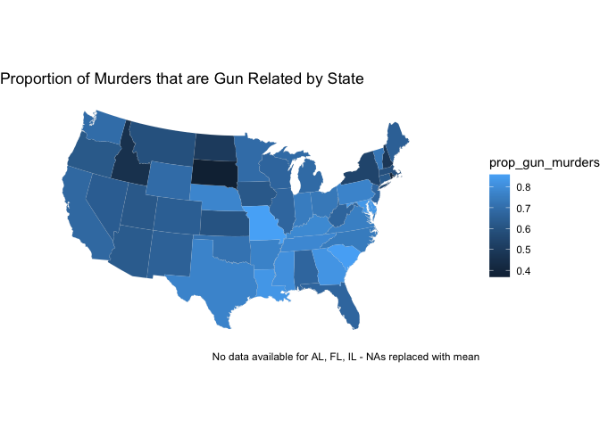<!-- -->

Let’s change the fill color scale with the `scale_fill_` family of
functions. We will use `scale_fill_gradient2()` to make a diverging
color scale that resembles traffic light colors with red as the highest
value, yellow set to the mean, and green as the low.

``` r
m1 +
   scale_fill_gradient2(low="green", mid='yellow', high="red",
                        midpoint=mean(guns$prop_gun_murders))
```

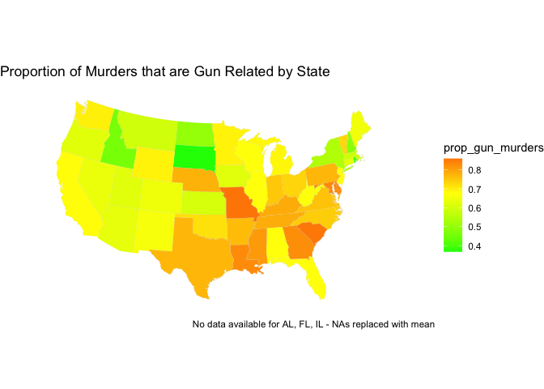<!-- -->

Here’s an alternative map using the deciles variable and some different
color mechanisms, specifically the colorBrewer diverging pallette that
goes from Purple (high) to Orange (low):

``` r
ggplot(state_data, aes(x=long, y=lat, group=group)) + # use new data_map
   geom_polygon(aes(fill = prop_gun_murders_decile), color= NA) +
   geom_path(color = "grey", size = .1, alpha = .2) +
   scale_fill_brewer(type = "div", palette = "PuOr", name = "") +
   guides(fill = guide_legend(reverse = T)) +
   coord_map("polyconic") +
   labs(title = "Proportion of Murders that are Gun Related by State",
        caption = "No data available for AL, FL, IL - NAs replaced with mean ") +
   theme_void()
```

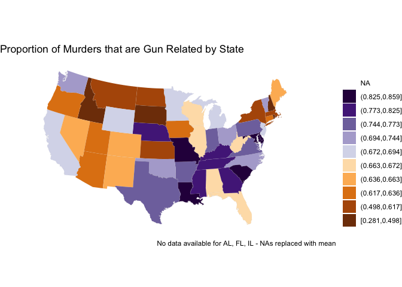<!-- -->

### ggmap Package

``` r
library(ggmap)
```

    ## Google's Terms of Service: https://cloud.google.com/maps-platform/terms/.

    ## Please cite ggmap if you use it! See citation("ggmap") for details.

You can use the **ggmap** library to pull in tiled basemaps from
different services, like Google Maps, OpenStreetMaps, or Stamen Maps.

The default uses Google Maps, and in order to do this, you must have a
registered API key with Google. To obtain an API key and enable services
you have to visit [this
website](https://cloud.google.com/maps-platform/). You’ll have to use a
registered Google account, and use a credit card to become a verified
user. But note that account is free and your credit card should not be
charged for low volume use. Please pay attention to the details as you
sign up to make sure you don’t automatically end up registering for
access that will cost you money!

Once registered, copy that API key. To tell ggmap about your API key,
use the `register_google` function with `key = INSERTYOURKEYHERE` as the
parameter. If you want to set it permanently then add the parameter
`write = TRUE`, otherwise, you’ll have to reregister each time you
restart R.

**IMPORTANT SECURITY INFORMATION - MUST READ** *This comes from the
ggmap documentation*

> Users should be aware that the API key, a string of jarbled
> characters/numbers/symbols, is a PRIVATE key - it uniquely identifies
> and authenticates you to Google’s services. If anyone gets your API
> key, they can use it to masquerade as you to Google and potentially
> use services that you have enabled. Since Google requires a valid
> credit card to use its online cloud services, this also means that
> anyone who obtains your key can potentially make charges to your card
> in the form of Google services. So be sure to not share your API key.
> To mitigate against users inadvertantly sharing their keys, by default
> ggmap never displays a user’s key in messages displayed to the
> console.

> Users should also be aware that ggmap has no mechanism with which to
> safeguard the private key once registered with R. That is to say, once
> you register your API key, any function R will have access to it. As a
> consequence, ggmap will not know if another function, potentially from
> a compromised package, accesses the key and uploads it to a third
> party. For this reason, when using ggmap we recommend a heightened
> sense of security and self-awareness: only use trusted packages, do
> not save API keys in script files, routinely cycle keys (regenerate
> new keys and retire old ones), etc. Google offers features to help in
> securing your API key, including things like limiting queries using
> that key to a particular IP address, as well as guidance on security
> best practices. See
> <https://cloud.google.com/docs/authentication/api-keys#securing_an_api_key>
> for details.

The **ggmap** function `get_map` lets us grab a tiled base map by giving
it a location and a zoom level. It defaults to Google, but you can also
designate `source = "osm"` for Open Street Map or `source = "stamen"`
for Stamen maps. For each source there are a variety of `maptype =`
options.

Below we obtain a map of the US at a zoom level of 3. I’ve also
designated the extreme lats and longs for the continental US so we can
zoom in as tightly as possible on the map we generate.

Once we have the base map, we can visualize it just by calling `ggmap()`
with the map object as the parameter.

``` r
us <- get_map("united states", zoom=3)
```

    ## Source : https://maps.googleapis.com/maps/api/staticmap?center=united%20states&zoom=3&size=640x640&scale=2&maptype=terrain&language=en-EN&key=xxx

    ## Source : https://maps.googleapis.com/maps/api/geocode/json?address=united+states&key=xxx

``` r
left <- -124.7844079 # westernmost long in continental us
bottom <-   24.7433195 # southernmost lat in continental us
right <- -66.9513812 # easternmost long in continental us
top <-  49.3457868 # northernmost lat in continental us

ggmap(us)
```

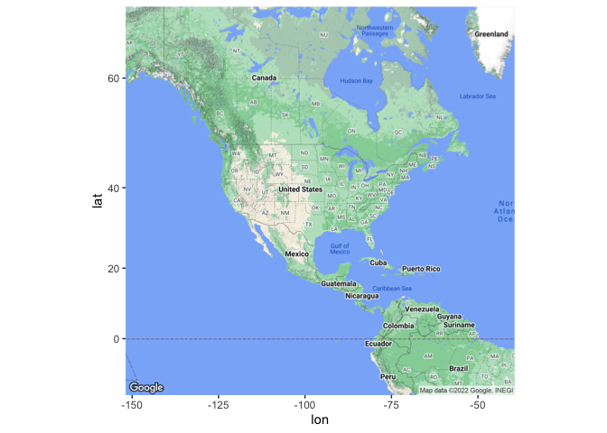<!-- -->

Now we can take that basemap and just add to it, the same way we did
earlier. This will overlay a choropleth map on top of it. Notice that we
need to redesignate the data and aesthetic mappings in `geom_polygon`
and `geom_path` because those are using different datasets and
aesthetics than the ggmap.

I’ve added a `scale_x_continuous` and `scale_y_continuous` so that we
trim the map down to only the continental US. Otherwise, it is
essentially the same code call from the previous section on choropleth
maps.

``` r
ggmap(us) +
   geom_polygon(data = state_data, aes(x = long, y = lat, group = group, fill = prop_gun_murders_decile), color = NA, alpha = 0.6) +
   geom_path(data = state_data, aes(x = long, y = lat, group = group), color = "grey", size = .1, alpha = .2) +
   scale_x_continuous(limits = c(left, right)) +
   scale_y_continuous(limits = c(bottom, top)) +
   scale_fill_brewer(type = "div", palette = "PuOr", name = "") +
   guides(fill = guide_legend(reverse = T)) +
   labs(title = "Proportion of Murders that are Gun Related by State",
        caption = "No data available for AL, FL, IL - NAs replaced with mean ") +
   theme_void()
```

    ## Scale for 'x' is already present. Adding another scale for 'x', which will
    ## replace the existing scale.

    ## Scale for 'y' is already present. Adding another scale for 'y', which will
    ## replace the existing scale.

    ## Warning: Removed 1 rows containing missing values (geom_rect).

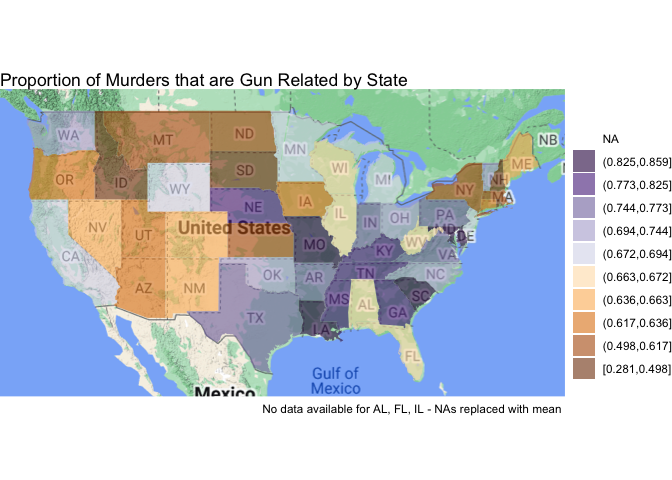<!-- -->

You may notice that the map is slightly off from the base tile image -
we’ll deal with that more in a later section.

### Geocoding and Adding Points to a Map

There may be times you have a number of locations that you want to plot
on a map. For that, you’ll usually have addresses (partial or full) and
you need to have the appropriate latitude and longitude in order to
actually display it on a map. For that, you’ll need to geocode. You can
do this in **ggmap** but there is a better library for larger geocoding
projects called **tidygeocoder**.

In order to demonstrate this, we’ll use a dataset of the hometowns of
our PPOL 563 students that we obtained during our intro survey of the
class. First, we load the library and make a dataframe:

``` r
library(tidygeocoder)
```

    ## 
    ## Attaching package: 'tidygeocoder'

    ## The following object is masked from 'package:ggmap':
    ## 
    ##     geocode

``` r
hometowns <- tibble("hometown" = c("India","New Orleans, LA", "Chicago", "Greenville, SC","Los Angeles",
               "Central Pennsylvania", "New Delhi, India", "Syracuse, NY", "Shenzhen, China",
               "Bangalore, India", "China", "Grand Rapids, MI", "Nicaragua", "San Antonio, TX",
               "China", "Abu Dhabi, United Arab Emirates", "China", "Hinsdale, IL",
               "Waukesha, WI", "Chongqing, China", "Bucks County, PA", "Chicago",
               "Seattle", "Nashville", "Milford, Michigan", "Seattle", "Shanghai, China",
               "Miami", "Sao Paulo, Brazil", "Palo Alto", "Livermore, CA"))

hometowns
```

    ## # A tibble: 31 × 1
    ##    hometown            
    ##    <chr>               
    ##  1 India               
    ##  2 New Orleans, LA     
    ##  3 Chicago             
    ##  4 Greenville, SC      
    ##  5 Los Angeles         
    ##  6 Central Pennsylvania
    ##  7 New Delhi, India    
    ##  8 Syracuse, NY        
    ##  9 Shenzhen, China     
    ## 10 Bangalore, India    
    ## # … with 21 more rows

You’ll note that we have a mix of location types here: some where just
the country is listed, some city/state combinations, sometimes just a
city, one that even just has a region (“Central Pennsylvania”).
Fortunately, **tidygeocoder** elegantly handles all of those variations
without any fussiness.

To “forward-geocode” the data we call the `geocode()` function, passing
it the data and telling it what column the addresses are in. It uses the
Open Street Map geocoding service here, but other services can be
specified with the method argument.

Only latitude and longitude are returned from the geocoding service in
this example, but `full_results = TRUE` can be used to return all of the
data from the geocoding service.

``` r
lat_longs <- hometowns %>%
  geocode(hometown, method = 'osm', lat = latitude , long = longitude)
```

    ## Passing 27 addresses to the Nominatim single address geocoder

    ## Query completed in: 27.1 seconds

``` r
lat_longs
```

    ## # A tibble: 31 × 3
    ##    hometown             latitude longitude
    ##    <chr>                   <dbl>     <dbl>
    ##  1 India                    22.4      78.7
    ##  2 New Orleans, LA          30.0     -90.1
    ##  3 Chicago                  41.9     -87.6
    ##  4 Greenville, SC           34.9     -82.4
    ##  5 Los Angeles              34.1    -118. 
    ##  6 Central Pennsylvania     40.2     -79.6
    ##  7 New Delhi, India         28.6      77.2
    ##  8 Syracuse, NY             43.0     -76.1
    ##  9 Shenzhen, China          22.5     114. 
    ## 10 Bangalore, India         13.0      77.6
    ## # … with 21 more rows

We can then take these points and place them on a world map. Note that
below we call ggplot’s `borders` geom which is a quick and dirty way to
draw a common map. In their own words, the developers say you should use
this for “crude reference lines, but you’ll typically want something
more sophisticated for communication graphics.”

``` r
ggplot(lat_longs, aes(longitude, latitude), color = "grey99") +
  borders("world") + geom_point(color = "red") +
  theme_void()
```

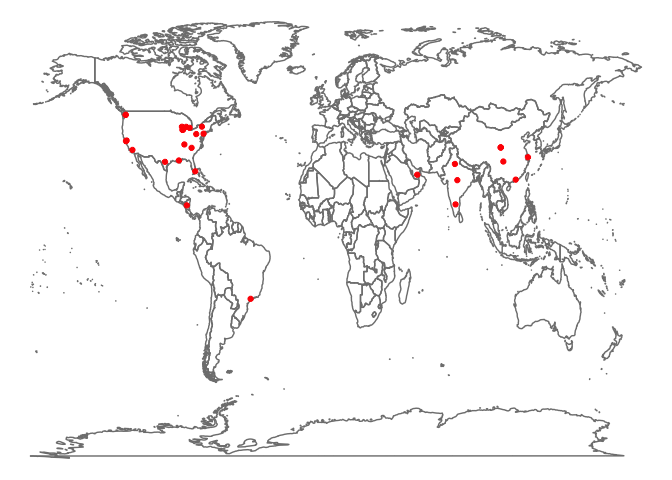<!-- -->

To perform reverse geocoding (obtaining addresses from geographic
coordinates), we can use the `reverse_geocode()` function. The arguments
are similar to the `geocode()` function, but now we specify the input
data columns with the lat and long arguments. The input dataset used
here is the results of the geocoding query above.

The single line address is returned in a column named by the address
argument and all columns from the geocoding service results are returned
because full_results = TRUE. You’ll see the wealth of data we get back
from the service:

``` r
reverse <- lat_longs %>%
  reverse_geocode(lat = latitude, long = longitude, method = 'osm',
                  address = address_found, full_results = TRUE)
```

    ## Passing 27 coordinates to the Nominatim single coordinate geocoder

    ## Query completed in: 27.1 seconds

``` r
glimpse(reverse)
```

    ## Rows: 31
    ## Columns: 35
    ## $ hometown         <chr> "India", "New Orleans, LA", "Chicago", "Greenville, S…
    ## $ latitude         <dbl> 22.35111, 29.97600, 41.87556, 34.85135, 34.05369, 40.…
    ## $ longitude        <dbl> 78.66774, -90.07821, -87.62442, -82.39849, -118.24277…
    ## $ address_found    <chr> "Tamia, Tamia Tahsil, Chhindwara, Madhya Pradesh, 480…
    ## $ place_id         <int> 584609, 257587265, 141701252, 4089358, 298929657, 311…
    ## $ licence          <chr> "Data © OpenStreetMap contributors, ODbL 1.0. https:/…
    ## $ osm_type         <chr> "node", "way", "way", "node", "relation", "way", "way…
    ## $ osm_id           <dbl> 245704414, 774849275, 150182922, 550547185, 6333145, …
    ## $ osm_lat          <chr> "22.343623", "29.97597906965578", "41.875375399999996…
    ## $ osm_lon          <chr> "78.6708234", "-90.0782259300085", "-87.6248273616118…
    ## $ village          <chr> "Tamia", "Mid-City", NA, NA, NA, NA, NA, NA, NA, NA, …
    ## $ county           <chr> "Tamia Tahsil", "Orleans Parish", "Cook County", "Gre…
    ## $ state_district   <chr> "Chhindwara", NA, NA, NA, NA, NA, NA, NA, NA, "Bangal…
    ## $ state            <chr> "Madhya Pradesh", "Louisiana", "Illinois", "South Car…
    ## $ `ISO3166-2-lvl4` <chr> "IN-MP", "US-LA", "US-IL", "US-SC", "US-CA", "US-PA",…
    ## $ postcode         <chr> "480559", "70119", "60604", "29601", "90012", "15688"…
    ## $ country          <chr> "India", "United States", "United States", "United St…
    ## $ country_code     <chr> "in", "us", "us", "us", "us", "us", "in", "us", "cn",…
    ## $ boundingbox      <list> <"22.323623", "22.363623", "78.6508234", "78.6908234…
    ## $ road             <chr> NA, "Esplanade Avenue", "South Michigan Avenue", "Nor…
    ## $ city             <chr> NA, "New Orleans", "Chicago", "Greenville", "Los Ange…
    ## $ building         <chr> NA, NA, "Congress Plaza Hotel", NA, "Los Angeles City…
    ## $ house_number     <chr> NA, NA, "500-510", "22", "200", "904", NA, "407", NA,…
    ## $ neighbourhood    <chr> NA, NA, "Printer's Row", NA, "Civic Center", NA, "Rai…
    ## $ suburb           <chr> NA, NA, "Loop", "Downtown", "Downtown", NA, "Rakab Ga…
    ## $ amenity          <chr> NA, NA, NA, "Trio", NA, NA, NA, "Onondaga County Sher…
    ## $ hamlet           <chr> NA, NA, NA, NA, NA, "Central", NA, NA, NA, NA, NA, NA…
    ## $ city_district    <chr> NA, NA, NA, NA, NA, NA, "Chanakya Puri Tehsil", NA, N…
    ## $ municipality     <chr> NA, NA, NA, NA, NA, NA, NA, "Salina", NA, NA, NA, NA,…
    ## $ quarter          <chr> NA, NA, NA, NA, NA, NA, NA, NA, "福中社区", NA, NA, N…
    ## $ town             <chr> NA, NA, NA, NA, NA, NA, NA, NA, "莲花街道", NA, "常河…
    ## $ leisure          <chr> NA, NA, NA, NA, NA, NA, NA, NA, NA, "Government Secre…
    ## $ region           <chr> NA, NA, NA, NA, NA, NA, NA, NA, NA, NA, "定西市", NA,…
    ## $ shop             <chr> NA, NA, NA, NA, NA, NA, NA, NA, NA, NA, NA, NA, NA, N…
    ## $ tourism          <chr> NA, NA, NA, NA, NA, NA, NA, NA, NA, NA, NA, NA, NA, N…

### R’s Built in Geo Data

R has a number of built in data sets that could be helpful with maps (or
any geographic data for that matter):

-   `state.abb` - character vector of 2-letter abbreviations for the
    state names.
-   `state.area` - numeric vector of state areas (in square miles).
-   `state.center` - list with components named x and y giving the
    approximate geographic center of each state in negative longitude
    and latitude. Alaska and Hawaii are placed just off the West Coast.
-   `state.division` - factor giving state divisions (New England,
    Middle Atlantic, South Atlantic, East South Central, West South
    Central, East North Central, West North Central, Mountain, and
    Pacific).
-   `state.name` - character vector giving the full state names.
-   `state.region` - factor giving the region (Northeast, South, North
    Central, West) that each state belongs to.
-   `state.x77` - matrix with 50 rows and 8 columns giving the following
    statistics in the respective columns: population in 1975, per capita
    income 1974, illiteracy 1970, life expectancy in years (1969-71),
    murder per 100K 1976, % HS grads 1970, mean number of days w/min
    temp below freezing (1931-1960) in capital or large city, land area
    in square miles.

### Using the sf Library

#### DMAs: External Shape Files for Unique Boundaries

Shapefiles are a commonly supported file type for spatial data dating
back to the early 1990s. Proprietary software for geographic information
systems (GIS) such as ArcGIS pioneered this format and helps maintain
its continued usage. A shapefile encodes points, lines, and polygons in
geographic space, and is actually a set of files. Shapefiles appear with
a .shp extension, sometimes with accompanying files ending in .dbf and
.prj.

-   .shp stores the geographic coordinates of the geographic features
    (e.g. country, state, county)
-   .dbf stores data associated with the geographic features
    (e.g. unemployment rate, crime rates, percentage of votes cast for
    Donald Trump)
-   .prj stores information about the projection of the coordinates in
    the shapefile

When importing a shapefile, you need to ensure all the files are in the
same folder. This is the complete shapefile. If any of these files are
missing, you will get an error importing your shapefile.

In order to read shape files, we’ll be using a function from **sf**
library, which is an incredibly useful way to create maps in R. In fact,
it’s probably the one you’ll be using the most. Yes, above we used
regular ggplot, and that is helpful for you to know, but it’s **sf**
which will give you robust functionality. So that being said, here’s a
very quick intro to **sf**:

From the sf vignette:

> Simple features or simple feature access refers to a formal standard
> (ISO 19125-1:2004) that describes how objects in the real world can be
> represented in computers, with emphasis on the spatial geometry of
> these objects. It also describes how such objects can be stored in and
> retrieved from databases, and which geometrical operations should be
> defined for them.

The **sf** package is an R implementation of Simple Features. This
package incorporates:

-   a new spatial data class system in R
-   functions for reading and writing data
-   tools for spatial operations on vectors
-   integrates smoothly into **ggplot**

Most of the functions in this package starts with prefix **st\_** which
stands for *spatial and temporal.*

We will use the `st_read()` function to turn a shapefile into a “Simple
Features” dataframe that is easier to work with. For this demo, we’ll
work with a shapefile for DMAs, which stands for Designated Market Area,
more commonly known as media markets. It is essentially the broadcast
television territory (what city’s local news you get on the TV). These
are common units of analysis for political campaigns because of the
massive amount of broadcast television advertising they purchase.

``` r
library(sf)
```

    ## Warning: package 'sf' was built under R version 4.0.5

    ## Linking to GEOS 3.9.1, GDAL 3.4.0, PROJ 8.1.1; sf_use_s2() is TRUE

``` r
dma <- st_read("NatDMA.shp")
```

    ## Reading layer `NatDMA' from data source 
    ##   `/Users/alundry/Dropbox (Personal)/Teaching/PPOL 563/PPOL563_materials/Week 8 - Geospatial/NatDMA.shp' 
    ##   using driver `ESRI Shapefile'
    ## Simple feature collection with 211 features and 13 fields
    ## Geometry type: MULTIPOLYGON
    ## Dimension:     XY
    ## Bounding box:  xmin: -179.1473 ymin: -14.55255 xmax: 179.7785 ymax: 71.35256
    ## Geodetic CRS:  WGS 84

sf objects have two main differences compared to a regular data.frame
object: 1) they contain spatial metadata (geometry type, dimension,
bbox, epsg (SRID), proj4string) and 2) an additional column, typically
named geometry that contains all the points to draw the polygons.

The `geom_sf()` function allows you to plot geospatial objects in any
**ggplot2** object. Since the x and y coordinates are implied by the
geometry of the sf object, you don’t have to explicitly bind the x
aesthetic to the longitudinal coordinate and the y aesthetic to the
latitude.

Let’s check it out below, but notice that in order to make the plot
somewhat more manageable, I’ve limited the X and Y axes to the
continental United States (CONUS).

``` r
m1 <- ggplot(dma) + 
   geom_sf() +
   coord_sf() +
   scale_x_continuous(limits = c(left, right)) +
   scale_y_continuous(limits = c(bottom, top))

# The DMA shape file is massive and takes some time to fully render; this mean I was having issues rendering this live in the notebook. Saving it to an object and then as a PDF got this all working much faster.     
ggsave("map_demo.png")
```

    ## Saving 7 x 5 in image

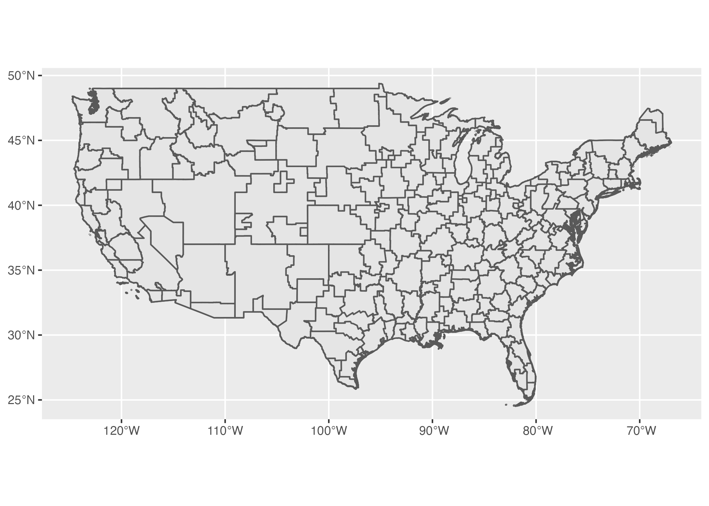

Now let’s see how we can combine these new geos with what we’ve gone
over above: choropleth maps and using base map tiles. First, we’ll
filter the national DMA map just to Virginia. We’ll filter based on the
`Key` value, which corresponds to an ID that is frequently used when
dealing with media markets: the DMA FIPs code. To find out which DMAs
are in Virginia, you can just google “Virginia DMA map” and usually one
of the first results in the image search will provide you with a list of
DMAs. That list, along with a website like
<https://www.spstechnical.com/DMACodes.htm> which has the DMA FIPs codes
associated with each media market, will help you narrow things down.

``` r
va_dma_fips <- c(511, 584, 556, 573, 544, 531, 559, 518, 560, 569)

va_dma_sf <- dma %>%
   filter(Key %in% va_dma_fips) %>% 
   mutate(key = as.numeric(Key)) %>% # the key comes in as a string, but we'll want to convert it to numeric so we can join on it later with another dataset
   select(-Key)
```

We’ll be visualizing the results of the 2020 presidential election by
DMA. We obtain the data from a Daily Kos spreadsheet hosted on Google
Sheets, so we use the **googlesheets4** a library that can download data
from there. We have to provide the URL, the sheet number, a specific
range to avoid a wonky header row, and the specific range so that we
only get 2020. We then filter that data down the just the Virginia DMAs.
The Daily Kos data didn’t come with FIPs code, so we have to manually
get it in there. I just looked at the order and listed out the correct
FIPs code in the appropriate order. I then used a very convenient
function from the `janitor` library called `clean_names()` that does
things like get rid of spaces and special characters and capital
letters.

``` r
library(googlesheets4)

# Read in 2020 presidential results by DMA from a Daily Kos Google Sheet
dma_20 <- read_sheet(ss = "https://docs.google.com/spreadsheets/d/1LomW1QYbIBzcbS8lFxMpJM1OjdNZQX5JJBmDSMpeDWU/edit?usp=sharing",
           sheet = 1, 
           range = "A2:G549", 
           col_names = T)
```

    ## ! Using an auto-discovered, cached token.

    ##   To suppress this message, modify your code or options to clearly consent to
    ##   the use of a cached token.

    ##   See gargle's "Non-interactive auth" vignette for more details:

    ##   <https://gargle.r-lib.org/articles/non-interactive-auth.html>

    ## ℹ The googlesheets4 package is using a cached token for 'alexlundry@gmail.com'.

    ## ✔ Reading from "Presidential election results by media market, 1960-2020".

    ## ✔ Range ''2016-20 (w/state breakdowns)'!A2:G549'.

``` r
# filter the data down to just Virginia DMAs
# but the data doesn't come with DMA FIPs codes attached
# that's what we need to join it to the DMA SF data
# so I need to bind the FIPs code to it
# I used this website: https://www.spstechnical.com/DMACodes.htm
va_dma_20 <- dma_20 %>% 
   filter(State == "VA") %>% 
   bind_cols(tibble(Key = c(559, 584, 518, 569, 544, 560, 556, 573, 531, 511))) %>% 
   janitor::clean_names()

va_dma_20
```

    ## # A tibble: 10 × 8
    ##    market          state biden_number trump_number other…¹ biden…² trump…³   key
    ##    <chr>           <chr>        <dbl>        <dbl>   <dbl>   <dbl>   <dbl> <dbl>
    ##  1 Bluefield       VA            3205        16731     198   0.159   0.831   559
    ##  2 Charlottesville VA           77437        44219    2486   0.624   0.356   584
    ##  3 Greensboro      VA            1954         7485      95   0.205   0.785   518
    ##  4 Harrisonburg    VA           46448        77856    2578   0.366   0.614   569
    ##  5 Norfolk         VA          495557       369168   17875   0.561   0.418   544
    ##  6 Raleigh         VA            6803         9266     135   0.420   0.572   560
    ##  7 Richmond        VA          466879       378530   14533   0.543   0.440   556
    ##  8 Roanoke         VA          220264       362414   10596   0.371   0.611   573
    ##  9 Tri-Cities      VA           24156        94830    1314   0.201   0.788   531
    ## 10 Washington      VA         1070865       601931   34716   0.627   0.353   511
    ## # … with abbreviated variable names ¹​other_number, ²​biden_percent,
    ## #   ³​trump_percent

Now that we have good clean data, let’s join them together. Note that we
left_join the 2020 results data into the SF data file. We do this in
order to maintain it as an SF data file so that it can be mapped easily.
Once we have them joined, we can map it using `geom_sf` and set the fill
to `biden_percent` variable.

``` r
va_dma_20 <- left_join(va_dma_sf, va_dma_20)
```

    ## Joining, by = "key"

``` r
va_plot <- ggplot(va_dma_20, aes(fill = biden_percent)) +
   geom_sf(color = NA) +
   scale_fill_distiller(palette = "Blues")

ggsave("va_dma_20_alt.png")
```

    ## Saving 7 x 5 in image

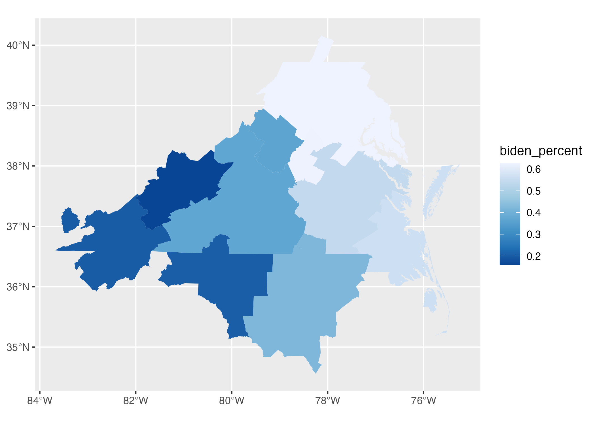

We may want to add a base map underneath it in order to help people
contextualize the state better. Especially with those DMAs that bleed
over into other states. So we can use **ggmap** to get a base map from
Google of the state of Virginia. You may have to play around with the
zoom level to get the whole state (which you’ll need if you want to draw
a polygon, otherwise the path drawing order gets messed up because it
can find all the lats and longs).

``` r
va_basemap <- get_map(location = "Virginia", zoom = 6)
```

    ## Source : https://maps.googleapis.com/maps/api/staticmap?center=Virginia&zoom=6&size=640x640&scale=2&maptype=terrain&language=en-EN&key=xxx

    ## Source : https://maps.googleapis.com/maps/api/geocode/json?address=Virginia&key=xxx

``` r
ggmap(va_basemap)
```

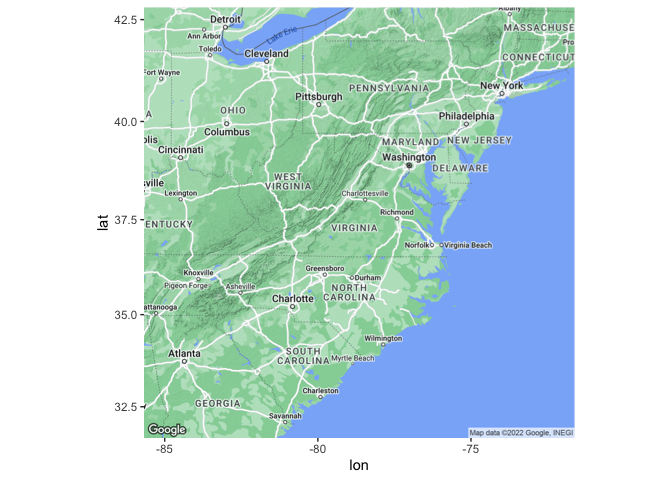<!-- -->

Once we have the basemap, we can layer on other maps. This SHOULD be
easy, but it’s not. Remember how that previous ggmap/choropleth overlay
was slightly off? Remember how I said we shouldn’t go down the
rabbit-hole of the Coordinate Reference System? Well, I kinda lied. We
kinda have to. But not too deep. **ggmap** brings back map objects that
are built using a Coordinate Reference System (CRS) that is EPSG: 3857.
But our VA DMA data map is EPSG: 4326. This is some real “inside
baseball” when it comes to mapping, but if we were to overlay these two
different CRSs together, the maps would be slightly off. So we need to
do two things:

1.  Convert our VA DMA map into a CRS of 3857. We can do that with a
    function from **sf**: `st_transform()`.
2.  We then have to do some ridiculous transformation of the ggmap
    object too. There is a bug with ggmap in which the bounding box that
    it brings back is encoded in EPSG: 4326. We use a function found
    online (after some deep error googling) to convert that back to
    EPSG: 3857 which is what all other data in ggmap are in.

These allow us to layer the sf based VA DMA map onto the ggmap base map.

``` r
#### The below function is lifted from this stack overflow post:
#### https://stackoverflow.com/questions/47749078/how-to-put-a-geom-sf-produced-map-on-top-of-a-ggmap-produced-raster

# Define a function to fix the bbox to be in EPSG:3857
# See https://github.com/dkahle/ggmap/issues/160#issuecomment-397055208
ggmap_bbox_to_3857 <- function(map) {
  if (!inherits(map, "ggmap")) stop("map must be a ggmap object")
  # Extract the bounding box (in lat/lon) from the ggmap to a numeric vector, 
  # and set the names to what sf::st_bbox expects:
  map_bbox <- setNames(unlist(attr(map, "bb")), 
                       c("ymin", "xmin", "ymax", "xmax"))
  
  # Convert the bbox to an sf polygon, transform it to 3857, 
  # and convert back to a bbox (convoluted, but it works)
  bbox_3857 <- st_bbox(st_transform(st_as_sfc(st_bbox(map_bbox, crs = 4326)), 3857))
  
  # Overwrite the bbox of the ggmap object with the transformed coordinates 
  attr(map, "bb")$ll.lat <- bbox_3857["ymin"]
  attr(map, "bb")$ll.lon <- bbox_3857["xmin"]
  attr(map, "bb")$ur.lat <- bbox_3857["ymax"]
  attr(map, "bb")$ur.lon <- bbox_3857["xmax"]
  map
}

va_dma_20_3857 <- st_transform(va_dma_20, crs = 3857) # transform VA DMA to EPSG 3857
va_map_3857 <- ggmap_bbox_to_3857(va_basemap) # call the new function to fix the ggmap

# plot the maps
va_plot2 <- ggmap(va_map_3857) + 
   geom_polygon(data=map_data("state") %>% filter(region == "virginia"),
                aes(x=long, y=lat, group=group), fill = NA, color = "black") +
   geom_sf(data = va_dma_20_3857, aes(fill = biden_percent), 
           color = "light grey", alpha = 0.9, inherit.aes = F) +
   scale_fill_distiller(palette = "Blues")
```

    ## Coordinate system already present. Adding new coordinate system, which will replace the existing one.

``` r
ggsave("va_dma_plot2.png")
```

    ## Saving 7 x 5 in image

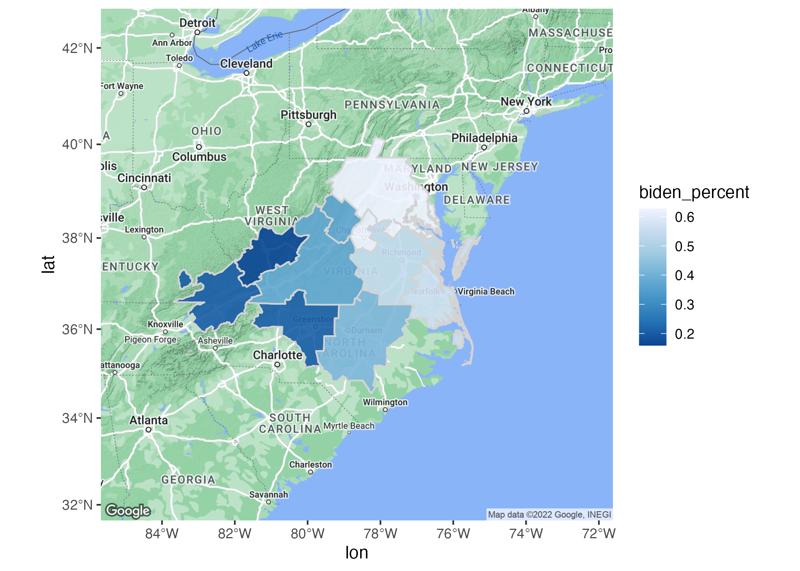

#### Congressional Districts: External Shape Files for Unique Boundaries

It’s very likely you’ll have to create a map based on Congressional
Districts at some point. In order to do so, you can follow the same
approach as outlined above for DMAs, but instead you’ll have to use a
shapefile (or other geo-data object) that has the appropriate
congressional district borders.

Fortunately, there is an R package that makes this easier, the
**USAboundaries** library. To get an SF object just call the
`us_congressional()` function. This can then be easily plotted using
ggplot and `geom_sf`.

First though, some quick background on the **USAboundaries** package,
which is a nifty little package:

> This R package includes contemporary state, county, and Congressional
> district boundaries, as well as zip code tabulation area centroids. It
> also includes historical boundaries from 1629 to 2000 for states and
> counties from the Newberry Library’s Atlas of Historical County
> Boundaries, as well as historical city population data from Erik
> Steiner’s “United States Historical City Populations, 1790-2010.” The
> package has some helper data, including a table of state names,
> abbreviations, and FIPS codes, and functions and data to get State
> Plane Coordinate System projections as EPSG codes or PROJ.4 strings.

Note: I had some trouble installing the **USAboundariesData** library
that is a package dependancy, so I had to install it directly from
Github (see syntax below).

``` r
# install.packages("USAboundariesData", repos = "https://ropensci.r-universe.dev", type = "source")
# install.packages("USAboundaries")
library(USAboundaries)

cong_map <- us_congressional(resolution = "high")

cong_plot <- ggplot(cong_map) +
   geom_sf() +
   scale_x_continuous(limits = c(left, right)) +
   scale_y_continuous(limits = c(bottom, top))

ggsave("cong_plot.png")
```

    ## Saving 7 x 5 in image

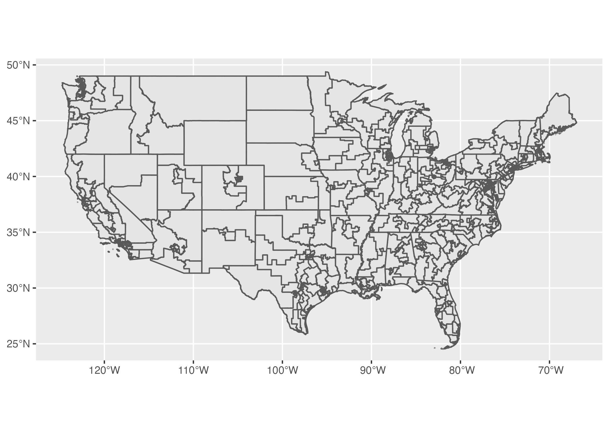

Of course, you can turn these into choropleth maps if you have CD data.
You’ll just need to get the join keys to match up appropriately. Rather
than going into that here, we can just assign some random data to it and
visualize appropriately.

``` r
cong_map %>% 
   filter(state_name %in% c("North Carolina", "South Carolina", "Virginia")) %>% 
   mutate(random_data = runif(31, 0, 1)) %>% 
   ggplot() +
   aes(fill = random_data) +
   geom_sf(color="black") +
   scale_fill_viridis_b() +
   theme_void() +
   theme(legend.position = "none")
```

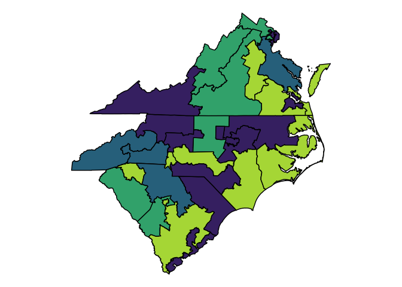<!-- -->

Finally, I haven’t used data from this website, but it looks like it
could be handy: it has historical CD boundaries all the way back to 1789

<https://cdmaps.polisci.ucla.edu/>

### Creating Custom Regions

It is likely that you will frequently be asked to calculate statistics
for custom regions, and these will frequently be made up of unique
combinations of pre-existing regions like counties or states. Here’s one
example from a recent project where I had to analyze some survey data in
Kentucky that had to do with coal, so it was important that we
understand how the various coal producing regions felt compared to
non-coal producing regions.

First, I had to grab an sf object for Kentucky:

``` r
ky <- us_counties(resolution = "high", states = "KY") %>% 
   select(-9) # no idea why, but it has duplicate columns, so we drop one
```

Then I had to load in the data I had that mapped Kentucky counties to
coal-producing regions. Once that is loaded the next step is to join
them together. Always do a left_join INTO the sf object so that it
remains an sf object.

``` r
ky_pr <- read_csv("ky_pr.csv", col_types = c("ccnccc"))

ky <- left_join(ky, ky_pr, by = c("geoid" = "FIPS"))
```

Creating the new region is frighteningly easy. Because the sf object is
a tidy dataset, you can use standard **dyplyr** functions on it and it
will behave as you would expect. You’ll see that the new sf object is a
dataset consisting only of three records: one for each of the coal
regions in our dataset.

``` r
ky_new <- ky %>% 
    group_by(coal) %>% 
    summarize()

ky_new
```

    ## Simple feature collection with 3 features and 1 field
    ## Geometry type: GEOMETRY
    ## Dimension:     XY
    ## Bounding box:  xmin: -89.57151 ymin: 36.49713 xmax: -81.96497 ymax: 39.14746
    ## Geodetic CRS:  WGS 84
    ## # A tibble: 3 × 2
    ##   coal                                                                  geometry
    ##   <chr>                                                           <GEOMETRY [°]>
    ## 1 Eastern Coal MULTIPOLYGON (((-82.56538 37.19609, -82.56533 37.19612, -82.5581…
    ## 2 None         MULTIPOLYGON (((-83.76878 37.91837, -83.76875 37.91941, -83.7653…
    ## 3 Western Coal POLYGON ((-87.81341 37.35065, -87.81313 37.34958, -87.81497 37.3…

Then it’s simply a matter of calling `geom_sf` to map the new regions.
Notice the use of `geom_sf_label` which we haven’t seen yet - a way of
labelling your mapped SF objects. (You can also use `geom_sf_text`).

``` r
ggplot(ky_new) +
   geom_sf() +
   geom_sf_label(aes(label = coal))
```

    ## Warning in st_point_on_surface.sfc(sf::st_zm(x)): st_point_on_surface may not
    ## give correct results for longitude/latitude data

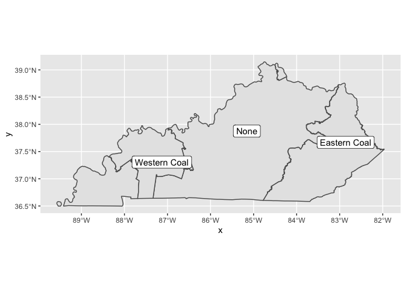<!-- -->

Here again, you could turn these into Choropleth maps by simply joining
the data to be visualized into the SF object and then adding it as a
fill aesthetic to the `geom_sf` call.

### Cartograms

Cartograms are a type of map where geographic areas (states, regions,
etc) are distorted based on a variable associated with each of those
areas. For example, a cartogram would create a larger distorted image of
a state that has a very large population if that is the variable you
mapped to the distortion aesthetic.

They are certainly a unique and eye-catching visualization, but they do
require that viewers have a previous knowledge of the geography
represented since the sizes of the areas are altered.

To create them we use the **cartogram** package, which works with **sf**
data.

``` r
library(cartogram)
```

Creating these are fairly straightforward know that we know how to work
with sf dataframes - in particular how to merge data we want to
visualize into them.

For this demonstration, we’ll just work with some **USAboundaries** data
that is already in sf form and merge in the gun data we used previously

``` r
states_sf <- us_states(resolution = "high") %>% 
   left_join(guns, by = c("state_name" = "state")) %>% 
   filter(is.na(pop) == F)
```

There are three key functions in the **cartogram** package:

-   `cartogram_cont` - creates a contiguous cartogram, which keeps the
    regions together as a single larger entity.
-   `cartogram_ncont` - creates a non-contiguous cartogram. There is no
    deformity or distortion of the geometry of the geography. Only sizes
    are modified, but this leaves gaps between regions.
-   `cartogram_dorling` - creates a Dorling cartogram, which replaces
    the original geography with a symbol (usually a circle) with its
    size reduced or enlarged based on the value chosen.

Importantly, unlike the other work we did with sf objects, the
**cartogram** package requires that give the sf object a projection
before we transform it into a cartogram. We can do this using a
`st_transform` function, where the argument requires an EPSG code for
the projection we want to use. Here we give it 5070, which indicates we
want an Albers projection.

``` r
states_sf_5070 <- st_transform(states_sf, 5070)
```

Once we’ve done that, it’s only a matter of a cartogram function call
and then `geom_sf`:

``` r
states_sf_carto_cont <- cartogram_cont(states_sf_5070 %>% 
                                          filter(!(name %in% c("Hawaii", "Alaska"))), weight = "prop_gun_murders")
```

    ## Mean size error for iteration 1: 2.71391016339283

    ## Mean size error for iteration 2: 1.73278538029887

    ## Mean size error for iteration 3: 1.3723577942013

    ## Mean size error for iteration 4: 1.20099938822929

    ## Mean size error for iteration 5: 1.11527750386935

    ## Mean size error for iteration 6: 1.07159049597609

    ## Mean size error for iteration 7: 1.04648451271315

    ## Mean size error for iteration 8: 1.03122036108915

    ## Mean size error for iteration 9: 1.0215596026155

    ## Mean size error for iteration 10: 1.01510400221954

    ## Mean size error for iteration 11: 1.01072157807952

    ## Mean size error for iteration 12: 1.00772148110091

    ## Mean size error for iteration 13: 1.00562032392578

    ## Mean size error for iteration 14: 1.00411931938128

    ## Mean size error for iteration 15: 1.00304409010306

``` r
ggplot(states_sf_carto_cont) +
   geom_sf()
```

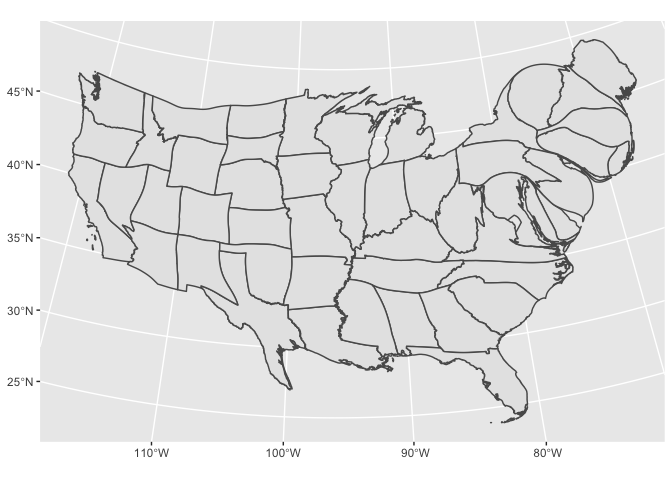<!-- -->

Now that’s in ggplot, you can modify it to your heart’s content:

``` r
ggplot(states_sf_carto_cont) +
   geom_sf(aes(fill = prop_gun_murders)) +
   geom_sf_text(aes(label = state_abbr), color = "white") +
   scale_fill_viridis_b(direction = -1) +
   theme_void()
```

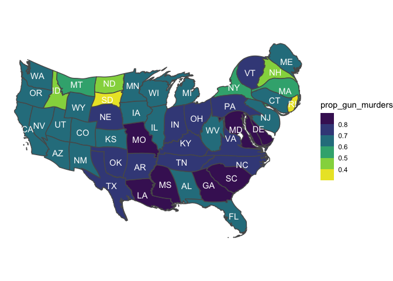<!-- -->

Here we do the same process for a non-contiguous cartogram, make a call
to `cartogram_ncont()` and them put that object into ggplot and
`geom_sf`.

``` r
states_sf_carto_ncont <- cartogram_ncont(states_sf_5070 %>% 
                                          filter(!(name %in% c("Hawaii", "Alaska"))), weight = "murders")

ggplot(states_sf_carto_ncont) +
   geom_sf(aes(fill = murders)) +
   geom_sf_text(aes(label = state_abbr), color = "white") +
   scale_fill_viridis_b(direction = -1) +
   theme_void()
```

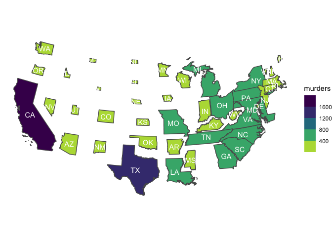<!-- -->

Finally, we follow the same process to create the Dorling cartogram.

``` r
states_sf_carto_dorling <- cartogram_dorling(states_sf_5070 %>% filter(is.na(gun_murders) == F,
                                                                       !(name %in% c("Hawaii", "Alaska"))), weight = "gun_murders")

ggplot(states_sf_carto_dorling) +
   geom_sf(aes(fill = gun_murders)) +
   geom_sf_text(aes(label = state_abbr), color = "white") +
   scale_fill_viridis_b(direction = -1) +
   theme_void()
```

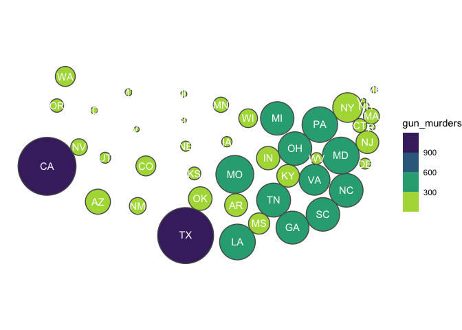<!-- -->

### Statebins / Hexbins

As we said, that Dorling cartogram can be used with different shapes.
Recently, one popular way to visualize these are to use either squares
(bins) or hexagrams (hexbins). The **statebins** library was built for
easy creation of US dorling cartograms using square bins. It creates a
new ggplot geom: `geom_statebins()` which is easily incorporated into a
ggplot series.

Here’s an example using categorical data:

``` r
library(statebins)
library(socviz) # so we can easily get some recent election data
```

    ## 
    ## Attaching package: 'socviz'

    ## The following object is masked _by_ '.GlobalEnv':
    ## 
    ##     county_map

``` r
ggplot(election, aes(state = state, fill = winner)) +
   geom_statebins() +
   scale_fill_manual(values = c("blue", "red")) +
   theme_statebins()
```

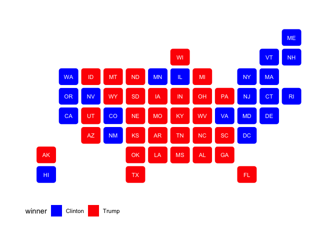<!-- -->

And here’s an example using continuous data:

``` r
ggplot(election, aes(state = state, fill = pct_trump)) +
   geom_statebins() +
   scale_fill_distiller(palette = "Reds", direction = -1) +
   theme_statebins()
```

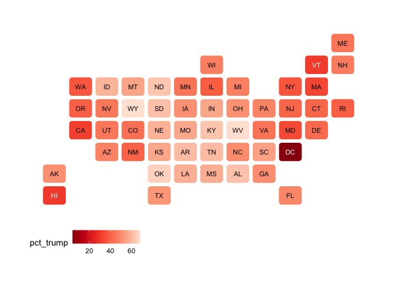<!-- -->

You should use the statebins package when you want squares and easy
labeling of each shape. But if you want hexagons and more options beyond
basic 50 state mapping, you should use the **tilegramsR** package.

This package provides a large number of sf objects that are easily
mapped that correspond to various popular versions of tilegrams by news
agencies. There is a 50 state one from NPR that is most similar to the
statebins one (but its a hexagon), but most of the rest are electoral
college ones. You can see a full list here:
<https://bhaskarvk.github.io/tilegramsR/articles/UsingTilegramsInR.html>

But a few ones worth seeing:

``` r
library(tilegramsR)
sf_NPR1to1 %>% 
   mutate(random_data = runif(nrow(.), 0, 1)) %>% 
   ggplot() +
   geom_sf(aes(fill = random_data)) +
   geom_sf_text(aes(label = state), color = "white") +
   scale_fill_viridis_c() +
   theme_void() +
   labs(title = "NPR State Hexbins")
```

    ## old-style crs object detected; please recreate object with a recent sf::st_crs()
    ## old-style crs object detected; please recreate object with a recent sf::st_crs()
    ## old-style crs object detected; please recreate object with a recent sf::st_crs()
    ## old-style crs object detected; please recreate object with a recent sf::st_crs()
    ## old-style crs object detected; please recreate object with a recent sf::st_crs()

<!-- -->

``` r
ggplot() +
   geom_sf(data = sf_FiveThirtyEightElectoralCollege) +
   geom_sf(# layer containing state hexagons
      data = sf_FiveThirtyEightElectoralCollege.states,
      color = "black",  # state boundaries
      alpha = 0,  # transparent
      size = 1  # thickness
   ) +
   theme_void() +
   labs(title = "Five Thirty Eight Electoral College")
```

    ## old-style crs object detected; please recreate object with a recent sf::st_crs()
    ## old-style crs object detected; please recreate object with a recent sf::st_crs()
    ## old-style crs object detected; please recreate object with a recent sf::st_crs()
    ## old-style crs object detected; please recreate object with a recent sf::st_crs()

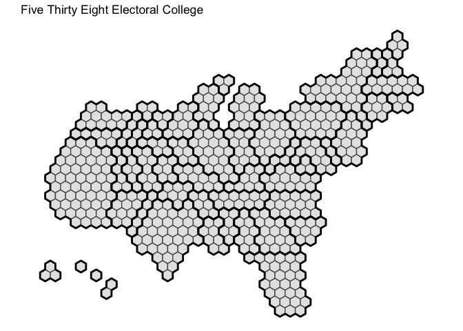<!-- -->

``` r
ggplot() +
   geom_sf(data = sf_DKOS_Electoral_College_Map_v1) +
   theme_void() +
   labs(title = "Daily Kos Electoral College")
```

    ## old-style crs object detected; please recreate object with a recent sf::st_crs()
    ## old-style crs object detected; please recreate object with a recent sf::st_crs()

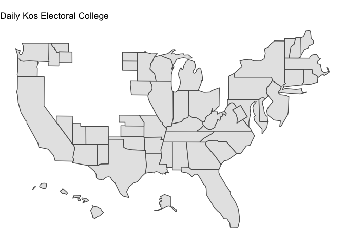<!-- -->

``` r
ggplot() +
   geom_sf(data = sf_NPR.DemersCartogram) +
   theme_void() +
   labs(title = "NPR Demers Cartogram")
```

    ## old-style crs object detected; please recreate object with a recent sf::st_crs()
    ## old-style crs object detected; please recreate object with a recent sf::st_crs()

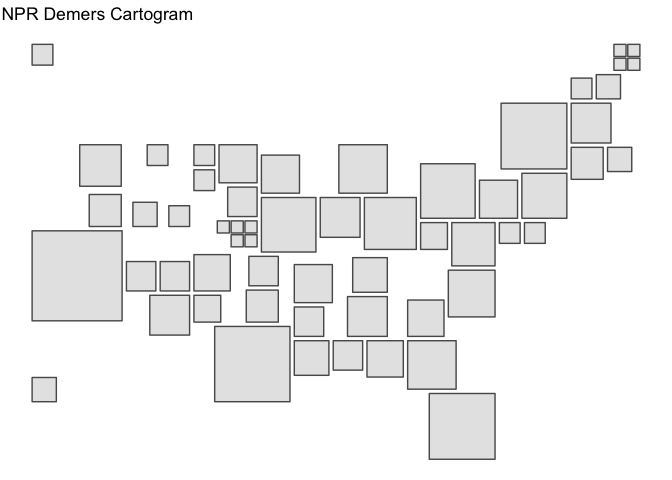<!-- -->

``` r
ggplot() +
   geom_sf(data = sf_DKOS_Distorted_Electoral_College_Map_v1) +
   theme_void() +
   labs(title = "Daily Kos Distorted Electoral College Tilegram")
```

    ## old-style crs object detected; please recreate object with a recent sf::st_crs()
    ## old-style crs object detected; please recreate object with a recent sf::st_crs()

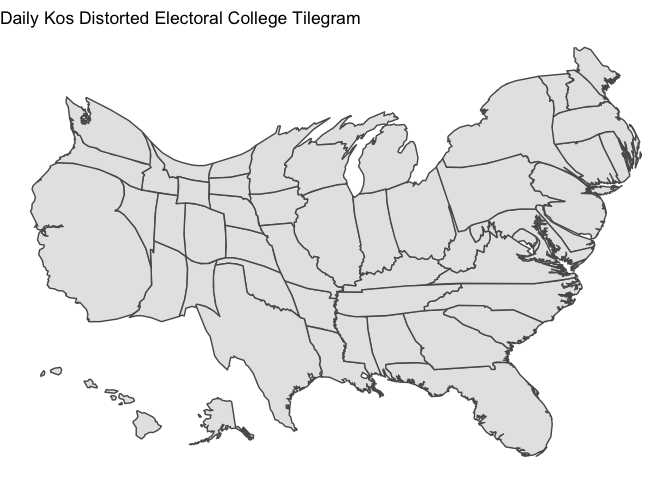<!-- -->

``` r
ggplot() +
   geom_sf(data = sf_DKOS_CD_Hexmap_v1.1) +
   geom_sf(# layer containing state hexagons
      data = sf_DKOS_CD_Hexmap_v1.1.states,
      color = "black",  # state boundaries
      alpha = 0,  # transparent
      size = 1  # thickness
   ) +
   theme_void() +
   labs(title = "Daily Kos Congressional Districts")
```

    ## old-style crs object detected; please recreate object with a recent sf::st_crs()
    ## old-style crs object detected; please recreate object with a recent sf::st_crs()
    ## old-style crs object detected; please recreate object with a recent sf::st_crs()
    ## old-style crs object detected; please recreate object with a recent sf::st_crs()

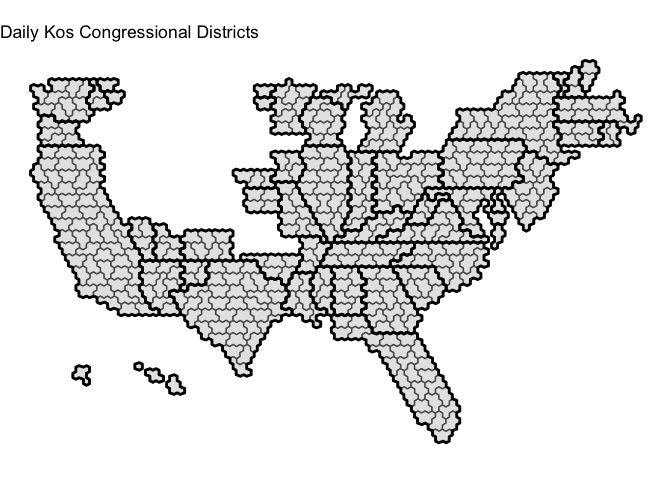<!-- -->

``` r
ggplot() +
   geom_sf(data = sf_DKOS_50_State_OuterHex_Tilemap_v1, fill = "red") +
   geom_sf(data = sf_DKOS_50_State_InnerHex_Tilemap_v1, fill = "blue") +
   theme_void() +
   labs(title = str_wrap("Daily Kos Dual Hexagon Tilegram (good for Senate-related data", 50))
```

    ## old-style crs object detected; please recreate object with a recent sf::st_crs()
    ## old-style crs object detected; please recreate object with a recent sf::st_crs()
    ## old-style crs object detected; please recreate object with a recent sf::st_crs()
    ## old-style crs object detected; please recreate object with a recent sf::st_crs()

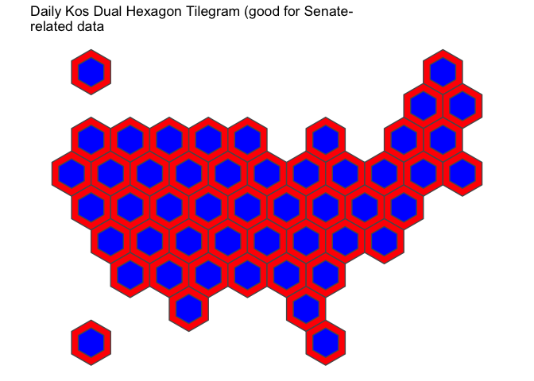<!-- -->

There are a number of other options including versions for Germany and
France, as well as tilegrams made by the *Washington Post*, the *Wall
Street Journal* and *Datamap.io*.

### Tidycensus

**tidycensus** is an R package that allows users to interface with a
select number of the US Census Bureau’s data APIs and return
tidyverse-ready data frames, optionally with simple feature geometry
included. **tidycensus** is designed to help R users get Census data
that is pre-prepared for exploration within the **tidyverse**, and
optionally spatially with **sf**.

To work with tidycensus, you must obtain, keep and then set a Census API
key. A key can be obtained from
<http://api.census.gov/data/key_signup.html>.

``` r
library(tidycensus)
# census_api_key("YOUR API KEY GOES HERE")  # add the parameter install = TRUE if you want your API key stored in your R environment for future use
```

There are two major functions implemented in tidycensus:
`get_decennial()`, which grants access to the 2000, 2010, and 2020
decennial US Census APIs, and `get_acs()`, which grants access to the
1-year and 5-year American Community Survey APIs.

In this basic example, let’s look at median age by state in 2010:

``` r
age10 <- get_decennial(geography = "state", 
                       variables = "P013001", 
                       year = 2010)
```

    ## Getting data from the 2010 decennial Census

``` r
head(age10)
```

    ## # A tibble: 6 × 4
    ##   GEOID NAME       variable value
    ##   <chr> <chr>      <chr>    <dbl>
    ## 1 01    Alabama    P013001   37.9
    ## 2 02    Alaska     P013001   33.8
    ## 3 04    Arizona    P013001   35.9
    ## 4 05    Arkansas   P013001   37.4
    ## 5 06    California P013001   35.2
    ## 6 22    Louisiana  P013001   35.8

The function returns a tidy data frame. If for whatever reason you
prefer a wide data frame, you can specify `output = "wide"` in the
function call.

Since the function has returned a tidy object, we can visualize it
quickly:

``` r
age10 %>%
  ggplot(aes(x = value, y = reorder(NAME, value))) + 
  geom_point()
```

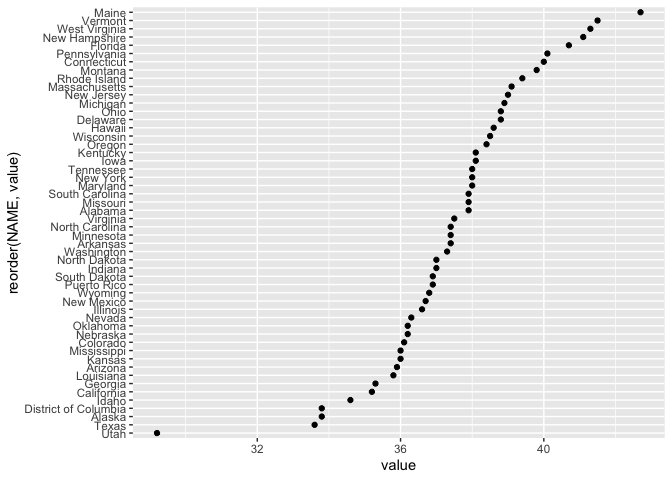<!-- -->
There are a large number of geographies you can specify including these
commonly used ones:

`"us"` United States `"region"` Census region `"division"` Census
division `"state"` State or equivalent `"county"` County or equivalent
`"county subdivision"` County subdivision `"tract"` Census tract
`"block group"` Census block group `"block"` Census block

There are thousands of variables available. In order to get them you
need to know the variable ID. To rapidly search for variables, use the
`load_variables` function. It takes two required arguments: the year of
the Census or endyear of the ACS sample, and the dataset name, which
varies in availability by year. For the decennial Census, possible
dataset choices include “pl” for the redistricting files (currently the
only choice for 2020), “sf1” or “sf2” (2000 and 2010) and “sf3” or “sf4”
(2000 only) for the various summary files. Special island area summary
files are available with “as”, “mp”, “gu”, or “vi”. For the ACS, use
either “acs1” or “acs5” for the ACS detailed tables, and append /profile
for the Data Profile and /subject for the Subject Tables.

``` r
v17 <- load_variables(2017, "acs5", cache = TRUE)

glimpse(v17)
```

    ## Rows: 25,070
    ## Columns: 3
    ## $ name    <chr> "B00001_001", "B00002_001", "B01001_001", "B01001_002", "B0100…
    ## $ label   <chr> "Estimate!!Total", "Estimate!!Total", "Estimate!!Total", "Esti…
    ## $ concept <chr> "UNWEIGHTED SAMPLE COUNT OF THE POPULATION", "UNWEIGHTED SAMPL…

Most relevant to our mapping conversation, if requested, tidycensus can
return simple feature geometry for geographic units along with variables
from the decennial US Census or American Community survey. By setting
`geometry = TRUE` in a tidycensus function call, tidycensus will use the
**tigris** package to retrieve the corresponding geographic dataset from
the US Census Bureau and pre-merge it with the tabular data obtained
from the Census API.

The following example shows median household income from the 2016-2020
ACS for Census tracts in Montgomery County, Maryland:

``` r
options(tigris_use_cache = TRUE)

montco <- get_acs(
  state = "MD",
  county = "Montgomery",
  geography = "tract",
  variables = "B19013_001",
  geometry = TRUE,
  year = 2020
)
```

    ## Getting data from the 2016-2020 5-year ACS

``` r
head(montco)
```

    ## Simple feature collection with 6 features and 5 fields
    ## Geometry type: MULTIPOLYGON
    ## Dimension:     XY
    ## Bounding box:  xmin: -77.26387 ymin: 38.99094 xmax: -76.99823 ymax: 39.11835
    ## Geodetic CRS:  NAD83
    ##         GEOID                                              NAME   variable
    ## 1 24031704000    Census Tract 7040, Montgomery County, Maryland B19013_001
    ## 2 24031703501 Census Tract 7035.01, Montgomery County, Maryland B19013_001
    ## 3 24031700616 Census Tract 7006.16, Montgomery County, Maryland B19013_001
    ## 4 24031702602 Census Tract 7026.02, Montgomery County, Maryland B19013_001
    ## 5 24031700905 Census Tract 7009.05, Montgomery County, Maryland B19013_001
    ## 6 24031702301 Census Tract 7023.01, Montgomery County, Maryland B19013_001
    ##   estimate   moe                       geometry
    ## 1    91111 24546 MULTIPOLYGON (((-77.05996 3...
    ## 2    72432  4743 MULTIPOLYGON (((-77.10921 3...
    ## 3   164018 22176 MULTIPOLYGON (((-77.26153 3...
    ## 4    87941  9843 MULTIPOLYGON (((-77.04987 3...
    ## 5    81250 14100 MULTIPOLYGON (((-77.13687 3...
    ## 6    72661 21393 MULTIPOLYGON (((-77.00977 3...

Notice that we have a tidy data frame, but it also has a geometry
list-column describing the geometry of each feature, using the default
geographic coordinate system for Census shapefiles. Because we have it
in this format, we can quickly visualize it using `geom_sf`.

``` r
montco %>% 
   ggplot(aes(fill = estimate)) +
   geom_sf(color = NA) +
   scale_fill_viridis_c(option = "magma")
```

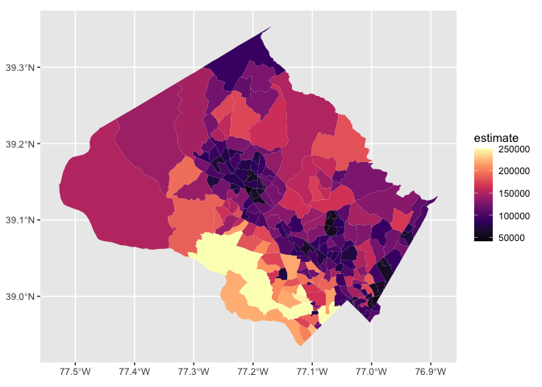<!-- -->

### Acknowledgements

-   Many thanks to Michael Porter for his [geospatial
    tutorial](https://mdporter.github.io/ST597/lectures/13-spatial.pdf)
-   Shout out to Josh McCrain for his
    [tutorial](http://joshuamccrain.com/tutorials/ggplot_maps/maps_tutorial.html)
-   This stackoverflow
    [answer](https://stackoverflow.com/questions/57625471/create-new-geometry-on-grouped-column-in-r-sf)
    for helping with custom region creation.
-   The tidygeocoder package [help
    page](https://jessecambon.github.io/tidygeocoder/).
-   Get a lot more information about tidycensus at its [excellent
    website](https://walker-data.com/tidycensus/index.html)
-   Simple [walk
    through](https://r-charts.com/spatial/cartogram-ggplot2/) of the
    **cartogram** package.
