Animation & Interaction
================

We’ll be using `gganimate` to do our animating. If you don’t already
have `gifski` or `av` as an installed library, you’ll want to do that
(these are what support the creation of GIF and movie files
respectively.

Yet again, we’ll be using the `gapminder` dataset.

## Animated Bubble Chart

Load the necessary libraries:

``` r
library(gapminder)
library(tidyverse)
```

    ## ── Attaching packages ─────────────────────────────────────── tidyverse 1.3.2 ──
    ## ✔ ggplot2 3.3.6      ✔ purrr   0.3.4 
    ## ✔ tibble  3.1.8      ✔ dplyr   1.0.10
    ## ✔ tidyr   1.2.1      ✔ stringr 1.4.1 
    ## ✔ readr   2.1.2      ✔ forcats 0.5.2

    ## Warning: package 'readr' was built under R version 4.0.5

    ## ── Conflicts ────────────────────────────────────────── tidyverse_conflicts() ──
    ## ✖ dplyr::filter() masks stats::filter()
    ## ✖ dplyr::lag()    masks stats::lag()

``` r
library(gganimate)
```

Remember that `gganimate` is built on top of `ggplot`, so let’s first
get a solid static visualization that we can use as our base. We’ll use
a robust, but completely standard ggplot call:

1.  Call ggplot to use the gapminder data, with gdpPercap mapped to X
    axis, lifeExp to Y, pop to size, and continent to color
2.  Make it a scatterplot, since there are a lot of points, let’s give
    it some transparency by setting the alpha to 0.7, and let’s hide the
    legend.
3.  The data came with pre-set colors for each country, let’s use it.
4.  Let’s scale the size of the points to something reasonable, 2 on the
    low end and 12 at max.
5.  Put the X axis on a log scale.
6.  Facet by continent
7.  Set our labels.

``` r
p1 <- ggplot(gapminder, aes(gdpPercap, lifeExp, size = pop, color = country)) +
   geom_point(alpha = 0.7, show.legend = FALSE) +
   scale_color_manual(values = country_colors) +
   scale_size(range = c(2, 12)) +
   scale_x_log10() +
   facet_wrap(~continent) +
   theme_bw() +
   labs(title = "Year: 1952-2007", x = "GPD per capita", y = "Life Expectancy")

print(p1)
```

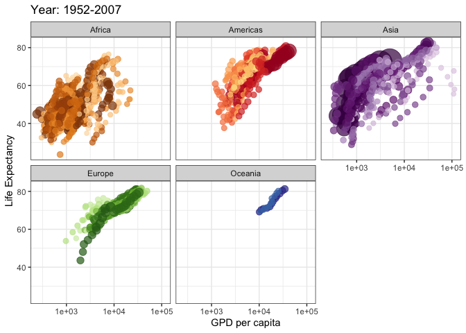<!-- -->
To turn it into an animation, we simply add a few functions:

1.  a new labs function overwrites the previous one, so we can
    dynamically display the changing years as the data points move
    across the plot.  
2.  the transition_time function takes in the year variable as an input
    and it allows the animated plot to transition frame by frame as a
    function of the year variable.
3.  ease_aes function takes in linear as an input argument and it
    defines the transition of the frame to be in a linear fashion.  
4.  since we saved this to p2, we now need to explicitly display it, so
    we call the animate function.
5.  the anim_save function allows the rendered animated plot to a .GIF
    file.

``` r
p2 <- p1 +
   labs(title = "Year: {frame_time}", x = "GDP per capita", y = "Life Expectancy") +
   transition_time(year) +
   ease_aes('linear')

animate(p2)
```

<!-- -->

``` r
anim_save("gapminder1.gif")
```

### Show preceding frames with gradual falloff

We can use `shadow_wake()` to draw a small wake after the data by
showing the latest frames up to the current. You can choose to gradually
diminish the size and/or opacity of the shadow. The length of the wake
is not given in absolute frames, it is given as a proportion of the
total length of the animation.

``` r
p3 <- p2 + 
   shadow_wake(wake_length = 0.3, alpha = FALSE)

animate(p3)
```

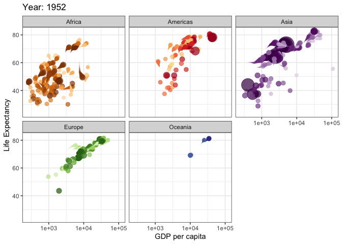<!-- -->

``` r
anim_save("gapminder2.gif")
```

### Show the original data as trail

Alternatively we can use `shadow_trail()` to show the original data as a
trail.

``` r
p4 <- p2 +
   shadow_trail()

animate(p4)
```

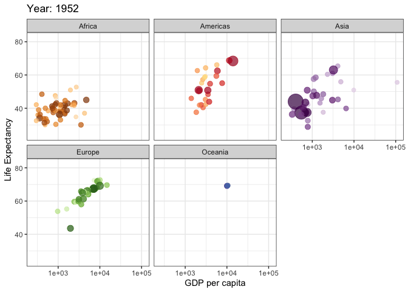<!-- -->

``` r
anim_save("gapminder3.gif")
```

### Reveal data along a given dimension

We’ve created a standard line plot of lifeExp by country, faceted by
continent.

``` r
p5 <- ggplot(gapminder %>% filter(continent == "Asia"), aes(year, lifeExp, color = country)) +
   geom_line(show.legend = FALSE)

p5
```

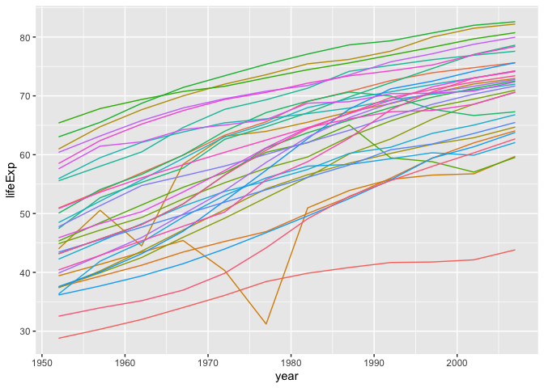<!-- -->

We can then call `transition_reveal` to let the data gradually appear,
by year. The `geom_point` call means that as it appears it shows a
point.

``` r
p6 <- p5 + 
   geom_point(show.legend = FALSE) +
   transition_reveal(year)

animate(p6)
```

    ## geom_path: Each group consists of only one observation. Do you need to adjust
    ## the group aesthetic?
    ## geom_path: Each group consists of only one observation. Do you need to adjust
    ## the group aesthetic?

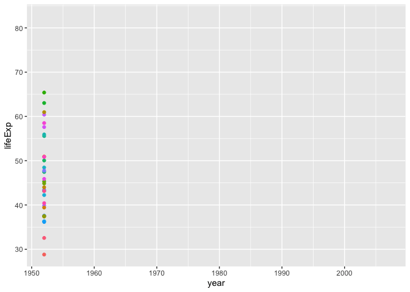<!-- -->

``` r
anim_save("gapminder4.gif")
```

### Morphing Bar Charts

Here we create a bar chart and then add an additional aesthetic called
`transition_states` that provides a frame variable of year. For each
value of the variable, a step on the chart will be drawn.

``` r
p7 <- gapminder %>% 
   group_by(year, continent) %>% 
   summarize(cont_pop = sum(pop)) %>% 
   ggplot(aes(continent, cont_pop, fill = continent)) +
   geom_bar(stat = "identity") +
   transition_states(year, transition_length = 2, state_length = 2) +
   ease_aes('sine-in-out') +
   labs(title = "Population in {closest_state}")
```

    ## `summarise()` has grouped output by 'year'. You can override using the
    ## `.groups` argument.

``` r
animate(p7)
```

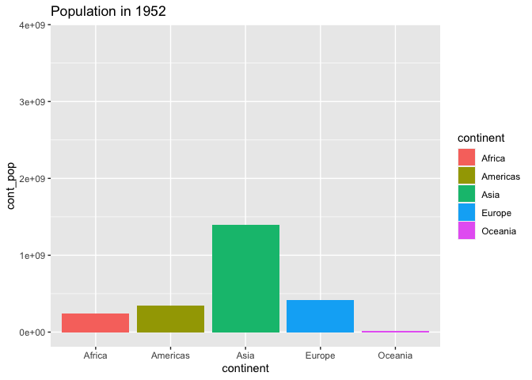<!-- -->

``` r
anim_save("gapminder5.gif")

print(p7)
```

### Barchart Race

First, we get the data prepped, which includes grouping by year, sort
descending by population, assigning the rank, and then filtering to the
top 10 for each year.

``` r
ranked_by_year <- gapminder %>% 
   select(country, pop, year, continent) %>% 
   group_by(year) %>% 
   arrange(year, -pop) %>% 
   mutate(rank = min_rank(-pop)) %>% 
   filter(rank <= 10)

ranked_by_year
```

    ## # A tibble: 120 × 5
    ## # Groups:   year [12]
    ##    country              pop  year continent  rank
    ##    <fct>              <int> <int> <fct>     <int>
    ##  1 China          556263527  1952 Asia          1
    ##  2 India          372000000  1952 Asia          2
    ##  3 United States  157553000  1952 Americas      3
    ##  4 Japan           86459025  1952 Asia          4
    ##  5 Indonesia       82052000  1952 Asia          5
    ##  6 Germany         69145952  1952 Europe        6
    ##  7 Brazil          56602560  1952 Americas      7
    ##  8 United Kingdom  50430000  1952 Europe        8
    ##  9 Italy           47666000  1952 Europe        9
    ## 10 Bangladesh      46886859  1952 Asia         10
    ## # … with 110 more rows

Then we create a static plot:

-   using `geom_rect` which needs the four corners of the rectangle.
-   Make the rectangles somewhat transparent.
-   Facet by year
-   Reverse the y scale
-   Change the limits on X so we can display labels better.
-   Call `geom_text` for the country labels.

This gives us our static faceted plot.

``` r
p8 <- ranked_by_year %>% 
   ggplot(aes(xmin = 0, xmax = pop / 1000000, 
              ymin = rank - .45, ymax = rank +.45, y = rank,
              fill = continent)) +
   geom_rect(alpha = .7) +
   facet_wrap(~ year) +
   scale_y_reverse() +
   scale_x_continuous(limits = c(-800, 1400)) +
   geom_text(x = -50, 
             hjust = "right", 
             col = "grey",
             aes(label = country)) +
   labs(x = "Population (millions)", 
        y = "") +
   theme_void()

print(p8)
```

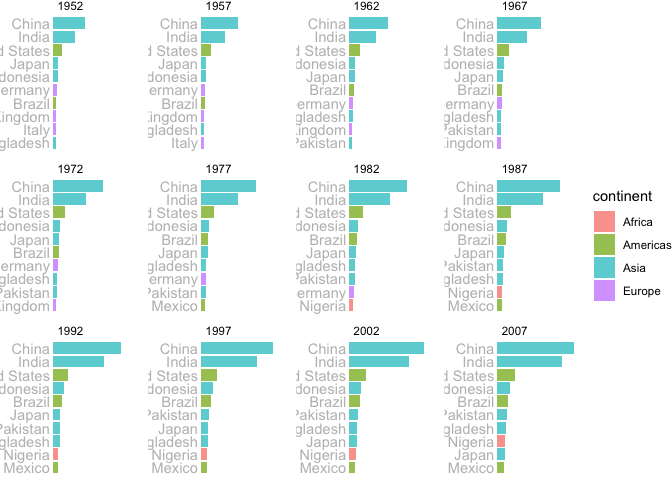<!-- -->

Then we remove the facet, refine the X scale, add a numeric label text,
set the group aesthetic to country and then set the `transition_time` to
one year. Then we save as a GIF.

``` r
p8 +
   facet_null() +
   scale_x_continuous(limits = c(-355, 1400)) +
   geom_text(x = 1000, y = -9.5, 
             aes(label = as.character(year)),
             size = 30, col = "grey") +
   aes(group = country) +
   transition_time(year)
```

    ## Scale for 'x' is already present. Adding another scale for 'x', which will
    ## replace the existing scale.

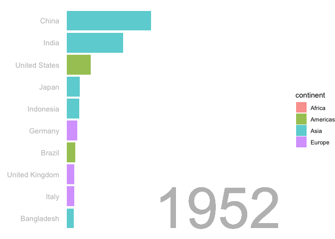<!-- -->

``` r
anim_save("bar_race1.gif")
```

### Another Racing Bar Chart demo

We begin by reading in the data direct from Git, select only the
variables and observations we need. Then clean up the data (changing
vars to numeric, renaming them), including pivoting it into a longer
dataset. Then we group by year, we rank it, we get some relative values,
we format a display label, and then limit it just to the top 10 for any
given year. Here’s what that data now looks like:

``` r
library(janitor)
```

    ## 
    ## Attaching package: 'janitor'

    ## The following objects are masked from 'package:stats':
    ## 
    ##     chisq.test, fisher.test

``` r
gdp <- read_csv("https://raw.githubusercontent.com/amrrs/animated_bar_charts_in_R/master/data/GDP_Data.csv")
```

    ## Rows: 269 Columns: 16

    ## ── Column specification ────────────────────────────────────────────────────────
    ## Delimiter: ","
    ## chr (16): Series Name, Series Code, Country Name, Country Code, 1990 [YR1990...
    ## 
    ## ℹ Use `spec()` to retrieve the full column specification for this data.
    ## ℹ Specify the column types or set `show_col_types = FALSE` to quiet this message.

``` r
gdp <- gdp %>% select(3:15)
gdp <- gdp[1:217,]
gdp_tidy <- gdp %>% 
   mutate_at(vars(contains("YR")), as.numeric) %>% 
   pivot_longer(cols = 3:13, names_to = "year") %>% 
   mutate(year = as.numeric(str_sub(year, 1, 4))) %>% 
   clean_names()
```

    ## Warning in mask$eval_all_mutate(quo): NAs introduced by coercion

    ## Warning in mask$eval_all_mutate(quo): NAs introduced by coercion

    ## Warning in mask$eval_all_mutate(quo): NAs introduced by coercion

    ## Warning in mask$eval_all_mutate(quo): NAs introduced by coercion

    ## Warning in mask$eval_all_mutate(quo): NAs introduced by coercion

    ## Warning in mask$eval_all_mutate(quo): NAs introduced by coercion

    ## Warning in mask$eval_all_mutate(quo): NAs introduced by coercion

    ## Warning in mask$eval_all_mutate(quo): NAs introduced by coercion

    ## Warning in mask$eval_all_mutate(quo): NAs introduced by coercion

    ## Warning in mask$eval_all_mutate(quo): NAs introduced by coercion

    ## Warning in mask$eval_all_mutate(quo): NAs introduced by coercion

``` r
gdp_formatted <- gdp_tidy %>% 
   group_by(year) %>% 
   mutate(rank = rank(-value),
          value_rel = value/value[rank==1],
          value_label = paste0(" ", round(value/1e9))) %>%
   filter(rank <= 10)

gdp_formatted
```

    ## # A tibble: 110 × 7
    ## # Groups:   year [11]
    ##    country_name country_code  year   value  rank value_rel value_label
    ##    <chr>        <chr>        <dbl>   <dbl> <dbl>     <dbl> <chr>      
    ##  1 Brazil       BRA           1990 4.62e11    10    0.0773 " 462"     
    ##  2 Brazil       BRA           2000 6.55e11    10    0.0637 " 655"     
    ##  3 Brazil       BRA           2009 1.67e12     8    0.116  " 1667"    
    ##  4 Brazil       BRA           2010 2.21e12     7    0.148  " 2209"    
    ##  5 Brazil       BRA           2011 2.62e12     7    0.169  " 2616"    
    ##  6 Brazil       BRA           2012 2.47e12     7    0.153  " 2465"    
    ##  7 Brazil       BRA           2013 2.47e12     7    0.148  " 2473"    
    ##  8 Brazil       BRA           2014 2.46e12     7    0.141  " 2456"    
    ##  9 Brazil       BRA           2015 1.80e12     9    0.0995 " 1802"    
    ## 10 Brazil       BRA           2016 1.79e12     9    0.0963 " 1794"    
    ## # … with 100 more rows

From there, we build the plot. A few notes:

-   This version uses `geom_tile`, which is basically the same as
    geom_rect, they just take different arguments.
-   We use `geom_text` for the Name label.
-   We use another `geom_text` for the value label.
-   Call `scales` to pretty up the Y scale display
-   Reverse the order of the X axis.
-   Then flip it all so it’s a horizontal bar
-   Finally we do a big old total theme cleanup

``` r
p9 <- ggplot(gdp_formatted, aes(rank, group = country_name, 
                                fill = as.factor(country_name),
                                color = as.factor(country_name))) +
   geom_tile(aes(y = value/2,
                 height = value,
                 width = 0.9), alpha = 0.8, color = NA) +
   geom_text(aes(y = 0, label = paste(country_name, " ")), vjust = 0.2, hjust = 1) +
   geom_text(aes(y = value, label = value_label, hjust = 0)) +
   scale_y_continuous(labels = scales::comma) +
   scale_x_reverse() +
   coord_flip(clip = "off", expand = FALSE) +
   theme(axis.line=element_blank(),
         axis.text.x=element_blank(),
         axis.text.y=element_blank(),
         axis.ticks=element_blank(),
         axis.title.x=element_blank(),
         axis.title.y=element_blank(),
         legend.position="none",
         panel.background=element_blank(),
         panel.border=element_blank(),
         panel.grid.major=element_blank(),
         panel.grid.minor=element_blank(),
         panel.grid.major.x = element_line( size=.1, color="grey" ),
         panel.grid.minor.x = element_line( size=.1, color="grey" ),
         plot.title=element_text(size=25, hjust=0.5, face="bold", colour="grey", vjust=-1),
         plot.subtitle=element_text(size=18, hjust=0.5, face="italic", color="grey"),
         plot.caption =element_text(size=8, hjust=0.5, face="italic", color="grey"),
         plot.background=element_blank(),
         plot.margin = margin(2,2, 2, 4, "cm")) 

print(p9)
```

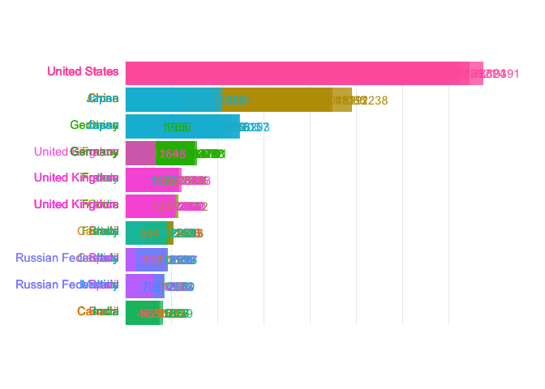<!-- -->

Now it’s time to animate. In the code below, we set the transition state
to cycle through year, take 4 times as long going to the next cut as we
do pausing there. We fix the X axis, but allow Y to vary, which is the
default behavior. We also set the title label to vary so that it
captures the closest state (year). Finally we animate and then save it
as a GIF.

``` r
p10 <- p9 +
   transition_states(year, transition_length = 4, state_length = 1) +
   view_follow(fixed_x = TRUE) +
   labs(title = "GPD per Year :  {closest_state}",
        subtitle = "Top 10 Countries",
        caption = "GDP in Billions USD | Data Source: World Bank Data")

animate(p10)
```

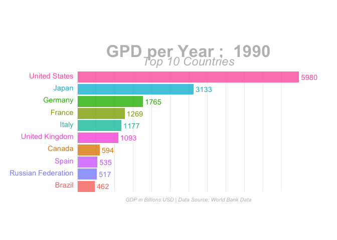<!-- -->

``` r
anim_save("bar_race2.gif")
```

### Dynamic Maps with Leaflet

Leaflet is a powerful open-source JavaScript library for building
interactive maps in HTML.

The architecture is very similar to ggplot2, but instead of putting
data-based layers on top of a static map, leaflet allows you to put
data-based layers on top of an interactive map.

A leaflet map widget is created with the `leaflet()` command. We then
add layers to the widget. The first layer that we will add is a tile
layer containing all of the static map information, which by default
comes from OpenStreetMap. The second layer we will add here is a marker,
which designates a point location. Notice how the addMarkers() function
can take a data argument, just like a geom\_\*() layer in ggplot2 would.

``` r
white_house <- tibble(
   address = "The White House, Washington, DC"
) %>% 
   tidygeocoder::geocode(address, method = "osm")
```

    ## Passing 1 address to the Nominatim single address geocoder

    ## Query completed in: 1 seconds

``` r
library(leaflet)
```

    ## Warning: package 'leaflet' was built under R version 4.0.5

``` r
white_house_map <- leaflet() %>% 
   addTiles() %>% 
   addMarkers(data = white_house)
```

    ## Assuming "long" and "lat" are longitude and latitude, respectively

``` r
white_house_map
```

<div id="htmlwidget-a201ab7dbd4564199b8e" style="width:672px;height:480px;" class="leaflet html-widget"></div>
<script type="application/json" data-for="htmlwidget-a201ab7dbd4564199b8e">{"x":{"options":{"crs":{"crsClass":"L.CRS.EPSG3857","code":null,"proj4def":null,"projectedBounds":null,"options":{}}},"calls":[{"method":"addTiles","args":["https://{s}.tile.openstreetmap.org/{z}/{x}/{y}.png",null,null,{"minZoom":0,"maxZoom":18,"tileSize":256,"subdomains":"abc","errorTileUrl":"","tms":false,"noWrap":false,"zoomOffset":0,"zoomReverse":false,"opacity":1,"zIndex":1,"detectRetina":false,"attribution":"&copy; <a href=\"https://openstreetmap.org\">OpenStreetMap<\/a> contributors, <a href=\"https://creativecommons.org/licenses/by-sa/2.0/\">CC-BY-SA<\/a>"}]},{"method":"addMarkers","args":[38.8976997,-77.03655315,null,null,null,{"interactive":true,"draggable":false,"keyboard":true,"title":"","alt":"","zIndexOffset":0,"opacity":1,"riseOnHover":false,"riseOffset":250},null,null,null,null,null,{"interactive":false,"permanent":false,"direction":"auto","opacity":1,"offset":[0,0],"textsize":"10px","textOnly":false,"className":"","sticky":true},null]}],"limits":{"lat":[38.8976997,38.8976997],"lng":[-77.03655315,-77.03655315]}},"evals":[],"jsHooks":[]}</script>

You can scroll and zoom at will!

You can also add a pop-up to provide more information about a particular
location. Notice how we only need to call the previously saved leaflet
map and then add a Popup layer to it.

``` r
white_house <- white_house %>% 
   mutate(title = "The White House", 
          street_address = "1600 Pennsylvania Ave")

white_house_map %>% 
   addPopups(data = white_house, 
             popup = ~paste0("<b>", title, "</b></br>", street_address))
```

    ## Assuming "long" and "lat" are longitude and latitude, respectively

<div id="htmlwidget-4f6a4eeb8120d9c98ecb" style="width:672px;height:480px;" class="leaflet html-widget"></div>
<script type="application/json" data-for="htmlwidget-4f6a4eeb8120d9c98ecb">{"x":{"options":{"crs":{"crsClass":"L.CRS.EPSG3857","code":null,"proj4def":null,"projectedBounds":null,"options":{}}},"calls":[{"method":"addTiles","args":["https://{s}.tile.openstreetmap.org/{z}/{x}/{y}.png",null,null,{"minZoom":0,"maxZoom":18,"tileSize":256,"subdomains":"abc","errorTileUrl":"","tms":false,"noWrap":false,"zoomOffset":0,"zoomReverse":false,"opacity":1,"zIndex":1,"detectRetina":false,"attribution":"&copy; <a href=\"https://openstreetmap.org\">OpenStreetMap<\/a> contributors, <a href=\"https://creativecommons.org/licenses/by-sa/2.0/\">CC-BY-SA<\/a>"}]},{"method":"addMarkers","args":[38.8976997,-77.03655315,null,null,null,{"interactive":true,"draggable":false,"keyboard":true,"title":"","alt":"","zIndexOffset":0,"opacity":1,"riseOnHover":false,"riseOffset":250},null,null,null,null,null,{"interactive":false,"permanent":false,"direction":"auto","opacity":1,"offset":[0,0],"textsize":"10px","textOnly":false,"className":"","sticky":true},null]},{"method":"addPopups","args":[38.8976997,-77.03655315,"<b>The White House<\/b><\/br>1600 Pennsylvania Ave",null,null,{"maxWidth":300,"minWidth":50,"autoPan":true,"keepInView":false,"closeButton":true,"className":""}]}],"limits":{"lat":[38.8976997,38.8976997],"lng":[-77.03655315,-77.03655315]}},"evals":[],"jsHooks":[]}</script>

There are several different providers of tiles. Below we’ll demonstrate
two others, and we’ll also see how we can set a specific view and zoom
level.

``` r
# Background 1: NASA
leaflet() %>% 
   addTiles() %>% 
   setView(lng = 2.34, lat = 48.85, zoom = 5) %>% 
   addProviderTiles("NASAGIBS.ViirsEarthAtNight2012")
```

<div id="htmlwidget-daca5d1a8c3447c9e581" style="width:672px;height:480px;" class="leaflet html-widget"></div>
<script type="application/json" data-for="htmlwidget-daca5d1a8c3447c9e581">{"x":{"options":{"crs":{"crsClass":"L.CRS.EPSG3857","code":null,"proj4def":null,"projectedBounds":null,"options":{}}},"calls":[{"method":"addTiles","args":["https://{s}.tile.openstreetmap.org/{z}/{x}/{y}.png",null,null,{"minZoom":0,"maxZoom":18,"tileSize":256,"subdomains":"abc","errorTileUrl":"","tms":false,"noWrap":false,"zoomOffset":0,"zoomReverse":false,"opacity":1,"zIndex":1,"detectRetina":false,"attribution":"&copy; <a href=\"https://openstreetmap.org\">OpenStreetMap<\/a> contributors, <a href=\"https://creativecommons.org/licenses/by-sa/2.0/\">CC-BY-SA<\/a>"}]},{"method":"addProviderTiles","args":["NASAGIBS.ViirsEarthAtNight2012",null,null,{"errorTileUrl":"","noWrap":false,"detectRetina":false}]}],"setView":[[48.85,2.34],5,[]]},"evals":[],"jsHooks":[]}</script>

``` r
# Background 2: World Imagery
leaflet() %>% 
   addTiles() %>% 
   setView(lng = 2.34, lat = 48.85, zoom = 3) %>% 
   addProviderTiles("Esri.WorldImagery")
```

<div id="htmlwidget-24a9af430b4b45a1af65" style="width:672px;height:480px;" class="leaflet html-widget"></div>
<script type="application/json" data-for="htmlwidget-24a9af430b4b45a1af65">{"x":{"options":{"crs":{"crsClass":"L.CRS.EPSG3857","code":null,"proj4def":null,"projectedBounds":null,"options":{}}},"calls":[{"method":"addTiles","args":["https://{s}.tile.openstreetmap.org/{z}/{x}/{y}.png",null,null,{"minZoom":0,"maxZoom":18,"tileSize":256,"subdomains":"abc","errorTileUrl":"","tms":false,"noWrap":false,"zoomOffset":0,"zoomReverse":false,"opacity":1,"zIndex":1,"detectRetina":false,"attribution":"&copy; <a href=\"https://openstreetmap.org\">OpenStreetMap<\/a> contributors, <a href=\"https://creativecommons.org/licenses/by-sa/2.0/\">CC-BY-SA<\/a>"}]},{"method":"addProviderTiles","args":["Esri.WorldImagery",null,null,{"errorTileUrl":"","noWrap":false,"detectRetina":false}]}],"setView":[[48.85,2.34],3,[]]},"evals":[],"jsHooks":[]}</script>

### Choropleth Maps

We’ll be showing 2016 House election results in NC.

``` r
# install.packages("fec16")
library(fec16)

nc_results <- results_house %>% # built in fec16 data
   mutate(district = parse_number(district_id)) %>% 
   left_join(candidates, by = "cand_id") %>% # candidates is also built in fec16 data
   select(state, district, cand_name, party, general_votes) %>% 
   arrange(desc(general_votes)) %>% 
   filter(state == "NC") %>% 
   group_by(state, district) %>% 
   summarize(N = n(), 
             total_votes = sum(general_votes, na.rm = T),
             d_votes = sum(ifelse(party == "DEM", general_votes, 0), na.rm = T),
             r_votes = sum(ifelse(party == "REP", general_votes, 0), na.rm = T),
             other_votes = total_votes - d_votes - r_votes, 
             r_prop = r_votes / total_votes, 
             winner = ifelse(r_votes > d_votes, "Republican", "Democrat"))
```

    ## `summarise()` has grouped output by 'state'. You can override using the
    ## `.groups` argument.

``` r
nc_results
```

    ## # A tibble: 13 × 9
    ## # Groups:   state [1]
    ##    state district     N total_votes d_votes r_votes other_votes r_prop winner   
    ##    <chr>    <dbl> <int>       <dbl>   <dbl>   <dbl>       <dbl>  <dbl> <chr>    
    ##  1 NC           1     3      350699  240661  101567        8471  0.290 Democrat 
    ##  2 NC           2     8      390567  169082  221485           0  0.567 Republic…
    ##  3 NC           3     5      323701  106170  217531           0  0.672 Republic…
    ##  4 NC           4     3      409541  279380  130161           0  0.318 Democrat 
    ##  5 NC           5     5      355512  147887  207625           0  0.584 Republic…
    ##  6 NC           6     3      351150  143167  207983           0  0.592 Republic…
    ##  7 NC           7     2      347706  135905  211801           0  0.609 Republic…
    ##  8 NC           8     3      323045  133182  189863           0  0.588 Republic…
    ##  9 NC           9     4      332493  139041  193452           0  0.582 Republic…
    ## 10 NC          10     5      349744  128919  220825           0  0.631 Republic…
    ## 11 NC          11     3      359508  129103  230405           0  0.641 Republic…
    ## 12 NC          12    10      349300  234115  115185           0  0.330 Democrat 
    ## 13 NC          13    22      355492  156049  199443           0  0.561 Republic…

Now we need a congressional district shapefile for the 114th Congress.
Remember that the `USAboundaries` package has CD files. We also need to
load up the `sf` library so we can work with sf data.

``` r
library(sf)
```

    ## Warning: package 'sf' was built under R version 4.0.5

    ## Linking to GEOS 3.9.1, GDAL 3.4.0, PROJ 8.1.1; sf_use_s2() is TRUE

``` r
library(USAboundaries)
nc_map <- us_congressional(resolution = "high", states = "NC")

ggplot(nc_map) +
   geom_sf()
```

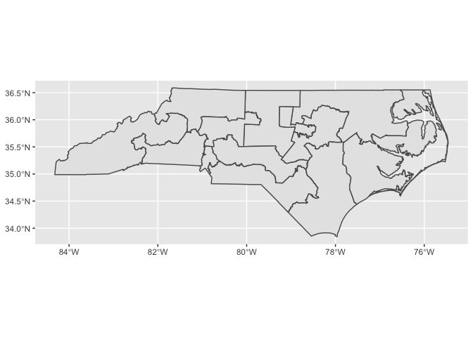<!-- -->

We need to merge in the election data with the shape file. The simplest
way to do that is to use an `inner_join()`. Here we merge the nc_shp
polygons with the nc_results election data frame using the district as
the key.

``` r
nc_merged <- nc_map %>% 
   mutate(district = str_remove(cd116fp, "^0+") %>% as.numeric) %>% 
   inner_join(nc_results, by = "district")

glimpse(nc_merged)
```

    ## Rows: 13
    ## Columns: 22
    ## $ statefp           <chr> "37", "37", "37", "37", "37", "37", "37", "37", "37"…
    ## $ cd116fp           <chr> "01", "06", "05", "13", "09", "07", "02", "11", "04"…
    ## $ affgeoid          <chr> "5001600US3701", "5001600US3706", "5001600US3705", "…
    ## $ geoid             <chr> "3701", "3706", "3705", "3713", "3709", "3707", "370…
    ## $ namelsad          <chr> "Congressional District 1", "Congressional District …
    ## $ lsad              <chr> "C2", "C2", "C2", "C2", "C2", "C2", "C2", "C2", "C2"…
    ## $ cdsessn           <chr> "116", "116", "116", "116", "116", "116", "116", "11…
    ## $ aland             <dbl> 15207152815, 10128871422, 10280081294, 4745301686, 1…
    ## $ awater            <dbl> 525752701, 209014034, 80701577, 105117478, 85773395,…
    ## $ state_name        <chr> "North Carolina", "North Carolina", "North Carolina"…
    ## $ state_abbr        <chr> "NC", "NC", "NC", "NC", "NC", "NC", "NC", "NC", "NC"…
    ## $ jurisdiction_type <chr> "state", "state", "state", "state", "state", "state"…
    ## $ district          <dbl> 1, 6, 5, 13, 9, 7, 2, 11, 4, 10, 8, 3, 12
    ## $ state             <chr> "NC", "NC", "NC", "NC", "NC", "NC", "NC", "NC", "NC"…
    ## $ N                 <int> 3, 3, 5, 22, 4, 2, 8, 3, 3, 5, 3, 5, 10
    ## $ total_votes       <dbl> 350699, 351150, 355512, 355492, 332493, 347706, 3905…
    ## $ d_votes           <dbl> 240661, 143167, 147887, 156049, 139041, 135905, 1690…
    ## $ r_votes           <dbl> 101567, 207983, 207625, 199443, 193452, 211801, 2214…
    ## $ other_votes       <dbl> 8471, 0, 0, 0, 0, 0, 0, 0, 0, 0, 0, 0, 0
    ## $ r_prop            <dbl> 0.2896130, 0.5922910, 0.5840169, 0.5610337, 0.581822…
    ## $ winner            <chr> "Democrat", "Republican", "Republican", "Republican"…
    ## $ geometry          <MULTIPOLYGON [°]> MULTIPOLYGON (((-79.00854 3..., MULTIPOLYGON (((-80.…

We can use Leaflet. First we will define a color palette over the values
\[0,1\] that ranges from red to blue. According to the documentation,
`colorNumeric()`:

> Conveniently maps data values (numeric or factor/character) to colors
> according to a given palette, which can be provided in a variety of
> formats.

The `domain` parameter tells it the possible values that can be mapped.

``` r
pal <- colorNumeric(palette = "RdBu", domain = c(0,1))
```

To make the plot in Leaflet, we have to add the tiles, and then the
polygons defined by the sf object nc_merged. Since we want red to be
associated with the proportion of Republican votes, we will map
‘1-r_prop’ to color. Note that we also add popups with the actual
proportions, so that if you click on the map, it will show the district
number and the proportion of Republican votes.

``` r
leaflet_nc <- leaflet(nc_merged) %>% 
   addTiles() %>% 
   addPolygons(
      weight = 1, fillOpacity = 0.7,
      color = ~pal(1 - r_prop),
      popup = ~paste("District", district, "</br>", round(r_prop, 4))) %>% 
   setView(lng = -80, lat = 35, zoom = 7)

leaflet_nc
```

<div id="htmlwidget-ee40d9231b26238069a9" style="width:672px;height:480px;" class="leaflet html-widget"></div>
<script type="application/json" data-for="htmlwidget-ee40d9231b26238069a9">{"x":{"options":{"crs":{"crsClass":"L.CRS.EPSG3857","code":null,"proj4def":null,"projectedBounds":null,"options":{}}},"calls":[{"method":"addTiles","args":["https://{s}.tile.openstreetmap.org/{z}/{x}/{y}.png",null,null,{"minZoom":0,"maxZoom":18,"tileSize":256,"subdomains":"abc","errorTileUrl":"","tms":false,"noWrap":false,"zoomOffset":0,"zoomReverse":false,"opacity":1,"zIndex":1,"detectRetina":false,"attribution":"&copy; <a href=\"https://openstreetmap.org\">OpenStreetMap<\/a> contributors, <a href=\"https://creativecommons.org/licenses/by-sa/2.0/\">CC-BY-SA<\/a>"}]},{"method":"addPolygons","args":[[[[{"lng":[-79.008541,-79.007457,-79.006887,-79.004389,-79.003555,-79.00213,-79.001558,-79.001238,-79.000968,-79.000856,-79.000737,-78.999826,-78.998629,-78.997574,-78.997356,-78.996892,-78.996612,-78.996137,-78.995414,-78.995315,-78.994349,-78.994187,-78.990693,-78.988504,-78.987354,-78.987303,-78.987293,-78.986568,-78.985788,-78.985892,-78.985885,-78.985844,-78.985662,-78.984973,-78.983994,-78.982633,-78.981155,-78.978961,-78.978234,-78.978078,-78.978732,-78.978344,-78.977704,-78.97689,-78.977372,-78.972766,-78.971617,-78.970794,-78.970037,-78.970666,-78.968853,-78.968461,-78.967326,-78.967257,-78.967324,-78.966863,-78.967567,-78.967447,-78.966365,-78.966004,-78.966051,-78.961314,-78.960437,-78.960241,-78.959712,-78.959913,-78.950597,-78.936611,-78.933925,-78.932939,-78.932527,-78.918203,-78.906142,-78.88861,-78.83197,-78.831387,-78.826832,-78.802335,-78.80152,-78.800497,-78.799955,-78.799795,-78.799546,-78.797482,-78.79723,-78.797099,-78.796738,-78.794845,-78.7962710014091,-78.7850569714734,-78.7775800783612,-78.7671079869564,-78.76543,-78.758392,-78.7341219239254,-78.6823507732118,-78.670051,-78.663317,-78.6548665646087,-78.6259589897076,-78.605304,-78.5960472652239,-78.5391641573499,-78.533013,-78.529722,-78.509965,-78.4767440665224,-78.471022,-78.470792,-78.45697,-78.4569670005471,-78.441199,-78.436333,-78.3836893503433,-78.3240036520265,-78.3239883198677,-78.323912,-78.3130008013445,-78.2644230174927,-78.246681,-78.245462,-78.1983393253484,-78.133323,-78.132911,-78.1296851159471,-78.1053460069186,-78.0464645366748,-78.0462187396896,-78.0462112119251,-78.03942,-78.038938,-77.9007418764115,-77.899771,-77.882357,-77.8822265251281,-77.87528,-77.8680661464267,-77.8680467481856,-77.8290893849905,-77.7722852822259,-77.7671232503754,-77.749706,-77.7387978789664,-77.645558869961,-77.5870968437672,-77.5764069410784,-77.576129444506,-77.4987033434975,-77.4987020238325,-77.4976419666789,-77.4744447700555,-77.372709824248,-77.2968751997552,-77.2532080706078,-77.2531630452103,-77.2286798283166,-77.2261838115973,-77.205156,-77.190175,-77.16966,-77.1645,-77.164370064468,-77.152691,-77.124812,-77.1030250031878,-77.095062,-77.0690766741504,-77.011287088485,-76.9216282207176,-76.916048,-76.916060288835,-76.917318,-76.916989,-76.915897,-76.807078,-76.7813994753598,-76.781296,-76.7552893942129,-76.7552579537256,-76.749678,-76.738329,-76.7381147015005,-76.7151510790619,-76.632872902435,-76.5755249999365,-76.575496,-76.5579380488928,-76.541687,-76.5415364676522,-76.491336,-76.491405,-76.487533,-76.476473,-76.453711,-76.539177,-76.547717,-76.556881,-76.559646,-76.570756,-76.575418,-76.580172,-76.580948,-76.586214,-76.590517,-76.592786,-76.593699,-76.594095,-76.596603,-76.599068,-76.6017,-76.60554,-76.608595,-76.60961,-76.613072,-76.618338,-76.620713,-76.622593,-76.624687,-76.626877,-76.632887,-76.639652,-76.64028,-76.641269,-76.642543,-76.642073,-76.64255,-76.644003,-76.646878,-76.649884,-76.650393,-76.650698,-76.650375,-76.651565,-76.653045,-76.654267,-76.654739,-76.653478,-76.654101,-76.656892,-76.65721,-76.658547,-76.659376,-76.661291,-76.664789,-76.665084,-76.667001,-76.667598,-76.669852,-76.670305,-76.672441,-76.672028,-76.673742,-76.674906,-76.672315,-76.673019,-76.675391,-76.675983,-76.67549,-76.674559,-76.672294,-76.67258,-76.6754,-76.675576,-76.677019,-76.677738,-76.679149,-76.681049,-76.683032,-76.684217,-76.68844,-76.696571,-76.695568,-76.694813,-76.6937993269796,-76.699979,-76.701405,-76.698315,-76.697757,-76.705683,-76.708969,-76.721846,-76.7222258244781,-76.725022,-76.72755,-76.731353,-76.73468,-76.737057,-76.737532,-76.741335,-76.745138,-76.749892,-76.750843,-76.747753,-76.752031,-76.7527944582954,-76.753457,-76.751556,-76.753932,-76.754645,-76.7542038953874,-76.75417,-76.751556,-76.749416,-76.744188,-76.740622,-76.735869,-76.734205,-76.730164,-76.726044,-76.726837,-76.729451,-76.728738,-76.730877,-76.728976,-76.727312,-76.725411,-76.72042,-76.718043,-76.705607,-76.70806,-76.705683,-76.704733,-76.703782,-76.703782,-76.7008381873512,-76.696889,-76.685956,-76.68387,-76.681915,-76.684768,-76.687331,-76.69475,-76.699979,-76.706396,-76.719469,-76.724935,-76.726599,-76.722431086182,-76.7177221166171,-76.713527,-76.707347,-76.697602,-76.6930493376253,-76.692849,-76.683587,-76.679063,-76.673866,-76.667548,-76.662426,-76.653869,-76.640321,-76.608053,-76.603841,-76.6029861387682,-76.586993,-76.573758,-76.5681569274279,-76.560223,-76.5600360038385,-76.5555025703553,-76.553806,-76.528552,-76.5200179802192,-76.507492,-76.496962,-76.490108,-76.484335,-76.473796,-76.468717,-76.458496,-76.423599,-76.406445,-76.399552,-76.392422,-76.384103,-76.384103,-76.381395,-76.37421,-76.378398,-76.382677,-76.382201,-76.379111,-76.374596,-76.372694,-76.371391444684,-76.370793,-76.367227,-76.3662209340871,-76.367419,-76.367786,-76.36921,-76.370715,-76.370654,-76.380009,-76.373104,-76.369646,-76.360222,-76.353669,-76.353554,-76.405603,-76.405971,-76.504062,-76.531496,-76.545621,-76.559242,-76.606775,-76.637513,-76.638009,-76.655444,-76.715179,-76.754903,-76.763301,-76.829536,-76.84462,-76.847264,-76.862885,-76.900397,-76.947741,-76.985842,-77.00849,-77.034646,-77.05589,-77.066451,-77.068985,-77.075626,-77.107155,-77.129129,-77.156765,-77.16384,-77.164847,-77.165522,-77.168725,-77.171987,-77.174,-77.173353,-77.175088,-77.17353,-77.174589,-77.172299,-77.17115,-77.170256,-77.170939,-77.173481,-77.177868,-77.179182,-77.180361,-77.182057,-77.183324,-77.184178,-77.185706,-77.185837,-77.187717,-77.187174,-77.188291,-77.190687,-77.191637,-77.193949,-77.193727,-77.194594,-77.194645,-77.193588,-77.193589,-77.195772,-77.194818,-77.194639,-77.192982,-77.190191,-77.187847,-77.183315,-77.180885,-77.180767,-77.179781,-77.179833,-77.177067,-77.175321,-77.172893,-77.17078,-77.169849,-77.170395,-77.169348,-77.170415,-77.17185,-77.171885,-77.170024,-77.168696,-77.168494,-77.167093,-77.168559,-77.172008,-77.175867,-77.177453,-77.178541,-77.180116,-77.180683,-77.177642,-77.177765,-77.174673,-77.174885,-77.173627,-77.17337,-77.172753,-77.173303,-77.172766,-77.173959,-77.170905,-77.168248,-77.165491,-77.164559,-77.163099,-77.162124,-77.162193,-77.160488,-77.159495,-77.156593,-77.154154,-77.150528,-77.150174,-77.147975,-77.147124,-77.143553,-77.14239,-77.14454,-77.143747,-77.143964,-77.145481,-77.142517,-77.140249,-77.140792,-77.141958,-77.144953,-77.147086,-77.146277,-77.149989,-77.150823,-77.1497,-77.146326,-77.143819,-77.144213,-77.142428,-77.141765,-77.139521,-77.139061,-77.137282,-77.137733,-77.136147,-77.136924,-77.134656,-77.132089,-77.129767,-77.129202,-77.127257,-77.126423,-77.125873,-77.124644,-77.123733,-77.121915,-77.123866,-77.123111,-77.124004,-77.123201,-77.123982,-77.125414,-77.125352,-77.119579,-77.118047,-77.117649,-77.118463,-77.116454,-77.114425,-77.113826,-77.117208,-77.115025,-77.112516,-77.111382,-77.109897,-77.106676,-77.107282,-77.109441,-77.109866,-77.111883,-77.111247,-77.110165,-77.110453,-77.108824,-77.108136,-77.107134,-77.104773,-77.101437,-77.10223,-77.100518,-77.101636,-77.098838,-77.096627,-77.094103,-77.091283,-77.09017,-77.089452,-77.087435,-77.086581,-77.089548,-77.08946,-77.087614,-77.089085,-77.088814,-77.084643,-77.086327,-77.090679,-77.093515,-77.100803,-77.100701,-77.099612,-77.100577,-77.103538,-77.104541,-77.10584,-77.106167,-77.107279,-77.109056,-77.111975,-77.113072,-77.120044,-77.124745,-77.127705,-77.130202,-77.131901,-77.133879,-77.138404,-77.140447,-77.147181,-77.152099,-77.156485,-77.160314,-77.174703,-77.176013,-77.179282,-77.179304,-77.179313,-77.180208,-77.183683,-77.185211,-77.190415,-77.194078,-77.195782,-77.198419,-77.201062,-77.202099,-77.205315,-77.213193,-77.214612,-77.21988,-77.225214,-77.23854,-77.245014,-77.249683,-77.255003,-77.260424,-77.264236,-77.26924,-77.272535,-77.275538,-77.277168,-77.280924,-77.282422,-77.282852,-77.284401,-77.289487,-77.290682,-77.293087,-77.297999,-77.29912,-77.29961,-77.300779,-77.302118,-77.312243,-77.311155,-77.313763,-77.321954,-77.323063,-77.323725,-77.333893,-77.33807,-77.34211,-77.3424,-77.341374,-77.341736,-77.341706,-77.341916,-77.342574,-77.34551,-77.346464,-77.347627,-77.35131,-77.351886,-77.352623,-77.355871,-77.35637,-77.362632,-77.36597,-77.369589,-77.367943,-77.370839,-77.370517,-77.369024,-77.367378,-77.368067,-77.36928,-77.37057,-77.371901,-77.37503,-77.375964,-77.381735,-77.384303,-77.385211,-77.385824,-77.385895,-77.386295,-77.387477,-77.393949,-77.394576,-77.39718,-77.405117,-77.405648,-77.40633,-77.408796,-77.411845,-77.411934,-77.417491,-77.419343,-77.42035,-77.426071,-77.430317,-77.443084,-77.44366,-77.448452,-77.452624,-77.456737,-77.457405,-77.461816,-77.454949,-77.446792,-77.445646,-77.443585,-77.440413,-77.439403,-77.437913,-77.434413,-77.433772,-77.432541,-77.43119,-77.433328,-77.433804,-77.43334,-77.433331,-77.433328,-77.432821,-77.43239,-77.429737,-77.426666,-77.424913,-77.427733,-77.430098,-77.442475,-77.442151,-77.441327,-77.440873,-77.437923,-77.435029,-77.431601,-77.430037,-77.429456,-77.429154,-77.429034,-77.428974,-77.42721,-77.426391,-77.435708,-77.437879,-77.439203,-77.439624,-77.439993,-77.438088,-77.436666,-77.435093,-77.431804,-77.424991,-77.421656,-77.419734,-77.419202,-77.41729,-77.416017,-77.415913,-77.410546,-77.402311,-77.402131,-77.403855,-77.404643,-77.405448,-77.406474,-77.407112,-77.408734,-77.410457,-77.413455,-77.416515,-77.417238,-77.417514,-77.419697,-77.425796,-77.432084,-77.437256,-77.441023,-77.446708,-77.448639,-77.450926,-77.451666,-77.45313,-77.457662,-77.459497,-77.46041,-77.463541,-77.465112,-77.468482,-77.468866,-77.470168,-77.473998,-77.478254,-77.478409,-77.476204,-77.475881,-77.476886,-77.483308,-77.487203,-77.4888,-77.48975,-77.490738,-77.492899,-77.493977,-77.497327,-77.498978,-77.499746,-77.500859,-77.504936,-77.507697,-77.515594,-77.520871,-77.521626,-77.523123,-77.522939,-77.523112,-77.522464,-77.520844,-77.516656,-77.515349,-77.515871,-77.516479,-77.531262,-77.545536,-77.561225,-77.580911,-77.624074,-77.645348,-77.665131,-77.670255,-77.688107,-77.700692,-77.732939,-77.753509,-77.801777,-77.80623,-77.808395,-77.815058,-77.816456,-77.822511,-77.82347,-77.823601,-77.824362,-77.839402,-77.84079,-77.873751,-77.872953,-77.87009,-77.869135,-77.869134,-77.871876,-77.87233,-77.86926,-77.866354,-77.864567,-77.863481,-77.865246,-77.865835,-77.864435,-77.859644,-77.859448,-77.859868,-77.862669,-77.863984,-77.864795,-77.865016,-77.868662,-77.871933,-77.872959,-77.874327,-77.87525,-77.875,-77.876091,-77.875837,-77.871928,-77.872798,-77.871509,-77.872603,-77.870613,-77.871731,-77.873413,-77.875038,-77.874171,-77.873978,-77.875175,-77.878118,-77.880442,-77.880581,-77.881872,-77.882459,-77.883973,-77.886242,-77.886971,-77.888402,-77.890178,-77.887052,-77.894113,-77.895151,-77.900337,-77.903758,-77.904907,-77.903729,-77.905299,-77.907007,-77.90737,-77.908883,-77.911404,-77.911796,-77.910831,-77.911514,-77.911319,-77.912864,-77.91292,-77.914265,-77.916116,-77.92021,-77.925118,-77.92997,-77.931248,-77.931595,-77.934732,-77.936247,-77.938866,-77.94283,-77.947717,-77.949732,-77.955894,-77.960948,-77.96535,-77.960675,-77.959655,-77.961592,-77.961711,-77.962164,-77.962279,-77.962337,-77.963163,-77.963826,-77.965879,-77.967128,-77.968283,-77.969774,-77.971666,-77.972769,-77.972912,-77.972788,-77.972995,-77.972695,-77.972738,-77.972791,-77.972878,-77.972651,-77.972285,-77.972088,-77.972071,-77.972044,-77.972004,-77.972117,-77.972005,-77.971248,-77.970667,-77.97049,-77.970126,-77.969509,-77.969509,-77.970717,-77.970998,-77.971077,-77.972123,-77.9723,-77.972273,-77.972461,-77.972956,-77.973865,-77.974413,-77.97445,-77.974903,-77.975278,-77.975461,-77.973948,-77.967491,-77.966088,-77.965277,-77.964152,-77.960072,-77.957293,-77.953606,-77.95034,-77.94337,-77.940772,-77.949214,-77.947101,-77.942289,-77.941394,-77.938864,-77.935536,-77.933653,-77.935493,-77.934546,-77.930847,-77.93233,-77.927437,-77.927922,-77.923823,-77.919308,-77.919012,-77.911493,-77.911767,-77.914373,-77.920831,-77.921298,-77.920409,-77.918972,-77.917248,-77.915349,-77.915501,-77.915908,-77.91707,-77.919043,-77.91841,-77.918452,-77.915657,-77.897358,-77.883088,-77.873867,-77.862952,-77.855101,-77.853453,-77.844737,-77.835178,-77.832983,-77.828444,-77.826133,-77.826,-77.820998,-77.818604,-77.817644,-77.816591,-77.814158,-77.80906,-77.806132,-77.804189,-77.801547,-77.798795,-77.797878,-77.795353,-77.79452,-77.791967,-77.789654,-77.788478,-77.78272,-77.777751,-77.775993,-77.774097,-77.771789,-77.767681,-77.767354,-77.758799,-77.754058,-77.751764,-77.746841,-77.746617,-77.741924,-77.732998,-77.71701,-77.709667,-77.708522,-77.706966,-77.705821,-77.705387,-77.70404,-77.703187,-77.701113,-77.698024,-77.699456,-77.702999,-77.70377,-77.704924,-77.707029,-77.70646,-77.711481,-77.712856,-77.714908,-77.716763,-77.7192,-77.721149,-77.720099,-77.719828,-77.71642,-77.717376,-77.721332,-77.7235,-77.725941,-77.731528,-77.730067,-77.730826,-77.729676,-77.731858,-77.734216,-77.735863,-77.737184,-77.741905,-77.743825,-77.745694,-77.746842,-77.749009,-77.750068,-77.7528,-77.753229,-77.753154,-77.753854,-77.757527,-77.764781,-77.770256,-77.772185,-77.77292,-77.773849,-77.774001,-77.774005,-77.775748,-77.77819,-77.778885,-77.779952,-77.781036,-77.781438,-77.782119,-77.783119,-77.783677,-77.786401,-77.786851,-77.792486,-77.800658,-77.802148,-77.802126,-77.804283,-77.805761,-77.805916,-77.805153,-77.805296,-77.807355,-77.808774,-77.814673,-77.817707,-77.818844,-77.821371,-77.824404,-77.830722,-77.832888,-77.836077,-77.84126,-77.846836,-77.849389,-77.852268,-77.855599,-77.857008,-77.860523,-77.861858,-77.865778,-77.868024,-77.869731,-77.871354,-77.875356,-77.877638,-77.878924,-77.879413,-77.881761,-77.884231,-77.885559,-77.885912,-77.887876,-77.888329,-77.890995,-77.891739,-77.892354,-77.89557,-77.900742,-77.901385,-77.901289,-77.900739,-77.907199,-77.910653,-77.915604,-77.919964,-77.923032,-77.922675,-77.921305,-77.917775,-77.917958,-77.920443,-77.923754,-77.925076,-77.925883,-77.925713,-77.92805,-77.931817,-77.932643,-77.933795,-77.938198,-77.940854,-77.943774,-77.944668,-77.944396,-77.943034,-77.944286,-77.945107,-77.948391,-77.951087,-77.956006,-77.958032,-77.963608,-77.964334,-77.964476,-77.964788,-77.965384,-77.965757,-77.966168,-77.968089,-77.971365,-77.973345,-77.97386,-77.973174,-77.97253,-77.969785,-77.969018,-77.969871,-77.971393,-77.973939,-77.975416,-77.977663,-77.978585,-77.979575,-77.983088,-77.983267,-77.983599,-77.983959,-77.984564,-77.982926,-77.987094,-77.991198,-77.990323,-77.991576,-77.993596,-77.993354,-77.993835,-77.996682,-77.997791,-77.997128,-78.001033,-78.003916,-78.005223,-78.006211,-78.006551,-78.00872,-78.010761,-78.0118,-78.014092,-78.014472,-78.01602,-78.016875,-78.018496,-78.018226,-78.021011,-78.022338,-78.023793,-78.02517,-78.024693,-78.02876,-78.02971,-78.030785,-78.031536,-78.030255,-78.031178,-78.032418,-78.0328,-78.035919,-78.037125,-78.038794,-78.037253,-78.040535,-78.041994,-78.043948,-78.045429,-78.043449,-78.044909,-78.048237,-78.049133,-78.053481,-78.057071,-78.058617,-78.061111,-78.063783,-78.064201,-78.066147,-78.068771,-78.071267,-78.074511,-78.075393,-78.076385,-78.077258,-78.078873,-78.080742,-78.083226,-78.08533,-78.0873,-78.091751,-78.091664,-78.094683,-78.097093,-78.098244,-78.099298,-78.103078,-78.10417,-78.108277,-78.109778,-78.110703,-78.109383,-78.110413,-78.110935,-78.11301,-78.114214,-78.116493,-78.117347,-78.118845,-78.119523,-78.1217,-78.123025,-78.124641,-78.125704,-78.126224,-78.125307,-78.126845,-78.126189,-78.12662,-78.12497,-78.126769,-78.129693,-78.13076,-78.131543,-78.132769,-78.132739,-78.135532,-78.13793,-78.140652,-78.142341,-78.145997,-78.149375,-78.151094,-78.156983,-78.160874,-78.16214,-78.164315,-78.166463,-78.169798,-78.171621,-78.172845,-78.174384,-78.176015,-78.178369,-78.179523,-78.180916,-78.182325,-78.189124,-78.19428,-78.197877,-78.198481,-78.200656,-78.206534,-78.209777,-78.215844,-78.218748,-78.22488,-78.230258,-78.232675,-78.237045,-78.240535,-78.241191,-78.247194,-78.261027,-78.306965,-78.308551,-78.309838,-78.314801,-78.328052,-78.333344,-78.338135,-78.356708,-78.37814,-78.393092,-78.411412,-78.412095,-78.416836,-78.417622,-78.422204,-78.422126,-78.421404,-78.425079,-78.430815,-78.432644,-78.431352,-78.432329,-78.435673,-78.438965,-78.440762,-78.446401,-78.44808,-78.449707,-78.454013,-78.455421,-78.457611,-78.460416,-78.460993,-78.460686,-78.462287,-78.466928,-78.469665,-78.473963,-78.476207,-78.480943,-78.484668,-78.48574,-78.484492,-78.484958,-78.487581,-78.489522,-78.492795,-78.494611,-78.495932,-78.495338,-78.49546,-78.496614,-78.522557,-78.542635,-78.544817,-78.544931,-78.545513,-78.546414,-78.553827,-78.557619,-78.603612,-78.627315,-78.654352,-78.655124,-78.669561,-78.671229,-78.683224,-78.693398,-78.705602,-78.718788,-78.751273,-78.754284,-78.754167,-78.754117,-78.754026,-78.753611,-78.740187,-78.73447,-78.719951,-78.707437,-78.706236,-78.70235,-78.699847,-78.711579,-78.713411,-78.714992,-78.715293,-78.717014,-78.718042,-78.718503,-78.727771,-78.741707,-78.742147,-78.746436,-78.748575,-78.748886,-78.749456,-78.750746,-78.751579,-78.753623,-78.753885,-78.754303,-78.756446,-78.75776,-78.758248,-78.758343,-78.758381,-78.758504,-78.75861,-78.758731,-78.758964,-78.75914,-78.762864,-78.764407,-78.772113,-78.77537,-78.785606,-78.791669,-78.801972,-78.804836,-78.806052,-78.804975,-78.806756,-78.810059,-78.812856,-78.81758,-78.822254,-78.827113,-78.83291,-78.839595,-78.843606,-78.842522,-78.838577,-78.840746,-78.841871,-78.842526,-78.844008,-78.849335,-78.851156,-78.852039,-78.854001,-78.855763,-78.855868,-78.856118,-78.85688,-78.85682,-78.856797,-78.858653,-78.859301,-78.861769,-78.864137,-78.864983,-78.865857,-78.872397,-78.872622,-78.873284,-78.87366,-78.874372,-78.874876,-78.877409,-78.877696,-78.87779,-78.877978,-78.878264,-78.87851,-78.87863,-78.878817,-78.879235,-78.880589,-78.882505,-78.886217,-78.887078,-78.888154,-78.888478,-78.891544,-78.894237,-78.895539,-78.896139,-78.900904,-78.906313,-78.907341,-78.909057,-78.911368,-78.917225,-78.929813,-78.931326,-78.93465,-78.935541,-78.940712,-78.945787,-78.948549,-78.951557,-78.954725,-78.957283,-78.961359,-78.970408,-78.979241,-78.979768,-78.980234,-78.981842,-78.981987,-78.983485,-78.984146,-78.994204,-79.000103,-79.000709,-79.006778,-79.0095,-79.008541],"lat":[35.907844,35.913982,35.917197,35.9315,35.936489,35.944616,35.947957,35.949802,35.951338,35.951987,35.952697,35.957907,35.964717,35.970804,35.972039,35.974714,35.976318,35.979032,35.983182,35.98375,35.989281,35.990208,36.010234,36.022774,36.029355,36.029643,36.029702,36.033964,36.036431,36.037939,36.037996,36.038164,36.039267,36.043212,36.04881,36.056544,36.064905,36.077239,36.077582,36.078443,36.078529,36.080751,36.084311,36.084608,36.086272,36.112608,36.119456,36.120507,36.124935,36.125018,36.135197,36.137441,36.138443,36.139031,36.141042,36.142221,36.142539,36.143223,36.149407,36.150028,36.151201,36.178239,36.183248,36.183189,36.186034,36.186264,36.23932,36.239077,36.239002,36.238976,36.238969,36.23869,36.238457,36.238039,36.236818,36.236831,36.236702,36.235794,36.266923,36.309889,36.333613,36.341082,36.352579,36.432806,36.442588,36.447661,36.460025,36.526439,36.5417130131513,36.5417180988792,36.5417214897604,36.5417262390082,36.541727,36.541852,36.5419022759072,36.5420095207944,36.542035,36.542011,36.5418771343126,36.5414192014125,36.541092,36.5410807317555,36.5410114878179,36.541004,36.540981,36.541065,36.5421245074694,36.542307,36.542316,36.542474,36.54247404051,36.542687,36.542666,36.5432012353346,36.543808068161,36.5438082240453,36.543809,36.5438841609805,36.5442187854319,36.544341,36.544411,36.5441739978107,36.543847,36.543811,36.5438242843307,36.5439245138392,36.5441669902919,36.5441680024946,36.5441680334943,36.544196,36.544173,36.544659581593,36.544663,36.544737,36.5447373134199,36.544754,36.5447980044264,36.5447981227555,36.5450357622366,36.5453822666301,36.5454137549669,36.54552,36.5455011904772,36.5453404129004,36.5452396033464,36.5452211701105,36.5452206916066,36.5450871811689,36.5450871788933,36.5450853509737,36.5450453506659,36.5448699230392,36.5447391568792,36.5446638590475,36.5446637814075,36.5446215635383,36.544617259508,36.544581,36.546164,36.547315,36.54633,36.5463052210333,36.544078,36.543986,36.5444546950575,36.544626,36.5445082768093,36.5442464684928,36.5438402804753,36.543815,36.5438365877093,36.546046,36.550742,36.552093,36.550606,36.5506587872859,36.550659,36.5504303379591,36.5504300615199,36.550381,36.550985,36.5509846828288,36.5509506956578,36.5508289203385,36.5507440429212,36.550744,36.5505196504221,36.550312,36.5503132587206,36.510677,36.468648,36.459353,36.432781,36.378092,36.357281,36.356275,36.355204,36.351056,36.334295,36.335306,36.335015,36.334565,36.333474,36.331108,36.330292,36.328379,36.324789,36.323259,36.322791,36.322964,36.324173,36.323382,36.323939,36.323966,36.327025,36.327476,36.328788,36.328332,36.328517,36.330344,36.329654,36.32913,36.323793,36.322551,36.320457,36.319544,36.319451,36.320083,36.317751,36.316394,36.312573,36.311569,36.310615,36.311519,36.310606,36.311418,36.312854,36.313985,36.313744,36.314723,36.314343,36.313124,36.314228,36.314179,36.315976,36.313968,36.314713,36.315348,36.314749,36.312061,36.310682,36.311074,36.308954,36.307786,36.306473,36.30666,36.306084,36.304439,36.30466,36.303862,36.303275,36.303319,36.301262,36.301588,36.300705,36.301284,36.3001,36.301525,36.300534,36.299048,36.296138,36.288403,36.285023,36.282208177701,36.285391,36.283666,36.277535,36.271663,36.266038,36.254992,36.24553,36.2438064387976,36.231118,36.231919,36.234603,36.235753,36.234795,36.231727,36.229235,36.215046,36.211402,36.204115,36.197402,36.192799,36.1841712788002,36.176684,36.169777,36.165172,36.155386,36.1480785216913,36.147517,36.138304,36.131585,36.12621,36.118147,36.110274,36.103938,36.101825,36.096236,36.09107,36.08089,36.078393,36.074743,36.069364,36.063216,36.058989,36.052071,36.048036,36.04259,36.038235,36.0317,36.027663,36.019397,36.010554,36.0102255810348,36.009785,36.006324,36.000375,35.989595,35.988056,35.98457,35.977863,35.973824,35.9719,35.964013,35.955356,35.943234,35.9423135006737,35.941273507166,35.940347,35.944966,35.942079,35.9424477723573,35.942464,35.940236,35.936499,35.935089,35.933509,35.932072,35.934382,35.936691,35.936668,35.939827,35.939933857654,35.941933,35.94241,35.9420342501739,35.941502,35.9414627474163,35.9405111290741,35.940155,35.944039,35.9463860580518,35.949831,35.955096,35.959781,35.958253,35.960888,35.963628,35.96786,35.977392,35.981517,35.982094,35.979209,35.971515,35.966321,35.96273,35.954725,35.952277,35.950353,35.948237,35.94535,35.943619,35.940925,35.9364417704193,35.934382,35.934382,35.9347578498101,35.932364,35.92992,35.929384,35.927182,35.925931,35.914666,35.899227,35.883233,35.87557,35.861365,35.861301,35.786294,35.697579,35.703206,35.704447,35.705084,35.705103,35.705158,35.705215,35.705217,35.705283,35.705416,35.705507,35.705523,35.705632,35.705719,35.719982,35.713111,35.696584,35.675691,35.658848,35.668863,35.678952,35.689633,35.693704,35.694949,35.69821,35.713608,35.723524,35.736812,35.739473,35.738782,35.738177,35.737879,35.736232,35.732831,35.730631,35.729486,35.727888,35.726095,35.724886,35.722594,35.719045,35.716328,35.716038,35.71809,35.717877,35.718892,35.718468,35.718871,35.720466,35.719715,35.717593,35.714647,35.712251,35.711141,35.710217,35.710505,35.709235,35.707916,35.705921,35.703627,35.702864,35.701288,35.699779,35.698114,35.696377,35.694158,35.693338,35.695352,35.693098,35.692884,35.689943,35.687236,35.685174,35.684296,35.687306,35.687036,35.685463,35.684339,35.680383,35.679028,35.677866,35.678243,35.676689,35.675866,35.674448,35.672999,35.672622,35.670143,35.668976,35.66978,35.669366,35.667258,35.66661,35.664536,35.662455,35.66147,35.658718,35.655987,35.653408,35.645084,35.644163,35.642061,35.6391,35.635322,35.633865,35.6312,35.630761,35.631158,35.633418,35.632876,35.629833,35.629096,35.629805,35.6264,35.627346,35.62519,35.62225,35.620227,35.620707,35.620505,35.61788,35.616096,35.615475,35.613518,35.608562,35.606521,35.606258,35.605155,35.603904,35.604908,35.605226,35.604284,35.60378,35.602598,35.601664,35.602494,35.601347,35.599203,35.599125,35.601031,35.60213,35.60097,35.601295,35.600427,35.599525,35.598464,35.596157,35.596307,35.594698,35.596083,35.594044,35.597229,35.596279,35.596862,35.593577,35.592197,35.591881,35.591305,35.5893,35.588103,35.585519,35.586644,35.584567,35.584067,35.583217,35.584146,35.586066,35.58845,35.588627,35.587086,35.581387,35.580277,35.581094,35.582493,35.583123,35.5814,35.578981,35.576749,35.575532,35.574822,35.57215,35.570897,35.56963,35.569242,35.570823,35.571225,35.569958,35.569676,35.568481,35.567664,35.566331,35.564849,35.564683,35.565829,35.569297,35.568665,35.566085,35.564119,35.562593,35.560883,35.55894,35.558636,35.555453,35.554417,35.552601,35.551755,35.551604,35.550858,35.551455,35.552833,35.554779,35.556232,35.556035,35.554751,35.554981,35.55762,35.559122,35.559206,35.558315,35.558397,35.560786,35.56422,35.564147,35.566075,35.566887,35.567034,35.56575,35.566396,35.569202,35.569915,35.569723,35.570221,35.573579,35.574135,35.57575,35.57729,35.579305,35.580054,35.581342,35.583293,35.584881,35.589372,35.590036,35.592387,35.593193,35.597477,35.600489,35.605826,35.606605,35.607423,35.608896,35.609093,35.607162,35.605953,35.602674,35.60024,35.596915,35.594492,35.591738,35.590796,35.592307,35.593563,35.593134,35.590761,35.589691,35.589738,35.590207,35.59351,35.595547,35.598171,35.598455,35.598557,35.597629,35.584528,35.583766,35.58066,35.582122,35.582321,35.58243,35.584145,35.584911,35.586801,35.586966,35.588315,35.588651,35.5892,35.58975,35.590623,35.589441,35.590375,35.59252,35.593163,35.593235,35.593453,35.595386,35.59474,35.597944,35.59896,35.599594,35.600478,35.600971,35.599172,35.593215,35.58961,35.589035,35.587432,35.585683,35.584124,35.582206,35.581691,35.577279,35.57541,35.574992,35.57125,35.570719,35.568543,35.565028,35.5484,35.548379,35.54827,35.547936,35.551953,35.552007,35.552927,35.547756,35.547759,35.549826,35.545284,35.544352,35.547331,35.548356,35.550919,35.551044,35.552841,35.553753,35.557391,35.557824,35.561888,35.566063,35.570362,35.570969,35.572061,35.573668,35.57405,35.574589,35.575844,35.576074,35.576517,35.577002,35.57939,35.582344,35.585315,35.585363,35.585382,35.588164,35.589104,35.59233,35.596573,35.598079,35.597686,35.59757,35.59678,35.599836,35.60012,35.600272,35.601649,35.603,35.604625,35.605549,35.606173,35.607375,35.607891,35.608382,35.610328,35.611578,35.611665,35.61124,35.611002,35.610926,35.621702,35.621674,35.621915,35.62207,35.621318,35.622402,35.622493,35.62291,35.623158,35.621456,35.620493,35.620616,35.626708,35.635974,35.63619,35.636865,35.63919,35.639739,35.63929,35.6371,35.637353,35.63855,35.639818,35.639837,35.640582,35.64395,35.645499,35.646902,35.649293,35.649921,35.649525,35.650042,35.650299,35.651313,35.652747,35.653628,35.654692,35.658337,35.659415,35.661483,35.662984,35.67096,35.673435,35.675521,35.678044,35.679076,35.680346,35.683175,35.68418,35.68682,35.691605,35.692695,35.694249,35.696176,35.699186,35.703299,35.70596,35.712945,35.717115,35.718058,35.719011,35.721012,35.723173,35.727659,35.728819,35.729356,35.734187,35.738459,35.74128,35.745544,35.749554,35.753524,35.755405,35.760026,35.760866,35.753528,35.746076,35.73689,35.725188,35.69907,35.686347,35.674935,35.672203,35.660947,35.652295,35.630118,35.615957,35.586205,35.583474,35.583959,35.588281,35.588371,35.585383,35.585594,35.585678,35.58646,35.586396,35.586388,35.586241,35.593666,35.595788,35.597225,35.597705,35.599168,35.600517,35.602476,35.601252,35.601556,35.603167,35.602388,35.603738,35.605638,35.606415,35.60813,35.608883,35.609108,35.607571,35.607822,35.609882,35.608851,35.609525,35.610432,35.613793,35.614354,35.614903,35.616484,35.618727,35.619295,35.620164,35.620897,35.622155,35.625158,35.626445,35.626489,35.627615,35.628915,35.632828,35.633931,35.633886,35.636016,35.638167,35.638144,35.639701,35.639473,35.642485,35.642746,35.641188,35.642947,35.646362,35.653229,35.651536,35.652659,35.652271,35.652866,35.653964,35.653965,35.655879,35.658609,35.661907,35.664519,35.666316,35.6688,35.670327,35.672022,35.674485,35.676048,35.678017,35.677353,35.678178,35.677972,35.679185,35.680294,35.680811,35.681354,35.680851,35.681659,35.685416,35.688021,35.688714,35.692647,35.698969,35.701016,35.703632,35.705059,35.707897,35.708982,35.710849,35.71105,35.711153,35.712702,35.713686,35.712712,35.715057,35.715699,35.715799,35.716537,35.71676,35.716867,35.717654,35.718822,35.720139,35.720867,35.721069,35.722336,35.722713,35.723046,35.723477,35.723773,35.724255,35.724987,35.726246,35.726887,35.72755,35.727813,35.727894,35.728214,35.729221,35.729885,35.731441,35.731921,35.732978,35.734329,35.734567,35.73592,35.736303,35.736616,35.736948,35.737441,35.738389,35.739538,35.739844,35.739955,35.740854,35.743767,35.744636,35.745182,35.746096,35.752358,35.756684,35.759479,35.76314,35.768116,35.770478,35.782268,35.78355,35.781919,35.779509,35.7814,35.784271,35.784735,35.786337,35.786846,35.784502,35.783407,35.781491,35.780037,35.783595,35.788897,35.789075,35.791493,35.792111,35.798377,35.79654,35.796462,35.798119,35.803577,35.804179,35.804221,35.813231,35.813867,35.818217,35.821716,35.825977,35.831221,35.83645,35.843853,35.846217,35.849731,35.84666,35.84445,35.843983,35.837618,35.85497,35.858904,35.867208,35.871406,35.871668,35.880958,35.886402,35.888747,35.891214,35.897102,35.90933,35.916361,35.920994,35.927312,35.933925,35.936208,35.9423,35.944175,35.950321,35.955886,35.958677,35.972518,35.984635,35.991292,35.99874,36.0067,36.014495,36.015092,36.030553,36.039188,36.043337,36.052278,36.052663,36.06112,36.074763,36.099009,36.110149,36.112106,36.115503,36.119389,36.122198,36.142517,36.146312,36.149964,36.153089,36.152942,36.150537,36.151332,36.150913,36.14828,36.146785,36.145397,36.145528,36.146609,36.145785,36.142978,36.141923,36.140775,36.139331,36.137137,36.1353,36.133795,36.134834,36.137812,36.139317,36.143513,36.146875,36.149014,36.147411,36.148621,36.150581,36.153748,36.155112,36.153572,36.153013,36.153681,36.15695,36.157468,36.157232,36.156873,36.152197,36.15121,36.14878,36.147889,36.146132,36.14711,36.14687,36.145926,36.144926,36.142553,36.142566,36.14404,36.143954,36.143467,36.142813,36.142433,36.141507,36.141388,36.141497,36.142953,36.143245,36.145139,36.144997,36.146387,36.148564,36.149736,36.147891,36.146251,36.142152,36.141309,36.138479,36.138238,36.13961,36.141142,36.143075,36.144662,36.143997,36.145561,36.14432,36.144583,36.145584,36.145052,36.145386,36.146539,36.14595,36.146427,36.148837,36.1491,36.148533,36.146455,36.146405,36.145306,36.145445,36.144555,36.144721,36.143299,36.146589,36.147298,36.146168,36.14452,36.143966,36.145345,36.148361,36.149847,36.151179,36.153689,36.155953,36.156673,36.16027,36.162697,36.16501,36.165297,36.163524,36.164842,36.166897,36.169559,36.173233,36.179615,36.181536,36.18487,36.188807,36.188335,36.185776,36.183646,36.182273,36.182564,36.183339,36.186425,36.189357,36.192218,36.192625,36.190016,36.188028,36.186414,36.182276,36.181751,36.18168,36.180575,36.18433,36.186769,36.19037,36.191676,36.191896,36.192176,36.192615,36.192856,36.193068,36.194504,36.193944,36.194178,36.193656,36.190241,36.189028,36.186639,36.18385,36.18246,36.178023,36.17683,36.177654,36.175259,36.175429,36.178695,36.17986,36.17999,36.180259,36.180674,36.183235,36.186177,36.189467,36.186313,36.185632,36.185056,36.186938,36.189684,36.190836,36.192422,36.197287,36.198693,36.198752,36.201072,36.202456,36.20158,36.202633,36.204983,36.204715,36.206086,36.20516,36.207217,36.206282,36.207794,36.206213,36.205493,36.204905,36.205445,36.20791,36.208126,36.20948,36.21028,36.213982,36.214404,36.213524,36.211035,36.209005,36.208818,36.207257,36.207203,36.208836,36.209306,36.210367,36.210845,36.211663,36.21157,36.212546,36.21376,36.215464,36.214231,36.213293,36.213022,36.211082,36.211694,36.214261,36.214006,36.215652,36.216464,36.215018,36.21638,36.214988,36.213224,36.213448,36.211417,36.211282,36.212319,36.212623,36.210022,36.20863,36.207738,36.208977,36.210229,36.209548,36.210767,36.209879,36.209046,36.210368,36.209876,36.210163,36.212088,36.213003,36.213966,36.216419,36.217487,36.216187,36.218604,36.222585,36.223176,36.224421,36.223994,36.226259,36.225648,36.226325,36.228376,36.229093,36.229935,36.2318,36.233281,36.235242,36.236014,36.239551,36.240425,36.243603,36.244595,36.246281,36.245784,36.247567,36.247126,36.246038,36.24704,36.246839,36.245465,36.244416,36.245603,36.247928,36.249086,36.251462,36.253614,36.253993,36.255342,36.255082,36.253496,36.252363,36.2529,36.251426,36.251342,36.247651,36.246839,36.249755,36.251611,36.250731,36.25134,36.252487,36.251925,36.254162,36.256553,36.255935,36.257672,36.258442,36.257844,36.258242,36.258922,36.260592,36.266191,36.264925,36.263106,36.256171,36.245479,36.240852,36.234448,36.234719,36.235065,36.206256,36.170916,36.169597,36.169204,36.167751,36.167827,36.16578,36.164488,36.16365,36.164646,36.164643,36.166365,36.166761,36.166294,36.166972,36.167799,36.168396,36.168163,36.169088,36.167997,36.165083,36.16366,36.165948,36.168165,36.169965,36.170291,36.172575,36.172244,36.172582,36.173665,36.173943,36.174758,36.175353,36.177864,36.179384,36.179985,36.18169,36.183944,36.182085,36.179658,36.17732,36.175786,36.175199,36.124393,36.085118,36.080673,36.077247,36.056699,36.021826,36.024348,36.02576,36.042388,36.051689,36.062611,36.063063,36.068916,36.069594,36.074484,36.075317,36.076443,36.075918,36.070834,36.056338,36.052072,36.050245,36.047812,36.031384,36.023561,36.025269,36.02959,36.011106,36.011157,36.01132,36.011427,35.974444,35.968949,35.966982,35.966059,35.961265,35.960127,35.959616,35.949374,35.933906,35.93391,35.933308,35.933541,35.933501,35.933286,35.931855,35.930365,35.927632,35.927111,35.926218,35.923823,35.922159,35.921755,35.921644,35.92098,35.920506,35.920492,35.919729,35.918918,35.918401,35.919147,35.919456,35.921001,35.921651,35.923701,35.924915,35.926972,35.927552,35.927862,35.927218,35.922925,35.925756,35.926006,35.925961,35.925848,35.927133,35.928185,35.93042,35.930648,35.935881,35.9424,35.94287,35.942367,35.941912,35.94059,35.938307,35.938231,35.938427,35.93936,35.939468,35.938684,35.936837,35.936836,35.938744,35.939488,35.939524,35.939543,35.939651,35.940102,35.940922,35.942397,35.943659,35.943658,35.943577,35.943473,35.943156,35.942788,35.940158,35.939947,35.9399,35.939856,35.939855,35.939913,35.939962,35.940091,35.940497,35.942493,35.94358,35.930806,35.932097,35.933608,35.931192,35.915293,35.906732,35.9025,35.902599,35.90268,35.902695,35.902712,35.903062,35.90376,35.905523,35.909317,35.909774,35.910681,35.910903,35.911177,35.912162,35.913023,35.916827,35.918593,35.919537,35.918869,35.916779,35.914644,35.914483,35.914282,35.913371,35.913276,35.912289,35.911736,35.90714,35.903645,35.903361,35.901714,35.902401,35.907844]}]],[[{"lng":[-80.064758,-80.06465,-80.064557,-80.064072,-80.064059,-80.064006,-80.063023,-80.062986,-80.062927,-80.06036,-80.058681,-80.058236,-80.056352,-80.056047,-80.055973,-80.055889,-80.055308,-80.055231,-80.05462,-80.05419,-80.054142,-80.053437,-80.053361,-80.052547,-80.05241,-80.051896,-80.051816,-80.050546,-80.049929,-80.049549,-80.049192,-80.049177,-80.048807,-80.04871,-80.048654,-80.048151,-80.047697,-80.047284,-80.047094,-80.047004,-80.046951,-80.046869,-80.041582,-80.03892,-80.034874,-80.026352,-80.024032,-80.020467,-80.010028,-80.008596,-80.008492,-80.005,-79.999567,-79.999199,-79.975258,-79.974332,-79.97333,-79.972287,-79.965628,-79.964255,-79.961875,-79.961258,-79.96104,-79.957255,-79.952176,-79.948768,-79.947802,-79.946152,-79.940983,-79.940178,-79.935931,-79.934277,-79.929372,-79.927684,-79.920518,-79.878932,-79.854633,-79.809371,-79.793324,-79.791236,-79.763309,-79.738305,-79.713233,-79.71156,-79.71088,-79.700825,-79.695833,-79.695537,-79.696115,-79.699308,-79.703678,-79.702793,-79.700869,-79.698238,-79.697381,-79.692328,-79.68414,-79.682798,-79.682191,-79.681687,-79.681577,-79.681886,-79.682561,-79.683018,-79.684541,-79.686013,-79.684293,-79.682945,-79.678485,-79.679976,-79.677451,-79.674721,-79.681358,-79.686425,-79.695771,-79.696428,-79.694933,-79.693608,-79.686823,-79.707083,-79.706458,-79.70749,-79.71212,-79.71279,-79.713944,-79.716199,-79.727003,-79.727838,-79.729543,-79.731456,-79.735319,-79.73786,-79.748459,-79.748531,-79.760927,-79.760297,-79.758641,-79.758038,-79.762523,-79.762161,-79.762108,-79.75766,-79.757064,-79.760583,-79.76198,-79.761848,-79.760062,-79.759517,-79.758066,-79.757783,-79.756854,-79.753808,-79.750897,-79.747399,-79.747171,-79.74794,-79.750306,-79.751426,-79.754173,-79.760279,-79.762733,-79.762594,-79.7636,-79.763903,-79.765462,-79.767408,-79.76615,-79.766369,-79.770474,-79.770405,-79.773769,-79.77395,-79.773641,-79.770238,-79.769936,-79.767719,-79.767383,-79.765862,-79.765837,-79.767168,-79.769757,-79.782655,-79.784335,-79.783585,-79.781366,-79.780843,-79.7805,-79.779826,-79.781149,-79.780652,-79.780977,-79.779488,-79.780239,-79.780623,-79.787074,-79.787457,-79.788073,-79.788802,-79.789656,-79.793743,-79.797822,-79.800483,-79.808552,-79.811008,-79.811891,-79.813001,-79.814775,-79.817083,-79.821872,-79.823921,-79.82959,-79.832707,-79.836491,-79.836819,-79.840099,-79.842926,-79.849682,-79.854132,-79.854947,-79.860037,-79.860752,-79.866263,-79.869771,-79.871427,-79.875085,-79.877925,-79.879666,-79.882829,-79.883037,-79.884209,-79.885935,-79.88835,-79.890344,-79.890153,-79.888165,-79.887746,-79.886947,-79.886572,-79.886442,-79.890777,-79.893807,-79.895561,-79.897921,-79.904513,-79.90581,-79.912169,-79.912987,-79.913852,-79.915539,-79.922018,-79.924588,-79.936489,-79.937655,-79.939788,-79.943398,-79.943151,-79.941897,-79.943177,-79.944148,-79.950249,-79.951094,-79.95158,-79.952761,-79.953581,-79.954516,-79.959288,-79.959396,-79.959532,-79.960889,-79.969115,-79.970588,-79.973264,-79.974464,-79.976886,-79.983021,-79.985984,-79.986597,-79.989603,-79.992839,-79.998163,-80.000413,-80.010573,-80.013989,-80.014221,-80.016886,-80.016883,-80.016483,-80.015369,-80.014279,-80.013114,-80.014255,-80.017358,-80.020038,-80.038554,-80.03837,-80.037914,-80.038337,-80.038135,-80.037523,-80.03742,-80.037399,-80.037374,-80.037045,-80.037701,-80.037791,-80.03767,-80.037401,-80.037377,-80.036963,-80.036908,-80.035984,-80.035119,-80.035118,-80.034902,-80.034783,-80.034476,-80.03321,-80.033207,-80.033117,-80.03273,-80.032134,-80.031882,-80.029926,-80.0273389759592,-80.027269,-79.9922300085634,-79.988026006864,-79.967511,-79.966979,-79.9332691241001,-79.9200801435931,-79.9106061510891,-79.904662,-79.8915710847606,-79.887262,-79.8655964281237,-79.8413238677603,-79.8291815904043,-79.8077156244974,-79.7750777465279,-79.7714966045716,-79.7362347380574,-79.731891718906,-79.7148401962592,-79.667309,-79.666827,-79.6288636311981,-79.6060285382053,-79.5178257644934,-79.5136470557863,-79.510647,-79.4964583234763,-79.4955953382907,-79.4700322670177,-79.4657265889167,-79.4656672168321,-79.4569018293564,-79.445961,-79.445687,-79.4402740992534,-79.4007901536486,-79.4007542480723,-79.3893202133927,-79.3431774469682,-79.3431171666517,-79.3428159854101,-79.2630871119433,-79.2630580667773,-79.24974,-79.2184541869829,-79.2130075034693,-79.20948,-79.208686,-79.2068992493043,-79.146772655729,-79.1383311871639,-79.137936,-79.126078,-79.124736,-78.9791747288393,-78.971814,-78.970577,-78.9645354250971,-78.9633241197061,-78.942254,-78.942009,-78.9202112001582,-78.91542,-78.914543,-78.901712996422,-78.9016652676837,-78.8716707627987,-78.8481994803976,-78.7963,-78.7962710014091,-78.794845,-78.796738,-78.797099,-78.79723,-78.797482,-78.799546,-78.799795,-78.799955,-78.800497,-78.80152,-78.802335,-78.826832,-78.831387,-78.83197,-78.88861,-78.906142,-78.918203,-78.932527,-78.932939,-78.933925,-78.936611,-78.950597,-78.994098,-79.032219,-79.035292,-79.065924,-79.071348,-79.113354,-79.118218,-79.153997,-79.190135,-79.256982,-79.257952,-79.257496,-79.257761,-79.258384,-79.259022,-79.25912,-79.259518,-79.259585,-79.259586,-79.259637,-79.259796,-79.259859,-79.26005,-79.259516,-79.260066,-79.260101,-79.259647,-79.259576,-79.258695,-79.260088,-79.259411,-79.259613,-79.260352,-79.26037,-79.260375,-79.260418,-79.260472,-79.260511,-79.26055,-79.260697,-79.260164,-79.260857,-79.260865,-79.260871,-79.260906,-79.260979,-79.261133,-79.261198,-79.26038,-79.260779,-79.260687,-79.261458,-79.26102,-79.261351,-79.261675,-79.262143,-79.261746,-79.261216,-79.261641,-79.261745,-79.26086,-79.261807,-79.261965,-79.261976,-79.262417,-79.263022,-79.263253,-79.263406,-79.264541,-79.263453,-79.263475,-79.263663,-79.263988,-79.263778,-79.263491,-79.263539,-79.263149,-79.263545,-79.263889,-79.263683,-79.264089,-79.264039,-79.264152,-79.263864,-79.264524,-79.267149,-79.268434,-79.268243,-79.264626,-79.260419,-79.256916,-79.256776,-79.25786,-79.25826,-79.257946,-79.255962,-79.254017,-79.249976,-79.249538,-79.239059,-79.221923,-79.220412,-79.218816,-79.218816,-79.218815,-79.158733,-79.148579,-79.131834,-79.13179,-79.121541,-79.121174,-79.119623,-79.082158,-79.081938,-79.045356,-79.026622,-79.016305,-79.011483,-79.007092,-78.978246,-78.94373,-78.935141,-78.914761,-78.906071,-78.908743,-78.909416,-78.913164,-78.913889,-78.91744,-78.918303,-78.918583,-78.920535,-78.920599,-78.92219,-78.922215,-78.922836,-78.923271,-78.924658,-78.92646,-78.926666,-78.926752,-78.927027,-78.930891,-78.931175,-78.932408,-78.93242,-78.933454,-78.934206,-78.936271,-78.939087,-78.940166,-78.946923,-78.946988,-78.947635,-78.948268,-78.948388,-78.950188,-78.955933,-78.968951,-78.971111,-78.983059,-78.995048,-78.949974,-78.939068,-78.914732,-78.915208,-78.96964,-78.969816,-79.011223,-79.01165,-79.012022,-79.043648,-79.04546,-79.046853,-79.052729,-79.076418,-79.076636,-79.088932,-79.108798,-79.112534,-79.137947,-79.168489,-79.183556,-79.185498,-79.189898,-79.219362,-79.221976,-79.238984,-79.244153,-79.254266,-79.265713,-79.268808,-79.270711,-79.27332,-79.273565,-79.271843,-79.275153,-79.276404,-79.277041,-79.28044,-79.28377,-79.287121,-79.289561,-79.293966,-79.296031,-79.299632,-79.30462,-79.305433,-79.310402,-79.311635,-79.311054,-79.313976,-79.315752,-79.316055,-79.317379,-79.319815,-79.322326,-79.325071,-79.327452,-79.326476,-79.32746,-79.328888,-79.330242,-79.330211,-79.328802,-79.329529,-79.326855,-79.326686,-79.329206,-79.328796,-79.329563,-79.332277,-79.334611,-79.335594,-79.337421,-79.340107,-79.340408,-79.342047,-79.341095,-79.341977,-79.343306,-79.34665,-79.346089,-79.350454,-79.350106,-79.35159,-79.349776,-79.348219,-79.352698,-79.352266,-79.355183,-79.355487,-79.354443,-79.35572,-79.355756,-79.356765,-79.359765,-79.358728,-79.356741,-79.356604,-79.357687,-79.359812,-79.359898,-79.356529,-79.353375,-79.35188,-79.350544,-79.34749,-79.345994,-79.345004,-79.33918,-79.33592,-79.336494,-79.339523,-79.342062,-79.344469,-79.348254,-79.350192,-79.351412,-79.351446,-79.350073,-79.381584,-79.381964,-79.391516,-79.399648,-79.421874,-79.430041,-79.439308,-79.494207,-79.555804,-79.57519,-79.576609,-79.590297,-79.638149,-79.685683,-79.724457,-79.767957,-79.804573,-79.812786,-79.832229,-79.861343,-79.881539,-79.901363,-79.939811,-79.970799,-79.9956,-80.003351,-80.066842,-80.064758],"lat":[35.561377,35.564269,35.566756,35.579754,35.580156,35.581671,35.609519,35.610755,35.612617,35.669402,35.704184,35.713233,35.750132,35.755845,35.75722,35.75881,35.769102,35.770472,35.781275,35.788709,35.789535,35.801643,35.802998,35.816906,35.819373,35.828067,35.829443,35.851237,35.861222,35.867481,35.874674,35.874985,35.881131,35.882648,35.883817,35.894141,35.90299,35.911836,35.914479,35.916807,35.918316,35.920693,35.92047,35.920359,35.920187,35.919826,35.919728,35.919577,35.919135,35.919073,35.919073,35.918949,35.918758,35.918746,35.917915,35.917881,35.917844,35.91781,35.917576,35.917532,35.917435,35.91741,35.917401,35.917247,35.917038,35.916899,35.916699,35.916629,35.916415,35.916547,35.916372,35.916304,35.916103,35.916033,35.915738,35.914018,35.912946,35.910976,35.910198,35.910102,35.908842,35.907793,35.90679,35.938358,35.953312,35.956069,35.957417,35.957508,35.958134,35.960863,35.963434,35.965809,35.967832,35.970624,35.971236,35.97097,35.972101,35.972744,35.973274,35.973954,35.974337,35.975227,35.975924,35.976494,35.982434,35.985978,35.986246,35.987486,35.989197,35.99203,35.995869,35.998431,36.002635,36.005328,36.009777,36.010433,36.012689,36.012986,36.019465,36.020258,36.018395,36.01913,36.022371,36.022687,36.023072,36.023298,36.022857,36.023039,36.023788,36.024748,36.026647,36.027895,36.031746,36.031773,36.036306,36.037462,36.03737,36.038457,36.039401,36.040347,36.040341,36.040238,36.041244,36.041388,36.042544,36.045244,36.045582,36.045609,36.045916,36.046773,36.047729,36.047535,36.050198,36.051718,36.05683,36.057229,36.058116,36.058466,36.059769,36.062661,36.062847,36.064382,36.064567,36.062898,36.063036,36.063535,36.068616,36.072509,36.071578,36.072862,36.071882,36.072341,36.080396,36.083049,36.0841,36.084252,36.083933,36.084462,36.084867,36.084947,36.085084,36.085724,36.085813,36.087755,36.093945,36.097741,36.100116,36.101986,36.102065,36.110165,36.111529,36.112979,36.113792,36.118283,36.12585,36.125848,36.125832,36.126999,36.13412,36.132324,36.131376,36.130756,36.127014,36.125072,36.124782,36.12451,36.123843,36.120526,36.119684,36.119347,36.117069,36.116469,36.116247,36.116021,36.118282,36.120645,36.126316,36.129985,36.130707,36.135904,36.136667,36.136187,36.134471,36.130371,36.129682,36.130341,36.129979,36.123637,36.123328,36.12139,36.121405,36.123247,36.127055,36.129352,36.129657,36.132208,36.132371,36.137485,36.141024,36.141319,36.140602,36.140605,36.139999,36.140108,36.139543,36.139603,36.139048,36.140177,36.138836,36.138908,36.139522,36.139446,36.140624,36.139411,36.139267,36.139781,36.142319,36.143638,36.143991,36.143237,36.143263,36.143512,36.145143,36.146308,36.145056,36.14482,36.144253,36.143526,36.140612,36.141059,36.144288,36.150577,36.148694,36.147207,36.143837,36.142394,36.141217,36.139891,36.13947,36.137729,36.136731,36.133926,36.133928,36.13354,36.135135,36.139761,36.140766,36.142744,36.143877,36.144352,36.144435,36.14468,36.144908,36.146463,36.149948,36.150339,36.150688,36.159563,36.160949,36.162211,36.162832,36.163559,36.173972,36.176049,36.176378,36.179593,36.185925,36.186488,36.195236,36.204509,36.228712,36.257184,36.257383,36.265155,36.269553,36.280823,36.327371,36.327493,36.330778,36.344982,36.366911,36.376177,36.447838,36.5424951113257,36.542495,36.5424991044369,36.54249959689,36.542502,36.542475,36.54245498515,36.542447154345,36.5424415292712,36.542438,36.5427389405802,36.542838,36.542732998024,36.5426153613046,36.5425565138796,36.542452479292,36.542294300145,36.5422769441766,36.5421060478955,36.5420849994969,36.5420023594641,36.541772,36.541772,36.5415206610108,36.5413694797702,36.5407855274842,36.5407578620674,36.540738,36.5408382415542,36.5408443384566,36.5410249389509,36.541055358128,36.5410557775857,36.5411177041552,36.541195,36.541218,36.5412158176795,36.5411998989275,36.5411998844514,36.5411952745888,36.5411766711984,36.5411766468952,36.5411765254678,36.5411443811584,36.5411443694482,36.541139,36.541492577867,36.5415541337785,36.541594,36.541571,36.5415752427437,36.5417180168457,36.541738061605,36.541739,36.541533,36.541568,36.5420962856979,36.542123,36.542154,36.5421380017612,36.5421347941948,36.542079,36.542113,36.5419990470804,36.541974,36.541972,36.5419438971023,36.541943792557,36.5418780924584,36.5418266808557,36.541713,36.5417130131513,36.526439,36.460025,36.447661,36.442588,36.432806,36.352579,36.341082,36.333613,36.309889,36.266923,36.235794,36.236702,36.236831,36.236818,36.238039,36.238457,36.23869,36.238969,36.238976,36.239002,36.239077,36.23932,36.239896,36.240375,36.240424,36.240909,36.240993,36.241335,36.241397,36.241875,36.242428,36.243432,36.243445,36.239127,36.225831,36.194368,36.162252,36.157402,36.137279,36.133897,36.133853,36.131292,36.123229,36.120068,36.11046,36.110456,36.109636,36.10786,36.107204,36.104648,36.103763,36.103006,36.101695,36.095428,36.095198,36.094296,36.094073,36.092289,36.090245,36.088699,36.087309,36.081557,36.081547,36.075416,36.075107,36.074906,36.073519,36.073026,36.070702,36.068845,36.068845,36.066577,36.066094,36.065636,36.065269,36.064842,36.062651,36.061681,36.061609,36.061552,36.045345,36.041468,36.040086,36.039873,36.035357,36.035052,36.022875,36.005924,35.986032,35.973715,35.973745,35.96939,35.968473,35.968436,35.967792,35.967712,35.967542,35.959147,35.95882,35.958447,35.94581,35.945679,35.93347,35.931188,35.930242,35.92973,35.914111,35.913691,35.91093,35.909182,35.90769,35.905614,35.902055,35.899743,35.897475,35.894042,35.891493,35.886274,35.883391,35.878285,35.87681,35.875756,35.874049,35.87538,35.875257,35.873839,35.873725,35.867861,35.866898,35.865309,35.86476,35.863986,35.864336,35.864186,35.860785,35.86078,35.862135,35.862762,35.86321,35.863423,35.863616,35.864905,35.866432,35.866809,35.867705,35.868096,35.848051,35.843001,35.833471,35.831637,35.822648,35.820463,35.819769,35.815326,35.81518,35.811568,35.811512,35.810119,35.809104,35.805981,35.801867,35.801408,35.801227,35.800771,35.794377,35.793219,35.788067,35.788014,35.783687,35.78054,35.771898,35.763854,35.76077,35.741562,35.741366,35.739542,35.737709,35.737267,35.732118,35.71608,35.681931,35.676413,35.644453,35.610166,35.595898,35.592104,35.583682,35.583122,35.521669,35.521498,35.480094,35.479666,35.479294,35.447631,35.445818,35.44442,35.438531,35.414787,35.414568,35.402235,35.382298,35.378545,35.353027,35.322316,35.307161,35.308443,35.309959,35.323534,35.324337,35.334309,35.337347,35.343291,35.345279,35.348202,35.350478,35.352286,35.353369,35.362184,35.365985,35.370078,35.376606,35.381491,35.385821,35.394236,35.400439,35.399604,35.401285,35.402926,35.404956,35.407357,35.408505,35.409923,35.411207,35.415345,35.416767,35.418661,35.419923,35.421032,35.420563,35.420798,35.421855,35.422857,35.423738,35.423105,35.424554,35.427182,35.429428,35.431185,35.432899,35.434896,35.436946,35.438509,35.43979,35.440799,35.444839,35.444528,35.446059,35.447329,35.448368,35.449022,35.450717,35.452344,35.452883,35.45616,35.456913,35.457923,35.458982,35.459543,35.461085,35.463279,35.464416,35.465601,35.464634,35.466204,35.46649,35.468046,35.469641,35.468165,35.469675,35.471544,35.472347,35.47342,35.475528,35.477093,35.477543,35.477952,35.477328,35.477477,35.480375,35.484165,35.487653,35.488843,35.4923,35.497754,35.500138,35.505144,35.507811,35.509168,35.512519,35.513294,35.514659,35.515838,35.518002,35.517569,35.517567,35.517434,35.517319,35.517007,35.516891,35.516759,35.515964,35.515039,35.514732,35.514711,35.514492,35.513717,35.512926,35.512269,35.511484,35.511078,35.510994,35.510781,35.510416,35.510149,35.509866,35.508705,35.507621,35.507107,35.506936,35.505661,35.561377]}]],[[{"lng":[-82.080944957901,-82.080143,-82.079743,-82.067142,-82.061342,-82.056042,-82.056042,-82.055322314402,-82.054142,-82.043941,-82.037941,-82.0338320327242,-82.033141,-82.02874,-82.02634,-82.02664,-82.0193231568855,-82.0165204661661,-81.999437122236,-81.9897007174947,-81.9760434984663,-81.9757231867985,-81.9708058968813,-81.960101,-81.938897,-81.933019683861,-81.932994,-81.9181112586581,-81.908137,-81.897701,-81.894569,-81.887243,-81.879382,-81.876182,-81.874336,-81.863148,-81.8626525518677,-81.857333,-81.850889,-81.845638,-81.841268,-81.833202,-81.822493,-81.812904,-81.808255,-81.800812,-81.797166,-81.7965312976567,-81.795684,-81.793597,-81.793044,-81.7908,-81.790732,-81.7906143576792,-81.790525,-81.789385,-81.7886361960412,-81.784077,-81.781318,-81.778913,-81.77484,-81.772955,-81.771677,-81.769006,-81.768977,-81.764927,-81.762035,-81.759393,-81.756821,-81.75442,-81.751277,-81.750227,-81.747842,-81.744461,-81.7403376084011,-81.739498,-81.735957,-81.730976,-81.728092,-81.725938,-81.724633,-81.723572,-81.721015,-81.71831,-81.717186,-81.713237,-81.707438,-81.7072901364256,-81.706971,-81.705966,-81.705299,-81.707785,-81.708669,-81.713236,-81.717405,-81.721455,-81.723216,-81.72432,-81.724047,-81.724047,-81.726082,-81.731178,-81.732414,-81.734611,-81.733585,-81.730737,-81.729306,-81.730105,-81.730193,-81.7285855479342,-81.72857,-81.730987,-81.733877,-81.738718,-81.739194,-81.738656,-81.739648,-81.740651,-81.740756,-81.741364,-81.741339,-81.740539,-81.740123,-81.741995,-81.740651,-81.737298,-81.735434,-81.734297,-81.734312,-81.733392,-81.729924,-81.729164,-81.727498,-81.727164,-81.723992,-81.723435,-81.720734,-81.7201160064064,-81.717939,-81.717561,-81.721228,-81.714564,-81.715434,-81.714186,-81.717182,-81.717443,-81.713736,-81.714277,-81.7150789953014,-81.715082,-81.71489,-81.708247,-81.701076,-81.699223,-81.697975,-81.6953983200101,-81.6953969053927,-81.695311,-81.694533,-81.694829,-81.696281,-81.697287,-81.695907,-81.696835,-81.697261,-81.6973643155679,-81.698265,-81.699928,-81.700238,-81.699923,-81.69797,-81.69729,-81.697829,-81.697744,-81.699446,-81.699601,-81.700093,-81.700553,-81.702543,-81.7068315897245,-81.707573,-81.708262,-81.707963,-81.699962,-81.699962,-81.697539,-81.693844,-81.69003,-81.689115,-81.690132,-81.692167,-81.692506,-81.690236,-81.686436,-81.679936,-81.677036,-81.677236,-81.679036,-81.6794011920339,-81.680137,-81.677535,-81.6178926183888,-81.600934,-81.5353350879513,-81.521032,-81.499831,-81.4970472604652,-81.4966613252149,-81.489387,-81.47643,-81.4582252306471,-81.4436030865355,-81.442228,-81.4348977520621,-81.374824,-81.353322,-81.3532592063955,-81.32358106681,-81.307511,-81.2707011127144,-81.262303,-81.249816,-81.2039865624077,-81.2020691772901,-81.2013792529763,-81.176712,-81.171212,-81.1536053405208,-81.1535808021292,-81.14181,-81.124809,-81.103399337148,-81.083206,-81.0690845606748,-81.062179936132,-81.061866,-81.058844,-81.011402,-81.003802,-80.9853180856498,-80.9785602098921,-80.945988,-80.944338,-80.9442303396358,-80.9442295436226,-80.901726,-80.9016647889236,-80.8984566699662,-80.8379544979468,-80.837641,-80.837089,-80.823013258208,-80.8157646281546,-80.80392,-80.7996159439678,-80.7927191189584,-80.773663,-80.7450534648508,-80.7450526069525,-80.730351,-80.704831,-80.6962087769708,-80.6960472824307,-80.6880446430929,-80.6718566414476,-80.6637090484722,-80.6533845844396,-80.6533824177394,-80.653349,-80.6329592503052,-80.6329046570711,-80.624788,-80.6120580996221,-80.6120451065945,-80.570999691425,-80.5638456739035,-80.5634956272987,-80.5606534326273,-80.5398046150576,-80.5291213658274,-80.510933438626,-80.4804875636461,-80.4802648117057,-80.4403411541913,-80.4401,-80.432628,-80.431605,-80.3779877063205,-80.3370016249927,-80.295243,-80.2951281490485,-80.2948094674261,-80.2765530911762,-80.228263,-80.225408,-80.225339,-80.1838170649618,-80.1729665072297,-80.171636,-80.1696853889457,-80.169535,-80.122183,-80.0967359944063,-80.0534585356035,-80.0273389759592,-80.029926,-80.031882,-80.032134,-80.03273,-80.033117,-80.033207,-80.03321,-80.034476,-80.034783,-80.034902,-80.035118,-80.035119,-80.035984,-80.036908,-80.036963,-80.037377,-80.037401,-80.03767,-80.037791,-80.037701,-80.037045,-80.037374,-80.037399,-80.03742,-80.037523,-80.038135,-80.038337,-80.037914,-80.03837,-80.038554,-80.038894,-80.038971,-80.039204,-80.039736,-80.039869,-80.039888,-80.040038,-80.040066,-80.040076,-80.040104,-80.040217,-80.04022,-80.040389,-80.04059,-80.040596,-80.040655,-80.040676,-80.040689,-80.041428,-80.041439,-80.042187,-80.042356,-80.042461,-80.04261,-80.04268,-80.042687,-80.042748,-80.042833,-80.043053,-80.043079,-80.04326,-80.043238,-80.04535,-80.045427,-80.052895,-80.053364,-80.054108,-80.057204,-80.060366,-80.062087,-80.063167,-80.078232,-80.080946,-80.082261,-80.100985,-80.110483,-80.124907,-80.127725,-80.137528,-80.143563,-80.149788,-80.162032,-80.175465,-80.199178,-80.213692,-80.213784,-80.21381,-80.213829,-80.213832,-80.213834,-80.213841,-80.217339,-80.217499,-80.234745,-80.23725,-80.238314,-80.246462,-80.247778,-80.266851,-80.269101,-80.271853,-80.280345,-80.303983,-80.310187,-80.310824,-80.312291,-80.322732,-80.330298,-80.336216,-80.344817,-80.348134,-80.386246,-80.390586,-80.394307,-80.398867,-80.400178,-80.410466,-80.419556,-80.421164,-80.422535,-80.422486,-80.421773,-80.418462,-80.414749,-80.413533,-80.41387,-80.41669,-80.417642,-80.417916,-80.418378,-80.418483,-80.422405,-80.425562,-80.431083,-80.432395,-80.433021,-80.436442,-80.441892,-80.444981,-80.44688,-80.45235,-80.453148,-80.455889,-80.45792,-80.458519,-80.459196,-80.463795,-80.467671,-80.471612,-80.473021,-80.474619,-80.475006,-80.474055,-80.474722,-80.483503,-80.487161,-80.490207,-80.491909,-80.49313,-80.496283,-80.528153,-80.579201,-80.591231,-80.598372,-80.6039,-80.610081,-80.626089,-80.66371,-80.680372,-80.693197,-80.719817,-80.732822,-80.749122,-80.753292,-80.753894,-80.753924,-80.80327,-80.805241,-80.82286,-80.831329,-80.881591,-80.89754,-80.94917,-80.970368,-80.975675,-80.98766,-81.011104,-81.028833,-81.016859,-81.013094,-81.0034,-81.00481,-81.005327,-81.005474,-81.005541,-81.008793,-81.029848,-81.0299,-81.033698,-81.038644,-81.041339,-81.048074,-81.052138,-81.060451,-81.063265,-81.064742,-81.06727,-81.069682,-81.070919,-81.075682,-81.077505,-81.079231,-81.078652,-81.078943,-81.086955,-81.091354,-81.093699,-81.101036,-81.10166,-81.103059,-81.105215,-81.106069,-81.106559,-81.109507,-81.111882,-81.115753,-81.120082,-81.122879,-81.124802,-81.12645,-81.128613,-81.129515,-81.129655,-81.131652,-81.132858,-81.138642,-81.140341,-81.141534,-81.142311,-81.142327,-81.142729,-81.145946,-81.149609,-81.154857,-81.156466,-81.156996,-81.160303,-81.161779,-81.167153,-81.170728,-81.175941,-81.187261,-81.190407,-81.192364,-81.193916,-81.196081,-81.201893,-81.205137,-81.207664,-81.216186,-81.220646,-81.223227,-81.225814,-81.2281,-81.232186,-81.240954,-81.244077,-81.248998,-81.248409,-81.248237,-81.247882,-81.247663,-81.246918,-81.246309,-81.246254,-81.249555,-81.250246,-81.252484,-81.254432,-81.255875,-81.256221,-81.256457,-81.257441,-81.257913,-81.259769,-81.260315,-81.260954,-81.26231,-81.262083,-81.25997,-81.261065,-81.26034,-81.254316,-81.254806,-81.256198,-81.257682,-81.257084,-81.257109,-81.258433,-81.258536,-81.261829,-81.263478,-81.266385,-81.267288,-81.270326,-81.269351,-81.268965,-81.273091,-81.27434,-81.276085,-81.281448,-81.283038,-81.283678,-81.286045,-81.286659,-81.286271,-81.285747,-81.284945,-81.286286,-81.286751,-81.287474,-81.289686,-81.291472,-81.293106,-81.294014,-81.294708,-81.294774,-81.29617,-81.297292,-81.299773,-81.303438,-81.30446,-81.307244,-81.309312,-81.312217,-81.317571,-81.320052,-81.323002,-81.330308,-81.333948,-81.336356,-81.338721,-81.341036,-81.341188,-81.342696,-81.345774,-81.347247,-81.351808,-81.353514,-81.355563,-81.355231,-81.353875,-81.351512,-81.350506,-81.348298,-81.347191,-81.345213,-81.343159,-81.336794,-81.334272,-81.334087,-81.331874,-81.331905,-81.332912,-81.334331,-81.335643,-81.337917,-81.335743,-81.339974,-81.33973,-81.337397,-81.339308,-81.339899,-81.342358,-81.344034,-81.343595,-81.337773,-81.334209,-81.333373,-81.333379,-81.339909,-81.342878,-81.331362,-81.328324,-81.328451,-81.336472,-81.343523,-81.343916,-81.344663,-81.344949,-81.347243,-81.34916,-81.360478,-81.365871,-81.375444,-81.377654,-81.380556,-81.380843,-81.382009,-81.384015,-81.38703,-81.393576,-81.3961,-81.397387,-81.395732,-81.39478,-81.391819,-81.391498,-81.38957,-81.390689,-81.392525,-81.393271,-81.396768,-81.398488,-81.398148,-81.400088,-81.399101,-81.397773,-81.40264,-81.402909,-81.403647,-81.404876,-81.405399,-81.405936,-81.40678,-81.407527,-81.409449,-81.411463,-81.414929,-81.417469,-81.418175,-81.42121,-81.423965,-81.424815,-81.427484,-81.428892,-81.432654,-81.433766,-81.436441,-81.437847,-81.440666,-81.444576,-81.444442,-81.447253,-81.448094,-81.447373,-81.451201,-81.453393,-81.453872,-81.456489,-81.458782,-81.465295,-81.465155,-81.467274,-81.469175,-81.469721,-81.472557,-81.473767,-81.477791,-81.476985,-81.47957,-81.481557,-81.484839,-81.487144,-81.491055,-81.492534,-81.493973,-81.495307,-81.498699,-81.501714,-81.504826,-81.508413,-81.509637,-81.51191,-81.516172,-81.516699,-81.519475,-81.520011,-81.5219,-81.545488,-81.603265,-81.606915,-81.631152,-81.654905,-81.658273,-81.659465,-81.660632,-81.662417,-81.663563,-81.666683,-81.66977,-81.671025,-81.673262,-81.674833,-81.682756,-81.683302,-81.779932,-81.810516,-81.807362,-81.802669,-81.800437,-81.796761,-81.792209,-81.790208,-81.785722,-81.781318,-81.779113,-81.775478,-81.769717,-81.766193,-81.762639,-81.76114,-81.760712,-81.759038,-81.75803,-81.758047,-81.758501,-81.758517,-81.757793,-81.756332,-81.755238,-81.755214,-81.754778,-81.754871,-81.754283,-81.754017,-81.751996,-81.750434,-81.747008,-81.744774,-81.738726,-81.735673,-81.745617,-81.807162,-81.810978,-81.812641,-81.814878,-81.817431,-81.821117,-81.823588,-81.82681,-81.831668,-81.833221,-81.834193,-81.834779,-81.836327,-81.841001,-81.844536,-81.849508,-81.851922,-81.85735,-81.860058,-81.864106,-81.866907,-81.870031,-81.873336,-81.873326,-81.877517,-81.877899,-81.878074,-81.878074,-81.877965,-81.880851,-81.881386,-81.899871,-81.900927,-81.942797,-81.944001,-81.957608,-81.962987,-81.963351,-81.962607,-81.960653,-81.960201,-81.957754,-81.957077,-81.954698,-81.954373,-81.954602,-81.956805,-81.960297,-81.964845,-81.965837,-81.968046,-81.970059,-81.972564,-81.973943,-81.976044,-81.978172,-81.978954,-81.981954,-82.034104,-82.037176,-82.048433,-82.058764,-82.059134,-82.059133,-82.059039,-82.057904,-82.058012,-82.056249,-82.055113,-82.053778,-82.051462,-82.048803,-82.049717,-82.049298,-82.048338,-82.044884,-82.043024,-82.039175,-82.056426,-82.058271,-82.06157,-82.068021,-82.070284,-82.071934,-82.070814,-82.069405,-82.069781,-82.071591,-82.073148,-82.075991,-82.076845,-82.077024,-82.075823,-82.079418,-82.081004,-82.080944957901],"lat":[36.1057614805811,36.10572,36.10652,36.11202,36.113121,36.120721,36.123921,36.1250194674916,36.126821,36.125421,36.121122,36.1205227756056,36.120422,36.124322,36.129222,36.130222,36.1409883895234,36.1451124167201,36.1702497515291,36.1845764118609,36.2046723654798,36.2051436889906,36.2123792491659,36.228131,36.256067,36.2648426504234,36.264881,36.2871132062802,36.302013,36.307446,36.307183,36.309193,36.313767,36.316075,36.31919,36.330209,36.3305990535769,36.334787,36.3375,36.34036,36.343321,36.347339,36.348819,36.351066,36.354121,36.358073,36.35867,36.3597710929315,36.361241,36.362209,36.357801,36.355907,36.35365,36.352055861305,36.350845,36.348154,36.3480862860022,36.347674,36.347656,36.34864,36.344481,36.343375,36.343572,36.342283,36.341042,36.338672,36.340187,36.34005,36.338954,36.337044,36.337193,36.337857,36.337356,36.337778,36.3394222055156,36.339757,36.342987,36.341187,36.34144,36.340364,36.339908,36.338942,36.338645,36.336055,36.336169,36.336049,36.335171,36.3358302119098,36.337253,36.338496,36.341852,36.346007,36.346402,36.346659,36.347779,36.351167,36.354765,36.357758,36.360901,36.364293,36.368893,36.374062,36.377927,36.37957,36.382034,36.382943,36.3856,36.386426,36.388812,36.3912187212075,36.391242,36.393909,36.39457,36.394803,36.398279,36.401205,36.401599,36.401743,36.402519,36.403169,36.404297,36.404868,36.40811,36.41096,36.413141,36.413591,36.412302,36.412597,36.413342,36.414887,36.415422,36.417669,36.418371,36.419925,36.420502,36.422237,36.422537,36.423913390025,36.428762,36.430395,36.433947,36.437107,36.438571,36.441458,36.443894,36.445159,36.447114,36.450978,36.4533560904156,36.453365,36.45722,36.462217,36.464212,36.463959,36.464741,36.4678080616546,36.4678097454954,36.467912,36.473283,36.474463,36.475499,36.484738,36.49158,36.493393,36.496141,36.4962521362683,36.497221,36.498018,36.500475,36.500865,36.504063,36.504887,36.507544,36.508448,36.511504,36.512883,36.514158,36.51519,36.520317,36.525248451882,36.526101,36.532113,36.536209,36.536829,36.539714,36.544359,36.549083,36.552154,36.555912,36.559643,36.562695,36.565748,36.568718,36.567918,36.568618,36.570718,36.574406,36.578918,36.5811071620561,36.585518,36.588117,36.5872620851163,36.587019,36.5816833722384,36.58052,36.57982,36.5796083675612,36.5795790270223,36.579026,36.580421,36.5785053528185,36.5769666972821,36.576822,36.5765882942434,36.574673,36.574723,36.5747234125838,36.5749184120384,36.575024,36.5741283426824,36.573924,36.573225,36.5724106473047,36.5723765768945,36.5723643174876,36.571926,36.571026,36.5701283609768,36.5701271099378,36.569527,36.569227,36.5682497399525,36.567328,36.5671241854118,36.5670245310369,36.56702,36.566976,36.564429,36.563629,36.563490564069,36.5634399507192,36.563196,36.563058,36.5630546978293,36.5630546734139,36.561751,36.5617484850782,36.561616676118,36.5591308803947,36.559118,36.559154,36.55985802049,36.5602205721876,36.560813,36.5607410215371,36.5606256831541,36.560307,36.5616558333666,36.5616558738133,36.562349,36.562319,36.5618001458968,36.5617904277412,36.5613088579368,36.5603347227226,36.5598444301342,36.5592231413425,36.5592230109583,36.559221,36.5586405978256,36.5586390438079,36.558408,36.557871889559,36.5578713423671,36.5561427447365,36.5558414585226,36.5558267165659,36.5557070196167,36.554828986918,36.5543790696926,36.5536130984451,36.5523308926949,36.5523215116599,36.5506401560323,36.55063,36.550302,36.550219,36.5477630840093,36.545885735012,36.543973,36.5439728182412,36.5439723139078,36.5439434220613,36.543867,36.543748,36.5437473211895,36.5433388352928,36.543232089309,36.543219,36.5431920758112,36.54319,36.542646,36.5426055160056,36.5425366652957,36.5424951113257,36.447838,36.376177,36.366911,36.344982,36.330778,36.327493,36.327371,36.280823,36.269553,36.265155,36.257383,36.257184,36.228712,36.204509,36.195236,36.186488,36.185925,36.179593,36.176378,36.176049,36.173972,36.163559,36.162832,36.162211,36.160949,36.159563,36.150688,36.150339,36.149948,36.146463,36.14011,36.138645,36.134104,36.119588,36.115775,36.115542,36.110947,36.110121,36.109897,36.109041,36.105419,36.105268,36.09989,36.093163,36.093065,36.091036,36.090429,36.089939,36.06653,36.066182,36.043573,36.038399,36.035262,36.030713,36.028578,36.028368,36.026549,36.023954,36.017251,36.016483,36.010989,36.010758,36.011103,36.011116,36.01234,36.011858,36.012538,36.013005,36.013482,36.013734,36.013895,36.016145,36.016544,36.016741,36.019516,36.020932,36.023086,36.023506,36.024971,36.025868,36.026768,36.026759,36.026778,36.026805,36.026808,36.024072,36.022869,36.008482,36.004979,36.003895,35.997114,35.996696,35.996696,35.996678,35.996676,35.996677,35.996665,35.996664,35.996639,35.996636,35.996632,35.99662,35.996601,35.99658,35.996579,35.996578,35.996566,35.996556,35.99436,35.991167,35.989938,35.975766,35.974149,35.972762,35.97462,35.974717,35.979632,35.985715,35.987273,35.989649,35.992368,35.994232,35.997365,35.999641,36.000978,36.004973,36.011053,36.014125,36.015549,36.016286,36.016425,36.019489,36.02112,36.023526,36.024431,36.024889,36.027661,36.030643,36.034671,36.03858,36.042957,36.043865,36.047526,36.051627,36.057068,36.058626,36.062578,36.062625,36.06128,36.060316,36.058258,36.054929,36.052319,36.050394,36.046296,36.043246,36.043023,36.043366,36.043994,36.046545,36.046952,36.047506,36.047638,36.047743,36.047936,36.048154,36.048668,36.050037,36.050728,36.05126,36.051916,36.052231,36.052625,36.052826,36.052923,36.052744,36.053926,36.053973,36.05439,36.054591,36.055718,36.056027,36.057123,36.058473,36.05881,36.055846,36.050044,36.045652,36.022627,36.015388,35.996737,35.971539,35.962342,35.95953,35.958287,35.949172,35.890124,35.889968,35.879302,35.865427,35.857855,35.849828,35.844995,35.835109,35.826557,35.824393,35.82167,35.81854,35.817443,35.814955,35.812734,35.809203,35.804416,35.802775,35.796723,35.795443,35.794033,35.787477,35.783914,35.782562,35.782252,35.781484,35.778409,35.776594,35.779176,35.782308,35.784599,35.784939,35.786354,35.788271,35.789803,35.796752,35.800573,35.804316,35.80529,35.808442,35.810749,35.813555,35.819807,35.827167,35.82773,35.827945,35.828958,35.828311,35.827326,35.826317,35.825087,35.824768,35.825719,35.825033,35.823054,35.822228,35.822385,35.822194,35.821405,35.821161,35.823289,35.8228,35.821649,35.817277,35.812587,35.810509,35.809519,35.810388,35.812419,35.812841,35.814375,35.815716,35.814696,35.81373,35.8133,35.811517,35.810289,35.80967,35.80626,35.804666,35.803203,35.801139,35.799259,35.79782,35.797474,35.797238,35.796269,35.795632,35.791462,35.788742,35.785601,35.781877,35.778148,35.773134,35.769377,35.769265,35.769033,35.762452,35.7625,35.758714,35.756297,35.756293,35.759264,35.759221,35.760247,35.759174,35.75931,35.758578,35.760626,35.76211,35.763658,35.767647,35.768315,35.768808,35.76907,35.769,35.769223,35.770459,35.770941,35.771259,35.77157,35.772325,35.77213,35.772008,35.771722,35.774614,35.777868,35.779802,35.780929,35.781803,35.779748,35.775119,35.772704,35.771169,35.767351,35.765523,35.766535,35.768385,35.768836,35.772729,35.772576,35.772098,35.769649,35.771339,35.773496,35.774295,35.77853,35.778665,35.778135,35.776479,35.777278,35.777024,35.776268,35.778937,35.78079,35.781821,35.783829,35.785673,35.791434,35.792985,35.794585,35.795567,35.796471,35.796281,35.798238,35.800504,35.802671,35.80383,35.803449,35.807401,35.812631,35.814514,35.816057,35.816891,35.817911,35.823357,35.824155,35.82236,35.824691,35.826987,35.856948,35.875225,35.878892,35.87915,35.909195,35.923285,35.981346,35.996583,35.996778,36.010634,36.022805,36.02435,36.024942,36.025585,36.025357,36.026271,36.032698,36.035257,36.040141,36.040616,36.042097,36.044359,36.044428,36.043298,36.043491,36.041856,36.040731,36.04292,36.043809,36.045497,36.046738,36.048457,36.049851,36.051761,36.052078,36.054017,36.056905,36.05967,36.060871,36.062848,36.06425,36.066431,36.065687,36.06574,36.066152,36.066892,36.067303,36.067583,36.068539,36.071888,36.07073,36.072883,36.07267,36.070907,36.072097,36.074511,36.077671,36.077836,36.076403,36.076363,36.075098,36.075937,36.075058,36.075345,36.073207,36.072329,36.075263,36.078108,36.080823,36.083016,36.08459,36.086963,36.090433,36.091453,36.091382,36.088463,36.087104,36.085657,36.085958,36.087373,36.088602,36.089943,36.092764,36.096584,36.096548,36.095908,36.09612,36.097851,36.098531,36.097509,36.097738,36.10047,36.100454,36.09963,36.097977,36.096977,36.097876,36.09743,36.097403,36.099149,36.100097,36.102596,36.10263,36.117475,36.117908,36.117947,36.118195,36.11838,36.118389,36.118396,36.118399,36.11974,36.120102,36.120701,36.120538,36.121198,36.122206,36.122619,36.121928,36.12188,36.114014,36.111511,36.111178,36.109012,36.108633,36.107091,36.103172,36.102523,36.100456,36.101161,36.099972,36.099276,36.094607,36.093288,36.090415,36.090129,36.087949,36.083853,36.08253,36.082355,36.077498,36.077164,36.077231,36.076649,36.075875,36.074879,36.074446,36.074054,36.07307,36.072888,36.072036,36.072786,36.072128,36.072825,36.070903,36.067584,36.052928,35.961955,35.963194,35.964059,35.966719,35.968368,35.968575,35.968258,35.967249,35.9671,35.967509,35.968662,35.970877,35.972006,35.972091,35.974976,35.973586,35.974834,35.975349,35.975111,35.975443,35.976107,35.976306,35.97765,35.979082,35.981159,35.985991,35.986419,35.986749,35.98959,35.991603,35.992932,35.999909,35.998938,35.96041,35.959302,35.946777,35.941783,35.939579,35.938101,35.93709,35.936084,35.934738,35.933777,35.932326,35.929567,35.926649,35.925351,35.921278,35.920782,35.919216,35.918643,35.916296,35.914805,35.915399,35.915316,35.914446,35.91283,35.911361,35.942057,35.946761,35.964046,35.98716,35.988346,35.988554,35.991001,35.99376,35.995337,35.997349,35.999476,36.000369,36.000558,36.001968,36.004941,36.007927,36.008372,36.006397,36.006042,36.007774,36.041416,36.045043,36.051429,36.063979,36.066727,36.069874,36.071666,36.075202,36.076897,36.080216,36.081814,36.083722,36.085073,36.09267,36.095728,36.098634,36.100939,36.1057614805811]}]],[[{"lng":[-81.109507,-81.106559,-81.106069,-81.105215,-81.103059,-81.10166,-81.101036,-81.093699,-81.091354,-81.086955,-81.078943,-81.078652,-81.079231,-81.077505,-81.075682,-81.070919,-81.069682,-81.06727,-81.064742,-81.063265,-81.060451,-81.052138,-81.048074,-81.041339,-81.038644,-81.033698,-81.0299,-81.029848,-81.008793,-81.005541,-81.005474,-81.005327,-81.00481,-81.0034,-81.013094,-81.016859,-81.028833,-81.011104,-80.98766,-80.975675,-80.970368,-80.94917,-80.89754,-80.881591,-80.831329,-80.82286,-80.805241,-80.80327,-80.753924,-80.753894,-80.753292,-80.749122,-80.732822,-80.719817,-80.693197,-80.680372,-80.66371,-80.626089,-80.610081,-80.6039,-80.598372,-80.591231,-80.579201,-80.528153,-80.496283,-80.49313,-80.491909,-80.490207,-80.487161,-80.483503,-80.474722,-80.474055,-80.475006,-80.474619,-80.473021,-80.471612,-80.467671,-80.463795,-80.459196,-80.458519,-80.45792,-80.455889,-80.453148,-80.45235,-80.44688,-80.444981,-80.441892,-80.436442,-80.433021,-80.432395,-80.431083,-80.425562,-80.422405,-80.418483,-80.418378,-80.417916,-80.417642,-80.41669,-80.41387,-80.413533,-80.414749,-80.418462,-80.421773,-80.422486,-80.422535,-80.421164,-80.419556,-80.410466,-80.400178,-80.398867,-80.394307,-80.390586,-80.386246,-80.348134,-80.344817,-80.336216,-80.330298,-80.322732,-80.312291,-80.310824,-80.310187,-80.303983,-80.280345,-80.271853,-80.269101,-80.266851,-80.247778,-80.246462,-80.238314,-80.23725,-80.234745,-80.217499,-80.217339,-80.213841,-80.213834,-80.213832,-80.213829,-80.21381,-80.213784,-80.213692,-80.199178,-80.175465,-80.162032,-80.149788,-80.143563,-80.137528,-80.127725,-80.124907,-80.110483,-80.100985,-80.082261,-80.080946,-80.078232,-80.063167,-80.062087,-80.060366,-80.057204,-80.054108,-80.053364,-80.052895,-80.045427,-80.04535,-80.043238,-80.04326,-80.043079,-80.043053,-80.042833,-80.042748,-80.042687,-80.04268,-80.04261,-80.042461,-80.042356,-80.042187,-80.041439,-80.041428,-80.040689,-80.040676,-80.040655,-80.040596,-80.04059,-80.040389,-80.04022,-80.040217,-80.040104,-80.040076,-80.040066,-80.040038,-80.039888,-80.039869,-80.039736,-80.039204,-80.038971,-80.038894,-80.038554,-80.020038,-80.017358,-80.014255,-80.013114,-80.014279,-80.015369,-80.016483,-80.016883,-80.016886,-80.014221,-80.013989,-80.010573,-80.000413,-79.998163,-79.992839,-79.989603,-79.986597,-79.985984,-79.983021,-79.976886,-79.974464,-79.973264,-79.970588,-79.969115,-79.960889,-79.959532,-79.959396,-79.959288,-79.954516,-79.953581,-79.952761,-79.95158,-79.951094,-79.950249,-79.944148,-79.943177,-79.941897,-79.943151,-79.943398,-79.939788,-79.937655,-79.936489,-79.924588,-79.922018,-79.915539,-79.913852,-79.912987,-79.912169,-79.90581,-79.904513,-79.897921,-79.895561,-79.893807,-79.890777,-79.886442,-79.886572,-79.886947,-79.887746,-79.888165,-79.890153,-79.890344,-79.88835,-79.885935,-79.884209,-79.883037,-79.882829,-79.879666,-79.877925,-79.875085,-79.871427,-79.869771,-79.866263,-79.860752,-79.860037,-79.854947,-79.854132,-79.849682,-79.842926,-79.840099,-79.836819,-79.836491,-79.832707,-79.82959,-79.823921,-79.821872,-79.817083,-79.814775,-79.813001,-79.811891,-79.811008,-79.808552,-79.800483,-79.797822,-79.793743,-79.789656,-79.788802,-79.788073,-79.787457,-79.787074,-79.780623,-79.780239,-79.779488,-79.780977,-79.780652,-79.781149,-79.779826,-79.7805,-79.780843,-79.781366,-79.783585,-79.784335,-79.782655,-79.769757,-79.767168,-79.765837,-79.765862,-79.767383,-79.767719,-79.769936,-79.770238,-79.773641,-79.77395,-79.773769,-79.770405,-79.770474,-79.766369,-79.76615,-79.767408,-79.765462,-79.763903,-79.7636,-79.762594,-79.762733,-79.760279,-79.754173,-79.751426,-79.750306,-79.74794,-79.747171,-79.747399,-79.750897,-79.753808,-79.756854,-79.757783,-79.758066,-79.759517,-79.760062,-79.761848,-79.76198,-79.760583,-79.757064,-79.75766,-79.762108,-79.762161,-79.762523,-79.758038,-79.758641,-79.760297,-79.760927,-79.748531,-79.748459,-79.73786,-79.735319,-79.731456,-79.729543,-79.727838,-79.727003,-79.716199,-79.713944,-79.71279,-79.71212,-79.70749,-79.706458,-79.707083,-79.686823,-79.693608,-79.694933,-79.696428,-79.695771,-79.686425,-79.681358,-79.674721,-79.677451,-79.679976,-79.678485,-79.682945,-79.684293,-79.686013,-79.684541,-79.683018,-79.682561,-79.681886,-79.681577,-79.681687,-79.682191,-79.682798,-79.68414,-79.692328,-79.697381,-79.698238,-79.700869,-79.702793,-79.703678,-79.699308,-79.696115,-79.695537,-79.695833,-79.700825,-79.71088,-79.71156,-79.713233,-79.738305,-79.763309,-79.791236,-79.793324,-79.809371,-79.854633,-79.878932,-79.920518,-79.927684,-79.929372,-79.934277,-79.935931,-79.940178,-79.940983,-79.946152,-79.947802,-79.948768,-79.952176,-79.957255,-79.96104,-79.961258,-79.961875,-79.964255,-79.965628,-79.972287,-79.97333,-79.974332,-79.975258,-79.999199,-79.999567,-80.005,-80.008492,-80.008596,-80.010028,-80.020467,-80.024032,-80.026352,-80.034874,-80.03892,-80.041582,-80.046869,-80.046951,-80.047004,-80.047094,-80.047284,-80.047697,-80.048151,-80.048654,-80.04871,-80.048807,-80.049177,-80.049192,-80.049549,-80.049929,-80.050546,-80.051816,-80.051896,-80.05241,-80.052547,-80.053361,-80.053437,-80.054142,-80.05419,-80.05462,-80.055231,-80.055308,-80.055889,-80.055973,-80.056047,-80.056352,-80.058236,-80.058681,-80.06036,-80.062927,-80.062986,-80.063023,-80.064006,-80.064059,-80.064072,-80.064557,-80.06465,-80.064758,-80.066842,-80.089999,-80.124778,-80.128978,-80.182559,-80.183264,-80.184337,-80.184741,-80.183911,-80.184843,-80.190109,-80.191515,-80.194984,-80.197288,-80.197495,-80.195514,-80.195747,-80.199217,-80.199879,-80.201613,-80.206299,-80.207618,-80.209794,-80.210397,-80.209618,-80.20775,-80.206956,-80.207101,-80.207348,-80.20886,-80.212585,-80.219175,-80.224578,-80.227388,-80.231728,-80.233557,-80.235673,-80.237149,-80.239097,-80.241425,-80.243447,-80.250211,-80.25546,-80.257109,-80.25901,-80.264975,-80.268724,-80.278859,-80.283678,-80.288293,-80.289994,-80.291379,-80.293196,-80.29933,-80.303102,-80.303655,-80.304621,-80.306308,-80.306716,-80.306568,-80.307258,-80.311516,-80.31483,-80.317766,-80.324034,-80.326971,-80.330602,-80.333317,-80.334509,-80.33444,-80.333669,-80.331954,-80.330436,-80.327686,-80.324841,-80.324114,-80.324341,-80.325887,-80.329787,-80.332379,-80.333789,-80.336292,-80.340098,-80.342215,-80.346804,-80.351644,-80.357937,-80.363812,-80.368733,-80.372763,-80.382454,-80.384952,-80.389581,-80.390257,-80.391414,-80.393228,-80.394589,-80.398253,-80.403285,-80.407187,-80.41021,-80.414077,-80.418132,-80.422899,-80.423787,-80.423018,-80.423325,-80.425593,-80.426863,-80.428855,-80.42886,-80.431224,-80.43134,-80.436278,-80.436198,-80.436196,-80.435799,-80.434787,-80.434778,-80.439854,-80.441193,-80.441734,-80.441759,-80.446107,-80.442436,-80.441412,-80.439763,-80.440788,-80.439951,-80.43727,-80.434869,-80.433325,-80.429901,-80.428857,-80.425946,-80.428671,-80.441165,-80.447339,-80.448738,-80.446965,-80.446362,-80.446334,-80.444804,-80.444858,-80.450376,-80.452255,-80.45139,-80.451119,-80.450752,-80.449987,-80.449489,-80.449028,-80.447085,-80.44549,-80.440201,-80.438968,-80.439485,-80.439612,-80.439631,-80.439223,-80.439192,-80.437987,-80.440761,-80.441046,-80.441466,-80.439527,-80.438787,-80.438897,-80.440531,-80.440891,-80.443423,-80.446128,-80.446618,-80.447347,-80.447913,-80.448724,-80.456243,-80.456374,-80.456824,-80.45715,-80.457597,-80.461615,-80.460744,-80.460191,-80.459905,-80.461041,-80.463299,-80.466806,-80.468261,-80.467693,-80.469471,-80.470355,-80.475128,-80.474994,-80.474939,-80.474883,-80.474797,-80.475732,-80.477847,-80.478482,-80.478709,-80.484229,-80.486901,-80.487966,-80.488088,-80.490464,-80.491312,-80.492418,-80.49367,-80.494329,-80.495763,-80.49643,-80.497209,-80.498892,-80.498474,-80.498786,-80.497887,-80.49831,-80.498629,-80.500985,-80.518349,-80.518624,-80.520718,-80.519608,-80.518484,-80.517649,-80.514822,-80.515475,-80.512482,-80.513331,-80.513242,-80.511826,-80.510371,-80.507054,-80.510891,-80.511985,-80.513708,-80.515127,-80.513774,-80.509569,-80.508247,-80.506415,-80.505253,-80.505489,-80.505682,-80.506193,-80.505723,-80.505694,-80.508272,-80.508542,-80.510106,-80.510933,-80.511885,-80.514669,-80.515596,-80.516824,-80.518812,-80.520344,-80.521071,-80.523177,-80.524288,-80.530273,-80.534556,-80.534886,-80.532665,-80.536858,-80.536938,-80.544527,-80.548706,-80.556712,-80.559947,-80.566906,-80.571282,-80.575746,-80.577131,-80.584356,-80.585974,-80.589962,-80.593563,-80.593579,-80.597945,-80.600081,-80.604791,-80.609019,-80.612659,-80.61507,-80.634003,-80.638065,-80.63875,-80.643199,-80.644855,-80.652539,-80.660199,-80.661495,-80.665544,-80.667632,-80.66801,-80.66898,-80.674925,-80.684637,-80.687394,-80.690593,-80.696103,-80.709567,-80.710638,-80.738298,-80.743306,-80.74697,-80.753371,-80.7551,-80.755421,-80.750639,-80.744086,-80.743617,-80.739797,-80.740866,-80.741112,-80.742163,-80.740972,-80.740826,-80.739346,-80.737293,-80.736835,-80.736327,-80.73772,-80.737046,-80.737249,-80.768258,-80.784167,-80.78427,-80.78501,-80.796164,-80.798108,-80.801125,-80.833513,-80.839123,-80.839274,-80.855861,-80.859433,-80.862122,-80.865874,-80.874373,-80.906723,-80.908723,-80.917007,-80.918199,-80.940669,-80.945425,-80.947344,-80.947878,-80.948278,-80.948723,-80.957888,-80.961292,-80.962142,-80.963521,-80.962814,-80.956545,-80.95598,-80.956267,-80.957509,-80.95775,-80.957446,-80.95658,-80.955508,-80.953335,-80.949404,-80.944779,-80.94221,-80.939734,-80.940838,-80.952409,-80.958802,-80.960025,-80.959909,-80.957326,-80.953617,-80.953504,-80.956559,-80.956995,-80.956946,-80.955679,-80.953328,-80.951295,-80.947659,-80.945458,-80.937019,-80.935814,-80.933638,-80.933602,-80.936129,-80.940979,-80.943524,-80.943311,-80.940662,-80.938958,-80.937315,-80.931707,-80.928293,-80.926184,-80.925213,-80.925515,-80.92754,-80.917128,-80.915532,-80.906415,-80.904675,-80.901615,-80.900575,-80.884435,-80.867726,-80.872242,-80.873493,-80.877736,-80.879126,-80.887631,-80.888768,-80.890617,-80.893055,-80.895872,-80.897422,-80.898671,-80.898204,-80.900599,-80.903975,-80.904812,-80.902993,-80.900381,-80.898515,-80.900907,-80.900886,-80.902602,-80.9024,-80.900812,-80.902579,-80.909264,-80.910007,-80.911691,-80.912614,-80.913425,-80.913489,-80.912912,-80.914409,-80.915662,-80.915601,-80.918529,-80.918327,-80.915811,-80.909454,-80.904736,-80.902697,-80.908978,-80.910859,-80.914464,-80.910553,-80.911534,-80.912194,-80.916461,-80.919011,-80.920289,-80.924793,-80.933445,-80.933698,-80.943841,-80.946756,-80.985842,-81.002893,-81.005321,-81.006685,-81.009836,-81.015608,-81.017733,-81.023973,-81.028718,-81.035637,-81.038462,-81.040666,-81.046431,-81.048683,-81.055112,-81.06058,-81.061751,-81.064897,-81.065574,-81.065742,-81.064386,-81.064038,-81.067092,-81.069305,-81.074714,-81.074898,-81.077567,-81.082754,-81.085984,-81.09052,-81.09031,-81.088954,-81.088839,-81.08948,-81.09229,-81.093814,-81.096718,-81.101241,-81.102722,-81.104311,-81.106068,-81.107953,-81.109507],"lat":[35.776594,35.778409,35.781484,35.782252,35.782562,35.783914,35.787477,35.794033,35.795443,35.796723,35.802775,35.804416,35.809203,35.812734,35.814955,35.817443,35.81854,35.82167,35.824393,35.826557,35.835109,35.844995,35.849828,35.857855,35.865427,35.879302,35.889968,35.890124,35.949172,35.958287,35.95953,35.962342,35.971539,35.996737,36.015388,36.022627,36.045652,36.050044,36.055846,36.05881,36.058473,36.057123,36.056027,36.055718,36.054591,36.05439,36.053973,36.053926,36.052744,36.052923,36.052826,36.052625,36.052231,36.051916,36.05126,36.050728,36.050037,36.048668,36.048154,36.047936,36.047743,36.047638,36.047506,36.046952,36.046545,36.043994,36.043366,36.043023,36.043246,36.046296,36.050394,36.052319,36.054929,36.058258,36.060316,36.06128,36.062625,36.062578,36.058626,36.057068,36.051627,36.047526,36.043865,36.042957,36.03858,36.034671,36.030643,36.027661,36.024889,36.024431,36.023526,36.02112,36.019489,36.016425,36.016286,36.015549,36.014125,36.011053,36.004973,36.000978,35.999641,35.997365,35.994232,35.992368,35.989649,35.987273,35.985715,35.979632,35.974717,35.97462,35.972762,35.974149,35.975766,35.989938,35.991167,35.99436,35.996556,35.996566,35.996578,35.996579,35.99658,35.996601,35.99662,35.996632,35.996636,35.996639,35.996664,35.996665,35.996677,35.996676,35.996678,35.996696,35.996696,35.997114,36.003895,36.004979,36.008482,36.022869,36.024072,36.026808,36.026805,36.026778,36.026759,36.026768,36.025868,36.024971,36.023506,36.023086,36.020932,36.019516,36.016741,36.016544,36.016145,36.013895,36.013734,36.013482,36.013005,36.012538,36.011858,36.01234,36.011116,36.011103,36.010758,36.010989,36.016483,36.017251,36.023954,36.026549,36.028368,36.028578,36.030713,36.035262,36.038399,36.043573,36.066182,36.06653,36.089939,36.090429,36.091036,36.093065,36.093163,36.09989,36.105268,36.105419,36.109041,36.109897,36.110121,36.110947,36.115542,36.115775,36.119588,36.134104,36.138645,36.14011,36.146463,36.144908,36.14468,36.144435,36.144352,36.143877,36.142744,36.140766,36.139761,36.135135,36.13354,36.133928,36.133926,36.136731,36.137729,36.13947,36.139891,36.141217,36.142394,36.143837,36.147207,36.148694,36.150577,36.144288,36.141059,36.140612,36.143526,36.144253,36.14482,36.145056,36.146308,36.145143,36.143512,36.143263,36.143237,36.143991,36.143638,36.142319,36.139781,36.139267,36.139411,36.140624,36.139446,36.139522,36.138908,36.138836,36.140177,36.139048,36.139603,36.139543,36.140108,36.139999,36.140605,36.140602,36.141319,36.141024,36.137485,36.132371,36.132208,36.129657,36.129352,36.127055,36.123247,36.121405,36.12139,36.123328,36.123637,36.129979,36.130341,36.129682,36.130371,36.134471,36.136187,36.136667,36.135904,36.130707,36.129985,36.126316,36.120645,36.118282,36.116021,36.116247,36.116469,36.117069,36.119347,36.119684,36.120526,36.123843,36.12451,36.124782,36.125072,36.127014,36.130756,36.131376,36.132324,36.13412,36.126999,36.125832,36.125848,36.12585,36.118283,36.113792,36.112979,36.111529,36.110165,36.102065,36.101986,36.100116,36.097741,36.093945,36.087755,36.085813,36.085724,36.085084,36.084947,36.084867,36.084462,36.083933,36.084252,36.0841,36.083049,36.080396,36.072341,36.071882,36.072862,36.071578,36.072509,36.068616,36.063535,36.063036,36.062898,36.064567,36.064382,36.062847,36.062661,36.059769,36.058466,36.058116,36.057229,36.05683,36.051718,36.050198,36.047535,36.047729,36.046773,36.045916,36.045609,36.045582,36.045244,36.042544,36.041388,36.041244,36.040238,36.040341,36.040347,36.039401,36.038457,36.03737,36.037462,36.036306,36.031773,36.031746,36.027895,36.026647,36.024748,36.023788,36.023039,36.022857,36.023298,36.023072,36.022687,36.022371,36.01913,36.018395,36.020258,36.019465,36.012986,36.012689,36.010433,36.009777,36.005328,36.002635,35.998431,35.995869,35.99203,35.989197,35.987486,35.986246,35.985978,35.982434,35.976494,35.975924,35.975227,35.974337,35.973954,35.973274,35.972744,35.972101,35.97097,35.971236,35.970624,35.967832,35.965809,35.963434,35.960863,35.958134,35.957508,35.957417,35.956069,35.953312,35.938358,35.90679,35.907793,35.908842,35.910102,35.910198,35.910976,35.912946,35.914018,35.915738,35.916033,35.916103,35.916304,35.916372,35.916547,35.916415,35.916629,35.916699,35.916899,35.917038,35.917247,35.917401,35.91741,35.917435,35.917532,35.917576,35.91781,35.917844,35.917881,35.917915,35.918746,35.918758,35.918949,35.919073,35.919073,35.919135,35.919577,35.919728,35.919826,35.920187,35.920359,35.92047,35.920693,35.918316,35.916807,35.914479,35.911836,35.90299,35.894141,35.883817,35.882648,35.881131,35.874985,35.874674,35.867481,35.861222,35.851237,35.829443,35.828067,35.819373,35.816906,35.802998,35.801643,35.789535,35.788709,35.781275,35.770472,35.769102,35.75881,35.75722,35.755845,35.750132,35.713233,35.704184,35.669402,35.612617,35.610755,35.609519,35.581671,35.580156,35.579754,35.566756,35.564269,35.561377,35.505661,35.505445,35.504846,35.504775,35.504151,35.504141,35.506467,35.508793,35.516241,35.517991,35.525186,35.526393,35.527625,35.529821,35.530898,35.535917,35.53738,35.545647,35.54639,35.547319,35.548877,35.549697,35.552263,35.555466,35.559864,35.565964,35.573061,35.575998,35.577903,35.581334,35.584673,35.587516,35.591461,35.593203,35.596532,35.598409,35.604481,35.607042,35.609796,35.612318,35.61443,35.619453,35.621717,35.622868,35.625258,35.629598,35.630983,35.632363,35.633345,35.635337,35.636757,35.638479,35.64238,35.649144,35.651825,35.652379,35.65354,35.657001,35.659754,35.663277,35.665678,35.669397,35.671665,35.672681,35.674058,35.675459,35.678799,35.683563,35.689735,35.692112,35.694545,35.69728,35.698864,35.700946,35.703707,35.705824,35.708525,35.711941,35.715413,35.718873,35.720033,35.721101,35.721343,35.721103,35.720019,35.719242,35.717671,35.717321,35.716106,35.716502,35.719835,35.718971,35.719755,35.720363,35.722319,35.724239,35.724792,35.724899,35.722706,35.722024,35.721995,35.722588,35.72392,35.725869,35.724402,35.72207,35.720192,35.716694,35.716248,35.714221,35.712788,35.711351,35.709141,35.707257,35.707187,35.707068,35.705756,35.704362,35.703214,35.703267,35.701932,35.701618,35.700536,35.697554,35.69403,35.694577,35.692455,35.691925,35.690854,35.691088,35.688092,35.688894,35.690661,35.688716,35.689307,35.687783,35.681302,35.678128,35.677393,35.67493,35.674223,35.674193,35.671916,35.669502,35.669721,35.667128,35.666852,35.666767,35.66651,35.666232,35.666139,35.666138,35.664207,35.663153,35.6633,35.662969,35.662215,35.660944,35.660226,35.659929,35.659268,35.6587,35.658769,35.65651,35.654612,35.653273,35.651051,35.646755,35.643394,35.643749,35.638243,35.639922,35.640413,35.640097,35.639427,35.6386,35.626826,35.626622,35.626807,35.626786,35.627126,35.62878,35.630274,35.630245,35.63232,35.633156,35.635252,35.636343,35.634973,35.634733,35.632912,35.632933,35.633705,35.635057,35.635727,35.636382,35.637291,35.639622,35.637918,35.637884,35.6394,35.639779,35.641395,35.639726,35.639566,35.639529,35.638904,35.637805,35.639629,35.646165,35.6474,35.64718,35.646624,35.648021,35.648316,35.648763,35.649452,35.65039,35.650168,35.648373,35.632728,35.632949,35.633975,35.636219,35.635781,35.635301,35.637768,35.638693,35.641301,35.642183,35.643799,35.645343,35.645414,35.649433,35.651548,35.650812,35.651751,35.654511,35.656881,35.651969,35.65331,35.653314,35.653367,35.65529,35.655596,35.657051,35.657062,35.661944,35.661953,35.662044,35.663263,35.662482,35.661584,35.659041,35.658062,35.657316,35.65686,35.656942,35.656573,35.654554,35.653541,35.650654,35.649445,35.658099,35.658914,35.658357,35.66105,35.661604,35.66114,35.661307,35.659642,35.65566,35.653644,35.652571,35.652493,35.65357,35.65369,35.65381,35.652371,35.652364,35.650793,35.650313,35.650681,35.650547,35.648946,35.648666,35.64775,35.646759,35.64752,35.648905,35.649087,35.648449,35.649305,35.649141,35.646654,35.645181,35.644735,35.635831,35.633121,35.625317,35.623524,35.623096,35.623293,35.623018,35.622891,35.617439,35.617816,35.617143,35.61329,35.611,35.608832,35.589301,35.562638,35.559549,35.544145,35.543008,35.541457,35.540729,35.538317,35.532155,35.529972,35.524897,35.518132,35.514836,35.508146,35.507392,35.505801,35.505947,35.506017,35.50602,35.506079,35.506936,35.507087,35.507318,35.509648,35.510046,35.51013,35.511227,35.511477,35.511666,35.511928,35.512524,35.514785,35.513489,35.508122,35.507351,35.492784,35.48971,35.488473,35.49045,35.491298,35.491669,35.494645,35.497049,35.498656,35.505961,35.507802,35.513896,35.515072,35.518255,35.521773,35.523658,35.52705,35.531571,35.532502,35.531929,35.528448,35.526006,35.526263,35.528631,35.531499,35.540834,35.544612,35.54702,35.547956,35.550852,35.553623,35.554312,35.563883,35.566252,35.568962,35.573848,35.578613,35.581273,35.58425,35.585283,35.587472,35.588186,35.590933,35.593681,35.597563,35.600803,35.604931,35.606273,35.610778,35.612878,35.613966,35.615013,35.616347,35.618115,35.620258,35.620946,35.622978,35.632195,35.633269,35.641654,35.643618,35.645468,35.646658,35.645938,35.645114,35.660559,35.659117,35.659154,35.660095,35.658508,35.660105,35.66192,35.665861,35.670415,35.672602,35.679804,35.681307,35.679902,35.682989,35.685077,35.686296,35.689685,35.690966,35.693257,35.691648,35.69164,35.69512,35.695077,35.699166,35.699351,35.698367,35.697218,35.695783,35.695157,35.695608,35.699034,35.698846,35.700227,35.702902,35.704316,35.704467,35.706711,35.711207,35.713233,35.715285,35.71563,35.714597,35.716416,35.718676,35.719468,35.720007,35.725299,35.726409,35.726587,35.726347,35.728931,35.729039,35.735162,35.734263,35.722699,35.711597,35.710209,35.710677,35.711378,35.712522,35.712728,35.71175,35.710548,35.708073,35.707549,35.707361,35.707663,35.707909,35.709838,35.710333,35.710876,35.714343,35.718338,35.721344,35.725647,35.728484,35.7368,35.739548,35.743087,35.743203,35.745174,35.751109,35.752997,35.757393,35.759996,35.762861,35.764899,35.765857,35.768197,35.768803,35.768757,35.768029,35.768495,35.770074,35.773195,35.775062,35.776594]}]],[[{"lng":[-80.877444,-80.877334,-80.87585,-80.872394,-80.870546,-80.868557,-80.868109,-80.86698,-80.864894,-80.86412,-80.8651,-80.864507,-80.864249,-80.864,-80.860962,-80.859135,-80.857795,-80.857941,-80.857372,-80.855074,-80.85508,-80.852131,-80.850487,-80.848782,-80.8487,-80.847911,-80.842402,-80.841742,-80.841182,-80.840134,-80.837806,-80.836974,-80.84122,-80.843258,-80.844842,-80.841349,-80.841821,-80.841266,-80.838663,-80.838479,-80.837754,-80.836915,-80.835902,-80.835944,-80.83613,-80.833253,-80.827996,-80.827387,-80.827623,-80.831521,-80.833102,-80.834141,-80.83277,-80.830002,-80.82649,-80.824608,-80.82283,-80.8186,-80.818503,-80.815504,-80.812522,-80.811987,-80.813672,-80.8158,-80.81614,-80.82007,-80.818412,-80.817686,-80.814057,-80.808235,-80.804687,-80.803807,-80.799658,-80.798933,-80.79497,-80.79328,-80.788157,-80.786092,-80.785759,-80.785234,-80.784907,-80.783735,-80.781878,-80.78123,-80.778113,-80.775932,-80.774564,-80.76805,-80.761839,-80.759343,-80.758215,-80.746715,-80.74729,-80.746951,-80.746107,-80.744684,-80.741229,-80.738934,-80.736901,-80.736672,-80.736499,-80.72934,-80.731051,-80.727866,-80.723319,-80.720322,-80.72252,-80.722372,-80.716117,-80.719409,-80.71911,-80.720286,-80.715869,-80.716035,-80.717593,-80.715936,-80.713462,-80.710183,-80.706841,-80.70213,-80.698995,-80.69964,-80.697865,-80.696745,-80.689682,-80.685275,-80.680682,-80.679544,-80.677108,-80.672464,-80.672192,-80.672126,-80.665905,-80.666186,-80.664386,-80.664127,-80.659026,-80.668641,-80.669434,-80.670237,-80.670115,-80.670104,-80.663747,-80.662376,-80.66149,-80.655486,-80.651067,-80.649134,-80.642929,-80.642132,-80.64045,-80.636343,-80.634674,-80.629085,-80.626989,-80.624879,-80.618978,-80.615798,-80.609715,-80.605369,-80.599733,-80.599535,-80.575938,-80.567118,-80.566131,-80.56553,-80.552495,-80.550349,-80.528015,-80.527913,-80.526318,-80.521514,-80.520159,-80.504985,-80.505371,-80.505297,-80.503581,-80.50095,-80.495856,-80.493136,-80.489843,-80.488414,-80.486012,-80.484655,-80.483197,-80.481141,-80.478975,-80.477531,-80.476721,-80.477003,-80.476224,-80.474478,-80.472731,-80.471435,-80.47038,-80.468186,-80.467425,-80.464968,-80.463543,-80.461648,-80.460127,-80.459347,-80.456441,-80.455143,-80.453106,-80.447229,-80.44418,-80.441769,-80.439865,-80.437498,-80.436931,-80.435205,-80.432868,-80.430676,-80.428192,-80.425689,-80.419262,-80.417782,-80.416426,-80.41567,-80.415744,-80.413004,-80.411497,-80.408556,-80.405435,-80.403267,-80.400947,-80.398295,-80.396278,-80.394437,-80.390262,-80.388328,-80.385152,-80.379593,-80.378155,-80.376772,-80.374633,-80.370975,-80.368574,-80.366011,-80.36504,-80.36418,-80.3625,-80.360568,-80.357627,-80.354661,-80.35336,-80.352078,-80.350644,-80.34753,-80.345199,-80.343211,-80.340355,-80.338862,-80.335946,-80.334601,-80.330203,-80.328245,-80.325293,-80.323379,-80.321668,-80.320468,-80.321281,-80.320931,-80.318956,-80.317396,-80.314972,-80.31315,-80.310172,-80.305713,-80.304347,-80.30417,-80.303134,-80.300222,-80.298448,-80.296702,-80.294405,-80.291819,-80.289475,-80.287094,-80.284024,-80.282907,-80.281385,-80.276829,-80.275314,-80.273268,-80.271507,-80.269542,-80.265927,-80.264634,-80.264437,-80.26355,-80.259195,-80.255872,-80.253109,-80.251276,-80.250953,-80.25167,-80.250545,-80.247946,-80.24556,-80.241275,-80.239999,-80.239968,-80.2421,-80.241596,-80.23827,-80.236639,-80.231383,-80.230339,-80.227642,-80.225002,-80.221977,-80.217408,-80.213113,-80.208522,-80.207127,-80.206118,-80.206103,-80.204732,-80.202151,-80.200082,-80.196975,-80.19492,-80.193771,-80.191823,-80.190638,-80.18807,-80.184653,-80.18237,-80.178534,-80.174741,-80.172819,-80.16908,-80.165076,-80.160879,-80.159929,-80.159851,-80.161419,-80.165485,-80.167225,-80.167574,-80.166847,-80.165379,-80.160652,-80.158851,-80.157837,-80.155861,-80.153889,-80.150515,-80.148567,-80.14304,-80.141383,-80.138494,-80.136233,-80.134398,-80.133051,-80.131161,-80.126422,-80.124175,-80.124481,-80.126315,-80.128712,-80.129403,-80.129052,-80.127784,-80.125401,-80.122148,-80.118607,-80.114761,-80.113261,-80.111565,-80.108806,-80.108146,-80.108053,-80.108806,-80.108878,-80.108271,-80.107259,-80.106126,-80.102307,-80.096275,-80.093319,-80.08986,-80.086309,-80.079583,-80.077678,-80.076176,-80.075365,-80.041106,-80.037084,-80.032653,-80.028094,-80.02683,-80.024972,-80.022753,-80.01972,-80.019257,-80.019119,-80.018909,-80.018576,-80.010131,-80.008581,-80.007059,-80.00586,-80.004507,-80.002172,-79.997098,-79.993202,-79.988717,-79.985084,-79.983399,-79.97748,-79.97512,-79.971167,-79.966533,-79.963993,-79.96101,-79.958134,-79.954491,-79.951552,-79.949573,-79.948345,-79.944271,-79.909679,-79.89861,-79.872212,-79.851268,-79.846187,-79.842907,-79.837641,-79.835386,-79.830245,-79.824731,-79.822024,-79.818749,-79.81211,-79.807785,-79.804078,-79.802832,-79.799812,-79.795087,-79.792011,-79.78404,-79.779904,-79.768378,-79.758279,-79.749463,-79.748161,-79.745829,-79.74201,-79.736903,-79.733667,-79.733198,-79.727797,-79.725364,-79.721772,-79.717526,-79.713273,-79.709639,-79.703129,-79.697979,-79.694365,-79.693563,-79.689854,-79.689138,-79.686065,-79.682993,-79.680134,-79.677421,-79.674353,-79.673494,-79.671693,-79.669483,-79.66462,-79.661965,-79.657841,-79.656713,-79.651216,-79.642129,-79.634302,-79.632572,-79.6302,-79.623813,-79.622453,-79.617601,-79.614304,-79.614428,-79.613309,-79.61243,-79.610737,-79.610888,-79.609409,-79.608401,-79.607811,-79.606251,-79.605091,-79.605957,-79.602565,-79.600966,-79.598358,-79.596364,-79.594318,-79.589079,-79.587578,-79.585343,-79.584103,-79.584466,-79.583217,-79.579201,-79.578349,-79.576222,-79.574829,-79.573312,-79.573905,-79.574999,-79.57446,-79.574598,-79.575579,-79.575422,-79.574485,-79.574931,-79.577635,-79.579484,-79.582479,-79.582779,-79.579693,-79.58041,-79.578265,-79.578069,-79.575931,-79.572364,-79.568263,-79.566346,-79.565136,-79.564277,-79.562187,-79.561935,-79.556745,-79.556104,-79.553462,-79.549622,-79.54377,-79.542683,-79.540143,-79.533903,-79.532114,-79.529888,-79.529743,-79.527636,-79.526127,-79.523592,-79.522559,-79.517776,-79.516293,-79.514994,-79.51096,-79.507685,-79.505212,-79.501304,-79.498989,-79.494422,-79.493844,-79.49281,-79.488191,-79.486209,-79.483102,-79.482029,-79.477255,-79.47607,-79.476303,-79.474965,-79.47424,-79.468507,-79.46716,-79.465195,-79.463331,-79.460661,-79.458751,-79.457747,-79.457009,-79.456181,-79.457198,-79.456083,-79.45392,-79.452815,-79.452056,-79.450158,-79.449463,-79.445809,-79.44556,-79.44285,-79.442695,-79.438271,-79.434968,-79.432712,-79.43133,-79.429929,-79.428594,-79.428311,-79.425456,-79.424917,-79.422934,-79.419985,-79.417959,-79.417752,-79.415537,-79.41598,-79.413809,-79.413481,-79.410024,-79.40746,-79.405718,-79.402802,-79.401068,-79.400637,-79.398496,-79.396025,-79.39661,-79.393227,-79.39103,-79.390528,-79.386267,-79.385475,-79.382845,-79.381904,-79.378489,-79.377834,-79.375836,-79.374693,-79.372313,-79.370226,-79.370387,-79.368622,-79.367044,-79.366207,-79.362925,-79.362378,-79.361035,-79.363394,-79.362064,-79.36238,-79.361289,-79.362098,-79.35934,-79.358452,-79.354998,-79.353124,-79.353957,-79.352886,-79.354195,-79.353359,-79.354658,-79.355303,-79.354217,-79.355962,-79.355419,-79.354386,-79.354657,-79.351302,-79.350207,-79.350741,-79.351741,-79.350418,-79.351382,-79.350706,-79.351784,-79.350859,-79.351734,-79.350962,-79.35058,-79.349157,-79.348459,-79.349266,-79.348613,-79.349805,-79.349585,-79.348374,-79.349507,-79.348768,-79.348125,-79.348854,-79.348382,-79.347511,-79.347465,-79.346624,-79.346227,-79.344796,-79.344968,-79.34262,-79.342076,-79.341872,-79.343427,-79.342881,-79.341592,-79.341742,-79.33786,-79.338452,-79.338295,-79.337269,-79.338464,-79.340228,-79.338754,-79.341422,-79.341868,-79.342769,-79.343409,-79.344829,-79.345376,-79.347957,-79.347344,-79.348112,-79.348545,-79.347941,-79.347868,-79.347535,-79.326791,-79.325576,-79.301788,-79.231688,-79.230161,-79.216221,-79.204668,-79.192394,-79.191391,-79.191151,-79.18554,-79.184815,-79.166706,-79.13076,-79.12835,-79.09401,-79.071466,-79.06807,-79.066758,-79.062491,-79.046963,-79.038747,-79.038226,-79.03512,-79.0338,-79.035556,-79.036671,-79.036917,-79.036755,-79.036489,-79.033285,-79.030329,-79.029395,-79.028804,-79.027905,-79.027095,-79.025448,-79.024884,-79.023174,-79.021601,-79.019149,-79.014407,-79.013838,-79.012921,-79.00715,-79.005658,-79.004747,-79.001668,-79.000882,-78.9994,-78.998355,-78.997417,-78.996852,-78.996663,-78.995849,-78.995962,-78.995738,-78.995073,-78.994822,-78.9947,-78.994386,-78.994187,-78.993791,-78.993665,-78.993048,-78.992967,-78.992597,-78.98863,-78.988074,-78.987228,-78.986804,-78.987111,-78.986448,-78.985405,-78.98472,-78.984517,-78.98399,-78.983651,-78.983208,-78.982441,-78.981711,-78.981308,-78.981255,-78.980943,-78.980064,-78.97949,-78.979133,-78.978756,-78.978212,-78.977387,-78.976804,-78.976581,-78.974307,-78.974548,-78.974826,-78.975052,-78.973678,-78.971114,-78.970141,-78.969903,-78.969723,-78.968583,-78.964987,-78.961416,-78.956709,-78.957239,-78.957688,-78.957526,-78.957043,-78.956599,-78.955961,-78.956181,-78.956208,-78.956203,-78.956234,-78.95631,-78.956448,-78.956462,-78.956386,-78.956222,-78.956203,-78.956259,-78.956237,-78.956005,-78.955206,-78.954885,-78.954881,-78.954441,-78.954211,-78.950676,-78.948406,-78.948242,-78.949125,-78.949268,-78.948723,-78.945803,-78.945671,-78.947348,-78.948534,-78.94956,-78.951379,-78.951902,-78.95397,-78.954171,-78.954271,-78.954271,-78.954367,-78.954611,-78.954267,-78.944506,-78.938364,-78.936715,-78.934651,-78.927758,-78.92341,-78.922308,-78.91922,-78.919026,-78.908325,-78.906167,-78.896113,-78.892546,-78.892165,-78.897492,-78.89612,-78.900454,-78.902109,-78.903809,-78.906788,-78.907499,-78.909676,-78.910731,-78.912988,-78.909518,-78.908952,-78.909112,-78.908051,-78.907433,-78.907465,-78.907268,-78.906397,-78.905168,-78.902784,-78.902925,-78.90431,-78.904587,-78.902796,-78.902638,-78.901414,-78.900531,-78.900557,-78.898246,-78.898112,-78.899058,-78.897666,-78.896517,-78.890783,-78.887833,-78.886762,-78.882095,-78.881844,-78.880244,-78.871956,-78.861757,-78.857339,-78.856896,-78.855047,-78.855148,-78.855138,-78.855142,-78.854841,-78.855343,-78.85644,-78.861462,-78.863085,-78.863746,-78.875187,-78.875746,-78.878861,-78.880136,-78.88163,-78.883729,-78.886971,-78.887098,-78.891194,-78.891496,-78.891225,-78.889567,-78.888035,-78.888222,-78.892832,-78.895148,-78.897671,-78.900443,-78.904935,-78.902476,-78.899674,-78.900687,-78.90259,-78.900512,-78.903452,-78.90506,-78.904248,-78.903512,-78.906023,-78.906049,-78.90354,-78.898928,-78.896201,-78.8924,-78.890712,-78.888645,-78.884018,-78.881992,-78.879061,-78.877493,-78.877218,-78.871358,-78.869201,-78.868256,-78.865124,-78.862756,-78.862115,-78.857858,-78.858141,-78.857985,-78.857309,-78.855406,-78.85566,-78.859578,-78.859971,-78.860543,-78.859846,-78.857116,-78.854642,-78.851906,-78.849506,-78.84693,-78.843337,-78.84325,-78.840274,-78.837818,-78.837207,-78.831991,-78.82579,-78.825519,-78.826014,-78.827125,-78.814886,-78.813549,-78.80903,-78.802462,-78.796795,-78.789041,-78.787818,-78.78445,-78.765637,-78.776705,-78.774355,-78.760406,-78.758224,-78.754526,-78.75248,-78.746679,-78.744381,-78.732678,-78.729271,-78.721761,-78.713747,-78.709927,-78.709664,-78.708728,-78.707612,-78.703737,-78.695812,-78.691373,-78.687282,-78.68634,-78.683162,-78.68227,-78.678267,-78.676155,-78.675143,-78.674648,-78.672292,-78.671685,-78.671326,-78.669097,-78.665201,-78.662955,-78.663314,-78.66269,-78.66251,-78.66371,-78.664079,-78.662218,-78.662236,-78.660658,-78.661589,-78.65923,-78.657529,-78.656151,-78.654531,-78.654584,-78.658341,-78.65933,-78.657719,-78.654206,-78.653469,-78.655139,-78.655617,-78.654281,-78.653648,-78.651529,-78.651755,-78.650288,-78.649647,-78.650349,-78.650137,-78.652924,-78.651866,-78.650652,-78.649403,-78.650207,-78.646623,-78.646075,-78.64503,-78.644994,-78.646291,-78.647013,-78.647561,-78.646024,-78.646881,-78.64688,-78.646117,-78.646483,-78.647734,-78.647033,-78.641049,-78.636598,-78.634589,-78.637486,-78.633831,-78.632505,-78.629608,-78.627552,-78.627964,-78.627002,-78.625594,-78.623674,-78.622576,-78.620469,-78.620833,-78.619179,-78.618894,-78.61643,-78.612873,-78.610829,-78.611078,-78.609958,-78.607536,-78.606537,-78.605086,-78.604274,-78.601732,-78.598753,-78.59716,-78.596581,-78.594615,-78.593708,-78.590915,-78.591175,-78.587005,-78.584492,-78.583578,-78.583919,-78.581974,-78.581356,-78.578697,-78.577838,-78.575623,-78.572683,-78.572017,-78.573018,-78.572018,-78.573014,-78.572395,-78.570942,-78.570454,-78.56692,-78.565381,-78.563512,-78.564207,-78.562541,-78.563068,-78.562287,-78.55865,-78.557585,-78.555644,-78.553517,-78.551659,-78.550605,-78.548909,-78.548523,-78.546558,-78.54347,-78.541956,-78.543058,-78.541918,-78.543715,-78.543245,-78.545869,-78.545099,-78.545786,-78.547516,-78.546861,-78.545141,-78.540604,-78.540887,-78.536917,-78.534951,-78.53497,-78.530543,-78.526507,-78.525219,-78.525619,-78.522812,-78.521459,-78.519258,-78.51939,-78.517647,-78.515848,-78.515702,-78.513881,-78.514631,-78.512699,-78.51355,-78.513745,-78.515093,-78.514729,-78.513222,-78.513107,-78.511633,-78.508366,-78.506842,-78.506037,-78.5049,-78.502556,-78.502519,-78.500821,-78.499628,-78.498351,-78.497672,-78.496804,-78.495216,-78.495492,-78.494705,-78.496202,-78.495369,-78.493658,-78.492266,-78.4934,-78.492167,-78.49358,-78.491062,-78.489568,-78.490741,-78.488278,-78.488916,-78.487663,-78.485224,-78.484189,-78.482213,-78.479846,-78.478253,-78.475004,-78.474259,-78.472648,-78.472286,-78.469462,-78.468914,-78.465826,-78.464933,-78.467331,-78.465575,-78.464713,-78.463431,-78.462064,-78.461854,-78.460705,-78.459788,-78.458822,-78.458243,-78.460127,-78.459182,-78.456918,-78.453121,-78.451634,-78.449756,-78.447754,-78.449402,-78.44944,-78.448467,-78.446563,-78.444732,-78.443904,-78.441546,-78.441753,-78.444957,-78.444764,-78.441489,-78.440339,-78.437434,-78.439244,-78.437895,-78.438719,-78.43694,-78.433089,-78.430891,-78.429698,-78.428431,-78.429435,-78.430287,-78.429043,-78.427159,-78.425782,-78.423817,-78.423171,-78.42446,-78.421386,-78.420054,-78.418762,-78.418324,-78.414654,-78.413292,-78.411353,-78.409806,-78.409034,-78.406362,-78.405828,-78.407483,-78.405405,-78.404173,-78.402812,-78.40375,-78.402488,-78.400267,-78.400825,-78.399373,-78.398784,-78.398049,-78.395331,-78.390748,-78.391827,-78.390011,-78.390026,-78.39291,-78.392788,-78.391978,-78.394181,-78.395919,-78.39795,-78.413827,-78.418784,-78.41699,-78.416089,-78.415547,-78.415765,-78.416762,-78.417985,-78.416665,-78.414508,-78.411032,-78.409337,-78.411797,-78.414322,-78.415943,-78.419444,-78.424743,-78.426597,-78.431086,-78.441677,-78.44693,-78.445882,-78.444422,-78.443556,-78.443383,-78.442199,-78.440697,-78.439032,-78.4387,-78.435235,-78.434398,-78.429333,-78.42833,-78.426882,-78.427022,-78.425402,-78.422804,-78.421849,-78.418619,-78.4167,-78.413531,-78.408104,-78.405667,-78.401151,-78.399012,-78.397306,-78.395194,-78.39364,-78.389309,-78.387795,-78.386578,-78.383784,-78.383481,-78.383793,-78.380761,-78.376949,-78.373933,-78.37574,-78.419965,-78.436231,-78.437246,-78.440818,-78.445456,-78.450546,-78.453412,-78.453606,-78.450248,-78.449824,-78.450811,-78.452579,-78.457219,-78.460201,-78.4618,-78.464166,-78.468447,-78.474536,-78.477117,-78.479043,-78.482716,-78.485326,-78.488629,-78.48871,-78.487589,-78.488469,-78.490304,-78.493336,-78.49819,-78.498759,-78.496965,-78.496628,-78.497206,-78.49813,-78.503874,-78.50763,-78.511624,-78.515862,-78.520333,-78.521081,-78.521504,-78.523735,-78.523308,-78.523966,-78.523476,-78.521313,-78.517942,-78.518171,-78.520745,-78.523126,-78.523015,-78.520436,-78.523506,-78.527821,-78.528321,-78.528489,-78.529502,-78.532014,-78.534585,-78.539111,-78.54225,-78.54303,-78.543299,-78.54411,-78.546053,-78.548822,-78.550579,-78.54999,-78.545657,-78.545282,-78.545364,-78.547295,-78.548913,-78.556786,-78.558744,-78.559547,-78.562342,-78.56441,-78.569903,-78.573933,-78.575767,-78.579275,-78.588817,-78.591854,-78.594176,-78.597745,-78.598942,-78.600326,-78.602795,-78.605748,-78.606843,-78.610108,-78.613135,-78.614951,-78.615772,-78.616366,-78.618584,-78.619786,-78.638621,-78.641076,-78.641717,-78.642016,-78.642582,-78.643453,-78.643694,-78.646857,-78.648902,-78.650984,-78.653052,-78.65429,-78.656975,-78.661043,-78.663312,-78.665165,-78.66865,-78.669204,-78.672234,-78.673008,-78.670971,-78.668275,-78.667796,-78.665594,-78.660498,-78.659212,-78.658418,-78.656191,-78.655177,-78.651,-78.65088,-78.649992,-78.651645,-78.647678,-78.648598,-78.644756,-78.64478,-78.626465,-78.622023,-78.629072,-78.632723,-78.636538,-78.64088,-78.641959,-78.644751,-78.648373,-78.64918,-78.655793,-78.658563,-78.659408,-78.656368,-78.656447,-78.657704,-78.662362,-78.663852,-78.666385,-78.666721,-78.667588,-78.669582,-78.670431,-78.672425,-78.67288,-78.677412,-78.691266,-78.739056,-78.760467,-78.802111,-78.81933,-78.825218,-78.825861,-78.830015,-78.830353,-78.832903,-78.837636,-78.844713,-78.849253,-78.849553,-78.850421,-78.858063,-78.858709,-78.859688,-78.860456,-78.863365,-78.868961,-78.869665,-78.871026,-78.873694,-78.876761,-78.881589,-78.881795,-78.884256,-78.885742,-78.887998,-78.888734,-78.891859,-78.894194,-78.894784,-78.893344,-78.893517,-78.894789,-78.895838,-78.897648,-78.900347,-78.901502,-78.902506,-78.906405,-78.907476,-78.906671,-78.903822,-78.903966,-78.905813,-78.907446,-78.908539,-78.914056,-78.916997,-78.919093,-78.920922,-78.919491,-78.918237,-78.917074,-78.918348,-78.919477,-78.921393,-78.925212,-78.927183,-78.928724,-78.929368,-78.932936,-78.935355,-78.937398,-78.935248,-78.935151,-78.936756,-78.938961,-78.940998,-78.9425,-78.945593,-78.94573,-78.947179,-78.948422,-78.951808,-78.9542,-78.953956,-78.955374,-78.956022,-78.959887,-78.960783,-78.962158,-78.966258,-78.966784,-78.967813,-78.969779,-78.971075,-78.970026,-78.968351,-78.970004,-78.969435,-78.967626,-78.96766,-78.969145,-78.969392,-78.971447,-78.971447,-78.968533,-78.96803,-78.970208,-78.969696,-78.967998,-78.970556,-78.970311,-78.968323,-78.967284,-78.968793,-78.968336,-78.969196,-78.967867,-78.968069,-78.967176,-78.96989,-78.969086,-78.969455,-78.968172,-78.970416,-78.969903,-78.972471,-78.973956,-78.975876,-78.975296,-78.973689,-78.977597,-78.979651,-78.978333,-78.983089,-78.983122,-78.984987,-78.987822,-78.98787,-78.991279,-78.994992,-78.994896,-78.997627,-78.998444,-79.000194,-79.000914,-79.002574,-79.006126,-79.006912,-79.008475,-79.011619,-79.010004,-79.009431,-79.007592,-79.007441,-79.006669,-79.007408,-79.005628,-79.004619,-79.00492,-79.002875,-79.003384,-79.002828,-79.002164,-79.000779,-79.001189,-79.004144,-79.003822,-79.0051,-79.006211,-79.008094,-79.007734,-79.005871,-79.005627,-79.007548,-79.007928,-79.009625,-79.010249,-79.008971,-79.010873,-79.010893,-79.013692,-79.015174,-79.0169,-79.017173,-79.018703,-79.018519,-79.020519,-79.021855,-79.022421,-79.023679,-79.026341,-79.027248,-79.027004,-79.024966,-79.025882,-79.025474,-79.026818,-79.028504,-79.030045,-79.030533,-79.028738,-79.028893,-79.032248,-79.031984,-79.030443,-79.032782,-79.034323,-79.034059,-79.035297,-79.035004,-79.036769,-79.037303,-79.036904,-79.034759,-79.036415,-79.034856,-79.03694,-79.03383,-79.0344,-79.036118,-79.036314,-79.039307,-79.038507,-79.040329,-79.038331,-79.037149,-79.038226,-79.045405,-79.049217,-79.049973,-79.051256,-79.052881,-79.056143,-79.05756,-79.057374,-79.05481,-79.054979,-79.058387,-79.06053,-79.061691,-79.061769,-79.063309,-79.064782,-79.066078,-79.066847,-79.068051,-79.068259,-79.069535,-79.067614,-79.067584,-79.070129,-79.070323,-79.068937,-79.0712438523822,-79.0712551379366,-79.1088098161385,-79.1429644670231,-79.143242,-79.151485,-79.190739,-79.192041,-79.1921544853396,-79.198982,-79.2014392300629,-79.2152998881079,-79.215993,-79.2356041259213,-79.244886,-79.249763,-79.2750739356714,-79.2751231397887,-79.286703,-79.2974028159555,-79.306653,-79.3075041471646,-79.3081300564925,-79.3166113442545,-79.323249,-79.324854,-79.331328,-79.3366369458102,-79.358317,-79.3656239118233,-79.3657841572641,-79.4141489121679,-79.4195833995787,-79.450034,-79.459766,-79.461318,-79.4615628883712,-79.468717,-79.471599,-79.4792780633414,-79.479305,-79.490201,-79.5049194861132,-79.519043,-79.520269,-79.5324668937579,-79.5324920254491,-79.554454,-79.5547304321828,-79.561691,-79.5734411909289,-79.6098109170486,-79.6213078947211,-79.631577,-79.634216,-79.6441190166891,-79.6689685554281,-79.675299,-79.688088,-79.690201,-79.6929464055027,-79.7123202370721,-79.7240973392832,-79.744116,-79.744925,-79.7631085831436,-79.772829,-79.773607,-79.7737454849186,-79.870693,-79.8893623489519,-79.891443,-79.9274157876858,-79.927618,-79.9307316921099,-79.9689163441652,-79.9850928478045,-79.9940256176835,-80.000541,-80.0132736813764,-80.027464,-80.042764,-80.0431384917566,-80.0431710540967,-80.072912,-80.077223,-80.098022,-80.0982035287356,-80.098994,-80.1251186557339,-80.131169,-80.1486774953253,-80.1580030155881,-80.159252,-80.1891926570502,-80.229705,-80.23396,-80.2783466348425,-80.283627,-80.2935936751594,-80.30469,-80.3208073604558,-80.3405870881334,-80.350068,-80.399871,-80.417014,-80.4171502586367,-80.4171533059603,-80.418433,-80.419586,-80.425902,-80.434843,-80.4457486127173,-80.448766,-80.45166,-80.485234,-80.485683527346,-80.491814,-80.499788,-80.5266355965967,-80.561657,-80.5617093879227,-80.5905806456158,-80.621222,-80.625993,-80.626077,-80.6262899995456,-80.644656,-80.646601,-80.6645668589477,-80.6710408026229,-80.684074,-80.692654972263,-80.6937200483132,-80.7269464760764,-80.726949,-80.771792,-80.777712,-80.7974863682179,-80.797543,-80.796997,-80.7963317512036,-80.7955199506034,-80.7954464634869,-80.795109,-80.7934189408561,-80.7932021244409,-80.7930291509637,-80.7911488191335,-80.7908660269891,-80.786517350476,-80.7840958040742,-80.7840631580172,-80.7822398196655,-80.782042,-80.7882815157384,-80.7882846335211,-80.7953275810706,-80.7981075429768,-80.8030462035539,-80.806461,-80.806784,-80.8135539938927,-80.813563626584,-80.8167798594308,-80.8190016415258,-80.8214239517349,-80.82156,-80.8315418359261,-80.8403664538681,-80.838018,-80.833984,-80.831232,-80.828051,-80.827919,-80.825059,-80.822206,-80.82232,-80.82101,-80.815686,-80.814603,-80.811173,-80.811156,-80.816725,-80.817054,-80.817656,-80.818086,-80.818163,-80.818369,-80.820513,-80.822473,-80.824905,-80.827657,-80.829481,-80.830492,-80.830286,-80.829873,-80.829784,-80.829766,-80.830293,-80.831476,-80.831594,-80.832225,-80.835388,-80.837881,-80.842878,-80.847354,-80.850137,-80.849784,-80.845631,-80.855431,-80.858187,-80.855294,-80.852716,-80.848457,-80.84825,-80.843446,-80.840688,-80.840644,-80.838958,-80.839189,-80.834085,-80.83616,-80.8452,-80.852923,-80.853026,-80.85395,-80.857903,-80.859539,-80.859687,-80.864997,-80.866896,-80.868527,-80.869976,-80.87339,-80.87637,-80.876497,-80.87668,-80.876894,-80.877182,-80.877453,-80.877444],"lat":[35.098263,35.098647,35.103562,35.108634,35.11006,35.115428,35.118317,35.12327,35.126816,35.127694,35.131712,35.135181,35.13622,35.136488,35.139792,35.146585,35.148011,35.148411,35.15109,35.152414,35.153249,35.156233,35.159738,35.16004,35.159327,35.159627,35.16688,35.16882,35.170966,35.174042,35.176326,35.179377,35.180877,35.180744,35.18155,35.183093,35.186345,35.1882,35.192491,35.195141,35.195635,35.194899,35.20489,35.205079,35.206256,35.207116,35.206572,35.208173,35.208881,35.210059,35.209118,35.210457,35.213266,35.21464,35.212167,35.210786,35.208964,35.20453,35.204423,35.201491,35.19951,35.197549,35.192436,35.186751,35.186251,35.182795,35.178766,35.177558,35.174995,35.171247,35.168319,35.16691,35.159872,35.158684,35.154443,35.151339,35.145039,35.142723,35.14225,35.141327,35.140559,35.137823,35.133343,35.128417,35.130571,35.131109,35.131464,35.137351,35.13281,35.135717,35.136178,35.137791,35.139688,35.145237,35.146172,35.147127,35.143544,35.138878,35.134769,35.134327,35.13399,35.136657,35.139034,35.142004,35.141671,35.142582,35.145089,35.146024,35.148035,35.151083,35.153849,35.154757,35.158186,35.159704,35.162017,35.162911,35.165356,35.168616,35.173344,35.168561,35.16207,35.16101,35.160892,35.163459,35.166247,35.16886,35.170332,35.17006,35.172046,35.173468,35.17361,35.177749,35.178018,35.18254,35.189851,35.190238,35.192638,35.200721,35.201623,35.205413,35.207994,35.208392,35.209295,35.211103,35.2127,35.217041,35.219033,35.219882,35.222597,35.222839,35.223122,35.223714,35.223667,35.22335,35.223215,35.223147,35.224153,35.224947,35.228035,35.231528,35.234105,35.234007,35.221814,35.217254,35.216753,35.216432,35.209684,35.208412,35.196961,35.196918,35.196083,35.193589,35.192885,35.184998,35.18409,35.183299,35.181741,35.180578,35.179676,35.178739,35.175795,35.175493,35.176255,35.17731,35.179561,35.180075,35.179314,35.178239,35.17622,35.173088,35.171801,35.170499,35.169878,35.169159,35.167251,35.166694,35.167111,35.17014,35.170327,35.168986,35.165733,35.165077,35.164281,35.164395,35.165505,35.164796,35.163556,35.161508,35.161042,35.163073,35.164213,35.165387,35.166086,35.166082,35.167578,35.17006,35.172864,35.172352,35.17059,35.168685,35.166492,35.163816,35.163318,35.163747,35.16649,35.167244,35.167268,35.165582,35.165489,35.165776,35.165643,35.165862,35.168033,35.172784,35.175933,35.177507,35.178686,35.179702,35.179077,35.17574,35.17206,35.170271,35.169062,35.166627,35.164882,35.165495,35.166713,35.168896,35.169392,35.168854,35.169647,35.170988,35.174148,35.174266,35.173642,35.17378,35.176432,35.176664,35.175719,35.173609,35.173069,35.174216,35.17714,35.178725,35.179996,35.180359,35.180141,35.180595,35.180614,35.181761,35.183101,35.187456,35.188725,35.18974,35.191095,35.193379,35.19437,35.193864,35.192011,35.191427,35.192393,35.194444,35.195857,35.195722,35.196322,35.198879,35.20167,35.202606,35.203467,35.204498,35.207404,35.208557,35.208796,35.211067,35.210851,35.208794,35.207625,35.204546,35.202097,35.198608,35.19481,35.190002,35.188067,35.186775,35.181573,35.179785,35.173884,35.171498,35.166863,35.16405,35.160857,35.156241,35.155452,35.155863,35.15536,35.15577,35.156576,35.159517,35.163777,35.165812,35.166611,35.166796,35.166499,35.165381,35.159585,35.156482,35.155538,35.155326,35.15384,35.15185,35.149964,35.148229,35.147847,35.147829,35.147476,35.1487,35.149674,35.151176,35.153555,35.157103,35.159872,35.162171,35.163598,35.164787,35.16642,35.167753,35.172788,35.174527,35.174947,35.174178,35.173113,35.168914,35.168074,35.167473,35.167486,35.168932,35.171712,35.173623,35.173868,35.175281,35.176953,35.180195,35.183577,35.185777,35.187581,35.188959,35.190675,35.192483,35.193541,35.194305,35.194082,35.193332,35.190618,35.187967,35.18482,35.181701,35.17867,35.175773,35.17334,35.171945,35.168903,35.165875,35.163926,35.160926,35.157444,35.150032,35.147595,35.143185,35.143081,35.139693,35.140641,35.140147,35.137774,35.137954,35.137189,35.137191,35.139656,35.139971,35.140074,35.140258,35.140618,35.144336,35.144807,35.146186,35.146458,35.147819,35.149034,35.150436,35.152304,35.153989,35.157982,35.15851,35.156998,35.156621,35.156757,35.158176,35.157017,35.156571,35.156757,35.156362,35.156706,35.157502,35.159012,35.164169,35.162517,35.161714,35.173155,35.183855,35.181893,35.181211,35.177754,35.177179,35.177046,35.17907,35.17916,35.177888,35.179944,35.178991,35.179169,35.178384,35.17748,35.176707,35.175952,35.175709,35.176564,35.177174,35.173963,35.172999,35.173111,35.173626,35.17509,35.178128,35.178207,35.178176,35.17582,35.174753,35.174542,35.173596,35.173098,35.173813,35.175622,35.178424,35.179642,35.17824,35.178526,35.177475,35.177854,35.176584,35.177384,35.175936,35.175049,35.175374,35.173106,35.17221,35.171484,35.169683,35.164843,35.164263,35.162475,35.157717,35.159141,35.160262,35.16111,35.162542,35.162592,35.163646,35.163679,35.159744,35.157446,35.156646,35.155272,35.153147,35.148971,35.148645,35.149081,35.149008,35.147803,35.146313,35.146542,35.144785,35.143344,35.143218,35.14135,35.138974,35.135987,35.135236,35.131521,35.129886,35.128023,35.126703,35.125159,35.1244,35.124036,35.12245,35.121956,35.116467,35.115888,35.112576,35.111339,35.107466,35.106051,35.101947,35.095974,35.093982,35.08993,35.08396,35.078917,35.077747,35.075394,35.073905,35.069904,35.069155,35.064836,35.064036,35.063665,35.064845,35.065101,35.064455,35.065096,35.065908,35.065672,35.066376,35.065571,35.065004,35.065423,35.064953,35.066033,35.065058,35.065918,35.066004,35.065254,35.066182,35.065056,35.064373,35.064808,35.063193,35.061891,35.061501,35.062319,35.064235,35.06384,35.061762,35.060957,35.060686,35.060968,35.058955,35.059515,35.058484,35.057047,35.054539,35.053502,35.053191,35.051461,35.047745,35.047756,35.046673,35.044567,35.043028,35.043639,35.043115,35.040352,35.039243,35.037558,35.037303,35.033544,35.033785,35.030438,35.0303,35.027083,35.026038,35.024717,35.02393,35.02298,35.02209,35.020585,35.020394,35.020131,35.017247,35.016496,35.014655,35.012553,35.010353,35.010243,35.006329,35.005805,35.004729,35.003735,35.002918,35.003041,35.002227,35.001931,34.999279,34.999505,34.997495,34.997131,34.996097,34.995225,34.992704,34.991815,34.989134,34.98628,34.983776,34.981193,34.979262,34.978297,34.976503,34.975665,34.973996,34.972628,34.970516,34.968842,34.965948,34.964446,34.962443,34.962484,34.96172,34.959443,34.957513,34.957592,34.953934,34.953074,34.952195,34.950669,34.950191,34.949273,34.949652,34.945461,34.944242,34.943403,34.939715,34.938319,34.937658,34.937206,34.935722,34.934472,34.932653,34.93031,34.929464,34.926743,34.924612,34.922367,34.920137,34.919565,34.917519,34.915534,34.915205,34.912779,34.912163,34.908969,34.908884,34.907034,34.904454,34.901244,34.90103,34.899483,34.898919,34.897647,34.896585,34.894355,34.89243,34.888855,34.887446,34.886423,34.885066,34.883562,34.882834,34.879723,34.877241,34.875031,34.87362,34.872015,34.869862,34.870009,34.86763,34.864888,34.863562,34.858898,34.858397,34.856215,34.853716,34.852014,34.851842,34.850428,34.848838,34.847484,34.847645,34.846078,34.846256,34.843228,34.842858,34.840754,34.84098,34.839292,34.839062,34.838553,34.838544,34.837914,34.837877,34.837153,34.83498,34.83493,34.834499,34.834136,34.833747,34.833717,34.833904,34.838291,34.838858,34.853007,34.881053,34.882939,34.909695,34.927254,34.929897,34.930919,34.93424,34.946324,34.952715,34.953121,34.953281,34.954295,34.955197,34.956017,34.956953,34.957073,34.955961,34.954275,34.953866,34.954151,34.954003,34.954269,34.954869,34.954453,34.95459,34.955341,34.955315,34.955495,34.956834,34.956726,34.956831,34.957998,34.958517,34.958973,34.959321,34.959419,34.960574,34.959085,34.958591,34.958753,34.958076,34.957568,34.957397,34.956965,34.95668,34.95674,34.957126,34.957169,34.956767,34.95665,34.956452,34.956354,34.955777,34.955457,34.956634,34.957956,34.95857,34.958163,34.957795,34.957102,34.957254,34.957406,34.957543,34.958138,34.958119,34.957718,34.957892,34.957997,34.957809,34.95752,34.957279,34.957245,34.95686,34.956843,34.957066,34.956559,34.95751,34.95722,34.957804,34.956151,34.955931,34.952912,34.952804,34.952127,34.951985,34.950842,34.950298,34.951069,34.956366,34.957092,34.956903,34.958702,34.960121,34.961506,34.96185,34.961381,34.96232,34.962558,34.962915,34.962883,34.962706,34.962618,34.96258,34.962633,34.962701,34.962878,34.962929,34.962962,34.963079,34.963186,34.963367,34.963543,34.963392,34.963217,34.962585,34.961865,34.961735,34.96489,34.966765,34.973287,34.975389,34.97781,34.982125,34.98292,34.982906,34.982774,34.983681,34.984356,34.985306,34.987143,34.987371,34.987681,34.987846,34.988014,34.98844,34.988586,34.993037,34.999534,35.000331,34.999773,35.010388,35.017083,35.018449,35.020656,35.020776,35.027405,35.028782,35.038018,35.041397,35.042073,35.040864,35.042157,35.042746,35.043122,35.042989,35.044561,35.047366,35.04885,35.048341,35.049684,35.052082,35.052076,35.051493,35.051516,35.051455,35.050635,35.050173,35.049125,35.049366,35.049885,35.05048,35.050496,35.051877,35.051854,35.052852,35.052877,35.052774,35.051901,35.051855,35.054945,35.056658,35.056305,35.056211,35.05593,35.05585,35.055477,35.054043,35.055253,35.058399,35.055552,35.051954,35.050185,35.051064,35.05506,35.058606,35.058876,35.063967,35.068572,35.07097,35.072759,35.077791,35.079772,35.081463,35.079537,35.07934,35.073549,35.072149,35.070577,35.070579,35.070799,35.06673,35.067626,35.068025,35.068476,35.070798,35.078164,35.079808,35.078309,35.077171,35.075895,35.079586,35.084683,35.086028,35.087552,35.089318,35.089407,35.094457,35.095259,35.096269,35.096663,35.097096,35.100579,35.100599,35.100954,35.102767,35.101463,35.097186,35.096193,35.095046,35.088219,35.088462,35.087843,35.091277,35.096099,35.095148,35.094316,35.094361,35.096196,35.102646,35.104417,35.101658,35.100152,35.100141,35.10195,35.109488,35.113986,35.119718,35.120631,35.123465,35.12627,35.130032,35.133795,35.141443,35.144259,35.146467,35.151398,35.151566,35.156995,35.15964,35.159259,35.156642,35.153969,35.150094,35.14746,35.14513,35.142338,35.141604,35.143978,35.147457,35.151431,35.153667,35.15362,35.151729,35.140871,35.132641,35.131547,35.125106,35.124135,35.123036,35.122728,35.122842,35.122982,35.123057,35.122818,35.121174,35.120612,35.121485,35.116337,35.11225,35.110872,35.107573,35.104226,35.101093,35.098842,35.097593,35.092101,35.091235,35.089218,35.08673,35.084077,35.084352,35.085281,35.085043,35.082408,35.080413,35.079594,35.077962,35.076642,35.075109,35.069346,35.068505,35.06727,35.06552,35.064741,35.063022,35.059861,35.057884,35.055597,35.05127,35.050812,35.049369,35.044828,35.042831,35.039712,35.03631,35.034545,35.035113,35.034375,35.033126,35.031263,35.029962,35.029111,35.028392,35.026477,35.024901,35.023692,35.02108,35.019528,35.019402,35.017273,35.015096,35.011916,35.009812,35.010117,35.008401,35.006883,35.007099,35.005447,35.003676,35.001795,35.000891,34.999233,34.995754,34.99474,34.992254,34.988801,34.987977,34.985655,34.981808,34.977552,34.978147,34.975311,34.974349,34.973501,34.971482,34.970769,34.968603,34.968584,34.968187,34.966963,34.965688,34.964765,34.963858,34.961969,34.960361,34.958651,34.956601,34.953613,34.953146,34.954266,34.95276,34.951301,34.951864,34.951294,34.950331,34.949586,34.947605,34.946308,34.94459,34.941823,34.941769,34.940128,34.938647,34.937873,34.938303,34.938034,34.938526,34.937287,34.937364,34.935872,34.934852,34.933544,34.931479,34.929585,34.928482,34.92691,34.925215,34.925379,34.923814,34.923152,34.920604,34.919685,34.918031,34.916433,34.915354,34.915835,34.914881,34.915573,34.914906,34.915604,34.916683,34.916429,34.913809,34.910973,34.909326,34.908293,34.907373,34.905988,34.904922,34.903715,34.90256,34.902346,34.90062,34.900654,34.898306,34.897417,34.895231,34.895184,34.893659,34.892799,34.890972,34.888595,34.884799,34.8836,34.882745,34.882593,34.883921,34.883811,34.882965,34.881863,34.881722,34.880907,34.880596,34.87903,34.876134,34.875095,34.873807,34.873313,34.869088,34.867842,34.866337,34.866696,34.865211,34.865417,34.86461,34.862058,34.861114,34.859329,34.860013,34.85892,34.859477,34.859141,34.857805,34.856182,34.854858,34.854416,34.849747,34.848743,34.847082,34.846342,34.843138,34.843307,34.842568,34.842022,34.83945,34.837703,34.836345,34.835043,34.836408,34.836796,34.835124,34.835053,34.832297,34.833056,34.831976,34.830945,34.830355,34.82935,34.827643,34.826034,34.823274,34.820931,34.820633,34.822296,34.822408,34.821072,34.822191,34.821899,34.819773,34.816726,34.814139,34.812742,34.812346,34.81264,34.81395,34.813507,34.810835,34.809205,34.807835,34.806776,34.806471,34.802567,34.802667,34.801306,34.799525,34.798511,34.797652,34.794609,34.795126,34.792136,34.790599,34.787781,34.785811,34.784169,34.783389,34.782114,34.78205,34.780305,34.779805,34.776527,34.775215,34.775538,34.773451,34.773114,34.770809,34.769872,34.768319,34.76585,34.766382,34.765426,34.766542,34.766287,34.764953,34.765226,34.761424,34.760427,34.759309,34.757514,34.756295,34.757174,34.756292,34.754751,34.753636,34.753024,34.751938,34.75143,34.750104,34.751089,34.751082,34.749463,34.748019,34.746367,34.744848,34.744221,34.74213,34.741265,34.740559,34.739257,34.735697,34.695675,34.687233,34.683187,34.681969,34.678859,34.676132,34.67386,34.668524,34.664617,34.66238,34.659998,34.657247,34.655666,34.653204,34.650387,34.643457,34.637118,34.634387,34.626246,34.615797,34.610063,34.61011,34.607576,34.608898,34.607536,34.607391,34.606274,34.605584,34.60444,34.602625,34.601593,34.598067,34.595611,34.594188,34.592732,34.590864,34.589836,34.590074,34.588725,34.587467,34.586873,34.587338,34.586046,34.584754,34.5845,34.582885,34.581994,34.582021,34.581184,34.581743,34.580562,34.57967,34.57666,34.576198,34.571824,34.563977,34.561436,34.561552,34.552248,34.548819,34.549833,34.551066,34.553707,34.553462,34.554003,34.555315,34.558254,34.559763,34.560897,34.561132,34.560743,34.560753,34.561265,34.56321,34.565113,34.56672,34.566522,34.565717,34.562265,34.562322,34.563748,34.565717,34.568675,34.570848,34.57212,34.573471,34.574046,34.575438,34.578276,34.581989,34.582427,34.58265,34.580942,34.580935,34.581646,34.581297,34.581264,34.58185,34.585042,34.587713,34.590403,34.596005,34.597723,34.598395,34.598632,34.600556,34.60206,34.604475,34.60583,34.612155,34.612365,34.609983,34.609112,34.60617,34.603369,34.601975,34.60115,34.601263,34.600943,34.602016,34.60504,34.606536,34.608573,34.609271,34.610739,34.612669,34.615623,34.616303,34.620661,34.623799,34.624378,34.624413,34.62517,34.625898,34.627859,34.627912,34.625553,34.625494,34.626805,34.627464,34.631693,34.631752,34.630765,34.629546,34.62961,34.630255,34.632534,34.628888,34.625854,34.621737,34.615165,34.610902,34.608961,34.607469,34.597552,34.595233,34.564675,34.560374,34.555905,34.552777,34.547068,34.542062,34.53735,34.529213,34.526213,34.527385,34.527737,34.529165,34.530699,34.52912,34.52864,34.529877,34.528939,34.527863,34.526865,34.524493,34.515148,34.510176,34.506719,34.501434,34.498559,34.496377,34.496444,34.499959,34.502742,34.498527,34.496718,34.495453,34.492527,34.490361,34.487451,34.485961,34.485935,34.479119,34.477509,34.47466,34.471578,34.471245,34.469246,34.468078,34.466637,34.460869,34.46066,34.455459,34.453588,34.453694,34.459171,34.460338,34.460923,34.461742,34.462418,34.464652,34.466072,34.469645,34.469817,34.469889,34.469772,34.469786,34.469381,34.468511,34.466076,34.46497,34.462874,34.462046,34.461762,34.461732,34.462515,34.462578,34.464157,34.467561,34.468882,34.471932,34.473491,34.473775,34.474411,34.475876,34.481842,34.483302,34.484747,34.484778,34.482401,34.481577,34.479515,34.47784,34.475263,34.473049,34.4725,34.471087,34.470456,34.468857,34.467423,34.468483,34.468087,34.465918,34.46477,34.464028,34.462116,34.461649,34.460176,34.460007,34.461108,34.462157,34.460507,34.459318,34.458305,34.457444,34.45691,34.455664,34.455872,34.45916,34.4583,34.459297,34.45863,34.456192,34.455686,34.453279,34.451898,34.451928,34.453787,34.452824,34.45382,34.453628,34.455025,34.453898,34.455162,34.455118,34.454226,34.453412,34.451731,34.451613,34.453596,34.451781,34.450309,34.449069,34.449241,34.449885,34.448756,34.445701,34.443413,34.444516,34.443238,34.442832,34.439285,34.43759,34.435221,34.431233,34.429988,34.429498,34.427739,34.425997,34.425311,34.42408,34.422681,34.42256,34.42169,34.420736,34.419116,34.418866,34.417329,34.417161,34.416355,34.415587,34.412984,34.412789,34.41128,34.409558,34.411419,34.41078,34.408335,34.407047,34.405612,34.405602,34.40288,34.402138,34.401213,34.399749,34.39849,34.397304,34.396462,34.395156,34.395758,34.394749,34.395768,34.39337,34.3927,34.390341,34.391185,34.392259,34.392574,34.393695,34.393112,34.393038,34.393836,34.392679,34.392574,34.390352,34.390596,34.391098,34.388753,34.386519,34.384108,34.383712,34.381461,34.38235,34.38029,34.380334,34.378093,34.37702,34.375756,34.373943,34.372501,34.372895,34.371194,34.369704,34.368768,34.368322,34.36455,34.365473,34.364655,34.363886,34.362648,34.361231,34.36183,34.361267,34.361352,34.360599,34.36013,34.359296,34.358276,34.356803,34.356293,34.355354,34.35299,34.352885,34.352156,34.352269,34.351638,34.351735,34.350019,34.350759,34.352155,34.352317,34.351685,34.353223,34.352171,34.353457,34.352898,34.35187,34.351669,34.350074,34.347827,34.348859,34.346827,34.347142,34.34647,34.345491,34.342496,34.342738,34.341273,34.340488,34.338966,34.338545,34.336772,34.337047,34.333874,34.334205,34.332793,34.33176,34.329886,34.328596,34.327345,34.326183,34.324784,34.322571,34.319165,34.321318,34.319593,34.318396,34.31744,34.317262,34.316105,34.313442,34.310711,34.311746,34.313908,34.314764,34.314635,34.312849,34.310852,34.309783,34.30972,34.308898,34.308876,34.30686,34.307223,34.308292,34.307546,34.308582,34.308306,34.306905,34.30714,34.305641,34.304863,34.304136,34.303205,34.303625,34.303009,34.301059,34.299302913057,34.2993123985096,34.3308769197789,34.3595837349057,34.359817,34.366753,34.399751,34.40104,34.4011325246415,34.406699,34.4087834059613,34.4205410507552,34.421129,34.4377638068418,34.445637,34.449774,34.4723099142997,34.4723537238129,34.482664,34.492190322356,34.500426,34.501154675519,34.5016905226949,34.5089514371637,34.514634,34.516282,34.521869,34.5264894686404,34.545358,34.5513871164447,34.5515193389822,34.5914263128432,34.5959104448828,34.621036,34.629027,34.630126,34.6302980076855,34.635323,34.6372,34.6446139931559,34.64464,34.653819,34.6658124075526,34.677321,34.678327,34.6883308072077,34.6883514183557,34.706363,34.7065781640854,34.711996,34.7215525506998,34.7511324216742,34.7604830314377,34.768835,34.771012,34.7791430653788,34.7995462647737,34.804744,34.804897,34.804937,34.8049733575912,34.8052299265561,34.805385891519,34.805651,34.805686,34.8058606416386,34.805954,34.805931,34.8059302111925,34.805378,34.8057639831663,34.805807,34.8065508188027,34.806555,34.8066227195903,34.8074531963694,34.8078050186309,34.8079992971579,34.808141,34.8084176637672,34.808726,34.809097,34.809104937516,34.809105627689,34.809736,34.809716,34.810147,34.810147,34.810147,34.8106861381945,34.810811,34.8111719806215,34.8113642491196,34.81139,34.812007486476,34.812843,34.812931,34.8135190444908,34.813589,34.8137210183435,34.813868,34.814081463212,34.8143434319267,34.814469,34.815128,34.815508,34.8155189467826,34.8155191915993,34.815622,34.815581,34.81581,34.815968,34.816253114058,34.816332,34.816396,34.816732,34.8167365089369,34.816798,34.817261,34.8173564673787,34.817481,34.8174816094994,34.8178175077883,34.818174,34.818239,34.818217,34.8182210240508,34.818568,34.818592,34.818743021951,34.8187974422605,34.818907,34.8189792923288,34.8189882653013,34.8192681888075,34.8192682100709,34.819646,34.819697,34.8197857458409,34.819786,34.823874,34.8288510335009,34.8349244887322,34.8354742797921,34.837999,34.8506460538966,34.8522685349199,34.853562930383,34.8676338332186,34.8697500239476,34.9022920485499,34.9204129693284,34.9206572663662,34.9343016754913,34.935782,34.9427096281051,34.9427130897262,34.9505327544938,34.9536192988732,34.9591026096381,34.962894,34.963249,34.9707841461532,34.970794867542,34.9743746026122,34.9768474929977,34.9795435754083,34.979695,34.9913299932711,35.0016161140946,35.005027,35.007486,35.007811,35.010383,35.010464,35.011972,35.01465,35.016139,35.017326,35.019465,35.020438,35.021453,35.02148,35.02683,35.026962,35.027289,35.027716,35.027869,35.028582,35.030338,35.031694,35.035206,35.037294,35.037692,35.03767,35.037774,35.038248,35.039859,35.041776,35.043343,35.046625,35.048821,35.050614,35.054843,35.054065,35.055281,35.054976,35.054656,35.05692,35.065023,35.065035,35.065352,35.066357,35.068933,35.07001,35.071445,35.073884,35.07443,35.074468,35.077404,35.080216,35.085355,35.08665,35.087753,35.087661,35.088533,35.089824,35.093566,35.096543,35.097319,35.0973,35.096721,35.095492,35.096296,35.096636,35.096242,35.09657,35.096985,35.097381,35.097871,35.097889,35.098263]}]],[[{"lng":[-79.0712438523822,-79.068937,-79.070323,-79.070129,-79.067584,-79.067614,-79.069535,-79.068259,-79.068051,-79.066847,-79.066078,-79.064782,-79.063309,-79.061769,-79.061691,-79.06053,-79.058387,-79.054979,-79.05481,-79.057374,-79.05756,-79.056143,-79.052881,-79.051256,-79.049973,-79.049217,-79.045405,-79.038226,-79.037149,-79.038331,-79.040329,-79.038507,-79.039307,-79.036314,-79.036118,-79.0344,-79.03383,-79.03694,-79.034856,-79.036415,-79.034759,-79.036904,-79.037303,-79.036769,-79.035004,-79.035297,-79.034059,-79.034323,-79.032782,-79.030443,-79.031984,-79.032248,-79.028893,-79.028738,-79.030533,-79.030045,-79.028504,-79.026818,-79.025474,-79.025882,-79.024966,-79.027004,-79.027248,-79.026341,-79.023679,-79.022421,-79.021855,-79.020519,-79.018519,-79.018703,-79.017173,-79.0169,-79.015174,-79.013692,-79.010893,-79.010873,-79.008971,-79.010249,-79.009625,-79.007928,-79.007548,-79.005627,-79.005871,-79.007734,-79.008094,-79.006211,-79.0051,-79.003822,-79.004144,-79.001189,-79.000779,-79.002164,-79.002828,-79.003384,-79.002875,-79.00492,-79.004619,-79.005628,-79.007408,-79.006669,-79.007441,-79.007592,-79.009431,-79.010004,-79.011619,-79.008475,-79.006912,-79.006126,-79.002574,-79.000914,-79.000194,-78.998444,-78.997627,-78.994896,-78.994992,-78.991279,-78.98787,-78.987822,-78.984987,-78.983122,-78.983089,-78.978333,-78.979651,-78.977597,-78.973689,-78.975296,-78.975876,-78.973956,-78.972471,-78.969903,-78.970416,-78.968172,-78.969455,-78.969086,-78.96989,-78.967176,-78.968069,-78.967867,-78.969196,-78.968336,-78.968793,-78.967284,-78.968323,-78.970311,-78.970556,-78.967998,-78.969696,-78.970208,-78.96803,-78.968533,-78.971447,-78.971447,-78.969392,-78.969145,-78.96766,-78.967626,-78.969435,-78.970004,-78.968351,-78.970026,-78.971075,-78.969779,-78.967813,-78.966784,-78.966258,-78.962158,-78.960783,-78.959887,-78.956022,-78.955374,-78.953956,-78.9542,-78.951808,-78.948422,-78.947179,-78.94573,-78.945593,-78.9425,-78.940998,-78.938961,-78.936756,-78.935151,-78.935248,-78.937398,-78.935355,-78.932936,-78.929368,-78.928724,-78.927183,-78.925212,-78.921393,-78.919477,-78.918348,-78.917074,-78.918237,-78.919491,-78.920922,-78.919093,-78.916997,-78.914056,-78.908539,-78.907446,-78.905813,-78.903966,-78.903822,-78.906671,-78.907476,-78.906405,-78.902506,-78.901502,-78.900347,-78.897648,-78.895838,-78.894789,-78.893517,-78.893344,-78.894784,-78.894194,-78.891859,-78.888734,-78.887998,-78.885742,-78.884256,-78.881795,-78.881589,-78.876761,-78.873694,-78.871026,-78.869665,-78.868961,-78.863365,-78.860456,-78.859688,-78.858709,-78.858063,-78.850421,-78.849553,-78.849253,-78.844713,-78.837636,-78.832903,-78.830353,-78.830015,-78.825861,-78.825218,-78.81933,-78.802111,-78.760467,-78.739056,-78.691266,-78.677412,-78.67288,-78.672425,-78.670431,-78.669582,-78.667588,-78.666721,-78.666385,-78.663852,-78.662362,-78.657704,-78.656447,-78.656368,-78.659408,-78.658563,-78.655793,-78.64918,-78.648373,-78.644751,-78.641959,-78.64088,-78.636538,-78.632723,-78.629072,-78.622023,-78.626465,-78.64478,-78.644756,-78.648598,-78.647678,-78.651645,-78.649992,-78.65088,-78.651,-78.655177,-78.656191,-78.658418,-78.659212,-78.660498,-78.665594,-78.667796,-78.668275,-78.670971,-78.673008,-78.672234,-78.669204,-78.66865,-78.665165,-78.663312,-78.661043,-78.656975,-78.65429,-78.653052,-78.650984,-78.648902,-78.646857,-78.643694,-78.643453,-78.642582,-78.642016,-78.641717,-78.641076,-78.638621,-78.619786,-78.618584,-78.616366,-78.615772,-78.614951,-78.613135,-78.610108,-78.606843,-78.605748,-78.602795,-78.600326,-78.598942,-78.597745,-78.594176,-78.591854,-78.588817,-78.579275,-78.575767,-78.573933,-78.569903,-78.56441,-78.562342,-78.559547,-78.558744,-78.556786,-78.548913,-78.547295,-78.545364,-78.545282,-78.545657,-78.54999,-78.550579,-78.548822,-78.546053,-78.54411,-78.543299,-78.54303,-78.54225,-78.539111,-78.534585,-78.532014,-78.529502,-78.528489,-78.528321,-78.527821,-78.523506,-78.520436,-78.523015,-78.523126,-78.520745,-78.518171,-78.517942,-78.521313,-78.523476,-78.523966,-78.523308,-78.523735,-78.521504,-78.521081,-78.520333,-78.515862,-78.511624,-78.50763,-78.503874,-78.49813,-78.497206,-78.496628,-78.496965,-78.498759,-78.49819,-78.493336,-78.490304,-78.488469,-78.487589,-78.48871,-78.488629,-78.485326,-78.482716,-78.479043,-78.477117,-78.474536,-78.468447,-78.464166,-78.4618,-78.460201,-78.457219,-78.452579,-78.450811,-78.449824,-78.450248,-78.453606,-78.453412,-78.450546,-78.445456,-78.440818,-78.437246,-78.436231,-78.419965,-78.37574,-78.373933,-78.376949,-78.380761,-78.383793,-78.383481,-78.383784,-78.386578,-78.387795,-78.389309,-78.39364,-78.395194,-78.397306,-78.399012,-78.401151,-78.405667,-78.408104,-78.413531,-78.4167,-78.418619,-78.421849,-78.422804,-78.425402,-78.427022,-78.426882,-78.42833,-78.429333,-78.434398,-78.435235,-78.4387,-78.439032,-78.440697,-78.442199,-78.443383,-78.443556,-78.444422,-78.445882,-78.44693,-78.441677,-78.431086,-78.426597,-78.424743,-78.419444,-78.415943,-78.414322,-78.411797,-78.409337,-78.411032,-78.414508,-78.416665,-78.417985,-78.416762,-78.415765,-78.415547,-78.416089,-78.41699,-78.418784,-78.413827,-78.39795,-78.395919,-78.394181,-78.391978,-78.392788,-78.39291,-78.390026,-78.390011,-78.391827,-78.390748,-78.395331,-78.398049,-78.398784,-78.399373,-78.400825,-78.400267,-78.402488,-78.40375,-78.402812,-78.404173,-78.405405,-78.407483,-78.405828,-78.406362,-78.409034,-78.409806,-78.411353,-78.413292,-78.414654,-78.418324,-78.418762,-78.420054,-78.421386,-78.42446,-78.423171,-78.423817,-78.425782,-78.427159,-78.429043,-78.430287,-78.429435,-78.428431,-78.429698,-78.430891,-78.433089,-78.43694,-78.438719,-78.437895,-78.439244,-78.437434,-78.440339,-78.441489,-78.444764,-78.444957,-78.441753,-78.441546,-78.443904,-78.444732,-78.446563,-78.448467,-78.44944,-78.449402,-78.447754,-78.449756,-78.451634,-78.453121,-78.456918,-78.459182,-78.460127,-78.458243,-78.458822,-78.459788,-78.460705,-78.461854,-78.462064,-78.463431,-78.464713,-78.465575,-78.467331,-78.464933,-78.465826,-78.468914,-78.469462,-78.472286,-78.472648,-78.474259,-78.475004,-78.478253,-78.479846,-78.482213,-78.484189,-78.485224,-78.487663,-78.488916,-78.488278,-78.490741,-78.489568,-78.491062,-78.49358,-78.492167,-78.4934,-78.492266,-78.493658,-78.495369,-78.496202,-78.494705,-78.495492,-78.495216,-78.496804,-78.497672,-78.498351,-78.499628,-78.500821,-78.502519,-78.502556,-78.5049,-78.506037,-78.506842,-78.508366,-78.511633,-78.513107,-78.513222,-78.514729,-78.515093,-78.513745,-78.51355,-78.512699,-78.514631,-78.513881,-78.515702,-78.515848,-78.517647,-78.51939,-78.519258,-78.521459,-78.522812,-78.525619,-78.525219,-78.526507,-78.530543,-78.53497,-78.534951,-78.536917,-78.540887,-78.540604,-78.545141,-78.546861,-78.547516,-78.545786,-78.545099,-78.545869,-78.543245,-78.543715,-78.541918,-78.543058,-78.541956,-78.54347,-78.546558,-78.548523,-78.548909,-78.550605,-78.551659,-78.553517,-78.555644,-78.557585,-78.55865,-78.562287,-78.563068,-78.562541,-78.564207,-78.563512,-78.565381,-78.56692,-78.570454,-78.570942,-78.572395,-78.573014,-78.572018,-78.573018,-78.572017,-78.572683,-78.575623,-78.577838,-78.578697,-78.581356,-78.581974,-78.583919,-78.583578,-78.584492,-78.587005,-78.591175,-78.590915,-78.593708,-78.594615,-78.596581,-78.59716,-78.598753,-78.601732,-78.604274,-78.605086,-78.606537,-78.607536,-78.609958,-78.611078,-78.610829,-78.612873,-78.61643,-78.618894,-78.619179,-78.620833,-78.620469,-78.622576,-78.623674,-78.625594,-78.627002,-78.627964,-78.627552,-78.629608,-78.632505,-78.633831,-78.637486,-78.634589,-78.636598,-78.641049,-78.647033,-78.647734,-78.646483,-78.646117,-78.64688,-78.646881,-78.646024,-78.647561,-78.647013,-78.646291,-78.644994,-78.64503,-78.646075,-78.646623,-78.650207,-78.649403,-78.650652,-78.651866,-78.652924,-78.650137,-78.650349,-78.649647,-78.650288,-78.651755,-78.651529,-78.653648,-78.654281,-78.655617,-78.655139,-78.653469,-78.654206,-78.657719,-78.65933,-78.658341,-78.654584,-78.654531,-78.656151,-78.657529,-78.65923,-78.661589,-78.660658,-78.662236,-78.662218,-78.664079,-78.66371,-78.66251,-78.66269,-78.663314,-78.662955,-78.665201,-78.669097,-78.671326,-78.671685,-78.672292,-78.671788,-78.670537,-78.670339,-78.670716,-78.667894,-78.666166,-78.663736,-78.659951,-78.658238,-78.658257,-78.659454,-78.65773,-78.65447,-78.652649,-78.652463,-78.651993,-78.651948,-78.652221,-78.652602,-78.652857,-78.653244,-78.653966,-78.653809,-78.650299,-78.64566,-78.64461,-78.643219,-78.639332,-78.639009,-78.639953,-78.641369,-78.64766,-78.650524,-78.652231,-78.651928,-78.649866,-78.648783,-78.647678,-78.645083,-78.644341,-78.64271,-78.641613,-78.639107,-78.637973,-78.637991,-78.636154,-78.634717,-78.634742,-78.636769,-78.637615,-78.637096,-78.637879,-78.635878,-78.636019,-78.639902,-78.639735,-78.638976,-78.636363,-78.636201,-78.634089,-78.633664,-78.633488,-78.632726,-78.632557,-78.632776,-78.632661,-78.63282,-78.635003,-78.637838,-78.638916,-78.635623,-78.634244,-78.632128,-78.629852,-78.630358,-78.634616,-78.634674,-78.636642,-78.638836,-78.639587,-78.640041,-78.639527,-78.637083,-78.636557,-78.635717,-78.636447,-78.637464,-78.640132,-78.641033,-78.641533,-78.644396,-78.646385,-78.646765,-78.646446,-78.643617,-78.642709,-78.641892,-78.637313,-78.634437,-78.63213,-78.628964,-78.625795,-78.624376,-78.62569,-78.627528,-78.628096,-78.629929,-78.631802,-78.633171,-78.633668,-78.633188,-78.630631,-78.630531,-78.627002,-78.623964,-78.622335,-78.621823,-78.619501,-78.618304,-78.618961,-78.618227,-78.619013,-78.616884,-78.615594,-78.617279,-78.616631,-78.617114,-78.613637,-78.613248,-78.610642,-78.608897,-78.603084,-78.601485,-78.5998,-78.598669,-78.599683,-78.599523,-78.593657,-78.589482,-78.586132,-78.584639,-78.583507,-78.584076,-78.58318,-78.584442,-78.584391,-78.585483,-78.583701,-78.584073,-78.583322,-78.585154,-78.583454,-78.583327,-78.583146,-78.582968,-78.582944,-78.583451,-78.581756,-78.578204,-78.576293,-78.572491,-78.571587,-78.570366,-78.564113,-78.561666,-78.559818,-78.55756,-78.55974,-78.557929,-78.5555,-78.55272,-78.54894,-78.545143,-78.542034,-78.538718,-78.538349,-78.536061,-78.535594,-78.536344,-78.537597,-78.537645,-78.536447,-78.532419,-78.530179,-78.529851,-78.530576,-78.533582,-78.532758,-78.535196,-78.539924,-78.541018,-78.542669,-78.543278,-78.545711,-78.548869,-78.552182,-78.557316,-78.55917,-78.56258,-78.562832,-78.563542,-78.567564,-78.568818,-78.569044,-78.5681,-78.568096,-78.569363,-78.570771,-78.571955,-78.571641,-78.572501,-78.573688,-78.574452,-78.575335,-78.577915,-78.582071,-78.584071,-78.584188,-78.585621,-78.588095,-78.591067,-78.592655,-78.592699,-78.595094,-78.596703,-78.597278,-78.596612,-78.597965,-78.598773,-78.601189,-78.602778,-78.605129,-78.609946,-78.607755,-78.607417,-78.607102,-78.607183,-78.61108,-78.613364,-78.613771,-78.61437,-78.61451,-78.614775,-78.614601,-78.619704,-78.621353,-78.624373,-78.626156,-78.62724,-78.630469,-78.638345,-78.640277,-78.644416,-78.650253,-78.650475,-78.649861,-78.650429,-78.653433,-78.655722,-78.659481,-78.660555,-78.662145,-78.667674,-78.672581,-78.675492,-78.683055,-78.686885,-78.687835,-78.688171,-78.689661,-78.69039,-78.697279,-78.70628,-78.708902,-78.698566,-78.694565,-78.694345,-78.684141,-78.682923,-78.681995,-78.670557,-78.663823,-78.659704,-78.657764,-78.656386,-78.64912,-78.642702,-78.640296,-78.637055,-78.637406,-78.63416,-78.632438,-78.625298,-78.622401,-78.618367,-78.614205,-78.61436,-78.609324,-78.608653,-78.607334,-78.605479,-78.6047,-78.601063,-78.597702,-78.596358,-78.593545,-78.592338,-78.590515,-78.5889,-78.583115,-78.583795,-78.583041,-78.583709,-78.581327,-78.578438,-78.577737,-78.576023,-78.57355,-78.571626,-78.572492,-78.571593,-78.568785,-78.566685,-78.564866,-78.563494,-78.561509,-78.560421,-78.558354,-78.556182,-78.55381,-78.552109,-78.548306,-78.547648,-78.542631,-78.542086,-78.539278,-78.540615,-78.538352,-78.535218,-78.533336,-78.53275,-78.534401,-78.532005,-78.531457,-78.530014,-78.527362,-78.522789,-78.52162,-78.522117,-78.520261,-78.518897,-78.517686,-78.516872,-78.519028,-78.518432,-78.516298,-78.514033,-78.512386,-78.513493,-78.512853,-78.509536,-78.510036,-78.507446,-78.502453,-78.502448,-78.499667,-78.501369,-78.500442,-78.497423,-78.496153,-78.493249,-78.490854,-78.487093,-78.484529,-78.482945,-78.482001,-78.479854,-78.478378,-78.479597,-78.477445,-78.475408,-78.473169,-78.472428,-78.47028,-78.469668,-78.466868,-78.466933,-78.468542,-78.467387,-78.466965,-78.464655,-78.460077,-78.458318,-78.456604,-78.457734,-78.456845,-78.455909,-78.453893,-78.453181,-78.449447,-78.446546,-78.451294,-78.454758,-78.456895,-78.454294,-78.454985,-78.454046,-78.451836,-78.446163,-78.44384,-78.44057,-78.438166,-78.437165,-78.436889,-78.435178,-78.433748,-78.432117,-78.42976,-78.428497,-78.425302,-78.424665,-78.422403,-78.418998,-78.417194,-78.414528,-78.41256,-78.409318,-78.403172,-78.39618,-78.394511,-78.388561,-78.384537,-78.384321,-78.38351,-78.382383,-78.380821,-78.373849,-78.369492,-78.363725,-78.357832,-78.3526,-78.352267,-78.351764,-78.350353,-78.348838,-78.346007,-78.344564,-78.343124,-78.344202,-78.340678,-78.340072,-78.338405,-78.33951,-78.33771,-78.3369,-78.330614,-78.317059,-78.308213,-78.304477,-78.304376,-78.303751,-78.303307,-78.30371,-78.305201,-78.303524,-78.302468,-78.300218,-78.299655,-78.286747,-78.282469,-78.282286,-78.28173,-78.280923,-78.278976,-78.278036,-78.278885,-78.277023,-78.275175,-78.27383,-78.2722,-78.272005,-78.261976,-78.256585,-78.24972,-78.240298,-78.228998,-78.220024,-78.219115,-78.21638,-78.215577,-78.214733,-78.211379,-78.205444,-78.204618,-78.203911,-78.201155,-78.201176,-78.199623,-78.199635,-78.199085,-78.197243,-78.195389,-78.194771,-78.195718,-78.196388,-78.195436,-78.193252,-78.191176,-78.190062,-78.186098,-78.18405,-78.182954,-78.180899,-78.178917,-78.175971,-78.174927,-78.170739,-78.168043,-78.164452,-78.160546,-78.158972,-78.15682,-78.15672,-78.161191,-78.161471,-78.158847,-78.158837,-78.162173,-78.164382,-78.166782,-78.165434,-78.167445,-78.164258,-78.162092,-78.159494,-78.159338,-78.163307,-78.166318,-78.166891,-78.165839,-78.161039,-78.155006,-78.15436,-78.156396,-78.158112,-78.160478,-78.164399,-78.164893,-78.163573,-78.160201,-78.159087,-78.156,-78.155229,-78.153542,-78.152712,-78.157875,-78.161678,-78.162566,-78.162545,-78.16236,-78.161203,-78.158192,-78.157853,-78.157859,-78.158964,-78.149069,-78.147776,-78.131948,-78.130995,-78.129802,-78.119465,-78.115641,-78.113666,-78.112519,-78.064784,-78.058006,-78.048572,-77.998446,-77.983164,-77.976135,-77.975953,-77.975546,-77.953906,-77.922218,-77.917839,-77.877966,-77.873751,-77.84079,-77.839402,-77.824362,-77.823601,-77.82347,-77.822511,-77.82286,-77.825344,-77.825371,-77.82553,-77.826385,-77.826466,-77.826744,-77.82454,-77.821836,-77.818042,-77.815663,-77.813995,-77.812192,-77.805536,-77.804602,-77.803965,-77.803863,-77.802354,-77.801195,-77.800721,-77.799861,-77.801135,-77.8021,-77.802879,-77.802815,-77.805134,-77.805623,-77.806248,-77.806461,-77.811307,-77.814868,-77.818068,-77.819371,-77.819288,-77.821644,-77.82418,-77.824979,-77.826144,-77.826209,-77.826443,-77.829109,-77.829452,-77.830886,-77.831086,-77.834249,-77.817001,-77.769177,-77.767918,-77.749572,-77.74955,-77.749177,-77.749046,-77.74804,-77.747617,-77.747507,-77.749142,-77.749089,-77.749066,-77.7489,-77.747226,-77.747098,-77.746601,-77.746037,-77.739643,-77.731718,-77.731026,-77.72436,-77.699468,-77.690735,-77.676301,-77.674805,-77.675522,-77.680081,-77.677871,-77.653352,-77.651093,-77.65107,-77.660947,-77.66606,-77.667102,-77.668945,-77.67263,-77.673211,-77.67705,-77.677235,-77.677858,-77.678636,-77.678942,-77.679438,-77.679879,-77.680034,-77.680127,-77.668177,-77.660117,-77.659244,-77.642092,-77.640365,-77.639803,-77.634412,-77.629456,-77.626624,-77.621783,-77.618679,-77.613857,-77.602793,-77.598835,-77.591439,-77.58558,-77.574924,-77.576036,-77.575947,-77.572274,-77.571756,-77.567986,-77.562803,-77.561247,-77.559219,-77.558337,-77.555424,-77.552508,-77.551926,-77.551766,-77.551339,-77.550961,-77.550859,-77.550679,-77.548375,-77.546968,-77.546806,-77.546457,-77.546205,-77.545875,-77.545673,-77.545254,-77.545248,-77.541359,-77.539431,-77.53946,-77.538282,-77.53752,-77.537021,-77.534623,-77.532589,-77.528358,-77.527063,-77.518022,-77.5179606412447,-77.556944,-77.5605583567763,-77.5820981361917,-77.582324,-77.5823370011961,-77.6349093189575,-77.635035,-77.6506972061096,-77.653942,-77.6583884571184,-77.6644538286168,-77.66719,-77.689056,-77.7106468920269,-77.713323,-77.7159162038628,-77.740137,-77.7509829679885,-77.7608670866213,-77.764023,-77.7646282294238,-77.7646605170995,-77.7659359954384,-77.7714289601237,-77.7739376470106,-77.775334,-77.7896702821934,-77.7942091429928,-77.8117912321848,-77.8125699828312,-77.8282029401042,-77.82921,-77.841786,-77.8450919155456,-77.8580474750599,-77.871832,-77.8732602454191,-77.874385,-77.878162,-77.8806209233711,-77.8847139437347,-77.8862151148219,-77.891348689592,-77.8924159919261,-77.8946348388183,-77.8946786083012,-77.8968233398046,-77.8992700808764,-77.8993133824331,-77.8993166005533,-77.9015449781998,-77.9060017866254,-77.9148819244449,-77.915537,-77.919723,-77.9200650755087,-77.9229013478184,-77.928315,-77.9372410368847,-77.946569,-77.953356,-77.956882,-77.9595321548834,-77.960173,-77.960486,-77.962794,-77.97142,-77.996251,-78.005408,-78.009564,-78.010162,-78.005883,-78.00113,-77.998753,-78.0042987863719,-78.0151895750943,-78.018789,-78.0254061161825,-78.0281733819471,-78.0393264215903,-78.042879184551,-78.0531271007081,-78.058017,-78.0600695090668,-78.0689626424157,-78.071508,-78.0745828330727,-78.0746030779764,-78.0746951169649,-78.0861199695759,-78.0944313594517,-78.09543,-78.1040231039948,-78.109749,-78.114748970432,-78.136953,-78.1421250329486,-78.1611379906648,-78.177721,-78.216231,-78.2296871418756,-78.2300133601122,-78.230015,-78.2300158126851,-78.2303155077443,-78.235244,-78.2374880639594,-78.2375470462857,-78.2375521106784,-78.239522,-78.247841,-78.261082210289,-78.276148,-78.2780807131724,-78.29732190839,-78.315342,-78.3439593800938,-78.3499742071342,-78.350253,-78.364542,-78.373089,-78.3800684200816,-78.380229,-78.381338033589,-78.3825310901324,-78.387122,-78.391162,-78.402394,-78.4224993753682,-78.426814,-78.4362558386082,-78.4539392537714,-78.4577493926425,-78.4847864737073,-78.4848281677047,-78.5092385182053,-78.509406,-78.5218074068698,-78.54203,-78.5584132162779,-78.5588593575228,-78.5732840649665,-78.5740940282539,-78.580378,-78.586883707242,-78.5869556834596,-78.592388691269,-78.5952191533194,-78.6158481124652,-78.615932,-78.621369,-78.6295574138022,-78.6296136650978,-78.6503344847178,-78.6503641799208,-78.651629,-78.66253,-78.702771,-78.710141,-78.7115181257163,-78.712206,-78.7348988597759,-78.7399196117489,-78.769483,-78.7942804437823,-78.7978654490768,-78.81171,-78.8273616628228,-78.8273740015213,-78.855385,-78.8729167632902,-78.8744906501204,-78.874747,-78.8761781485738,-78.8823607801793,-78.8896910841351,-78.8921252222649,-78.909881,-78.9150752965855,-78.9217017133074,-78.9308747612807,-78.9530560021426,-78.963692,-78.9738175311278,-78.9813614343095,-78.9882152391661,-78.99576,-79.0425900230567,-79.071169,-79.0712438523822],"lat":[34.299302913057,34.301059,34.303009,34.303625,34.303205,34.304136,34.304863,34.305641,34.30714,34.306905,34.308306,34.308582,34.307546,34.308292,34.307223,34.30686,34.308876,34.308898,34.30972,34.309783,34.310852,34.312849,34.314635,34.314764,34.313908,34.311746,34.310711,34.313442,34.316105,34.317262,34.31744,34.318396,34.319593,34.321318,34.319165,34.322571,34.324784,34.326183,34.327345,34.328596,34.329886,34.33176,34.332793,34.334205,34.333874,34.337047,34.336772,34.338545,34.338966,34.340488,34.341273,34.342738,34.342496,34.345491,34.34647,34.347142,34.346827,34.348859,34.347827,34.350074,34.351669,34.35187,34.352898,34.353457,34.352171,34.353223,34.351685,34.352317,34.352155,34.350759,34.350019,34.351735,34.351638,34.352269,34.352156,34.352885,34.35299,34.355354,34.356293,34.356803,34.358276,34.359296,34.36013,34.360599,34.361352,34.361267,34.36183,34.361231,34.362648,34.363886,34.364655,34.365473,34.36455,34.368322,34.368768,34.369704,34.371194,34.372895,34.372501,34.373943,34.375756,34.37702,34.378093,34.380334,34.38029,34.38235,34.381461,34.383712,34.384108,34.386519,34.388753,34.391098,34.390596,34.390352,34.392574,34.392679,34.393836,34.393038,34.393112,34.393695,34.392574,34.392259,34.391185,34.390341,34.3927,34.39337,34.395768,34.394749,34.395758,34.395156,34.396462,34.397304,34.39849,34.399749,34.401213,34.402138,34.40288,34.405602,34.405612,34.407047,34.408335,34.41078,34.411419,34.409558,34.41128,34.412789,34.412984,34.415587,34.416355,34.417161,34.417329,34.418866,34.419116,34.420736,34.42169,34.42256,34.422681,34.42408,34.425311,34.425997,34.427739,34.429498,34.429988,34.431233,34.435221,34.43759,34.439285,34.442832,34.443238,34.444516,34.443413,34.445701,34.448756,34.449885,34.449241,34.449069,34.450309,34.451781,34.453596,34.451613,34.451731,34.453412,34.454226,34.455118,34.455162,34.453898,34.455025,34.453628,34.45382,34.452824,34.453787,34.451928,34.451898,34.453279,34.455686,34.456192,34.45863,34.459297,34.4583,34.45916,34.455872,34.455664,34.45691,34.457444,34.458305,34.459318,34.460507,34.462157,34.461108,34.460007,34.460176,34.461649,34.462116,34.464028,34.46477,34.465918,34.468087,34.468483,34.467423,34.468857,34.470456,34.471087,34.4725,34.473049,34.475263,34.47784,34.479515,34.481577,34.482401,34.484778,34.484747,34.483302,34.481842,34.475876,34.474411,34.473775,34.473491,34.471932,34.468882,34.467561,34.464157,34.462578,34.462515,34.461732,34.461762,34.462046,34.462874,34.46497,34.466076,34.468511,34.469381,34.469786,34.469772,34.469889,34.469817,34.469645,34.466072,34.464652,34.462418,34.461742,34.460923,34.460338,34.459171,34.453694,34.453588,34.455459,34.46066,34.460869,34.466637,34.468078,34.469246,34.471245,34.471578,34.47466,34.477509,34.479119,34.485935,34.485961,34.487451,34.490361,34.492527,34.495453,34.496718,34.498527,34.502742,34.499959,34.496444,34.496377,34.498559,34.501434,34.506719,34.510176,34.515148,34.524493,34.526865,34.527863,34.528939,34.529877,34.52864,34.52912,34.530699,34.529165,34.527737,34.527385,34.526213,34.529213,34.53735,34.542062,34.547068,34.552777,34.555905,34.560374,34.564675,34.595233,34.597552,34.607469,34.608961,34.610902,34.615165,34.621737,34.625854,34.628888,34.632534,34.630255,34.62961,34.629546,34.630765,34.631752,34.631693,34.627464,34.626805,34.625494,34.625553,34.627912,34.627859,34.625898,34.62517,34.624413,34.624378,34.623799,34.620661,34.616303,34.615623,34.612669,34.610739,34.609271,34.608573,34.606536,34.60504,34.602016,34.600943,34.601263,34.60115,34.601975,34.603369,34.60617,34.609112,34.609983,34.612365,34.612155,34.60583,34.604475,34.60206,34.600556,34.598632,34.598395,34.597723,34.596005,34.590403,34.587713,34.585042,34.58185,34.581264,34.581297,34.581646,34.580935,34.580942,34.58265,34.582427,34.581989,34.578276,34.575438,34.574046,34.573471,34.57212,34.570848,34.568675,34.565717,34.563748,34.562322,34.562265,34.565717,34.566522,34.56672,34.565113,34.56321,34.561265,34.560753,34.560743,34.561132,34.560897,34.559763,34.558254,34.555315,34.554003,34.553462,34.553707,34.551066,34.549833,34.548819,34.552248,34.561552,34.561436,34.563977,34.571824,34.576198,34.57666,34.57967,34.580562,34.581743,34.581184,34.582021,34.581994,34.582885,34.5845,34.584754,34.586046,34.587338,34.586873,34.587467,34.588725,34.590074,34.589836,34.590864,34.592732,34.594188,34.595611,34.598067,34.601593,34.602625,34.60444,34.605584,34.606274,34.607391,34.607536,34.608898,34.607576,34.61011,34.610063,34.615797,34.626246,34.634387,34.637118,34.643457,34.650387,34.653204,34.655666,34.657247,34.659998,34.66238,34.664617,34.668524,34.67386,34.676132,34.678859,34.681969,34.683187,34.687233,34.695675,34.735697,34.739257,34.740559,34.741265,34.74213,34.744221,34.744848,34.746367,34.748019,34.749463,34.751082,34.751089,34.750104,34.75143,34.751938,34.753024,34.753636,34.754751,34.756292,34.757174,34.756295,34.757514,34.759309,34.760427,34.761424,34.765226,34.764953,34.766287,34.766542,34.765426,34.766382,34.76585,34.768319,34.769872,34.770809,34.773114,34.773451,34.775538,34.775215,34.776527,34.779805,34.780305,34.78205,34.782114,34.783389,34.784169,34.785811,34.787781,34.790599,34.792136,34.795126,34.794609,34.797652,34.798511,34.799525,34.801306,34.802667,34.802567,34.806471,34.806776,34.807835,34.809205,34.810835,34.813507,34.81395,34.81264,34.812346,34.812742,34.814139,34.816726,34.819773,34.821899,34.822191,34.821072,34.822408,34.822296,34.820633,34.820931,34.823274,34.826034,34.827643,34.82935,34.830355,34.830945,34.831976,34.833056,34.832297,34.835053,34.835124,34.836796,34.836408,34.835043,34.836345,34.837703,34.83945,34.842022,34.842568,34.843307,34.843138,34.846342,34.847082,34.848743,34.849747,34.854416,34.854858,34.856182,34.857805,34.859141,34.859477,34.85892,34.860013,34.859329,34.861114,34.862058,34.86461,34.865417,34.865211,34.866696,34.866337,34.867842,34.869088,34.873313,34.873807,34.875095,34.876134,34.87903,34.880596,34.880907,34.881722,34.881863,34.882965,34.883811,34.883921,34.882593,34.882745,34.8836,34.884799,34.888595,34.890972,34.892799,34.893659,34.895184,34.895231,34.897417,34.898306,34.900654,34.90062,34.902346,34.90256,34.903715,34.904922,34.905988,34.907373,34.908293,34.909326,34.910973,34.913809,34.916429,34.916683,34.915604,34.914906,34.915573,34.914881,34.915835,34.915354,34.916433,34.918031,34.919685,34.920604,34.923152,34.923814,34.925379,34.925215,34.92691,34.928482,34.929585,34.931479,34.933544,34.934852,34.935872,34.937364,34.937287,34.938526,34.938034,34.938303,34.937873,34.938647,34.940128,34.941769,34.941823,34.94459,34.946308,34.947605,34.949586,34.950331,34.951294,34.951864,34.951301,34.95276,34.954266,34.953146,34.953613,34.956601,34.958651,34.960361,34.961969,34.963858,34.964765,34.965688,34.966963,34.968187,34.968584,34.968603,34.970769,34.971482,34.973501,34.974349,34.975311,34.978147,34.977552,34.981808,34.985655,34.987977,34.988801,34.992254,34.99474,34.995754,34.999233,35.000891,35.001795,35.003676,35.005447,35.007099,35.006883,35.008401,35.010117,35.009812,35.011916,35.015096,35.017273,35.019402,35.019528,35.02108,35.023692,35.024901,35.026477,35.028392,35.029111,35.029962,35.031263,35.033126,35.034375,35.035113,35.034545,35.03631,35.039712,35.042831,35.044828,35.049369,35.050812,35.05127,35.055597,35.057884,35.059861,35.063022,35.064741,35.06552,35.06727,35.068505,35.069346,35.075109,35.076642,35.077962,35.079594,35.080413,35.082408,35.085043,35.085281,35.087041,35.08766,35.091551,35.092469,35.093688,35.093451,35.092168,35.092932,35.094466,35.097467,35.098739,35.101396,35.100697,35.102718,35.103002,35.103536,35.103944,35.104715,35.106433,35.10696,35.107437,35.107687,35.111416,35.113118,35.113109,35.113795,35.113107,35.115893,35.116994,35.119779,35.121104,35.117941,35.117999,35.11979,35.121782,35.12254,35.125208,35.125847,35.126255,35.127645,35.128324,35.13187,35.132113,35.133264,35.134648,35.136151,35.13936,35.140119,35.141499,35.144406,35.145913,35.148827,35.149739,35.150766,35.154865,35.155639,35.156792,35.15763,35.157571,35.157045,35.157115,35.157681,35.158294,35.158645,35.159124,35.159984,35.164179,35.164133,35.16515,35.167015,35.170941,35.170992,35.169892,35.172346,35.174043,35.176886,35.178937,35.181015,35.18205,35.184841,35.185928,35.186608,35.189532,35.190647,35.191685,35.192395,35.192623,35.192444,35.193478,35.194048,35.195986,35.196679,35.197429,35.198569,35.199335,35.200913,35.200772,35.197867,35.198684,35.201122,35.200656,35.20207,35.203983,35.205909,35.205786,35.207371,35.207844,35.210706,35.211218,35.212534,35.213719,35.216044,35.217359,35.218526,35.220826,35.223094,35.225413,35.226927,35.229457,35.230263,35.231133,35.234062,35.23711,35.237804,35.240767,35.243365,35.245718,35.248219,35.249371,35.251354,35.254051,35.257856,35.257588,35.258716,35.261229,35.263249,35.264029,35.26711,35.2706,35.272108,35.273312,35.275821,35.277882,35.278715,35.2809,35.282619,35.284191,35.287782,35.289009,35.291453,35.29334,35.294853,35.294946,35.295156,35.295418,35.295473,35.296779,35.298167,35.297226,35.295968,35.297787,35.300304,35.302049,35.304479,35.304924,35.304506,35.304797,35.305863,35.306897,35.309553,35.310377,35.310632,35.312173,35.314796,35.315801,35.31641,35.318653,35.319934,35.323587,35.325092,35.327059,35.329043,35.331345,35.333915,35.334935,35.337638,35.340643,35.34229,35.345032,35.347294,35.348864,35.349224,35.35034,35.352045,35.353183,35.356684,35.358755,35.361045,35.362376,35.36396,35.366235,35.367813,35.369279,35.372056,35.373418,35.375813,35.375965,35.377423,35.380421,35.383881,35.386482,35.386903,35.388505,35.389125,35.391084,35.39351,35.39411,35.395663,35.396324,35.396155,35.39718,35.3986,35.400036,35.401948,35.405673,35.407878,35.409178,35.413071,35.41826,35.420934,35.422223,35.422979,35.427192,35.430358,35.430956,35.431991,35.432118,35.435916,35.438389,35.43898,35.439566,35.439626,35.44028,35.441952,35.445443,35.450504,35.454493,35.456032,35.45827,35.459762,35.461586,35.462833,35.466163,35.472416,35.476037,35.48005,35.482849,35.483953,35.490304,35.494135,35.496245,35.496292,35.496474,35.495685,35.496376,35.500801,35.501851,35.504208,35.513843,35.515931,35.51584,35.51691,35.51863,35.519458,35.527174,35.529941,35.529923,35.537546,35.538851,35.539164,35.547944,35.553766,35.556272,35.557761,35.559445,35.565048,35.570065,35.568822,35.568793,35.566827,35.565707,35.565404,35.56542,35.56393,35.563268,35.563681,35.565011,35.565309,35.565392,35.564755,35.56475,35.566162,35.566284,35.568389,35.567577,35.567567,35.568961,35.570972,35.569895,35.568388,35.564875,35.561447,35.560278,35.562253,35.561125,35.563006,35.562404,35.562181,35.560867,35.558774,35.556765,35.555764,35.556522,35.556291,35.555024,35.554926,35.552263,35.551963,35.550851,35.550977,35.549394,35.548974,35.548205,35.547961,35.546742,35.546978,35.543582,35.544069,35.542299,35.540711,35.540081,35.535313,35.535346,35.534668,35.536375,35.537221,35.536617,35.535827,35.534613,35.53512,35.53268,35.53245,35.530194,35.529256,35.527495,35.524828,35.52545,35.524407,35.5236,35.521262,35.521037,35.524416,35.527039,35.528486,35.526665,35.524437,35.522829,35.521068,35.519951,35.522033,35.522376,35.523681,35.522221,35.521279,35.521497,35.528058,35.527598,35.525609,35.524713,35.524974,35.524469,35.52294,35.524862,35.524627,35.525436,35.523711,35.522301,35.520609,35.520198,35.517311,35.5164,35.51683,35.516011,35.514526,35.500951,35.496984,35.495143,35.493056,35.492646,35.486137,35.47859,35.475675,35.471249,35.469264,35.467054,35.466269,35.465648,35.466478,35.466747,35.466022,35.466906,35.466555,35.465901,35.464286,35.464006,35.461841,35.462094,35.461297,35.462374,35.463236,35.463982,35.464251,35.462765,35.462465,35.463668,35.46633,35.46736,35.467378,35.466547,35.466637,35.469122,35.469305,35.469728,35.471269,35.473349,35.474732,35.478972,35.481629,35.485103,35.492399,35.499102,35.499555,35.500229,35.502791,35.506741,35.511209,35.510602,35.510001,35.508299,35.506706,35.507574,35.508039,35.508495,35.511467,35.512116,35.514058,35.518407,35.520642,35.522454,35.522502,35.522831,35.520942,35.519881,35.519991,35.516722,35.516439,35.514865,35.514469,35.504588,35.513981,35.514364,35.515554,35.517336,35.521352,35.523411,35.524795,35.525699,35.529679,35.532706,35.536412,35.536487,35.540396,35.542074,35.54484,35.548053,35.552499,35.555803,35.554261,35.552112,35.551324,35.550019,35.547889,35.5465,35.545902,35.540157,35.537686,35.535939,35.531068,35.527014,35.525982,35.525669,35.524005,35.522231,35.52138,35.518853,35.516744,35.516728,35.517722,35.5172,35.517118,35.517848,35.516536,35.517942,35.515453,35.515504,35.515167,35.510967,35.51348,35.513785,35.511441,35.512521,35.515045,35.516614,35.518686,35.51963,35.519905,35.521621,35.523328,35.523957,35.525759,35.529345,35.532014,35.535457,35.535269,35.537569,35.538701,35.541519,35.544305,35.545336,35.546709,35.54765,35.550239,35.551164,35.551976,35.55114,35.551084,35.552368,35.553271,35.555206,35.558879,35.561467,35.561084,35.559212,35.559799,35.562372,35.565547,35.566891,35.568599,35.569991,35.571263,35.575791,35.57866,35.580699,35.581646,35.583034,35.588973,35.589359,35.593032,35.593247,35.593712,35.598661,35.600433,35.599837,35.599491,35.585263,35.597806,35.595877,35.585614,35.585683,35.585721,35.585722,35.585724,35.585843,35.586006,35.586028,35.586223,35.586241,35.586388,35.586396,35.58646,35.585678,35.585594,35.585383,35.572121,35.477506,35.476492,35.470419,35.437801,35.434729,35.42409,35.423114,35.421199,35.415474,35.414288,35.414083,35.413024,35.407504,35.405011,35.399986,35.395295,35.389936,35.387961,35.384152,35.382282,35.378458,35.377657,35.374194,35.372971,35.370556,35.369775,35.368754,35.368595,35.363888,35.361459,35.357366,35.352317,35.35197,35.34804,35.343811,35.330669,35.31154,35.310459,35.306551,35.262756,35.25711,35.233455,35.230206,35.177846,35.1693,35.145576,35.143206,35.10861,35.10806,35.098978,35.095769,35.071256,35.060924,35.058225,35.057222,35.055965,35.055366,35.051331,35.051377,35.04825,35.036109,35.02234,35.016292,35.008793,35.008138,35.00408,34.988925,34.983609,34.974812,34.9739,34.973524,34.971141,34.968612,34.940535,34.923679,34.923526,34.871029,34.839651,34.835817,34.829115,34.81571,34.813577,34.799625,34.798129,34.793094,34.786822,34.781926,34.760087,34.734905,34.72595,34.720595,34.695083,34.677906,34.676045,34.638562,34.63472,34.63354,34.621667,34.610786,34.604559,34.593913,34.587087,34.576006,34.548274,34.538391,34.519964,34.50529,34.478681,34.477709,34.476359,34.4769,34.472525,34.47003,34.469514,34.47114,34.470097,34.469375,34.471415,34.471238,34.470908,34.470538,34.470133,34.469835,34.469657,34.469106,34.466841,34.466878,34.466903,34.466662,34.466735,34.466735,34.466338,34.466031,34.465202,34.464229,34.462342,34.461681,34.460869,34.459511,34.459051,34.457914,34.457367,34.452669,34.451114,34.44055,34.44048343031,34.417218,34.4148380500219,34.4006547248212,34.400506,34.4004958994141,34.3596526411825,34.359555,34.3475964868885,34.345119,34.3427927323152,34.339619491837,34.338188,34.320327,34.2976853458894,34.294879,34.2927191573108,34.272546,34.260329188113,34.2491957956734,34.245641,34.2449817809653,34.2449466130611,34.2435573554238,34.2375743897336,34.234841914935,34.233321,34.2145070910253,34.2085506155056,34.1854771421197,34.1844551656003,34.1639395932105,34.162618,34.140747,34.1344430285806,34.1097383814789,34.083453,34.0790994528588,34.075671,34.067963,34.0616313134386,34.0510918544475,34.0472263640011,34.0340074948138,34.0312592091515,34.0255457155085,34.0254330098219,34.0199103620657,34.0136100447213,34.0134985439367,34.0134902573311,34.0077522221552,33.9962760149879,33.9734098086,33.971723,33.967562,33.9666832019666,33.9593967682267,33.945489,33.9292408158428,33.912261,33.895646,33.87779,33.8580809326124,33.853315,33.843151,33.842316,33.847297,33.854872,33.860127,33.865287,33.867626,33.870389,33.878085,33.880256,33.8822702087956,33.8862257023838,33.887533,33.8891945324359,33.8898893822315,33.8926898676115,33.8935819527334,33.8961551650855,33.897383,33.8980291349052,33.9008287151686,33.90163,33.9021956859942,33.9021994105081,33.9022163431888,33.9043182065924,33.9058472771903,33.906031,33.9079675840206,33.909258,33.9097946826078,33.912178,33.9124436553423,33.9134202333804,33.914272,33.913333,33.912435858794,33.9124141093338,33.912414,33.9124143064859,33.9125273297517,33.914386,33.9151104161589,33.9151294565032,33.915131091362,33.915767,33.914781,33.9136503960763,33.912364,33.9122302673337,33.9108988869839,33.909652,33.9064386824219,33.9057633044036,33.905732,33.902748,33.902395,33.9033187467755,33.90334,33.9031178071396,33.9028787804334,33.901959,33.899,33.89581,33.8909639623498,33.889924,33.887207093564,33.8821186583067,33.8810222838345,33.8732423139998,33.8732303164753,33.8662061931946,33.866158,33.8607472096192,33.851924,33.8660228453215,33.8664067794829,33.8788201979232,33.8795172251071,33.884925,33.890523853299,33.8905857964926,33.8952614777929,33.8976973915528,33.9154508058505,33.915523,33.920073,33.9269257227736,33.9269727983786,33.9443136455715,33.944338496904,33.945397,33.95452,33.989268,33.994688,33.996051121048,33.996732,34.0159514184006,34.0202036780896,34.045242,34.0662441024328,34.0692804092827,34.081006,34.0942619818618,34.0942724319696,34.117996,34.1328448475465,34.1341778797812,34.134395,34.1355960829068,34.1407848196154,34.1469367335005,34.1489795694115,34.163881,34.1682402282954,34.1738013399484,34.1814996701499,34.2001149130802,34.209041,34.2175388302121,34.2238700347253,34.229622075704,34.235954,34.2752554738184,34.29924,34.299302913057]}]],[[{"lng":[-79.221865,-79.196097,-79.183556,-79.168489,-79.137947,-79.112534,-79.108798,-79.088932,-79.076636,-79.076418,-79.052729,-79.046853,-79.04546,-79.043648,-79.012022,-79.01165,-79.011223,-78.969816,-78.96964,-78.915208,-78.914732,-78.939068,-78.949974,-78.995048,-78.983059,-78.971111,-78.968951,-78.955933,-78.950188,-78.948388,-78.948268,-78.947635,-78.946988,-78.946923,-78.940166,-78.939087,-78.936271,-78.935492,-78.929376,-78.928789,-78.928113,-78.927605,-78.926964,-78.926361,-78.925274,-78.924093,-78.922987,-78.92175,-78.919229,-78.913516,-78.913046,-78.910942,-78.908713,-78.907392,-78.905785,-78.904521,-78.902776,-78.902712,-78.90258,-78.902303,-78.901648,-78.900169,-78.894801,-78.89469,-78.894294,-78.893711,-78.89185,-78.890309,-78.889926,-78.888719,-78.887087,-78.884844,-78.882031,-78.877643,-78.876481,-78.875656,-78.874735,-78.872303,-78.870564,-78.869994,-78.869509,-78.866694,-78.865419,-78.863081,-78.858824,-78.85795,-78.855655,-78.854112,-78.854532,-78.85457,-78.854618,-78.854682,-78.854591,-78.854314,-78.85298,-78.852074,-78.851179,-78.850095,-78.849136,-78.849018,-78.848646,-78.850578,-78.851022,-78.851232,-78.851449,-78.851854,-78.851751,-78.851723,-78.850889,-78.850469,-78.850328,-78.849595,-78.849343,-78.84912,-78.848723,-78.849034,-78.849065,-78.850329,-78.854153,-78.852943,-78.848649,-78.846139,-78.842829,-78.840303,-78.839263,-78.839171,-78.834416,-78.833637,-78.833788,-78.834139,-78.83388,-78.834087,-78.833611,-78.826771,-78.824216,-78.822627,-78.821418,-78.820029,-78.818717,-78.818264,-78.814488,-78.812466,-78.811769,-78.810323,-78.80903,-78.808775,-78.807352,-78.807248,-78.807144,-78.806976,-78.806945,-78.805046,-78.8056,-78.805091,-78.804003,-78.803322,-78.802783,-78.802332,-78.802308,-78.802517,-78.803037,-78.803264,-78.803738,-78.80447,-78.804532,-78.80681,-78.809175,-78.810681,-78.810635,-78.815127,-78.815512,-78.817161,-78.818494,-78.819328,-78.819737,-78.820448,-78.820497,-78.821239,-78.822973,-78.819405,-78.814646,-78.813629,-78.810236,-78.792612,-78.798335,-78.80569,-78.812098,-78.812138,-78.815204,-78.816268,-78.816424,-78.815956,-78.814838,-78.80922,-78.808496,-78.808488,-78.801964,-78.795989,-78.791443,-78.786706,-78.78306,-78.782762,-78.782858,-78.779907,-78.776225,-78.770282,-78.763857,-78.7577,-78.75472,-78.752378,-78.75268,-78.755735,-78.75662,-78.75688,-78.758271,-78.758283,-78.761277,-78.760331,-78.75906,-78.752844,-78.749574,-78.748642,-78.747926,-78.745702,-78.743172,-78.736827,-78.736507,-78.7365,-78.736204,-78.736321,-78.736373,-78.735666,-78.734842,-78.73288,-78.73284,-78.728222,-78.725789,-78.723084,-78.719899,-78.717712,-78.717255,-78.715804,-78.71452,-78.708872,-78.706163,-78.705602,-78.704365,-78.694997,-78.68931,-78.6873,-78.685992,-78.686097,-78.684802,-78.683398,-78.68212,-78.680353,-78.671911,-78.669303,-78.667554,-78.663268,-78.662651,-78.662391,-78.662947,-78.662503,-78.660089,-78.651305,-78.649048,-78.648574,-78.647184,-78.638509,-78.639915,-78.641026,-78.6414,-78.643713,-78.643714,-78.642845,-78.642864,-78.646194,-78.645194,-78.642425,-78.643066,-78.64906,-78.648546,-78.648022,-78.647427,-78.643114,-78.642742,-78.642745,-78.641573,-78.640449,-78.638315,-78.638299,-78.639061,-78.639534,-78.639472,-78.639115,-78.637792,-78.63663,-78.636568,-78.635158,-78.635182,-78.635263,-78.635492,-78.635805,-78.638081,-78.639285,-78.641704,-78.64443,-78.645925,-78.647311,-78.64768,-78.650427,-78.651483,-78.652231,-78.652329,-78.652426,-78.652595,-78.652882,-78.652905,-78.650975,-78.6502,-78.649928,-78.648994,-78.649404,-78.649359,-78.647802,-78.647108,-78.645022,-78.643945,-78.642929,-78.641968,-78.637492,-78.637292,-78.63699,-78.636263,-78.634101,-78.633513,-78.632389,-78.631194,-78.629975,-78.629587,-78.628608,-78.624583,-78.624146,-78.62403,-78.623169,-78.622584,-78.622038,-78.619506,-78.618551,-78.618577,-78.618294,-78.618146,-78.614295,-78.613432,-78.612026,-78.611416,-78.610863,-78.60974,-78.607117,-78.6046,-78.604048,-78.603472,-78.603451,-78.603728,-78.60406,-78.604937,-78.609274,-78.60492,-78.603136,-78.602979,-78.60164,-78.589227,-78.584533,-78.584475,-78.588552,-78.588851,-78.582753,-78.582243,-78.580365,-78.571766,-78.567936,-78.566809,-78.56099,-78.554373,-78.550075,-78.549771,-78.547763,-78.545865,-78.543337,-78.542977,-78.542628,-78.541532,-78.540465,-78.538682,-78.533798,-78.524408,-78.522182,-78.519263,-78.518577,-78.517961,-78.517745,-78.513582,-78.514025,-78.514519,-78.517833,-78.523146,-78.525907,-78.528454,-78.529311,-78.527421,-78.526627,-78.529634,-78.531617,-78.531779,-78.531972,-78.530829,-78.520758,-78.516912,-78.517394,-78.51736,-78.51732,-78.517237,-78.517604,-78.519441,-78.519532,-78.520098,-78.521574,-78.522603,-78.517859,-78.514836,-78.510933,-78.5077,-78.507015,-78.504787,-78.502779,-78.501289,-78.500704,-78.500307,-78.497371,-78.490314,-78.488788,-78.488668,-78.486454,-78.485388,-78.482428,-78.481757,-78.479018,-78.477701,-78.475756,-78.474437,-78.473611,-78.469858,-78.466426,-78.46222,-78.461231,-78.460993,-78.459313,-78.456427,-78.454572,-78.455674,-78.455455,-78.454434,-78.455051,-78.454112,-78.452591,-78.452506,-78.452571,-78.451456,-78.451939,-78.451039,-78.449773,-78.447584,-78.446604,-78.447292,-78.446917,-78.446013,-78.443901,-78.443741,-78.443908,-78.44474,-78.446438,-78.448601,-78.450141,-78.449704,-78.451398,-78.46335,-78.46956,-78.475012,-78.475068,-78.479035,-78.479049,-78.477938,-78.478601,-78.479125,-78.479146,-78.47933,-78.479501,-78.47956,-78.481704,-78.48709,-78.497059,-78.506572,-78.514083,-78.520794,-78.525964,-78.528071,-78.529682,-78.532006,-78.532623,-78.53335,-78.533749,-78.534808,-78.537634,-78.540287,-78.54166,-78.540985,-78.539423,-78.536753,-78.534755,-78.533807,-78.533464,-78.533182,-78.533635,-78.534212,-78.534659,-78.535526,-78.53543,-78.535224,-78.535664,-78.537869,-78.539074,-78.540539,-78.54069,-78.541138,-78.543028,-78.547344,-78.550712,-78.554537,-78.557277,-78.557862,-78.558934,-78.559399,-78.55958,-78.569185,-78.574218,-78.576658,-78.581524,-78.581764,-78.581875,-78.582135,-78.583746,-78.588377,-78.590908,-78.593889,-78.596824,-78.600658,-78.60174,-78.603716,-78.601265,-78.59912,-78.599546,-78.600521,-78.60233,-78.602607,-78.602447,-78.601417,-78.60108,-78.600603,-78.60058,-78.600534,-78.5997,-78.599431,-78.597827,-78.597208,-78.596318,-78.596144,-78.596902,-78.598215,-78.598404,-78.598826,-78.600426,-78.601269,-78.602795,-78.60445,-78.611134,-78.612758,-78.614049,-78.61566,-78.620824,-78.62228,-78.623241,-78.625097,-78.625825,-78.627502,-78.62723,-78.628392,-78.62933,-78.634935,-78.635469,-78.639697,-78.640823,-78.642393,-78.644599,-78.649221,-78.652203,-78.661628,-78.662949,-78.664359,-78.665219,-78.678217,-78.678528,-78.681047,-78.684814,-78.684946,-78.685949,-78.68626,-78.6877,-78.688244,-78.688724,-78.689838,-78.69456,-78.697308,-78.70288,-78.703921,-78.703823,-78.703792,-78.704043,-78.704222,-78.704937,-78.706233,-78.708185,-78.710675,-78.719624,-78.727925,-78.728828,-78.729512,-78.731062,-78.732374,-78.737702,-78.741103,-78.74141,-78.745402,-78.746694,-78.748005,-78.751011,-78.752271,-78.752832,-78.756431,-78.757651,-78.75821,-78.758248,-78.75776,-78.756446,-78.754303,-78.753885,-78.753623,-78.751579,-78.750746,-78.749456,-78.748886,-78.748575,-78.746436,-78.742147,-78.741707,-78.727771,-78.718503,-78.718042,-78.717014,-78.715293,-78.714992,-78.713411,-78.711579,-78.699847,-78.70235,-78.706236,-78.707437,-78.719951,-78.73447,-78.740187,-78.753611,-78.754026,-78.754117,-78.754167,-78.754284,-78.751273,-78.718788,-78.705602,-78.693398,-78.683224,-78.671229,-78.669561,-78.655124,-78.654352,-78.627315,-78.603612,-78.557619,-78.553827,-78.546414,-78.545513,-78.544931,-78.544817,-78.542635,-78.522557,-78.496614,-78.49546,-78.495338,-78.495932,-78.494611,-78.492795,-78.489522,-78.487581,-78.484958,-78.484492,-78.48574,-78.484668,-78.480943,-78.476207,-78.473963,-78.469665,-78.466928,-78.462287,-78.460686,-78.460993,-78.460416,-78.457611,-78.455421,-78.454013,-78.449707,-78.44808,-78.446401,-78.440762,-78.438965,-78.435673,-78.432329,-78.431352,-78.432644,-78.430815,-78.425079,-78.421404,-78.422126,-78.422204,-78.417622,-78.416836,-78.412095,-78.411412,-78.393092,-78.37814,-78.356708,-78.338135,-78.333344,-78.328052,-78.314801,-78.309838,-78.308551,-78.306965,-78.261027,-78.247194,-78.241191,-78.240535,-78.237045,-78.232675,-78.230258,-78.22488,-78.218748,-78.215844,-78.209777,-78.206534,-78.200656,-78.198481,-78.197877,-78.19428,-78.189124,-78.182325,-78.180916,-78.179523,-78.178369,-78.176015,-78.174384,-78.172845,-78.171621,-78.169798,-78.166463,-78.164315,-78.16214,-78.160874,-78.156983,-78.151094,-78.149375,-78.145997,-78.142341,-78.140652,-78.13793,-78.135532,-78.132739,-78.132769,-78.131543,-78.13076,-78.129693,-78.126769,-78.12497,-78.12662,-78.126189,-78.126845,-78.125307,-78.126224,-78.125704,-78.124641,-78.123025,-78.1217,-78.119523,-78.118845,-78.117347,-78.116493,-78.114214,-78.11301,-78.110935,-78.110413,-78.109383,-78.110703,-78.109778,-78.108277,-78.10417,-78.103078,-78.099298,-78.098244,-78.097093,-78.094683,-78.091664,-78.091751,-78.0873,-78.08533,-78.083226,-78.080742,-78.078873,-78.077258,-78.076385,-78.075393,-78.074511,-78.071267,-78.068771,-78.066147,-78.064201,-78.063783,-78.061111,-78.058617,-78.057071,-78.053481,-78.049133,-78.048237,-78.044909,-78.043449,-78.045429,-78.043948,-78.041994,-78.040535,-78.037253,-78.038794,-78.037125,-78.035919,-78.0328,-78.032418,-78.031178,-78.030255,-78.031536,-78.030785,-78.02971,-78.02876,-78.024693,-78.02517,-78.023793,-78.022338,-78.021011,-78.018226,-78.018496,-78.016875,-78.01602,-78.014472,-78.014092,-78.0118,-78.010761,-78.00872,-78.006551,-78.006211,-78.005223,-78.003916,-78.001033,-77.997128,-77.997791,-77.996682,-77.993835,-77.993354,-77.993596,-77.991576,-77.990323,-77.991198,-77.987094,-77.982926,-77.984564,-77.983959,-77.983599,-77.983267,-77.983088,-77.979575,-77.978585,-77.977663,-77.975416,-77.973939,-77.971393,-77.969871,-77.969018,-77.969785,-77.97253,-77.973174,-77.97386,-77.973345,-77.971365,-77.968089,-77.966168,-77.965757,-77.965384,-77.964788,-77.964476,-77.964334,-77.963608,-77.958032,-77.956006,-77.951087,-77.948391,-77.945107,-77.944286,-77.943034,-77.944396,-77.944668,-77.943774,-77.940854,-77.938198,-77.933795,-77.932643,-77.931817,-77.92805,-77.925713,-77.925883,-77.925076,-77.923754,-77.920443,-77.917958,-77.917775,-77.921305,-77.922675,-77.923032,-77.919964,-77.915604,-77.910653,-77.907199,-77.900739,-77.901289,-77.901385,-77.900742,-77.89557,-77.892354,-77.891739,-77.890995,-77.888329,-77.887876,-77.885912,-77.885559,-77.884231,-77.881761,-77.879413,-77.878924,-77.877638,-77.875356,-77.871354,-77.869731,-77.868024,-77.865778,-77.861858,-77.860523,-77.857008,-77.855599,-77.852268,-77.849389,-77.846836,-77.84126,-77.836077,-77.832888,-77.830722,-77.824404,-77.821371,-77.818844,-77.817707,-77.814673,-77.808774,-77.807355,-77.805296,-77.805153,-77.805916,-77.805761,-77.804283,-77.802126,-77.802148,-77.800658,-77.792486,-77.786851,-77.786401,-77.783677,-77.783119,-77.782119,-77.781438,-77.781036,-77.779952,-77.778885,-77.77819,-77.775748,-77.774005,-77.774001,-77.773849,-77.77292,-77.772185,-77.770256,-77.764781,-77.757527,-77.753854,-77.753154,-77.753229,-77.7528,-77.750068,-77.749009,-77.746842,-77.745694,-77.743825,-77.741905,-77.737184,-77.735863,-77.734216,-77.731858,-77.729676,-77.730826,-77.730067,-77.731528,-77.725941,-77.7235,-77.721332,-77.717376,-77.71642,-77.719828,-77.720099,-77.721149,-77.7192,-77.716763,-77.714908,-77.712856,-77.711481,-77.70646,-77.707029,-77.704924,-77.70377,-77.702999,-77.699456,-77.698024,-77.701113,-77.703187,-77.70404,-77.705387,-77.705821,-77.706966,-77.708522,-77.709667,-77.71701,-77.732998,-77.741924,-77.746617,-77.746841,-77.751764,-77.754058,-77.758799,-77.767354,-77.767681,-77.771789,-77.774097,-77.775993,-77.777751,-77.78272,-77.788478,-77.789654,-77.791967,-77.79452,-77.795353,-77.797878,-77.798795,-77.801547,-77.804189,-77.806132,-77.80906,-77.814158,-77.816591,-77.817644,-77.818604,-77.820998,-77.826,-77.826133,-77.828444,-77.832983,-77.835178,-77.844737,-77.853453,-77.855101,-77.862952,-77.873867,-77.883088,-77.897358,-77.915657,-77.918452,-77.91841,-77.919043,-77.91707,-77.915908,-77.915501,-77.915349,-77.917248,-77.918972,-77.920409,-77.921298,-77.920831,-77.914373,-77.911767,-77.911493,-77.919012,-77.919308,-77.923823,-77.927922,-77.927437,-77.93233,-77.930847,-77.934546,-77.935493,-77.933653,-77.935536,-77.938864,-77.941394,-77.942289,-77.947101,-77.949214,-77.940772,-77.94337,-77.95034,-77.953606,-77.957293,-77.960072,-77.964152,-77.965277,-77.966088,-77.967491,-77.973948,-77.975461,-77.975278,-77.974903,-77.97445,-77.974413,-77.973865,-77.972956,-77.972461,-77.972273,-77.9723,-77.972123,-77.971077,-77.970998,-77.970717,-77.969509,-77.969509,-77.970126,-77.97049,-77.970667,-77.971248,-77.972005,-77.972117,-77.972004,-77.972044,-77.972071,-77.972088,-77.972285,-77.972651,-77.972878,-77.972791,-77.972738,-77.972695,-77.972995,-77.972788,-77.972912,-77.972769,-77.971666,-77.969774,-77.968283,-77.967128,-77.965879,-77.963826,-77.963163,-77.962337,-77.962279,-77.962164,-77.961711,-77.961592,-77.959655,-77.960675,-77.96535,-77.960948,-77.955894,-77.949732,-77.947717,-77.94283,-77.938866,-77.936247,-77.934732,-77.931595,-77.931248,-77.92997,-77.925118,-77.92021,-77.916116,-77.914265,-77.91292,-77.912864,-77.911319,-77.911514,-77.910831,-77.911796,-77.911404,-77.908883,-77.90737,-77.907007,-77.905299,-77.903729,-77.904907,-77.903758,-77.900337,-77.895151,-77.894113,-77.887052,-77.890178,-77.888402,-77.886971,-77.886242,-77.883973,-77.882459,-77.881872,-77.880581,-77.880442,-77.878118,-77.875175,-77.873978,-77.874171,-77.875038,-77.873413,-77.871731,-77.870613,-77.872603,-77.871509,-77.872798,-77.871928,-77.875837,-77.876091,-77.875,-77.87525,-77.874327,-77.872959,-77.871933,-77.868662,-77.865016,-77.864795,-77.863984,-77.862669,-77.859868,-77.859448,-77.859644,-77.864435,-77.865835,-77.865246,-77.863481,-77.864567,-77.866354,-77.86926,-77.87233,-77.871876,-77.869134,-77.869135,-77.87009,-77.872953,-77.873751,-77.877966,-77.917839,-77.922218,-77.953906,-77.975546,-77.975953,-77.976135,-77.983164,-77.998446,-78.048572,-78.058006,-78.064784,-78.112519,-78.113666,-78.115641,-78.119465,-78.129802,-78.130995,-78.131948,-78.147776,-78.149069,-78.158964,-78.157859,-78.157853,-78.158192,-78.161203,-78.16236,-78.162545,-78.162566,-78.161678,-78.157875,-78.152712,-78.153542,-78.155229,-78.156,-78.159087,-78.160201,-78.163573,-78.164893,-78.164399,-78.160478,-78.158112,-78.156396,-78.15436,-78.155006,-78.161039,-78.165839,-78.166891,-78.166318,-78.163307,-78.159338,-78.159494,-78.162092,-78.164258,-78.167445,-78.165434,-78.166782,-78.164382,-78.162173,-78.158837,-78.158847,-78.161471,-78.161191,-78.15672,-78.15682,-78.158972,-78.160546,-78.164452,-78.168043,-78.170739,-78.174927,-78.175971,-78.178917,-78.180899,-78.182954,-78.18405,-78.186098,-78.190062,-78.191176,-78.193252,-78.195436,-78.196388,-78.195718,-78.194771,-78.195389,-78.197243,-78.199085,-78.199635,-78.199623,-78.201176,-78.201155,-78.203911,-78.204618,-78.205444,-78.211379,-78.214733,-78.215577,-78.21638,-78.219115,-78.220024,-78.228998,-78.240298,-78.24972,-78.256585,-78.261976,-78.272005,-78.2722,-78.27383,-78.275175,-78.277023,-78.278885,-78.278036,-78.278976,-78.280923,-78.28173,-78.282286,-78.282469,-78.286747,-78.299655,-78.300218,-78.302468,-78.303524,-78.305201,-78.30371,-78.303307,-78.303751,-78.304376,-78.304477,-78.308213,-78.317059,-78.330614,-78.3369,-78.33771,-78.33951,-78.338405,-78.340072,-78.340678,-78.344202,-78.343124,-78.344564,-78.346007,-78.348838,-78.350353,-78.351764,-78.352267,-78.3526,-78.357832,-78.363725,-78.369492,-78.373849,-78.380821,-78.382383,-78.38351,-78.384321,-78.384537,-78.388561,-78.394511,-78.39618,-78.403172,-78.409318,-78.41256,-78.414528,-78.417194,-78.418998,-78.422403,-78.424665,-78.425302,-78.428497,-78.42976,-78.432117,-78.433748,-78.435178,-78.436889,-78.437165,-78.438166,-78.44057,-78.44384,-78.446163,-78.451836,-78.454046,-78.454985,-78.454294,-78.456895,-78.454758,-78.451294,-78.446546,-78.449447,-78.453181,-78.453893,-78.455909,-78.456845,-78.457734,-78.456604,-78.458318,-78.460077,-78.464655,-78.466965,-78.467387,-78.468542,-78.466933,-78.466868,-78.469668,-78.47028,-78.472428,-78.473169,-78.475408,-78.477445,-78.479597,-78.478378,-78.479854,-78.482001,-78.482945,-78.484529,-78.487093,-78.490854,-78.493249,-78.496153,-78.497423,-78.500442,-78.501369,-78.499667,-78.502448,-78.502453,-78.507446,-78.510036,-78.509536,-78.512853,-78.513493,-78.512386,-78.514033,-78.516298,-78.518432,-78.519028,-78.516872,-78.517686,-78.518897,-78.520261,-78.522117,-78.52162,-78.522789,-78.527362,-78.530014,-78.531457,-78.532005,-78.534401,-78.53275,-78.533336,-78.535218,-78.538352,-78.540615,-78.539278,-78.542086,-78.542631,-78.547648,-78.548306,-78.552109,-78.55381,-78.556182,-78.558354,-78.560421,-78.561509,-78.563494,-78.564866,-78.566685,-78.568785,-78.571593,-78.572492,-78.571626,-78.57355,-78.576023,-78.577737,-78.578438,-78.581327,-78.583709,-78.583041,-78.583795,-78.583115,-78.5889,-78.590515,-78.592338,-78.593545,-78.596358,-78.597702,-78.601063,-78.6047,-78.605479,-78.607334,-78.608653,-78.609324,-78.61436,-78.614205,-78.618367,-78.622401,-78.625298,-78.632438,-78.63416,-78.637406,-78.637055,-78.640296,-78.642702,-78.64912,-78.656386,-78.657764,-78.659704,-78.663823,-78.670557,-78.681995,-78.682923,-78.684141,-78.694345,-78.694565,-78.698566,-78.708902,-78.70628,-78.697279,-78.69039,-78.689661,-78.688171,-78.687835,-78.686885,-78.683055,-78.675492,-78.672581,-78.667674,-78.662145,-78.660555,-78.659481,-78.655722,-78.653433,-78.650429,-78.649861,-78.650475,-78.650253,-78.644416,-78.640277,-78.638345,-78.630469,-78.62724,-78.626156,-78.624373,-78.621353,-78.619704,-78.614601,-78.614775,-78.61451,-78.61437,-78.613771,-78.613364,-78.61108,-78.607183,-78.607102,-78.607417,-78.607755,-78.609946,-78.605129,-78.602778,-78.601189,-78.598773,-78.597965,-78.596612,-78.597278,-78.596703,-78.595094,-78.592699,-78.592655,-78.591067,-78.588095,-78.585621,-78.584188,-78.584071,-78.582071,-78.577915,-78.575335,-78.574452,-78.573688,-78.572501,-78.571641,-78.571955,-78.570771,-78.569363,-78.568096,-78.5681,-78.569044,-78.568818,-78.567564,-78.563542,-78.562832,-78.56258,-78.55917,-78.557316,-78.552182,-78.548869,-78.545711,-78.543278,-78.542669,-78.541018,-78.539924,-78.535196,-78.532758,-78.533582,-78.530576,-78.529851,-78.530179,-78.532419,-78.536447,-78.537645,-78.537597,-78.536344,-78.535594,-78.536061,-78.538349,-78.538718,-78.542034,-78.545143,-78.54894,-78.55272,-78.5555,-78.557929,-78.55974,-78.55756,-78.559818,-78.561666,-78.564113,-78.570366,-78.571587,-78.572491,-78.576293,-78.578204,-78.581756,-78.583451,-78.582944,-78.582968,-78.583146,-78.583327,-78.583454,-78.585154,-78.583322,-78.584073,-78.583701,-78.585483,-78.584391,-78.584442,-78.58318,-78.584076,-78.583507,-78.584639,-78.586132,-78.589482,-78.593657,-78.599523,-78.599683,-78.598669,-78.5998,-78.601485,-78.603084,-78.608897,-78.610642,-78.613248,-78.613637,-78.617114,-78.630443,-78.643526,-78.68955,-78.689642,-78.70274,-78.705153,-78.707113,-78.708556,-78.712171,-78.712982,-78.715367,-78.718179,-78.719514,-78.720069,-78.721761,-78.723356,-78.725948,-78.728918,-78.729862,-78.733672,-78.736493,-78.741096,-78.743577,-78.745595,-78.747442,-78.749825,-78.750197,-78.75371,-78.754501,-78.75404,-78.754644,-78.756105,-78.75753,-78.758324,-78.760624,-78.759668,-78.762995,-78.760989,-78.763879,-78.764086,-78.764694,-78.766861,-78.769854,-78.770466,-78.771187,-78.774911,-78.777737,-78.78047,-78.780573,-78.782169,-78.783743,-78.78262,-78.786966,-78.788864,-78.793447,-78.795732,-78.797987,-78.798209,-78.799361,-78.801093,-78.802576,-78.802751,-78.804742,-78.806884,-78.808658,-78.810779,-78.812162,-78.814125,-78.815775,-78.819427,-78.823051,-78.824942,-78.826418,-78.827725,-78.829686,-78.83109,-78.833226,-78.833751,-78.835003,-78.838099,-78.839517,-78.840942,-78.844307,-78.845624,-78.847475,-78.848364,-78.854503,-78.855583,-78.857305,-78.859239,-78.860606,-78.862721,-78.867507,-78.870848,-78.876057,-78.876491,-78.875961,-78.873979,-78.875552,-78.87839,-78.880408,-78.883043,-78.887743,-78.889144,-78.891213,-78.89308,-78.894363,-78.89738,-78.898329,-78.89978,-78.902616,-78.905435,-78.908286,-78.910654,-78.912121,-78.913907,-78.916632,-78.918252,-78.920678,-78.921594,-78.921676,-78.923725,-78.925175,-78.925492,-78.927144,-78.92965,-78.930075,-78.932456,-78.935534,-78.938523,-78.941816,-78.971852,-78.978524,-78.982463,-78.995738,-78.997687,-79.010992,-79.01613,-79.027039,-79.046124,-79.095808,-79.100437,-79.102985,-79.120088,-79.120492,-79.122789,-79.124678,-79.131138,-79.134639,-79.137945,-79.140607,-79.146174,-79.150586,-79.151636,-79.154164,-79.1542,-79.153661,-79.153881,-79.156017,-79.159318,-79.160819,-79.16235,-79.164663,-79.165108,-79.170998,-79.177675,-79.181148,-79.186006,-79.187209,-79.19375,-79.195173,-79.201902,-79.20294,-79.212936,-79.217371,-79.223021,-79.221865],"lat":[35.269355,35.294795,35.307161,35.322316,35.353027,35.378545,35.382298,35.402235,35.414568,35.414787,35.438531,35.44442,35.445818,35.447631,35.479294,35.479666,35.480094,35.521498,35.521669,35.583122,35.583682,35.592104,35.595898,35.610166,35.644453,35.676413,35.681931,35.71608,35.732118,35.737267,35.737709,35.739542,35.741366,35.741562,35.76077,35.763854,35.771898,35.771347,35.77188,35.772037,35.772327,35.772551,35.772752,35.77289,35.773128,35.773496,35.773876,35.774301,35.775151,35.776882,35.776995,35.777399,35.777799,35.778009,35.778194,35.77834,35.778858,35.777139,35.775627,35.77475,35.771979,35.771141,35.770158,35.770157,35.770152,35.770143,35.770028,35.769198,35.769031,35.768479,35.767146,35.765058,35.760342,35.760894,35.760982,35.761016,35.76078,35.762404,35.765143,35.765529,35.765679,35.765636,35.765875,35.767165,35.767515,35.767515,35.767083,35.765987,35.761921,35.761802,35.761608,35.761235,35.758218,35.756608,35.756218,35.755846,35.755111,35.754097,35.753153,35.752841,35.75021,35.750198,35.750237,35.749662,35.749066,35.74764,35.746967,35.746875,35.745022,35.744095,35.743777,35.742156,35.741607,35.741103,35.73941,35.735695,35.73555,35.732508,35.727182,35.726765,35.725251,35.723768,35.718999,35.71422,35.712359,35.712315,35.70337,35.699815,35.696768,35.693658,35.692806,35.686125,35.6833,35.680074,35.679608,35.679159,35.678853,35.678599,35.67856,35.678603,35.67983,35.680012,35.679993,35.679917,35.679645,35.681266,35.683775,35.684013,35.684289,35.684887,35.685024,35.692034,35.694624,35.695913,35.696728,35.697229,35.697947,35.699304,35.699782,35.700805,35.702377,35.702739,35.703174,35.70349,35.706616,35.708066,35.713148,35.715448,35.715639,35.71848,35.718717,35.719518,35.720148,35.720952,35.721674,35.722546,35.722584,35.722989,35.723632,35.724559,35.725846,35.726217,35.72781,35.737344,35.73892,35.740838,35.742085,35.742239,35.743975,35.745977,35.746122,35.746527,35.748738,35.750857,35.751917,35.754963,35.754968,35.755825,35.757438,35.757158,35.757919,35.755392,35.749139,35.739692,35.74134,35.741686,35.74316,35.745311,35.74552,35.745781,35.742383,35.742801,35.740356,35.738722,35.733736,35.731708,35.726839,35.725677,35.725223,35.725003,35.724215,35.726205,35.727204,35.72715,35.727725,35.727499,35.732305,35.733348,35.737736,35.744378,35.745652,35.745666,35.745757,35.746038,35.743986,35.738941,35.736846,35.731777,35.729485,35.726382,35.725654,35.722605,35.722124,35.721895,35.719767,35.716789,35.71563,35.716791,35.716184,35.716703,35.717627,35.720146,35.721907,35.726709,35.73585,35.742998,35.741756,35.740342,35.739345,35.736852,35.736409,35.735964,35.732564,35.73169,35.731372,35.731267,35.726156,35.725364,35.723908,35.719151,35.716415,35.71219,35.71073,35.710312,35.709673,35.70967,35.70816,35.708197,35.706962,35.706717,35.704965,35.70473,35.702367,35.701152,35.699989,35.698599,35.700276,35.70097,35.700989,35.701284,35.701545,35.701035,35.700968,35.700532,35.699638,35.699305,35.698936,35.700834,35.701541,35.701522,35.70144,35.701275,35.700935,35.700544,35.69714,35.692332,35.691903,35.689307,35.688373,35.688699,35.68872,35.688552,35.688256,35.683267,35.682978,35.682775,35.682515,35.682124,35.682094,35.680155,35.680378,35.679476,35.67938,35.680533,35.681116,35.679626,35.679747,35.678186,35.676757,35.676482,35.674114,35.671172,35.669744,35.66941,35.669107,35.671029,35.67271,35.672605,35.673072,35.669302,35.668963,35.669494,35.667969,35.666806,35.666683,35.666975,35.668618,35.666651,35.665098,35.665807,35.665477,35.664988,35.664818,35.663556,35.662865,35.662821,35.662239,35.661877,35.660908,35.663819,35.669359,35.670709,35.673171,35.676956,35.681833,35.686251,35.689107,35.696056,35.696154,35.695689,35.696928,35.702199,35.69768,35.696478,35.698295,35.701193,35.703356,35.702583,35.702519,35.702281,35.701147,35.699895,35.699517,35.697557,35.692951,35.692542,35.696068,35.696865,35.697388,35.697513,35.69765,35.697873,35.698687,35.69949,35.700835,35.703326,35.711838,35.714954,35.71916,35.720425,35.72326,35.723569,35.726812,35.730799,35.731342,35.731851,35.7307,35.731117,35.732534,35.735051,35.73917,35.740268,35.746094,35.750882,35.751649,35.754551,35.754579,35.754393,35.754343,35.757851,35.759601,35.760055,35.760559,35.762422,35.765442,35.765617,35.766662,35.76853,35.769872,35.768737,35.769194,35.771404,35.772482,35.772663,35.773461,35.775255,35.776699,35.777117,35.777325,35.778162,35.777134,35.773244,35.769681,35.766265,35.763588,35.766308,35.769225,35.769486,35.770509,35.77478,35.773707,35.773445,35.772143,35.772998,35.775976,35.777678,35.788912,35.788405,35.788255,35.793323,35.796912,35.797536,35.799971,35.803563,35.804794,35.806659,35.806824,35.810634,35.816372,35.822038,35.830434,35.831907,35.834761,35.836956,35.842125,35.844049,35.848509,35.858552,35.864024,35.864573,35.865505,35.866398,35.86815,35.870034,35.878741,35.877978,35.877762,35.879224,35.879684,35.88103,35.886805,35.889882,35.897295,35.899735,35.901318,35.901381,35.90217,35.907471,35.907534,35.906001,35.903766,35.899857,35.896015,35.893187,35.890259,35.886108,35.88426,35.885843,35.885244,35.884773,35.883604,35.881623,35.880365,35.880105,35.880926,35.883005,35.884895,35.886872,35.8888,35.889558,35.890771,35.892528,35.893473,35.895726,35.897307,35.898122,35.900061,35.902616,35.904342,35.904839,35.90674,35.909178,35.908458,35.907427,35.906572,35.905453,35.90628,35.90823,35.90878,35.905063,35.903034,35.89415,35.893109,35.8932,35.897076,35.898349,35.900009,35.902289,35.902446,35.902519,35.902682,35.903342,35.904599,35.905262,35.906313,35.907415,35.908068,35.906836,35.903076,35.901301,35.897039,35.895616,35.89387,35.891147,35.890061,35.889548,35.887852,35.887436,35.886682,35.886017,35.884812,35.883371,35.883206,35.881963,35.877079,35.875081,35.873868,35.871367,35.864867,35.863385,35.862634,35.861248,35.861712,35.863357,35.864396,35.868316,35.869237,35.869582,35.869497,35.86816,35.872921,35.875279,35.879552,35.881201,35.886615,35.891458,35.893365,35.894,35.894422,35.89445,35.894931,35.895139,35.895766,35.896802,35.899968,35.900898,35.902653,35.902578,35.902443,35.902338,35.901623,35.901667,35.902036,35.902631,35.902654,35.90281,35.902869,35.903691,35.904058,35.904382,35.904994,35.905569,35.905868,35.906474,35.906681,35.909437,35.910445,35.911296,35.911595,35.912361,35.913555,35.914881,35.916494,35.920967,35.922445,35.920071,35.919207,35.918725,35.919321,35.919631,35.920623,35.920175,35.918473,35.918538,35.918712,35.919114,35.919174,35.919199,35.919751,35.920419,35.921558,35.921755,35.922159,35.923823,35.926218,35.927111,35.927632,35.930365,35.931855,35.933286,35.933501,35.933541,35.933308,35.93391,35.933906,35.949374,35.959616,35.960127,35.961265,35.966059,35.966982,35.968949,35.974444,36.011427,36.01132,36.011157,36.011106,36.02959,36.025269,36.023561,36.031384,36.047812,36.050245,36.052072,36.056338,36.070834,36.075918,36.076443,36.075317,36.074484,36.069594,36.068916,36.063063,36.062611,36.051689,36.042388,36.02576,36.024348,36.021826,36.056699,36.077247,36.080673,36.085118,36.124393,36.175199,36.175786,36.17732,36.179658,36.182085,36.183944,36.18169,36.179985,36.179384,36.177864,36.175353,36.174758,36.173943,36.173665,36.172582,36.172244,36.172575,36.170291,36.169965,36.168165,36.165948,36.16366,36.165083,36.167997,36.169088,36.168163,36.168396,36.167799,36.166972,36.166294,36.166761,36.166365,36.164643,36.164646,36.16365,36.164488,36.16578,36.167827,36.167751,36.169204,36.169597,36.170916,36.206256,36.235065,36.234719,36.234448,36.240852,36.245479,36.256171,36.263106,36.264925,36.266191,36.260592,36.258922,36.258242,36.257844,36.258442,36.257672,36.255935,36.256553,36.254162,36.251925,36.252487,36.25134,36.250731,36.251611,36.249755,36.246839,36.247651,36.251342,36.251426,36.2529,36.252363,36.253496,36.255082,36.255342,36.253993,36.253614,36.251462,36.249086,36.247928,36.245603,36.244416,36.245465,36.246839,36.24704,36.246038,36.247126,36.247567,36.245784,36.246281,36.244595,36.243603,36.240425,36.239551,36.236014,36.235242,36.233281,36.2318,36.229935,36.229093,36.228376,36.226325,36.225648,36.226259,36.223994,36.224421,36.223176,36.222585,36.218604,36.216187,36.217487,36.216419,36.213966,36.213003,36.212088,36.210163,36.209876,36.210368,36.209046,36.209879,36.210767,36.209548,36.210229,36.208977,36.207738,36.20863,36.210022,36.212623,36.212319,36.211282,36.211417,36.213448,36.213224,36.214988,36.21638,36.215018,36.216464,36.215652,36.214006,36.214261,36.211694,36.211082,36.213022,36.213293,36.214231,36.215464,36.21376,36.212546,36.21157,36.211663,36.210845,36.210367,36.209306,36.208836,36.207203,36.207257,36.208818,36.209005,36.211035,36.213524,36.214404,36.213982,36.21028,36.20948,36.208126,36.20791,36.205445,36.204905,36.205493,36.206213,36.207794,36.206282,36.207217,36.20516,36.206086,36.204715,36.204983,36.202633,36.20158,36.202456,36.201072,36.198752,36.198693,36.197287,36.192422,36.190836,36.189684,36.186938,36.185056,36.185632,36.186313,36.189467,36.186177,36.183235,36.180674,36.180259,36.17999,36.17986,36.178695,36.175429,36.175259,36.177654,36.17683,36.178023,36.18246,36.18385,36.186639,36.189028,36.190241,36.193656,36.194178,36.193944,36.194504,36.193068,36.192856,36.192615,36.192176,36.191896,36.191676,36.19037,36.186769,36.18433,36.180575,36.18168,36.181751,36.182276,36.186414,36.188028,36.190016,36.192625,36.192218,36.189357,36.186425,36.183339,36.182564,36.182273,36.183646,36.185776,36.188335,36.188807,36.18487,36.181536,36.179615,36.173233,36.169559,36.166897,36.164842,36.163524,36.165297,36.16501,36.162697,36.16027,36.156673,36.155953,36.153689,36.151179,36.149847,36.148361,36.145345,36.143966,36.14452,36.146168,36.147298,36.146589,36.143299,36.144721,36.144555,36.145445,36.145306,36.146405,36.146455,36.148533,36.1491,36.148837,36.146427,36.14595,36.146539,36.145386,36.145052,36.145584,36.144583,36.14432,36.145561,36.143997,36.144662,36.143075,36.141142,36.13961,36.138238,36.138479,36.141309,36.142152,36.146251,36.147891,36.149736,36.148564,36.146387,36.144997,36.145139,36.143245,36.142953,36.141497,36.141388,36.141507,36.142433,36.142813,36.143467,36.143954,36.14404,36.142566,36.142553,36.144926,36.145926,36.14687,36.14711,36.146132,36.147889,36.14878,36.15121,36.152197,36.156873,36.157232,36.157468,36.15695,36.153681,36.153013,36.153572,36.155112,36.153748,36.150581,36.148621,36.147411,36.149014,36.146875,36.143513,36.139317,36.137812,36.134834,36.133795,36.1353,36.137137,36.139331,36.140775,36.141923,36.142978,36.145785,36.146609,36.145528,36.145397,36.146785,36.14828,36.150913,36.151332,36.150537,36.152942,36.153089,36.149964,36.146312,36.142517,36.122198,36.119389,36.115503,36.112106,36.110149,36.099009,36.074763,36.06112,36.052663,36.052278,36.043337,36.039188,36.030553,36.015092,36.014495,36.0067,35.99874,35.991292,35.984635,35.972518,35.958677,35.955886,35.950321,35.944175,35.9423,35.936208,35.933925,35.927312,35.920994,35.916361,35.90933,35.897102,35.891214,35.888747,35.886402,35.880958,35.871668,35.871406,35.867208,35.858904,35.85497,35.837618,35.843983,35.84445,35.84666,35.849731,35.846217,35.843853,35.83645,35.831221,35.825977,35.821716,35.818217,35.813867,35.813231,35.804221,35.804179,35.803577,35.798119,35.796462,35.79654,35.798377,35.792111,35.791493,35.789075,35.788897,35.783595,35.780037,35.781491,35.783407,35.784502,35.786846,35.786337,35.784735,35.784271,35.7814,35.779509,35.781919,35.78355,35.782268,35.770478,35.768116,35.76314,35.759479,35.756684,35.752358,35.746096,35.745182,35.744636,35.743767,35.740854,35.739955,35.739844,35.739538,35.738389,35.737441,35.736948,35.736616,35.736303,35.73592,35.734567,35.734329,35.732978,35.731921,35.731441,35.729885,35.729221,35.728214,35.727894,35.727813,35.72755,35.726887,35.726246,35.724987,35.724255,35.723773,35.723477,35.723046,35.722713,35.722336,35.721069,35.720867,35.720139,35.718822,35.717654,35.716867,35.71676,35.716537,35.715799,35.715699,35.715057,35.712712,35.713686,35.712702,35.711153,35.71105,35.710849,35.708982,35.707897,35.705059,35.703632,35.701016,35.698969,35.692647,35.688714,35.688021,35.685416,35.681659,35.680851,35.681354,35.680811,35.680294,35.679185,35.677972,35.678178,35.677353,35.678017,35.676048,35.674485,35.672022,35.670327,35.6688,35.666316,35.664519,35.661907,35.658609,35.655879,35.653965,35.653964,35.652866,35.652271,35.652659,35.651536,35.653229,35.646362,35.642947,35.641188,35.642746,35.642485,35.639473,35.639701,35.638144,35.638167,35.636016,35.633886,35.633931,35.632828,35.628915,35.627615,35.626489,35.626445,35.625158,35.622155,35.620897,35.620164,35.619295,35.618727,35.616484,35.614903,35.614354,35.613793,35.610432,35.609525,35.608851,35.609882,35.607822,35.607571,35.609108,35.608883,35.60813,35.606415,35.605638,35.603738,35.602388,35.603167,35.601556,35.601252,35.602476,35.600517,35.599168,35.597705,35.597225,35.595788,35.593666,35.586241,35.586223,35.586028,35.586006,35.585843,35.585724,35.585722,35.585721,35.585683,35.585614,35.595877,35.597806,35.585263,35.599491,35.599837,35.600433,35.598661,35.593712,35.593247,35.593032,35.589359,35.588973,35.583034,35.581646,35.580699,35.57866,35.575791,35.571263,35.569991,35.568599,35.566891,35.565547,35.562372,35.559799,35.559212,35.561084,35.561467,35.558879,35.555206,35.553271,35.552368,35.551084,35.55114,35.551976,35.551164,35.550239,35.54765,35.546709,35.545336,35.544305,35.541519,35.538701,35.537569,35.535269,35.535457,35.532014,35.529345,35.525759,35.523957,35.523328,35.521621,35.519905,35.51963,35.518686,35.516614,35.515045,35.512521,35.511441,35.513785,35.51348,35.510967,35.515167,35.515504,35.515453,35.517942,35.516536,35.517848,35.517118,35.5172,35.517722,35.516728,35.516744,35.518853,35.52138,35.522231,35.524005,35.525669,35.525982,35.527014,35.531068,35.535939,35.537686,35.540157,35.545902,35.5465,35.547889,35.550019,35.551324,35.552112,35.554261,35.555803,35.552499,35.548053,35.54484,35.542074,35.540396,35.536487,35.536412,35.532706,35.529679,35.525699,35.524795,35.523411,35.521352,35.517336,35.515554,35.514364,35.513981,35.504588,35.514469,35.514865,35.516439,35.516722,35.519991,35.519881,35.520942,35.522831,35.522502,35.522454,35.520642,35.518407,35.514058,35.512116,35.511467,35.508495,35.508039,35.507574,35.506706,35.508299,35.510001,35.510602,35.511209,35.506741,35.502791,35.500229,35.499555,35.499102,35.492399,35.485103,35.481629,35.478972,35.474732,35.473349,35.471269,35.469728,35.469305,35.469122,35.466637,35.466547,35.467378,35.46736,35.46633,35.463668,35.462465,35.462765,35.464251,35.463982,35.463236,35.462374,35.461297,35.462094,35.461841,35.464006,35.464286,35.465901,35.466555,35.466906,35.466022,35.466747,35.466478,35.465648,35.466269,35.467054,35.469264,35.471249,35.475675,35.47859,35.486137,35.492646,35.493056,35.495143,35.496984,35.500951,35.514526,35.516011,35.51683,35.5164,35.517311,35.520198,35.520609,35.522301,35.523711,35.525436,35.524627,35.524862,35.52294,35.524469,35.524974,35.524713,35.525609,35.527598,35.528058,35.521497,35.521279,35.522221,35.523681,35.522376,35.522033,35.519951,35.521068,35.522829,35.524437,35.526665,35.528486,35.527039,35.524416,35.521037,35.521262,35.5236,35.524407,35.52545,35.524828,35.527495,35.529256,35.530194,35.53245,35.53268,35.53512,35.534613,35.535827,35.536617,35.537221,35.536375,35.534668,35.535346,35.535313,35.540081,35.540711,35.542299,35.544069,35.543582,35.546978,35.546742,35.547961,35.548205,35.548974,35.549394,35.550977,35.550851,35.551963,35.552263,35.554926,35.555024,35.556291,35.556522,35.555764,35.556765,35.558774,35.560867,35.562181,35.562404,35.563006,35.561125,35.562253,35.560278,35.561447,35.564875,35.568388,35.569895,35.570972,35.568961,35.567567,35.567577,35.568389,35.566284,35.566162,35.56475,35.564755,35.565392,35.565309,35.565011,35.563681,35.563268,35.56393,35.56542,35.565404,35.565707,35.566827,35.568793,35.568822,35.570065,35.565048,35.559445,35.557761,35.556272,35.553766,35.547944,35.539164,35.538851,35.537546,35.529923,35.529941,35.527174,35.519458,35.51863,35.51691,35.51584,35.515931,35.513843,35.504208,35.501851,35.500801,35.496376,35.495685,35.496474,35.496292,35.496245,35.494135,35.490304,35.483953,35.482849,35.48005,35.476037,35.472416,35.466163,35.462833,35.461586,35.459762,35.45827,35.456032,35.454493,35.450504,35.445443,35.441952,35.44028,35.439626,35.439566,35.43898,35.438389,35.435916,35.432118,35.431991,35.430956,35.430358,35.427192,35.422979,35.422223,35.420934,35.41826,35.413071,35.409178,35.407878,35.405673,35.401948,35.400036,35.3986,35.39718,35.396155,35.396324,35.395663,35.39411,35.39351,35.391084,35.389125,35.388505,35.386903,35.386482,35.383881,35.380421,35.377423,35.375965,35.375813,35.373418,35.372056,35.369279,35.367813,35.366235,35.36396,35.362376,35.361045,35.358755,35.356684,35.353183,35.352045,35.35034,35.349224,35.348864,35.347294,35.345032,35.34229,35.340643,35.337638,35.334935,35.333915,35.331345,35.329043,35.327059,35.325092,35.323587,35.319934,35.318653,35.31641,35.315801,35.314796,35.312173,35.310632,35.310377,35.309553,35.306897,35.305863,35.304797,35.304506,35.304924,35.304479,35.302049,35.300304,35.297787,35.295968,35.297226,35.298167,35.296779,35.295473,35.295418,35.295156,35.294946,35.294853,35.29334,35.291453,35.289009,35.287782,35.284191,35.282619,35.2809,35.278715,35.277882,35.275821,35.273312,35.272108,35.2706,35.26711,35.264029,35.263249,35.261229,35.258716,35.257588,35.257856,35.254051,35.251354,35.249371,35.248219,35.245718,35.247412,35.249121,35.255065,35.255067,35.256815,35.256993,35.259001,35.259004,35.257635,35.259491,35.260266,35.259719,35.261001,35.264433,35.265513,35.265476,35.266905,35.264877,35.263388,35.262744,35.261663,35.263818,35.263335,35.263653,35.262842,35.263462,35.261565,35.259781,35.260307,35.262974,35.263518,35.263941,35.263505,35.261696,35.262371,35.263766,35.26316,35.261619,35.261278,35.258892,35.258351,35.258378,35.25956,35.261651,35.262127,35.26233,35.26354,35.262418,35.261204,35.260999,35.262526,35.263796,35.263618,35.26449,35.265976,35.26572,35.264465,35.262467,35.261962,35.262992,35.261703,35.260038,35.257204,35.256787,35.258337,35.257396,35.257768,35.259591,35.260196,35.260461,35.259804,35.259613,35.258624,35.255669,35.255087,35.255636,35.254866,35.252927,35.252354,35.25388,35.253899,35.25279,35.252517,35.253052,35.252808,35.250072,35.248382,35.246819,35.245585,35.242861,35.242505,35.243573,35.245015,35.244072,35.241536,35.240948,35.239099,35.236784,35.233693,35.231602,35.23044,35.230005,35.23083,35.230599,35.229164,35.228645,35.229577,35.229977,35.23099,35.229897,35.228722,35.226972,35.226304,35.226388,35.225704,35.223954,35.223729,35.221549,35.220249,35.220688,35.222454,35.22381,35.223838,35.221902,35.221677,35.222316,35.221414,35.220859,35.218734,35.218996,35.219276,35.215783,35.215207,35.214941,35.213876,35.214093,35.211347,35.210241,35.207879,35.203457,35.192068,35.196151,35.197304,35.204418,35.204844,35.205296,35.206219,35.207072,35.206824,35.211406,35.211528,35.213313,35.213336,35.213999,35.220386,35.222903,35.228328,35.229226,35.231202,35.233102,35.235962,35.238008,35.239738,35.240925,35.242949,35.247322,35.248041,35.247332,35.24741,35.25023,35.25126,35.257737,35.258391,35.262634,35.265566,35.268133,35.269355]}]],[[{"lng":[-84.3174907933753,-84.3174751604271,-84.3108509784478,-84.310022,-84.308576,-84.3085689929147,-84.308437,-84.3048456370629,-84.304809,-84.298006,-84.2978436668293,-84.295238,-84.292321,-84.292319677455,-84.29024,-84.289621,-84.287982,-84.28322,-84.28252,-84.27542,-84.260319,-84.257719,-84.252819,-84.243019,-84.240219,-84.231818,-84.227818,-84.223718,-84.216318,-84.211818,-84.205517,-84.205317,-84.202879,-84.201717,-84.200117,-84.199117,-84.192217,-84.188417,-84.178516,-84.177016,-84.170416,-84.168616,-84.161316,-84.160416,-84.158916,-84.155316,-84.1512428340721,-84.143124,-84.139715,-84.136415,-84.132504,-84.129815,-84.127915,-84.126415,-84.125715,-84.126815,-84.125615,-84.124915,-84.123613,-84.12115,-84.120114,-84.118914,-84.11661,-84.115279,-84.115048,-84.114414,-84.113314,-84.11118,-84.110183,-84.109032,-84.108449,-84.1067,-84.105232,-84.104193,-84.103135,-84.10227,-84.100729,-84.098068,-84.092213,-84.082913,-84.082813,-84.081117,-84.0802884241908,-84.074713,-84.070612,-84.063712,-84.055712,-84.052612,-84.042711,-84.036011,-84.0290849697824,-84.02791,-84.02351,-84.02141,-84.02651,-84.02871,-84.03501,-84.03571,-84.03551,-84.032479,-84.03245,-84.032209,-84.030409,-84.029377,-84.031272,-84.03243,-84.036194,-84.036303,-84.035572,-84.033975,-84.038327,-84.0381543595187,-84.036897,-84.035343,-84.034338,-84.032801,-84.032466,-84.029113,-84.024756,-84.023456,-84.020188,-84.019193,-84.015121,-84.0076580287821,-84.007586,-84.0076786785702,-84.008307,-84.0095061641702,-84.009807,-84.011207,-84.010607,-84.008207,-84.008207,-84.014107,-84.015207,-84.018107,-84.018807,-84.021507,-84.021782,-84.023107,-84.023007,-84.021207,-84.017607,-84.014707,-84.011706,-84.005306,-84.00225,-83.999906,-83.999242,-83.998154,-83.996619,-83.992568,-83.983233,-83.978286,-83.973057,-83.973171,-83.971439,-83.969845,-83.966656,-83.965229,-83.9614,-83.961054,-83.961056,-83.9610558840119,-83.961053,-83.957821,-83.955416,-83.952882,-83.949389,-83.942987,-83.942172,-83.937015,-83.929743,-83.924895,-83.9208783824189,-83.919564,-83.916801,-83.911773,-83.909265,-83.90804,-83.905612,-83.901527,-83.900338,-83.9002,-83.901403,-83.901381,-83.895669,-83.893031,-83.892074,-83.884262,-83.882563,-83.880074,-83.87263,-83.866413,-83.859261,-83.853898,-83.848502,-83.840203,-83.831895,-83.827428,-83.82559,-83.809798,-83.808713,-83.802434,-83.786802,-83.780129,-83.773092,-83.771736,-83.764606,-83.759675,-83.756917,-83.749894,-83.735669,-83.732947,-83.723459,-83.720787,-83.707199,-83.703846,-83.702099,-83.700663,-83.697827,-83.684154,-83.676268,-83.673093,-83.666272,-83.6630236045826,-83.662957,-83.660925,-83.657933,-83.653159,-83.645481,-83.640498,-83.637182,-83.635832,-83.632358,-83.629734,-83.615312,-83.608889,-83.604806,-83.601854,-83.59427,-83.587827,-83.58714,-83.58559,-83.582,-83.576345,-83.572424,-83.56609,-83.559264,-83.552167,-83.5425903104042,-83.540826,-83.534169,-83.520469,-83.517564,-83.498335,-83.491647,-83.485527,-83.480617,-83.478523,-83.479317,-83.479082,-83.475367,-83.4728691161081,-83.472684,-83.472668,-83.471362,-83.462678,-83.455722,-83.452431,-83.447137,-83.445802,-83.441197,-83.432298,-83.4294612223307,-83.421576,-83.420964,-83.42037,-83.411852,-83.406061,-83.403569,-83.396626,-83.392652,-83.388602,-83.388722,-83.380251,-83.377984,-83.376785,-83.373712,-83.372174,-83.370369,-83.368162,-83.366941,-83.358209,-83.356202,-83.355367,-83.355537,-83.353776,-83.35156,-83.349255,-83.347262,-83.337683,-83.334965,-83.321101,-83.317905,-83.312757,-83.31049,-83.302279,-83.297154,-83.293676,-83.291075,-83.290682,-83.289165,-83.281178,-83.27548,-83.271378,-83.269277,-83.26539,-83.261252,-83.258117,-83.25561,-83.255126,-83.256111,-83.255108,-83.25423,-83.254481,-83.255489,-83.255476179897,-83.255351,-83.251247,-83.243501,-83.242132,-83.240669,-83.232042,-83.222627,-83.219981,-83.216972,-83.214501,-83.203752,-83.200126,-83.198267,-83.18837,-83.185685,-83.182097,-83.180836,-83.177499,-83.171867,-83.170173,-83.16477,-83.165427,-83.164909,-83.161537,-83.159208,-83.15408,-83.14808,-83.14697,-83.127707,-83.120183,-83.113662,-83.1112053033996,-83.1111464364102,-83.110491,-83.104805,-83.104584,-83.10232,-83.100233,-83.100329,-83.100225,-83.0994376706573,-83.0994325596183,-83.0980540104817,-83.097193,-83.086054,-83.085205,-83.078732,-83.07403,-83.072221,-83.063975,-83.061507,-83.05834,-83.052677,-83.04853,-83.046307,-83.044108,-83.042666,-83.03951,-83.036209,-83.0249098431397,-83.012377,-83.006067,-83.001473,-82.995803,-82.992053,-82.98397,-82.978414,-82.974463,-82.969648,-82.964088,-82.9628979027128,-82.962206,-82.962842,-82.961724,-82.95895,-82.956127,-82.955751,-82.952026,-82.945515,-82.94383,-82.937437,-82.933221,-82.931859,-82.927569,-82.923358,-82.916551,-82.916604132027,-82.918058,-82.920974,-82.919374,-82.921214,-82.920609,-82.912265,-82.901301,-82.899718,-82.897273,-82.896324,-82.900029,-82.903561,-82.906528,-82.903702,-82.901843,-82.901843,-82.904543,-82.905958,-82.908417,-82.906917,-82.910279,-82.914503,-82.911695,-82.9118950992202,-82.912293,-82.913479,-82.913337,-82.916824,-82.920396,-82.92001,-82.914381,-82.910608,-82.904829,-82.901623,-82.900322,-82.899007,-82.899676,-82.901713,-82.898505,-82.8984628586304,-82.896947,-82.892659,-82.883933,-82.874159,-82.870666,-82.869315,-82.860724,-82.852554,-82.849849,-82.841259,-82.839994,-82.833268,-82.830112,-82.828933,-82.826045,-82.82257,-82.821861,-82.81613,-82.811067,-82.809038,-82.804997,-82.802892,-82.802769,-82.805771,-82.8058668372669,-82.806174,-82.805851,-82.800431,-82.7885180949947,-82.7876265911168,-82.787465,-82.785191,-82.785356,-82.784536,-82.783085,-82.777751,-82.774905,-82.776434,-82.778625,-82.780319,-82.781809,-82.785558,-82.7852918582795,-82.785267,-82.779397,-82.778589,-82.777283,-82.776001,-82.765365,-82.759165,-82.754465,-82.750065,-82.731865,-82.727865,-82.725065,-82.715965,-82.715365,-82.715565,-82.715165,-82.707465,-82.703165,-82.701065,-82.688865,-82.685565,-82.684765,-82.683565,-82.672965,-82.668365,-82.662665,-82.657249,-82.654815,-82.650165,-82.6472902115918,-82.643565,-82.637165,-82.632265,-82.628365,-82.618664,-82.617264,-82.618064,-82.618164,-82.613563,-82.609663,-82.606163,-82.602877,-82.601663,-82.601763,-82.600064,-82.596042,-82.591964,-82.590963,-82.590763,-82.594873,-82.600163,-82.601763,-82.603963,-82.602864,-82.6033,-82.606964,-82.608263,-82.609363,-82.607563,-82.608462,-82.611862,-82.613862,-82.614362,-82.615062,-82.613028,-82.612604,-82.606944,-82.604239,-82.60674,-82.610885,-82.611602,-82.610889,-82.6104218087495,-82.6094241931328,-82.607761,-82.60037,-82.59486,-82.591977,-82.581003,-82.577719,-82.576678,-82.57517,-82.567503,-82.557874,-82.553192,-82.549682,-82.542463,-82.5396855916086,-82.539273,-82.534763,-82.531292,-82.522702,-82.52066,-82.516444,-82.512598,-82.507068,-82.5054541504531,-82.505384,-82.500206,-82.4910228218639,-82.487451,-82.487411,-82.484678,-82.483666,-82.483498,-82.482292,-82.47419,-82.464558,-82.460658,-82.4605589114672,-82.4166607727019,-82.4166602889165,-82.409458,-82.404458,-82.389958,-82.380458,-82.378758,-82.375558,-82.3739604643415,-82.371383,-82.366566,-82.3609852894429,-82.360919,-82.360357,-82.355157,-82.349957,-82.348422,-82.346857,-82.336756,-82.332289,-82.329177,-82.3255986073382,-82.325169,-82.321448,-82.318156,-82.308655,-82.307255,-82.302855,-82.297655,-82.2973113690344,-82.289455,-82.288455,-82.280354,-82.278654,-82.274054,-82.270954,-82.26875,-82.26569,-82.263354,-82.260353,-82.256319,-82.253253,-82.251853,-82.247521,-82.2457025275854,-82.244461,-82.243353,-82.241553,-82.237737,-82.236415,-82.235479,-82.234807,-82.23306348211,-82.228288,-82.224852,-82.223232,-82.222052,-82.218451,-82.213852,-82.211251,-82.204872,-82.201812,-82.199251,-82.19535,-82.19195,-82.190274,-82.187509,-82.18685,-82.18685,-82.18545,-82.18475,-82.18365,-82.182549,-82.180349,-82.178861,-82.176849,-82.174649,-82.173849,-82.172149,-82.169249,-82.160883,-82.155948,-82.1484717152983,-82.147948,-82.144147,-82.1410296875417,-82.140847,-82.136547,-82.136546,-82.137974,-82.130646,-82.1300308615385,-82.127146,-82.115245,-82.1104459359574,-82.109145,-82.105444,-82.101644,-82.098544,-82.085943,-82.080944957901,-82.081004,-82.079418,-82.075823,-82.077024,-82.076845,-82.075991,-82.073148,-82.071591,-82.069781,-82.069405,-82.070814,-82.071934,-82.070284,-82.068021,-82.06157,-82.058271,-82.056426,-82.039175,-82.043024,-82.044884,-82.048338,-82.049298,-82.049717,-82.048803,-82.051462,-82.053778,-82.055113,-82.056249,-82.058012,-82.057904,-82.059039,-82.059133,-82.059134,-82.058764,-82.048433,-82.037176,-82.034104,-81.981954,-81.978954,-81.978172,-81.976044,-81.973943,-81.972564,-81.970059,-81.968046,-81.965837,-81.964845,-81.960297,-81.956805,-81.954602,-81.954373,-81.954698,-81.957077,-81.957754,-81.960201,-81.960653,-81.962607,-81.963351,-81.962987,-81.957608,-81.944001,-81.942797,-81.900927,-81.899871,-81.881386,-81.880851,-81.877965,-81.878074,-81.878074,-81.877899,-81.877517,-81.873326,-81.873336,-81.870031,-81.866907,-81.864106,-81.860058,-81.85735,-81.851922,-81.849508,-81.844536,-81.841001,-81.836327,-81.834779,-81.834193,-81.833221,-81.831668,-81.82681,-81.823588,-81.821117,-81.817431,-81.814878,-81.812641,-81.810978,-81.807162,-81.745617,-81.735673,-81.738726,-81.744774,-81.747008,-81.750434,-81.751996,-81.754017,-81.754283,-81.754871,-81.754778,-81.755214,-81.755238,-81.756332,-81.757793,-81.758517,-81.758501,-81.758047,-81.75803,-81.759038,-81.760712,-81.76114,-81.762639,-81.766193,-81.769717,-81.775478,-81.779113,-81.781318,-81.785722,-81.790208,-81.792209,-81.796761,-81.800437,-81.802669,-81.807362,-81.810516,-81.779932,-81.683302,-81.682756,-81.674833,-81.673262,-81.671025,-81.66977,-81.666683,-81.663563,-81.662417,-81.660632,-81.659465,-81.658273,-81.654905,-81.631152,-81.606915,-81.603265,-81.545488,-81.5219,-81.520011,-81.519475,-81.516699,-81.516172,-81.51191,-81.509637,-81.508413,-81.504826,-81.501714,-81.498699,-81.495307,-81.493973,-81.492534,-81.491055,-81.487144,-81.484839,-81.481557,-81.47957,-81.476985,-81.477791,-81.473767,-81.472557,-81.469721,-81.469175,-81.467274,-81.465155,-81.465295,-81.458782,-81.456489,-81.453872,-81.453393,-81.451201,-81.447373,-81.448094,-81.447253,-81.444442,-81.444576,-81.440666,-81.437847,-81.436441,-81.433766,-81.432654,-81.428892,-81.427484,-81.424815,-81.423965,-81.42121,-81.418175,-81.417469,-81.414929,-81.411463,-81.409449,-81.407527,-81.40678,-81.405936,-81.405399,-81.404876,-81.403647,-81.402909,-81.40264,-81.397773,-81.399101,-81.400088,-81.398148,-81.398488,-81.396768,-81.393271,-81.392525,-81.390689,-81.38957,-81.391498,-81.391819,-81.39478,-81.395732,-81.397387,-81.3961,-81.393576,-81.38703,-81.384015,-81.382009,-81.380843,-81.380556,-81.377654,-81.375444,-81.365871,-81.360478,-81.34916,-81.347243,-81.344949,-81.344663,-81.343916,-81.343523,-81.336472,-81.328451,-81.328324,-81.331362,-81.342878,-81.339909,-81.333379,-81.333373,-81.334209,-81.337773,-81.343595,-81.344034,-81.342358,-81.339899,-81.339308,-81.337397,-81.33973,-81.339974,-81.335743,-81.337917,-81.335643,-81.334331,-81.332912,-81.331905,-81.331874,-81.334087,-81.334272,-81.336794,-81.343159,-81.345213,-81.347191,-81.348298,-81.350506,-81.351512,-81.353875,-81.355231,-81.355563,-81.353514,-81.352649,-81.352587,-81.353872,-81.355052,-81.356716,-81.358531,-81.36193,-81.363796,-81.364503,-81.364632,-81.364827,-81.365148,-81.373196,-81.373595,-81.37413,-81.375046,-81.376076,-81.379252,-81.384229,-81.385467,-81.387329,-81.387423,-81.38955,-81.394007,-81.394132,-81.397583,-81.400235,-81.402028,-81.402616,-81.406265,-81.410438,-81.411511,-81.420618,-81.426456,-81.432898,-81.445388,-81.455776,-81.466356,-81.476143,-81.480789,-81.506148,-81.507198,-81.534197,-81.535403,-81.536737,-81.537599,-81.545299,-81.547403,-81.5492,-81.551564,-81.555574,-81.561061,-81.564572,-81.566574,-81.56678,-81.569799,-81.573187,-81.574188,-81.576751,-81.579063,-81.577589,-81.577234,-81.5797,-81.585171,-81.591379,-81.592289,-81.594145,-81.595592,-81.594977,-81.596232,-81.597911,-81.601501,-81.60489,-81.607193,-81.611141,-81.611449,-81.611838,-81.61216,-81.613509,-81.613658,-81.61742,-81.617912,-81.619189,-81.620915,-81.625497,-81.632576,-81.633333,-81.634743,-81.638699,-81.645354,-81.648442,-81.653315,-81.65709,-81.660376,-81.660465,-81.662862,-81.667814,-81.668724,-81.67062,-81.672858,-81.674224,-81.67448,-81.6759,-81.677228,-81.679735,-81.680467,-81.6844,-81.685084,-81.686216,-81.688467,-81.688327,-81.690139,-81.691055,-81.692673,-81.691989,-81.692538,-81.695889,-81.697035,-81.698847,-81.700571,-81.701834,-81.702587,-81.703521,-81.705653,-81.706991,-81.706752,-81.707529,-81.70956,-81.712138,-81.711888,-81.716326,-81.71561,-81.716786,-81.716231,-81.717382,-81.715206,-81.716553,-81.715836,-81.717414,-81.718273,-81.719951,-81.721081,-81.721701,-81.723289,-81.724682,-81.733417,-81.734707,-81.737198,-81.737868,-81.738614,-81.739006,-81.74128,-81.746823,-81.750208,-81.750414,-81.752318,-81.753407,-81.755259,-81.757361,-81.762585,-81.766121,-81.768176,-81.768336,-81.771145,-81.771972,-81.770136,-81.768338,-81.768548,-81.771311,-81.77217,-81.776591,-81.778161,-81.78063,-81.78389,-81.787417,-81.794058,-81.795745,-81.796622,-81.795667,-81.796693,-81.798783,-81.802838,-81.804147,-81.805663,-81.81012,-81.814103,-81.816852,-81.818492,-81.819248,-81.822268,-81.822619,-81.823607,-81.824122,-81.828376,-81.82945,-81.829261,-81.831559,-81.83382,-81.833765,-81.83323,-81.839467,-81.840866,-81.841341,-81.842361,-81.843916,-81.843744,-81.842652,-81.842674,-81.856654,-81.877049,-81.894783,-81.904954,-81.912676,-81.920899,-81.921694,-81.924051,-81.933121,-81.945774,-81.957326,-81.967619,-81.969849,-81.971359,-81.971893,-81.978002,-81.979651,-81.982723,-81.983714,-81.986209,-81.985518,-81.986252,-81.987728,-81.989385,-81.994457,-81.99729,-81.999397,-82.002733,-82.005469,-82.007426,-82.01286,-82.016253,-82.019676,-82.020841,-82.022621,-82.024042,-82.028851,-82.032912,-82.039843,-82.06331,-82.082621,-82.096009,-82.150538,-82.155032,-82.155493,-82.169049,-82.20682,-82.219981,-82.247996,-82.251251,-82.264755,-82.267359,-82.286044,-82.291026,-82.291934,-82.289526,-82.287835,-82.284578,-82.282337,-82.282087,-82.282142,-82.280619,-82.280432,-82.278661,-82.277665,-82.275148,-82.274192,-82.272913,-82.271493,-82.270511,-82.268976,-82.265368,-82.264524,-82.267963,-82.269608,-82.271399,-82.272651,-82.271862,-82.271562,-82.274129,-82.271819,-82.270795,-82.273438,-82.27519,-82.276123,-82.280701,-82.281785,-82.28319,-82.283013,-82.28543,-82.286707,-82.28587,-82.286543,-82.285533,-82.285617,-82.285538,-82.284596,-82.283005,-82.282102,-82.280547,-82.280399,-82.280795,-82.281062,-82.282215,-82.282557,-82.282847,-82.283546,-82.283926,-82.284031,-82.285159,-82.287741,-82.290745,-82.292603,-82.294907,-82.292407,-82.290776,-82.288989,-82.288726,-82.283652,-82.281218,-82.275399,-82.275948,-82.275211,-82.275944,-82.276362,-82.278214,-82.279563,-82.280685,-82.284733,-82.290352,-82.290841,-82.291297,-82.294895,-82.297645,-82.30206,-82.306312,-82.308577,-82.313065,-82.317635,-82.318788,-82.321742,-82.323629,-82.325151,-82.326446,-82.329049,-82.331111,-82.334199,-82.334675,-82.335054,-82.337723,-82.339529,-82.338279,-82.33854,-82.340523,-82.340857,-82.34334,-82.345213,-82.349602,-82.352514,-82.352193,-82.353501,-82.353945,-82.356203,-82.358307,-82.360257,-82.361053,-82.364133,-82.36501,-82.368533,-82.370067,-82.373327,-82.374859,-82.378988,-82.379871,-82.38403,-82.388352,-82.393764,-82.398929,-82.400593,-82.404601,-82.405525,-82.410274,-82.410802,-82.413558,-82.418662,-82.421329,-82.424506,-82.427951,-82.430353,-82.433699,-82.435254,-82.438915,-82.444446,-82.445292,-82.446414,-82.448914,-82.452913,-82.456844,-82.463587,-82.464435,-82.465975,-82.467434,-82.469278,-82.471556,-82.47355,-82.474351,-82.474686,-82.477584,-82.478144,-82.480436,-82.482087,-82.486595,-82.489421,-82.490184,-82.494038,-82.495417,-82.498548,-82.499677,-82.501011,-82.502235,-82.504955,-82.505724,-82.507002,-82.50932,-82.510804,-82.513411,-82.514915,-82.518768,-82.520087,-82.520992,-82.521305,-82.52171,-82.521954,-82.522515,-82.522825,-82.523166,-82.524801,-82.525795,-82.531214,-82.532764,-82.535178,-82.536637,-82.539583,-82.54061,-82.542975,-82.542338,-82.54482,-82.545922,-82.546257,-82.547112,-82.547422,-82.548704,-82.548831,-82.549244,-82.547871,-82.547554,-82.549537,-82.550992,-82.550993,-82.552747,-82.549037,-82.547594,-82.548089,-82.546921,-82.545423,-82.543493,-82.541301,-82.540077,-82.543949,-82.53851,-82.537596,-82.537887,-82.536231,-82.538334,-82.537215,-82.538165,-82.539082,-82.538691,-82.538116,-82.537808,-82.539836,-82.542472,-82.544716,-82.54487,-82.54495,-82.545053,-82.54509,-82.545154,-82.545187,-82.547046,-82.549197,-82.554381,-82.557458,-82.560162,-82.561394,-82.564559,-82.564838,-82.565001,-82.564932,-82.565106,-82.565344,-82.565199,-82.566604,-82.568947,-82.56981,-82.568927,-82.569603,-82.569725,-82.572457,-82.574333,-82.574629,-82.574798,-82.575458,-82.575603,-82.57657,-82.57724,-82.577249,-82.576807,-82.577054,-82.577567,-82.578125,-82.578972,-82.579224,-82.579006,-82.579801,-82.583276,-82.583346,-82.583214,-82.584268,-82.585477,-82.58674,-82.58673,-82.586393,-82.586236,-82.585541,-82.585178,-82.584863,-82.584452,-82.585357,-82.585106,-82.586469,-82.588584,-82.588726,-82.591356,-82.591007,-82.589618,-82.588905,-82.586598,-82.585696,-82.583545,-82.582469,-82.582248,-82.585408,-82.590908,-82.590097,-82.587727,-82.592758,-82.592964,-82.593166,-82.592017,-82.592034,-82.592192,-82.591997,-82.590199,-82.58876,-82.588672,-82.588152,-82.587883,-82.58708,-82.586912,-82.587002,-82.584091,-82.582729,-82.580549,-82.580031,-82.579639,-82.577468,-82.576112,-82.574342,-82.57341,-82.56522,-82.564503,-82.563903,-82.563408,-82.564228,-82.562894,-82.56162,-82.558166,-82.555498,-82.550903,-82.546132,-82.543212,-82.54452,-82.542716,-82.541199,-82.541374,-82.543754,-82.53867,-82.535294,-82.534468,-82.531849,-82.528656,-82.527871,-82.527896,-82.528888,-82.529553,-82.528604,-82.527848,-82.527504,-82.526154,-82.524,-82.521717,-82.521254,-82.521408,-82.523981,-82.525433,-82.525499,-82.52458,-82.52447,-82.524396,-82.521925,-82.519884,-82.516688,-82.514673,-82.513811,-82.511664,-82.511453,-82.505025,-82.504003,-82.49957,-82.497822,-82.495208,-82.480555,-82.476562,-82.476413,-82.470557,-82.470034,-82.469716,-82.467586,-82.466175,-82.464442,-82.461568,-82.460278,-82.458193,-82.456127,-82.454583,-82.45402,-82.452126,-82.448278,-82.446921,-82.44588,-82.44457,-82.441931,-82.438671,-82.434978,-82.431405,-82.430001,-82.429772,-82.427905,-82.427186,-82.42508,-82.422746,-82.420552,-82.417753,-82.414663,-82.411486,-82.407471,-82.40364,-82.40188,-82.400316,-82.398835,-82.388243,-82.383099,-82.382208,-82.380327,-82.377204,-82.373262,-82.367942,-82.364557,-82.363133,-82.367245,-82.367509,-82.367761,-82.367861,-82.367944,-82.368053,-82.36813,-82.368158,-82.368283,-82.369514,-82.370682,-82.370726,-82.369733,-82.370121,-82.371462,-82.371853,-82.370605,-82.369284,-82.370249,-82.369323,-82.366404,-82.364154,-82.361495,-82.359829,-82.358839,-82.358932,-82.356795,-82.354644,-82.35168,-82.350395,-82.348696,-82.34539,-82.344114,-82.341003,-82.338765,-82.3396,-82.338136,-82.336463,-82.33257,-82.330345,-82.326199,-82.325383,-82.265795,-82.266855,-82.276296,-82.276844,-82.277238,-82.279057,-82.280529,-82.279529,-82.279161,-82.278389,-82.276308,-82.274476,-82.273423,-82.274936,-82.27577,-82.272713,-82.273309,-82.273069,-82.272386,-82.270319,-82.268655,-82.269018,-82.270121,-82.266439,-82.262076,-82.261305,-82.261463,-82.263619,-82.26631,-82.266848,-82.271353,-82.273548,-82.27585,-82.28139,-82.281049,-82.280764,-82.280023,-82.279875,-82.282198,-82.284164,-82.284708,-82.286459,-82.288278,-82.290008,-82.289734,-82.294183,-82.295243,-82.295646,-82.297974,-82.29843,-82.297807,-82.298618,-82.302247,-82.303287,-82.305265,-82.305285,-82.305768,-82.305681,-82.308142,-82.308169,-82.307874,-82.309302,-82.311281,-82.311696,-82.310429,-82.311555,-82.314224,-82.31419,-82.316477,-82.318226,-82.318695,-82.323724,-82.326574,-82.329503,-82.330354,-82.330266,-82.331728,-82.333437,-82.336761,-82.337947,-82.337718,-82.33869,-82.341049,-82.341826,-82.344051,-82.346141,-82.34685,-82.348827,-82.349653,-82.352367,-82.354402,-82.359152,-82.359207,-82.359256,-82.350931,-82.351154,-82.351312,-82.351617,-82.3536543147338,-82.361469,-82.363256,-82.363554,-82.363479,-82.364299,-82.36899,-82.371298,-82.373218,-82.376808,-82.379712,-82.382217,-82.382594,-82.381386,-82.379191,-82.378744,-82.3800113216196,-82.380524,-82.383776,-82.384029,-82.3901800205544,-82.390439,-82.39293,-82.395697,-82.403348,-82.411301,-82.417597,-82.419744,-82.424461,-82.4277551778263,-82.428,-82.425815,-82.425962,-82.426805,-82.428344,-82.430666,-82.431686,-82.431373,-82.431853,-82.433735,-82.435156,-82.434676,-82.4347519336477,-82.435689,-82.437675,-82.439595,-82.4398273981842,-82.443623,-82.448073,-82.450465,-82.457128,-82.457636,-82.454827,-82.451609,-82.4518708069908,-82.4523438718749,-82.4523676223203,-82.452987,-82.454309,-82.455609,-82.460092,-82.467991,-82.472313,-82.476136,-82.483937,-82.487357,-82.490766,-82.495016,-82.498464,-82.50368,-82.504943,-82.506137,-82.507914,-82.511541,-82.513087,-82.516044,-82.51691,-82.517284,-82.518874,-82.51921,-82.519926,-82.521403,-82.52593,-82.529973,-82.532091,-82.535096,-82.536474,-82.537338,-82.535967,-82.536218,-82.536747,-82.540576,-82.541642,-82.545051,-82.546374,-82.547444,-82.549907,-82.55327,-82.555758,-82.556165,-82.554871,-82.55333,-82.556168,-82.558593,-82.560807,-82.563767,-82.566193,-82.567486,-82.569912,-82.5741676484568,-82.5772668052816,-82.578316,-82.580687,-82.581836,-82.586035,-82.588158,-82.59243,-82.59814,-82.602358,-82.609706,-82.612444,-82.613866,-82.614402,-82.617993,-82.621185,-82.624847,-82.626436,-82.629031,-82.632574,-82.636236,-82.635834,-82.636749,-82.636477,-82.6390675245648,-82.640159,-82.641042,-82.643306,-82.645295,-82.648694,-82.652191,-82.651753,-82.65351,-82.657858,-82.662381,-82.667972,-82.66905,-82.669967,-82.673272,-82.674457,-82.673318,-82.673282,-82.674615,-82.676555,-82.6789381354083,-82.681443,-82.683625,-82.687084,-82.6868080326554,-82.686496,-82.686738,-82.687641,-82.692445,-82.693552,-82.694626,-82.693257,-82.690711,-82.687282,-82.687164,-82.686484,-82.688456,-82.6891219941225,-82.689634,-82.694898,-82.697677,-82.69878,-82.699196,-82.700496,-82.702153,-82.705444,-82.707152,-82.715297,-82.720442,-82.723462,-82.72701,-82.728961,-82.729517,-82.730109,-82.732172,-82.734005,-82.735904,-82.738379,-82.743255,-82.748879,-82.751813,-82.752303,-82.751265,-82.754162,-82.757704,-82.7641000172578,-82.764464,-82.770046,-82.7748843984376,-82.777376,-82.781973,-82.780546,-82.779928,-82.779928,-82.779116,-82.7776474400096,-82.777407,-82.776357,-82.778651,-82.781062,-82.78113,-82.783283,-82.7836228693904,-82.787867,-82.809766,-82.8114788005691,-82.897456167665,-82.897499,-82.8975590881488,-82.999867,-83.0087002743544,-83.023304802182,-83.0564186085595,-83.108568,-83.109557,-83.11315,-83.1738561945905,-83.19041,-83.2889210603535,-83.2968581242502,-83.322768,-83.3229104089595,-83.3371106576176,-83.3513186765425,-83.3538881147216,-83.3550015154849,-83.3555623364007,-83.3677567653944,-83.3814019093981,-83.3817917572378,-83.3818328432647,-83.3823179143146,-83.4829517221393,-83.4829524283476,-83.549381,-83.5575772638084,-83.5994762168259,-83.620185,-83.6199877505729,-83.619985,-83.7185387888912,-83.749893,-83.7908631964688,-83.790893490234,-83.8001396483121,-83.8263582499876,-83.831097,-83.8583190932463,-83.8920415632966,-83.8924005930423,-83.9224214646691,-83.936427258766,-83.936646,-83.9632700855174,-83.9794921205913,-84.0052593484451,-84.021357,-84.029954,-84.0736378892792,-84.0911549550839,-84.0967346193064,-84.1294520756424,-84.129555,-84.1783569196934,-84.1811950059163,-84.2159698513842,-84.261405591696,-84.2686586760555,-84.321869,-84.3174907933753],"lat":[35.0218441647982,35.0219635529126,35.07255212931,35.078883,35.092761,35.0927817692025,35.093173,35.121413902214,35.121702,35.167468,35.1683461708446,35.182442,35.206677,35.2066890084035,35.225572,35.224677,35.224468,35.226577,35.227877,35.234777,35.241877,35.246177,35.249477,35.253178,35.255178,35.264778,35.267878,35.269078,35.267978,35.266078,35.259679,35.258279,35.255772,35.247779,35.244679,35.243679,35.243079,35.239979,35.240679,35.242379,35.245779,35.24578,35.24348,35.24388,35.24588,35.24648,35.2466132999676,35.246879,35.24618,35.24478,35.242078,35.241781,35.241081,35.241381,35.242781,35.246481,35.249381,35.24983,35.24974,35.250644,35.251981,35.252281,35.251429,35.250438,35.249765,35.249081,35.248981,35.249573,35.250463,35.249625,35.25033,35.25151,35.250219,35.250183,35.248781,35.248115,35.248362,35.247209,35.249981,35.257082,35.258882,35.261146,35.261409426038,35.263182,35.263782,35.266682,35.268182,35.269982,35.278383,35.288683,35.2921883356242,35.292783,35.295783,35.301383,35.309283,35.310383,35.311983,35.312883,35.317783,35.325318,35.32653,35.328583,35.330483,35.333197,35.336438,35.336845,35.337674,35.339158,35.341486,35.342771,35.347813,35.348158160235,35.350672,35.350833,35.350947,35.351908,35.352594,35.353554,35.353896,35.354217,35.357503,35.359569,35.364868,35.371596064165,35.371661,35.3725893282026,35.378883,35.3819208825644,35.382683,35.384383,35.386183,35.389683,35.390383,35.397783,35.398483,35.399083,35.399783,35.404183,35.407418,35.409684,35.411684,35.412084,35.411183,35.411983,35.415383,35.420883,35.422548,35.425201,35.42614,35.430786,35.433761,35.438065,35.44235,35.44782,35.448921,35.452582,35.455145,35.455443,35.454941,35.455399,35.459496,35.462838,35.463738,35.4637536584001,35.464143,35.464211,35.463456,35.460635,35.461164,35.465084,35.467254,35.471511,35.47333,35.473884,35.4734944687133,35.473367,35.473612,35.476028,35.479714,35.484397,35.48906,35.491026,35.493095,35.494191,35.495278,35.496553,35.501868,35.502253,35.503089,35.512754,35.517182,35.518745,35.521145,35.52091,35.521851,35.521059,35.519259,35.52156,35.524766,35.524653,35.523829,35.53431,35.536415,35.541588,35.5472,35.550387,35.557465,35.562118,35.561538,35.562492,35.563604,35.561146,35.565455,35.563149,35.561874,35.563347,35.568533,35.568476,35.567634,35.567621,35.568352,35.568848,35.570289,35.568974,35.569389,35.5691430430619,35.569138,35.568207,35.569211,35.568309,35.565825,35.566075,35.567096,35.568169,35.569093,35.567889,35.574026,35.579451,35.57934,35.578228,35.572912,35.566963,35.564017,35.562941,35.562684,35.564019,35.565518,35.565993,35.564796,35.564346,35.565491048152,35.565702,35.564668,35.565602,35.562871,35.562981,35.566867,35.568204,35.576633,35.579202,35.582764,35.583316,35.584775,35.5864293942139,35.586552,35.589125,35.590304,35.5926,35.598045,35.602918,35.608664,35.611803,35.611739,35.609941,35.6102703963998,35.611186,35.611596,35.613467,35.61692,35.620185,35.621313,35.62272,35.625095,35.632352,35.633584,35.634705,35.634496,35.636638,35.638935,35.63931,35.638204,35.638202,35.638728,35.647277,35.650019,35.652338,35.654632,35.657478,35.659858,35.660854,35.660474,35.663074,35.665471,35.662815,35.659015,35.654809,35.654452,35.656064,35.65775,35.661919,35.667131,35.672638,35.674509,35.677802,35.679463,35.681476,35.685403,35.687535,35.689165,35.691924,35.696061,35.701493,35.703961,35.707096,35.709478,35.712362,35.714974,35.7150906815168,35.71623,35.719916,35.722533,35.723638,35.72676,35.726098,35.726138,35.726601,35.725752,35.724434,35.726553,35.725331,35.725494,35.729798,35.72989,35.735492,35.738882,35.743913,35.745978,35.746107,35.754618,35.7587,35.759965,35.763363,35.764892,35.76428,35.764295,35.765124,35.768093,35.766234,35.770211,35.7707548666079,35.7707678986566,35.770913,35.77348,35.77423,35.775071,35.774745,35.774804,35.774765,35.7751030945924,35.7751052893723,35.7756972652879,35.776067,35.783627,35.785794,35.789472,35.790016,35.78831,35.786643,35.786774,35.788241,35.789548,35.787706,35.785853,35.785347,35.785407,35.786777,35.787405,35.7838078741566,35.779818,35.778404,35.773752,35.773128,35.773948,35.77801,35.78261,35.78679,35.789663,35.78998,35.7917347927587,35.792755,35.795126,35.800491,35.803323,35.807874,35.809802,35.816183,35.824662,35.825638,35.82732,35.832915,35.836351,35.838586,35.839273,35.841369,35.8415041041324,35.845201,35.851073,35.860523,35.863826,35.868472,35.868536,35.872593,35.874602,35.877882,35.8803,35.881228,35.880378,35.884089,35.887617,35.890274,35.89293,35.897011,35.903203,35.905074,35.907397,35.912569,35.915154,35.916753,35.9179432222846,35.92031,35.922072,35.924113,35.924151,35.927224,35.928422,35.929683,35.92693,35.926102,35.927384,35.929048,35.930381,35.932623,35.937713,35.945101,35.9450880979247,35.944624,35.945182,35.949192,35.952698,35.95199,35.950565,35.94743,35.949089,35.947772,35.941721,35.940166,35.934993,35.932972,35.932932,35.929721,35.922531,35.921839,35.923986,35.926801,35.927241,35.927168,35.929013,35.930129,35.935316,35.9356945928757,35.936908,35.937938,35.944155,35.9515125924172,35.9520631988537,35.952163,35.959231,35.96253,35.963905,35.964982,35.966912,35.971978,35.973886,35.974792,35.974365,35.974562,35.977795,35.98706148767,35.987927,35.992511,35.997001,35.998811,36.000103,36.003003,36.004203,36.004304,36.006004,36.017604,36.018504,36.018204,36.022804,36.024253,36.026904,36.028604,36.030104,36.032404,36.034404,36.038604,36.042004,36.045004,36.046104,36.050405,36.052905,36.055005,36.056636,36.056225,36.057805,36.0599828700062,36.062805,36.065805,36.065705,36.062105,36.056105,36.054205,36.051205,36.047005,36.046406,36.044906,36.041006,36.039833,36.038006,36.036006,36.036293,36.036606,36.035706,36.033606,36.031906,36.029598,36.025706,36.024307,36.021307,36.017907,36.01734,36.016307,36.015307,36.011407,36.010207,36.008307,36.006206,36.004706,36.003506,36.000306,35.994,35.993488,35.99217,35.987319,35.984446,35.974442,35.971418,35.967409,35.9672019900661,35.9667599519444,35.966023,35.964626,35.965347,35.966385,35.965557,35.964196,35.959255,35.958384,35.955552,35.953901,35.960627,35.964275,35.967994,35.9689700109112,35.969115,35.969887,35.972188,35.973436,35.974633,35.975958,35.975664,35.977475,35.9776714603071,35.97768,35.982561,35.9890378224627,35.991557,35.991634,35.992849,35.993866,35.996284,35.997823,36.000108,36.006508,36.007809,36.0079553104117,36.0727736559322,36.0727743702715,36.083409,36.087609,36.096909,36.099309,36.102809,36.105609,36.1059070791085,36.106388,36.10765,36.1105792059662,36.110614,36.111609,36.115609,36.117109,36.115929,36.115209,36.114909,36.116935,36.117427,36.1191554850781,36.119363,36.119551,36.12091,36.12651,36.12851,36.13131,36.13351,36.1336021936737,36.13571,36.13541,36.12881,36.12851,36.12941,36.12761,36.12704,36.127614,36.13011,36.13371,36.133925,36.13371,36.13221,36.130865,36.1320012481231,36.132777,36.134311,36.137111,36.139189,36.139926,36.140748,36.14172,36.1430310484272,36.146622,36.150011,36.154772,36.156911,36.157832,36.159112,36.159012,36.157067,36.154963,36.152713,36.150013,36.148813,36.150101,36.151098,36.150013,36.149113,36.147214,36.145414,36.144414,36.143714,36.143914,36.143296,36.142214,36.143614,36.145314,36.146414,36.146614,36.146548,36.148115,36.1494242843584,36.149516,36.144216,36.136658878889,36.136216,36.128817,36.123717,36.119576,36.106417,36.1060654923077,36.104417,36.104618,36.1066635027067,36.107218,36.108119,36.106219,36.105719,36.10602,36.1057614805811,36.100939,36.098634,36.095728,36.09267,36.085073,36.083722,36.081814,36.080216,36.076897,36.075202,36.071666,36.069874,36.066727,36.063979,36.051429,36.045043,36.041416,36.007774,36.006042,36.006397,36.008372,36.007927,36.004941,36.001968,36.000558,36.000369,35.999476,35.997349,35.995337,35.99376,35.991001,35.988554,35.988346,35.98716,35.964046,35.946761,35.942057,35.911361,35.91283,35.914446,35.915316,35.915399,35.914805,35.916296,35.918643,35.919216,35.920782,35.921278,35.925351,35.926649,35.929567,35.932326,35.933777,35.934738,35.936084,35.93709,35.938101,35.939579,35.941783,35.946777,35.959302,35.96041,35.998938,35.999909,35.992932,35.991603,35.98959,35.986749,35.986419,35.985991,35.981159,35.979082,35.97765,35.976306,35.976107,35.975443,35.975111,35.975349,35.974834,35.973586,35.974976,35.972091,35.972006,35.970877,35.968662,35.967509,35.9671,35.967249,35.968258,35.968575,35.968368,35.966719,35.964059,35.963194,35.961955,36.052928,36.067584,36.070903,36.072825,36.072128,36.072786,36.072036,36.072888,36.07307,36.074054,36.074446,36.074879,36.075875,36.076649,36.077231,36.077164,36.077498,36.082355,36.08253,36.083853,36.087949,36.090129,36.090415,36.093288,36.094607,36.099276,36.099972,36.101161,36.100456,36.102523,36.103172,36.107091,36.108633,36.109012,36.111178,36.111511,36.114014,36.12188,36.121928,36.122619,36.122206,36.121198,36.120538,36.120701,36.120102,36.11974,36.118399,36.118396,36.118389,36.11838,36.118195,36.117947,36.117908,36.117475,36.10263,36.102596,36.100097,36.099149,36.097403,36.09743,36.097876,36.096977,36.097977,36.09963,36.100454,36.10047,36.097738,36.097509,36.098531,36.097851,36.09612,36.095908,36.096548,36.096584,36.092764,36.089943,36.088602,36.087373,36.085958,36.085657,36.087104,36.088463,36.091382,36.091453,36.090433,36.086963,36.08459,36.083016,36.080823,36.078108,36.075263,36.072329,36.073207,36.075345,36.075058,36.075937,36.075098,36.076363,36.076403,36.077836,36.077671,36.074511,36.072097,36.070907,36.07267,36.072883,36.07073,36.071888,36.068539,36.067583,36.067303,36.066892,36.066152,36.06574,36.065687,36.066431,36.06425,36.062848,36.060871,36.05967,36.056905,36.054017,36.052078,36.051761,36.049851,36.048457,36.046738,36.045497,36.043809,36.04292,36.040731,36.041856,36.043491,36.043298,36.044428,36.044359,36.042097,36.040616,36.040141,36.035257,36.032698,36.026271,36.025357,36.025585,36.024942,36.02435,36.022805,36.010634,35.996778,35.996583,35.981346,35.923285,35.909195,35.87915,35.878892,35.875225,35.856948,35.826987,35.824691,35.82236,35.824155,35.823357,35.817911,35.816891,35.816057,35.814514,35.812631,35.807401,35.803449,35.80383,35.802671,35.800504,35.798238,35.796281,35.796471,35.795567,35.794585,35.792985,35.791434,35.785673,35.783829,35.781821,35.78079,35.778937,35.776268,35.774848,35.771243,35.768851,35.768003,35.767234,35.76712,35.767345,35.767802,35.766853,35.766681,35.766421,35.765994,35.755272,35.754738,35.754026,35.752805,35.751432,35.747215,35.740633,35.739163,35.736932,35.736819,35.734128,35.728454,35.728295,35.723896,35.720307,35.717881,35.717081,35.712143,35.707115,35.705742,35.693846,35.686242,35.677847,35.665785,35.655992,35.645987,35.63678,35.632664,35.608593,35.607508,35.570335,35.568137,35.56576,35.564228,35.564721,35.564601,35.563894,35.563879,35.562244,35.562932,35.561195,35.559813,35.558448,35.558311,35.558679,35.559724,35.559925,35.562246,35.564303,35.566399,35.5675,35.566022,35.565073,35.566405,35.566654,35.568265,35.570004,35.57126,35.570965,35.56892,35.567963,35.566831,35.56703,35.567071,35.567074,35.567045,35.566693,35.566645,35.565456,35.566792,35.567156,35.566289,35.566365,35.565391,35.567221,35.565402,35.563809,35.562132,35.561656,35.562994,35.565391,35.565373,35.566472,35.56752,35.566178,35.566755,35.566605,35.568633,35.568804,35.570041,35.571998,35.572239,35.576009,35.576586,35.577153,35.57888,35.57878,35.581309,35.582523,35.583215,35.584576,35.582981,35.580041,35.578895,35.579822,35.578823,35.579634,35.581215,35.581673,35.583332,35.581505,35.581214,35.583109,35.584633,35.586665,35.589521,35.589267,35.591377,35.595012,35.596207,35.596087,35.598116,35.59919,35.601143,35.601772,35.602948,35.604606,35.604795,35.606012,35.606386,35.606308,35.605257,35.604778,35.601635,35.602139,35.601971,35.602697,35.60341,35.604187,35.604845,35.605689,35.610452,35.611764,35.612925,35.613588,35.611218,35.609417,35.607508,35.606994,35.604006,35.602947,35.602751,35.601978,35.599272,35.597933,35.595967,35.594811,35.592944,35.592032,35.592392,35.591752,35.592299,35.594235,35.593239,35.591537,35.587525,35.585619,35.583786,35.579968,35.578165,35.578434,35.58016,35.581319,35.580391,35.578225,35.57798,35.579149,35.580434,35.578581,35.577824,35.574983,35.573918,35.571847,35.568266,35.56623,35.562857,35.560186,35.55926,35.555991,35.554286,35.550054,35.549731,35.546337,35.544034,35.542533,35.542262,35.542187,35.542076,35.541975,35.541917,35.537977,35.533661,35.534998,35.534021,35.536074,35.531738,35.527774,35.526007,35.526991,35.527712,35.527967,35.530637,35.533049,35.535102,35.536494,35.538076,35.539929,35.540709,35.541531,35.541383,35.544041,35.54663,35.54945,35.551811,35.549852,35.549501,35.547805,35.542909,35.541537,35.538579,35.537243,35.537388,35.535978,35.534653,35.532704,35.533088,35.533401,35.531603,35.518002,35.520397,35.520643,35.527811,35.547791,35.553141,35.558911,35.559943,35.570126,35.572213,35.587273,35.591322,35.594962,35.596825,35.600699,35.602638,35.603023,35.604605,35.605924,35.607727,35.608759,35.609397,35.610166,35.610907,35.610879,35.611659,35.611945,35.611538,35.612318,35.613503,35.617482,35.6196,35.621326,35.621619,35.621949,35.623276,35.624465,35.628597,35.630102,35.631652,35.635181,35.636533,35.637689,35.638497,35.639284,35.643087,35.646868,35.647902,35.653068,35.656959,35.658129,35.659701,35.66098,35.661475,35.662646,35.664234,35.665586,35.66724,35.667789,35.66846,35.669977,35.672342,35.67284,35.67311,35.674148,35.675401,35.67644,35.677471,35.678749,35.681734,35.682372,35.683856,35.689492,35.691214,35.694258,35.696291,35.698697,35.70217,35.704438,35.707339,35.71179,35.714406,35.714972,35.716342,35.717808,35.720678,35.725526,35.728435,35.729558,35.72993,35.72982,35.730352,35.732102,35.733179,35.733004,35.733603,35.736966,35.738175,35.740148,35.742957,35.744484,35.747132,35.747484,35.748291,35.748351,35.748805,35.749396,35.74845,35.747622,35.743467,35.74226,35.741116,35.739266,35.736441,35.732178,35.730185,35.72914,35.72741,35.725088,35.723302,35.719494,35.718255,35.717883,35.716163,35.712423,35.710003,35.708374,35.707315,35.703839,35.701831,35.700728,35.698885,35.69749,35.699937,35.69956,35.699656,35.69965,35.699761,35.699917,35.691891,35.688902,35.687925,35.685106,35.681407,35.682279,35.682187,35.682606,35.68158,35.680643,35.679531,35.679604,35.678498,35.672891,35.671177,35.671884,35.67055,35.670522,35.670148,35.669407,35.66914,35.669029,35.669812,35.670032,35.669258,35.669149,35.666816,35.666912,35.666699,35.665341,35.662844,35.663616,35.664018,35.665234,35.666501,35.66645,35.665914,35.664751,35.664523,35.662742,35.662426,35.662408,35.66122,35.660747,35.659851,35.661003,35.661291,35.660171,35.660521,35.66019,35.659329,35.659319,35.65955,35.65946,35.658839,35.659584,35.658693,35.660109,35.658242,35.657074,35.657327,35.65482,35.656929,35.654161,35.653376,35.651954,35.649987,35.650717,35.650624,35.650481,35.647088,35.646338,35.643837,35.63762,35.636514,35.634848,35.632989,35.630363,35.628175,35.627899,35.627259,35.625078,35.625707,35.626516,35.627749,35.627709,35.628996,35.63071,35.629941,35.628559,35.626064,35.624608,35.623635,35.622108,35.621443,35.623412,35.624676,35.624872,35.625002,35.625204,35.622937,35.623174,35.623263,35.623323,35.623471,35.62358,35.62388,35.623973,35.624129,35.620344,35.620353,35.620395,35.620444,35.621707,35.620839,35.620841,35.620828,35.620391,35.620361,35.620154,35.620002,35.619196,35.618596,35.618601,35.615068,35.613391,35.613165,35.614284,35.615143,35.615395,35.614859,35.613069,35.612679,35.612869,35.612939,35.611848,35.611845,35.611144,35.610993,35.610786,35.610557,35.611518,35.613224,35.612845,35.614246,35.616083,35.617018,35.618011,35.618375,35.61758,35.616762,35.61604,35.615403,35.615401,35.613805,35.613277,35.611559,35.611471,35.610853,35.609512,35.610071,35.607485,35.606651,35.606243,35.605449,35.605054,35.604021,35.601717,35.60012,35.597938,35.596921,35.596791,35.595373,35.594283,35.59449,35.593006,35.591671,35.588761,35.586738,35.586031,35.584239,35.583359,35.578232,35.578762,35.580859,35.581705,35.580518,35.580418,35.579882,35.578554,35.578464,35.577932,35.57796,35.578357,35.577915,35.570111,35.570014,35.568437,35.565782,35.567894,35.56823,35.568568,35.568101,35.565034,35.563602,35.563406,35.563458,35.56419,35.564034,35.567339,35.5642,35.562939,35.562281,35.560093,35.558033,35.558378,35.553096,35.548776,35.547122,35.540173,35.535884,35.533788,35.533362,35.529436,35.523745,35.519488,35.516072,35.51461,35.509453,35.503409,35.49975,35.498445,35.494206,35.489375,35.485624,35.484868,35.480852,35.479742,35.479042,35.473019,35.474445,35.467159,35.463938,35.462637,35.46059,35.460409,35.456245,35.45394,35.450454,35.44786,35.445186,35.445228,35.445208,35.445207,35.445174,35.44537,35.445687,35.447243,35.448498,35.448833,35.450769,35.450791,35.449486,35.44965,35.451996,35.455222,35.455629,35.457933,35.458229,35.460678,35.46129,35.461176,35.462923,35.462868,35.464654,35.465962,35.467357,35.468567,35.470358,35.470305,35.470741,35.472856,35.474413,35.474028,35.472159,35.473619,35.471019,35.469827,35.471314,35.470204,35.469982,35.466552,35.464056,35.463452,35.463157,35.461405,35.460597,35.460858,35.46096,35.464024,35.465279,35.466709,35.466709,35.466734,35.466821,35.466982,35.467178,35.469206,35.470057,35.472016,35.473849,35.475492,35.477561,35.478734,35.480009,35.482111,35.482607,35.48356,35.485518,35.485341,35.486247,35.485103,35.485791,35.487509,35.489172,35.490584,35.490189,35.490249,35.489947,35.488576,35.48783,35.489089,35.488886,35.490624,35.493405,35.498082,35.499495,35.500194,35.499143,35.497139,35.496748,35.467818,35.465931,35.448921,35.448355,35.448125,35.447037,35.443393,35.441134,35.438853,35.437913,35.437275,35.433592,35.430707,35.427294,35.423804,35.41884,35.414625,35.41135,35.409266,35.407221,35.406588,35.403923,35.400356,35.39845,35.394726,35.393198,35.388449,35.385828,35.38434,35.383224,35.379334,35.376911,35.375912,35.367454,35.366058,35.365942,35.365475,35.364931,35.360639,35.358952,35.357765,35.357189,35.354452,35.353837,35.352496,35.346913,35.344973,35.342197,35.33973,35.33773,35.336372,35.335586,35.335295,35.333729,35.33263,35.331558,35.330586,35.326818,35.326991,35.325832,35.322391,35.320445,35.320094,35.317043,35.314708,35.313784,35.31296,35.311811,35.308255,35.306804,35.307887,35.308414,35.309238,35.307633,35.306457,35.303044,35.301653,35.300829,35.296513,35.29654,35.29437,35.293133,35.291643,35.288614,35.288114,35.285992,35.279725,35.254519,35.244305,35.244358,35.244397,35.244489,35.236043,35.228325,35.228288,35.225349,35.223294,35.219271,35.1922225810449,35.190831,35.189639,35.188001,35.186214,35.184725,35.181747,35.181449,35.182201,35.184427,35.186884,35.189593,35.192493,35.193974,35.195894,35.198053,35.2010596849436,35.202276,35.207646,35.210542,35.2151989271062,35.215395,35.215402,35.213214,35.204473,35.202483,35.200131,35.198613,35.193092,35.1839066519383,35.183224,35.18208,35.18104,35.178918,35.178739,35.178298,35.176413,35.173864,35.172718,35.171805,35.169932,35.168279,35.1682367230234,35.167715,35.167793,35.165863,35.165876731571,35.166101,35.165217,35.166118,35.16395,35.166837,35.170082,35.172699,35.1730772712037,35.1737607778686,35.1737950936427,35.17469,35.177414,35.177425,35.178143,35.174633,35.174619,35.175486,35.173798,35.172494,35.169715,35.164512,35.162954,35.165926,35.165725,35.163894,35.162406,35.163271,35.163093,35.163442,35.163029,35.162643,35.162219,35.161044,35.159105,35.158851,35.156749,35.155617,35.156005,35.154766,35.154783,35.1562,35.158664,35.159259,35.160091,35.161276,35.162073,35.162312,35.163731,35.162439,35.161584,35.161653,35.159346,35.15784,35.154639,35.153493,35.151736,35.150928,35.151644,35.151575,35.150119,35.147694,35.145268,35.1436658020327,35.1424990085779,35.142104,35.141742,35.142352,35.143142,35.142928,35.139002,35.137729,35.139036,35.139039,35.138234,35.137529,35.136701,35.13527,35.134635,35.130432,35.127903,35.126155,35.125833,35.125495,35.12761,35.129319,35.130357,35.130135377176,35.130042,35.132319,35.130435,35.126807,35.12677,35.126047,35.123363,35.121968,35.119392,35.118123,35.118788,35.120616,35.119854,35.11748,35.118474,35.121002,35.123389,35.126435,35.126795,35.1273425165842,35.127918,35.125833,35.125116,35.1235700196717,35.121822,35.11979,35.119287,35.118669,35.116879,35.114735,35.113048,35.111501,35.110667,35.109309,35.108164,35.106347,35.1050862471195,35.104117,35.098456,35.095726,35.09572,35.096998,35.100759,35.099108,35.098023,35.096542,35.092943,35.093265,35.094341,35.094142,35.091978,35.09059,35.088281,35.086781,35.085468,35.082701,35.079453,35.078692,35.081093,35.079892,35.076891,35.073463,35.069629,35.068019,35.0681684927111,35.068177,35.065476,35.0645961111709,35.064143,35.066817,35.069043,35.070435,35.072206,35.073674,35.0764332429076,35.076885,35.081349,35.083575,35.084492,35.084585,35.0856,35.0855572938986,35.085024,35.078748,35.0783043035741,35.0560320956023,35.056021,35.0560056967985,35.02995,35.0276262282459,35.0237842113578,35.0150729538057,35.001354,35.001197,35.001244,34.9998390986807,34.999456,34.9967899985631,34.9965751980759,34.995874,34.9958718746713,34.9956599484316,34.9954479062275,34.9954095596193,34.9953929430908,34.9953845733312,34.9952025821884,34.9949989403981,34.9949931222615,34.9949925090886,34.9949852698292,34.9934833986299,34.9934833880904,34.992492,34.992445580281,34.9922082846457,34.992091,34.9866676270022,34.986592,34.9874257486066,34.987691,34.9874881772452,34.9874880272761,34.9874422542163,34.9873124591585,34.987289,34.9873395502683,34.9874021714597,34.9874028381627,34.9874585856434,34.9874845938068,34.987485,34.9874677138777,34.9874571814565,34.9874404516631,34.98743,34.987321,34.9874012617618,34.987433446409,34.9874436980988,34.9875038108939,34.987504,34.9877334005398,34.9877467413779,34.9879102056099,34.9881237829326,34.9881578771132,34.988408,35.0218441647982]}]],[[{"lng":[-79.268434,-79.267149,-79.264524,-79.263864,-79.264152,-79.264039,-79.264089,-79.263683,-79.263889,-79.263545,-79.263149,-79.263539,-79.263491,-79.263778,-79.263988,-79.263663,-79.263475,-79.263453,-79.264541,-79.263406,-79.263253,-79.263022,-79.262417,-79.261976,-79.261965,-79.261807,-79.26086,-79.261745,-79.261641,-79.261216,-79.261746,-79.262143,-79.261675,-79.261351,-79.26102,-79.261458,-79.260687,-79.260779,-79.26038,-79.261198,-79.261133,-79.260979,-79.260906,-79.260871,-79.260865,-79.260857,-79.260164,-79.260697,-79.26055,-79.260511,-79.260472,-79.260418,-79.260375,-79.26037,-79.260352,-79.259613,-79.259411,-79.260088,-79.258695,-79.259576,-79.259647,-79.260101,-79.260066,-79.259516,-79.26005,-79.259859,-79.259796,-79.259637,-79.259586,-79.259585,-79.259518,-79.25912,-79.259022,-79.258384,-79.257761,-79.257496,-79.257952,-79.256982,-79.190135,-79.153997,-79.118218,-79.113354,-79.071348,-79.065924,-79.035292,-79.032219,-78.994098,-78.950597,-78.959913,-78.959712,-78.960241,-78.960437,-78.961314,-78.966051,-78.966004,-78.966365,-78.967447,-78.967567,-78.966863,-78.967324,-78.967257,-78.967326,-78.968461,-78.968853,-78.970666,-78.970037,-78.970794,-78.971617,-78.972766,-78.977372,-78.97689,-78.977704,-78.978344,-78.978732,-78.978078,-78.978234,-78.978961,-78.981155,-78.982633,-78.983994,-78.984973,-78.985662,-78.985844,-78.985885,-78.985892,-78.985788,-78.986568,-78.987293,-78.987303,-78.987354,-78.988504,-78.990693,-78.994187,-78.994349,-78.995315,-78.995414,-78.996137,-78.996612,-78.996892,-78.997356,-78.997574,-78.998629,-78.999826,-79.000737,-79.000856,-79.000968,-79.001238,-79.001558,-79.00213,-79.003555,-79.004389,-79.006887,-79.007457,-79.008541,-79.0095,-79.006778,-79.000709,-79.000103,-78.994204,-78.984146,-78.983485,-78.981987,-78.981842,-78.980234,-78.979768,-78.979241,-78.970408,-78.961359,-78.957283,-78.954725,-78.951557,-78.948549,-78.945787,-78.940712,-78.935541,-78.93465,-78.931326,-78.929813,-78.917225,-78.911368,-78.909057,-78.907341,-78.906313,-78.900904,-78.896139,-78.895539,-78.894237,-78.891544,-78.888478,-78.888154,-78.887078,-78.886217,-78.882505,-78.880589,-78.879235,-78.878817,-78.87863,-78.87851,-78.878264,-78.877978,-78.87779,-78.877696,-78.877409,-78.874876,-78.874372,-78.87366,-78.873284,-78.872622,-78.872397,-78.865857,-78.864983,-78.864137,-78.861769,-78.859301,-78.858653,-78.856797,-78.85682,-78.85688,-78.856118,-78.855868,-78.855763,-78.854001,-78.852039,-78.851156,-78.849335,-78.844008,-78.842526,-78.841871,-78.840746,-78.838577,-78.842522,-78.843606,-78.839595,-78.83291,-78.827113,-78.822254,-78.81758,-78.812856,-78.810059,-78.806756,-78.804975,-78.806052,-78.804836,-78.801972,-78.791669,-78.785606,-78.77537,-78.772113,-78.764407,-78.762864,-78.75914,-78.758964,-78.758731,-78.75861,-78.758504,-78.758381,-78.758343,-78.758248,-78.75821,-78.757651,-78.756431,-78.752832,-78.752271,-78.751011,-78.748005,-78.746694,-78.745402,-78.74141,-78.741103,-78.737702,-78.732374,-78.731062,-78.729512,-78.728828,-78.727925,-78.719624,-78.710675,-78.708185,-78.706233,-78.704937,-78.704222,-78.704043,-78.703792,-78.703823,-78.703921,-78.70288,-78.697308,-78.69456,-78.689838,-78.688724,-78.688244,-78.6877,-78.68626,-78.685949,-78.684946,-78.684814,-78.681047,-78.678528,-78.678217,-78.665219,-78.664359,-78.662949,-78.661628,-78.652203,-78.649221,-78.644599,-78.642393,-78.640823,-78.639697,-78.635469,-78.634935,-78.62933,-78.628392,-78.62723,-78.627502,-78.625825,-78.625097,-78.623241,-78.62228,-78.620824,-78.61566,-78.614049,-78.612758,-78.611134,-78.60445,-78.602795,-78.601269,-78.600426,-78.598826,-78.598404,-78.598215,-78.596902,-78.596144,-78.596318,-78.597208,-78.597827,-78.599431,-78.5997,-78.600534,-78.60058,-78.600603,-78.60108,-78.601417,-78.602447,-78.602607,-78.60233,-78.600521,-78.599546,-78.59912,-78.601265,-78.603716,-78.60174,-78.600658,-78.596824,-78.593889,-78.590908,-78.588377,-78.583746,-78.582135,-78.581875,-78.581764,-78.581524,-78.576658,-78.574218,-78.569185,-78.55958,-78.559399,-78.558934,-78.557862,-78.557277,-78.554537,-78.550712,-78.547344,-78.543028,-78.541138,-78.54069,-78.540539,-78.539074,-78.537869,-78.535664,-78.535224,-78.53543,-78.535526,-78.534659,-78.534212,-78.533635,-78.533182,-78.533464,-78.533807,-78.534755,-78.536753,-78.539423,-78.540985,-78.54166,-78.540287,-78.537634,-78.534808,-78.533749,-78.53335,-78.532623,-78.532006,-78.529682,-78.528071,-78.525964,-78.520794,-78.514083,-78.506572,-78.497059,-78.48709,-78.481704,-78.47956,-78.479501,-78.47933,-78.479146,-78.479125,-78.478601,-78.477938,-78.479049,-78.479035,-78.475068,-78.475012,-78.46956,-78.46335,-78.451398,-78.449704,-78.450141,-78.448601,-78.446438,-78.44474,-78.443908,-78.443741,-78.443901,-78.446013,-78.446917,-78.447292,-78.446604,-78.447584,-78.449773,-78.451039,-78.451939,-78.451456,-78.452571,-78.452506,-78.452591,-78.454112,-78.455051,-78.454434,-78.455455,-78.455674,-78.454572,-78.456427,-78.459313,-78.460993,-78.461231,-78.46222,-78.466426,-78.469858,-78.473611,-78.474437,-78.475756,-78.477701,-78.479018,-78.481757,-78.482428,-78.485388,-78.486454,-78.488668,-78.488788,-78.490314,-78.497371,-78.500307,-78.500704,-78.501289,-78.502779,-78.504787,-78.507015,-78.5077,-78.510933,-78.514836,-78.517859,-78.522603,-78.521574,-78.520098,-78.519532,-78.519441,-78.517604,-78.517237,-78.51732,-78.51736,-78.517394,-78.516912,-78.520758,-78.530829,-78.531972,-78.531779,-78.531617,-78.529634,-78.526627,-78.527421,-78.529311,-78.528454,-78.525907,-78.523146,-78.517833,-78.514519,-78.514025,-78.513582,-78.517745,-78.517961,-78.518577,-78.519263,-78.522182,-78.524408,-78.533798,-78.538682,-78.540465,-78.541532,-78.542628,-78.542977,-78.543337,-78.545865,-78.547763,-78.549771,-78.550075,-78.554373,-78.56099,-78.566809,-78.567936,-78.571766,-78.580365,-78.582243,-78.582753,-78.588851,-78.588552,-78.584475,-78.584533,-78.589227,-78.60164,-78.602979,-78.603136,-78.60492,-78.609274,-78.604937,-78.60406,-78.603728,-78.603451,-78.603472,-78.604048,-78.6046,-78.607117,-78.60974,-78.610863,-78.611416,-78.612026,-78.613432,-78.614295,-78.618146,-78.618294,-78.618577,-78.618551,-78.619506,-78.622038,-78.622584,-78.623169,-78.62403,-78.624146,-78.624583,-78.628608,-78.629587,-78.629975,-78.631194,-78.632389,-78.633513,-78.634101,-78.636263,-78.63699,-78.637292,-78.637492,-78.641968,-78.642929,-78.643945,-78.645022,-78.647108,-78.647802,-78.649359,-78.649404,-78.648994,-78.649928,-78.6502,-78.650975,-78.652905,-78.652882,-78.652595,-78.652426,-78.652329,-78.652231,-78.651483,-78.650427,-78.64768,-78.647311,-78.645925,-78.64443,-78.641704,-78.639285,-78.638081,-78.635805,-78.635492,-78.635263,-78.635182,-78.635158,-78.636568,-78.63663,-78.637792,-78.639115,-78.639472,-78.639534,-78.639061,-78.638299,-78.638315,-78.640449,-78.641573,-78.642745,-78.642742,-78.643114,-78.647427,-78.648022,-78.648546,-78.64906,-78.643066,-78.642425,-78.645194,-78.646194,-78.642864,-78.642845,-78.643714,-78.643713,-78.6414,-78.641026,-78.639915,-78.638509,-78.647184,-78.648574,-78.649048,-78.651305,-78.660089,-78.662503,-78.662947,-78.662391,-78.662651,-78.663268,-78.667554,-78.669303,-78.671911,-78.680353,-78.68212,-78.683398,-78.684802,-78.686097,-78.685992,-78.6873,-78.68931,-78.694997,-78.704365,-78.705602,-78.706163,-78.708872,-78.71452,-78.715804,-78.717255,-78.717712,-78.719899,-78.723084,-78.725789,-78.728222,-78.73284,-78.73288,-78.734842,-78.735666,-78.736373,-78.736321,-78.736204,-78.7365,-78.736507,-78.736827,-78.743172,-78.745702,-78.747926,-78.748642,-78.749574,-78.752844,-78.75906,-78.760331,-78.761277,-78.758283,-78.758271,-78.75688,-78.75662,-78.755735,-78.75268,-78.752378,-78.75472,-78.7577,-78.763857,-78.770282,-78.776225,-78.779907,-78.782858,-78.782762,-78.78306,-78.786706,-78.791443,-78.795989,-78.801964,-78.808488,-78.808496,-78.80922,-78.814838,-78.815956,-78.816424,-78.816268,-78.815204,-78.812138,-78.812098,-78.80569,-78.798335,-78.792612,-78.810236,-78.813629,-78.814646,-78.819405,-78.822973,-78.821239,-78.820497,-78.820448,-78.819737,-78.819328,-78.818494,-78.817161,-78.815512,-78.815127,-78.810635,-78.810681,-78.809175,-78.80681,-78.804532,-78.80447,-78.803738,-78.803264,-78.803037,-78.802517,-78.802308,-78.802332,-78.802783,-78.803322,-78.804003,-78.805091,-78.8056,-78.805046,-78.806945,-78.806976,-78.807144,-78.807248,-78.807352,-78.808775,-78.80903,-78.810323,-78.811769,-78.812466,-78.814488,-78.818264,-78.818717,-78.820029,-78.821418,-78.822627,-78.824216,-78.826771,-78.833611,-78.834087,-78.83388,-78.834139,-78.833788,-78.833637,-78.834416,-78.839171,-78.839263,-78.840303,-78.842829,-78.846139,-78.848649,-78.852943,-78.854153,-78.850329,-78.849065,-78.849034,-78.848723,-78.84912,-78.849343,-78.849595,-78.850328,-78.850469,-78.850889,-78.851723,-78.851751,-78.851854,-78.851449,-78.851232,-78.851022,-78.850578,-78.848646,-78.849018,-78.849136,-78.850095,-78.851179,-78.852074,-78.85298,-78.854314,-78.854591,-78.854682,-78.854618,-78.85457,-78.854532,-78.854112,-78.855655,-78.85795,-78.858824,-78.863081,-78.865419,-78.866694,-78.869509,-78.869994,-78.870564,-78.872303,-78.874735,-78.875656,-78.876481,-78.877643,-78.882031,-78.884844,-78.887087,-78.888719,-78.889926,-78.890309,-78.89185,-78.893711,-78.894294,-78.89469,-78.894801,-78.900169,-78.901648,-78.902303,-78.90258,-78.902712,-78.902776,-78.904521,-78.905785,-78.907392,-78.908713,-78.910942,-78.913046,-78.913516,-78.919229,-78.92175,-78.922987,-78.924093,-78.925274,-78.926361,-78.926964,-78.927605,-78.928113,-78.928789,-78.929376,-78.935492,-78.936271,-78.934206,-78.933454,-78.93242,-78.932408,-78.931175,-78.930891,-78.927027,-78.926752,-78.926666,-78.92646,-78.924658,-78.923271,-78.922836,-78.922215,-78.92219,-78.920599,-78.920535,-78.918583,-78.918303,-78.91744,-78.913889,-78.913164,-78.909416,-78.908743,-78.906071,-78.914761,-78.935141,-78.94373,-78.978246,-79.007092,-79.011483,-79.016305,-79.026622,-79.045356,-79.081938,-79.082158,-79.119623,-79.121174,-79.121541,-79.13179,-79.131834,-79.148579,-79.158733,-79.218815,-79.218816,-79.218816,-79.220412,-79.221923,-79.239059,-79.249538,-79.249976,-79.254017,-79.255962,-79.257946,-79.25826,-79.25786,-79.256776,-79.256916,-79.260419,-79.264626,-79.268243,-79.268434],"lat":[35.91093,35.913691,35.914111,35.92973,35.930242,35.931188,35.93347,35.945679,35.94581,35.958447,35.95882,35.959147,35.967542,35.967712,35.967792,35.968436,35.968473,35.96939,35.973745,35.973715,35.986032,36.005924,36.022875,36.035052,36.035357,36.039873,36.040086,36.041468,36.045345,36.061552,36.061609,36.061681,36.062651,36.064842,36.065269,36.065636,36.066094,36.066577,36.068845,36.068845,36.070702,36.073026,36.073519,36.074906,36.075107,36.075416,36.081547,36.081557,36.087309,36.088699,36.090245,36.092289,36.094073,36.094296,36.095198,36.095428,36.101695,36.103006,36.103763,36.104648,36.107204,36.10786,36.109636,36.110456,36.11046,36.120068,36.123229,36.131292,36.133853,36.133897,36.137279,36.157402,36.162252,36.194368,36.225831,36.239127,36.243445,36.243432,36.242428,36.241875,36.241397,36.241335,36.240993,36.240909,36.240424,36.240375,36.239896,36.23932,36.186264,36.186034,36.183189,36.183248,36.178239,36.151201,36.150028,36.149407,36.143223,36.142539,36.142221,36.141042,36.139031,36.138443,36.137441,36.135197,36.125018,36.124935,36.120507,36.119456,36.112608,36.086272,36.084608,36.084311,36.080751,36.078529,36.078443,36.077582,36.077239,36.064905,36.056544,36.04881,36.043212,36.039267,36.038164,36.037996,36.037939,36.036431,36.033964,36.029702,36.029643,36.029355,36.022774,36.010234,35.990208,35.989281,35.98375,35.983182,35.979032,35.976318,35.974714,35.972039,35.970804,35.964717,35.957907,35.952697,35.951987,35.951338,35.949802,35.947957,35.944616,35.936489,35.9315,35.917197,35.913982,35.907844,35.902401,35.901714,35.903361,35.903645,35.90714,35.911736,35.912289,35.913276,35.913371,35.914282,35.914483,35.914644,35.916779,35.918869,35.919537,35.918593,35.916827,35.913023,35.912162,35.911177,35.910903,35.910681,35.909774,35.909317,35.905523,35.90376,35.903062,35.902712,35.902695,35.90268,35.902599,35.9025,35.906732,35.915293,35.931192,35.933608,35.932097,35.930806,35.94358,35.942493,35.940497,35.940091,35.939962,35.939913,35.939855,35.939856,35.9399,35.939947,35.940158,35.942788,35.943156,35.943473,35.943577,35.943658,35.943659,35.942397,35.940922,35.940102,35.939651,35.939543,35.939524,35.939488,35.938744,35.936836,35.936837,35.938684,35.939468,35.93936,35.938427,35.938231,35.938307,35.94059,35.941912,35.942367,35.94287,35.9424,35.935881,35.930648,35.93042,35.928185,35.927133,35.925848,35.925961,35.926006,35.925756,35.922925,35.927218,35.927862,35.927552,35.926972,35.924915,35.923701,35.921651,35.921001,35.919456,35.919147,35.918401,35.918918,35.919729,35.920492,35.920506,35.92098,35.921644,35.921755,35.921558,35.920419,35.919751,35.919199,35.919174,35.919114,35.918712,35.918538,35.918473,35.920175,35.920623,35.919631,35.919321,35.918725,35.919207,35.920071,35.922445,35.920967,35.916494,35.914881,35.913555,35.912361,35.911595,35.911296,35.910445,35.909437,35.906681,35.906474,35.905868,35.905569,35.904994,35.904382,35.904058,35.903691,35.902869,35.90281,35.902654,35.902631,35.902036,35.901667,35.901623,35.902338,35.902443,35.902578,35.902653,35.900898,35.899968,35.896802,35.895766,35.895139,35.894931,35.89445,35.894422,35.894,35.893365,35.891458,35.886615,35.881201,35.879552,35.875279,35.872921,35.86816,35.869497,35.869582,35.869237,35.868316,35.864396,35.863357,35.861712,35.861248,35.862634,35.863385,35.864867,35.871367,35.873868,35.875081,35.877079,35.881963,35.883206,35.883371,35.884812,35.886017,35.886682,35.887436,35.887852,35.889548,35.890061,35.891147,35.89387,35.895616,35.897039,35.901301,35.903076,35.906836,35.908068,35.907415,35.906313,35.905262,35.904599,35.903342,35.902682,35.902519,35.902446,35.902289,35.900009,35.898349,35.897076,35.8932,35.893109,35.89415,35.903034,35.905063,35.90878,35.90823,35.90628,35.905453,35.906572,35.907427,35.908458,35.909178,35.90674,35.904839,35.904342,35.902616,35.900061,35.898122,35.897307,35.895726,35.893473,35.892528,35.890771,35.889558,35.8888,35.886872,35.884895,35.883005,35.880926,35.880105,35.880365,35.881623,35.883604,35.884773,35.885244,35.885843,35.88426,35.886108,35.890259,35.893187,35.896015,35.899857,35.903766,35.906001,35.907534,35.907471,35.90217,35.901381,35.901318,35.899735,35.897295,35.889882,35.886805,35.88103,35.879684,35.879224,35.877762,35.877978,35.878741,35.870034,35.86815,35.866398,35.865505,35.864573,35.864024,35.858552,35.848509,35.844049,35.842125,35.836956,35.834761,35.831907,35.830434,35.822038,35.816372,35.810634,35.806824,35.806659,35.804794,35.803563,35.799971,35.797536,35.796912,35.793323,35.788255,35.788405,35.788912,35.777678,35.775976,35.772998,35.772143,35.773445,35.773707,35.77478,35.770509,35.769486,35.769225,35.766308,35.763588,35.766265,35.769681,35.773244,35.777134,35.778162,35.777325,35.777117,35.776699,35.775255,35.773461,35.772663,35.772482,35.771404,35.769194,35.768737,35.769872,35.76853,35.766662,35.765617,35.765442,35.762422,35.760559,35.760055,35.759601,35.757851,35.754343,35.754393,35.754579,35.754551,35.751649,35.750882,35.746094,35.740268,35.73917,35.735051,35.732534,35.731117,35.7307,35.731851,35.731342,35.730799,35.726812,35.723569,35.72326,35.720425,35.71916,35.714954,35.711838,35.703326,35.700835,35.69949,35.698687,35.697873,35.69765,35.697513,35.697388,35.696865,35.696068,35.692542,35.692951,35.697557,35.699517,35.699895,35.701147,35.702281,35.702519,35.702583,35.703356,35.701193,35.698295,35.696478,35.69768,35.702199,35.696928,35.695689,35.696154,35.696056,35.689107,35.686251,35.681833,35.676956,35.673171,35.670709,35.669359,35.663819,35.660908,35.661877,35.662239,35.662821,35.662865,35.663556,35.664818,35.664988,35.665477,35.665807,35.665098,35.666651,35.668618,35.666975,35.666683,35.666806,35.667969,35.669494,35.668963,35.669302,35.673072,35.672605,35.67271,35.671029,35.669107,35.66941,35.669744,35.671172,35.674114,35.676482,35.676757,35.678186,35.679747,35.679626,35.681116,35.680533,35.67938,35.679476,35.680378,35.680155,35.682094,35.682124,35.682515,35.682775,35.682978,35.683267,35.688256,35.688552,35.68872,35.688699,35.688373,35.689307,35.691903,35.692332,35.69714,35.700544,35.700935,35.701275,35.70144,35.701522,35.701541,35.700834,35.698936,35.699305,35.699638,35.700532,35.700968,35.701035,35.701545,35.701284,35.700989,35.70097,35.700276,35.698599,35.699989,35.701152,35.702367,35.70473,35.704965,35.706717,35.706962,35.708197,35.70816,35.70967,35.709673,35.710312,35.71073,35.71219,35.716415,35.719151,35.723908,35.725364,35.726156,35.731267,35.731372,35.73169,35.732564,35.735964,35.736409,35.736852,35.739345,35.740342,35.741756,35.742998,35.73585,35.726709,35.721907,35.720146,35.717627,35.716703,35.716184,35.716791,35.71563,35.716789,35.719767,35.721895,35.722124,35.722605,35.725654,35.726382,35.729485,35.731777,35.736846,35.738941,35.743986,35.746038,35.745757,35.745666,35.745652,35.744378,35.737736,35.733348,35.732305,35.727499,35.727725,35.72715,35.727204,35.726205,35.724215,35.725003,35.725223,35.725677,35.726839,35.731708,35.733736,35.738722,35.740356,35.742801,35.742383,35.745781,35.74552,35.745311,35.74316,35.741686,35.74134,35.739692,35.749139,35.755392,35.757919,35.757158,35.757438,35.755825,35.754968,35.754963,35.751917,35.750857,35.748738,35.746527,35.746122,35.745977,35.743975,35.742239,35.742085,35.740838,35.73892,35.737344,35.72781,35.726217,35.725846,35.724559,35.723632,35.722989,35.722584,35.722546,35.721674,35.720952,35.720148,35.719518,35.718717,35.71848,35.715639,35.715448,35.713148,35.708066,35.706616,35.70349,35.703174,35.702739,35.702377,35.700805,35.699782,35.699304,35.697947,35.697229,35.696728,35.695913,35.694624,35.692034,35.685024,35.684887,35.684289,35.684013,35.683775,35.681266,35.679645,35.679917,35.679993,35.680012,35.67983,35.678603,35.67856,35.678599,35.678853,35.679159,35.679608,35.680074,35.6833,35.686125,35.692806,35.693658,35.696768,35.699815,35.70337,35.712315,35.712359,35.71422,35.718999,35.723768,35.725251,35.726765,35.727182,35.732508,35.73555,35.735695,35.73941,35.741103,35.741607,35.742156,35.743777,35.744095,35.745022,35.746875,35.746967,35.74764,35.749066,35.749662,35.750237,35.750198,35.75021,35.752841,35.753153,35.754097,35.755111,35.755846,35.756218,35.756608,35.758218,35.761235,35.761608,35.761802,35.761921,35.765987,35.767083,35.767515,35.767515,35.767165,35.765875,35.765636,35.765679,35.765529,35.765143,35.762404,35.76078,35.761016,35.760982,35.760894,35.760342,35.765058,35.767146,35.768479,35.769031,35.769198,35.770028,35.770143,35.770152,35.770157,35.770158,35.771141,35.771979,35.77475,35.775627,35.777139,35.778858,35.77834,35.778194,35.778009,35.777799,35.777399,35.776995,35.776882,35.775151,35.774301,35.773876,35.773496,35.773128,35.77289,35.772752,35.772551,35.772327,35.772037,35.77188,35.771347,35.771898,35.78054,35.783687,35.788014,35.788067,35.793219,35.794377,35.800771,35.801227,35.801408,35.801867,35.805981,35.809104,35.810119,35.811512,35.811568,35.81518,35.815326,35.819769,35.820463,35.822648,35.831637,35.833471,35.843001,35.848051,35.868096,35.867705,35.866809,35.866432,35.864905,35.863616,35.863423,35.86321,35.862762,35.862135,35.86078,35.860785,35.864186,35.864336,35.863986,35.86476,35.865309,35.866898,35.867861,35.873725,35.873839,35.875257,35.87538,35.874049,35.875756,35.87681,35.878285,35.883391,35.886274,35.891493,35.894042,35.897475,35.899743,35.902055,35.905614,35.90769,35.909182,35.91093]}]],[[{"lng":[-82.592964,-82.592758,-82.587727,-82.590097,-82.590908,-82.585408,-82.582248,-82.582469,-82.583545,-82.585696,-82.586598,-82.588905,-82.589618,-82.591007,-82.591356,-82.588726,-82.588584,-82.586469,-82.585106,-82.585357,-82.584452,-82.584863,-82.585178,-82.585541,-82.586236,-82.586393,-82.58673,-82.58674,-82.585477,-82.584268,-82.583214,-82.583346,-82.583276,-82.579801,-82.579006,-82.579224,-82.578972,-82.578125,-82.577567,-82.577054,-82.576807,-82.577249,-82.57724,-82.57657,-82.575603,-82.575458,-82.574798,-82.574629,-82.574333,-82.572457,-82.569725,-82.569603,-82.568927,-82.56981,-82.568947,-82.566604,-82.565199,-82.565344,-82.565106,-82.564932,-82.565001,-82.564838,-82.564559,-82.561394,-82.560162,-82.557458,-82.554381,-82.549197,-82.547046,-82.545187,-82.545154,-82.54509,-82.545053,-82.54495,-82.54487,-82.544716,-82.542472,-82.539836,-82.537808,-82.538116,-82.538691,-82.539082,-82.538165,-82.537215,-82.538334,-82.536231,-82.537887,-82.537596,-82.53851,-82.543949,-82.540077,-82.541301,-82.543493,-82.545423,-82.546921,-82.548089,-82.547594,-82.549037,-82.552747,-82.550993,-82.550992,-82.549537,-82.547554,-82.547871,-82.549244,-82.548831,-82.548704,-82.547422,-82.547112,-82.546257,-82.545922,-82.54482,-82.542338,-82.542975,-82.54061,-82.539583,-82.536637,-82.535178,-82.532764,-82.531214,-82.525795,-82.524801,-82.523166,-82.522825,-82.522515,-82.521954,-82.52171,-82.521305,-82.520992,-82.520087,-82.518768,-82.514915,-82.513411,-82.510804,-82.50932,-82.507002,-82.505724,-82.504955,-82.502235,-82.501011,-82.499677,-82.498548,-82.495417,-82.494038,-82.490184,-82.489421,-82.486595,-82.482087,-82.480436,-82.478144,-82.477584,-82.474686,-82.474351,-82.47355,-82.471556,-82.469278,-82.467434,-82.465975,-82.464435,-82.463587,-82.456844,-82.452913,-82.448914,-82.446414,-82.445292,-82.444446,-82.438915,-82.435254,-82.433699,-82.430353,-82.427951,-82.424506,-82.421329,-82.418662,-82.413558,-82.410802,-82.410274,-82.405525,-82.404601,-82.400593,-82.398929,-82.393764,-82.388352,-82.38403,-82.379871,-82.378988,-82.374859,-82.373327,-82.370067,-82.368533,-82.36501,-82.364133,-82.361053,-82.360257,-82.358307,-82.356203,-82.353945,-82.353501,-82.352193,-82.352514,-82.349602,-82.345213,-82.34334,-82.340857,-82.340523,-82.33854,-82.338279,-82.339529,-82.337723,-82.335054,-82.334675,-82.334199,-82.331111,-82.329049,-82.326446,-82.325151,-82.323629,-82.321742,-82.318788,-82.317635,-82.313065,-82.308577,-82.306312,-82.30206,-82.297645,-82.294895,-82.291297,-82.290841,-82.290352,-82.284733,-82.280685,-82.279563,-82.278214,-82.276362,-82.275944,-82.275211,-82.275948,-82.275399,-82.281218,-82.283652,-82.288726,-82.288989,-82.290776,-82.292407,-82.294907,-82.292603,-82.290745,-82.287741,-82.285159,-82.284031,-82.283926,-82.283546,-82.282847,-82.282557,-82.282215,-82.281062,-82.280795,-82.280399,-82.280547,-82.282102,-82.283005,-82.284596,-82.285538,-82.285617,-82.285533,-82.286543,-82.28587,-82.286707,-82.28543,-82.283013,-82.28319,-82.281785,-82.280701,-82.276123,-82.27519,-82.273438,-82.270795,-82.271819,-82.274129,-82.271562,-82.271862,-82.272651,-82.271399,-82.269608,-82.267963,-82.264524,-82.265368,-82.268976,-82.270511,-82.271493,-82.272913,-82.274192,-82.275148,-82.277665,-82.278661,-82.280432,-82.280619,-82.282142,-82.282087,-82.282337,-82.284578,-82.287835,-82.289526,-82.291934,-82.291026,-82.286044,-82.267359,-82.264755,-82.251251,-82.247996,-82.219981,-82.20682,-82.169049,-82.155493,-82.155032,-82.150538,-82.096009,-82.082621,-82.06331,-82.039843,-82.032912,-82.028851,-82.024042,-82.022621,-82.020841,-82.019676,-82.016253,-82.01286,-82.007426,-82.005469,-82.002733,-81.999397,-81.99729,-81.994457,-81.989385,-81.987728,-81.986252,-81.985518,-81.986209,-81.983714,-81.982723,-81.979651,-81.978002,-81.971893,-81.971359,-81.969849,-81.967619,-81.957326,-81.945774,-81.933121,-81.924051,-81.921694,-81.920899,-81.912676,-81.904954,-81.894783,-81.877049,-81.856654,-81.842674,-81.842652,-81.843744,-81.843916,-81.842361,-81.841341,-81.840866,-81.839467,-81.83323,-81.833765,-81.83382,-81.831559,-81.829261,-81.82945,-81.828376,-81.824122,-81.823607,-81.822619,-81.822268,-81.819248,-81.818492,-81.816852,-81.814103,-81.81012,-81.805663,-81.804147,-81.802838,-81.798783,-81.796693,-81.795667,-81.796622,-81.795745,-81.794058,-81.787417,-81.78389,-81.78063,-81.778161,-81.776591,-81.77217,-81.771311,-81.768548,-81.768338,-81.770136,-81.771972,-81.771145,-81.768336,-81.768176,-81.766121,-81.762585,-81.757361,-81.755259,-81.753407,-81.752318,-81.750414,-81.750208,-81.746823,-81.74128,-81.739006,-81.738614,-81.737868,-81.737198,-81.734707,-81.733417,-81.724682,-81.723289,-81.721701,-81.721081,-81.719951,-81.718273,-81.717414,-81.715836,-81.716553,-81.715206,-81.717382,-81.716231,-81.716786,-81.71561,-81.716326,-81.711888,-81.712138,-81.70956,-81.707529,-81.706752,-81.706991,-81.705653,-81.703521,-81.702587,-81.701834,-81.700571,-81.698847,-81.697035,-81.695889,-81.692538,-81.691989,-81.692673,-81.691055,-81.690139,-81.688327,-81.688467,-81.686216,-81.685084,-81.6844,-81.680467,-81.679735,-81.677228,-81.6759,-81.67448,-81.674224,-81.672858,-81.67062,-81.668724,-81.667814,-81.662862,-81.660465,-81.660376,-81.65709,-81.653315,-81.648442,-81.645354,-81.638699,-81.634743,-81.633333,-81.632576,-81.625497,-81.620915,-81.619189,-81.617912,-81.61742,-81.613658,-81.613509,-81.61216,-81.611838,-81.611449,-81.611141,-81.607193,-81.60489,-81.601501,-81.597911,-81.596232,-81.594977,-81.595592,-81.594145,-81.592289,-81.591379,-81.585171,-81.5797,-81.577234,-81.577589,-81.579063,-81.576751,-81.574188,-81.573187,-81.569799,-81.56678,-81.566574,-81.564572,-81.561061,-81.555574,-81.551564,-81.5492,-81.547403,-81.545299,-81.537599,-81.536737,-81.535403,-81.534197,-81.507198,-81.506148,-81.480789,-81.476143,-81.466356,-81.455776,-81.445388,-81.432898,-81.426456,-81.420618,-81.411511,-81.410438,-81.406265,-81.402616,-81.402028,-81.400235,-81.397583,-81.394132,-81.394007,-81.38955,-81.387423,-81.387329,-81.385467,-81.384229,-81.379252,-81.376076,-81.375046,-81.37413,-81.373595,-81.373196,-81.365148,-81.364827,-81.364632,-81.364503,-81.363796,-81.36193,-81.358531,-81.356716,-81.355052,-81.353872,-81.352587,-81.352649,-81.353514,-81.351808,-81.347247,-81.345774,-81.342696,-81.341188,-81.341036,-81.338721,-81.336356,-81.333948,-81.330308,-81.323002,-81.320052,-81.317571,-81.312217,-81.309312,-81.307244,-81.30446,-81.303438,-81.299773,-81.297292,-81.29617,-81.294774,-81.294708,-81.294014,-81.293106,-81.291472,-81.289686,-81.287474,-81.286751,-81.286286,-81.284945,-81.285747,-81.286271,-81.286659,-81.286045,-81.283678,-81.283038,-81.281448,-81.276085,-81.27434,-81.273091,-81.268965,-81.269351,-81.270326,-81.267288,-81.266385,-81.263478,-81.261829,-81.258536,-81.258433,-81.257109,-81.257084,-81.257682,-81.256198,-81.254806,-81.254316,-81.26034,-81.261065,-81.25997,-81.262083,-81.26231,-81.260954,-81.260315,-81.259769,-81.257913,-81.257441,-81.256457,-81.256221,-81.255875,-81.254432,-81.252484,-81.250246,-81.249555,-81.246254,-81.246309,-81.246918,-81.247663,-81.247882,-81.248237,-81.248409,-81.248998,-81.244077,-81.240954,-81.232186,-81.2281,-81.225814,-81.223227,-81.220646,-81.216186,-81.207664,-81.205137,-81.201893,-81.196081,-81.193916,-81.192364,-81.190407,-81.187261,-81.175941,-81.170728,-81.167153,-81.161779,-81.160303,-81.156996,-81.156466,-81.154857,-81.149609,-81.145946,-81.142729,-81.142327,-81.142311,-81.141534,-81.140341,-81.138642,-81.132858,-81.131652,-81.129655,-81.129515,-81.128613,-81.12645,-81.124802,-81.122879,-81.120082,-81.115753,-81.111882,-81.109507,-81.107953,-81.106068,-81.104311,-81.102722,-81.101241,-81.096718,-81.093814,-81.09229,-81.08948,-81.088839,-81.088954,-81.09031,-81.09052,-81.085984,-81.082754,-81.077567,-81.074898,-81.074714,-81.069305,-81.067092,-81.064038,-81.064386,-81.065742,-81.065574,-81.064897,-81.061751,-81.06058,-81.055112,-81.048683,-81.046431,-81.040666,-81.038462,-81.035637,-81.028718,-81.023973,-81.017733,-81.015608,-81.009836,-81.006685,-81.005321,-81.002893,-80.985842,-80.946756,-80.943841,-80.933698,-80.933445,-80.924793,-80.920289,-80.919011,-80.916461,-80.912194,-80.911534,-80.910553,-80.914464,-80.910859,-80.908978,-80.902697,-80.904736,-80.909454,-80.915811,-80.918327,-80.918529,-80.915601,-80.915662,-80.914409,-80.912912,-80.913489,-80.913425,-80.912614,-80.911691,-80.910007,-80.909264,-80.902579,-80.900812,-80.9024,-80.902602,-80.900886,-80.900907,-80.898515,-80.900381,-80.902993,-80.904812,-80.903975,-80.900599,-80.898204,-80.898671,-80.897422,-80.895872,-80.893055,-80.890617,-80.888768,-80.887631,-80.879126,-80.877736,-80.873493,-80.872242,-80.867726,-80.884435,-80.900575,-80.901615,-80.904675,-80.906415,-80.915532,-80.917128,-80.92754,-80.925515,-80.925213,-80.926184,-80.928293,-80.931707,-80.937315,-80.938958,-80.940662,-80.943311,-80.943524,-80.940979,-80.936129,-80.933602,-80.933638,-80.935814,-80.937019,-80.945458,-80.947659,-80.951295,-80.953328,-80.955679,-80.956946,-80.956995,-80.956559,-80.953504,-80.953617,-80.957326,-80.959909,-80.960025,-80.958802,-80.952409,-80.940838,-80.939734,-80.94221,-80.944779,-80.949404,-80.953335,-80.955508,-80.95658,-80.957446,-80.95775,-80.957509,-80.956267,-80.95598,-80.956545,-80.962814,-80.963521,-80.962142,-80.961292,-80.957888,-80.948723,-80.948278,-80.947878,-80.947344,-80.947026,-80.94628,-80.945325,-80.945485,-80.947861,-80.949219,-80.950452,-80.951772,-80.951515,-80.950618,-80.944009,-80.943007,-80.942489,-80.943086,-80.946226,-80.949015,-80.95038,-80.95211,-80.953358,-80.95603,-80.956988,-80.958691,-80.958636,-80.956518,-80.955741,-80.955142,-80.95559,-80.957987,-80.958717,-80.95698,-80.956414,-80.955708,-80.95486,-80.954362,-80.955245,-80.957546,-80.961445,-80.965359,-80.97039,-80.976629,-80.979053,-80.983753,-80.985586,-80.986835,-80.986784,-80.985366,-80.9837,-80.9811,-80.976447,-80.97423,-80.97327,-80.968093,-80.96733,-80.964773,-80.962896,-80.961267,-80.958278,-80.956783,-80.955391,-80.951611,-80.949187,-80.941672,-80.9384,-80.935877,-80.932409,-80.929423,-80.92475,-80.923062,-80.923042,-80.924747,-80.92824,-80.930907,-80.934954,-80.939086,-80.942509,-80.943632,-80.952042,-80.956403,-80.958355,-80.962141,-80.963912,-80.967088,-80.969368,-80.97267,-80.974434,-80.976254,-80.981471,-80.983481,-80.984894,-80.985302,-80.984667,-80.982994,-80.981805,-80.980804,-80.981687,-80.982655,-80.983622,-80.985748,-80.989183,-80.992147,-80.993365,-80.995387,-81.000873,-81.001828,-81.003854,-81.00407,-81.004204,-81.007059,-81.007941,-81.009332,-81.01103,-81.013002,-81.014896,-81.01505,-81.014111,-81.013825,-81.011206,-81.008868,-81.008301,-81.008268,-81.009142,-81.010207,-81.010815,-81.012459,-81.013943,-81.014266,-81.014127,-81.010099,-81.007275,-81.006295,-81.005268,-81.006273,-81.00614,-81.0039,-81.002967,-81.002387,-81.003185,-81.003915,-81.007306,-81.007188,-81.005836,-81.005806,-81.007467,-81.00951,-81.011598,-81.016227,-81.017112,-81.021558,-81.024721,-81.031371,-81.033195,-81.04287,-81.043625,-81.0463456155096,-81.0562079916324,-81.0567617204493,-81.0586938754696,-81.077253,-81.0927843815354,-81.0930278508632,-81.109295,-81.11084,-81.1145159999015,-81.129808180835,-81.1300262790508,-81.138207,-81.1805586040491,-81.1807225865847,-81.1990318744358,-81.209815295008,-81.2149459037575,-81.239358,-81.241686,-81.2654920071096,-81.2675191735729,-81.2690284167868,-81.2691991089359,-81.2694460893412,-81.290672,-81.3280393754573,-81.3665972553152,-81.3665997502835,-81.366691,-81.4384767194552,-81.4389409736117,-81.4427427300232,-81.4428107714893,-81.445627,-81.4503305421039,-81.452398,-81.461408,-81.4668669350192,-81.4700147639439,-81.493401,-81.494265,-81.5168705059896,-81.54515,-81.5638853963787,-81.5728047731896,-81.581681,-81.6090051987795,-81.6095490975215,-81.614877,-81.6247835829786,-81.646707,-81.6755099232049,-81.680801,-81.716259,-81.7241773114858,-81.738492,-81.763413164043,-81.7681085961812,-81.772351,-81.7751534399866,-81.802081,-81.8440423916235,-81.8440450348279,-81.8578386907512,-81.874433,-81.8746867180113,-81.9187431616747,-81.925612,-81.9693458232069,-82.001422,-82.0076715217821,-82.0175679052191,-82.039651,-82.0484052363051,-82.0484144703242,-82.089586,-82.1060847260646,-82.138947,-82.167676,-82.1678474676309,-82.167872238022,-82.176874,-82.185513,-82.195483,-82.1996666614412,-82.2159400144574,-82.216217,-82.2212321449111,-82.2240764071853,-82.2261373977788,-82.230517,-82.230915,-82.2384543665314,-82.2429529237914,-82.257515,-82.27492,-82.2785617182638,-82.280858603372,-82.282516,-82.288453,-82.2898041016496,-82.2926823840865,-82.295354,-82.307166,-82.3135258444572,-82.314863,-82.315871,-82.317871,-82.32335,-82.326917,-82.330549,-82.330779,-82.332975,-82.333934,-82.338013,-82.339508,-82.340133,-82.341194,-82.344554,-82.350086,-82.3536543147338,-82.351617,-82.351312,-82.351154,-82.350931,-82.359256,-82.359207,-82.359152,-82.354402,-82.352367,-82.349653,-82.348827,-82.34685,-82.346141,-82.344051,-82.341826,-82.341049,-82.33869,-82.337718,-82.337947,-82.336761,-82.333437,-82.331728,-82.330266,-82.330354,-82.329503,-82.326574,-82.323724,-82.318695,-82.318226,-82.316477,-82.31419,-82.314224,-82.311555,-82.310429,-82.311696,-82.311281,-82.309302,-82.307874,-82.308169,-82.308142,-82.305681,-82.305768,-82.305285,-82.305265,-82.303287,-82.302247,-82.298618,-82.297807,-82.29843,-82.297974,-82.295646,-82.295243,-82.294183,-82.289734,-82.290008,-82.288278,-82.286459,-82.284708,-82.284164,-82.282198,-82.279875,-82.280023,-82.280764,-82.281049,-82.28139,-82.27585,-82.273548,-82.271353,-82.266848,-82.26631,-82.263619,-82.261463,-82.261305,-82.262076,-82.266439,-82.270121,-82.269018,-82.268655,-82.270319,-82.272386,-82.273069,-82.273309,-82.272713,-82.27577,-82.274936,-82.273423,-82.274476,-82.276308,-82.278389,-82.279161,-82.279529,-82.280529,-82.279057,-82.277238,-82.276844,-82.276296,-82.266855,-82.265795,-82.325383,-82.326199,-82.330345,-82.33257,-82.336463,-82.338136,-82.3396,-82.338765,-82.341003,-82.344114,-82.34539,-82.348696,-82.350395,-82.35168,-82.354644,-82.356795,-82.358932,-82.358839,-82.359829,-82.361495,-82.364154,-82.366404,-82.369323,-82.370249,-82.369284,-82.370605,-82.371853,-82.371462,-82.370121,-82.369733,-82.370726,-82.370682,-82.369514,-82.368283,-82.368158,-82.36813,-82.368053,-82.367944,-82.367861,-82.367761,-82.367509,-82.367245,-82.363133,-82.364557,-82.367942,-82.373262,-82.377204,-82.380327,-82.382208,-82.383099,-82.388243,-82.398835,-82.400316,-82.40188,-82.40364,-82.407471,-82.411486,-82.414663,-82.417753,-82.420552,-82.422746,-82.42508,-82.427186,-82.427905,-82.429772,-82.430001,-82.431405,-82.434978,-82.438671,-82.441931,-82.44457,-82.44588,-82.446921,-82.448278,-82.452126,-82.45402,-82.454583,-82.456127,-82.458193,-82.460278,-82.461568,-82.464442,-82.466175,-82.467586,-82.469716,-82.470034,-82.470557,-82.476413,-82.476562,-82.480555,-82.495208,-82.497822,-82.49957,-82.504003,-82.505025,-82.511453,-82.511664,-82.513811,-82.514673,-82.516688,-82.519884,-82.521925,-82.524396,-82.52447,-82.52458,-82.525499,-82.525433,-82.523981,-82.521408,-82.521254,-82.521717,-82.524,-82.526154,-82.527504,-82.527848,-82.528604,-82.529553,-82.528888,-82.527896,-82.527871,-82.528656,-82.531849,-82.534468,-82.535294,-82.53867,-82.543754,-82.541374,-82.541199,-82.542716,-82.54452,-82.543212,-82.546132,-82.550903,-82.555498,-82.558166,-82.56162,-82.562894,-82.564228,-82.563408,-82.563903,-82.564503,-82.56522,-82.57341,-82.574342,-82.576112,-82.577468,-82.579639,-82.580031,-82.580549,-82.582729,-82.584091,-82.587002,-82.586912,-82.58708,-82.587883,-82.588152,-82.588672,-82.58876,-82.590199,-82.591997,-82.592192,-82.592034,-82.592017,-82.593166,-82.592964],"lat":[35.591671,35.593006,35.59449,35.594283,35.595373,35.596791,35.596921,35.597938,35.60012,35.601717,35.604021,35.605054,35.605449,35.606243,35.606651,35.607485,35.610071,35.609512,35.610853,35.611471,35.611559,35.613277,35.613805,35.615401,35.615403,35.61604,35.616762,35.61758,35.618375,35.618011,35.617018,35.616083,35.614246,35.612845,35.613224,35.611518,35.610557,35.610786,35.610993,35.611144,35.611845,35.611848,35.612939,35.612869,35.612679,35.613069,35.614859,35.615395,35.615143,35.614284,35.613165,35.613391,35.615068,35.618601,35.618596,35.619196,35.620002,35.620154,35.620361,35.620391,35.620828,35.620841,35.620839,35.621707,35.620444,35.620395,35.620353,35.620344,35.624129,35.623973,35.62388,35.62358,35.623471,35.623323,35.623263,35.623174,35.622937,35.625204,35.625002,35.624872,35.624676,35.623412,35.621443,35.622108,35.623635,35.624608,35.626064,35.628559,35.629941,35.63071,35.628996,35.627709,35.627749,35.626516,35.625707,35.625078,35.627259,35.627899,35.628175,35.630363,35.632989,35.634848,35.636514,35.63762,35.643837,35.646338,35.647088,35.650481,35.650624,35.650717,35.649987,35.651954,35.653376,35.654161,35.656929,35.65482,35.657327,35.657074,35.658242,35.660109,35.658693,35.659584,35.658839,35.65946,35.65955,35.659319,35.659329,35.66019,35.660521,35.660171,35.661291,35.661003,35.659851,35.660747,35.66122,35.662408,35.662426,35.662742,35.664523,35.664751,35.665914,35.66645,35.666501,35.665234,35.664018,35.663616,35.662844,35.665341,35.666699,35.666912,35.666816,35.669149,35.669258,35.670032,35.669812,35.669029,35.66914,35.669407,35.670148,35.670522,35.67055,35.671884,35.671177,35.672891,35.678498,35.679604,35.679531,35.680643,35.68158,35.682606,35.682187,35.682279,35.681407,35.685106,35.687925,35.688902,35.691891,35.699917,35.699761,35.69965,35.699656,35.69956,35.699937,35.69749,35.698885,35.700728,35.701831,35.703839,35.707315,35.708374,35.710003,35.712423,35.716163,35.717883,35.718255,35.719494,35.723302,35.725088,35.72741,35.72914,35.730185,35.732178,35.736441,35.739266,35.741116,35.74226,35.743467,35.747622,35.74845,35.749396,35.748805,35.748351,35.748291,35.747484,35.747132,35.744484,35.742957,35.740148,35.738175,35.736966,35.733603,35.733004,35.733179,35.732102,35.730352,35.72982,35.72993,35.729558,35.728435,35.725526,35.720678,35.717808,35.716342,35.714972,35.714406,35.71179,35.707339,35.704438,35.70217,35.698697,35.696291,35.694258,35.691214,35.689492,35.683856,35.682372,35.681734,35.678749,35.677471,35.67644,35.675401,35.674148,35.67311,35.67284,35.672342,35.669977,35.66846,35.667789,35.66724,35.665586,35.664234,35.662646,35.661475,35.66098,35.659701,35.658129,35.656959,35.653068,35.647902,35.646868,35.643087,35.639284,35.638497,35.637689,35.636533,35.635181,35.631652,35.630102,35.628597,35.624465,35.623276,35.621949,35.621619,35.621326,35.6196,35.617482,35.613503,35.612318,35.611538,35.611945,35.611659,35.610879,35.610907,35.610166,35.609397,35.608759,35.607727,35.605924,35.604605,35.603023,35.602638,35.600699,35.596825,35.594962,35.591322,35.587273,35.572213,35.570126,35.559943,35.558911,35.553141,35.547791,35.527811,35.520643,35.520397,35.518002,35.531603,35.533401,35.533088,35.532704,35.534653,35.535978,35.537388,35.537243,35.538579,35.541537,35.542909,35.547805,35.549501,35.549852,35.551811,35.54945,35.54663,35.544041,35.541383,35.541531,35.540709,35.539929,35.538076,35.536494,35.535102,35.533049,35.530637,35.527967,35.527712,35.526991,35.526007,35.527774,35.531738,35.536074,35.534021,35.534998,35.533661,35.537977,35.541917,35.541975,35.542076,35.542187,35.542262,35.542533,35.544034,35.546337,35.549731,35.550054,35.554286,35.555991,35.55926,35.560186,35.562857,35.56623,35.568266,35.571847,35.573918,35.574983,35.577824,35.578581,35.580434,35.579149,35.57798,35.578225,35.580391,35.581319,35.58016,35.578434,35.578165,35.579968,35.583786,35.585619,35.587525,35.591537,35.593239,35.594235,35.592299,35.591752,35.592392,35.592032,35.592944,35.594811,35.595967,35.597933,35.599272,35.601978,35.602751,35.602947,35.604006,35.606994,35.607508,35.609417,35.611218,35.613588,35.612925,35.611764,35.610452,35.605689,35.604845,35.604187,35.60341,35.602697,35.601971,35.602139,35.601635,35.604778,35.605257,35.606308,35.606386,35.606012,35.604795,35.604606,35.602948,35.601772,35.601143,35.59919,35.598116,35.596087,35.596207,35.595012,35.591377,35.589267,35.589521,35.586665,35.584633,35.583109,35.581214,35.581505,35.583332,35.581673,35.581215,35.579634,35.578823,35.579822,35.578895,35.580041,35.582981,35.584576,35.583215,35.582523,35.581309,35.57878,35.57888,35.577153,35.576586,35.576009,35.572239,35.571998,35.570041,35.568804,35.568633,35.566605,35.566755,35.566178,35.56752,35.566472,35.565373,35.565391,35.562994,35.561656,35.562132,35.563809,35.565402,35.567221,35.565391,35.566365,35.566289,35.567156,35.566792,35.565456,35.566645,35.566693,35.567045,35.567074,35.567071,35.56703,35.566831,35.567963,35.56892,35.570965,35.57126,35.570004,35.568265,35.566654,35.566405,35.565073,35.566022,35.5675,35.566399,35.564303,35.562246,35.559925,35.559724,35.558679,35.558311,35.558448,35.559813,35.561195,35.562932,35.562244,35.563879,35.563894,35.564601,35.564721,35.564228,35.56576,35.568137,35.570335,35.607508,35.608593,35.632664,35.63678,35.645987,35.655992,35.665785,35.677847,35.686242,35.693846,35.705742,35.707115,35.712143,35.717081,35.717881,35.720307,35.723896,35.728295,35.728454,35.734128,35.736819,35.736932,35.739163,35.740633,35.747215,35.751432,35.752805,35.754026,35.754738,35.755272,35.765994,35.766421,35.766681,35.766853,35.767802,35.767345,35.76712,35.767234,35.768003,35.768851,35.771243,35.774848,35.776268,35.777024,35.777278,35.776479,35.778135,35.778665,35.77853,35.774295,35.773496,35.771339,35.769649,35.772098,35.772576,35.772729,35.768836,35.768385,35.766535,35.765523,35.767351,35.771169,35.772704,35.775119,35.779748,35.781803,35.780929,35.779802,35.777868,35.774614,35.771722,35.772008,35.77213,35.772325,35.77157,35.771259,35.770941,35.770459,35.769223,35.769,35.76907,35.768808,35.768315,35.767647,35.763658,35.76211,35.760626,35.758578,35.75931,35.759174,35.760247,35.759221,35.759264,35.756293,35.756297,35.758714,35.7625,35.762452,35.769033,35.769265,35.769377,35.773134,35.778148,35.781877,35.785601,35.788742,35.791462,35.795632,35.796269,35.797238,35.797474,35.79782,35.799259,35.801139,35.803203,35.804666,35.80626,35.80967,35.810289,35.811517,35.8133,35.81373,35.814696,35.815716,35.814375,35.812841,35.812419,35.810388,35.809519,35.810509,35.812587,35.817277,35.821649,35.8228,35.823289,35.821161,35.821405,35.822194,35.822385,35.822228,35.823054,35.825033,35.825719,35.824768,35.825087,35.826317,35.827326,35.828311,35.828958,35.827945,35.82773,35.827167,35.819807,35.813555,35.810749,35.808442,35.80529,35.804316,35.800573,35.796752,35.789803,35.788271,35.786354,35.784939,35.784599,35.782308,35.779176,35.776594,35.775062,35.773195,35.770074,35.768495,35.768029,35.768757,35.768803,35.768197,35.765857,35.764899,35.762861,35.759996,35.757393,35.752997,35.751109,35.745174,35.743203,35.743087,35.739548,35.7368,35.728484,35.725647,35.721344,35.718338,35.714343,35.710876,35.710333,35.709838,35.707909,35.707663,35.707361,35.707549,35.708073,35.710548,35.71175,35.712728,35.712522,35.711378,35.710677,35.710209,35.711597,35.722699,35.734263,35.735162,35.729039,35.728931,35.726347,35.726587,35.726409,35.725299,35.720007,35.719468,35.718676,35.716416,35.714597,35.71563,35.715285,35.713233,35.711207,35.706711,35.704467,35.704316,35.702902,35.700227,35.698846,35.699034,35.695608,35.695157,35.695783,35.697218,35.698367,35.699351,35.699166,35.695077,35.69512,35.69164,35.691648,35.693257,35.690966,35.689685,35.686296,35.685077,35.682989,35.679902,35.681307,35.679804,35.672602,35.670415,35.665861,35.66192,35.660105,35.658508,35.660095,35.659154,35.659117,35.660559,35.645114,35.645938,35.646658,35.645468,35.643618,35.641654,35.633269,35.632195,35.622978,35.620946,35.620258,35.618115,35.616347,35.615013,35.613966,35.612878,35.610778,35.606273,35.604931,35.600803,35.597563,35.593681,35.590933,35.588186,35.587472,35.585283,35.58425,35.581273,35.578613,35.573848,35.568962,35.566252,35.563883,35.554312,35.553623,35.550852,35.547956,35.54702,35.544612,35.540834,35.531499,35.528631,35.526263,35.526006,35.528448,35.531929,35.532502,35.531571,35.52705,35.523658,35.521773,35.518255,35.515072,35.513896,35.507802,35.505961,35.498656,35.497049,35.494645,35.491669,35.491298,35.49045,35.488473,35.487513,35.485986,35.483617,35.483227,35.480698,35.475493,35.473088,35.468912,35.467143,35.465289,35.460138,35.458984,35.457728,35.452916,35.449624,35.448475,35.447302,35.444744,35.440714,35.438075,35.436613,35.432634,35.431697,35.427503,35.425236,35.42116,35.418923,35.414834,35.411501,35.403886,35.402668,35.401623,35.400078,35.396185,35.393177,35.391024,35.38974,35.388589,35.386263,35.382452,35.381686,35.381846,35.381098,35.379014,35.37569,35.371387,35.368351,35.365909,35.36416,35.363899,35.36419,35.367674,35.368553,35.373523,35.375107,35.375455,35.374984,35.373657,35.370438,35.367287,35.366378,35.364919,35.362948,35.36211,35.363032,35.362993,35.361832,35.360648,35.359917,35.358461,35.357518,35.357811,35.356562,35.353673,35.350899,35.350582,35.350971,35.350258,35.349526,35.347046,35.347706,35.350794,35.351446,35.350257,35.34539,35.344114,35.342653,35.341602,35.340059,35.337217,35.33634,35.335078,35.333168,35.32979,35.327216,35.325824,35.324811,35.322923,35.320706,35.316354,35.313244,35.309472,35.305379,35.301235,35.297929,35.297291,35.296714,35.289573,35.284164,35.280367,35.278244,35.274657,35.26979,35.268655,35.258513,35.257685,35.2523,35.250706,35.248748,35.248056,35.245772,35.243198,35.235964,35.231474,35.225777,35.22434,35.22196,35.214554,35.211732,35.210285,35.207686,35.198349,35.195082,35.187033,35.184764,35.180817,35.173182,35.170407,35.165175,35.164653,35.160877,35.157023,35.154506,35.153126,35.152738,35.154338,35.154318,35.150378,35.148877,35.148443,35.148685,35.149248,35.149877,35.1500525601182,35.1506889748972,35.1507247067734,35.1508493878842,35.152047,35.1530493998819,35.1530651134631,35.154115,35.154185,35.1543504851419,35.155038904293,35.1550487225779,35.155417,35.1573250014993,35.1573323891516,35.1581572492591,35.1586430580751,35.1588741994783,35.159974,35.160081,35.1609975502267,35.1610755977495,35.1611337048149,35.1611402765985,35.1611497855407,35.161967,35.163405284384,35.1648893917317,35.164889487764,35.164893,35.1677403837997,35.1677587984618,35.1679095953013,35.1679122941691,35.168024,35.16821086351,35.168293,35.168657,35.1688777939835,35.1690051121665,35.169951,35.169882,35.1707091878187,35.171744,35.1724291848994,35.1727553814837,35.17308,35.1742521189017,35.1742754503817,35.174504,35.1749288346141,35.175869,35.1771041109792,35.177331,35.178852,35.1790867036958,35.179511,35.1802492358467,35.1803883279178,35.180514,35.1805970457325,35.181395,35.1829713360022,35.1829714352977,35.1834896124981,35.184113,35.1841199007888,35.1853181768313,35.185505,35.1872287391339,35.188493,35.1886492830004,35.1888967637759,35.189449,35.189667965478,35.1896681964441,35.190698,35.1915082127587,35.193122,35.193699,35.1937006964073,35.1937009414721,35.19379,35.194355,35.194951,35.1951715431637,35.1960293986111,35.196044,35.1962965107927,35.1964397184037,35.1965434885595,35.196764,35.196784,35.1973089213089,35.1976221291302,35.198636,35.200071,35.1999688823078,35.1999044751819,35.199858,35.198605,35.1978923482098,35.1963741699645,35.194965,35.193012,35.1914230717304,35.191089,35.190678,35.187858,35.184789,35.185056,35.186767,35.189032,35.190645,35.190661,35.18901,35.18893,35.189188,35.19151,35.193115,35.192858,35.1922225810449,35.219271,35.223294,35.225349,35.228288,35.228325,35.236043,35.244489,35.244397,35.244358,35.244305,35.254519,35.279725,35.285992,35.288114,35.288614,35.291643,35.293133,35.29437,35.29654,35.296513,35.300829,35.301653,35.303044,35.306457,35.307633,35.309238,35.308414,35.307887,35.306804,35.308255,35.311811,35.31296,35.313784,35.314708,35.317043,35.320094,35.320445,35.322391,35.325832,35.326991,35.326818,35.330586,35.331558,35.33263,35.333729,35.335295,35.335586,35.336372,35.33773,35.33973,35.342197,35.344973,35.346913,35.352496,35.353837,35.354452,35.357189,35.357765,35.358952,35.360639,35.364931,35.365475,35.365942,35.366058,35.367454,35.375912,35.376911,35.379334,35.383224,35.38434,35.385828,35.388449,35.393198,35.394726,35.39845,35.400356,35.403923,35.406588,35.407221,35.409266,35.41135,35.414625,35.41884,35.423804,35.427294,35.430707,35.433592,35.437275,35.437913,35.438853,35.441134,35.443393,35.447037,35.448125,35.448355,35.448921,35.465931,35.467818,35.496748,35.497139,35.499143,35.500194,35.499495,35.498082,35.493405,35.490624,35.488886,35.489089,35.48783,35.488576,35.489947,35.490249,35.490189,35.490584,35.489172,35.487509,35.485791,35.485103,35.486247,35.485341,35.485518,35.48356,35.482607,35.482111,35.480009,35.478734,35.477561,35.475492,35.473849,35.472016,35.470057,35.469206,35.467178,35.466982,35.466821,35.466734,35.466709,35.466709,35.465279,35.464024,35.46096,35.460858,35.460597,35.461405,35.463157,35.463452,35.464056,35.466552,35.469982,35.470204,35.471314,35.469827,35.471019,35.473619,35.472159,35.474028,35.474413,35.472856,35.470741,35.470305,35.470358,35.468567,35.467357,35.465962,35.464654,35.462868,35.462923,35.461176,35.46129,35.460678,35.458229,35.457933,35.455629,35.455222,35.451996,35.44965,35.449486,35.450791,35.450769,35.448833,35.448498,35.447243,35.445687,35.44537,35.445174,35.445207,35.445208,35.445228,35.445186,35.44786,35.450454,35.45394,35.456245,35.460409,35.46059,35.462637,35.463938,35.467159,35.474445,35.473019,35.479042,35.479742,35.480852,35.484868,35.485624,35.489375,35.494206,35.498445,35.49975,35.503409,35.509453,35.51461,35.516072,35.519488,35.523745,35.529436,35.533362,35.533788,35.535884,35.540173,35.547122,35.548776,35.553096,35.558378,35.558033,35.560093,35.562281,35.562939,35.5642,35.567339,35.564034,35.56419,35.563458,35.563406,35.563602,35.565034,35.568101,35.568568,35.56823,35.567894,35.565782,35.568437,35.570014,35.570111,35.577915,35.578357,35.57796,35.577932,35.578464,35.578554,35.579882,35.580418,35.580518,35.581705,35.580859,35.578762,35.578232,35.583359,35.584239,35.586031,35.586738,35.588761,35.591671]}]],[[{"lng":[-80.787091,-80.785698,-80.784167,-80.768258,-80.737249,-80.737046,-80.73772,-80.736327,-80.736835,-80.737293,-80.739346,-80.740826,-80.740972,-80.742163,-80.741112,-80.740866,-80.739797,-80.743617,-80.744086,-80.750639,-80.755421,-80.7551,-80.753371,-80.74697,-80.743306,-80.738298,-80.710638,-80.709567,-80.696103,-80.690593,-80.687394,-80.684637,-80.674925,-80.66898,-80.66801,-80.667632,-80.665544,-80.661495,-80.660199,-80.652539,-80.644855,-80.643199,-80.63875,-80.638065,-80.634003,-80.61507,-80.612659,-80.609019,-80.604791,-80.600081,-80.597945,-80.593579,-80.593563,-80.589962,-80.585974,-80.584356,-80.577131,-80.575746,-80.571282,-80.566906,-80.559947,-80.556712,-80.548706,-80.544527,-80.536938,-80.536858,-80.532665,-80.534886,-80.534556,-80.530273,-80.524288,-80.523177,-80.521071,-80.520344,-80.518812,-80.516824,-80.515596,-80.514669,-80.511885,-80.510933,-80.510106,-80.508542,-80.508272,-80.505694,-80.505723,-80.506193,-80.505682,-80.505489,-80.505253,-80.506415,-80.508247,-80.509569,-80.513774,-80.515127,-80.513708,-80.511985,-80.510891,-80.507054,-80.510371,-80.511826,-80.513242,-80.513331,-80.512482,-80.515475,-80.514822,-80.517649,-80.518484,-80.519608,-80.520718,-80.518624,-80.518349,-80.500985,-80.498629,-80.49831,-80.497887,-80.498786,-80.498474,-80.498892,-80.497209,-80.49643,-80.495763,-80.494329,-80.49367,-80.492418,-80.491312,-80.490464,-80.488088,-80.487966,-80.486901,-80.484229,-80.478709,-80.478482,-80.477847,-80.475732,-80.474797,-80.474883,-80.474939,-80.474994,-80.475128,-80.470355,-80.469471,-80.467693,-80.468261,-80.466806,-80.463299,-80.461041,-80.459905,-80.460191,-80.460744,-80.461615,-80.457597,-80.45715,-80.456824,-80.456374,-80.456243,-80.448724,-80.447913,-80.447347,-80.446618,-80.446128,-80.443423,-80.440891,-80.440531,-80.438897,-80.438787,-80.439527,-80.441466,-80.441046,-80.440761,-80.437987,-80.439192,-80.439223,-80.439631,-80.439612,-80.439485,-80.438968,-80.440201,-80.44549,-80.447085,-80.449028,-80.449489,-80.449987,-80.450752,-80.451119,-80.45139,-80.452255,-80.450376,-80.444858,-80.444804,-80.446334,-80.446362,-80.446965,-80.448738,-80.447339,-80.441165,-80.428671,-80.425946,-80.428857,-80.429901,-80.433325,-80.434869,-80.43727,-80.439951,-80.440788,-80.439763,-80.441412,-80.442436,-80.446107,-80.441759,-80.441734,-80.441193,-80.439854,-80.434778,-80.434787,-80.435799,-80.436196,-80.436198,-80.436278,-80.43134,-80.431224,-80.42886,-80.428855,-80.426863,-80.425593,-80.423325,-80.423018,-80.423787,-80.422899,-80.418132,-80.414077,-80.41021,-80.407187,-80.403285,-80.398253,-80.394589,-80.393228,-80.391414,-80.390257,-80.389581,-80.384952,-80.382454,-80.372763,-80.368733,-80.363812,-80.357937,-80.351644,-80.346804,-80.342215,-80.340098,-80.336292,-80.333789,-80.332379,-80.329787,-80.325887,-80.324341,-80.324114,-80.324841,-80.327686,-80.330436,-80.331954,-80.333669,-80.33444,-80.334509,-80.333317,-80.330602,-80.326971,-80.324034,-80.317766,-80.31483,-80.311516,-80.307258,-80.306568,-80.306716,-80.306308,-80.304621,-80.303655,-80.303102,-80.29933,-80.293196,-80.291379,-80.289994,-80.288293,-80.283678,-80.278859,-80.268724,-80.264975,-80.25901,-80.257109,-80.25546,-80.250211,-80.243447,-80.241425,-80.239097,-80.237149,-80.235673,-80.233557,-80.231728,-80.227388,-80.224578,-80.219175,-80.212585,-80.20886,-80.207348,-80.207101,-80.206956,-80.20775,-80.209618,-80.210397,-80.209794,-80.207618,-80.206299,-80.201613,-80.199879,-80.199217,-80.195747,-80.195514,-80.197495,-80.197288,-80.194984,-80.191515,-80.190109,-80.184843,-80.183911,-80.184741,-80.184337,-80.183264,-80.182559,-80.128978,-80.124778,-80.089999,-80.066842,-80.003351,-79.9956,-79.970799,-79.939811,-79.901363,-79.881539,-79.861343,-79.832229,-79.812786,-79.804573,-79.767957,-79.724457,-79.685683,-79.638149,-79.590297,-79.576609,-79.57519,-79.555804,-79.494207,-79.439308,-79.430041,-79.421874,-79.399648,-79.391516,-79.381964,-79.381584,-79.350073,-79.351446,-79.351412,-79.350192,-79.348254,-79.344469,-79.342062,-79.339523,-79.336494,-79.33592,-79.33918,-79.345004,-79.345994,-79.34749,-79.350544,-79.35188,-79.353375,-79.356529,-79.359898,-79.359812,-79.357687,-79.356604,-79.356741,-79.358728,-79.359765,-79.356765,-79.355756,-79.35572,-79.354443,-79.355487,-79.355183,-79.352266,-79.352698,-79.348219,-79.349776,-79.35159,-79.350106,-79.350454,-79.346089,-79.34665,-79.343306,-79.341977,-79.341095,-79.342047,-79.340408,-79.340107,-79.337421,-79.335594,-79.334611,-79.332277,-79.329563,-79.328796,-79.329206,-79.326686,-79.326855,-79.329529,-79.328802,-79.330211,-79.330242,-79.328888,-79.32746,-79.326476,-79.327452,-79.325071,-79.322326,-79.319815,-79.317379,-79.316055,-79.315752,-79.313976,-79.311054,-79.311635,-79.310402,-79.305433,-79.30462,-79.299632,-79.296031,-79.293966,-79.289561,-79.287121,-79.28377,-79.28044,-79.277041,-79.276404,-79.275153,-79.271843,-79.273565,-79.27332,-79.270711,-79.268808,-79.265713,-79.254266,-79.244153,-79.238984,-79.221976,-79.219362,-79.189898,-79.185498,-79.183556,-79.196097,-79.221865,-79.223021,-79.217371,-79.212936,-79.20294,-79.201902,-79.195173,-79.19375,-79.187209,-79.186006,-79.181148,-79.177675,-79.170998,-79.165108,-79.164663,-79.16235,-79.160819,-79.159318,-79.156017,-79.153881,-79.153661,-79.1542,-79.154164,-79.151636,-79.150586,-79.146174,-79.140607,-79.137945,-79.134639,-79.131138,-79.124678,-79.122789,-79.120492,-79.120088,-79.102985,-79.100437,-79.095808,-79.046124,-79.027039,-79.01613,-79.010992,-78.997687,-78.995738,-78.982463,-78.978524,-78.971852,-78.941816,-78.938523,-78.935534,-78.932456,-78.930075,-78.92965,-78.927144,-78.925492,-78.925175,-78.923725,-78.921676,-78.921594,-78.920678,-78.918252,-78.916632,-78.913907,-78.912121,-78.910654,-78.908286,-78.905435,-78.902616,-78.89978,-78.898329,-78.89738,-78.894363,-78.89308,-78.891213,-78.889144,-78.887743,-78.883043,-78.880408,-78.87839,-78.875552,-78.873979,-78.875961,-78.876491,-78.876057,-78.870848,-78.867507,-78.862721,-78.860606,-78.859239,-78.857305,-78.855583,-78.854503,-78.848364,-78.847475,-78.845624,-78.844307,-78.840942,-78.839517,-78.838099,-78.835003,-78.833751,-78.833226,-78.83109,-78.829686,-78.827725,-78.826418,-78.824942,-78.823051,-78.819427,-78.815775,-78.814125,-78.812162,-78.810779,-78.808658,-78.806884,-78.804742,-78.802751,-78.802576,-78.801093,-78.799361,-78.798209,-78.797987,-78.795732,-78.793447,-78.788864,-78.786966,-78.78262,-78.783743,-78.782169,-78.780573,-78.78047,-78.777737,-78.774911,-78.771187,-78.770466,-78.769854,-78.766861,-78.764694,-78.764086,-78.763879,-78.760989,-78.762995,-78.759668,-78.760624,-78.758324,-78.75753,-78.756105,-78.754644,-78.75404,-78.754501,-78.75371,-78.750197,-78.749825,-78.747442,-78.745595,-78.743577,-78.741096,-78.736493,-78.733672,-78.729862,-78.728918,-78.725948,-78.723356,-78.721761,-78.720069,-78.719514,-78.718179,-78.715367,-78.712982,-78.712171,-78.708556,-78.707113,-78.705153,-78.70274,-78.689642,-78.68955,-78.643526,-78.630443,-78.617114,-78.616631,-78.617279,-78.615594,-78.616884,-78.619013,-78.618227,-78.618961,-78.618304,-78.619501,-78.621823,-78.622335,-78.623964,-78.627002,-78.630531,-78.630631,-78.633188,-78.633668,-78.633171,-78.631802,-78.629929,-78.628096,-78.627528,-78.62569,-78.624376,-78.625795,-78.628964,-78.63213,-78.634437,-78.637313,-78.641892,-78.642709,-78.643617,-78.646446,-78.646765,-78.646385,-78.644396,-78.641533,-78.641033,-78.640132,-78.637464,-78.636447,-78.635717,-78.636557,-78.637083,-78.639527,-78.640041,-78.639587,-78.638836,-78.636642,-78.634674,-78.634616,-78.630358,-78.629852,-78.632128,-78.634244,-78.635623,-78.638916,-78.637838,-78.635003,-78.63282,-78.632661,-78.632776,-78.632557,-78.632726,-78.633488,-78.633664,-78.634089,-78.636201,-78.636363,-78.638976,-78.639735,-78.639902,-78.636019,-78.635878,-78.637879,-78.637096,-78.637615,-78.636769,-78.634742,-78.634717,-78.636154,-78.637991,-78.637973,-78.639107,-78.641613,-78.64271,-78.644341,-78.645083,-78.647678,-78.648783,-78.649866,-78.651928,-78.652231,-78.650524,-78.64766,-78.641369,-78.639953,-78.639009,-78.639332,-78.643219,-78.64461,-78.64566,-78.650299,-78.653809,-78.653966,-78.653244,-78.652857,-78.652602,-78.652221,-78.651948,-78.651993,-78.652463,-78.652649,-78.65447,-78.65773,-78.659454,-78.658257,-78.658238,-78.659951,-78.663736,-78.666166,-78.667894,-78.670716,-78.670339,-78.670537,-78.671788,-78.672292,-78.674648,-78.675143,-78.676155,-78.678267,-78.68227,-78.683162,-78.68634,-78.687282,-78.691373,-78.695812,-78.703737,-78.707612,-78.708728,-78.709664,-78.709927,-78.713747,-78.721761,-78.729271,-78.732678,-78.744381,-78.746679,-78.75248,-78.754526,-78.758224,-78.760406,-78.774355,-78.776705,-78.765637,-78.78445,-78.787818,-78.789041,-78.796795,-78.802462,-78.80903,-78.813549,-78.814886,-78.827125,-78.826014,-78.825519,-78.82579,-78.831991,-78.837207,-78.837818,-78.840274,-78.84325,-78.843337,-78.84693,-78.849506,-78.851906,-78.854642,-78.857116,-78.859846,-78.860543,-78.859971,-78.859578,-78.85566,-78.855406,-78.857309,-78.857985,-78.858141,-78.857858,-78.862115,-78.862756,-78.865124,-78.868256,-78.869201,-78.871358,-78.877218,-78.877493,-78.879061,-78.881992,-78.884018,-78.888645,-78.890712,-78.8924,-78.896201,-78.898928,-78.90354,-78.906049,-78.906023,-78.903512,-78.904248,-78.90506,-78.903452,-78.900512,-78.90259,-78.900687,-78.899674,-78.902476,-78.904935,-78.900443,-78.897671,-78.895148,-78.892832,-78.888222,-78.888035,-78.889567,-78.891225,-78.891496,-78.891194,-78.887098,-78.886971,-78.883729,-78.88163,-78.880136,-78.878861,-78.875746,-78.875187,-78.863746,-78.863085,-78.861462,-78.85644,-78.855343,-78.854841,-78.855142,-78.855138,-78.855148,-78.855047,-78.856896,-78.857339,-78.861757,-78.871956,-78.880244,-78.881844,-78.882095,-78.886762,-78.887833,-78.890783,-78.896517,-78.897666,-78.899058,-78.898112,-78.898246,-78.900557,-78.900531,-78.901414,-78.902638,-78.902796,-78.904587,-78.90431,-78.902925,-78.902784,-78.905168,-78.906397,-78.907268,-78.907465,-78.907433,-78.908051,-78.909112,-78.908952,-78.909518,-78.912988,-78.910731,-78.909676,-78.907499,-78.906788,-78.903809,-78.902109,-78.900454,-78.89612,-78.897492,-78.892165,-78.892546,-78.896113,-78.906167,-78.908325,-78.919026,-78.91922,-78.922308,-78.92341,-78.927758,-78.934651,-78.936715,-78.938364,-78.944506,-78.954267,-78.954611,-78.954367,-78.954271,-78.954271,-78.954171,-78.95397,-78.951902,-78.951379,-78.94956,-78.948534,-78.947348,-78.945671,-78.945803,-78.948723,-78.949268,-78.949125,-78.948242,-78.948406,-78.950676,-78.954211,-78.954441,-78.954881,-78.954885,-78.955206,-78.956005,-78.956237,-78.956259,-78.956203,-78.956222,-78.956386,-78.956462,-78.956448,-78.95631,-78.956234,-78.956203,-78.956208,-78.956181,-78.955961,-78.956599,-78.957043,-78.957526,-78.957688,-78.957239,-78.956709,-78.961416,-78.964987,-78.968583,-78.969723,-78.969903,-78.970141,-78.971114,-78.973678,-78.975052,-78.974826,-78.974548,-78.974307,-78.976581,-78.976804,-78.977387,-78.978212,-78.978756,-78.979133,-78.97949,-78.980064,-78.980943,-78.981255,-78.981308,-78.981711,-78.982441,-78.983208,-78.983651,-78.98399,-78.984517,-78.98472,-78.985405,-78.986448,-78.987111,-78.986804,-78.987228,-78.988074,-78.98863,-78.992597,-78.992967,-78.993048,-78.993665,-78.993791,-78.994187,-78.994386,-78.9947,-78.994822,-78.995073,-78.995738,-78.995962,-78.995849,-78.996663,-78.996852,-78.997417,-78.998355,-78.9994,-79.000882,-79.001668,-79.004747,-79.005658,-79.00715,-79.012921,-79.013838,-79.014407,-79.019149,-79.021601,-79.023174,-79.024884,-79.025448,-79.027095,-79.027905,-79.028804,-79.029395,-79.030329,-79.033285,-79.036489,-79.036755,-79.036917,-79.036671,-79.035556,-79.0338,-79.03512,-79.038226,-79.038747,-79.046963,-79.062491,-79.066758,-79.06807,-79.071466,-79.09401,-79.12835,-79.13076,-79.166706,-79.184815,-79.18554,-79.191151,-79.191391,-79.192394,-79.204668,-79.216221,-79.230161,-79.231688,-79.301788,-79.325576,-79.326791,-79.347535,-79.347868,-79.347941,-79.348545,-79.348112,-79.347344,-79.347957,-79.345376,-79.344829,-79.343409,-79.342769,-79.341868,-79.341422,-79.338754,-79.340228,-79.338464,-79.337269,-79.338295,-79.338452,-79.33786,-79.341742,-79.341592,-79.342881,-79.343427,-79.341872,-79.342076,-79.34262,-79.344968,-79.344796,-79.346227,-79.346624,-79.347465,-79.347511,-79.348382,-79.348854,-79.348125,-79.348768,-79.349507,-79.348374,-79.349585,-79.349805,-79.348613,-79.349266,-79.348459,-79.349157,-79.35058,-79.350962,-79.351734,-79.350859,-79.351784,-79.350706,-79.351382,-79.350418,-79.351741,-79.350741,-79.350207,-79.351302,-79.354657,-79.354386,-79.355419,-79.355962,-79.354217,-79.355303,-79.354658,-79.353359,-79.354195,-79.352886,-79.353957,-79.353124,-79.354998,-79.358452,-79.35934,-79.362098,-79.361289,-79.36238,-79.362064,-79.363394,-79.361035,-79.362378,-79.362925,-79.366207,-79.367044,-79.368622,-79.370387,-79.370226,-79.372313,-79.374693,-79.375836,-79.377834,-79.378489,-79.381904,-79.382845,-79.385475,-79.386267,-79.390528,-79.39103,-79.393227,-79.39661,-79.396025,-79.398496,-79.400637,-79.401068,-79.402802,-79.405718,-79.40746,-79.410024,-79.413481,-79.413809,-79.41598,-79.415537,-79.417752,-79.417959,-79.419985,-79.422934,-79.424917,-79.425456,-79.428311,-79.428594,-79.429929,-79.43133,-79.432712,-79.434968,-79.438271,-79.442695,-79.44285,-79.44556,-79.445809,-79.449463,-79.450158,-79.452056,-79.452815,-79.45392,-79.456083,-79.457198,-79.456181,-79.457009,-79.457747,-79.458751,-79.460661,-79.463331,-79.465195,-79.46716,-79.468507,-79.47424,-79.474965,-79.476303,-79.47607,-79.477255,-79.482029,-79.483102,-79.486209,-79.488191,-79.49281,-79.493844,-79.494422,-79.498989,-79.501304,-79.505212,-79.507685,-79.51096,-79.514994,-79.516293,-79.517776,-79.522559,-79.523592,-79.526127,-79.527636,-79.529743,-79.529888,-79.532114,-79.533903,-79.540143,-79.542683,-79.54377,-79.549622,-79.553462,-79.556104,-79.556745,-79.561935,-79.562187,-79.564277,-79.565136,-79.566346,-79.568263,-79.572364,-79.575931,-79.578069,-79.578265,-79.58041,-79.579693,-79.582779,-79.582479,-79.579484,-79.577635,-79.574931,-79.574485,-79.575422,-79.575579,-79.574598,-79.57446,-79.574999,-79.573905,-79.573312,-79.574829,-79.576222,-79.578349,-79.579201,-79.583217,-79.584466,-79.584103,-79.585343,-79.587578,-79.589079,-79.594318,-79.596364,-79.598358,-79.600966,-79.602565,-79.605957,-79.605091,-79.606251,-79.607811,-79.608401,-79.609409,-79.610888,-79.610737,-79.61243,-79.613309,-79.614428,-79.614304,-79.617601,-79.622453,-79.623813,-79.6302,-79.632572,-79.634302,-79.642129,-79.651216,-79.656713,-79.657841,-79.661965,-79.66462,-79.669483,-79.671693,-79.673494,-79.674353,-79.677421,-79.680134,-79.682993,-79.686065,-79.689138,-79.689854,-79.693563,-79.694365,-79.697979,-79.703129,-79.709639,-79.713273,-79.717526,-79.721772,-79.725364,-79.727797,-79.733198,-79.733667,-79.736903,-79.74201,-79.745829,-79.748161,-79.749463,-79.758279,-79.768378,-79.779904,-79.78404,-79.792011,-79.795087,-79.799812,-79.802832,-79.804078,-79.807785,-79.81211,-79.818749,-79.822024,-79.824731,-79.830245,-79.835386,-79.837641,-79.842907,-79.846187,-79.851268,-79.872212,-79.89861,-79.909679,-79.944271,-79.948345,-79.949573,-79.951552,-79.954491,-79.958134,-79.96101,-79.963993,-79.966533,-79.971167,-79.97512,-79.97748,-79.983399,-79.985084,-79.988717,-79.993202,-79.997098,-80.002172,-80.004507,-80.00586,-80.007059,-80.008581,-80.010131,-80.018576,-80.018909,-80.019119,-80.019257,-80.01972,-80.022753,-80.024972,-80.02683,-80.028094,-80.032653,-80.037084,-80.041106,-80.075365,-80.076176,-80.077678,-80.079583,-80.086309,-80.08986,-80.093319,-80.096275,-80.102307,-80.106126,-80.107259,-80.108271,-80.108878,-80.108806,-80.108053,-80.108146,-80.108806,-80.111565,-80.113261,-80.114761,-80.118607,-80.122148,-80.125401,-80.127784,-80.129052,-80.129403,-80.128712,-80.126315,-80.124481,-80.124175,-80.126422,-80.131161,-80.133051,-80.134398,-80.136233,-80.138494,-80.141383,-80.14304,-80.148567,-80.150515,-80.153889,-80.155861,-80.157837,-80.158851,-80.160652,-80.165379,-80.166847,-80.167574,-80.167225,-80.165485,-80.161419,-80.159851,-80.159929,-80.160879,-80.165076,-80.16908,-80.172819,-80.174741,-80.178534,-80.18237,-80.184653,-80.18807,-80.190638,-80.191823,-80.193771,-80.19492,-80.196975,-80.200082,-80.202151,-80.204732,-80.206103,-80.206118,-80.207127,-80.208522,-80.213113,-80.217408,-80.221977,-80.225002,-80.227642,-80.230339,-80.231383,-80.236639,-80.23827,-80.241596,-80.2421,-80.239968,-80.239999,-80.241275,-80.24556,-80.247946,-80.250545,-80.25167,-80.250953,-80.251276,-80.253109,-80.255872,-80.259195,-80.26355,-80.264437,-80.264634,-80.265927,-80.269542,-80.271507,-80.273268,-80.275314,-80.276829,-80.281385,-80.282907,-80.284024,-80.287094,-80.289475,-80.291819,-80.294405,-80.296702,-80.298448,-80.300222,-80.303134,-80.30417,-80.304347,-80.305713,-80.310172,-80.31315,-80.314972,-80.317396,-80.318956,-80.320931,-80.321281,-80.320468,-80.321668,-80.323379,-80.325293,-80.328245,-80.330203,-80.334601,-80.335946,-80.338862,-80.340355,-80.343211,-80.345199,-80.34753,-80.350644,-80.352078,-80.35336,-80.354661,-80.357627,-80.360568,-80.3625,-80.36418,-80.36504,-80.366011,-80.368574,-80.370975,-80.374633,-80.376772,-80.378155,-80.379593,-80.385152,-80.388328,-80.390262,-80.394437,-80.396278,-80.398295,-80.400947,-80.403267,-80.405435,-80.408556,-80.411497,-80.413004,-80.415744,-80.41567,-80.416426,-80.417782,-80.419262,-80.425689,-80.428192,-80.430676,-80.432868,-80.435205,-80.436931,-80.437498,-80.439865,-80.441769,-80.44418,-80.447229,-80.453106,-80.455143,-80.456441,-80.459347,-80.460127,-80.461648,-80.463543,-80.464968,-80.467425,-80.468186,-80.47038,-80.471435,-80.472731,-80.474478,-80.476224,-80.477003,-80.476721,-80.477531,-80.478975,-80.481141,-80.483197,-80.484655,-80.486012,-80.488414,-80.489843,-80.493136,-80.495856,-80.50095,-80.503581,-80.505297,-80.505371,-80.504985,-80.520159,-80.521514,-80.526318,-80.527913,-80.528015,-80.550349,-80.552495,-80.56553,-80.566131,-80.567118,-80.575938,-80.599535,-80.599733,-80.627934,-80.646699,-80.651447,-80.659243,-80.659884,-80.666095,-80.66717,-80.667494,-80.668648,-80.669134,-80.669797,-80.670048,-80.670161,-80.670317,-80.671456,-80.672489,-80.675949,-80.678117,-80.681165,-80.683017,-80.683629,-80.685364,-80.68644,-80.687215,-80.68954,-80.689562,-80.68979,-80.692437,-80.693061,-80.693654,-80.693772,-80.695473,-80.699861,-80.708878,-80.710494,-80.713875,-80.717547,-80.719672,-80.721775,-80.725448,-80.728469,-80.732757,-80.736617,-80.74046,-80.742589,-80.74441,-80.744834,-80.748131,-80.751022,-80.751421,-80.751882,-80.754195,-80.754708,-80.755309,-80.759747,-80.764295,-80.766414,-80.765861,-80.763549,-80.753355,-80.752365,-80.754159,-80.754178,-80.755703,-80.756034,-80.756739,-80.75972,-80.759885,-80.761577,-80.761904,-80.761941,-80.762631,-80.763691,-80.764909,-80.766124,-80.770703,-80.770788,-80.77275,-80.773149,-80.773272,-80.775654,-80.779331,-80.779519,-80.781356,-80.782114,-80.782518,-80.786787,-80.787091],"lat":[35.494916,35.50295,35.506017,35.505947,35.505801,35.507392,35.508146,35.514836,35.518132,35.524897,35.529972,35.532155,35.538317,35.540729,35.541457,35.543008,35.544145,35.559549,35.562638,35.589301,35.608832,35.611,35.61329,35.617143,35.617816,35.617439,35.622891,35.623018,35.623293,35.623096,35.623524,35.625317,35.633121,35.635831,35.644735,35.645181,35.646654,35.649141,35.649305,35.648449,35.649087,35.648905,35.64752,35.646759,35.64775,35.648666,35.648946,35.650547,35.650681,35.650313,35.650793,35.652364,35.652371,35.65381,35.65369,35.65357,35.652493,35.652571,35.653644,35.65566,35.659642,35.661307,35.66114,35.661604,35.66105,35.658357,35.658914,35.658099,35.649445,35.650654,35.653541,35.654554,35.656573,35.656942,35.65686,35.657316,35.658062,35.659041,35.661584,35.662482,35.663263,35.662044,35.661953,35.661944,35.657062,35.657051,35.655596,35.65529,35.653367,35.653314,35.65331,35.651969,35.656881,35.654511,35.651751,35.650812,35.651548,35.649433,35.645414,35.645343,35.643799,35.642183,35.641301,35.638693,35.637768,35.635301,35.635781,35.636219,35.633975,35.632949,35.632728,35.648373,35.650168,35.65039,35.649452,35.648763,35.648316,35.648021,35.646624,35.64718,35.6474,35.646165,35.639629,35.637805,35.638904,35.639529,35.639566,35.639726,35.641395,35.639779,35.6394,35.637884,35.637918,35.639622,35.637291,35.636382,35.635727,35.635057,35.633705,35.632933,35.632912,35.634733,35.634973,35.636343,35.635252,35.633156,35.63232,35.630245,35.630274,35.62878,35.627126,35.626786,35.626807,35.626622,35.626826,35.6386,35.639427,35.640097,35.640413,35.639922,35.638243,35.643749,35.643394,35.646755,35.651051,35.653273,35.654612,35.65651,35.658769,35.6587,35.659268,35.659929,35.660226,35.660944,35.662215,35.662969,35.6633,35.663153,35.664207,35.666138,35.666139,35.666232,35.66651,35.666767,35.666852,35.667128,35.669721,35.669502,35.671916,35.674193,35.674223,35.67493,35.677393,35.678128,35.681302,35.687783,35.689307,35.688716,35.690661,35.688894,35.688092,35.691088,35.690854,35.691925,35.692455,35.694577,35.69403,35.697554,35.700536,35.701618,35.701932,35.703267,35.703214,35.704362,35.705756,35.707068,35.707187,35.707257,35.709141,35.711351,35.712788,35.714221,35.716248,35.716694,35.720192,35.72207,35.724402,35.725869,35.72392,35.722588,35.721995,35.722024,35.722706,35.724899,35.724792,35.724239,35.722319,35.720363,35.719755,35.718971,35.719835,35.716502,35.716106,35.717321,35.717671,35.719242,35.720019,35.721103,35.721343,35.721101,35.720033,35.718873,35.715413,35.711941,35.708525,35.705824,35.703707,35.700946,35.698864,35.69728,35.694545,35.692112,35.689735,35.683563,35.678799,35.675459,35.674058,35.672681,35.671665,35.669397,35.665678,35.663277,35.659754,35.657001,35.65354,35.652379,35.651825,35.649144,35.64238,35.638479,35.636757,35.635337,35.633345,35.632363,35.630983,35.629598,35.625258,35.622868,35.621717,35.619453,35.61443,35.612318,35.609796,35.607042,35.604481,35.598409,35.596532,35.593203,35.591461,35.587516,35.584673,35.581334,35.577903,35.575998,35.573061,35.565964,35.559864,35.555466,35.552263,35.549697,35.548877,35.547319,35.54639,35.545647,35.53738,35.535917,35.530898,35.529821,35.527625,35.526393,35.525186,35.517991,35.516241,35.508793,35.506467,35.504141,35.504151,35.504775,35.504846,35.505445,35.505661,35.506936,35.507107,35.507621,35.508705,35.509866,35.510149,35.510416,35.510781,35.510994,35.511078,35.511484,35.512269,35.512926,35.513717,35.514492,35.514711,35.514732,35.515039,35.515964,35.516759,35.516891,35.517007,35.517319,35.517434,35.517567,35.517569,35.518002,35.515838,35.514659,35.513294,35.512519,35.509168,35.507811,35.505144,35.500138,35.497754,35.4923,35.488843,35.487653,35.484165,35.480375,35.477477,35.477328,35.477952,35.477543,35.477093,35.475528,35.47342,35.472347,35.471544,35.469675,35.468165,35.469641,35.468046,35.46649,35.466204,35.464634,35.465601,35.464416,35.463279,35.461085,35.459543,35.458982,35.457923,35.456913,35.45616,35.452883,35.452344,35.450717,35.449022,35.448368,35.447329,35.446059,35.444528,35.444839,35.440799,35.43979,35.438509,35.436946,35.434896,35.432899,35.431185,35.429428,35.427182,35.424554,35.423105,35.423738,35.422857,35.421855,35.420798,35.420563,35.421032,35.419923,35.418661,35.416767,35.415345,35.411207,35.409923,35.408505,35.407357,35.404956,35.402926,35.401285,35.399604,35.400439,35.394236,35.385821,35.381491,35.376606,35.370078,35.365985,35.362184,35.353369,35.352286,35.350478,35.348202,35.345279,35.343291,35.337347,35.334309,35.324337,35.323534,35.309959,35.308443,35.307161,35.294795,35.269355,35.268133,35.265566,35.262634,35.258391,35.257737,35.25126,35.25023,35.24741,35.247332,35.248041,35.247322,35.242949,35.240925,35.239738,35.238008,35.235962,35.233102,35.231202,35.229226,35.228328,35.222903,35.220386,35.213999,35.213336,35.213313,35.211528,35.211406,35.206824,35.207072,35.206219,35.205296,35.204844,35.204418,35.197304,35.196151,35.192068,35.203457,35.207879,35.210241,35.211347,35.214093,35.213876,35.214941,35.215207,35.215783,35.219276,35.218996,35.218734,35.220859,35.221414,35.222316,35.221677,35.221902,35.223838,35.22381,35.222454,35.220688,35.220249,35.221549,35.223729,35.223954,35.225704,35.226388,35.226304,35.226972,35.228722,35.229897,35.23099,35.229977,35.229577,35.228645,35.229164,35.230599,35.23083,35.230005,35.23044,35.231602,35.233693,35.236784,35.239099,35.240948,35.241536,35.244072,35.245015,35.243573,35.242505,35.242861,35.245585,35.246819,35.248382,35.250072,35.252808,35.253052,35.252517,35.25279,35.253899,35.25388,35.252354,35.252927,35.254866,35.255636,35.255087,35.255669,35.258624,35.259613,35.259804,35.260461,35.260196,35.259591,35.257768,35.257396,35.258337,35.256787,35.257204,35.260038,35.261703,35.262992,35.261962,35.262467,35.264465,35.26572,35.265976,35.26449,35.263618,35.263796,35.262526,35.260999,35.261204,35.262418,35.26354,35.26233,35.262127,35.261651,35.25956,35.258378,35.258351,35.258892,35.261278,35.261619,35.26316,35.263766,35.262371,35.261696,35.263505,35.263941,35.263518,35.262974,35.260307,35.259781,35.261565,35.263462,35.262842,35.263653,35.263335,35.263818,35.261663,35.262744,35.263388,35.264877,35.266905,35.265476,35.265513,35.264433,35.261001,35.259719,35.260266,35.259491,35.257635,35.259004,35.259001,35.256993,35.256815,35.255067,35.255065,35.249121,35.247412,35.245718,35.243365,35.240767,35.237804,35.23711,35.234062,35.231133,35.230263,35.229457,35.226927,35.225413,35.223094,35.220826,35.218526,35.217359,35.216044,35.213719,35.212534,35.211218,35.210706,35.207844,35.207371,35.205786,35.205909,35.203983,35.20207,35.200656,35.201122,35.198684,35.197867,35.200772,35.200913,35.199335,35.198569,35.197429,35.196679,35.195986,35.194048,35.193478,35.192444,35.192623,35.192395,35.191685,35.190647,35.189532,35.186608,35.185928,35.184841,35.18205,35.181015,35.178937,35.176886,35.174043,35.172346,35.169892,35.170992,35.170941,35.167015,35.16515,35.164133,35.164179,35.159984,35.159124,35.158645,35.158294,35.157681,35.157115,35.157045,35.157571,35.15763,35.156792,35.155639,35.154865,35.150766,35.149739,35.148827,35.145913,35.144406,35.141499,35.140119,35.13936,35.136151,35.134648,35.133264,35.132113,35.13187,35.128324,35.127645,35.126255,35.125847,35.125208,35.12254,35.121782,35.11979,35.117999,35.117941,35.121104,35.119779,35.116994,35.115893,35.113107,35.113795,35.113109,35.113118,35.111416,35.107687,35.107437,35.10696,35.106433,35.104715,35.103944,35.103536,35.103002,35.102718,35.100697,35.101396,35.098739,35.097467,35.094466,35.092932,35.092168,35.093451,35.093688,35.092469,35.091551,35.08766,35.087041,35.085281,35.084352,35.084077,35.08673,35.089218,35.091235,35.092101,35.097593,35.098842,35.101093,35.104226,35.107573,35.110872,35.11225,35.116337,35.121485,35.120612,35.121174,35.122818,35.123057,35.122982,35.122842,35.122728,35.123036,35.124135,35.125106,35.131547,35.132641,35.140871,35.151729,35.15362,35.153667,35.151431,35.147457,35.143978,35.141604,35.142338,35.14513,35.14746,35.150094,35.153969,35.156642,35.159259,35.15964,35.156995,35.151566,35.151398,35.146467,35.144259,35.141443,35.133795,35.130032,35.12627,35.123465,35.120631,35.119718,35.113986,35.109488,35.10195,35.100141,35.100152,35.101658,35.104417,35.102646,35.096196,35.094361,35.094316,35.095148,35.096099,35.091277,35.087843,35.088462,35.088219,35.095046,35.096193,35.097186,35.101463,35.102767,35.100954,35.100599,35.100579,35.097096,35.096663,35.096269,35.095259,35.094457,35.089407,35.089318,35.087552,35.086028,35.084683,35.079586,35.075895,35.077171,35.078309,35.079808,35.078164,35.070798,35.068476,35.068025,35.067626,35.06673,35.070799,35.070579,35.070577,35.072149,35.073549,35.07934,35.079537,35.081463,35.079772,35.077791,35.072759,35.07097,35.068572,35.063967,35.058876,35.058606,35.05506,35.051064,35.050185,35.051954,35.055552,35.058399,35.055253,35.054043,35.055477,35.05585,35.05593,35.056211,35.056305,35.056658,35.054945,35.051855,35.051901,35.052774,35.052877,35.052852,35.051854,35.051877,35.050496,35.05048,35.049885,35.049366,35.049125,35.050173,35.050635,35.051455,35.051516,35.051493,35.052076,35.052082,35.049684,35.048341,35.04885,35.047366,35.044561,35.042989,35.043122,35.042746,35.042157,35.040864,35.042073,35.041397,35.038018,35.028782,35.027405,35.020776,35.020656,35.018449,35.017083,35.010388,34.999773,35.000331,34.999534,34.993037,34.988586,34.98844,34.988014,34.987846,34.987681,34.987371,34.987143,34.985306,34.984356,34.983681,34.982774,34.982906,34.98292,34.982125,34.97781,34.975389,34.973287,34.966765,34.96489,34.961735,34.961865,34.962585,34.963217,34.963392,34.963543,34.963367,34.963186,34.963079,34.962962,34.962929,34.962878,34.962701,34.962633,34.96258,34.962618,34.962706,34.962883,34.962915,34.962558,34.96232,34.961381,34.96185,34.961506,34.960121,34.958702,34.956903,34.957092,34.956366,34.951069,34.950298,34.950842,34.951985,34.952127,34.952804,34.952912,34.955931,34.956151,34.957804,34.95722,34.95751,34.956559,34.957066,34.956843,34.95686,34.957245,34.957279,34.95752,34.957809,34.957997,34.957892,34.957718,34.958119,34.958138,34.957543,34.957406,34.957254,34.957102,34.957795,34.958163,34.95857,34.957956,34.956634,34.955457,34.955777,34.956354,34.956452,34.95665,34.956767,34.957169,34.957126,34.95674,34.95668,34.956965,34.957397,34.957568,34.958076,34.958753,34.958591,34.959085,34.960574,34.959419,34.959321,34.958973,34.958517,34.957998,34.956831,34.956726,34.956834,34.955495,34.955315,34.955341,34.95459,34.954453,34.954869,34.954269,34.954003,34.954151,34.953866,34.954275,34.955961,34.957073,34.956953,34.956017,34.955197,34.954295,34.953281,34.953121,34.952715,34.946324,34.93424,34.930919,34.929897,34.927254,34.909695,34.882939,34.881053,34.853007,34.838858,34.838291,34.833904,34.833717,34.833747,34.834136,34.834499,34.83493,34.83498,34.837153,34.837877,34.837914,34.838544,34.838553,34.839062,34.839292,34.84098,34.840754,34.842858,34.843228,34.846256,34.846078,34.847645,34.847484,34.848838,34.850428,34.851842,34.852014,34.853716,34.856215,34.858397,34.858898,34.863562,34.864888,34.86763,34.870009,34.869862,34.872015,34.87362,34.875031,34.877241,34.879723,34.882834,34.883562,34.885066,34.886423,34.887446,34.888855,34.89243,34.894355,34.896585,34.897647,34.898919,34.899483,34.90103,34.901244,34.904454,34.907034,34.908884,34.908969,34.912163,34.912779,34.915205,34.915534,34.917519,34.919565,34.920137,34.922367,34.924612,34.926743,34.929464,34.93031,34.932653,34.934472,34.935722,34.937206,34.937658,34.938319,34.939715,34.943403,34.944242,34.945461,34.949652,34.949273,34.950191,34.950669,34.952195,34.953074,34.953934,34.957592,34.957513,34.959443,34.96172,34.962484,34.962443,34.964446,34.965948,34.968842,34.970516,34.972628,34.973996,34.975665,34.976503,34.978297,34.979262,34.981193,34.983776,34.98628,34.989134,34.991815,34.992704,34.995225,34.996097,34.997131,34.997495,34.999505,34.999279,35.001931,35.002227,35.003041,35.002918,35.003735,35.004729,35.005805,35.006329,35.010243,35.010353,35.012553,35.014655,35.016496,35.017247,35.020131,35.020394,35.020585,35.02209,35.02298,35.02393,35.024717,35.026038,35.027083,35.0303,35.030438,35.033785,35.033544,35.037303,35.037558,35.039243,35.040352,35.043115,35.043639,35.043028,35.044567,35.046673,35.047756,35.047745,35.051461,35.053191,35.053502,35.054539,35.057047,35.058484,35.059515,35.058955,35.060968,35.060686,35.060957,35.061762,35.06384,35.064235,35.062319,35.061501,35.061891,35.063193,35.064808,35.064373,35.065056,35.066182,35.065254,35.066004,35.065918,35.065058,35.066033,35.064953,35.065423,35.065004,35.065571,35.066376,35.065672,35.065908,35.065096,35.064455,35.065101,35.064845,35.063665,35.064036,35.064836,35.069155,35.069904,35.073905,35.075394,35.077747,35.078917,35.08396,35.08993,35.093982,35.095974,35.101947,35.106051,35.107466,35.111339,35.112576,35.115888,35.116467,35.121956,35.12245,35.124036,35.1244,35.125159,35.126703,35.128023,35.129886,35.131521,35.135236,35.135987,35.138974,35.14135,35.143218,35.143344,35.144785,35.146542,35.146313,35.147803,35.149008,35.149081,35.148645,35.148971,35.153147,35.155272,35.156646,35.157446,35.159744,35.163679,35.163646,35.162592,35.162542,35.16111,35.160262,35.159141,35.157717,35.162475,35.164263,35.164843,35.169683,35.171484,35.17221,35.173106,35.175374,35.175049,35.175936,35.177384,35.176584,35.177854,35.177475,35.178526,35.17824,35.179642,35.178424,35.175622,35.173813,35.173098,35.173596,35.174542,35.174753,35.17582,35.178176,35.178207,35.178128,35.17509,35.173626,35.173111,35.172999,35.173963,35.177174,35.176564,35.175709,35.175952,35.176707,35.17748,35.178384,35.179169,35.178991,35.179944,35.177888,35.17916,35.17907,35.177046,35.177179,35.177754,35.181211,35.181893,35.183855,35.173155,35.161714,35.162517,35.164169,35.159012,35.157502,35.156706,35.156362,35.156757,35.156571,35.157017,35.158176,35.156757,35.156621,35.156998,35.15851,35.157982,35.153989,35.152304,35.150436,35.149034,35.147819,35.146458,35.146186,35.144807,35.144336,35.140618,35.140258,35.140074,35.139971,35.139656,35.137191,35.137189,35.137954,35.137774,35.140147,35.140641,35.139693,35.143081,35.143185,35.147595,35.150032,35.157444,35.160926,35.163926,35.165875,35.168903,35.171945,35.17334,35.175773,35.17867,35.181701,35.18482,35.187967,35.190618,35.193332,35.194082,35.194305,35.193541,35.192483,35.190675,35.188959,35.187581,35.185777,35.183577,35.180195,35.176953,35.175281,35.173868,35.173623,35.171712,35.168932,35.167486,35.167473,35.168074,35.168914,35.173113,35.174178,35.174947,35.174527,35.172788,35.167753,35.16642,35.164787,35.163598,35.162171,35.159872,35.157103,35.153555,35.151176,35.149674,35.1487,35.147476,35.147829,35.147847,35.148229,35.149964,35.15185,35.15384,35.155326,35.155538,35.156482,35.159585,35.165381,35.166499,35.166796,35.166611,35.165812,35.163777,35.159517,35.156576,35.15577,35.15536,35.155863,35.155452,35.156241,35.160857,35.16405,35.166863,35.171498,35.173884,35.179785,35.181573,35.186775,35.188067,35.190002,35.19481,35.198608,35.202097,35.204546,35.207625,35.208794,35.210851,35.211067,35.208796,35.208557,35.207404,35.204498,35.203467,35.202606,35.20167,35.198879,35.196322,35.195722,35.195857,35.194444,35.192393,35.191427,35.192011,35.193864,35.19437,35.193379,35.191095,35.18974,35.188725,35.187456,35.183101,35.181761,35.180614,35.180595,35.180141,35.180359,35.179996,35.178725,35.17714,35.174216,35.173069,35.173609,35.175719,35.176664,35.176432,35.17378,35.173642,35.174266,35.174148,35.170988,35.169647,35.168854,35.169392,35.168896,35.166713,35.165495,35.164882,35.166627,35.169062,35.170271,35.17206,35.17574,35.179077,35.179702,35.178686,35.177507,35.175933,35.172784,35.168033,35.165862,35.165643,35.165776,35.165489,35.165582,35.167268,35.167244,35.16649,35.163747,35.163318,35.163816,35.166492,35.168685,35.17059,35.172352,35.172864,35.17006,35.167578,35.166082,35.166086,35.165387,35.164213,35.163073,35.161042,35.161508,35.163556,35.164796,35.165505,35.164395,35.164281,35.165077,35.165733,35.168986,35.170327,35.17014,35.167111,35.166694,35.167251,35.169159,35.169878,35.170499,35.171801,35.173088,35.17622,35.178239,35.179314,35.180075,35.179561,35.17731,35.176255,35.175493,35.175795,35.178739,35.179676,35.180578,35.181741,35.183299,35.18409,35.184998,35.192885,35.193589,35.196083,35.196918,35.196961,35.208412,35.209684,35.216432,35.216753,35.217254,35.221814,35.234007,35.234105,35.248669,35.258061,35.260427,35.26432,35.264637,35.267747,35.268952,35.27025,35.27414,35.274668,35.275294,35.275632,35.275997,35.278231,35.281507,35.284568,35.294781,35.301195,35.310837,35.315647,35.317504,35.322813,35.32611,35.32848,35.335595,35.335665,35.336363,35.344463,35.346379,35.346734,35.346794,35.347759,35.350246,35.35535,35.356465,35.358796,35.361328,35.362792,35.364243,35.366808,35.368927,35.371931,35.374823,35.377708,35.379303,35.380667,35.381172,35.385094,35.38852,35.388997,35.389687,35.39315,35.393919,35.394823,35.397471,35.400203,35.401478,35.403531,35.412099,35.413845,35.414471,35.418232,35.418277,35.421493,35.42218,35.423657,35.429955,35.430309,35.433895,35.434589,35.434666,35.436129,35.438381,35.440968,35.443537,35.453087,35.453261,35.45732,35.45863,35.462672,35.466934,35.472012,35.474997,35.479757,35.484337,35.485029,35.492983,35.494916]}]],[[{"lng":[-75.726807,-75.718266,-75.705323,-75.69115,-75.686358,-75.675245,-75.6730723608136,-75.65954,-75.662938,-75.6628507316801,-75.6625777823573,-75.662338670256,-75.662019,-75.653478,-75.648519,-75.6479993004918,-75.64512,-75.6364143389276,-75.62767,-75.616833,-75.6194036622309,-75.619772,-75.6194701268356,-75.6190715841811,-75.6187423934484,-75.6183139445644,-75.6176392217879,-75.6169232228359,-75.6162576928776,-75.614361,-75.620454,-75.624235,-75.63898,-75.667891,-75.675054,-75.660086,-75.6601623386809,-75.6601807053002,-75.6601937122978,-75.6604243935831,-75.660598,-75.663356,-75.67283,-75.6758976149041,-75.681415,-75.697672,-75.696871,-75.6982855548124,-75.702165,-75.723782,-75.727251,-75.726807],"lat":[35.935844,35.939714,35.939403,35.936932,35.932973,35.929024,35.9277152978858,35.919564,35.916166,35.9152502049221,35.9123858705706,35.909876624537,35.906522,35.904686,35.906982,35.9067994400668,35.905788,35.8944935896264,35.883149,35.856331,35.8486994831696,35.847606,35.8458237153979,35.8434706859798,35.8415271161518,35.8389975178341,35.8350138977007,35.8307865795486,35.8268572345888,35.815659,35.809253,35.809387,35.818639,35.82354,35.830204,35.83861,35.8421780878355,35.8430365479263,35.8436444980438,35.8544265953866,35.862541,35.869835,35.882423,35.8829793513577,35.88398,35.901639,35.909556,35.9111249961954,35.915428,35.925569,35.93362,35.935844]}],[{"lng":[-75.756134,-75.756134,-75.7517242375527,-75.739497,-75.735931,-75.733079,-75.726899,-75.718818,-75.712401,-75.707885,-75.7047409740164,-75.702656,-75.698853,-75.698853,-75.693624,-75.691723,-75.686256,-75.681027,-75.680314,-75.680552,-75.678413,-75.677224,-75.670569,-75.6690712689609,-75.668193,-75.659161,-75.651555,-75.646088,-75.6434930008936,-75.641335,-75.634204,-75.63281409359,-75.627787,-75.62137,-75.618755,-75.606158,-75.597602,-75.595463,-75.596176,-75.595463,-75.5880726250071,-75.587144,-75.5820785768295,-75.5804935986444,-75.579776,-75.571219,-75.566941,-75.556958,-75.548164,-75.542222,-75.537944,-75.531051,-75.523921,-75.5230352140557,-75.521782,-75.52297,-75.52202,-75.516791,-75.515127,-75.516791,-75.515127,-75.5139641948962,-75.513938,-75.5141285021096,-75.5145823688341,-75.516553,-75.517028,-75.5157645815246,-75.515602,-75.5145085874138,-75.5140907104357,-75.513701,-75.513701,-75.510136,-75.5082862438389,-75.5058228637715,-75.504907,-75.5047414084863,-75.500866,-75.497301,-75.495162,-75.496112,-75.497063,-75.495399,-75.494211,-75.49231,-75.492547,-75.491597,-75.487794,-75.48613,-75.485179,-75.485655,-75.484942,-75.483278,-75.483753,-75.485892,-75.486605,-75.488031,-75.48613,-75.48304,-75.476147,-75.476147,-75.476147,-75.474008,-75.4738418893103,-75.4734808061373,-75.4733742706486,-75.47282,-75.4737553606353,-75.473771,-75.473961310203,-75.4739954252276,-75.474008,-75.4721534212122,-75.470953634227,-75.470443,-75.4704110871509,-75.4699815080967,-75.469752584166,-75.46973,-75.4695735854497,-75.4691993754694,-75.469017,-75.4701672405593,-75.4715632823962,-75.471869,-75.471869,-75.471869,-75.470918,-75.472582,-75.471394,-75.47591,-75.480901,-75.485179,-75.4865218398407,-75.4891956957731,-75.490646,-75.492072,-75.495875,-75.495637,-75.498965,-75.4990493631427,-75.4991840666207,-75.499202,-75.504431,-75.507521,-75.510611,-75.5107437772122,-75.5117585601572,-75.512512,-75.5131515577136,-75.5136735861064,-75.513938,-75.5145450045903,-75.5168616395982,-75.517504,-75.517979,-75.5192304495829,-75.520372756815,-75.521544,-75.523446,-75.52423038312,-75.5252804583474,-75.526535,-75.528912,-75.526773,-75.523446,-75.51901,-75.5105,-75.504669,-75.492785,-75.485892,-75.47995,-75.475197,-75.469738,-75.465452,-75.4645815342598,-75.461887,-75.4607277416455,-75.460621,-75.4616635353935,-75.461934,-75.4634883222605,-75.4654940352243,-75.4669200033119,-75.467661,-75.467835546885,-75.4730725144047,-75.47342,-75.479237,-75.481287,-75.4813985265491,-75.4835063470621,-75.48385,-75.485798,-75.491799,-75.4937586940349,-75.4984203892412,-75.498755,-75.506015,-75.5061366429242,-75.5066041667857,-75.511324,-75.516680437857,-75.516774,-75.5172687059612,-75.518806,-75.520437,-75.525109,-75.527486,-75.5277888732905,-75.527962,-75.533904,-75.5390322435376,-75.541839,-75.5572132733519,-75.558145,-75.5747880627727,-75.577655,-75.5779996312852,-75.602238,-75.6043617302218,-75.6047371329614,-75.6214628804249,-75.6230223656045,-75.624372,-75.6401917160681,-75.6403140082166,-75.6415587043674,-75.649178,-75.6673774350276,-75.669577,-75.690688,-75.7021178680102,-75.710737,-75.727613,-75.740863,-75.7502112915631,-75.75043,-75.756134,-75.756134],"lat":[35.1895549147982,35.191402,35.1925860120726,35.195869,35.197229,35.200725,35.202084,35.201502,35.205774,35.208687,35.2098546608262,35.210629,35.215484,35.218202,35.221892,35.225387,35.231017,35.233347,35.22927,35.226163,35.222474,35.219368,35.220533,35.2195534233861,35.218979,35.221892,35.225969,35.228493,35.2285989183309,35.228687,35.232958,35.2342617005893,35.238977,35.242859,35.246935,35.252564,35.257028,35.261104,35.266926,35.269255,35.2661510247355,35.265761,35.263893778321,35.2633095219759,35.263045,35.263433,35.265956,35.266926,35.26906,35.270419,35.272941,35.272359,35.269643,35.2705267153834,35.271777,35.276628,35.280315,35.292926,35.300879,35.310577,35.315814,35.3218832754199,35.32202,35.3223449099078,35.323119,35.32648,35.336563,35.3415449088969,35.342186,35.3445275479424,35.3454224333594,35.346257,35.356919,35.361959,35.3637415437552,35.3661154148891,35.366998,35.3672044874134,35.372037,35.381533,35.38909,35.394516,35.398584,35.403428,35.40924,35.414276,35.42338,35.433644,35.445457,35.458429,35.472947,35.477593,35.48127,35.484947,35.494043,35.502751,35.508555,35.511264,35.522678,35.529642,35.534284,35.5366773976494,35.539506,35.545501,35.5464473275658,35.5485044074603,35.5491113369109,35.552269,35.555312118618,35.555363,35.5609526595904,35.5619546624859,35.562324,35.566548173845,35.5692809284928,35.570444,35.5708160778599,35.575824620185,35.5784936869956,35.578757,35.5804955488234,35.5846548953787,35.586682,35.589800394111,35.5935851751359,35.594414,35.5982214197531,35.598665,35.609874,35.615671,35.62166,35.630933,35.637695,35.646966,35.6501444063543,35.6564732330901,35.659906,35.666857,35.673036,35.67767,35.689253,35.6923452473459,35.6972826697648,35.69794,35.704116,35.706818,35.714152,35.7146102594895,35.7181126218788,35.720713,35.7245207454341,35.7276287545884,35.729203,35.7303524957931,35.7347395502542,35.735956,35.744251,35.748110660074,35.7516337086063,35.755246,35.759297,35.7612067913387,35.7637634814602,35.766818,35.771447,35.773568,35.773568,35.769087,35.755354,35.744251,35.717625,35.698519,35.679408,35.661644,35.635182,35.611806,35.6071345412223,35.592674,35.5782986469929,35.576975,35.5614981531676,35.557483,35.5507294195685,35.5420145319499,35.5358186545463,35.532599,35.5318879010218,35.510552646299,35.509137,35.483399,35.463274,35.4618497846462,35.4349325137167,35.430544,35.400737,35.378142,35.371202778641,35.3546958472685,35.353511,35.325204,35.3245844207361,35.3222031224239,35.298163,35.2716117763839,35.271148,35.2678321066968,35.257528,35.253567,35.24383,35.229464,35.2240281879811,35.220921,35.225387,35.2285285742705,35.230248,35.234023210996,35.234252,35.2351468525294,35.235301,35.2352636391256,35.232636,35.2322033669662,35.2321268922688,35.2287196276391,35.2284019390751,35.228127,35.2245218699938,35.22449400103,35.2242103491982,35.222474,35.2161877497326,35.215428,35.208348,35.2047769144987,35.202084,35.195481,35.190691,35.1877791249234,35.187711,35.187711,35.1895549147982]}],[{"lng":[-76.01528,-76.010764,-76.007199,-76.000068,-75.9990465269811,-75.9975727646207,-75.994364,-75.98866,-75.9870575472127,-75.98557,-75.985896143223,-75.9868434926934,-75.986996,-75.9877481108647,-75.989848,-75.987946,-75.988422,-75.988422,-75.9823280523048,-75.982242,-75.9800642460059,-75.977489,-75.973448,-75.9730290979517,-75.968932,-75.9688418748448,-75.9643601578421,-75.963941,-75.9622465583443,-75.9587402696171,-75.958236,-75.947303,-75.935419,-75.9313232970508,-75.929477,-75.9252304400796,-75.922109,-75.9196940740662,-75.9127837898576,-75.912127,-75.9106955423159,-75.9100597784204,-75.9074391903427,-75.9044401839435,-75.9024727466468,-75.901193,-75.8950260726894,-75.893382677308,-75.8905824158087,-75.888596,-75.888111,-75.8832247971808,-75.8789170965713,-75.8775840953624,-75.8763343494137,-75.874098,-75.8702644167693,-75.8688914116732,-75.8677084904299,-75.86673,-75.8541246285764,-75.853657,-75.8504448651656,-75.846765,-75.8430184424397,-75.8408652770975,-75.8388931788262,-75.8352308068659,-75.832724,-75.830602,-75.8287892024545,-75.8220928266641,-75.8210240902353,-75.817292,-75.8102108139604,-75.809211,-75.805408,-75.8035089651418,-75.7998214194604,-75.799704,-75.785681,-75.780452,-75.779977,-75.7782325793924,-75.775223,-75.7742772988058,-75.77142,-75.7707939644069,-75.770232,-75.772609,-75.7761524109111,-75.776174,-75.783067,-75.7860625184272,-75.797565,-75.818956,-75.847478,-75.869107,-75.89026,-75.920208,-75.945877,-75.965129,-75.983906,-75.996503,-76.00197,-76.00292,-76.0091,-76.011915161703,-76.012427,-76.01528],"lat":[35.070655,35.075907,35.077853,35.080187,35.0813363362263,35.0829945772553,35.086605,35.09419,35.0962068087022,35.098079,35.0989684607252,35.1015520807045,35.101968,35.1025835072785,35.104302,35.107413,35.113829,35.116356,35.1203821469967,35.120439,35.1205283461033,35.120634,35.119078,35.1188796801197,35.11694,35.1169645763046,35.1181866994945,35.118301,35.1174346220316,35.1156418360163,35.115384,35.119273,35.12666,35.1292055117791,35.130353,35.1311374147736,35.131714,35.1328425944181,35.1360720550305,35.136379,35.1369643344893,35.137224303428,35.1382958828405,35.1395222005294,35.1403267013666,35.14085,35.1435136700402,35.1442234989098,35.145433010922,35.146291,35.1464990435232,35.148595008162,35.15044282097,35.1510146194607,35.1515507051315,35.15251,35.1533190692079,35.1536088388773,35.1538584917727,35.154065,35.1580000203304,35.158146,35.160681871392,35.163587,35.1646678759453,35.1652890607495,35.1658580079894,35.1669145965219,35.1676378063478,35.16825,35.1687792660602,35.1707343461745,35.171046375458,35.172136,35.1755403321079,35.176021,35.178935,35.1786763130987,35.1781739949019,35.178158,35.182626,35.188454,35.191562,35.1909917792124,35.190008,35.1899112664306,35.189619,35.1885956320524,35.187677,35.184957,35.1812883521254,35.181266,35.179518,35.1786750068159,35.175438,35.167667,35.156008,35.147458,35.138128,35.124716,35.110913,35.099635,35.086605,35.077463,35.07299,35.067932,35.065987,35.0677969281282,35.068126,35.070655]}],[{"lng":[-76.281512,-76.282403,-76.280027,-76.278046,-76.277848,-76.279135,-76.27963,-76.277749,-76.274184,-76.27349,-76.270618,-76.268341,-76.26735,-76.266558,-76.26537,-76.263785,-76.262399,-76.264676,-76.266756,-76.26943,-76.271213,-76.276659,-76.28072,-76.282502,-76.281512],"lat":[35.317335,35.319274,35.321052,35.324446,35.32687,35.328243,35.330506,35.330586,35.330182,35.328001,35.326223,35.324931,35.323072,35.320163,35.318143,35.3158,35.31386,35.312163,35.311517,35.309981,35.310305,35.312244,35.31378,35.315072,35.317335]}],[{"lng":[-76.330138,-76.328617,-76.32605,-76.323578,-76.321201,-76.320916,-76.317874,-76.315877,-76.31331,-76.310363,-76.308842,-76.30637,-76.304659,-76.301712,-76.300856,-76.297433,-76.296102,-76.294391,-76.291824,-76.289162,-76.28707,-76.285644,-76.286405,-76.285644,-76.283363,-76.27975,-76.2795307437822,-76.276232,-76.27376,-76.269387,-76.265584,-76.264633,-76.262542,-76.259405,-76.256933,-76.254746,-76.253985,-76.254081,-76.252179,-76.249517,-76.24676,-76.244003,-76.240675,-76.238108,-76.235351,-76.231263,-76.229077,-76.226985,-76.224323,-76.222992,-76.220425,-76.218048,-76.213295,-76.210918,-76.208826,-76.205499,-76.203217,-76.20084,-76.20084,-76.198083,-76.197323,-76.195897,-76.193044,-76.190858,-76.188196,-76.185058,-76.181731,-76.18002,-76.177453,-76.175741,-76.176502,-76.175076,-76.173174,-76.171558,-76.169181,-76.166424,-76.165759,-76.163287,-76.159959,-76.157583,-76.154825,-76.151783,-76.152449,-76.152734,-76.151783,-76.149597,-76.146554,-76.143987,-76.143892,-76.141325,-76.138948,-76.135906,-76.132484,-76.129346,-76.128015,-76.123452,-76.120695,-76.117938,-76.113754,-76.112899,-76.110997,-76.110617,-76.108145,-76.103677,-76.098733,-76.097212,-76.094455,-76.092553,-76.088846,-76.086088,-76.085138,-76.087039,-76.085708,-76.084567,-76.083426,-76.081145,-76.080004,-76.077912,-76.075726,-76.076771,-76.075916,-76.072113,-76.06831,-76.064792,-76.060514,-76.057852,-76.053954,-76.048535,-76.04188,-76.037792,-76.036746,-76.037507,-76.04188,-76.050627,-76.059278,-76.063932,-76.074109,-76.080955,-76.096451,-76.110997,-76.129251,-76.158248,-76.185629,-76.199794,-76.21415,-76.231739,-76.242577,-76.257693,-76.275662,-76.2778537450486,-76.286785,-76.30019,-76.313025,-76.322627,-76.327096,-76.328807,-76.330328,-76.330138],"lat":[34.847942,34.849815,34.849659,34.848801,34.850517,34.853404,34.854418,34.858553,34.859801,34.861439,34.863546,34.864482,34.866276,34.867992,34.869552,34.872204,34.876494,34.880472,34.885697,34.88866,34.889284,34.887802,34.885073,34.883981,34.882655,34.883981,34.8840976707333,34.885853,34.889752,34.892715,34.895912,34.898018,34.899889,34.900825,34.902384,34.90332,34.905425,34.906673,34.908154,34.909713,34.910181,34.91291,34.915638,34.917743,34.920316,34.922966,34.924681,34.925694,34.929358,34.931073,34.933021,34.936217,34.940503,34.94214,34.944634,34.945647,34.948219,34.950089,34.952349,34.954842,34.956634,34.958972,34.96053,34.963101,34.96466,34.967776,34.969178,34.971126,34.971438,34.972217,34.97432,34.976891,34.978449,34.980474,34.979851,34.980552,34.983512,34.984681,34.984525,34.984914,34.984525,34.986784,34.989042,34.99208,34.994572,34.996675,34.998544,35.000881,35.003217,35.005709,35.006799,35.010303,35.012406,35.01334,35.014197,35.016766,35.018168,35.021983,35.022683,35.025486,35.027355,35.03187,35.034595,35.03693,35.03693,35.039888,35.0416,35.043936,35.045181,35.048061,35.051096,35.052808,35.055143,35.057167,35.059035,35.060747,35.062303,35.063782,35.066349,35.067828,35.069929,35.071952,35.072497,35.073119,35.071874,35.071796,35.071407,35.069151,35.064482,35.061914,35.059735,35.057011,35.053976,35.049306,35.046037,35.043585,35.039032,35.034906,35.023773,35.012795,34.998934,34.976579,34.955933,34.944088,34.932086,34.916964,34.907764,34.896458,34.883591,34.881977388546,34.875402,34.866042,34.855588,34.848099,34.845056,34.844665,34.845212,34.847942]}],[{"lng":[-76.547567,-76.545428,-76.538298,-76.534257,-76.526414,-76.521898,-76.519521,-76.520947,-76.5217607202562,-76.522849,-76.5244270229239,-76.525939,-76.529504,-76.535446,-76.539486,-76.544002,-76.546854,-76.546854,-76.547567],"lat":[34.710625,34.712384,34.711993,34.71082,34.709648,34.709648,34.707108,34.703005,34.7013330658457,34.699097,34.699097,34.699097,34.699488,34.70066,34.701246,34.701246,34.703982,34.706327,34.710625]}],[{"lng":[-76.553628,-76.553887,-76.551811,-76.550414,-76.550301,-76.550586,-76.551822,-76.550586,-76.547449,-76.540413,-76.537086,-76.538227,-76.536801,-76.532237,-76.52948,-76.528149,-76.528244,-76.524631,-76.522159,-76.520733,-76.515029,-76.511226,-76.508374,-76.505997,-76.501339,-76.500578,-76.497726,-76.499913,-76.50305,-76.5024571334244,-76.502004,-76.497251,-76.493828,-76.491451,-76.489074,-76.485747,-76.48337,-76.478807,-76.47643,-76.475194,-76.471962,-76.474433,-76.473958,-76.469585,-76.466162,-76.464451,-76.461599,-76.458271,-76.454373,-76.451426,-76.448764,-76.448098,-76.445151,-76.441539,-76.441824,-76.441729,-76.440112,-76.437831,-76.439067,-76.440778,-76.439257,-76.4387862157209,-76.437736,-76.438781,-76.439732,-76.438116,-76.433362,-76.432317,-76.429845,-76.424901,-76.422239,-76.418531,-76.41644,-76.413587,-76.412542,-76.413492,-76.414253,-76.412447,-76.413397,-76.413968,-76.412827,-76.408073,-76.402844,-76.402939,-76.402559,-76.402559,-76.402559,-76.399517,-76.397615,-76.389344,-76.387348,-76.383259,-76.380027,-76.376414,-76.373467,-76.372421,-76.369474,-76.366527,-76.3656263273021,-76.36396,-76.364435,-76.363675,-76.358826,-76.354643,-76.352646,-76.347798,-76.346562,-76.343329,-76.340382,-76.33753,-76.33734,-76.340002,-76.345136,-76.352836,-76.3613369409458,-76.365861,-76.377935,-76.3906976147934,-76.392291,-76.399327,-76.4208643942893,-76.421859,-76.434503,-76.450856,-76.46388,-76.477381,-76.488124,-76.4909617346091,-76.49668,-76.502955,-76.509705,-76.517881,-76.524536,-76.528339,-76.531001,-76.532998,-76.53547,-76.541079,-76.54878,-76.552963,-76.554769,-76.553628],"lat":[34.623165,34.62795,34.630451,34.630916,34.627468,34.624104,34.620192,34.616045,34.613698,34.613855,34.612837,34.611116,34.609708,34.61049,34.614324,34.617375,34.621287,34.623634,34.626999,34.63091,34.637872,34.644129,34.648744,34.656017,34.660866,34.663916,34.666809,34.669937,34.672517,34.6737577121739,34.674706,34.676113,34.67885,34.685808,34.689482,34.691358,34.696439,34.700191,34.700816,34.703239,34.706053,34.709023,34.711368,34.712931,34.715822,34.719417,34.722386,34.723246,34.725277,34.725043,34.727231,34.729184,34.731763,34.733794,34.735982,34.739498,34.74106,34.742466,34.745591,34.747153,34.750278,34.7514142584408,34.753949,34.75723,34.75848,34.761292,34.762619,34.765119,34.765353,34.764338,34.762776,34.762073,34.764572,34.765119,34.767774,34.770195,34.772382,34.774803,34.777848,34.779176,34.780659,34.783861,34.783861,34.786672,34.788858,34.7896951341983,34.791357,34.793074,34.792137,34.791591,34.79323,34.794948,34.79893,34.803614,34.807205,34.810561,34.812513,34.814464,34.8153951980289,34.817118,34.820006,34.823362,34.825235,34.826561,34.828513,34.829059,34.8314,34.833351,34.836628,34.838813,34.836706,34.833663,34.828434,34.820162,34.8116029720105,34.807048,34.79526,34.7823489206851,34.780737,34.773241,34.7483800871617,34.747232,34.734107,34.715119,34.700035,34.68401,34.671031,34.6674519917991,34.66024,34.650778,34.638263,34.62559,34.615732,34.608377,34.603213,34.59703,34.591552,34.599222,34.608064,34.614637,34.619488,34.623165]}],[{"lng":[-76.586309,-76.579179,-76.573237,-76.568721,-76.56064,-76.561591,-76.564918,-76.564205,-76.5587645253552,-76.557312,-76.555411,-76.555411,-76.553034,-76.544953,-76.53806,-76.525939,-76.525226,-76.525701,-76.528078,-76.532831,-76.539011,-76.546379,-76.558738,-76.5597582215528,-76.566106,-76.574425,-76.581556,-76.584645,-76.585834,-76.58726,-76.586309],"lat":[34.713947,34.714142,34.712774,34.71297,34.710039,34.706717,34.704568,34.702223,34.7006807560633,34.700269,34.699488,34.696752,34.696947,34.696752,34.69597,34.691866,34.688544,34.685222,34.683853,34.686785,34.688544,34.690107,34.69343,34.6936735626644,34.695189,34.697143,34.699097,34.701832,34.706522,34.711797,34.713947]}],[{"lng":[-76.665486,-76.663151,-76.659376244922,-76.659253,-76.6591646038923,-76.65469,-76.652693,-76.650697,-76.64851,-76.647084,-76.644327,-76.636626,-76.63501,-76.629306,-76.623411,-76.617897,-76.614855,-76.611337,-76.606013,-76.598597,-76.595935,-76.592037,-76.58928,-76.587854,-76.585382,-76.583291,-76.580248,-76.574924,-76.571597,-76.565512,-76.564657,-76.562185,-76.557811,-76.552202,-76.548494,-76.541459,-76.540223,-76.537561,-76.533663,-76.530241,-76.530906,-76.530431,-76.528719,-76.528815,-76.530146,-76.532237,-76.535565,-76.538607,-76.54241,-76.547354,-76.553153,-76.561044,-76.570551,-76.585668,-76.599168,-76.607819,-76.619893,-76.630637,-76.643756,-76.650411,-76.655831,-76.660489,-76.664957,-76.665486],"lat":[34.689743,34.689248,34.6901563428074,34.690186,34.6901769143602,34.689717,34.689248,34.689013,34.686902,34.686355,34.686668,34.685026,34.685104,34.683619,34.680804,34.678772,34.677677,34.675723,34.673768,34.672282,34.670406,34.669937,34.67197,34.671188,34.668998,34.666809,34.66501,34.663916,34.662352,34.659615,34.657972,34.65719,34.654532,34.652342,34.652029,34.650465,34.648118,34.646789,34.645225,34.643582,34.638889,34.636308,34.633413,34.631536,34.630128,34.630362,34.631692,34.634978,34.640297,34.645537,34.649448,34.653593,34.658285,34.663916,34.66806,34.670328,34.673533,34.675879,34.678303,34.679944,34.68315,34.685964,34.688231,34.689743]}],[{"lng":[-76.722321,-76.720455,-76.718518,-76.718748722366,-76.718906,-76.7154417722643,-76.714293,-76.7134205418183,-76.710675,-76.704733,-76.700132,-76.6957323621265,-76.694512,-76.691423,-76.675463,-76.672171,-76.674785,-76.682866,-76.6937993269796,-76.694813,-76.695568,-76.696571,-76.68844,-76.684217,-76.683032,-76.681049,-76.679149,-76.677738,-76.677019,-76.675576,-76.6754,-76.67258,-76.672294,-76.674559,-76.67549,-76.675983,-76.675391,-76.673019,-76.672315,-76.674906,-76.673742,-76.672028,-76.672441,-76.670305,-76.669852,-76.667598,-76.667001,-76.665084,-76.664789,-76.661291,-76.659376,-76.658547,-76.65721,-76.656892,-76.654101,-76.653478,-76.654739,-76.654267,-76.653045,-76.651565,-76.650375,-76.650698,-76.650393,-76.649884,-76.646878,-76.644003,-76.64255,-76.642073,-76.642543,-76.641269,-76.64028,-76.639652,-76.632887,-76.626877,-76.624687,-76.622593,-76.620713,-76.618338,-76.613072,-76.60961,-76.608595,-76.60554,-76.6017,-76.599068,-76.596603,-76.594095,-76.593699,-76.592786,-76.590517,-76.586214,-76.580948,-76.580172,-76.575418,-76.570756,-76.559646,-76.556881,-76.547717,-76.539177,-76.453711,-76.476473,-76.487533,-76.491405,-76.491336,-76.5415364676522,-76.491482764957,-76.465268,-76.3766927385896,-76.3133029178411,-76.313215,-76.2332062246817,-76.2049900496851,-76.1931223845596,-76.1927870447291,-76.152593040232,-76.1517310399814,-76.1223521611215,-76.034751,-76.026761268954,-76.02675,-76.026721,-75.957648,-75.955748,-75.953447,-75.952847,-75.922046,-75.911446,-75.909046,-75.90688,-75.904745,-75.903445,-75.9010274253405,-75.894145,-75.893245,-75.891945,-75.886545,-75.885945,-75.880644,-75.879744,-75.867044,-75.856902,-75.8412659460784,-75.8410347152088,-75.834976,-75.834904493371,-75.83339591684,-75.818736,-75.8167855420775,-75.8023194233485,-75.796411,-75.7936795810484,-75.7790242012972,-75.7733304063891,-75.772511,-75.7649321183838,-75.759638,-75.738432,-75.7383960447128,-75.7367988779733,-75.7294256196021,-75.7284070144744,-75.718311,-75.7111435418309,-75.7110429076798,-75.7105817338059,-75.708669028035,-75.7069103234296,-75.696743,-75.6839782779528,-75.6821945771307,-75.6667153558663,-75.6601591330361,-75.658538,-75.6530701330224,-75.6441180729544,-75.6274092073196,-75.6038845449532,-75.569795,-75.5629607983245,-75.5527528393898,-75.5523,-75.5471042766442,-75.5403207621531,-75.5389175083243,-75.53874,-75.533013,-75.532291,-75.5336753287295,-75.535381,-75.5371582931463,-75.541323,-75.544095,-75.546424,-75.548373,-75.548278,-75.552018,-75.557453,-75.563062,-75.564964,-75.568719,-75.570477,-75.57062,-75.569337,-75.573092,-75.575326,-75.575992,-75.573995,-75.570477,-75.571381,-75.575374,-75.588879,-75.594483,-75.599379,-75.602184,-75.608939,-75.617586,-75.6222525732284,-75.62291,-75.6228446756042,-75.6223654265617,-75.622244,-75.6218783555036,-75.621288,-75.6125598444304,-75.612214,-75.6123103402182,-75.614781,-75.6149791404009,-75.6153949746314,-75.615399,-75.6212560161568,-75.6262456164076,-75.6297870761255,-75.629802,-75.6299361543551,-75.6326730929606,-75.6365570332523,-75.6438849155997,-75.644539,-75.646038166511,-75.660225,-75.6615491611443,-75.6625056640433,-75.667071,-75.668687,-75.6682446136423,-75.6679828174642,-75.667974,-75.6706970858237,-75.6708122360711,-75.6732867581866,-75.673488,-75.6734998143078,-75.6760773767048,-75.676207,-75.6765594595374,-75.682294,-75.6832036257414,-75.6854128710896,-75.687306,-75.696911,-75.705705,-75.71141,-75.727572,-75.72983,-75.727085,-75.727334,-75.722937,-75.710578,-75.711053,-75.706418,-75.7123605873357,-75.7151385090992,-75.715213,-75.7157289487261,-75.719253,-75.7219652510172,-75.7263091312444,-75.72674,-75.729355,-75.732213,-75.737089,-75.7376935050682,-75.7381843991438,-75.7382595413164,-75.738268,-75.741407,-75.7405228564535,-75.739458,-75.739721,-75.74095,-75.7426177254333,-75.742665,-75.742820577933,-75.751934,-75.75134,-75.749676,-75.7487532536532,-75.745279,-75.7455048657593,-75.7457732839506,-75.745873,-75.7490554182788,-75.75027,-75.757349,-75.757757,-75.757757,-75.762749,-75.767264,-75.7706492257715,-75.772375,-75.782119,-75.785566,-75.794003,-75.7954371734599,-75.798529,-75.801966,-75.810879,-75.811852,-75.811116,-75.808166,-75.803867,-75.806838,-75.813137,-75.820267,-75.833696,-75.842118,-75.845285,-75.850809,-75.85176,-75.845936,-75.838691,-75.823119,-75.82205,-75.823476,-75.823832,-75.832151,-75.831913,-75.828942,-75.834052,-75.847719,-75.848551,-75.842252,-75.840945,-75.840707,-75.849739,-75.846055,-75.8451227912546,-75.843322,-75.8558,-75.862812,-75.864951,-75.87113,-75.877072,-75.883056,-75.888326,-75.887412,-75.892403,-75.897869,-75.899909,-75.901497147369,-75.90728,-75.913072,-75.917284,-75.924128,-75.927334,-75.935474,-75.954615,-75.972546,-75.975294,-75.982424,-75.989792,-75.982424,-75.980998,-75.986227,-75.996209,-75.998824,-76.002627,-76.02251516927,-76.030673,-76.031861,-76.028534,-76.026157,-76.026395,-76.035189,-76.042557,-76.04018,-76.0401395703,-76.039229,-76.036377,-76.033763,-76.03195,-76.020217,-76.012338,-76.003913,-75.98987,-75.980051,-75.976007,-75.971966,-75.966024,-75.962286,-75.9588123211401,-75.956279,-75.9535088003318,-75.945821,-75.944871,-75.940677,-75.936447,-75.935601,-75.9302993764017,-75.927995,-75.923602,-75.922547819228,-75.920374,-75.9204359058416,-75.9206556387659,-75.9226183032582,-75.923004,-75.9194122592693,-75.91641,-75.9164988037248,-75.9168965122978,-75.91695,-75.9192855967199,-75.9226776882725,-75.923512,-75.923332,-75.917759,-75.915332,-75.909883,-75.905653,-75.895286,-75.888212,-75.882155,-75.872722,-75.8689064647701,-75.864773,-75.860257,-75.855978,-75.857165,-75.863822,-75.8680056037719,-75.870715,-75.869288,-75.864297,-75.864155,-75.861683,-75.858704,-75.848839,-75.8480993108237,-75.847438,-75.843381,-75.838865,-75.830071,-75.82817,-75.83126,-75.837677,-75.842193,-75.841223,-75.8411495695274,-75.840913877289,-75.8405582601501,-75.839925,-75.8397121614598,-75.8347239326685,-75.832648,-75.824367,-75.821753,-75.820802,-75.823916,-75.822532,-75.810819,-75.803857,-75.798935,-75.798935,-75.8002073753379,-75.802025,-75.802025,-75.802263,-75.796321,-75.7899170271301,-75.78919,-75.79133,-75.794419,-75.796083,-75.793975,-75.79978,-75.833636,-75.847786,-75.866912,-75.866324,-75.863584,-75.8634497483299,-75.8632995264771,-75.8629950806826,-75.862871,-75.8630736668347,-75.872859,-75.876657,-75.88929,-75.910659,-75.916111,-75.922345,-75.949841,-75.9593821197181,-75.964621,-75.960659,-75.95723,-75.9501,-75.945373,-75.956028,-75.936437,-75.917189,-75.911595,-75.910879,-75.920029,-75.924655,-75.939048,-75.995192,-76.016985,-76.018937,-76.02439,-76.026157,-76.042319,-76.046075,-76.046598,-76.050876,-76.0556708211212,-76.060621,-76.081481,-76.084151,-76.09342,-76.102627,-76.105542,-76.107444,-76.113386,-76.115525,-76.127791,-76.132926942394,-76.1358448186553,-76.136006,-76.153553,-76.161385,-76.165188,-76.165913,-76.173043,-76.185402,-76.193008,-76.1910284645535,-76.189443,-76.1894038040561,-76.1893288786678,-76.188718,-76.1880949505067,-76.1829671004186,-76.1827901514431,-76.182018,-76.1815170279849,-76.17542,-76.17233,-76.155726,-76.1553448107152,-76.1501258525017,-76.144424,-76.136638,-76.1360905482439,-76.133826,-76.125986,-76.120991,-76.1197375849314,-76.117188,-76.106968,-76.080107,-76.077158,-76.074644,-76.068939,-76.060621,-76.059271,-76.064225,-76.071673,-76.092556,-76.116039137436,-76.125752,-76.146423,-76.166626,-76.174944,-76.17946,-76.187542,-76.196591,-76.206874,-76.214882,-76.216539,-76.228184,-76.233118,-76.23175,-76.2352020582973,-76.236979,-76.247878,-76.249684,-76.249101,-76.254567,-76.260504,-76.265976,-76.269779,-76.2735069619519,-76.277147,-76.278811,-76.276991,-76.277147,-76.2748041691856,-76.270016,-76.269066,-76.264762,-76.259559,-76.25124,-76.246011,-76.244585,-76.236433,-76.236028,-76.228528,-76.227472,-76.218915,-76.210359,-76.200376,-76.191716,-76.196811,-76.206556,-76.213686,-76.224657,-76.228898,-76.233722,-76.238713,-76.241733,-76.249101,-76.251477,-76.257895,-76.263361,-76.284459,-76.288555,-76.296874,-76.30934,-76.3147,-76.318978,-76.323257,-76.328961,-76.336091,-76.3392624898037,-76.339894,-76.3475,-76.35463,-76.359384,-76.365326,-76.373572,-76.379379,-76.382677,-76.387678,-76.390282,-76.3939112330651,-76.4008,-76.405019,-76.416665,-76.420943,-76.42736,-76.434966,-76.438056,-76.444711,-76.44994,-76.4521128898677,-76.4540026639217,-76.454694,-76.4560427848063,-76.4577581649992,-76.458021,-76.4578910938509,-76.4568191479375,-76.4564452743376,-76.449227,-76.442572,-76.4425411735186,-76.4418454563914,-76.436868,-76.435679,-76.430213,-76.425541,-76.402879,-76.396329,-76.395036,-76.389192,-76.38288,-76.381964,-76.371743,-76.365088,-76.360097,-76.346419,-76.345361,-76.340607,-76.339657,-76.336091,-76.328723,-76.315889,-76.309234,-76.302579,-76.304005,-76.311333,-76.31779,-76.323257,-76.323479,-76.331903,-76.334893,-76.336567,-76.347025,-76.35507,-76.369367,-76.3732676424767,-76.384103,-76.404241,-76.4073335214935,-76.411198,-76.411816114973,-76.412149,-76.408108,-76.414611,-76.419755,-76.430926,-76.438769,-76.443523,-76.451419,-76.45612,-76.45879,-76.460321,-76.491534,-76.506508,-76.5136863202646,-76.514114,-76.545487,-76.563313,-76.5697795787889,-76.57282,-76.5729152069842,-76.580426,-76.588507,-76.593374370732,-76.593398,-76.593261,-76.603243,-76.605383,-76.606809,-76.6100533412078,-76.6102580457155,-76.610849,-76.6110098210375,-76.616316,-76.620119,-76.623446,-76.628438,-76.635568,-76.639846,-76.652234,-76.661229,-76.663139,-76.676485,-76.6835777387724,-76.689258,-76.691898,-76.692904,-76.688808,-76.69071,-76.692611,-76.688333,-76.68857,-76.6905614964227,-76.691423,-76.695226,-76.70497,-76.709621,-76.71115,-76.710675,-76.716141,-76.721446,-76.722321],"lat":[36.160183,36.172854,36.190497,36.1967294771078,36.200978,36.2117176316602,36.215279,36.2172110439335,36.223291,36.229619,36.234103,36.2365956062258,36.237287,36.247064,36.266882,36.271978,36.276386,36.276577,36.282208177701,36.285023,36.288403,36.296138,36.299048,36.300534,36.301525,36.3001,36.301284,36.300705,36.301588,36.301262,36.303319,36.303275,36.303862,36.30466,36.304439,36.306084,36.30666,36.306473,36.307786,36.308954,36.311074,36.310682,36.312061,36.314749,36.315348,36.314713,36.313968,36.315976,36.314179,36.314228,36.313124,36.314343,36.314723,36.313744,36.313985,36.312854,36.311418,36.310606,36.311519,36.310615,36.311569,36.312573,36.316394,36.317751,36.320083,36.319451,36.319544,36.320457,36.322551,36.323793,36.32913,36.329654,36.330344,36.328517,36.328332,36.328788,36.327476,36.327025,36.323966,36.323939,36.323382,36.324173,36.322964,36.322791,36.323259,36.324789,36.328379,36.330292,36.331108,36.333474,36.334565,36.335015,36.335306,36.334295,36.351056,36.355204,36.356275,36.357281,36.378092,36.432781,36.459353,36.468648,36.510677,36.5503132587206,36.5507317975136,36.550951,36.5507179884543,36.5505512312821,36.550551,36.5505803068227,36.5505906422695,36.5505949893372,36.5505951121705,36.5506098350375,36.550610150784,36.5506209121235,36.550653,36.5505531408443,36.550553,36.550553,36.550553,36.550553,36.550553,36.550553,36.550654,36.550654,36.550654,36.550654,36.550654,36.550654,36.5506799954264,36.550754,36.550654,36.550754,36.550754,36.550754,36.550754,36.550754,36.550754,36.500155,36.4448839811553,36.4440666159927,36.42265,36.4223634847378,36.4163188675304,36.357579,36.3517055224988,36.3081432277658,36.290351,36.283389767374,36.2460393976658,36.2315283206094,36.22944,36.2148774553891,36.204705,36.154282,36.1542094354007,36.1509860495374,36.1361054135881,36.1340496749554,36.113674,36.1016516922208,36.1014828939231,36.1007093457389,36.0975010762343,36.0945511199792,36.077497,36.0584302706958,36.0557659478372,36.0326445574459,36.0228514945419,36.02043,36.0107485550373,35.9948979724964,35.9653131337111,35.9236601957557,35.863301,35.8472348641607,35.8232375543541,35.822173,35.8126793099126,35.8002843881908,35.7977203454094,35.797396,35.787377,35.778064,35.7767679278271,35.775171,35.7756902495628,35.776907,35.780255,35.78014,35.780911,35.790783,35.79503,35.796026,35.799265,35.80753,35.807862,35.808826,35.811216,35.81484,35.817808,35.821855,35.823089,35.825864,35.82833,35.831105,35.833726,35.844926,35.853339,35.867671,35.874412,35.878184,35.889086,35.8919215305022,35.892321,35.8930348602895,35.8982720592858,35.899599,35.900049553574,35.900777,35.9050881740426,35.905259,35.9055032095053,35.911766,35.9164684680591,35.9263374658885,35.926433,35.9343997293986,35.941186597309,35.9460037005051,35.946024,35.9461914357776,35.949607362477,35.9544548425466,35.9636006483426,35.964417,35.9649134089544,35.969611,35.9699533554229,35.9702006545949,35.971381,35.97315,35.9773988944987,35.9799133127704,35.979998,35.984044108479,35.9842152049565,35.9878919840085,35.988191,35.988201562921,35.990506106572,35.990622,35.990924430781,35.995845,35.9960052552932,35.9963944738971,35.996728,35.99421,35.998729,36.003248,36.00344,36.007285,36.01051,36.021993,36.024588,36.025645,36.0317,36.039196,36.0453635880841,36.0482466886933,36.048324,36.0480540208894,36.04621,36.0460013374401,36.0456671481773,36.045634,36.044289,36.040659,36.040784,36.0456846441411,36.0496642587076,36.0502734265494,36.050342,36.056372,36.0611234209883,36.066846,36.07527,36.0824273386548,36.0921396866693,36.092415,36.0929178042464,36.122371,36.126978,36.128322,36.1289866208052,36.131489,36.1362698252397,36.1419513436214,36.144062,36.1510767823422,36.153754,36.166876,36.170065,36.178027,36.191648,36.204978,36.2132976675632,36.217539,36.220799,36.216964,36.2254,36.2271111216711,36.2308,36.242463,36.249076,36.247699,36.254539,36.259545,36.267667,36.284912,36.291713,36.292192,36.293629,36.300863,36.305614,36.319678,36.324178,36.332603,36.331456,36.32255,36.328008,36.339879,36.347154,36.356055,36.360266,36.365721,36.371845,36.378447,36.380169,36.384379,36.39165,36.39739,36.400164,36.41145,36.4143530474321,36.419961,36.42436,36.430862,36.437746,36.438702,36.436312,36.437719,36.441583,36.448836,36.461358,36.465085,36.482124,36.4829179659551,36.485809,36.486336,36.485809,36.482124,36.482815,36.490601,36.491459,36.494671,36.485535,36.492032,36.493943,36.50426,36.511329,36.525655,36.528138,36.53444,36.537114,36.5383322797834,36.538832,36.53253,36.526992,36.523745,36.516486,36.51343,36.510565,36.504833,36.5046299587306,36.500057,36.495089,36.490121,36.482496,36.45862,36.447462,36.441864,36.436808,36.435464,36.440423,36.437173,36.427611,36.41724,36.4077522941479,36.400833,36.4000221775498,36.397772,36.411163,36.41885,36.423079,36.429524,36.4277904820025,36.427037,36.425788,36.4203975700674,36.409282,36.4090606218857,36.4082748469226,36.4012562691469,36.399877,36.3939577633424,36.38901,36.3880491108075,36.3837457567483,36.383167,36.3776960373084,36.3697503135572,36.367796,36.361863,36.353593,36.352335,36.343442,36.334039,36.319615,36.293414,36.284674,36.28277,36.2841197653877,36.285582,36.284241,36.282517,36.256855,36.256264,36.253821086148,36.252239,36.246297,36.245147,36.235522,36.233069,36.222628,36.21657,36.2154089889374,36.214371,36.220032,36.212361,36.196827,36.189154,36.189346,36.198361,36.197402,36.193812,36.1928671342423,36.1898343670888,36.1852584676632,36.17711,36.1768603673299,36.1710098062835,36.168575,36.164405,36.163637,36.160951,36.158332,36.145957,36.135233,36.119155,36.117763,36.113923,36.111550781773,36.108162,36.101249,36.098368,36.093183,36.0804181605142,36.078969,36.077625,36.076856,36.074167,36.07171,36.07264,36.092415,36.10199,36.127938,36.14141,36.150972,36.1525978950505,36.1544172017809,36.158104283739,36.159607,36.1598810709788,36.173114,36.184166,36.192581,36.212157,36.232878,36.244122,36.25787,36.2556512700628,36.254433,36.251012,36.245722,36.235945,36.222468,36.198065,36.18088,36.172631,36.167667,36.164448,36.164853,36.163591,36.165518,36.178072,36.186367,36.188318,36.195688,36.202005,36.211019,36.216703,36.220799,36.231344,36.2330419915535,36.234795,36.237935,36.248214,36.252431,36.258797,36.266613,36.27217,36.273703,36.27811,36.285302,36.2871238059813,36.28815882624,36.288216,36.289031,36.291028,36.292192,36.297651,36.301483,36.301099,36.297651,36.2920133496807,36.287498,36.2871597795514,36.2865132509595,36.281242,36.2806873929585,36.2761228410293,36.2759653300309,36.275278,36.2747219043591,36.267954,36.263355,36.264445,36.2642749117357,36.2619461906004,36.259402,36.252481,36.2501574449824,36.240546,36.232876,36.221757,36.219039564491,36.213512,36.211211,36.19944,36.192969,36.182823,36.16805,36.154618,36.149285,36.143775,36.140183,36.135794,36.1324316867022,36.131041,36.13005,36.123714,36.123518,36.125442,36.125442,36.132331,36.137521,36.145401,36.15078,36.158487,36.1652,36.167859,36.1705188475579,36.171888,36.175148,36.177787,36.184934,36.187428,36.188406,36.187236,36.190689,36.1907856396217,36.19088,36.188003,36.184952,36.180713,36.1801459370375,36.178987,36.172847,36.170657,36.165364,36.162102,36.158648,36.155002,36.146113,36.137536,36.130647,36.12525,36.118147,36.115459,36.10893,36.107197,36.103553,36.101441,36.096064,36.097162,36.099905,36.097855,36.098568,36.102017,36.104706,36.102593,36.106434,36.105858,36.114587,36.119683,36.122946,36.124882,36.128514,36.132353,36.134849,36.134273,36.135617,36.1376976907863,36.138112,36.138304,36.139456,36.140031,36.137728,36.138208,36.142886,36.149244,36.155717,36.162486,36.1643803230203,36.167976,36.17208,36.177452,36.181097,36.180713,36.189921,36.191839,36.191648,36.193374,36.1931111872794,36.1928826176367,36.192799,36.1897657544572,36.1859080824996,36.185317,36.1852008171637,36.1842421118408,36.1839077343262,36.177452,36.174766,36.174738,36.1741060732055,36.169585,36.162486,36.160759,36.160891,36.144638,36.139182,36.134273,36.133236,36.127537,36.122946,36.117763,36.119875,36.121027,36.121023,36.113923,36.113155,36.109122,36.108546,36.104514,36.100865,36.101057,36.100289,36.094527,36.090897,36.090494,36.087805,36.084879,36.083826,36.085321,36.088381,36.088765,36.086458,36.085308,36.0841893711247,36.081082,36.07879,36.0796381430228,36.080698,36.0753293042306,36.072438,36.068019,36.064273,36.0636,36.056107,36.047075,36.045153,36.039073,36.033814,36.028016,36.024137,36.017283,36.011323,36.0067862940426,36.006516,36.010169,36.010938,36.0098918657645,36.0094,36.0094144450249,36.010554,36.018244,36.0229342306808,36.022957,36.025741,36.035352,36.047267,36.054185,36.0552651086447,36.0553332590315,36.05553,36.0555017305621,36.054569,36.049958,36.044769,36.042271,36.037082,36.035928,36.035285,36.038374,36.041886,36.043612,36.053541723223,36.061494,36.06629,36.07531,36.078969,36.084924,36.09107,36.096256,36.10701,36.1094224120705,36.110466,36.108738,36.10989,36.120604,36.12813,36.134657,36.144446,36.147838,36.160183]}],[{"lng":[-77.0985139877001,-77.098485,-77.09763,-77.095443,-77.095253,-77.095633,-77.094682,-77.0942464702788,-77.092971,-77.091545,-77.088598,-77.088313,-77.085651,-77.083274,-77.081562,-77.07795,-77.075383,-77.070059,-77.067872,-77.0654,-77.062928,-77.0624183309247,-77.058175,-77.048382,-77.045625,-77.0394409027579,-77.035167,-77.0331452545715,-77.028607,-77.024805,-77.01853,-77.014632,-77.013016,-77.0126196250301,-77.012445,-77.0107048843327,-77.010259,-77.008357,-77.005125,-77.002368,-77.000086,-76.997899,-76.994477,-76.992005,-76.987441,-76.985065,-76.982212,-76.97898,-76.974987,-76.97261,-76.968237,-76.964719,-76.960726,-76.955973,-76.951504,-76.947796,-76.945705,-76.941427,-76.9361801843445,-76.933345,-76.931444,-76.928212,-76.921556,-76.911764,-76.9108956315442,-76.910409810462,-76.9103590825994,-76.908056,-76.904158,-76.89969,-76.898074,-76.895507,-76.8939390425178,-76.892084,-76.890373,-76.887616,-76.883623,-76.881341,-76.8811801568359,-76.880105,-76.877823,-76.874401,-76.870598,-76.868887,-76.8662721657155,-76.864989,-76.8642033226567,-76.861566,-76.858904,-76.855957,-76.8554594096169,-76.8547126460587,-76.854151,-76.850728,-76.85013830923,-76.848731,-76.844263,-76.841221,-76.837513,-76.8339,-76.830573,-76.827625,-76.824963,-76.822206,-76.819449,-76.816977,-76.813745,-76.809467,-76.805093,-76.801195,-76.797678,-76.792639,-76.789597,-76.7848312858614,-76.7847827069221,-76.784653,-76.7841644084598,-76.7833332066973,-76.7824780423038,-76.781516,-76.776572,-76.772674,-76.7705138822524,-76.769632,-76.7670030667024,-76.766684,-76.762786,-76.757462,-76.752043,-76.747575,-76.745769,-76.746149,-76.7458058143725,-76.745578,-76.742061,-76.74022947432,-76.738638,-76.736737,-76.73474,-76.733314,-76.732173,-76.732554,-76.730557,-76.72742,-76.7264880090488,-76.724663,-76.7218192110244,-76.720289,-76.716011,-76.711257,-76.707835,-76.705648,-76.7029882732547,-76.702606,-76.7018878467516,-76.701275,-76.703176,-76.703652,-76.70194,-76.698898,-76.696902,-76.693384,-76.68806,-76.685683,-76.682641,-76.68112,-76.677792,-76.675986,-76.675701,-76.676271,-76.677697,-76.682831,-76.68806,-76.693574,-76.698213,-76.7009482973567,-76.705947,-76.713064,-76.72067,-76.725047,-76.733535,-76.743203,-76.7618912315244,-76.762969,-76.779452,-76.782188800735,-76.798133,-76.815161,-76.834088,-76.847394,-76.856931,-76.8657887926352,-76.8666685769343,-76.8754099876681,-76.877938,-76.8959173926981,-76.896079,-76.9094930487099,-76.9100683682551,-76.9104888989619,-76.9105196729472,-76.919666,-76.935351,-76.9357388629164,-76.952747,-76.9536174595859,-76.962108,-76.9626599608541,-76.969322,-76.994117,-77.0107100201389,-77.014274,-77.0143044808264,-77.032095435136,-77.033632,-77.033874385397,-77.0341097269874,-77.055769,-77.074851,-77.081333,-77.086792,-77.0876685188475,-77.092978,-77.0939893862784,-77.097439,-77.098771,-77.0985139877001],"lat":[34.6468882984145,34.647023,34.648275,34.648901,34.650543,34.653124,34.653984,34.6537452350214,34.653046,34.653046,34.65461,34.656017,34.656799,34.65719,34.658833,34.660006,34.660866,34.662274,34.663837,34.663837,34.664307,34.6644662380763,34.665792,34.667825,34.668998,34.6703852530245,34.671344,34.6716090458946,34.672204,34.673299,34.674706,34.676035,34.675488,34.6745112932002,34.674081,34.6723377002235,34.671891,34.671735,34.672751,34.67197,34.672986,34.673455,34.673299,34.673142,34.674628,34.674472,34.675175,34.67541,34.676895,34.676895,34.676739,34.677834,34.678224,34.678303,34.67885,34.678694,34.679475,34.680101,34.6808625088795,34.681274,34.682368,34.682603,34.682915,34.684401,34.6845473673907,34.6846292547091,34.6846378051174,34.685026,34.686511,34.689091,34.690264,34.690733,34.6910192908052,34.691358,34.691202,34.690342,34.689482,34.689873,34.6899137313191,34.690186,34.69042,34.69214,34.693469,34.694172,34.6938050645578,34.693625,34.6936789392859,34.69386,34.693391,34.694016,34.6941022379789,34.694231660456,34.694329,34.694172,34.6944953407077,34.695267,34.695267,34.696674,34.698081,34.699644,34.701911,34.703474,34.703943,34.704724,34.704099,34.703474,34.703396,34.703239,34.703786,34.703474,34.703474,34.704412,34.703943,34.7034909126353,34.7034863043177,34.703474,34.7035834930994,34.7037697649639,34.7039614068411,34.704177,34.703161,34.702692,34.7028588730015,34.702927,34.7002784477972,34.699957,34.701051,34.702458,34.702692,34.701989,34.703083,34.709726,34.7111822850708,34.712149,34.712384,34.7118403744987,34.711368,34.710977,34.708867,34.706678,34.704334,34.702223,34.700816,34.701754,34.7022827028827,34.703318,34.7032666375562,34.703239,34.704255,34.704021,34.702927,34.700973,34.6999474051702,34.6998,34.7007701273784,34.701598,34.704412,34.707929,34.711055,34.712305,34.711289,34.70746,34.701832,34.699409,34.698159,34.699878,34.699175,34.69769,34.695658,34.694329,34.693625,34.693938,34.693781,34.693781,34.694071,34.6944961134501,34.695273,34.69597,34.696596,34.697012,34.697419,34.697706,34.6974620678067,34.697448,34.696776,34.6966038603467,34.695601,34.69419,34.692202,34.690811,34.689607,34.6885397808273,34.6884337812053,34.6873805841487,34.687076,34.6845952977276,34.684573,34.6825148560104,34.6824265835963,34.6823620607392,34.6823573390259,34.680954,34.678594,34.6785312364848,34.675779,34.6756480730587,34.674371,34.6742814039146,34.6732,34.668798,34.6655455803657,34.664847,34.6648401584259,34.6608468896753,34.660502,34.6604439028361,34.6603874939967,34.655196,34.650266,34.648484,34.646786,34.6464752651418,34.644593,34.6445233977612,34.644286,34.645694,34.6468882984145]}],[{"lng":[-77.17131,-77.169314,-77.167222,-77.161613,-77.148113,-77.13813,-77.135183,-77.131095,-77.127767,-77.125391,-77.12406,-77.123489,-77.1224712371384,-77.121207,-77.1167832150239,-77.116264,-77.1117,-77.110369,-77.111985,-77.114979,-77.1151680150488,-77.1167945360906,-77.1167951357562,-77.1187,-77.125961,-77.135468,-77.147067,-77.15705,-77.166081,-77.169219,-77.171215,-77.172451,-77.17131],"lat":[34.625669,34.62692,34.628172,34.630441,34.636542,34.639984,34.641001,34.642096,34.644051,34.644364,34.645694,34.64718,34.6475287688684,34.647962,34.6472621416445,34.64718,34.64585,34.645146,34.643269,34.641503,34.6414067230616,34.6405782363029,34.6405778550508,34.638544,34.636933,34.634587,34.630832,34.627077,34.623713,34.622383,34.622226,34.623322,34.625669]}],[{"lng":[-77.230255,-77.228068,-77.22417,-77.221128,-77.214663,-77.206867,-77.202399,-77.197645,-77.192036,-77.1920129656344,-77.1905486417963,-77.1879281637878,-77.1870509242931,-77.185856,-77.181388,-77.179487,-77.179296,-77.181198,-77.188233,-77.196314,-77.202969,-77.209814,-77.216565,-77.222649,-77.226927,-77.229304,-77.230255],"lat":[34.598439,34.599378,34.600552,34.603134,34.606734,34.610725,34.612837,34.613385,34.615498,34.6155096625453,34.6162510653429,34.6175778413443,34.6180219970691,34.618627,34.620662,34.620427,34.619097,34.617845,34.615106,34.611742,34.609003,34.605795,34.602352,34.59883,34.596717,34.59703,34.598439]}],[{"lng":[-77.831086,-77.830886,-77.829452,-77.829109,-77.826443,-77.826209,-77.826144,-77.824979,-77.82418,-77.821644,-77.819288,-77.819371,-77.818068,-77.814868,-77.811307,-77.806461,-77.806248,-77.805623,-77.805134,-77.802815,-77.802879,-77.8021,-77.801135,-77.799861,-77.800721,-77.801195,-77.802354,-77.803863,-77.803965,-77.804602,-77.805536,-77.812192,-77.813995,-77.815663,-77.818042,-77.821836,-77.82454,-77.826744,-77.826466,-77.826385,-77.82553,-77.825371,-77.825344,-77.82286,-77.822511,-77.816456,-77.815058,-77.808395,-77.80623,-77.801777,-77.753509,-77.732939,-77.700692,-77.688107,-77.670255,-77.665131,-77.645348,-77.624074,-77.580911,-77.561225,-77.545536,-77.531262,-77.516479,-77.515871,-77.515349,-77.516656,-77.520844,-77.522464,-77.523112,-77.522939,-77.523123,-77.521626,-77.520871,-77.515594,-77.507697,-77.504936,-77.500859,-77.499746,-77.498978,-77.497327,-77.493977,-77.492899,-77.490738,-77.48975,-77.4888,-77.487203,-77.483308,-77.476886,-77.475881,-77.476204,-77.478409,-77.478254,-77.473998,-77.470168,-77.468866,-77.468482,-77.465112,-77.463541,-77.46041,-77.459497,-77.457662,-77.45313,-77.451666,-77.450926,-77.448639,-77.446708,-77.441023,-77.437256,-77.432084,-77.425796,-77.419697,-77.417514,-77.417238,-77.416515,-77.413455,-77.410457,-77.408734,-77.407112,-77.406474,-77.405448,-77.404643,-77.403855,-77.402131,-77.402311,-77.410546,-77.415913,-77.416017,-77.41729,-77.419202,-77.419734,-77.421656,-77.424991,-77.431804,-77.435093,-77.436666,-77.438088,-77.439993,-77.439624,-77.439203,-77.437879,-77.435708,-77.426391,-77.42721,-77.428974,-77.429034,-77.429154,-77.429456,-77.430037,-77.431601,-77.435029,-77.437923,-77.440873,-77.441327,-77.442151,-77.442475,-77.430098,-77.427733,-77.424913,-77.426666,-77.429737,-77.43239,-77.432821,-77.433328,-77.433331,-77.43334,-77.433804,-77.433328,-77.43119,-77.432541,-77.433772,-77.434413,-77.437913,-77.439403,-77.440413,-77.443585,-77.445646,-77.446792,-77.454949,-77.461816,-77.457405,-77.456737,-77.452624,-77.448452,-77.44366,-77.443084,-77.430317,-77.426071,-77.42035,-77.419343,-77.417491,-77.411934,-77.411845,-77.408796,-77.40633,-77.405648,-77.405117,-77.39718,-77.394576,-77.393949,-77.387477,-77.386295,-77.385895,-77.385824,-77.385211,-77.384303,-77.381735,-77.375964,-77.37503,-77.371901,-77.37057,-77.36928,-77.368067,-77.367378,-77.369024,-77.370517,-77.370839,-77.367943,-77.369589,-77.36597,-77.362632,-77.35637,-77.355871,-77.352623,-77.351886,-77.35131,-77.347627,-77.346464,-77.34551,-77.342574,-77.341916,-77.341706,-77.341736,-77.341374,-77.3424,-77.34211,-77.33807,-77.333893,-77.323725,-77.323063,-77.321954,-77.313763,-77.311155,-77.312243,-77.302118,-77.300779,-77.29961,-77.29912,-77.297999,-77.293087,-77.290682,-77.289487,-77.284401,-77.282852,-77.282422,-77.280924,-77.277168,-77.275538,-77.272535,-77.26924,-77.264236,-77.260424,-77.255003,-77.249683,-77.245014,-77.23854,-77.225214,-77.21988,-77.214612,-77.213193,-77.205315,-77.202099,-77.201062,-77.198419,-77.195782,-77.194078,-77.190415,-77.185211,-77.183683,-77.180208,-77.179313,-77.179304,-77.179282,-77.176013,-77.174703,-77.160314,-77.156485,-77.152099,-77.147181,-77.140447,-77.138404,-77.133879,-77.131901,-77.130202,-77.127705,-77.124745,-77.120044,-77.113072,-77.111975,-77.109056,-77.107279,-77.106167,-77.10584,-77.104541,-77.103538,-77.100577,-77.099612,-77.100701,-77.100803,-77.093515,-77.090679,-77.086327,-77.084643,-77.088814,-77.089085,-77.087614,-77.08946,-77.089548,-77.086581,-77.087435,-77.089452,-77.09017,-77.091283,-77.094103,-77.096627,-77.098838,-77.101636,-77.100518,-77.10223,-77.101437,-77.104773,-77.107134,-77.108136,-77.108824,-77.110453,-77.110165,-77.111247,-77.111883,-77.109866,-77.109441,-77.107282,-77.106676,-77.109897,-77.111382,-77.112516,-77.115025,-77.117208,-77.113826,-77.114425,-77.116454,-77.118463,-77.117649,-77.118047,-77.119579,-77.125352,-77.125414,-77.123982,-77.123201,-77.124004,-77.123111,-77.123866,-77.121915,-77.123733,-77.124644,-77.125873,-77.126423,-77.127257,-77.129202,-77.129767,-77.132089,-77.134656,-77.136924,-77.136147,-77.137733,-77.137282,-77.139061,-77.139521,-77.141765,-77.142428,-77.144213,-77.143819,-77.146326,-77.1497,-77.150823,-77.149989,-77.146277,-77.147086,-77.144953,-77.141958,-77.140792,-77.140249,-77.142517,-77.145481,-77.143964,-77.143747,-77.14454,-77.14239,-77.143553,-77.147124,-77.147975,-77.150174,-77.150528,-77.154154,-77.156593,-77.159495,-77.160488,-77.162193,-77.162124,-77.163099,-77.164559,-77.165491,-77.168248,-77.170905,-77.173959,-77.172766,-77.173303,-77.172753,-77.17337,-77.173627,-77.174885,-77.174673,-77.177765,-77.177642,-77.180683,-77.180116,-77.178541,-77.177453,-77.175867,-77.172008,-77.168559,-77.167093,-77.168494,-77.168696,-77.170024,-77.171885,-77.17185,-77.170415,-77.169348,-77.170395,-77.169849,-77.17078,-77.172893,-77.175321,-77.177067,-77.179833,-77.179781,-77.180767,-77.180885,-77.183315,-77.187847,-77.190191,-77.192982,-77.194639,-77.194818,-77.195772,-77.193589,-77.193588,-77.194645,-77.194594,-77.193727,-77.193949,-77.191637,-77.190687,-77.188291,-77.187174,-77.187717,-77.185837,-77.185706,-77.184178,-77.183324,-77.182057,-77.180361,-77.179182,-77.177868,-77.173481,-77.170939,-77.170256,-77.17115,-77.172299,-77.174589,-77.17353,-77.175088,-77.173353,-77.174,-77.171987,-77.168725,-77.165522,-77.164847,-77.16384,-77.156765,-77.129129,-77.107155,-77.075626,-77.068985,-77.066451,-77.05589,-77.034646,-77.00849,-76.985842,-76.947741,-76.900397,-76.862885,-76.847264,-76.84462,-76.829536,-76.763301,-76.754903,-76.715179,-76.655444,-76.638009,-76.637513,-76.606775,-76.559242,-76.545621,-76.531496,-76.504062,-76.405971,-76.405603,-76.353554,-76.353669,-76.360222,-76.369646,-76.373104,-76.380009,-76.370654,-76.370715,-76.36921,-76.367786,-76.367419,-76.3662209340871,-76.364138,-76.360335,-76.356532,-76.353442,-76.353442,-76.348451,-76.345361,-76.335141,-76.329282,-76.325396,-76.3204068776725,-76.3147,-76.313512,-76.287605,-76.282596,-76.274295,-76.27168,-76.259796,-76.245298,-76.244109,-76.236504,-76.223194,-76.220341,-76.205393,-76.198713,-76.190394,-76.18564,-76.180649,-76.177084,-76.170524,-76.1643721182616,-76.15593,-76.148324,-76.132638,-76.127646,-76.119565,-76.101502,-76.083132,-76.077021,-76.074555,-76.067989,-76.062522,-76.053966,-76.034951,-76.024969,-76.016774,-76.011421,-76.015163,-76.017077,-76.020453,-76.015224,-76.012847,-76.017601,-76.02069,-76.025206,-76.028534,-76.027549,-76.032812,-76.04018,-76.045409,-76.046018,-76.052777,-76.058244,-76.063204,-76.06191,-76.062284,-76.063473,-76.065374,-76.064766615286,-76.06276,-76.063473,-76.061334,-76.055867,-76.054916,-76.050486,-76.051351,-76.050271,-76.053015,-76.053253,-76.054916,-76.055867,-76.051589,-76.048974,-76.048311,-76.051351,-76.052302,-76.05658,-76.060858,-76.058957,-76.060145,-76.057531,-76.054916,-76.050638,-76.048024,-76.043508,-76.042082,-76.041369,-76.038461,-76.036377,-76.041278,-76.043983,-76.0451300309847,-76.046362,-76.047548,-76.043983,-76.038041,-76.032812,-76.028534,-76.02378,-76.018789,-76.012847,-76.012999281832,-76.013022,-76.009282,-76.005954,-76.005004,-76.004528,-75.999775,-76.00025,-76.001914,-75.998824,-75.999537,-76.002367,-76.001201,-75.996209,-75.994546,-75.990505,-75.989317,-75.989035,-75.98595,-75.982899,-75.985738,-75.98385,-75.986451,-75.99003,-75.994118,-75.99098,-75.987178,-75.98694,-75.98076,-75.976007,-75.978859,-75.984325,-75.988128,-75.987967,-75.983137,-75.980523,-75.981473,-75.986053,-75.977831,-75.966248,-75.962563,-75.947821,-75.937279,-75.931323,-75.921578,-75.925143,-75.933462,-75.937817,-75.942256,-75.946994,-75.947294,-75.936552,-75.910385,-75.897572,-75.881885,-75.874755,-75.870947,-75.8647094528151,-75.86097,-75.852413,-75.836284,-75.809351,-75.805139,-75.80559,-75.795307,-75.79228,-75.782499,-75.782499,-75.781076,-75.782298,-75.7803130788867,-75.778013,-75.7773820849634,-75.7716334576623,-75.771127,-75.768037,-75.7681851562331,-75.7682420324936,-75.768323,-75.770176,-75.7699014336485,-75.76881,-75.7667781474874,-75.7649213417226,-75.764472,-75.7643977102282,-75.7642542955855,-75.764234,-75.7641824256324,-75.7627895243606,-75.761206,-75.7556325208302,-75.755202,-75.749498,-75.7491064195956,-75.749023,-75.7510919480692,-75.751962,-75.7519774134381,-75.752899311513,-75.753015,-75.7515397633431,-75.748547,-75.751875,-75.743318,-75.734762,-75.728022,-75.733573,-75.733098,-75.730008,-75.730721,-75.730246,-75.73191,-75.736425,-75.736901,-75.734049,-75.735237,-75.738234,-75.742367,-75.741179,-75.7408474711072,-75.735475,-75.734762,-75.736425,-75.738565,-75.738565,-75.734049,-75.726205,-75.726681,-75.729533,-75.726918,-75.72573,-75.718124,-75.717411,-75.717173,-75.722165,-75.725968,-75.73286,-75.740228,-75.737139,-75.7373621969719,-75.7379985738265,-75.738089,-75.742605,-75.743624660737,-75.751875,-75.7562342383379,-75.757817,-75.7601413991323,-75.767324,-75.769320324454,-75.770889,-75.7717857910579,-75.7732259874762,-75.773504,-75.7737714383232,-75.7773862910395,-75.778019,-75.7784038276863,-75.7795710628728,-75.779683,-75.773741,-75.761144,-75.766611,-75.769938,-75.768988,-75.765185,-75.762095,-75.756866,-75.75235,-75.747596,-75.742605,-75.739017,-75.738089,-75.735475,-75.733811,-75.734762,-75.743794,-75.747596,-75.750449,-75.749973,-75.7540001068299,-75.7616858169598,-75.761857,-75.767799,-75.769701,-75.77588,-75.780159,-75.784199,-75.7841572048223,-75.7833846909337,-75.783248,-75.7762999965117,-75.775329,-75.7787241855078,-75.797249,-75.8050296730349,-75.8213084803003,-75.822941,-75.837155,-75.8371825048213,-75.8517,-75.8518923377523,-75.857404,-75.8572521869252,-75.857167,-75.8607059714308,-75.860732,-75.8609000091979,-75.8641292670376,-75.8670205717248,-75.8692435778137,-75.8693460744236,-75.869764,-75.8788198210033,-75.89068,-75.894245,-75.889967,-75.886164,-75.883074,-75.882599,-75.880935,-75.888277,-75.893294,-75.897097,-75.902801,-75.903752,-75.913497,-75.919677,-75.92134,-75.920152,-75.913972,-75.908535,-75.912784,-75.912784,-75.918013,-75.929897,-75.943682,-75.951763,-75.956279,-75.957468,-75.955329,-75.961652,-75.96745,-75.971728,-75.974581,-75.978383,-75.980285,-75.976482,-75.97054,-75.967979,-75.963446,-75.96193,-75.963054,-75.972917,-75.984563,-75.988841,-75.995653,-75.9971156599199,-75.997636,-75.996447,-75.999062,-76.002389,-76.005241,-76.011659,-76.015699,-76.014511,-76.013322,-76.014748,-76.020215,-76.021879,-76.021166,-76.028772,-76.032574,-76.033763,-76.032574,-76.035427,-76.039229,-76.040656,-76.048024,-76.052302,-76.058482,-76.058482,-76.057531,-76.051826,-76.057055,-76.062284,-76.064899,-76.060383,-76.063473,-76.070603,-76.071554,-76.068464,-76.068702,-76.074168,-76.079635,-76.081061,-76.083438,-76.081061,-76.07803,-76.07607,-76.071079,-76.063948,-76.061809,-76.062931,-76.066563,-76.070841,-76.078684,-76.091281,-76.096035,-76.10269,-76.109345,-76.112503,-76.121942,-76.130736,-76.136916,-76.14262,-76.141669,-76.13644,-76.139824,-76.147136,-76.151177,-76.148087,-76.153553,-76.157356,-76.165393,-76.158069,-76.156168,-76.161635,-76.174232,-76.183501,-76.187542,-76.197286,-76.200139,-76.203466,-76.205843,-76.204892,-76.212023,-76.216301,-76.221054,-76.222956,-76.223194,-76.229611,-76.231512,-76.238405,-76.243159,-76.249814,-76.2559172368588,-76.260034,-76.260034,-76.260034,-76.254567,-76.253073,-76.25757,-76.263599,-76.268115,-76.278811,-76.290905,-76.30139,-76.305668,-76.305193,-76.308758,-76.315889,-76.32088,-76.323257,-76.322544,-76.326109,-76.332526,-76.344886,-76.350115,-76.352016,-76.357483,-76.356057,-76.353204,-76.351541,-76.347738,-76.343935,-76.343935,-76.341558,-76.35059,-76.361048,-76.370555,-76.376022,-76.379587,-76.37721,-76.382439,-76.389332,-76.392219,-76.39361,-76.399207,-76.408346,-76.411911,-76.412149,-76.411436,-76.422131,-76.424297,-76.420705,-76.419992,-76.412862,-76.40692,-76.382201,-76.375309,-76.368178,-76.363662,-76.365326,-76.361523,-76.368416,-76.367941,-76.375784,-76.380538,-76.385053,-76.387193,-76.395987,-76.396224,-76.388381,-76.385291,-76.388856,-76.395511,-76.4032218773998,-76.409297,-76.417616,-76.419517,-76.423558,-76.428073,-76.432352,-76.437343,-76.438056,-76.434966,-76.438294,-76.443523,-76.450178,-76.449702,-76.454931,-76.45707,-76.456595,-76.460873,-76.464201,-76.465627,-76.471331,-76.475609,-76.480838,-76.48274,-76.477511,-76.475372,-76.471094,-76.469629,-76.472274,-76.483453,-76.490346,-76.496288,-76.501517,-76.504606,-76.510311,-76.515302,-76.517103,-76.532177,-76.540293,-76.533762,-76.533075,-76.538119,-76.541447,-76.552455,-76.565452,-76.558084,-76.552855,-76.550003,-76.545725,-76.551667,-76.556289,-76.562838,-76.561412,-76.562125,-76.566878,-76.580559,-76.587081,-76.57591,-76.570206,-76.563789,-76.556658,-76.545487,-76.536218,-76.525058,-76.515777,-76.507459,-76.499048,-76.495988,-76.490821,-76.485354,-76.476707,-76.472044,-76.46943,-76.470618,-76.466844,-76.469192,-76.467291,-76.460785,-76.456833,-76.4564154085766,-76.456357,-76.464676,-76.465389,-76.4689288614689,-76.471208,-76.472949,-76.477036,-76.480838,-76.484166,-76.48663,-76.496039,-76.50223,-76.508647,-76.514351,-76.51958,-76.527186,-76.534554,-76.537406,-76.542873,-76.550716,-76.556791,-76.561887,-76.570444,-76.581852,-76.5888850175809,-76.58922,-76.599203,-76.603956,-76.605075298456,-76.607759,-76.6084410203715,-76.613464,-76.6177300575495,-76.619398725821,-76.623209,-76.629626,-76.6340135444155,-76.637945,-76.633904,-76.627962,-76.621069,-76.619643,-76.614652,-76.603006,-76.597382,-76.599678,-76.60253,-76.60158,-76.602768,-76.604194,-76.607046,-76.603719,-76.592786,-76.595162,-76.591597,-76.588356,-76.588983,-76.590409,-76.588745,-76.585655,-76.581852,-76.581139,-76.580426,-76.576148,-76.574722,-76.577559,-76.585417,-76.595875,-76.605858,-76.613226,-76.620356,-76.630577,-76.647927,-76.65482,-76.660762,-76.660524,-76.662188,-76.660287,-76.662901,-76.6653500211925,-76.667179,-76.666942,-76.669556,-76.674547,-76.680749,-76.694988,-76.702594,-76.710675,-76.722996,-76.729689,-76.738959,-76.7412597474822,-76.743712,-76.745376,-76.752744,-76.759235,-76.769144,-76.7772394333839,-76.777938,-76.784118,-76.7923124835782,-76.7929641336198,-76.8012778515549,-76.8055274824053,-76.808836,-76.812822642625,-76.813352,-76.8135912419823,-76.8156437421356,-76.817155,-76.8210166418615,-76.82286,-76.830898,-76.8461,-76.859225,-76.869682,-76.880378,-76.8937553093059,-76.899155,-76.906047,-76.922447,-76.931479,-76.936233,-76.939323,-76.94625,-76.950969,-76.9557418187506,-76.957624,-76.962378,-76.967844,-76.973548,-76.9786983540278,-76.979207,-76.98258,-76.987809,-76.9898998120901,-76.990586487545,-76.9911133590381,-76.999803,-77.0000836105433,-77.0019129866715,-77.007774,-77.0082097298789,-77.0088877373473,-77.009676,-77.0139960776593,-77.024412,-77.0298545796539,-77.0325476395001,-77.0352330686347,-77.03891,-77.0394803001091,-77.0403290059986,-77.042951,-77.0439560116504,-77.049606,-77.051377616401,-77.053171,-77.0541194641556,-77.054122,-77.048893,-77.042713,-77.040574,-77.034157,-77.02251,-77.021322,-77.030829,-77.042,-77.043902,-77.0446511617738,-77.04509,-77.042684,-77.038673,-77.0352482167824,-77.034632,-77.027502,-77.02129,-77.014192,-77.004685,-77.0043162515179,-76.986383,-76.974635,-76.9723743542414,-76.970696,-76.97065210514,-76.96832,-76.9680819711875,-76.96618,-76.958337,-76.940038,-76.925023,-76.919357,-76.9081320931061,-76.907949,-76.892975,-76.883943,-76.876575,-76.868969,-76.860888,-76.851856,-76.844488,-76.823164,-76.822146,-76.821671,-76.8193569263739,-76.815577,-76.807173,-76.80028,-76.790297,-76.772947,-76.772471,-76.770155,-76.769144,-76.751318,-76.738008,-76.719469,-76.712576,-76.702831,-76.694187,-76.68144,-76.670744,-76.664028,-76.658861,-76.651255,-76.645839,-76.62202,-76.616316,-76.6111799559394,-76.606809,-76.598014,-76.57496,-76.557847,-76.544537,-76.524096,-76.491296,-76.484166,-76.481789,-76.483928,-76.492247,-76.498869,-76.498902,-76.492722,-76.497001,-76.498157,-76.490583,-76.479888,-76.478522,-76.478306,-76.479443,-76.481407,-76.477077,-76.47591,-76.473205,-76.469733,-76.46961,-76.473076,-76.475847,-76.47347,-76.46905,-76.467439,-76.471292,-76.474259,-76.474122,-76.476825,-76.477169,-76.479382,-76.480334,-76.486173,-76.490718,-76.491386,-76.487986,-76.486876,-76.484904,-76.486739,-76.485103,-76.483922,-76.483471,-76.48233,-76.480547,-76.479175,-76.486305,-76.493435,-76.497949,-76.503416,-76.498427,-76.493198,-76.491383,-76.49605,-76.505319,-76.519105,-76.529087,-76.544537,-76.555945,-76.565452,-76.560223,-76.550241,-76.539308,-76.529325,-76.521006,-76.518629,-76.523383,-76.526711,-76.534554,-76.537168,-76.537644,-76.544254,-76.548339,-76.563741,-76.574722,-76.5834482687744,-76.586368,-76.593736,-76.598014,-76.601342,-76.60158,-76.598728,-76.603243,-76.605858,-76.605145,-76.608235,-76.610612,-76.612751,-76.618693,-76.62202,-76.628913,-76.634142,-76.633970698869,-76.633666,-76.626536,-76.613701,-76.603956,-76.600154,-76.5954,-76.5922445574057,-76.586606,-76.583754,-76.583991,-76.586606,-76.588032,-76.579951,-76.572583,-76.569255,-76.565452,-76.563789,-76.564502,-76.560936,-76.550241,-76.547151,-76.543824,-76.539545,-76.536347,-76.54216,-76.545963,-76.551192,-76.557134,-76.559273,-76.565215,-76.566641,-76.569493,-76.576861,-76.588745,-76.595162,-76.59231,-76.592553,-76.594925,-76.597301,-76.603481,-76.609423,-76.617742,-76.629864,-76.637232,-76.640797,-76.641035,-76.651627,-76.658147,-76.6618527729823,-76.662426,-76.6647120937902,-76.668605,-76.6699345154024,-76.67462,-76.6767553562154,-76.680014,-76.683342,-76.689284,-76.6947091703235,-76.696889,-76.6990567038496,-76.702517,-76.704238,-76.706396,-76.710199,-76.711625,-76.719707,-76.729927,-76.736819,-76.748228,-76.7569718850058,-76.757498,-76.764186,-76.76748,-76.771181,-76.790773,-76.7957034658002,-76.8005658376032,-76.800993,-76.803607,-76.8057607477533,-76.806697,-76.8084258702923,-76.811421,-76.820483,-76.8353256134538,-76.836574,-76.8399607026341,-76.843538,-76.8481094688874,-76.8516165189228,-76.857085,-76.866653908571,-76.866825,-76.8684267161515,-76.8685390446961,-76.870871,-76.874674,-76.882992,-76.88941,-76.897491,-76.901056,-76.908678,-76.913891,-76.914366,-76.919833,-76.924795,-76.934039,-76.933143,-76.92934,-76.930291,-76.935741885338,-76.939849,-76.940749,-76.94574,-76.946691,-76.9487988184339,-76.9507090920392,-76.95287,-76.9534489677661,-76.9562672563182,-76.957149,-76.9618872632549,-76.963804,-76.9638222599198,-76.967714163931,-76.96927,-76.972598,-76.977589,-76.987572,-76.987334,-76.992116,-76.997792,-77.001074,-77.0082314367608,-77.009329,-77.010389,-77.013716,-77.018945,-77.0185482869952,-77.0184992623873,-77.017757,-77.0175258609293,-77.017282,-77.0192974985121,-77.019658,-77.0222903794096,-77.022748,-77.027026,-77.0281353604229,-77.028215,-77.028744544045,-77.030354,-77.0324556263564,-77.0329485634262,-77.032968,-77.036534,-77.03891,-77.042951,-77.048893,-77.053884,-77.059589,-77.0598087342743,-77.06149,-77.0609671640845,-77.0608123731834,-77.060302,-77.055502,-77.051968,-77.051032,-77.052696,-77.051286566683,-77.050319,-77.043189,-77.0415312507472,-77.03462,-77.034394,-77.0361821635472,-77.036296,-77.037722,-77.0369946663775,-77.033919,-77.030354,-77.025363,-77.016331,-77.015142,-77.0151036449812,-77.014667,-77.0083609925773,-76.998743,-76.993514,-76.989263,-76.98567,-76.981005,-76.980517347208,-76.979966,-76.977405,-76.970459,-76.9564451182244,-76.9562933339048,-76.951682,-76.9416935641035,-76.940986,-76.935757,-76.9285925561572,-76.9272651081958,-76.92625,-76.9142099636725,-76.895827,-76.893926,-76.8942859208591,-76.894639,-76.889172,-76.868256,-76.853996,-76.8536935047301,-76.85352,-76.8518810262236,-76.847816,-76.832604,-76.827375,-76.8212358685797,-76.818612,-76.811213,-76.804352,-76.7980214243867,-76.787673,-76.7847223055254,-76.760825,-76.7571853512888,-76.753457,-76.752506,-76.745376,-76.743712,-76.745614,-76.74086,-76.737057,-76.733492,-76.726599,-76.718043,-76.707585,-76.699979,-76.686431,-76.679776,-76.6772373782154,-76.676449,-76.675736,-76.6774,-76.6769,-76.666169,-76.66195,-76.657434,-76.645547,-76.631052,-76.618693,-76.606096,-76.589696,-76.585705723307,-76.578525,-76.574642,-76.580189,-76.579713,-76.573533,-76.566403,-76.564702,-76.556183,-76.543586,-76.527858,-76.514114,-76.51157,-76.510073,-76.504844,-76.497951,-76.491296,-76.4883584834025,-76.484166,-76.483215,-76.489613,-76.492009,-76.494624,-76.497476,-76.49588,-76.488682,-76.486543,-76.492722,-76.493911,-76.490458,-76.485813,-76.482264,-76.479412,-76.477036,-76.471331,-76.464676,-76.467766,-76.470618,-76.477511,-76.472757,-76.47038,-76.463469,-76.454218,-76.450891,-76.450653,-76.446137,-76.440195,-76.435763,-76.432566,-76.434966,-76.433065,-76.424033,-76.422607,-76.43045,-76.43354,-76.437581,-76.435917,-76.440433,-76.436868,-76.435917,-76.431639,-76.425462,-76.42332,-76.422131,-76.422369,-76.429975,-76.4271792461047,-76.422845,-76.415239,-76.408821,-76.403117,-76.400265,-76.398364,-76.3927319353681,-76.38743,-76.384816,-76.3803,-76.382677,-76.381488,-76.378154,-76.376007,-76.37008,-76.363425,-76.361761,-76.355106,-76.346754,-76.343935,-76.34037,-76.334903,-76.334903,-76.332045,-76.329674,-76.324445,-76.319454,-76.320642,-76.327888,-76.329558,-76.333952,-76.34037,-76.350828,-76.360816,-76.367465,-76.368654,-76.364138,-76.352291,-76.335388,-76.329199,-76.318547,-76.293683,-76.249314,-76.243872,-76.246962,-76.250764,-76.256706,-76.262411,-76.274295,-76.28808,-76.297587,-76.305668,-76.299675,-76.295448,-76.289269,-76.27786,-76.276672,-76.278573,-76.281187,-76.279524,-76.285941,-76.292358,-76.297825,-76.295924,-76.297604,-76.313512,-76.326584,-76.332051,-76.336091,-76.340845,-76.3411819323462,-76.34132,-76.33419,-76.339894,-76.336804,-76.329674,-76.317552,-76.314087,-76.319968,-76.326109,-76.3270059989625,-76.3272170371517,-76.3309052759251,-76.331373,-76.331689004791,-76.3355435921194,-76.338468,-76.341558,-76.344886,-76.346787,-76.3560213785008,-76.3657288281347,-76.368275,-76.377155,-76.379642,-76.383009,-76.382201,-76.38648,-76.393135,-76.395749,-76.398839,-76.396224,-76.391946,-76.391708,-76.3967,-76.402404,-76.4026836698906,-76.405732,-76.405256,-76.407633,-76.41001,-76.408821,-76.41161,-76.415001,-76.412149,-76.415239,-76.418566,-76.424033,-76.427598,-76.431401,-76.434253,-76.436868,-76.443998,-76.4445544250228,-76.449465,-76.4497114304226,-76.451366,-76.4587835555828,-76.4623862572444,-76.462733428184,-76.463017,-76.465987,-76.4712261372727,-76.471807,-76.473054,-76.47965,-76.484641,-76.485354,-76.487969,-76.487969,-76.490583,-76.4958626428362,-76.497951,-76.499615,-76.504131,-76.507221,-76.514114,-76.512109,-76.510073,-76.5079447881728,-76.50318,-76.500803,-76.501517,-76.498427,-76.499849,-76.502705,-76.5056462252623,-76.505795,-76.506745,-76.510311,-76.512687,-76.515777,-76.519818,-76.5199692971457,-76.521719,-76.5234247725343,-76.5241397619278,-76.524809,-76.5286222352311,-76.530038,-76.5335499131565,-76.534079,-76.5343877762222,-76.536931,-76.540294,-76.5411481499821,-76.5472908439653,-76.548577,-76.553093,-76.553134698986,-76.5543648945824,-76.556421,-76.561649,-76.566403,-76.575673,-76.58209,-76.581377,-76.578049,-76.575197,-76.577122,-76.585893,-76.584174,-76.577574,-76.577812,-76.575673,-76.578762,-76.584234,-76.585655,-76.593736,-76.597619,-76.599441,-76.6039994237178,-76.604432,-76.6109931318476,-76.617267,-76.6172636731246,-76.617195,-76.61489,-76.617504,-76.618693,-76.6185448951164,-76.617742,-76.621545,-76.624159,-76.622451,-76.624872,-76.6244751261338,-76.622258,-76.627249,-76.627011,-76.615603,-76.6164699204277,-76.6172563413873,-76.619365,-76.642223,-76.6473767038178,-76.649353,-76.655295,-76.669794,-76.672728,-76.6775423957583,-76.678291,-76.680725,-76.680609,-76.679334,-76.680725,-76.682811,-76.687215,-76.68988,-76.69046,-76.6927737848951,-76.694748,-76.70344,-76.7052010398633,-76.7059601963606,-76.706569,-76.714024,-76.715956,-76.716651,-76.718969,-76.720923,-76.729908980581,-76.734383,-76.7412972991426,-76.746551,-76.755823,-76.760111,-76.768455,-76.773322,-76.78016,-76.78082479634,-76.782594,-76.786418,-76.793835,-76.800789,-76.8028773960964,-76.803206,-76.807047,-76.8076722609908,-76.810987,-76.818868,-76.82895,-76.835904,-76.84193,-76.8458829734848,-76.846566,-76.851897,-76.856996,-76.861516,-76.869164,-76.875191,-76.877277,-76.881565,-76.885621,-76.8903060656501,-76.891995,-76.895588,-76.89976,-76.9011777509505,-76.902657,-76.9034969774636,-76.9048231020222,-76.907293,-76.911108,-76.915143377959,-76.915289,-76.9154042726951,-76.919751,-76.9228516096885,-76.9234708260015,-76.928617,-76.932441,-76.936382,-76.9385680967313,-76.939168,-76.940554,-76.945305,-76.950752,-76.953997,-76.960139,-76.961878,-76.967556,-76.970222,-76.971672929369,-76.971728,-76.97254,-76.975205,-76.977639,-76.981,-76.986331,-76.990271,-76.995662,-76.998963,-77.00186,-77.003946,-77.005215,-77.008466,-77.009045,-77.008814,-77.010157561938,-77.011943,-77.012058101582,-77.0123005039189,-77.014398,-77.017158,-77.017158,-77.0169996698292,-77.016115,-77.016926,-77.018151,-77.019939,-77.022257,-77.024111,-77.025618,-77.0260200589711,-77.027125,-77.028283,-77.0285273935089,-77.028747,-77.030496,-77.033846,-77.036604,-77.0381397270762,-77.038366,-77.040336,-77.0415209463716,-77.04219,-77.043349,-77.0449964002233,-77.045435,-77.048242,-77.0491415722935,-77.049492,-77.051194981352,-77.051346,-77.0524495557625,-77.053548,-77.0559268130749,-77.056213,-77.056677,-77.0564752597609,-77.054011,-77.054823,-77.0586895703988,-77.059227,-77.061199,-77.064789,-77.06694559663,-77.0696131009336,-77.069773,-77.0735585065934,-77.073829,-77.0752305511986,-77.078034,-77.081246,-77.083564,-77.083216,-77.0833019872281,-77.083332,-77.092719,-77.0949737760816,-77.100252,-77.105004,-77.109176,-77.1115151908125,-77.113,-77.112768,-77.1129825425025,-77.1132981312984,-77.117056,-77.11949,-77.122735,-77.125864,-77.1261822214467,-77.126675,-77.130268,-77.131923,-77.1322840114774,-77.13502,-77.136178,-77.136758,-77.135135,-77.133629,-77.137801,-77.141394,-77.147188,-77.1533072660928,-77.154605,-77.155532,-77.15333,-77.151824,-77.151708,-77.15333,-77.155149,-77.159125,-77.163413,-77.169787,-77.174075,-77.179332,-77.188446,-77.193429,-77.201569,-77.202807,-77.20352,-77.204649932964,-77.204709,-77.2047291396746,-77.2047407690662,-77.20475,-77.2052942729455,-77.207683,-77.211624,-77.225531,-77.234628,-77.242799,-77.241756,-77.240017,-77.237236,-77.233759,-77.231905,-77.232891,-77.2353225841159,-77.241171,-77.2480321556262,-77.248046,-77.249351,-77.258648,-77.261287,-77.2613170898603,-77.266467,-77.2776457546713,-77.287129,-77.308967,-77.323939,-77.3350271619657,-77.338003,-77.3388766955334,-77.344865,-77.411209,-77.462923,-77.491797,-77.4946440832083,-77.5179606412447,-77.518022,-77.527063,-77.528358,-77.532589,-77.534623,-77.537021,-77.53752,-77.538282,-77.53946,-77.539431,-77.541359,-77.545248,-77.545254,-77.545673,-77.545875,-77.546205,-77.546457,-77.546806,-77.546968,-77.548375,-77.550679,-77.550859,-77.550961,-77.551339,-77.551766,-77.551926,-77.552508,-77.555424,-77.558337,-77.559219,-77.561247,-77.562803,-77.567986,-77.571756,-77.572274,-77.575947,-77.576036,-77.574924,-77.58558,-77.591439,-77.598835,-77.602793,-77.613857,-77.618679,-77.621783,-77.626624,-77.629456,-77.634412,-77.639803,-77.640365,-77.642092,-77.659244,-77.660117,-77.668177,-77.680127,-77.680034,-77.679879,-77.679438,-77.678942,-77.678636,-77.677858,-77.677235,-77.67705,-77.673211,-77.67263,-77.668945,-77.667102,-77.66606,-77.660947,-77.65107,-77.651093,-77.653352,-77.677871,-77.680081,-77.675522,-77.674805,-77.676301,-77.690735,-77.699468,-77.72436,-77.731026,-77.731718,-77.739643,-77.746037,-77.746601,-77.747098,-77.747226,-77.7489,-77.749066,-77.749089,-77.749142,-77.747507,-77.747617,-77.74804,-77.749046,-77.749177,-77.74955,-77.749572,-77.767918,-77.769177,-77.817001,-77.834249,-77.831086],"lat":[35.230206,35.233455,35.25711,35.262756,35.306551,35.310459,35.31154,35.330669,35.343811,35.34804,35.35197,35.352317,35.357366,35.361459,35.363888,35.368595,35.368754,35.369775,35.370556,35.372971,35.374194,35.377657,35.378458,35.382282,35.384152,35.387961,35.389936,35.395295,35.399986,35.405011,35.407504,35.413024,35.414083,35.414288,35.415474,35.421199,35.423114,35.42409,35.434729,35.437801,35.470419,35.476492,35.477506,35.572121,35.585383,35.588371,35.588281,35.583959,35.583474,35.586205,35.615957,35.630118,35.652295,35.660947,35.672203,35.674935,35.686347,35.69907,35.725188,35.73689,35.746076,35.753528,35.760866,35.760026,35.755405,35.753524,35.749554,35.745544,35.74128,35.738459,35.734187,35.729356,35.728819,35.727659,35.723173,35.721012,35.719011,35.718058,35.717115,35.712945,35.70596,35.703299,35.699186,35.696176,35.694249,35.692695,35.691605,35.68682,35.68418,35.683175,35.680346,35.679076,35.678044,35.675521,35.673435,35.67096,35.662984,35.661483,35.659415,35.658337,35.654692,35.653628,35.652747,35.651313,35.650299,35.650042,35.649525,35.649921,35.649293,35.646902,35.645499,35.64395,35.640582,35.639837,35.639818,35.63855,35.637353,35.6371,35.63929,35.639739,35.63919,35.636865,35.63619,35.635974,35.626708,35.620616,35.620493,35.621456,35.623158,35.62291,35.622493,35.622402,35.621318,35.62207,35.621915,35.621674,35.621702,35.610926,35.611002,35.61124,35.611665,35.611578,35.610328,35.608382,35.607891,35.607375,35.606173,35.605549,35.604625,35.603,35.601649,35.600272,35.60012,35.599836,35.59678,35.59757,35.597686,35.598079,35.596573,35.59233,35.589104,35.588164,35.585382,35.585363,35.585315,35.582344,35.57939,35.577002,35.576517,35.576074,35.575844,35.574589,35.57405,35.573668,35.572061,35.570969,35.570362,35.566063,35.561888,35.557824,35.557391,35.553753,35.552841,35.551044,35.550919,35.548356,35.547331,35.544352,35.545284,35.549826,35.547759,35.547756,35.552927,35.552007,35.551953,35.547936,35.54827,35.548379,35.5484,35.565028,35.568543,35.570719,35.57125,35.574992,35.57541,35.577279,35.581691,35.582206,35.584124,35.585683,35.587432,35.589035,35.58961,35.593215,35.599172,35.600971,35.600478,35.599594,35.59896,35.597944,35.59474,35.595386,35.593453,35.593235,35.593163,35.59252,35.590375,35.589441,35.590623,35.58975,35.5892,35.588651,35.588315,35.586966,35.586801,35.584911,35.584145,35.58243,35.582321,35.582122,35.58066,35.583766,35.584528,35.597629,35.598557,35.598455,35.598171,35.595547,35.59351,35.590207,35.589738,35.589691,35.590761,35.593134,35.593563,35.592307,35.590796,35.591738,35.594492,35.596915,35.60024,35.602674,35.605953,35.607162,35.609093,35.608896,35.607423,35.606605,35.605826,35.600489,35.597477,35.593193,35.592387,35.590036,35.589372,35.584881,35.583293,35.581342,35.580054,35.579305,35.57729,35.57575,35.574135,35.573579,35.570221,35.569723,35.569915,35.569202,35.566396,35.56575,35.567034,35.566887,35.566075,35.564147,35.56422,35.560786,35.558397,35.558315,35.559206,35.559122,35.55762,35.554981,35.554751,35.556035,35.556232,35.554779,35.552833,35.551455,35.550858,35.551604,35.551755,35.552601,35.554417,35.555453,35.558636,35.55894,35.560883,35.562593,35.564119,35.566085,35.568665,35.569297,35.565829,35.564683,35.564849,35.566331,35.567664,35.568481,35.569676,35.569958,35.571225,35.570823,35.569242,35.56963,35.570897,35.57215,35.574822,35.575532,35.576749,35.578981,35.5814,35.583123,35.582493,35.581094,35.580277,35.581387,35.587086,35.588627,35.58845,35.586066,35.584146,35.583217,35.584067,35.584567,35.586644,35.585519,35.588103,35.5893,35.591305,35.591881,35.592197,35.593577,35.596862,35.596279,35.597229,35.594044,35.596083,35.594698,35.596307,35.596157,35.598464,35.599525,35.600427,35.601295,35.60097,35.60213,35.601031,35.599125,35.599203,35.601347,35.602494,35.601664,35.602598,35.60378,35.604284,35.605226,35.604908,35.603904,35.605155,35.606258,35.606521,35.608562,35.613518,35.615475,35.616096,35.61788,35.620505,35.620707,35.620227,35.62225,35.62519,35.627346,35.6264,35.629805,35.629096,35.629833,35.632876,35.633418,35.631158,35.630761,35.6312,35.633865,35.635322,35.6391,35.642061,35.644163,35.645084,35.653408,35.655987,35.658718,35.66147,35.662455,35.664536,35.66661,35.667258,35.669366,35.66978,35.668976,35.670143,35.672622,35.672999,35.674448,35.675866,35.676689,35.678243,35.677866,35.679028,35.680383,35.684339,35.685463,35.687036,35.687306,35.684296,35.685174,35.687236,35.689943,35.692884,35.693098,35.695352,35.693338,35.694158,35.696377,35.698114,35.699779,35.701288,35.702864,35.703627,35.705921,35.707916,35.709235,35.710505,35.710217,35.711141,35.712251,35.714647,35.717593,35.719715,35.720466,35.718871,35.718468,35.718892,35.717877,35.71809,35.716038,35.716328,35.719045,35.722594,35.724886,35.726095,35.727888,35.729486,35.730631,35.732831,35.736232,35.737879,35.738177,35.738782,35.739473,35.736812,35.723524,35.713608,35.69821,35.694949,35.693704,35.689633,35.678952,35.668863,35.658848,35.675691,35.696584,35.713111,35.719982,35.705719,35.705632,35.705523,35.705507,35.705416,35.705283,35.705217,35.705215,35.705158,35.705103,35.705084,35.704447,35.703206,35.697579,35.786294,35.861301,35.861365,35.87557,35.883233,35.899227,35.914666,35.925931,35.927182,35.929384,35.92992,35.932364,35.9347578498101,35.935536,35.936691,35.937076,35.938423,35.940732,35.942272,35.940732,35.939,35.939232,35.938615,35.9417565238291,35.94535,35.948814,35.964975,35.967533,35.968245,35.972285,35.973054,35.976709,35.979594,35.979017,35.981709,35.984402,35.987562,35.986518,35.987479,35.988056,35.988056,35.991518,35.994523,35.9939859644145,35.993249,35.994787,35.989402,35.990172,35.991518,35.99171,35.989845,35.989018,35.991132,35.990364,35.990749,35.987095,35.976132,35.969784,35.962681,35.954201,35.95319,35.945535,35.932457,35.926876,35.921872,35.919369,35.915327,35.913595,35.910707,35.904716,35.901467,35.894728,35.884522,35.870275,35.865841,35.862374,35.853433,35.848678,35.842339,35.839063,35.833861,35.8325623492095,35.828272,35.824033,35.819986,35.814397,35.810542,35.806689,35.803988,35.801486,35.797819,35.775068,35.767354,35.760219,35.753275,35.745559,35.73708,35.732826,35.727038,35.71932,35.716811,35.7116,35.708706,35.707162,35.702723,35.704653,35.700985,35.700406,35.69616,35.692878,35.691935,35.688439,35.674025,35.671642,35.6655789841811,35.659067,35.652911,35.647696,35.645765,35.646344,35.649434,35.650207,35.653683,35.660829,35.668866,35.670065,35.67589,35.67782,35.681875,35.690176,35.694037,35.700792,35.706197,35.710443,35.715074,35.718356,35.725301,35.730704,35.738035,35.742087,35.749031,35.757124,35.767808,35.772561,35.782679,35.787409,35.793774,35.796277,35.812532,35.818251,35.821913,35.825575,35.832319,35.838485,35.844843,35.854091,35.861796,35.865258,35.866034,35.870271,35.878938,35.888993,35.897181,35.899287,35.901393,35.920347,35.926429,35.926876,35.935921,35.940732,35.949584,35.950884,35.955548,35.957434,35.959835,35.964975,35.973588,35.976132,35.975362,35.976709,35.978555,35.9776409683287,35.977093,35.974978,35.970501,35.959308,35.954043,35.94612,35.941442,35.937268,35.93342,35.928244,35.924382,35.919562,35.9168882626218,35.91379,35.9137191755267,35.9130738532926,35.913017,35.911862,35.9098567105655,35.9090868923676,35.907991,35.905124,35.9043740680398,35.901393,35.8993531849487,35.8974891026284,35.897038,35.8955955922886,35.8928110584066,35.892417,35.8923573692665,35.8907468846718,35.888916,35.8878763103481,35.887796,35.884137,35.8817561911411,35.881249,35.8791216229789,35.878227,35.8781268053332,35.8721340300985,35.871382,35.8684714782608,35.862567,35.851008,35.844458,35.837329,35.824513,35.821142,35.815938,35.812469,35.809,35.805916,35.802639,35.799169,35.792807,35.786059,35.780467,35.778301,35.774875,35.769861,35.7695135456309,35.763883,35.758483,35.754818,35.753082,35.749417,35.744595,35.739193,35.736492,35.730318,35.719899,35.714495,35.708899,35.700406,35.693651,35.68979,35.68535,35.681489,35.681875,35.689404,35.6906285290711,35.6941198934566,35.694616,35.699634,35.7001223811944,35.704074,35.7054899087836,35.706004,35.7059096255322,35.705618,35.7010782517955,35.697511,35.6969814988935,35.6961311496508,35.695967,35.6957268682254,35.6924811067831,35.691913,35.6903059281296,35.6854314585921,35.684964,35.679944,35.677048,35.675504,35.668746,35.664111,35.660249,35.655421,35.651945,35.648855,35.647696,35.650786,35.644709,35.638811,35.633209,35.628959,35.625675,35.621811,35.617174,35.612923,35.607126,35.6062747636859,35.604650184096,35.604614,35.600942,35.599203,35.600169,35.599009,35.595917,35.5955432605769,35.5886353130391,35.587413,35.5803254924639,35.579335,35.5785514122498,35.574276,35.573102781592,35.5706481615023,35.570402,35.570904,35.5709290048987,35.584127,35.5842051962215,35.586446,35.5911509241957,35.593791,35.599546667982,35.599589,35.5996716838889,35.6012609278102,35.6026838517844,35.6037778799138,35.6038283224992,35.604034,35.6031970855804,35.602101,35.595337,35.592438,35.585287,35.58258,35.579294,35.575235,35.574151,35.575041,35.572528,35.570015,35.564988,35.563635,35.561508,35.556481,35.553,35.553194,35.552807,35.549713,35.544685,35.54159,35.537529,35.536175,35.532113,35.528632,35.526117,35.522442,35.515339,35.518766,35.518766,35.515477,35.512962,35.507932,35.508319,35.506771,35.50378,35.500958,35.496713,35.493903,35.491291,35.48684,35.484905,35.475355,35.4705495388914,35.46884,35.463613,35.457418,35.452965,35.449867,35.446188,35.441735,35.437281,35.428373,35.421013,35.416558,35.415008,35.411328,35.410553,35.412877,35.417914,35.421594,35.425855,35.426242,35.430697,35.43244,35.43457,35.433602,35.429341,35.425274,35.421206,35.421206,35.420044,35.41772,35.413265,35.410553,35.409197,35.406291,35.402223,35.397573,35.396798,35.396798,35.39331,35.390985,35.387885,35.387296,35.384397,35.385366,35.38556,35.383235,35.381369,35.380522,35.370638,35.372382,35.369475,35.360947,35.361334,35.358621,35.355012,35.354162,35.357845,35.358039,35.354938,35.349122,35.343888,35.341215,35.339428,35.334969,35.330121,35.330121,35.327019,35.328659,35.332061,35.337684,35.342918,35.34699,35.346602,35.341755,35.341755,35.339428,35.337684,35.339622,35.345826,35.345826,35.343694,35.340398,35.342918,35.346408,35.352999,35.358815,35.363273,35.366568,35.367731,35.3663419462883,35.365405,35.364883852349,35.358815,35.354356,35.350017,35.344397,35.342724,35.34001,35.342918,35.349393,35.352805,35.354938,35.360171,35.369669,35.3687,35.370056,35.372382,35.380328,35.386335,35.388079,35.392535,35.389823,35.385947,35.383622,35.378002,35.375483,35.374126,35.365211,35.356876,35.349316,35.342337,35.339816,35.341561,35.33749,35.335551,35.341561,35.358427,35.359008,35.360365,35.357012,35.35203,35.348893,35.34699,35.346408,35.350673,35.361334,35.362691,35.36505,35.371026,35.374902,35.375677,35.373933,35.368118,35.363854,35.361141,35.364242,35.369669,35.373739,35.379165,35.382266,35.385366,35.386141,35.384203,35.394473,35.40106,35.406872,35.407841,35.415008,35.425661,35.431665,35.4301486654119,35.428954,35.42508,35.417914,35.413846,35.408809,35.404935,35.403385,35.398542,35.392729,35.388273,35.395054,35.394085,35.389629,35.391179,35.396992,35.400092,35.403966,35.403579,35.399704,35.404354,35.404548,35.404548,35.402223,35.396604,35.389048,35.379359,35.373726,35.371375,35.374514,35.377615,35.381684,35.388079,35.390985,35.397379,35.396217,35.394179,35.401254,35.410657,35.421999,35.43231,35.435538,35.434957,35.436869,35.44948,35.455288,35.456063,35.456256,35.460903,35.463419,35.46716,35.475034,35.485872,35.491291,35.495355,35.500603,35.508899,35.508513,35.510254,35.510269,35.507352,35.508126,35.50948,35.507878,35.503675,35.503288,35.504145,35.505181,35.504449,35.506578,35.511707,35.516251,35.519347,35.52573,35.532331,35.535208,35.53927,35.546024,35.548359,35.552091004023,35.552613,35.555707,35.558414,35.557809321825,35.55742,35.554712,35.55474,35.550486,35.539656,35.536893,35.533565,35.535982,35.536949,35.533854,35.529792,35.532694,35.532113,35.528632,35.532113,35.533661,35.528892,35.534628,35.538496,35.540817,35.5400781895212,35.540043,35.53985,35.538109,35.5366288653864,35.53308,35.5330338545375,35.532694,35.5297303048117,35.5285710555354,35.525924,35.519347,35.5159794713195,35.512962,35.508126,35.506191,35.497871,35.491485,35.487421,35.483937,35.481932,35.478518,35.471743,35.468065,35.463419,35.458192,35.455482,35.443478,35.4367,35.432633,35.428566,35.426411,35.421981,35.416945,35.413846,35.414427,35.407453,35.402029,35.397767,35.394085,35.38866,35.387576,35.389242,35.389048,35.393892,35.396023,35.396604,35.399704,35.403385,35.406485,35.412877,35.416945,35.419463,35.42295,35.425467,35.4248017913451,35.424305,35.420432,35.418882,35.416558,35.415938,35.419851,35.42295,35.428566,35.426115,35.426436,35.427017,35.4269230919395,35.426823,35.424112,35.422369,35.418906,35.426823,35.4280712837922,35.428179,35.433021,35.4355246305519,35.4357237268022,35.4382637865904,35.4395621607381,35.440573,35.4438207542554,35.444252,35.444739228281,35.4489192476572,35.451997,35.4525209107451,35.452771,35.447949,35.450111,35.453546,35.457612,35.459741,35.4601549221764,35.460322,35.459354,35.466517,35.472324,35.474647,35.472711,35.474559,35.477744,35.4814912543909,35.482969,35.481615,35.481227,35.48355,35.4833688866493,35.483351,35.487614,35.493226,35.494595644038,35.4950454697049,35.4953906113859,35.501083,35.5013104878097,35.5027935424503,35.507545,35.508963298465,35.5111702092097,35.513736,35.5165717838761,35.523409,35.5272576223349,35.5291619711791,35.5310609241028,35.533661,35.5340976514569,35.534747464875,35.536755,35.5368134432019,35.537142,35.5361809043143,35.535208,35.5313503140338,35.53134,35.525924,35.52457,35.521475,35.516832,35.506191,35.498451,35.502514,35.507545,35.506965,35.5046462560251,35.503288,35.501383,35.497096,35.4934881548732,35.492839,35.489356,35.486894,35.482582,35.475808,35.4757416929705,35.472517,35.458858,35.4511423052604,35.445414,35.4452744823304,35.437862,35.4374312123407,35.433989,35.437475,35.444839,35.448802,35.441541,35.4358252317543,35.435732,35.431665,35.426242,35.424693,35.425274,35.42508,35.425661,35.423724,35.408251,35.40571,35.399898,35.3993633403896,35.39849,35.394861,35.390792,35.390017,35.390985,35.386723,35.385153,35.383041,35.378778,35.374902,35.375095,35.3687,35.36366,35.362602,35.349704,35.345633,35.345696,35.341561,35.34001,35.343249,35.342724,35.342724,35.3354966940736,35.329346,35.331479,35.330509,35.327601,35.326243,35.320038,35.315577,35.313638,35.309759,35.306267,35.307819,35.305888,35.296375,35.291331,35.28357,35.279554,35.277944,35.279108,35.280084,35.281413,35.283219,35.286424,35.286656,35.284248,35.281814,35.280886,35.279707,35.279053,35.276779,35.268824,35.266826,35.261336,35.262077,35.263662,35.265681,35.266288,35.267866,35.26902,35.267566,35.265959,35.262707,35.260091,35.26074,35.259846,35.259913,35.255849,35.252475,35.251715,35.249803,35.248881,35.248774,35.247281,35.246893,35.246116,35.242816,35.240681,35.23408,35.225732,35.220745,35.216995,35.222626,35.225344,35.231168,35.232333,35.233886,35.229227,35.223402,35.222043,35.218548,35.208062,35.20612,35.202236,35.193107,35.184755,35.18456,35.187863,35.19233,35.193648,35.189805,35.194761,35.200876,35.2017496758879,35.202042,35.20107,35.198351,35.19738,35.19233,35.187863,35.188445,35.18728,35.184172,35.182424,35.183395,35.179898,35.178733,35.176401,35.174653,35.174264,35.1693693220955,35.160663,35.159886,35.162995,35.160663,35.154445,35.154834,35.1546944199262,35.154445,35.159692,35.163384,35.166881,35.168824,35.17407,35.171933,35.173487,35.172516,35.169018,35.166298,35.164161,35.15464,35.149198,35.15153,35.15464,35.149927,35.145311,35.139092,35.133261,35.124708,35.114209,35.110321,35.102543,35.09846,35.097876,35.095932,35.092042,35.088541,35.083605,35.07765,35.073954,35.069869,35.067145,35.065784,35.061309,35.057807,35.055278,35.052359,35.046208,35.043408,35.0393636064904,35.038738,35.0367219901177,35.033289,35.0325562745538,35.029974,35.0298995752747,35.029786,35.029786,35.025699,35.02333846238,35.02239,35.0210584875252,35.018933,35.01458,35.010905,35.008958,35.004481,35.003897,35.00195,34.997666,34.992993,34.9924421446771,34.992409,34.984751,34.982284,34.976742,34.973715,34.9712719590203,34.9688626585496,34.968651,34.963781,34.9666324505044,34.967872,34.9679199428468,34.968003,34.970988,34.9807702332781,34.981593,34.984675268997,34.987931,34.9908877587209,34.9931560670113,34.996693,35.0015550665829,35.001642,35.0018407299822,35.0018546669395,35.002144,35.002729,35.009542,35.014993,35.020054,35.025115,35.02842,35.028034,35.02492,35.028813,35.029238,35.034229,35.03543,35.038349,35.041852,35.0437949971068,35.045259,35.043603,35.044965,35.048468,35.0514545593768,35.0541612182882,35.057223,35.0571441175023,35.0567601347433,35.05664,35.0576097242003,35.058002,35.0579987495605,35.0573059536215,35.057029,35.056445,35.060142,35.065589,35.069285,35.0718,35.076677,35.084987,35.0945894969262,35.096062,35.101182,35.103321,35.102738,35.1046207171054,35.1048533776604,35.108376,35.1098898392611,35.111487,35.1152804803645,35.115959,35.1204306373855,35.121208,35.124708,35.1283346475727,35.128595,35.1297018683614,35.133066,35.1352544571317,35.135767760385,35.135788,35.136176,35.139675,35.142396,35.144145,35.147449,35.146866,35.1465514829246,35.144145,35.1426909176222,35.1422604217155,35.140841,35.137162,35.134453,35.131123,35.127235,35.1267736877911,35.126457,35.121792,35.119740948818,35.11119,35.10371,35.1024304571042,35.102349,35.099237,35.0978982318281,35.092237,35.090292,35.083485,35.080373,35.075899,35.075270704418,35.068118,35.0628792300807,35.054889,35.047106,35.043792,35.027256,35.016727,35.0131721566447,35.009153,35.004926,34.997277,34.9897203853662,34.9896385396914,34.987152,34.9796961592934,34.979168,34.97313,34.9706348413208,34.9701725314228,34.969819,34.9650398697797,34.957743,34.953847,34.9521751095578,34.950535,34.948197,34.947613,34.941573,34.9390964788516,34.937676,34.9372843588258,34.936313,34.939235,34.941184,34.940089703152,34.939622,34.939235,34.934693,34.9325044935556,34.928927,34.9274898992495,34.915851,34.9168137680969,34.9178,34.921893,34.922282,34.926375,34.930272,34.931636,34.930857,34.927349,34.927934,34.936118,34.954236,34.956769,34.956379,34.953847,34.9577117788815,34.958912,34.964366,34.966508,34.968813,34.974022,34.980141,34.982478,34.984032,34.98871,34.987931,34.984815,34.97761,34.9771227797503,34.976246,34.983446,34.987736,34.990073,34.992993,34.99533,34.998339,35.000003,35.00195,35.002578,35.004481,35.005075,34.996693,34.992409,34.98501,34.985399,34.986522095406,34.988125,34.99163,34.993745,35.000392,35.004091,35.00818,35.011662,35.015188,35.020443,35.020638,35.023168,35.031153,35.0406,35.044381,35.044381,35.038154,35.043798,35.046716,35.053138,35.058391,35.058391,35.069285,35.075704,35.076411,35.06948,35.066951,35.062865,35.058391,35.059753,35.057941,35.049061,35.04263,35.033484,35.029007,35.026672,35.028229,35.026477,35.024531,35.020638,35.014604,35.005454,35.000976,34.999029,35.001464,34.98871,34.98092,34.97722,34.968651,34.9616239725727,34.95073,34.953068,34.962028,34.963392,34.957548,34.94547,34.9483802949671,34.95112,34.959691,34.970209,34.978194,34.979168,34.978611,34.973864,34.972351,34.969235,34.976441,34.971378,34.971903,34.970404,34.966313,34.967287,34.970598,34.970917,34.96456,34.96047,34.965924,34.975467,34.981334,34.986901,34.992409,34.997277,35.015577,35.025973,35.031148,35.034651,35.036597,35.033077,35.02685,35.023168,35.020645,35.009633,35.000668,34.996888,34.987347,34.98131,34.977025,34.975273,34.987152,34.996304,34.994356,34.991436,34.984129,34.975078,34.968066,34.960665,34.954042,34.949951,34.946639,34.941378,34.938066,34.937871,34.934559,34.929882,34.923658,34.926764,34.934364,34.935923,34.933974,34.93339,34.9273081938172,34.924816,34.921503,34.918385,34.909809,34.90864,34.907665,34.906322,34.897745,34.89207,34.8908444649433,34.8905561316119,34.8855170333486,34.884878,34.8847294176204,34.8829170281452,34.881542,34.878812,34.878032,34.873353,34.8731501599659,34.8729369285704,34.872881,34.867553,34.86258,34.86105,34.856971,34.855411,34.857556,34.860872,34.865747,34.870428,34.873938,34.878617,34.883882,34.886611,34.8863161196977,34.883102,34.876863,34.870818,34.861457,34.854631,34.841268,34.838246,34.832198,34.827711,34.826735,34.832588,34.831418,34.828881,34.823028,34.818736,34.815809,34.8157096638335,34.814833,34.8139476134738,34.808003,34.7934066308603,34.7863171843753,34.7856340165672,34.785076,34.780432,34.7771381850033,34.776773,34.769379,34.763301,34.760958,34.754905,34.7551,34.758224,34.76252,34.7634995428552,34.763887,34.759396,34.758615,34.757053,34.754319,34.751438,34.747679,34.7467746720671,34.74475,34.740843,34.737328,34.732054,34.729345,34.729515,34.7293284368442,34.729319,34.726194,34.723459,34.720333,34.719552,34.71877,34.7189566343012,34.721115,34.7212226458395,34.7212677665294,34.72131,34.721737339041,34.721896,34.7232543569076,34.723459,34.7231417789863,34.720529,34.719047,34.7194818606151,34.7226091985997,34.723264,34.725803,34.7257834160111,34.7252056528749,34.72424,34.722873,34.722873,34.721701,34.731273,34.734593,34.734789,34.739672,34.744101,34.756662,34.760329,34.760372,34.76662,34.768378,34.772868,34.771911,34.76994,34.771697,34.777238,34.783801,34.7893275521772,34.789852,34.7888541558733,34.7879,34.7876564912063,34.78263,34.776773,34.767987,34.760372,34.7592468077985,34.753147,34.748851,34.746507,34.737559,34.733812,34.7329816621368,34.728343,34.724631,34.719356,34.710174,34.7087957301759,34.7075454420954,34.704193,34.707829,34.7089587670501,34.709392,34.709979,34.711151,34.714683,34.714765215998,34.714778,34.712587,34.708681,34.706776,34.706204,34.707252,34.70992,34.713921,34.716017,34.7159139372866,34.715826,34.715255,34.7164340918867,34.716942379794,34.71735,34.715756,34.716493,34.718684,34.718398,34.717966,34.720099002077,34.721161,34.7215939960508,34.721923,34.722494,34.721542,34.724399,34.724304,34.72478,34.7249102826024,34.725257,34.724971,34.725828,34.725066,34.725066,34.725066,34.725066,34.7251869261104,34.725828,34.726304,34.727638,34.727924,34.729352,34.7286212626668,34.728495,34.727352,34.727638,34.727543,34.727066,34.726209,34.726304,34.727066,34.726971,34.7258508180027,34.725447,34.725447,34.726876,34.7266895439723,34.726495,34.7257874693711,34.7246704468514,34.72259,34.721212,34.7204273163643,34.720399,34.7203937814692,34.720197,34.7191681263587,34.7189626521434,34.717255,34.716207,34.717255,34.7164271708358,34.7162,34.71373,34.711158,34.711254,34.709444,34.708872,34.707252,34.706776,34.709062,34.7092460156105,34.709253,34.708014,34.705156,34.703251,34.701631,34.701059,34.698963,34.696876,34.695057,34.694485,34.69296,34.692473,34.693437,34.695057,34.696677,34.6965129729433,34.696295,34.696247505946,34.6961474841264,34.695282,34.69458,34.692008,34.6916896698292,34.689911,34.687815,34.687345,34.688386,34.689435,34.688958,34.688291,34.6878334478198,34.686576,34.684861,34.6836058497163,34.682478,34.681814,34.68143,34.68235,34.6859505042859,34.686481,34.68953,34.6896520737632,34.689721,34.686766,34.6854866191938,34.685146,34.683947,34.6844673126146,34.68467,34.686158041958,34.68629,34.6869585483139,34.687624,34.6873687127432,34.687338,34.68629,34.6859438785246,34.681716,34.680953,34.680367395446,34.680286,34.679432,34.67981,34.6792738797703,34.6786107501893,34.678571,34.6782154087741,34.67819,34.6775457197463,34.676257,34.676569,34.675997,34.674377,34.6735297292955,34.673234,34.672948,34.6733757279995,34.674377,34.675521,34.677522,34.6799125747111,34.68143,34.682478,34.68270209885,34.6830317448894,34.686957,34.686195,34.685242,34.685242,34.6847931154932,34.684098,34.682573,34.68022,34.6801943550129,34.68,34.678285,34.67676,34.674854,34.672757,34.670279,34.669802,34.669707,34.6682128661327,34.667896,34.666276,34.664941,34.664369,34.66313,34.661224,34.65995,34.656934,34.653693,34.650165,34.648068,34.644267,34.64044,34.638629,34.634317,34.634082,34.634552,34.6342868601371,34.634273,34.6338628383342,34.6336259958464,34.633438,34.6325786314318,34.628807,34.623467,34.612212,34.604285,34.598,34.596092,34.594184,34.593707,34.596282,34.596473,34.591968,34.5907143245663,34.587699,34.5837838998514,34.583776,34.582985,34.577616,34.575787,34.5757656815082,34.572117,34.5641963258935,34.557477,34.54329,34.534838,34.5306420957066,34.529516,34.5289867151949,34.525359,34.496418,34.471354,34.456098,34.4543988489241,34.44048343031,34.44055,34.451114,34.452669,34.457367,34.457914,34.459051,34.459511,34.460869,34.461681,34.462342,34.464229,34.465202,34.466031,34.466338,34.466735,34.466735,34.466662,34.466903,34.466878,34.466841,34.469106,34.469657,34.469835,34.470133,34.470538,34.470908,34.471238,34.471415,34.469375,34.470097,34.47114,34.469514,34.47003,34.472525,34.4769,34.476359,34.477709,34.478681,34.50529,34.519964,34.538391,34.548274,34.576006,34.587087,34.593913,34.604559,34.610786,34.621667,34.63354,34.63472,34.638562,34.676045,34.677906,34.695083,34.720595,34.72595,34.734905,34.760087,34.781926,34.786822,34.793094,34.798129,34.799625,34.813577,34.81571,34.829115,34.835817,34.839651,34.871029,34.923526,34.923679,34.940535,34.968612,34.971141,34.973524,34.9739,34.974812,34.983609,34.988925,35.00408,35.008138,35.008793,35.016292,35.02234,35.036109,35.04825,35.051377,35.051331,35.055366,35.055965,35.057222,35.058225,35.060924,35.071256,35.095769,35.098978,35.10806,35.10861,35.143206,35.145576,35.1693,35.177846,35.230206]}]],[[{"lng":[-81.058029,-81.0576817385755,-81.057236,-81.056712681901,-81.052078,-81.050079,-81.046524,-81.0401844043794,-81.0401702459805,-81.037369,-81.034958,-81.032806,-81.032471,-81.033005,-81.036759,-81.038968,-81.05042,-81.051037,-81.051204,-81.047826,-81.047091,-81.044391,-81.043407,-81.04287,-81.033195,-81.031371,-81.024721,-81.021558,-81.017112,-81.016227,-81.011598,-81.00951,-81.007467,-81.005806,-81.005836,-81.007188,-81.007306,-81.003915,-81.003185,-81.002387,-81.002967,-81.0039,-81.00614,-81.006273,-81.005268,-81.006295,-81.007275,-81.010099,-81.014127,-81.014266,-81.013943,-81.012459,-81.010815,-81.010207,-81.009142,-81.008268,-81.008301,-81.008868,-81.011206,-81.013825,-81.014111,-81.01505,-81.014896,-81.013002,-81.01103,-81.009332,-81.007941,-81.007059,-81.004204,-81.00407,-81.003854,-81.001828,-81.000873,-80.995387,-80.993365,-80.992147,-80.989183,-80.985748,-80.983622,-80.982655,-80.981687,-80.980804,-80.981805,-80.982994,-80.984667,-80.985302,-80.984894,-80.983481,-80.981471,-80.976254,-80.974434,-80.97267,-80.969368,-80.967088,-80.963912,-80.962141,-80.958355,-80.956403,-80.952042,-80.943632,-80.942509,-80.939086,-80.934954,-80.930907,-80.92824,-80.924747,-80.923042,-80.923062,-80.92475,-80.929423,-80.932409,-80.935877,-80.9384,-80.941672,-80.949187,-80.951611,-80.955391,-80.956783,-80.958278,-80.961267,-80.962896,-80.964773,-80.96733,-80.968093,-80.97327,-80.97423,-80.976447,-80.9811,-80.9837,-80.985366,-80.986784,-80.986835,-80.985586,-80.983753,-80.979053,-80.976629,-80.97039,-80.965359,-80.961445,-80.957546,-80.955245,-80.954362,-80.95486,-80.955708,-80.956414,-80.95698,-80.958717,-80.957987,-80.95559,-80.955142,-80.955741,-80.956518,-80.958636,-80.958691,-80.956988,-80.95603,-80.953358,-80.95211,-80.95038,-80.949015,-80.946226,-80.943086,-80.942489,-80.943007,-80.944009,-80.950618,-80.951515,-80.951772,-80.950452,-80.949219,-80.947861,-80.945485,-80.945325,-80.94628,-80.947026,-80.947344,-80.945425,-80.940669,-80.918199,-80.917007,-80.908723,-80.906723,-80.874373,-80.865874,-80.862122,-80.859433,-80.855861,-80.839274,-80.839123,-80.833513,-80.801125,-80.798108,-80.796164,-80.78501,-80.78427,-80.784167,-80.785698,-80.787091,-80.786787,-80.782518,-80.782114,-80.781356,-80.779519,-80.779331,-80.775654,-80.773272,-80.773149,-80.77275,-80.770788,-80.770703,-80.766124,-80.764909,-80.763691,-80.762631,-80.761941,-80.761904,-80.761577,-80.759885,-80.75972,-80.756739,-80.756034,-80.755703,-80.754178,-80.754159,-80.752365,-80.753355,-80.763549,-80.765861,-80.766414,-80.764295,-80.759747,-80.755309,-80.754708,-80.754195,-80.751882,-80.751421,-80.751022,-80.748131,-80.744834,-80.74441,-80.742589,-80.74046,-80.736617,-80.732757,-80.728469,-80.725448,-80.721775,-80.719672,-80.717547,-80.713875,-80.710494,-80.708878,-80.699861,-80.695473,-80.693772,-80.693654,-80.693061,-80.692437,-80.68979,-80.689562,-80.68954,-80.687215,-80.68644,-80.685364,-80.683629,-80.683017,-80.681165,-80.678117,-80.675949,-80.672489,-80.671456,-80.670317,-80.670161,-80.670048,-80.669797,-80.669134,-80.668648,-80.667494,-80.66717,-80.666095,-80.659884,-80.659243,-80.651447,-80.646699,-80.627934,-80.599733,-80.605369,-80.609715,-80.615798,-80.618978,-80.624879,-80.626989,-80.629085,-80.634674,-80.636343,-80.64045,-80.642132,-80.642929,-80.649134,-80.651067,-80.655486,-80.66149,-80.662376,-80.663747,-80.670104,-80.670115,-80.670237,-80.669434,-80.668641,-80.659026,-80.664127,-80.664386,-80.666186,-80.665905,-80.672126,-80.672192,-80.672464,-80.677108,-80.679544,-80.680682,-80.685275,-80.689682,-80.696745,-80.697865,-80.69964,-80.698995,-80.70213,-80.706841,-80.710183,-80.713462,-80.715936,-80.717593,-80.716035,-80.715869,-80.720286,-80.71911,-80.719409,-80.716117,-80.722372,-80.72252,-80.720322,-80.723319,-80.727866,-80.731051,-80.72934,-80.736499,-80.736672,-80.736901,-80.738934,-80.741229,-80.744684,-80.746107,-80.746951,-80.74729,-80.746715,-80.758215,-80.759343,-80.761839,-80.76805,-80.774564,-80.775932,-80.778113,-80.78123,-80.781878,-80.783735,-80.784907,-80.785234,-80.785759,-80.786092,-80.788157,-80.79328,-80.79497,-80.798933,-80.799658,-80.803807,-80.804687,-80.808235,-80.814057,-80.817686,-80.818412,-80.82007,-80.81614,-80.8158,-80.813672,-80.811987,-80.812522,-80.815504,-80.818503,-80.8186,-80.82283,-80.824608,-80.82649,-80.830002,-80.83277,-80.834141,-80.833102,-80.831521,-80.827623,-80.827387,-80.827996,-80.833253,-80.83613,-80.835944,-80.835902,-80.836915,-80.837754,-80.838479,-80.838663,-80.841266,-80.841821,-80.841349,-80.844842,-80.843258,-80.84122,-80.836974,-80.837806,-80.840134,-80.841182,-80.841742,-80.842402,-80.847911,-80.8487,-80.848782,-80.850487,-80.852131,-80.85508,-80.855074,-80.857372,-80.857941,-80.857795,-80.859135,-80.860962,-80.864,-80.864249,-80.864507,-80.8651,-80.86412,-80.864894,-80.86698,-80.868109,-80.868557,-80.870546,-80.872394,-80.87585,-80.877334,-80.877444,-80.877453,-80.877182,-80.876894,-80.87668,-80.876497,-80.87637,-80.87339,-80.869976,-80.868527,-80.866896,-80.864997,-80.859687,-80.859539,-80.857903,-80.85395,-80.853026,-80.852923,-80.8452,-80.83616,-80.834085,-80.839189,-80.838958,-80.840644,-80.840688,-80.843446,-80.84825,-80.848457,-80.852716,-80.855294,-80.858187,-80.855431,-80.845631,-80.849784,-80.850137,-80.847354,-80.842878,-80.837881,-80.835388,-80.832225,-80.831594,-80.831476,-80.830293,-80.829766,-80.829784,-80.829873,-80.830286,-80.830492,-80.829481,-80.827657,-80.824905,-80.822473,-80.820513,-80.818369,-80.818163,-80.818086,-80.817656,-80.817054,-80.816725,-80.811156,-80.811173,-80.814603,-80.815686,-80.82101,-80.82232,-80.822206,-80.825059,-80.827919,-80.828051,-80.831232,-80.833984,-80.838018,-80.8403664538681,-80.8513413256774,-80.8514127802597,-80.8514395471785,-80.8515067423286,-80.8530249405039,-80.8547119282317,-80.8643778038261,-80.8705476598941,-80.870549306055,-80.881419215077,-80.8848629313759,-80.884887,-80.8925023476586,-80.898065104052,-80.9062325339665,-80.9064451658369,-80.906553,-80.9067375247654,-80.9201233286038,-80.9310643272864,-80.9312391572024,-80.93495,-80.9470999250806,-80.9471109381443,-80.9576310732334,-80.95787,-80.9721815028345,-80.9783610397681,-80.98416,-80.9890357534564,-80.9891720831187,-81.0130727491916,-81.0162428256995,-81.0189600840427,-81.041489,-81.041496788973,-81.050018,-81.055695,-81.0574202228182,-81.057648,-81.0577180304867,-81.0578117321496,-81.058029],"lat":[35.07319,35.0788560978198,35.086129,35.0871584898703,35.096276,35.098817,35.100617,35.101949319167,35.1019522946732,35.102541,35.104105,35.108049,35.110033,35.113747,35.122552,35.126299,35.131048,35.131654,35.133237,35.143743,35.145157,35.147918,35.14839,35.149248,35.148685,35.148443,35.148877,35.150378,35.154318,35.154338,35.152738,35.153126,35.154506,35.157023,35.160877,35.164653,35.165175,35.170407,35.173182,35.180817,35.184764,35.187033,35.195082,35.198349,35.207686,35.210285,35.211732,35.214554,35.22196,35.22434,35.225777,35.231474,35.235964,35.243198,35.245772,35.248056,35.248748,35.250706,35.2523,35.257685,35.258513,35.268655,35.26979,35.274657,35.278244,35.280367,35.284164,35.289573,35.296714,35.297291,35.297929,35.301235,35.305379,35.309472,35.313244,35.316354,35.320706,35.322923,35.324811,35.325824,35.327216,35.32979,35.333168,35.335078,35.33634,35.337217,35.340059,35.341602,35.342653,35.344114,35.34539,35.350257,35.351446,35.350794,35.347706,35.347046,35.349526,35.350258,35.350971,35.350582,35.350899,35.353673,35.356562,35.357811,35.357518,35.358461,35.359917,35.360648,35.361832,35.362993,35.363032,35.36211,35.362948,35.364919,35.366378,35.367287,35.370438,35.373657,35.374984,35.375455,35.375107,35.373523,35.368553,35.367674,35.36419,35.363899,35.36416,35.365909,35.368351,35.371387,35.37569,35.379014,35.381098,35.381846,35.381686,35.382452,35.386263,35.388589,35.38974,35.391024,35.393177,35.396185,35.400078,35.401623,35.402668,35.403886,35.411501,35.414834,35.418923,35.42116,35.425236,35.427503,35.431697,35.432634,35.436613,35.438075,35.440714,35.444744,35.447302,35.448475,35.449624,35.452916,35.457728,35.458984,35.460138,35.465289,35.467143,35.468912,35.473088,35.475493,35.480698,35.483227,35.483617,35.485986,35.487513,35.488473,35.48971,35.492784,35.507351,35.508122,35.513489,35.514785,35.512524,35.511928,35.511666,35.511477,35.511227,35.51013,35.510046,35.509648,35.507318,35.507087,35.506936,35.506079,35.50602,35.506017,35.50295,35.494916,35.492983,35.485029,35.484337,35.479757,35.474997,35.472012,35.466934,35.462672,35.45863,35.45732,35.453261,35.453087,35.443537,35.440968,35.438381,35.436129,35.434666,35.434589,35.433895,35.430309,35.429955,35.423657,35.42218,35.421493,35.418277,35.418232,35.414471,35.413845,35.412099,35.403531,35.401478,35.400203,35.397471,35.394823,35.393919,35.39315,35.389687,35.388997,35.38852,35.385094,35.381172,35.380667,35.379303,35.377708,35.374823,35.371931,35.368927,35.366808,35.364243,35.362792,35.361328,35.358796,35.356465,35.35535,35.350246,35.347759,35.346794,35.346734,35.346379,35.344463,35.336363,35.335665,35.335595,35.32848,35.32611,35.322813,35.317504,35.315647,35.310837,35.301195,35.294781,35.284568,35.281507,35.278231,35.275997,35.275632,35.275294,35.274668,35.27414,35.27025,35.268952,35.267747,35.264637,35.26432,35.260427,35.258061,35.248669,35.234105,35.231528,35.228035,35.224947,35.224153,35.223147,35.223215,35.22335,35.223667,35.223714,35.223122,35.222839,35.222597,35.219882,35.219033,35.217041,35.2127,35.211103,35.209295,35.208392,35.207994,35.205413,35.201623,35.200721,35.192638,35.190238,35.189851,35.18254,35.178018,35.177749,35.17361,35.173468,35.172046,35.17006,35.170332,35.16886,35.166247,35.163459,35.160892,35.16101,35.16207,35.168561,35.173344,35.168616,35.165356,35.162911,35.162017,35.159704,35.158186,35.154757,35.153849,35.151083,35.148035,35.146024,35.145089,35.142582,35.141671,35.142004,35.139034,35.136657,35.13399,35.134327,35.134769,35.138878,35.143544,35.147127,35.146172,35.145237,35.139688,35.137791,35.136178,35.135717,35.13281,35.137351,35.131464,35.131109,35.130571,35.128417,35.133343,35.137823,35.140559,35.141327,35.14225,35.142723,35.145039,35.151339,35.154443,35.158684,35.159872,35.16691,35.168319,35.171247,35.174995,35.177558,35.178766,35.182795,35.186251,35.186751,35.192436,35.197549,35.19951,35.201491,35.204423,35.20453,35.208964,35.210786,35.212167,35.21464,35.213266,35.210457,35.209118,35.210059,35.208881,35.208173,35.206572,35.207116,35.206256,35.205079,35.20489,35.194899,35.195635,35.195141,35.192491,35.1882,35.186345,35.183093,35.18155,35.180744,35.180877,35.179377,35.176326,35.174042,35.170966,35.16882,35.16688,35.159627,35.159327,35.16004,35.159738,35.156233,35.153249,35.152414,35.15109,35.148411,35.148011,35.146585,35.139792,35.136488,35.13622,35.135181,35.131712,35.127694,35.126816,35.12327,35.118317,35.115428,35.11006,35.108634,35.103562,35.098647,35.098263,35.097889,35.097871,35.097381,35.096985,35.09657,35.096242,35.096636,35.096296,35.095492,35.096721,35.0973,35.097319,35.096543,35.093566,35.089824,35.088533,35.087661,35.087753,35.08665,35.085355,35.080216,35.077404,35.074468,35.07443,35.073884,35.071445,35.07001,35.068933,35.066357,35.065352,35.065035,35.065023,35.05692,35.054656,35.054976,35.055281,35.054065,35.054843,35.050614,35.048821,35.046625,35.043343,35.041776,35.039859,35.038248,35.037774,35.03767,35.037692,35.037294,35.035206,35.031694,35.030338,35.028582,35.027869,35.027716,35.027289,35.026962,35.02683,35.02148,35.021453,35.020438,35.019465,35.017326,35.016139,35.01465,35.011972,35.010464,35.010383,35.007811,35.007486,35.005027,35.0016161140946,35.0144086064377,35.0144918950822,35.0145230950461,35.0146014188259,35.016371055763,35.0183374365977,35.0296041412735,35.0367958276893,35.0367977464817,35.0494678924615,35.0534819452132,35.05351,35.0616831597483,35.0676533791896,35.0764190603398,35.0766472671561,35.076763,35.0769621388513,35.0914080783671,35.1032155878093,35.1034042639935,35.107409,35.0995794016823,35.0995723046949,35.0927929680778,35.092639,35.0844347908247,35.0808923107514,35.077568,35.0747728764614,35.074694722746,35.0609931861679,35.0591758761776,35.0576181532896,35.044703,35.0447126282263,35.055246,35.060121,35.0621633528703,35.062433,35.0644102124556,35.0670557473321,35.07319]}]]],null,null,{"interactive":true,"className":"","stroke":true,"color":["#8BC0DB","#FDDDCB","#FCDFCF","#FBE6DA","#FCE0D0","#FDD6C1","#FCE4D7","#FBC5AA","#9ECBE1","#FBCAB1","#FDDECD","#F8B495","#A5CEE3"],"weight":1,"opacity":0.5,"fill":true,"fillColor":["#8BC0DB","#FDDDCB","#FCDFCF","#FBE6DA","#FCE0D0","#FDD6C1","#FCE4D7","#FBC5AA","#9ECBE1","#FBCAB1","#FDDECD","#F8B495","#A5CEE3"],"fillOpacity":0.7,"smoothFactor":1,"noClip":false},["District 1 <\/br> 0.2896","District 6 <\/br> 0.5923","District 5 <\/br> 0.584","District 13 <\/br> 0.561","District 9 <\/br> 0.5818","District 7 <\/br> 0.6091","District 2 <\/br> 0.5671","District 11 <\/br> 0.6409","District 4 <\/br> 0.3178","District 10 <\/br> 0.6314","District 8 <\/br> 0.5877","District 3 <\/br> 0.672","District 12 <\/br> 0.3298"],null,null,{"interactive":false,"permanent":false,"direction":"auto","opacity":1,"offset":[0,0],"textsize":"10px","textOnly":false,"className":"","sticky":true},null]}],"limits":{"lat":[33.842316,36.588117],"lng":[-84.321869,-75.460621]},"setView":[[35,-80],7,[]]},"evals":[],"jsHooks":[]}</script>

### Plotly Interactive Graphics

`ggplotly`, built and maintained by plotly, allows you to convert any
ggplot visualization into a plotly visualization using the `ggplotly()`
function.

Below we create a standard static ggplot object.

``` r
library(plotly)
```

    ## 
    ## Attaching package: 'plotly'

    ## The following object is masked from 'package:ggplot2':
    ## 
    ##     last_plot

    ## The following object is masked from 'package:stats':
    ## 
    ##     filter

    ## The following object is masked from 'package:graphics':
    ## 
    ##     layout

``` r
p11 <- gapminder %>% 
   mutate(logGDPpercap = log(gdpPercap)) %>% 
   ggplot(aes(lifeExp, logGDPpercap)) +
   stat_density2d(geom = 'polygon', aes(fill = ..level..))

print(p11)
```

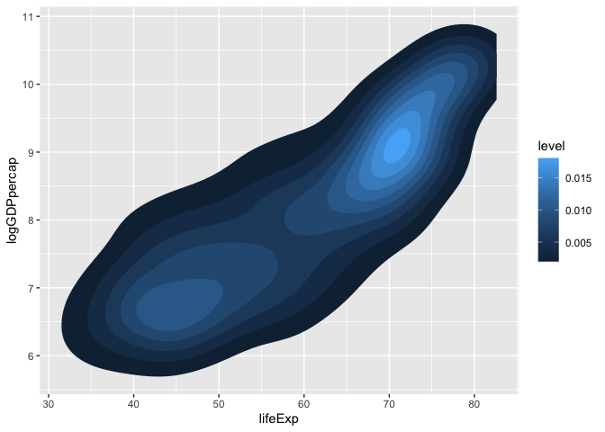<!-- -->

All you need to do is pass it the `ggplotly()` function and it creates
an interactive graphic.

``` r
p11 <- ggplotly(p11)
print(p11)
```

You can also do direct plotly functions, skipping ggplot entirely. This
is especially useful when they have a chart format that isn’t easily
available in ggplot, such as a stock candlestick chart.

``` r
library(tidyquant)
```

    ## Loading required package: lubridate

    ## 
    ## Attaching package: 'lubridate'

    ## The following objects are masked from 'package:base':
    ## 
    ##     date, intersect, setdiff, union

    ## Loading required package: PerformanceAnalytics

    ## Loading required package: xts

    ## Loading required package: zoo

    ## 
    ## Attaching package: 'zoo'

    ## The following objects are masked from 'package:base':
    ## 
    ##     as.Date, as.Date.numeric

    ## 
    ## Attaching package: 'xts'

    ## The following object is masked from 'package:leaflet':
    ## 
    ##     addLegend

    ## The following objects are masked from 'package:dplyr':
    ## 
    ##     first, last

    ## 
    ## Attaching package: 'PerformanceAnalytics'

    ## The following object is masked from 'package:graphics':
    ## 
    ##     legend

    ## Loading required package: quantmod

    ## Loading required package: TTR

    ## Registered S3 method overwritten by 'quantmod':
    ##   method            from
    ##   as.zoo.data.frame zoo

``` r
prices <- tq_get("GOOGL")

prices %>%
   plot_ly(x = ~date,
           type = "candlestick",
           open = ~open,
           close = ~close,
           high = ~high,
           low = ~low, 
           split = ~symbol)
```

<div id="htmlwidget-18e8ec9f8fcf00e493d4" style="width:672px;height:480px;" class="plotly html-widget"></div>
<script type="application/json" data-for="htmlwidget-18e8ec9f8fcf00e493d4">{"x":{"visdat":{"13e0f1653d53d":["function () ","plotlyVisDat"]},"cur_data":"13e0f1653d53d","attrs":{"13e0f1653d53d":{"x":{},"open":{},"close":{},"high":{},"low":{},"split":{},"alpha_stroke":1,"sizes":[10,100],"spans":[1,20],"type":"candlestick"}},"layout":{"margin":{"b":40,"l":60,"t":25,"r":10},"xaxis":{"domain":[0,1],"automargin":true,"title":"date"},"yaxis":{"domain":[0,1],"automargin":true},"hovermode":"closest","showlegend":false},"source":"A","config":{"modeBarButtonsToAdd":["hoverclosest","hovercompare"],"showSendToCloud":false},"data":[{"x":["2012-01-03","2012-01-04","2012-01-05","2012-01-06","2012-01-09","2012-01-10","2012-01-11","2012-01-12","2012-01-13","2012-01-17","2012-01-18","2012-01-19","2012-01-20","2012-01-23","2012-01-24","2012-01-25","2012-01-26","2012-01-27","2012-01-30","2012-01-31","2012-02-01","2012-02-02","2012-02-03","2012-02-06","2012-02-07","2012-02-08","2012-02-09","2012-02-10","2012-02-13","2012-02-14","2012-02-15","2012-02-16","2012-02-17","2012-02-21","2012-02-22","2012-02-23","2012-02-24","2012-02-27","2012-02-28","2012-02-29","2012-03-01","2012-03-02","2012-03-05","2012-03-06","2012-03-07","2012-03-08","2012-03-09","2012-03-12","2012-03-13","2012-03-14","2012-03-15","2012-03-16","2012-03-19","2012-03-20","2012-03-21","2012-03-22","2012-03-23","2012-03-26","2012-03-27","2012-03-28","2012-03-29","2012-03-30","2012-04-02","2012-04-03","2012-04-04","2012-04-05","2012-04-09","2012-04-10","2012-04-11","2012-04-12","2012-04-13","2012-04-16","2012-04-17","2012-04-18","2012-04-19","2012-04-20","2012-04-23","2012-04-24","2012-04-25","2012-04-26","2012-04-27","2012-04-30","2012-05-01","2012-05-02","2012-05-03","2012-05-04","2012-05-07","2012-05-08","2012-05-09","2012-05-10","2012-05-11","2012-05-14","2012-05-15","2012-05-16","2012-05-17","2012-05-18","2012-05-21","2012-05-22","2012-05-23","2012-05-24","2012-05-25","2012-05-29","2012-05-30","2012-05-31","2012-06-01","2012-06-04","2012-06-05","2012-06-06","2012-06-07","2012-06-08","2012-06-11","2012-06-12","2012-06-13","2012-06-14","2012-06-15","2012-06-18","2012-06-19","2012-06-20","2012-06-21","2012-06-22","2012-06-25","2012-06-26","2012-06-27","2012-06-28","2012-06-29","2012-07-02","2012-07-03","2012-07-05","2012-07-06","2012-07-09","2012-07-10","2012-07-11","2012-07-12","2012-07-13","2012-07-16","2012-07-17","2012-07-18","2012-07-19","2012-07-20","2012-07-23","2012-07-24","2012-07-25","2012-07-26","2012-07-27","2012-07-30","2012-07-31","2012-08-01","2012-08-02","2012-08-03","2012-08-06","2012-08-07","2012-08-08","2012-08-09","2012-08-10","2012-08-13","2012-08-14","2012-08-15","2012-08-16","2012-08-17","2012-08-20","2012-08-21","2012-08-22","2012-08-23","2012-08-24","2012-08-27","2012-08-28","2012-08-29","2012-08-30","2012-08-31","2012-09-04","2012-09-05","2012-09-06","2012-09-07","2012-09-10","2012-09-11","2012-09-12","2012-09-13","2012-09-14","2012-09-17","2012-09-18","2012-09-19","2012-09-20","2012-09-21","2012-09-24","2012-09-25","2012-09-26","2012-09-27","2012-09-28","2012-10-01","2012-10-02","2012-10-03","2012-10-04","2012-10-05","2012-10-08","2012-10-09","2012-10-10","2012-10-11","2012-10-12","2012-10-15","2012-10-16","2012-10-17","2012-10-18","2012-10-19","2012-10-22","2012-10-23","2012-10-24","2012-10-25","2012-10-26","2012-10-31","2012-11-01","2012-11-02","2012-11-05","2012-11-06","2012-11-07","2012-11-08","2012-11-09","2012-11-12","2012-11-13","2012-11-14","2012-11-15","2012-11-16","2012-11-19","2012-11-20","2012-11-21","2012-11-23","2012-11-26","2012-11-27","2012-11-28","2012-11-29","2012-11-30","2012-12-03","2012-12-04","2012-12-05","2012-12-06","2012-12-07","2012-12-10","2012-12-11","2012-12-12","2012-12-13","2012-12-14","2012-12-17","2012-12-18","2012-12-19","2012-12-20","2012-12-21","2012-12-24","2012-12-26","2012-12-27","2012-12-28","2012-12-31","2013-01-02","2013-01-03","2013-01-04","2013-01-07","2013-01-08","2013-01-09","2013-01-10","2013-01-11","2013-01-14","2013-01-15","2013-01-16","2013-01-17","2013-01-18","2013-01-22","2013-01-23","2013-01-24","2013-01-25","2013-01-28","2013-01-29","2013-01-30","2013-01-31","2013-02-01","2013-02-04","2013-02-05","2013-02-06","2013-02-07","2013-02-08","2013-02-11","2013-02-12","2013-02-13","2013-02-14","2013-02-15","2013-02-19","2013-02-20","2013-02-21","2013-02-22","2013-02-25","2013-02-26","2013-02-27","2013-02-28","2013-03-01","2013-03-04","2013-03-05","2013-03-06","2013-03-07","2013-03-08","2013-03-11","2013-03-12","2013-03-13","2013-03-14","2013-03-15","2013-03-18","2013-03-19","2013-03-20","2013-03-21","2013-03-22","2013-03-25","2013-03-26","2013-03-27","2013-03-28","2013-04-01","2013-04-02","2013-04-03","2013-04-04","2013-04-05","2013-04-08","2013-04-09","2013-04-10","2013-04-11","2013-04-12","2013-04-15","2013-04-16","2013-04-17","2013-04-18","2013-04-19","2013-04-22","2013-04-23","2013-04-24","2013-04-25","2013-04-26","2013-04-29","2013-04-30","2013-05-01","2013-05-02","2013-05-03","2013-05-06","2013-05-07","2013-05-08","2013-05-09","2013-05-10","2013-05-13","2013-05-14","2013-05-15","2013-05-16","2013-05-17","2013-05-20","2013-05-21","2013-05-22","2013-05-23","2013-05-24","2013-05-28","2013-05-29","2013-05-30","2013-05-31","2013-06-03","2013-06-04","2013-06-05","2013-06-06","2013-06-07","2013-06-10","2013-06-11","2013-06-12","2013-06-13","2013-06-14","2013-06-17","2013-06-18","2013-06-19","2013-06-20","2013-06-21","2013-06-24","2013-06-25","2013-06-26","2013-06-27","2013-06-28","2013-07-01","2013-07-02","2013-07-03","2013-07-05","2013-07-08","2013-07-09","2013-07-10","2013-07-11","2013-07-12","2013-07-15","2013-07-16","2013-07-17","2013-07-18","2013-07-19","2013-07-22","2013-07-23","2013-07-24","2013-07-25","2013-07-26","2013-07-29","2013-07-30","2013-07-31","2013-08-01","2013-08-02","2013-08-05","2013-08-06","2013-08-07","2013-08-08","2013-08-09","2013-08-12","2013-08-13","2013-08-14","2013-08-15","2013-08-16","2013-08-19","2013-08-20","2013-08-21","2013-08-22","2013-08-23","2013-08-26","2013-08-27","2013-08-28","2013-08-29","2013-08-30","2013-09-03","2013-09-04","2013-09-05","2013-09-06","2013-09-09","2013-09-10","2013-09-11","2013-09-12","2013-09-13","2013-09-16","2013-09-17","2013-09-18","2013-09-19","2013-09-20","2013-09-23","2013-09-24","2013-09-25","2013-09-26","2013-09-27","2013-09-30","2013-10-01","2013-10-02","2013-10-03","2013-10-04","2013-10-07","2013-10-08","2013-10-09","2013-10-10","2013-10-11","2013-10-14","2013-10-15","2013-10-16","2013-10-17","2013-10-18","2013-10-21","2013-10-22","2013-10-23","2013-10-24","2013-10-25","2013-10-28","2013-10-29","2013-10-30","2013-10-31","2013-11-01","2013-11-04","2013-11-05","2013-11-06","2013-11-07","2013-11-08","2013-11-11","2013-11-12","2013-11-13","2013-11-14","2013-11-15","2013-11-18","2013-11-19","2013-11-20","2013-11-21","2013-11-22","2013-11-25","2013-11-26","2013-11-27","2013-11-29","2013-12-02","2013-12-03","2013-12-04","2013-12-05","2013-12-06","2013-12-09","2013-12-10","2013-12-11","2013-12-12","2013-12-13","2013-12-16","2013-12-17","2013-12-18","2013-12-19","2013-12-20","2013-12-23","2013-12-24","2013-12-26","2013-12-27","2013-12-30","2013-12-31","2014-01-02","2014-01-03","2014-01-06","2014-01-07","2014-01-08","2014-01-09","2014-01-10","2014-01-13","2014-01-14","2014-01-15","2014-01-16","2014-01-17","2014-01-21","2014-01-22","2014-01-23","2014-01-24","2014-01-27","2014-01-28","2014-01-29","2014-01-30","2014-01-31","2014-02-03","2014-02-04","2014-02-05","2014-02-06","2014-02-07","2014-02-10","2014-02-11","2014-02-12","2014-02-13","2014-02-14","2014-02-18","2014-02-19","2014-02-20","2014-02-21","2014-02-24","2014-02-25","2014-02-26","2014-02-27","2014-02-28","2014-03-03","2014-03-04","2014-03-05","2014-03-06","2014-03-07","2014-03-10","2014-03-11","2014-03-12","2014-03-13","2014-03-14","2014-03-17","2014-03-18","2014-03-19","2014-03-20","2014-03-21","2014-03-24","2014-03-25","2014-03-26","2014-03-27","2014-03-28","2014-03-31","2014-04-01","2014-04-02","2014-04-03","2014-04-04","2014-04-07","2014-04-08","2014-04-09","2014-04-10","2014-04-11","2014-04-14","2014-04-15","2014-04-16","2014-04-17","2014-04-21","2014-04-22","2014-04-23","2014-04-24","2014-04-25","2014-04-28","2014-04-29","2014-04-30","2014-05-01","2014-05-02","2014-05-05","2014-05-06","2014-05-07","2014-05-08","2014-05-09","2014-05-12","2014-05-13","2014-05-14","2014-05-15","2014-05-16","2014-05-19","2014-05-20","2014-05-21","2014-05-22","2014-05-23","2014-05-27","2014-05-28","2014-05-29","2014-05-30","2014-06-02","2014-06-03","2014-06-04","2014-06-05","2014-06-06","2014-06-09","2014-06-10","2014-06-11","2014-06-12","2014-06-13","2014-06-16","2014-06-17","2014-06-18","2014-06-19","2014-06-20","2014-06-23","2014-06-24","2014-06-25","2014-06-26","2014-06-27","2014-06-30","2014-07-01","2014-07-02","2014-07-03","2014-07-07","2014-07-08","2014-07-09","2014-07-10","2014-07-11","2014-07-14","2014-07-15","2014-07-16","2014-07-17","2014-07-18","2014-07-21","2014-07-22","2014-07-23","2014-07-24","2014-07-25","2014-07-28","2014-07-29","2014-07-30","2014-07-31","2014-08-01","2014-08-04","2014-08-05","2014-08-06","2014-08-07","2014-08-08","2014-08-11","2014-08-12","2014-08-13","2014-08-14","2014-08-15","2014-08-18","2014-08-19","2014-08-20","2014-08-21","2014-08-22","2014-08-25","2014-08-26","2014-08-27","2014-08-28","2014-08-29","2014-09-02","2014-09-03","2014-09-04","2014-09-05","2014-09-08","2014-09-09","2014-09-10","2014-09-11","2014-09-12","2014-09-15","2014-09-16","2014-09-17","2014-09-18","2014-09-19","2014-09-22","2014-09-23","2014-09-24","2014-09-25","2014-09-26","2014-09-29","2014-09-30","2014-10-01","2014-10-02","2014-10-03","2014-10-06","2014-10-07","2014-10-08","2014-10-09","2014-10-10","2014-10-13","2014-10-14","2014-10-15","2014-10-16","2014-10-17","2014-10-20","2014-10-21","2014-10-22","2014-10-23","2014-10-24","2014-10-27","2014-10-28","2014-10-29","2014-10-30","2014-10-31","2014-11-03","2014-11-04","2014-11-05","2014-11-06","2014-11-07","2014-11-10","2014-11-11","2014-11-12","2014-11-13","2014-11-14","2014-11-17","2014-11-18","2014-11-19","2014-11-20","2014-11-21","2014-11-24","2014-11-25","2014-11-26","2014-11-28","2014-12-01","2014-12-02","2014-12-03","2014-12-04","2014-12-05","2014-12-08","2014-12-09","2014-12-10","2014-12-11","2014-12-12","2014-12-15","2014-12-16","2014-12-17","2014-12-18","2014-12-19","2014-12-22","2014-12-23","2014-12-24","2014-12-26","2014-12-29","2014-12-30","2014-12-31","2015-01-02","2015-01-05","2015-01-06","2015-01-07","2015-01-08","2015-01-09","2015-01-12","2015-01-13","2015-01-14","2015-01-15","2015-01-16","2015-01-20","2015-01-21","2015-01-22","2015-01-23","2015-01-26","2015-01-27","2015-01-28","2015-01-29","2015-01-30","2015-02-02","2015-02-03","2015-02-04","2015-02-05","2015-02-06","2015-02-09","2015-02-10","2015-02-11","2015-02-12","2015-02-13","2015-02-17","2015-02-18","2015-02-19","2015-02-20","2015-02-23","2015-02-24","2015-02-25","2015-02-26","2015-02-27","2015-03-02","2015-03-03","2015-03-04","2015-03-05","2015-03-06","2015-03-09","2015-03-10","2015-03-11","2015-03-12","2015-03-13","2015-03-16","2015-03-17","2015-03-18","2015-03-19","2015-03-20","2015-03-23","2015-03-24","2015-03-25","2015-03-26","2015-03-27","2015-03-30","2015-03-31","2015-04-01","2015-04-02","2015-04-06","2015-04-07","2015-04-08","2015-04-09","2015-04-10","2015-04-13","2015-04-14","2015-04-15","2015-04-16","2015-04-17","2015-04-20","2015-04-21","2015-04-22","2015-04-23","2015-04-24","2015-04-27","2015-04-28","2015-04-29","2015-04-30","2015-05-01","2015-05-04","2015-05-05","2015-05-06","2015-05-07","2015-05-08","2015-05-11","2015-05-12","2015-05-13","2015-05-14","2015-05-15","2015-05-18","2015-05-19","2015-05-20","2015-05-21","2015-05-22","2015-05-26","2015-05-27","2015-05-28","2015-05-29","2015-06-01","2015-06-02","2015-06-03","2015-06-04","2015-06-05","2015-06-08","2015-06-09","2015-06-10","2015-06-11","2015-06-12","2015-06-15","2015-06-16","2015-06-17","2015-06-18","2015-06-19","2015-06-22","2015-06-23","2015-06-24","2015-06-25","2015-06-26","2015-06-29","2015-06-30","2015-07-01","2015-07-02","2015-07-06","2015-07-07","2015-07-08","2015-07-09","2015-07-10","2015-07-13","2015-07-14","2015-07-15","2015-07-16","2015-07-17","2015-07-20","2015-07-21","2015-07-22","2015-07-23","2015-07-24","2015-07-27","2015-07-28","2015-07-29","2015-07-30","2015-07-31","2015-08-03","2015-08-04","2015-08-05","2015-08-06","2015-08-07","2015-08-10","2015-08-11","2015-08-12","2015-08-13","2015-08-14","2015-08-17","2015-08-18","2015-08-19","2015-08-20","2015-08-21","2015-08-24","2015-08-25","2015-08-26","2015-08-27","2015-08-28","2015-08-31","2015-09-01","2015-09-02","2015-09-03","2015-09-04","2015-09-08","2015-09-09","2015-09-10","2015-09-11","2015-09-14","2015-09-15","2015-09-16","2015-09-17","2015-09-18","2015-09-21","2015-09-22","2015-09-23","2015-09-24","2015-09-25","2015-09-28","2015-09-29","2015-09-30","2015-10-01","2015-10-02","2015-10-05","2015-10-06","2015-10-07","2015-10-08","2015-10-09","2015-10-12","2015-10-13","2015-10-14","2015-10-15","2015-10-16","2015-10-19","2015-10-20","2015-10-21","2015-10-22","2015-10-23","2015-10-26","2015-10-27","2015-10-28","2015-10-29","2015-10-30","2015-11-02","2015-11-03","2015-11-04","2015-11-05","2015-11-06","2015-11-09","2015-11-10","2015-11-11","2015-11-12","2015-11-13","2015-11-16","2015-11-17","2015-11-18","2015-11-19","2015-11-20","2015-11-23","2015-11-24","2015-11-25","2015-11-27","2015-11-30","2015-12-01","2015-12-02","2015-12-03","2015-12-04","2015-12-07","2015-12-08","2015-12-09","2015-12-10","2015-12-11","2015-12-14","2015-12-15","2015-12-16","2015-12-17","2015-12-18","2015-12-21","2015-12-22","2015-12-23","2015-12-24","2015-12-28","2015-12-29","2015-12-30","2015-12-31","2016-01-04","2016-01-05","2016-01-06","2016-01-07","2016-01-08","2016-01-11","2016-01-12","2016-01-13","2016-01-14","2016-01-15","2016-01-19","2016-01-20","2016-01-21","2016-01-22","2016-01-25","2016-01-26","2016-01-27","2016-01-28","2016-01-29","2016-02-01","2016-02-02","2016-02-03","2016-02-04","2016-02-05","2016-02-08","2016-02-09","2016-02-10","2016-02-11","2016-02-12","2016-02-16","2016-02-17","2016-02-18","2016-02-19","2016-02-22","2016-02-23","2016-02-24","2016-02-25","2016-02-26","2016-02-29","2016-03-01","2016-03-02","2016-03-03","2016-03-04","2016-03-07","2016-03-08","2016-03-09","2016-03-10","2016-03-11","2016-03-14","2016-03-15","2016-03-16","2016-03-17","2016-03-18","2016-03-21","2016-03-22","2016-03-23","2016-03-24","2016-03-28","2016-03-29","2016-03-30","2016-03-31","2016-04-01","2016-04-04","2016-04-05","2016-04-06","2016-04-07","2016-04-08","2016-04-11","2016-04-12","2016-04-13","2016-04-14","2016-04-15","2016-04-18","2016-04-19","2016-04-20","2016-04-21","2016-04-22","2016-04-25","2016-04-26","2016-04-27","2016-04-28","2016-04-29","2016-05-02","2016-05-03","2016-05-04","2016-05-05","2016-05-06","2016-05-09","2016-05-10","2016-05-11","2016-05-12","2016-05-13","2016-05-16","2016-05-17","2016-05-18","2016-05-19","2016-05-20","2016-05-23","2016-05-24","2016-05-25","2016-05-26","2016-05-27","2016-05-31","2016-06-01","2016-06-02","2016-06-03","2016-06-06","2016-06-07","2016-06-08","2016-06-09","2016-06-10","2016-06-13","2016-06-14","2016-06-15","2016-06-16","2016-06-17","2016-06-20","2016-06-21","2016-06-22","2016-06-23","2016-06-24","2016-06-27","2016-06-28","2016-06-29","2016-06-30","2016-07-01","2016-07-05","2016-07-06","2016-07-07","2016-07-08","2016-07-11","2016-07-12","2016-07-13","2016-07-14","2016-07-15","2016-07-18","2016-07-19","2016-07-20","2016-07-21","2016-07-22","2016-07-25","2016-07-26","2016-07-27","2016-07-28","2016-07-29","2016-08-01","2016-08-02","2016-08-03","2016-08-04","2016-08-05","2016-08-08","2016-08-09","2016-08-10","2016-08-11","2016-08-12","2016-08-15","2016-08-16","2016-08-17","2016-08-18","2016-08-19","2016-08-22","2016-08-23","2016-08-24","2016-08-25","2016-08-26","2016-08-29","2016-08-30","2016-08-31","2016-09-01","2016-09-02","2016-09-06","2016-09-07","2016-09-08","2016-09-09","2016-09-12","2016-09-13","2016-09-14","2016-09-15","2016-09-16","2016-09-19","2016-09-20","2016-09-21","2016-09-22","2016-09-23","2016-09-26","2016-09-27","2016-09-28","2016-09-29","2016-09-30","2016-10-03","2016-10-04","2016-10-05","2016-10-06","2016-10-07","2016-10-10","2016-10-11","2016-10-12","2016-10-13","2016-10-14","2016-10-17","2016-10-18","2016-10-19","2016-10-20","2016-10-21","2016-10-24","2016-10-25","2016-10-26","2016-10-27","2016-10-28","2016-10-31","2016-11-01","2016-11-02","2016-11-03","2016-11-04","2016-11-07","2016-11-08","2016-11-09","2016-11-10","2016-11-11","2016-11-14","2016-11-15","2016-11-16","2016-11-17","2016-11-18","2016-11-21","2016-11-22","2016-11-23","2016-11-25","2016-11-28","2016-11-29","2016-11-30","2016-12-01","2016-12-02","2016-12-05","2016-12-06","2016-12-07","2016-12-08","2016-12-09","2016-12-12","2016-12-13","2016-12-14","2016-12-15","2016-12-16","2016-12-19","2016-12-20","2016-12-21","2016-12-22","2016-12-23","2016-12-27","2016-12-28","2016-12-29","2016-12-30","2017-01-03","2017-01-04","2017-01-05","2017-01-06","2017-01-09","2017-01-10","2017-01-11","2017-01-12","2017-01-13","2017-01-17","2017-01-18","2017-01-19","2017-01-20","2017-01-23","2017-01-24","2017-01-25","2017-01-26","2017-01-27","2017-01-30","2017-01-31","2017-02-01","2017-02-02","2017-02-03","2017-02-06","2017-02-07","2017-02-08","2017-02-09","2017-02-10","2017-02-13","2017-02-14","2017-02-15","2017-02-16","2017-02-17","2017-02-21","2017-02-22","2017-02-23","2017-02-24","2017-02-27","2017-02-28","2017-03-01","2017-03-02","2017-03-03","2017-03-06","2017-03-07","2017-03-08","2017-03-09","2017-03-10","2017-03-13","2017-03-14","2017-03-15","2017-03-16","2017-03-17","2017-03-20","2017-03-21","2017-03-22","2017-03-23","2017-03-24","2017-03-27","2017-03-28","2017-03-29","2017-03-30","2017-03-31","2017-04-03","2017-04-04","2017-04-05","2017-04-06","2017-04-07","2017-04-10","2017-04-11","2017-04-12","2017-04-13","2017-04-17","2017-04-18","2017-04-19","2017-04-20","2017-04-21","2017-04-24","2017-04-25","2017-04-26","2017-04-27","2017-04-28","2017-05-01","2017-05-02","2017-05-03","2017-05-04","2017-05-05","2017-05-08","2017-05-09","2017-05-10","2017-05-11","2017-05-12","2017-05-15","2017-05-16","2017-05-17","2017-05-18","2017-05-19","2017-05-22","2017-05-23","2017-05-24","2017-05-25","2017-05-26","2017-05-30","2017-05-31","2017-06-01","2017-06-02","2017-06-05","2017-06-06","2017-06-07","2017-06-08","2017-06-09","2017-06-12","2017-06-13","2017-06-14","2017-06-15","2017-06-16","2017-06-19","2017-06-20","2017-06-21","2017-06-22","2017-06-23","2017-06-26","2017-06-27","2017-06-28","2017-06-29","2017-06-30","2017-07-03","2017-07-05","2017-07-06","2017-07-07","2017-07-10","2017-07-11","2017-07-12","2017-07-13","2017-07-14","2017-07-17","2017-07-18","2017-07-19","2017-07-20","2017-07-21","2017-07-24","2017-07-25","2017-07-26","2017-07-27","2017-07-28","2017-07-31","2017-08-01","2017-08-02","2017-08-03","2017-08-04","2017-08-07","2017-08-08","2017-08-09","2017-08-10","2017-08-11","2017-08-14","2017-08-15","2017-08-16","2017-08-17","2017-08-18","2017-08-21","2017-08-22","2017-08-23","2017-08-24","2017-08-25","2017-08-28","2017-08-29","2017-08-30","2017-08-31","2017-09-01","2017-09-05","2017-09-06","2017-09-07","2017-09-08","2017-09-11","2017-09-12","2017-09-13","2017-09-14","2017-09-15","2017-09-18","2017-09-19","2017-09-20","2017-09-21","2017-09-22","2017-09-25","2017-09-26","2017-09-27","2017-09-28","2017-09-29","2017-10-02","2017-10-03","2017-10-04","2017-10-05","2017-10-06","2017-10-09","2017-10-10","2017-10-11","2017-10-12","2017-10-13","2017-10-16","2017-10-17","2017-10-18","2017-10-19","2017-10-20","2017-10-23","2017-10-24","2017-10-25","2017-10-26","2017-10-27","2017-10-30","2017-10-31","2017-11-01","2017-11-02","2017-11-03","2017-11-06","2017-11-07","2017-11-08","2017-11-09","2017-11-10","2017-11-13","2017-11-14","2017-11-15","2017-11-16","2017-11-17","2017-11-20","2017-11-21","2017-11-22","2017-11-24","2017-11-27","2017-11-28","2017-11-29","2017-11-30","2017-12-01","2017-12-04","2017-12-05","2017-12-06","2017-12-07","2017-12-08","2017-12-11","2017-12-12","2017-12-13","2017-12-14","2017-12-15","2017-12-18","2017-12-19","2017-12-20","2017-12-21","2017-12-22","2017-12-26","2017-12-27","2017-12-28","2017-12-29","2018-01-02","2018-01-03","2018-01-04","2018-01-05","2018-01-08","2018-01-09","2018-01-10","2018-01-11","2018-01-12","2018-01-16","2018-01-17","2018-01-18","2018-01-19","2018-01-22","2018-01-23","2018-01-24","2018-01-25","2018-01-26","2018-01-29","2018-01-30","2018-01-31","2018-02-01","2018-02-02","2018-02-05","2018-02-06","2018-02-07","2018-02-08","2018-02-09","2018-02-12","2018-02-13","2018-02-14","2018-02-15","2018-02-16","2018-02-20","2018-02-21","2018-02-22","2018-02-23","2018-02-26","2018-02-27","2018-02-28","2018-03-01","2018-03-02","2018-03-05","2018-03-06","2018-03-07","2018-03-08","2018-03-09","2018-03-12","2018-03-13","2018-03-14","2018-03-15","2018-03-16","2018-03-19","2018-03-20","2018-03-21","2018-03-22","2018-03-23","2018-03-26","2018-03-27","2018-03-28","2018-03-29","2018-04-02","2018-04-03","2018-04-04","2018-04-05","2018-04-06","2018-04-09","2018-04-10","2018-04-11","2018-04-12","2018-04-13","2018-04-16","2018-04-17","2018-04-18","2018-04-19","2018-04-20","2018-04-23","2018-04-24","2018-04-25","2018-04-26","2018-04-27","2018-04-30","2018-05-01","2018-05-02","2018-05-03","2018-05-04","2018-05-07","2018-05-08","2018-05-09","2018-05-10","2018-05-11","2018-05-14","2018-05-15","2018-05-16","2018-05-17","2018-05-18","2018-05-21","2018-05-22","2018-05-23","2018-05-24","2018-05-25","2018-05-29","2018-05-30","2018-05-31","2018-06-01","2018-06-04","2018-06-05","2018-06-06","2018-06-07","2018-06-08","2018-06-11","2018-06-12","2018-06-13","2018-06-14","2018-06-15","2018-06-18","2018-06-19","2018-06-20","2018-06-21","2018-06-22","2018-06-25","2018-06-26","2018-06-27","2018-06-28","2018-06-29","2018-07-02","2018-07-03","2018-07-05","2018-07-06","2018-07-09","2018-07-10","2018-07-11","2018-07-12","2018-07-13","2018-07-16","2018-07-17","2018-07-18","2018-07-19","2018-07-20","2018-07-23","2018-07-24","2018-07-25","2018-07-26","2018-07-27","2018-07-30","2018-07-31","2018-08-01","2018-08-02","2018-08-03","2018-08-06","2018-08-07","2018-08-08","2018-08-09","2018-08-10","2018-08-13","2018-08-14","2018-08-15","2018-08-16","2018-08-17","2018-08-20","2018-08-21","2018-08-22","2018-08-23","2018-08-24","2018-08-27","2018-08-28","2018-08-29","2018-08-30","2018-08-31","2018-09-04","2018-09-05","2018-09-06","2018-09-07","2018-09-10","2018-09-11","2018-09-12","2018-09-13","2018-09-14","2018-09-17","2018-09-18","2018-09-19","2018-09-20","2018-09-21","2018-09-24","2018-09-25","2018-09-26","2018-09-27","2018-09-28","2018-10-01","2018-10-02","2018-10-03","2018-10-04","2018-10-05","2018-10-08","2018-10-09","2018-10-10","2018-10-11","2018-10-12","2018-10-15","2018-10-16","2018-10-17","2018-10-18","2018-10-19","2018-10-22","2018-10-23","2018-10-24","2018-10-25","2018-10-26","2018-10-29","2018-10-30","2018-10-31","2018-11-01","2018-11-02","2018-11-05","2018-11-06","2018-11-07","2018-11-08","2018-11-09","2018-11-12","2018-11-13","2018-11-14","2018-11-15","2018-11-16","2018-11-19","2018-11-20","2018-11-21","2018-11-23","2018-11-26","2018-11-27","2018-11-28","2018-11-29","2018-11-30","2018-12-03","2018-12-04","2018-12-06","2018-12-07","2018-12-10","2018-12-11","2018-12-12","2018-12-13","2018-12-14","2018-12-17","2018-12-18","2018-12-19","2018-12-20","2018-12-21","2018-12-24","2018-12-26","2018-12-27","2018-12-28","2018-12-31","2019-01-02","2019-01-03","2019-01-04","2019-01-07","2019-01-08","2019-01-09","2019-01-10","2019-01-11","2019-01-14","2019-01-15","2019-01-16","2019-01-17","2019-01-18","2019-01-22","2019-01-23","2019-01-24","2019-01-25","2019-01-28","2019-01-29","2019-01-30","2019-01-31","2019-02-01","2019-02-04","2019-02-05","2019-02-06","2019-02-07","2019-02-08","2019-02-11","2019-02-12","2019-02-13","2019-02-14","2019-02-15","2019-02-19","2019-02-20","2019-02-21","2019-02-22","2019-02-25","2019-02-26","2019-02-27","2019-02-28","2019-03-01","2019-03-04","2019-03-05","2019-03-06","2019-03-07","2019-03-08","2019-03-11","2019-03-12","2019-03-13","2019-03-14","2019-03-15","2019-03-18","2019-03-19","2019-03-20","2019-03-21","2019-03-22","2019-03-25","2019-03-26","2019-03-27","2019-03-28","2019-03-29","2019-04-01","2019-04-02","2019-04-03","2019-04-04","2019-04-05","2019-04-08","2019-04-09","2019-04-10","2019-04-11","2019-04-12","2019-04-15","2019-04-16","2019-04-17","2019-04-18","2019-04-22","2019-04-23","2019-04-24","2019-04-25","2019-04-26","2019-04-29","2019-04-30","2019-05-01","2019-05-02","2019-05-03","2019-05-06","2019-05-07","2019-05-08","2019-05-09","2019-05-10","2019-05-13","2019-05-14","2019-05-15","2019-05-16","2019-05-17","2019-05-20","2019-05-21","2019-05-22","2019-05-23","2019-05-24","2019-05-28","2019-05-29","2019-05-30","2019-05-31","2019-06-03","2019-06-04","2019-06-05","2019-06-06","2019-06-07","2019-06-10","2019-06-11","2019-06-12","2019-06-13","2019-06-14","2019-06-17","2019-06-18","2019-06-19","2019-06-20","2019-06-21","2019-06-24","2019-06-25","2019-06-26","2019-06-27","2019-06-28","2019-07-01","2019-07-02","2019-07-03","2019-07-05","2019-07-08","2019-07-09","2019-07-10","2019-07-11","2019-07-12","2019-07-15","2019-07-16","2019-07-17","2019-07-18","2019-07-19","2019-07-22","2019-07-23","2019-07-24","2019-07-25","2019-07-26","2019-07-29","2019-07-30","2019-07-31","2019-08-01","2019-08-02","2019-08-05","2019-08-06","2019-08-07","2019-08-08","2019-08-09","2019-08-12","2019-08-13","2019-08-14","2019-08-15","2019-08-16","2019-08-19","2019-08-20","2019-08-21","2019-08-22","2019-08-23","2019-08-26","2019-08-27","2019-08-28","2019-08-29","2019-08-30","2019-09-03","2019-09-04","2019-09-05","2019-09-06","2019-09-09","2019-09-10","2019-09-11","2019-09-12","2019-09-13","2019-09-16","2019-09-17","2019-09-18","2019-09-19","2019-09-20","2019-09-23","2019-09-24","2019-09-25","2019-09-26","2019-09-27","2019-09-30","2019-10-01","2019-10-02","2019-10-03","2019-10-04","2019-10-07","2019-10-08","2019-10-09","2019-10-10","2019-10-11","2019-10-14","2019-10-15","2019-10-16","2019-10-17","2019-10-18","2019-10-21","2019-10-22","2019-10-23","2019-10-24","2019-10-25","2019-10-28","2019-10-29","2019-10-30","2019-10-31","2019-11-01","2019-11-04","2019-11-05","2019-11-06","2019-11-07","2019-11-08","2019-11-11","2019-11-12","2019-11-13","2019-11-14","2019-11-15","2019-11-18","2019-11-19","2019-11-20","2019-11-21","2019-11-22","2019-11-25","2019-11-26","2019-11-27","2019-11-29","2019-12-02","2019-12-03","2019-12-04","2019-12-05","2019-12-06","2019-12-09","2019-12-10","2019-12-11","2019-12-12","2019-12-13","2019-12-16","2019-12-17","2019-12-18","2019-12-19","2019-12-20","2019-12-23","2019-12-24","2019-12-26","2019-12-27","2019-12-30","2019-12-31","2020-01-02","2020-01-03","2020-01-06","2020-01-07","2020-01-08","2020-01-09","2020-01-10","2020-01-13","2020-01-14","2020-01-15","2020-01-16","2020-01-17","2020-01-21","2020-01-22","2020-01-23","2020-01-24","2020-01-27","2020-01-28","2020-01-29","2020-01-30","2020-01-31","2020-02-03","2020-02-04","2020-02-05","2020-02-06","2020-02-07","2020-02-10","2020-02-11","2020-02-12","2020-02-13","2020-02-14","2020-02-18","2020-02-19","2020-02-20","2020-02-21","2020-02-24","2020-02-25","2020-02-26","2020-02-27","2020-02-28","2020-03-02","2020-03-03","2020-03-04","2020-03-05","2020-03-06","2020-03-09","2020-03-10","2020-03-11","2020-03-12","2020-03-13","2020-03-16","2020-03-17","2020-03-18","2020-03-19","2020-03-20","2020-03-23","2020-03-24","2020-03-25","2020-03-26","2020-03-27","2020-03-30","2020-03-31","2020-04-01","2020-04-02","2020-04-03","2020-04-06","2020-04-07","2020-04-08","2020-04-09","2020-04-13","2020-04-14","2020-04-15","2020-04-16","2020-04-17","2020-04-20","2020-04-21","2020-04-22","2020-04-23","2020-04-24","2020-04-27","2020-04-28","2020-04-29","2020-04-30","2020-05-01","2020-05-04","2020-05-05","2020-05-06","2020-05-07","2020-05-08","2020-05-11","2020-05-12","2020-05-13","2020-05-14","2020-05-15","2020-05-18","2020-05-19","2020-05-20","2020-05-21","2020-05-22","2020-05-26","2020-05-27","2020-05-28","2020-05-29","2020-06-01","2020-06-02","2020-06-03","2020-06-04","2020-06-05","2020-06-08","2020-06-09","2020-06-10","2020-06-11","2020-06-12","2020-06-15","2020-06-16","2020-06-17","2020-06-18","2020-06-19","2020-06-22","2020-06-23","2020-06-24","2020-06-25","2020-06-26","2020-06-29","2020-06-30","2020-07-01","2020-07-02","2020-07-06","2020-07-07","2020-07-08","2020-07-09","2020-07-10","2020-07-13","2020-07-14","2020-07-15","2020-07-16","2020-07-17","2020-07-20","2020-07-21","2020-07-22","2020-07-23","2020-07-24","2020-07-27","2020-07-28","2020-07-29","2020-07-30","2020-07-31","2020-08-03","2020-08-04","2020-08-05","2020-08-06","2020-08-07","2020-08-10","2020-08-11","2020-08-12","2020-08-13","2020-08-14","2020-08-17","2020-08-18","2020-08-19","2020-08-20","2020-08-21","2020-08-24","2020-08-25","2020-08-26","2020-08-27","2020-08-28","2020-08-31","2020-09-01","2020-09-02","2020-09-03","2020-09-04","2020-09-08","2020-09-09","2020-09-10","2020-09-11","2020-09-14","2020-09-15","2020-09-16","2020-09-17","2020-09-18","2020-09-21","2020-09-22","2020-09-23","2020-09-24","2020-09-25","2020-09-28","2020-09-29","2020-09-30","2020-10-01","2020-10-02","2020-10-05","2020-10-06","2020-10-07","2020-10-08","2020-10-09","2020-10-12","2020-10-13","2020-10-14","2020-10-15","2020-10-16","2020-10-19","2020-10-20","2020-10-21","2020-10-22","2020-10-23","2020-10-26","2020-10-27","2020-10-28","2020-10-29","2020-10-30","2020-11-02","2020-11-03","2020-11-04","2020-11-05","2020-11-06","2020-11-09","2020-11-10","2020-11-11","2020-11-12","2020-11-13","2020-11-16","2020-11-17","2020-11-18","2020-11-19","2020-11-20","2020-11-23","2020-11-24","2020-11-25","2020-11-27","2020-11-30","2020-12-01","2020-12-02","2020-12-03","2020-12-04","2020-12-07","2020-12-08","2020-12-09","2020-12-10","2020-12-11","2020-12-14","2020-12-15","2020-12-16","2020-12-17","2020-12-18","2020-12-21","2020-12-22","2020-12-23","2020-12-24","2020-12-28","2020-12-29","2020-12-30","2020-12-31","2021-01-04","2021-01-05","2021-01-06","2021-01-07","2021-01-08","2021-01-11","2021-01-12","2021-01-13","2021-01-14","2021-01-15","2021-01-19","2021-01-20","2021-01-21","2021-01-22","2021-01-25","2021-01-26","2021-01-27","2021-01-28","2021-01-29","2021-02-01","2021-02-02","2021-02-03","2021-02-04","2021-02-05","2021-02-08","2021-02-09","2021-02-10","2021-02-11","2021-02-12","2021-02-16","2021-02-17","2021-02-18","2021-02-19","2021-02-22","2021-02-23","2021-02-24","2021-02-25","2021-02-26","2021-03-01","2021-03-02","2021-03-03","2021-03-04","2021-03-05","2021-03-08","2021-03-09","2021-03-10","2021-03-11","2021-03-12","2021-03-15","2021-03-16","2021-03-17","2021-03-18","2021-03-19","2021-03-22","2021-03-23","2021-03-24","2021-03-25","2021-03-26","2021-03-29","2021-03-30","2021-03-31","2021-04-01","2021-04-05","2021-04-06","2021-04-07","2021-04-08","2021-04-09","2021-04-12","2021-04-13","2021-04-14","2021-04-15","2021-04-16","2021-04-19","2021-04-20","2021-04-21","2021-04-22","2021-04-23","2021-04-26","2021-04-27","2021-04-28","2021-04-29","2021-04-30","2021-05-03","2021-05-04","2021-05-05","2021-05-06","2021-05-07","2021-05-10","2021-05-11","2021-05-12","2021-05-13","2021-05-14","2021-05-17","2021-05-18","2021-05-19","2021-05-20","2021-05-21","2021-05-24","2021-05-25","2021-05-26","2021-05-27","2021-05-28","2021-06-01","2021-06-02","2021-06-03","2021-06-04","2021-06-07","2021-06-08","2021-06-09","2021-06-10","2021-06-11","2021-06-14","2021-06-15","2021-06-16","2021-06-17","2021-06-18","2021-06-21","2021-06-22","2021-06-23","2021-06-24","2021-06-25","2021-06-28","2021-06-29","2021-06-30","2021-07-01","2021-07-02","2021-07-06","2021-07-07","2021-07-08","2021-07-09","2021-07-12","2021-07-13","2021-07-14","2021-07-15","2021-07-16","2021-07-19","2021-07-20","2021-07-21","2021-07-22","2021-07-23","2021-07-26","2021-07-27","2021-07-28","2021-07-29","2021-07-30","2021-08-02","2021-08-03","2021-08-04","2021-08-05","2021-08-06","2021-08-09","2021-08-10","2021-08-11","2021-08-12","2021-08-13","2021-08-16","2021-08-17","2021-08-18","2021-08-19","2021-08-20","2021-08-23","2021-08-24","2021-08-25","2021-08-26","2021-08-27","2021-08-30","2021-08-31","2021-09-01","2021-09-02","2021-09-03","2021-09-07","2021-09-08","2021-09-09","2021-09-10","2021-09-13","2021-09-14","2021-09-15","2021-09-16","2021-09-17","2021-09-20","2021-09-21","2021-09-22","2021-09-23","2021-09-24","2021-09-27","2021-09-28","2021-09-29","2021-09-30","2021-10-01","2021-10-04","2021-10-05","2021-10-06","2021-10-07","2021-10-08","2021-10-11","2021-10-12","2021-10-13","2021-10-14","2021-10-15","2021-10-18","2021-10-19","2021-10-20","2021-10-21","2021-10-22","2021-10-25","2021-10-26","2021-10-27","2021-10-28","2021-10-29","2021-11-01","2021-11-02","2021-11-03","2021-11-04","2021-11-05","2021-11-08","2021-11-09","2021-11-10","2021-11-11","2021-11-12","2021-11-15","2021-11-16","2021-11-17","2021-11-18","2021-11-19","2021-11-22","2021-11-23","2021-11-24","2021-11-26","2021-11-29","2021-11-30","2021-12-01","2021-12-02","2021-12-03","2021-12-06","2021-12-07","2021-12-08","2021-12-09","2021-12-10","2021-12-13","2021-12-14","2021-12-15","2021-12-16","2021-12-17","2021-12-20","2021-12-21","2021-12-22","2021-12-23","2021-12-27","2021-12-28","2021-12-29","2021-12-30","2021-12-31","2022-01-03","2022-01-04","2022-01-05","2022-01-06","2022-01-07","2022-01-10","2022-01-11","2022-01-12","2022-01-13","2022-01-14","2022-01-18","2022-01-19","2022-01-20","2022-01-21","2022-01-24","2022-01-25","2022-01-26","2022-01-27","2022-01-28","2022-01-31","2022-02-01","2022-02-02","2022-02-03","2022-02-04","2022-02-07","2022-02-08","2022-02-09","2022-02-10","2022-02-11","2022-02-14","2022-02-15","2022-02-16","2022-02-17","2022-02-18","2022-02-22","2022-02-23","2022-02-24","2022-02-25","2022-02-28","2022-03-01","2022-03-02","2022-03-03","2022-03-04","2022-03-07","2022-03-08","2022-03-09","2022-03-10","2022-03-11","2022-03-14","2022-03-15","2022-03-16","2022-03-17","2022-03-18","2022-03-21","2022-03-22","2022-03-23","2022-03-24","2022-03-25","2022-03-28","2022-03-29","2022-03-30","2022-03-31","2022-04-01","2022-04-04","2022-04-05","2022-04-06","2022-04-07","2022-04-08","2022-04-11","2022-04-12","2022-04-13","2022-04-14","2022-04-18","2022-04-19","2022-04-20","2022-04-21","2022-04-22","2022-04-25","2022-04-26","2022-04-27","2022-04-28","2022-04-29","2022-05-02","2022-05-03","2022-05-04","2022-05-05","2022-05-06","2022-05-09","2022-05-10","2022-05-11","2022-05-12","2022-05-13","2022-05-16","2022-05-17","2022-05-18","2022-05-19","2022-05-20","2022-05-23","2022-05-24","2022-05-25","2022-05-26","2022-05-27","2022-05-31","2022-06-01","2022-06-02","2022-06-03","2022-06-06","2022-06-07","2022-06-08","2022-06-09","2022-06-10","2022-06-13","2022-06-14","2022-06-15","2022-06-16","2022-06-17","2022-06-21","2022-06-22","2022-06-23","2022-06-24","2022-06-27","2022-06-28","2022-06-29","2022-06-30","2022-07-01","2022-07-05","2022-07-06","2022-07-07","2022-07-08","2022-07-11","2022-07-12","2022-07-13","2022-07-14","2022-07-15","2022-07-18","2022-07-19","2022-07-20","2022-07-21","2022-07-22","2022-07-25","2022-07-26","2022-07-27","2022-07-28","2022-07-29","2022-08-01","2022-08-02","2022-08-03","2022-08-04","2022-08-05","2022-08-08","2022-08-09","2022-08-10","2022-08-11","2022-08-12","2022-08-15","2022-08-16","2022-08-17","2022-08-18","2022-08-19","2022-08-22","2022-08-23","2022-08-24","2022-08-25","2022-08-26","2022-08-29","2022-08-30","2022-08-31","2022-09-01","2022-09-02","2022-09-06","2022-09-07","2022-09-08","2022-09-09","2022-09-12","2022-09-13","2022-09-14","2022-09-15","2022-09-16","2022-09-19","2022-09-20","2022-09-21","2022-09-22","2022-09-23","2022-09-26","2022-09-27","2022-09-28","2022-09-29"],"open":[16.33984,16.642391,16.56982,16.495245,16.178679,15.75951,15.603103,15.796296,15.672172,15.815315,15.681431,16.040791,14.778028,14.664665,14.672673,14.452202,14.313814,14.283784,14.465716,14.58959,14.638138,14.636386,14.781281,14.89014,15.193944,15.231231,15.315816,15.212212,15.277778,15.303804,15.338589,15.085586,15.139389,15.111862,15.314314,15.19019,15.198949,15.17993,15.265265,15.48048,15.572072,15.565566,15.526276,15.216466,15.241491,15.266266,15.213964,15.015015,15.233984,15.39039,15.43043,15.537788,15.593594,15.788789,15.881131,15.978478,16.181181,16.141142,16.191942,16.317066,16.352352,16.310061,16.035286,16.151402,15.977227,15.821822,15.727728,15.853854,15.865115,16.074825,16.204954,15.590591,15.229229,15.216466,15.157407,15.121371,14.837337,14.970971,15.115115,15.288038,15.390891,15.34009,15.10986,15.045045,15.255756,15.163163,14.88989,15.153403,15.185686,15.339339,15.274024,15.034535,15.148899,15.464464,15.861612,15.643143,15.027778,15.351351,15.056306,15.244244,15.04004,14.91016,14.718719,14.732733,14.309059,14.26977,14.400651,14.426426,14.704705,14.410661,14.61987,14.258509,14.057057,14.046547,14.022523,14.07958,14.354104,14.50976,14.510511,14.214214,14.197447,14.083083,14.206707,14.161662,14.388388,14.56006,14.514765,14.733734,14.826076,14.638388,14.76952,14.421922,14.192192,14.318068,14.423674,14.475225,14.438939,14.668168,15.234234,15.027027,15.39039,15.223223,15.39039,15.487738,15.917167,15.722222,15.948448,15.653403,16.016016,16.006256,16.06081,15.992242,16.12888,15.980731,16.201702,16.497747,16.773773,16.704454,16.869869,16.904404,16.844595,16.7012,16.873625,16.906906,16.591341,16.641642,16.9512,17.123123,17.117117,17.13088,17.017017,17.166166,17.517517,17.761763,17.466467,17.252502,17.344595,17.757757,17.72047,17.712212,17.955456,18.129881,18.323574,18.293293,18.845095,18.765015,19.017769,18.872623,18.995245,19.149149,18.911913,19.087837,19.287037,19.044044,19.010761,18.565065,18.841341,18.815065,18.567066,18.521772,18.617367,18.907408,17.657158,17.042292,16.817066,17.187187,17.017017,16.929428,17.013514,17.004505,17.387136,17.129629,17.154154,16.891891,16.771772,16.382633,16.610359,16.591593,16.533033,16.266266,16.165916,16.408909,16.754505,16.741491,16.766016,16.677677,16.520771,16.716967,17.211712,17.300051,17.573574,17.392391,17.321072,17.206957,17.392391,17.151901,17.267267,17.498247,17.915916,17.496746,17.655155,17.932934,18.035786,18.0996,17.867117,17.88063,17.719469,17.696196,17.559811,17.517517,18.003504,18.141392,18.251753,18.404655,18.406906,18.325075,18.589338,18.568569,18.443443,18.001251,18.078077,17.960711,17.776777,17.634134,18.418167,18.549549,18.788038,18.812813,18.687437,18.862362,18.781532,18.973974,19.21146,19.047297,18.995747,19.261763,19.522774,19.479479,19.563313,19.522774,19.512762,19.704704,19.91967,20.152653,19.969971,20.001501,20.077578,19.894896,19.889891,20.047548,19.964966,20.152653,20.743994,21.046797,20.872372,20.883383,20.813063,20.78854,20.718218,20.695444,20.482983,20.145145,20.3013,20.441191,20.302553,20.388889,20.330582,20.357859,20.187187,20.119869,19.895145,20.133635,20.356857,20.126375,19.671171,19.488237,19.406906,19.592592,19.841843,19.819571,19.668419,19.684435,19.688438,19.653402,19.248247,20.035034,20.045046,20.222973,20.426678,20.210211,20.101351,20.495495,20.602102,20.523024,20.944944,21.227728,21.596848,21.446445,21.792793,21.904655,21.994244,21.959459,22.40991,22.997997,22.773273,22.647648,22.723223,22.586588,21.946947,21.903402,22.10961,21.914665,21.76977,21.724726,21.846848,21.717968,21.584333,21.629129,21.782282,22.074575,22.12137,22.158659,21.746246,22.024525,22.002752,22.238487,22.556807,22.372122,22.23073,21.818819,21.953453,21.865616,21.991993,21.894394,22.183434,22.277277,22.01952,22.272524,22.502752,22.797798,22.608858,22.847849,23.023024,23.13063,23.20145,23.048048,22.997747,22.187437,22.572573,22.790291,22.704205,22.36912,22.196947,22.144646,22.158659,22.347097,22.397396,22.608608,22.657408,22.639891,22.398397,22.40966,22.286285,22.194695,22.192944,21.981232,21.632633,21.553555,21.464214,21.73048,21.788038,21.839338,21.967718,21.771772,21.512012,21.277529,21.247997,21.415415,21.380381,21.530279,21.85936,22.083082,22.115364,22.272774,22.235737,22.457457,22.384886,22.427427,22.207457,22.180931,22.672422,22.482231,22.426176,22.184685,22.185936,21.979479,21.892391,21.748749,22.028278,22.09034,22.222221,21.896896,21.707958,21.654655,21.428429,21.617619,21.672422,21.688189,21.915916,22.168919,22.347097,24.438938,25.311811,25.15015,25.050051,25.822573,25.746246,25.405405,25.503002,25.961712,25.748999,25.820572,25.813313,25.534285,25.665667,25.590841,25.243994,25.263014,25.217718,25.193945,25.873875,25.897648,25.91967,25.818819,25.774525,25.700701,25.861361,25.954954,26.241241,26.577328,26.580582,26.614365,26.300051,26.31056,26.456455,26.771523,26.801552,26.930681,27.212212,27.016266,26.911913,26.626627,26.847347,26.823072,27.046295,27.234735,27.723724,27.902151,27.878128,28.028028,28.036537,27.833834,27.914413,27.902903,27.853104,28.153152,28.678679,28.614614,28.505507,28.189939,28.477226,28.853603,28.756256,28.950199,29.052301,29.194445,29.02903,28.804054,28.180681,27.785786,28.006006,28.653654,29.313063,29.50951,28.478228,28.613113,28.807056,29.219971,29.324324,29.533785,29.754755,29.548298,29.92017,30.065315,30.162663,30.108608,30.225475,30.164164,30.428928,30.63063,30.49024,30.53904,30.19895,30.405405,30.406656,30.587587,30.700701,30.422672,30.374624,29.939939,30.228979,29.579329,29.510761,29.896646,30.325325,30.028778,30.187939,29.634384,29.179178,29.079329,28.299549,28.003002,28.288288,28.034784,28.576077,28.6695,28.9275,27.2395,27.252501,28.292,28.4,26.896999,27.183001,27.549999,27.885,27.816,27.200001,26.799999,27.1835,27.084499,26.613001,26.290001,26.1945,26.756001,26.7125,27.072001,26.511999,26.6705,26.1625,25.785999,25.932501,26.591999,26.979,27.091,26.657,26.48,26.444,27,27.145,27.610001,27.9065,28.389,28.7285,28.6695,28.582001,28.487499,28.045,27.576,27.855499,28.408001,28.3375,28.438999,28.296,28.35,28.004,27.862499,27.618,27.639999,28.057501,28.3225,28.217501,28.711,28.6775,29.465,29.272499,29.337999,29.3825,29.613001,29.584999,29.675501,29.318501,28.9475,28.65,29.049999,29.530001,29.7575,29.8445,29.4485,30.150499,30.067499,29.985001,30.102501,30.276501,29.9625,29.887501,29.885,29.790501,29.448,28.9275,28.8255,28.969,28.475,28.8025,28.601,28.950001,28.75,28.8225,29.334499,29.375,29.355,29.779499,29.8475,29.745001,29.6635,29.738501,29.6,29.390499,29.000999,29.1175,29.147499,29.5865,29.606501,29.7565,29.957001,30.0135,29.587,29.5,29.519501,29.112,29.047501,29.4755,29.752501,29.974501,30.125,29.75,29.578501,29.849501,29.296499,29.091499,29.3745,29.34,28.9,29.205,29.497499,29.245001,28.7395,29.0805,28.373501,27.7565,27.507,27.104,26.35,27.022499,26.022499,26.863501,27.0525,27.414,27.749001,27.388,27.585501,28.0425,27.9125,28.415001,28.1765,28.058001,28.3395,27.775,27.780001,27.620001,27.926001,28.057501,28.040501,27.9,27.759501,27.3965,27.237499,27.1045,27.552,27.328501,27.3605,27.4615,27.35,27.254499,26.9725,26.875,26.882,26.834999,26.461,26.294001,26.795,26.5005,26.372,26.188,25.68,24.993,25.7995,25.849501,26.0305,26.7255,26.941,26.8465,27.025,26.747999,26.886999,26.629999,26.3575,26.025,25.547501,25.0755,25.409,24.962,25.1285,25.021,25.4445,25.157499,25.6385,25.542,26.15,26.901501,27.075001,26.57,26.25,25.645,25.950001,26.716,26.497,26.657,26.3965,26.550501,26.552999,26.6075,26.9865,26.983,27.3755,27.558001,27.191,27.123501,27.379,26.950001,26.577499,26.922001,27.287001,27.907499,28.35,28.817499,28.848499,28.981001,29.1,28.546,28.424,27.99,27.924,27.9615,27.8465,27.914499,27.886499,28.226,28.335501,28.299999,28.427,28.8785,28.2325,28.091499,28.012501,27.896999,27.741501,27.370501,26.941999,27.2495,27.299999,27.460501,27.4785,27.352501,27.328501,26.898001,26.9175,26.865499,26.6875,27.3155,27.153,27.5205,29.002501,28.6385,28.216,28.025499,27.927999,27.525499,27.5495,27.507999,27.132,26.795,27.443501,27.4245,27.140499,27.0235,27.1985,27.519501,27.191,27.4,27.546,27.51,27.723,27.629,27.434,27.689501,27.66,27.436501,27.3715,27.754999,27.608999,27.6,27.480499,27.171,27.285,27.724501,27.3575,27.136499,27.224001,27.271,27.4,27.826,27.970501,27.9895,28.124001,28.014999,27.9855,27.3375,27.254499,27.183001,27.237,27.112499,27.3715,27.280001,27.432501,27.685499,27.9755,28.725,29.187,29.475,34,34.449001,34.243999,34.701,34.592499,33.838501,32.578499,33.088001,33.112999,32.872002,33.235001,32.882999,33.216999,33.287498,33.699501,33.389,33.3545,34.979,34.724499,34.459999,34.202,34.402,34.553501,34.505501,34.455002,33.551998,30.030001,32.323502,32.154999,33.599499,33.287998,32.716999,31.6905,31.9,32.3965,31.485001,32.049999,32.594002,32.195,32.510502,32.781502,32.835499,33.2775,33.3745,33.252998,33.275501,32.873501,32.645,32.448502,32.929001,31.952499,31.275,31.591499,31.896999,31.900499,33.080002,33.467499,33.869999,33.4725,33.3745,33.459499,33.713001,34.186501,34.262501,34.77,34.700001,34.894501,34.1605,33.771999,37.502998,36.000999,36.328499,36.650002,36.831501,37.278,36.726501,37.2715,37.494999,37.940498,37.969501,37.925999,37.674,38.118999,38.008999,37.702,37.010502,37.623501,37.4785,37.988998,38.465,38.873501,38.647999,38.584499,38.458,38.593498,38.347,39.262501,39.028,38.4855,39.002998,38.224998,38.555,38.179501,37.450001,37.563,38.3895,38.328499,39.057999,38.3615,38.1525,38.213501,38.5345,38.425999,38.5,39.349499,39.698002,39.390999,38.110001,38.205002,37.518501,37.324501,37.389999,36.5975,37.037498,37.466999,36.222,35.4995,36.0075,35.294998,36.008499,37.099998,37.192001,36.760502,36.794498,36.9095,37.448002,38.563,40.025002,39.313999,37.2295,36.275002,34.383999,34.647499,35.5895,34.817001,35.6105,35.932499,36.349998,36.698002,35.794998,36.475498,36.305,35.530499,36.1465,36.68,36.049999,36.064999,37.143501,36.973999,36.740002,36.2575,35.419498,35.758499,36.3895,36.997501,37.248501,37.300999,37.452499,37.8825,38.081501,37.695499,37.922001,38.1675,37.560001,37.808498,37.683998,38.4105,38.417,37.858002,38.475498,37.906502,37.891998,38.265999,38.293499,38.272499,37.921501,38.515499,38.768002,38.775002,39.009499,39.525002,38.958,38.865501,37.195499,36.767502,37.221001,36.265999,36.164501,35.206001,35.596001,35.625,35.338501,35.75,35.610001,36.334999,36.748001,37.026001,36.599998,36.331001,36.216,36.553001,35.924999,35.915001,35.823002,35.999001,35.9925,36.75,36.799999,36.8755,37.438,37.4235,37.305,37.074501,36.924999,36.663502,36.974998,36.8535,36.797501,36.491001,36.4655,36.745998,36.397999,36.0695,35.515499,35.502499,35.702499,35.5275,34.508499,34.1245,34.568501,34.713001,34.8825,35.255001,35.2505,34.992001,35.505501,35.528,35.971001,36.596001,36.776001,36.696999,37.049999,36.8955,37.4935,37.702499,37.849998,37.866001,37.883999,37.875999,37.948502,38.442001,39.885502,39.3335,39.866501,39.823502,39.911999,40.005501,40.299999,40.224499,40.352501,40.523499,40.254501,40.3605,40.174999,40,40.268002,39.989498,39.925499,40.023998,39.842999,39.599998,39.6245,39.6525,39.644001,39.48,39.598999,39.7635,39.919498,40.3965,40.261002,39.938499,39.226002,39.7005,39.376499,39.5005,39.951,40.0555,40,40.063,40.5,40.757,40.491001,40.091499,40.203999,40.3615,40.18,40.127499,40.25,40.299999,40.203999,40.296501,40.196499,40.7085,40.598,40.303501,40.372501,40.2995,40.710499,41.144001,41.377998,41,41.504501,41.924999,41.355999,41.150501,41.497002,41.121498,40.543499,40.338001,39.224998,38.564999,39.747501,40.101501,40.091499,40.5,38.8405,38.588001,38.273499,38.521,39.125,39.358501,38.904999,39.449501,39.476002,39.130501,38.9175,39.418999,39.455002,38.927502,38.095001,38.5,39.009499,38.997501,39.647499,39.965,40.241001,40.619499,40.796001,40.868,40.915501,40.464001,40.668499,40.785999,40.455002,40.400501,40.433998,40.6665,40.116501,40.1605,40.030998,40.494499,40.375,40.7495,41.318501,41.3535,41.331001,41.418999,41.549999,41.5,41.490002,41.450001,41.454498,41.580502,42.348999,42.677502,42.952499,42.950001,41.853001,40.974998,41.200001,40.75,41.156502,41.046001,41.275002,41.526501,41.586498,41.647499,41.884998,41.988499,41.940498,41.924999,42.065498,42.399502,42.400002,42.554001,42.3825,42.247501,42.3675,42.569,42.815498,42.446999,42.342999,42.362999,42.655998,42.684502,43.134998,43.0415,43.1875,43.396999,43.526501,43.683998,43.473999,43.502998,42.473999,42.0695,42.099998,41.404499,41.984501,42.137501,42.598999,42.341499,42.4375,42.400002,42.7355,42.474998,42.25,42.077,42.084999,41.923,42.051998,42.069,42.626999,42.869499,42.987,43.030998,43.422001,44.112999,44.5695,44.5,46.450001,46.2075,46.663502,46.802502,47.5145,47.835999,47.372501,48.066502,47.811001,47.564499,47.892502,47.7645,48.177502,47.985001,47.16,47.640999,47.849998,48.498001,48.763,48.950001,49.599998,49.625,49.810501,49.548,49.429501,49.894501,50.165501,49.954498,50.211498,50.274502,47.936001,48.602001,48.775002,47.401001,47.8955,48.482498,48.765499,48.539501,48.843498,48.775002,49.5,48.080002,47.533001,47.567501,47.199501,46.660999,46.209999,46.25,46.5495,47.0975,47.526001,48.042999,48.540001,48.700001,48.816002,48.667999,49.5005,49.849998,49.450001,49.705002,48.535,48.639,48.459,47.399502,48,47.390499,47.418499,47.455002,47.197498,47.375999,47.2145,46.922501,46.75,46.185501,46.953499,47.051498,47.0625,47.147499,46.348999,46.288502,46.348,46.849998,47.185501,46.960499,46.594002,45.997501,46.783501,47.314999,47.873501,47.342999,47.193501,47.212502,47.485001,47.360001,47.346001,47.275002,47.299999,47.004501,46.7505,46.670502,46.886501,47.406502,47.1385,46.9725,46.834499,47.137001,47.8125,48.299999,48.782501,48.377998,48.588001,48.6395,49,49.75,49.764999,49.452,50.192001,50.455502,50.481499,50.372002,50.552502,50.237499,50.352501,50.258999,49.325001,49.313499,49.9235,51.5495,51.458,51.650002,51.816002,51.9995,52.137501,52.455002,52.482498,52.502499,52.400002,52.193501,52.040001,51.886002,51.75,51.9375,52.490002,51.799999,52.001999,52.557999,52.719501,52.928501,53.699501,52.808998,51.997002,51.5205,51.389999,50.5495,50.826,51.803501,52.5905,52.5555,52.5,52.604,52.774502,53.188999,53.822498,54.151001,54.046001,53.769501,53.5,53.431999,53.330002,53.112499,52.774502,52.651001,53.696499,54.8545,55.172501,55.549999,55.922001,55.349998,55.615501,55.505001,57.015499,56.818001,56.967499,56.901501,57.191002,58.530998,59.249001,59.0355,59.376499,59.400002,58.886002,59.190498,58.7995,56.370998,55.030499,51.699001,54.248501,52.9935,51.293999,52.8335,52.5,52.716,54.172501,54.668999,54.638,55.455002,55.9585,55.932999,56.592999,57.185001,56.099998,55.477001,52.898998,53.906502,55.105,54.640999,55.860001,56.974998,58.252499,58.591499,57.290001,57.4785,57.767502,55.888,54.919998,54.628502,54.0005,52.568501,52.529999,53.195,50.095501,50.560501,51.381001,50.807499,49.911499,52.3195,51.154999,51.001999,51.513,51.599998,51.573502,52.344501,52.2775,53.060001,53.9505,53.451,54.213501,54.148998,52.959999,51.487499,51.660999,52.277,51.721001,50.814999,51.700001,51.268501,50.980499,52.6945,53.230999,53.205002,54.75,55.0205,55.2785,54.845001,54.254501,54.073002,53.299999,53.950001,54.490002,53.5,54.345001,54.327499,53.799999,53.674,54.099998,55.643501,56.924999,57.733002,57.6385,57.229,56.560501,56.646999,57.050999,57.613998,57.6105,57.995998,57.634499,58.505501,59.165001,59.275501,58.574501,57.75,57.207001,56.799999,55.619499,56.615501,55.767502,57.471001,56.23,57.088501,58,58.4995,57.780998,58.743,60.139999,60.190498,59.137001,60.426498,60.3325,59.962002,59.783001,63.549999,62.631001,63.359001,64.456001,62.252499,61.585499,61.955502,60.924999,62.258999,62.080502,62.600498,62.835999,63.136501,62.959,62.560001,62.625,62.214001,62.099499,61.102001,61.033001,61.151001,60.710999,60.993999,61.299999,62.207001,62.794998,62.75,63.169998,62.6105,61.125999,60.460999,59.928501,58.599998,59.209999,58.555,59.099998,58.985001,59.400002,58.8885,58.132999,58.448002,59.033501,59.745998,57.970501,59.212502,59.684502,60,60.204498,60.650002,60.3335,60.599998,60.251499,58.799999,58,57.565498,56.82,53.952,55.981998,55.900002,55.674,57,56.5,55.185501,55.6255,54.564499,55.75,54.014999,52.4165,54.827,51.0005,53.41,54.57,54.450001,53.626499,52.750999,54.1745,55.365002,54.201,53.656502,52.740501,53,52.573002,53.261501,53.169498,50.364498,52.265499,51.674999,52.200001,52.567001,52.873001,54.176498,54.781502,56.608002,55.649502,52.25,53.6115,52.146999,53.347,53.854,53.783501,53.000999,52.350498,51.700001,52.364498,51.299999,51.602001,49.216,49.899502,51.310001,52.974998,52.891499,51.360001,52.533501,52.127998,54.0485,54.299999,54.399502,53.747002,53.494999,52.667,52.900501,54.5,54.399502,55.429501,54.799999,54.342999,54.1255,54.711498,54.503502,54.051998,53.868,55.612,56.114498,55.9505,56.481499,57.463501,55.591,54.743999,55.1875,55.550499,56.652,56.25,56.965,55.832001,56.444,55.938999,55.485001,56.0965,55.718498,55.7005,55.950001,56.549999,57.728001,57.799999,58.588001,58.025002,56.695,57.599998,59.115002,60.296501,59.951,59.900002,59.484501,59.585999,60.07,61,61.442501,59.978001,60.259499,59.596001,58.775002,59.008999,59.376999,60.002499,60.634998,60.564499,60.965,60.5555,60.094501,60.254501,60.445,60.780998,61.204498,61.5,61.849998,62.25,61.8335,62.832001,63.529499,63.514999,63.668999,64.025497,59.531502,59.875,58.630001,58.870499,58.599998,59.290501,58.864498,58.130001,58.442001,57.262001,57.116001,56.127499,58.591999,58.7915,57.650002,57.723999,57.5625,57.303501,57.599998,57.074001,56.634998,56.0075,55.282001,53.3465,52.224499,52.75,52.310501,52.714001,53.849998,54.849499,53.997501,54.2355,54.487,54.455002,55.575001,55.362,56.084999,55.493,56,55.754002,54.549999,54.337502,53.8615,55.051998,55.241501,55.924999,55.968498,56.293499,55.515999,56.616001,57.307999,57.1465,57.266998,57.336498,57.546001,57.099998,57.466,56.773499,57.172501,56.631001,56.947498,61.400002,62.125,61.349998,61.2435,60.8815,60.150002,58.648499,58.276001,57.889999,59.321499,59.9995,59,58.717499,58.803501,58.421501,59.039501,59.591499,59.767502,59.791,59.689999,59.258499,57.9725,59.150002,58.2435,59.320999,60.017502,59.092499,58.9725,59.682999,60.457001,60.354,59.804501,60.1945,61.1735,61.605499,61.521999,61.581501,61.512001,61.616001,61.681999,61.328499,62,60.800499,62.106998,62.141499,61.029999,61.1245,59.825001,59.167,59.7145,60.349998,59.938499,60.066502,59.93,61.2015,60.6945,61.075001,62.0905,62.57,62.734501,62.435001,62.223999,62.010502,62.955502,62.599998,63.75,63.799999,62.7575,63,63.290001,63.8055,64.559998,64.504501,64.713997,65.075996,65.199997,64.928497,64.658997,64.75,65.752502,66.616997,66.331497,65.568001,64.962502,65.150002,64.813004,65.495499,65.771004,65.330002,65.127998,63.932999,65.305,66.349998,66.637497,66.943001,66.997002,67.415001,67.1605,67.394997,67.75,68.120499,67.849998,67.595497,68.154999,67.936501,67.510498,67.327499,68.199997,67.8405,66.789497,67.420502,67.400002,67.581497,70.023003,69.740997,71.096497,71.473503,71.762497,72,71.651001,72.272499,73.126999,73.949997,74.486504,74.377502,74.640999,71.577003,72.086998,72.922997,71.904999,73.392998,73.082497,72.724503,73.180496,72.598999,73.369499,73.861504,75.663498,75.792999,75.5,75.726501,75.717003,76.360001,75.9505,75.228996,71.152496,71.550003,69.749001,67.957001,63.7155,67.569504,69.884003,67.947998,67.277496,63.497501,60.248001,62.719501,62.413502,56.131001,58.7495,54.480499,54.532001,52.997002,54.410999,56.544998,52.818501,55.199001,56.229,55.736,56.373501,56.632,57.436501,56.200001,55,55.7355,56.650002,60.850498,60.154999,60.909,60.075001,61.998501,62.3255,63.356998,64.084999,63.494499,62.135502,62.0555,63.286999,62.75,64.599998,64.160004,67.25,66.568001,66.204498,65.406502,66.875,67.900002,68.065498,69.091003,68.8395,70.411003,68.807999,66.676003,67.413002,68.079002,69.274002,69.458,70.5495,70.195,72.098,71,70,71.0215,71.285004,71.75,72.135002,71.838997,70.781998,71.314003,72.262001,73.0755,72.051498,71.292999,69.474503,72.449997,72.647003,72.4925,72,71.250504,72.599998,73.164001,71.560997,71.6315,68.016998,69.844002,70.958504,72.592003,74.407501,74.806503,75.040001,75.496498,75.662498,77.497002,74.639503,76.161499,75.074997,75.845497,75.75,79.251503,77.7855,78.296501,74.959503,75.663002,76.25,75.25,74.898499,74.852501,74.550003,74.335503,73.841003,73.807503,75.452003,74.540001,74.699997,74.356003,75.4105,75.680496,75.7985,76.306,77.624496,76.998497,78.589996,79.623497,79.004997,80.315002,82.330498,81.473503,82.178497,81.608002,83.400497,84.975998,80.449997,76.25,77.445,77.509003,76.407501,76.582497,76.394501,77.124001,74.290497,74.415001,71.581001,72.515999,72.6045,70.134003,71.252502,73.599503,73.195503,73.046997,74.182999,72.981499,73.1325,73.775002,72.9655,73.272499,74.642998,76.900002,78.850502,78.730003,77.224998,78.091499,78.796501,76.155502,78.4925,79.25,80.752502,80.75,79.446503,77.500504,75.850998,83.372002,81.177002,81.538002,85.278999,88.522499,87.567001,89.799004,86.488503,87.419998,87.099998,87.400002,88.207001,88.392998,87.832001,86.661499,88.099998,87.011002,86.375,88.390503,88.226997,88.782501,88.333,89.767998,91.027,91.011002,90.777496,90.426003,90.517998,88.129997,88,88.536003,87.992996,88.455498,88.196503,87.308502,85.456497,86.466499,86.196503,86.449997,87.245499,89.361504,88.25,86.863503,88,86.254501,85.013,86.337997,88.858002,88.850998,87.267998,86.365997,87.443497,86.450996,87.150002,91.318497,94.682503,94.572998,95.637001,94.2995,93.745499,91.550003,91.700996,92.2295,95.656502,103.280502,103.030998,102.977997,105,103.739998,104.156998,104.550003,103.988503,104.587502,104.698997,105.25,105.389503,102.68,100.699501,101.501999,102.796501,101.497498,102.400002,103.241997,102.597504,100.7435,103.057503,104.203003,102.487503,103.07,102.911003,103.820503,102.249001,103.2995,103.4235,102.408997,101.486504,101.3815,101.997498,102.587997,101.452499,101.5895,101.108002,102.649002,102.720001,104.612503,107.357498,110.545998,110.654999,113.199997,112.272003,112.706001,112.5495,113.371498,113.097504,114.461998,113.509003,114.874496,113.602501,113.769997,113.349998,115.225998,115.8815,119.625,119.461502,118.401001,118.245499,115.677498,116.431503,115.316498,118.194504,116.406998,112.153503,111.309502,111.306,112.927002,113.178497,115.1175,111.421501,114.550003,115.870499,115.744499,118.599998,118.325996,119.452499,118.721001,118.722,119.457497,117.286499,118.463501,119.472,120.600502,120.571503,120.346001,122,121.612999,122.449997,121.571999,120.697502,121.366997,120.500504,121.75,122.093498,122.699997,122,122.678497,122.670502,121.994499,121.724998,123.150002,125.648499,127.162003,124.026001,125.025002,126.178001,127.038498,127.958,128.649002,127.663002,126.0895,125.527496,126.133499,127.844002,130.430496,133.328506,134.250504,136.311996,136.149994,135.035004,135.117004,135.134995,135.349503,135.680496,136.042007,135.942505,137.341995,137.181503,135.975494,137.25,137.524994,137.75,136.5,134.435501,136,137.969498,140.611496,141.625,141.75,141.652496,144.399994,145.147003,145,145.216003,143.080505,143.834503,144.100006,143.8405,144.212494,141.949493,142.995499,142.7715,143.9505,143.030502,138.161499,139.749496,139.304001,140.987503,140.538498,140.804504,138.654999,136.979996,134.261505,134.447495,135.960495,134.041,134.75,138.891998,139.576996,139.292007,139.479996,137.402496,139.473999,141.614502,141.076508,143.387497,143.337997,141.768997,139.149994,137.550003,139.263504,139.404999,147.134506,145.078003,148.046005,144.579498,145.900497,147.124496,149.169495,149.824997,149.233002,147.5,146.489502,146.615494,148.900497,148.149506,148.027496,148.241501,149.975494,149.332504,146.153,145.473495,144.348495,144,145.008499,144,141.25,143.681,143.040497,145.596497,147.596497,147.591003,148.699997,147.781494,143.968002,143.408997,147.170502,142.5,140,142.053497,143.067505,146.5,147.255997,148.235992,146.644501,146.694,146.050003,145.054993,145.395996,144.419998,136.998505,138.145493,135.078003,138.007004,141.149994,141.539993,137.078995,136.175003,136.523499,136.25,132.593506,125.977997,128.740005,131.119003,131.304001,129.658997,134.162003,137.594498,151.25,145.705505,143.444504,144.25,139.026505,140.963501,139.703506,138.600006,133.2565,137.570496,136.6465,136.242996,133.466995,129.837997,131.648499,124.953499,133.552002,133.050003,134.878494,134.628006,136.009995,132.927505,131.488007,126.25,131.25,131.266006,133.488495,130.25,126.975998,130.733002,133.149002,133.4245,136.163498,136.101501,138.702499,139.199997,141.916,140.900497,142.647507,142.460007,142.052994,139.5,140.358505,142.869003,138.75,136.009995,135.583496,131.823502,131.600006,128,130.479507,127,127.691498,130.891998,129.25,125,119.100998,122.294502,114.469498,116.415001,116.734497,113.404999,116.430496,117.031502,120.204002,115.184502,113.25,115.5075,113.236504,111.377502,114.532997,114.955498,116.8405,115,111.431503,111.950996,109.587502,105.772003,104.985497,105.677002,109.483002,112.746498,114.855003,114,116.0625,116.704498,115.480499,116.761497,116.327499,112.445,106.786499,106.535004,108.544998,107.221001,106.033501,108.929497,110.556503,112.231499,112.995003,118.273003,115.802498,111.552002,110,107.932999,107.100502,113.302002,115.080002,117.25,117.998001,116.214996,111.700996,110.210503,112.000504,112.639999,110.849998,113.169998,114.279999,111,108.410004,106.599998,109.260002,112.370003,113.080002,115.300003,114,115.709999,117.480003,116.230003,118.389999,117.139999,118.779999,121.279999,120.260002,121.129997,121.519997,120.120003,119.43,119.059998,115.199997,113.480003,113.5,114.239998,114.720001,109.989998,110.169998,110.650002,108.279999,110.589996,107.300003,107.059998,108.040001,109.07,110.989998,107.800003,104.57,104.029999,102.07,101.75,102.080002,101.669998,98.82,99.629997,98.099998,99.43,97.650002,98.639999],"close":[16.651901,16.723724,16.491741,16.266768,15.577077,15.594094,15.664665,15.756757,15.64039,15.73023,15.838589,16.005255,14.664414,14.652653,14.537788,14.251502,14.216717,14.514014,14.456707,14.517267,14.535285,14.642392,14.923173,15.242492,15.184434,15.261512,15.301802,15.162913,15.32032,15.259259,15.154154,15.178178,15.131131,15.365365,15.213714,15.167918,15.262763,15.247998,15.475225,15.471722,15.575576,15.546797,15.371622,15.139139,15.185185,15.193694,15.021271,15.143894,15.45996,15.415165,15.543794,15.641642,15.865365,15.853103,16.015516,16.167418,16.080832,16.249498,16.191692,16.41041,16.226477,16.047047,16.18919,16.081581,15.894645,15.823824,15.786787,15.687187,15.914915,16.291542,15.630631,15.166917,15.254505,15.201451,14.997497,14.916416,14.954955,15.046797,15.258258,15.402152,15.38989,15.136386,15.125876,15.196697,15.290791,14.939189,15.203954,15.335085,15.243994,15.356857,15.145896,15.115115,15.293043,15.738989,15.591842,15.025025,15.368118,15.035035,15.251752,15.106607,14.803053,14.873373,14.72047,14.536036,14.288789,14.479229,14.274525,14.528779,14.47022,14.525776,14.226727,14.141642,14.041291,13.99024,14.126877,14.285536,14.552803,14.452202,14.144394,14.301301,14.031532,14.131131,14.246747,14.121872,14.516266,14.526276,14.71046,14.912913,14.664164,14.664915,14.557057,14.294044,14.276276,14.427427,14.387387,14.432683,14.533534,14.841341,15.285786,15.403153,15.204454,15.214965,15.349349,15.88989,15.823323,15.84009,15.832833,15.734484,16.049299,16.086588,16.02953,16.071821,16.074825,16.066067,16.516768,16.733232,16.705206,16.838589,16.945444,16.905405,16.754505,16.946445,16.936937,16.982733,16.747248,16.948198,17.217466,17.059059,17.144394,17.043043,17.035034,17.502502,17.671421,17.536787,17.322071,17.289289,17.668669,17.75976,17.767267,17.974976,18.205706,18.221222,18.368118,18.753254,18.747747,18.855354,18.931431,18.88138,19.063564,18.943693,19.081581,19.22047,19.210461,18.964966,18.620871,18.632633,18.805805,18.637386,18.543043,18.636135,18.906157,17.392391,17.061811,16.983734,17.025776,16.94945,16.96096,16.895645,17.024525,17.206957,17.215216,17.091091,17.060061,16.694695,16.323574,16.592342,16.664164,16.492743,16.33008,16.197699,16.195696,16.721972,16.766016,16.663412,16.715965,16.545296,16.784534,17.108858,17.314566,17.476727,17.398649,17.293043,17.212713,17.295546,17.122372,17.152653,17.43944,17.456455,17.585085,17.566566,18.037539,18.044794,18.020771,18.077078,17.908659,17.755255,17.739489,17.674925,17.517769,17.702202,18.099348,18.109859,18.467718,18.387136,18.350851,18.471472,18.555555,18.518269,18.099348,18.141392,17.897648,17.8008,17.630381,17.589338,18.556055,18.874125,18.860611,18.787037,18.860861,18.864614,18.911161,19.409409,18.994493,19.162663,19.273523,19.368118,19.653904,19.58008,19.537037,19.591091,19.715216,19.842093,20.191441,19.831331,19.908157,20.012762,19.78904,19.773024,20.014515,20.050051,20.174925,20.558058,20.985987,20.805305,20.835836,20.808809,20.891392,20.71096,20.653402,20.559059,20.377878,20.214966,20.303303,20.388138,20.301802,20.278028,20.261261,20.330832,20.086588,19.874624,20.049801,20.346346,20.175175,19.896646,19.595846,19.39064,19.460711,19.774275,19.77953,19.771021,19.567818,19.854103,19.583584,19.166918,20.016768,20.022774,20.217718,20.356607,20.247747,20.055555,20.496998,20.634886,20.531281,20.761011,21.164164,21.56031,21.452202,21.862614,21.808809,22.027779,21.960211,22.199699,22.92017,22.61937,22.752253,22.735987,22.696947,22.257757,22.091843,21.854855,22.053804,21.729479,21.790791,21.802301,21.712461,21.498999,21.514013,21.637638,22.015265,22.277779,22.017267,21.821321,21.946947,21.897898,22.178429,22.538038,22.539539,22.14064,22.045296,21.766518,21.676678,21.863113,21.9487,22.031281,22.219219,22.07983,22.182934,22.35961,22.6499,22.653654,22.672422,23.02903,23.098099,23.14039,23.013264,22.986736,22.789789,22.437437,22.790291,22.617619,22.595095,22.214714,22.155907,22.078829,22.295296,22.215965,22.628128,22.686937,22.647648,22.436687,22.28854,22.338839,22.282534,22.15991,22.053303,21.767017,21.513014,21.444195,21.662912,21.657158,21.755005,21.864614,21.777027,21.681431,21.275024,21.234985,21.407158,21.193693,21.531031,21.812563,22.011011,22.011513,22.223473,22.238989,22.427177,22.348848,22.248999,22.216215,22.174925,22.605606,22.482231,22.600349,22.184685,22.193193,21.952703,21.976227,21.931683,21.91967,22.197197,22.221972,21.924173,21.830582,21.665165,21.363113,21.417917,21.727728,21.821571,21.924675,22.072323,22.473223,22.241993,25.31056,25.107609,25.200199,25.811062,25.664413,25.405405,25.4004,25.931932,25.786285,25.790291,25.701702,25.678429,25.563564,25.594343,25.223974,25.426176,25.290039,25.31982,25.837587,25.906656,25.864864,25.814566,25.655657,25.583332,25.877628,25.823072,26.174423,26.486736,26.604355,26.516266,26.388388,26.357859,26.480982,26.459961,26.773523,26.98048,27.143644,26.959209,26.775776,26.546295,26.851351,26.773273,27.145897,27.182684,27.543043,27.905405,27.823824,27.964464,27.987988,27.764263,28.045795,27.855856,27.652653,27.96096,28.5,28.559309,28.284285,28.282784,28.102604,28.763763,28.744244,28.934435,28.792042,29.121622,29.154655,29.031532,28.123875,27.558308,28.103354,27.700701,28.413162,29.553804,28.364115,28.482483,28.608608,29.028028,29.465466,29.352604,29.784285,29.696947,30.027529,30.1001,30.302301,30.088589,30.132883,30.124874,30.343094,30.530531,30.534784,30.510761,30.421673,30.097347,30.403152,30.486986,30.520771,30.40015,30.319571,30.029779,30.212713,29.756256,29.349348,29.832333,30.311811,30.011261,29.95896,29.605606,28.977226,28.996998,28.327578,27.884886,28.031782,27.89064,28.400652,28.405907,28.575001,27.262501,27.0315,27.8755,28.351999,27.334499,26.888,27.26,27.434999,28.195,27.167,26.9685,27.275,26.8755,26.722,26.155001,26.149,26.8165,26.743999,26.9265,26.693501,26.7665,26.1285,25.9,26.008499,26.330999,26.921499,27.077,26.720501,26.455999,26.415001,26.9415,27.019501,27.485001,27.772499,28.190001,28.7435,28.522499,28.528,28.5825,28.216999,27.7255,27.688,28.2465,28.3015,28.536501,28.415001,28.375,27.975,28.0175,27.615,27.531,28.033001,28.2495,28.326,28.7145,28.627001,29.296499,29.238501,29.2845,29.2335,29.574499,29.539,29.653999,29.538,28.92,29.167999,29.002001,29.3325,29.712999,29.653,29.531,29.041,30.255501,29.922001,30.178499,30.259501,30.150499,29.903999,29.951,29.6975,29.771999,28.977501,28.68,29.113501,28.657,28.724501,28.5905,28.896999,28.862499,28.606001,29.228001,29.2325,29.185499,29.635,29.855499,29.7705,29.621,29.627001,29.5285,29.406,29.15,29.016001,29.118,29.431499,29.476,29.657,29.889,30.081499,29.598499,29.671,29.5555,29.245001,29.082001,29.438999,29.664499,29.863501,30.27,29.863501,29.559,29.921,29.262501,29.395,29.390499,29.4205,28.981501,29.044001,29.3125,29.389,28.705,29.187,28.540501,27.759501,27.237499,27.4345,27.036501,26.846001,26.1485,26.618999,26.901501,27.134501,27.682501,27.445,27.493999,27.947001,27.922501,28.0135,28.393499,28.188499,28.209499,27.797501,27.584499,27.591,27.911501,28.064501,27.9125,27.822001,27.759501,27.332001,27.2255,27.360001,27.188,27.2945,27.374001,27.4615,27.386499,27.454,26.9825,26.929501,26.848499,27.129,26.403999,26.536501,26.8055,26.402,26.605499,26.0755,25.792,24.908001,25.3225,25.731001,26.002001,26.615,26.938499,26.8465,27.076,26.865499,26.764,26.533001,26.477501,25.973,25.332001,25.2575,25.345501,25.035999,24.853001,25.09,25.296499,25.2005,25.523001,25.497,26.019501,26.865,27.0975,26.836,26.0595,25.6215,25.661501,26.877501,26.610001,26.665001,26.305,26.491501,26.694,26.464001,27.007999,26.9,27.300501,27.558001,27.2505,27.1325,27.3225,27.09,26.75,26.932501,27.366501,27.9645,28.1315,28.750999,28.939501,28.9165,29.071501,28.645,28.705,27.9925,27.7845,28.0585,27.65,28.082001,27.880501,28.308001,28.1835,28.247499,28.268499,28.877001,28.35,28.181999,27.877501,28.056999,27.735001,27.474501,27.0655,27.1975,27.243,27.441999,27.400999,27.427,27.431999,26.989,27.052,27.176001,26.636999,27.2265,27.146,27.459,27.872999,28.683001,28.306,28.2185,28.0695,27.438499,27.558001,27.642,27.152,26.754,27.101999,27.4475,27.289,26.936501,26.974501,27.459999,27.324499,27.3335,27.464001,27.6255,27.8405,27.726,27.359501,27.7125,27.709,27.266001,27.460501,27.6975,27.7645,27.584499,27.4765,27.174,27.108,27.629999,27.502001,27.373501,27.15,27.2435,27.33,27.809,27.875999,27.983999,28.1695,27.928499,27.897499,27.653,27.0625,27.002001,27.165001,27.367001,27.281,27.501499,27.084999,27.2325,27.8055,28.5865,29.209,29.198,30.089001,34.980999,34.641998,34.767502,34.755001,33.7365,32.738499,32.913502,32.983002,33.071499,33.228001,32.875,33.236,33.063999,33.664501,33.5075,33.219501,33.157001,34.514999,34.573502,34.3255,34.468498,34.705502,34.436501,34.702,33.973999,32.2015,30.9055,30.623501,32.987,33.397999,32.984501,32.390999,31.478001,32.245499,31.852501,31.448,32.194,32.170502,32.554001,32.764999,32.623501,33.253502,33.276001,33.5835,33.046001,33.348999,32.66,32.664501,32.745499,32.0075,31.2125,31.130501,31.918501,32.099998,32.849499,33.584,33.582001,33.5,33.349998,33.562,33.821499,34.158501,34.0205,34.651001,34.765999,34.997501,34,33.59,34.056999,35.966499,36.556,36.640999,36.846001,37.2425,36.869499,37.387001,37.441002,37.765499,38.033501,38.080002,37.738499,37.912998,38.262501,37.8265,37.003502,37.521,37.299,38.0005,37.997002,38.849998,38.834999,38.481499,38.463001,38.598499,38.142502,39.189499,38.892502,38.41,38.960499,38.649502,38.757,38.127499,38.001999,37.521,38.126999,38.004501,38.829498,38.491501,37.842499,38.040001,38.356499,38.425499,38.292,39.112,39.698002,39.514999,38.900501,37.972,38.0765,37.966499,37.049999,36.545502,36.6535,37.266998,35.9785,36.5695,35.524502,35.953999,35.928001,36.3335,37.272999,36.681,36.689499,35.879002,37.415001,38.067501,38.538502,39.045502,37.469002,36.501499,35.188,35.208,35.050999,35.342499,35.318001,35.344501,35.882,36.598499,35.8755,36.105499,36.452499,35.864498,36.044998,36.456001,36.243,35.861,37.108501,36.973999,36.579498,36.511002,35.639999,35.676498,36.2705,36.608501,37.2435,37.512001,37.5285,37.868,37.924,37.7705,38.108002,38.002499,37.877998,37.742001,37.664001,38.294498,38.417,38.145,38.483501,38.256001,37.928501,38.4035,38.006001,37.973499,37.876999,38.216,38.595501,38.769501,39,39.383999,38.8125,38.745998,39,36.8885,37.1105,36.268501,36.073002,35.252998,35.394001,35.720501,35.422001,35.568501,35.7355,36.258999,36.456501,36.969002,36.5275,36.4035,36.241501,36.514999,36.009499,36.089001,35.765499,36.085499,35.862499,36.651501,36.904999,36.8465,37.380001,37.442501,37.423,37.213501,36.792999,36.502998,36.554501,37.1465,37.125999,36.6595,36.594002,36.662498,36.609501,36.212502,35.212502,35.306499,35.444,35.523499,35.7435,34.259998,34.056999,34.563,34.759499,35.176498,35.512501,35.244499,35.448502,35.362999,35.889,36.360001,36.6255,36.473999,36.790001,36.781502,37.66,37.670502,37.854,37.720501,37.964001,37.875999,37.8825,38.098499,38.292,39.567001,40.047001,40.006001,39.945999,39.862499,40.3465,40.261501,40.374001,40.4245,40.41,40.352501,40.298,40.059502,40.271,40.137501,39.982498,39.8475,39.829498,39.68,39.564999,39.660999,39.791,39.596001,39.4925,39.57,39.843498,40.401001,40.399502,40.141998,39.424,39.941002,39.436001,39.522999,40.061501,39.898499,39.769501,39.988998,40.251499,40.797501,40.748001,40.1325,40.536499,40.502998,40.132,40.202999,40.019001,40.1395,40.061501,40.153999,40.0355,40.7085,40.4785,40.588501,40.203999,40.23,40.341999,41.074501,41.341999,41.081501,41.202999,41.786999,41.427502,41.105,40.8675,40.978001,40.494999,40.273998,39.421001,39.109501,39.055,40.101501,40.598999,40.279499,39.0145,38.587502,37.660999,38.757999,38.999001,39.307999,38.7985,39.240002,39.25,38.950001,39.011501,39.289501,39.472,38.793999,38.216499,38.223,38.910999,38.808998,39.573502,39.758499,40.4725,40.395,40.766998,40.894501,40.782501,40.492001,40.625,40.759998,40.610001,40.484001,40.389999,40.496498,40.2285,40.144001,39.622501,40.400501,40.3885,40.651001,41.260502,41.359001,41.300499,41.493,41.476501,41.547001,41.373001,41.451,41.218498,41.408501,42.2215,42.476501,42.922501,42.848999,42.251499,41.191502,41.009499,40.762001,40.912998,41.0065,41.081001,41.461498,41.493999,41.502998,41.7425,41.948002,42.001499,41.866001,42.108501,42.327499,42.463501,42.568001,42.549999,42.390499,42.483501,42.246498,42.837502,42.4925,42.453999,42.363499,42.557499,42.681999,42.891998,43.070499,43.229,43.295502,43.419498,43.5,43.6185,43.3955,42.507,42.490002,41.982498,41.757,41.925499,42.031502,42.4935,42.473999,42.389999,42.837502,42.628502,42.445499,42.255001,42.105,42.084999,41.993999,42.073002,42.008999,42.7565,42.699501,42.8255,43.004002,42.947498,43.946499,44.442001,44.457001,44.571999,46.226002,46.640999,46.8545,47.422501,47.736,47.514,47.934502,47.835499,47.742001,47.794498,47.757,47.960999,48.230499,47.108501,47.525002,47.732498,48.203499,48.5275,48.880501,49.592999,49.663502,49.808498,49.3545,49.414501,49.806,50.194,49.834,50.075001,50.214001,48.506001,48.0905,48.525002,48.3965,48.008999,47.931,48.761002,48.449501,48.929501,48.831001,49.304501,48.6045,47.404499,48.050499,46.890999,46.484001,45.973,46.612999,46.384499,47.040501,47.549999,47.676498,48.382999,48.442501,48.845501,48.798,49.3475,49.6385,49.609501,49.692001,49.915501,48.4515,48.265499,47.6255,47.9165,47.275002,47.327999,47.382,47.014999,47.289501,47.287498,47.209499,47.004002,46.179501,46.504501,46.946499,46.903999,47.213501,46.382999,46.308998,46.043499,47.02,47.129002,46.844501,46.525002,46.406502,46.787498,47.181499,47.762001,47.599499,47.074001,47.101002,47.494499,47.070499,47.164501,47.3325,47.521999,47.0065,46.7645,46.487499,46.842999,47.376999,47.377499,47.162998,46.714001,46.871498,47.994999,48.240501,48.686001,48.373501,48.604,48.339001,49.259499,49.681999,49.615501,49.389999,50.282501,50.282501,50.393501,50.467499,50.549999,50.637001,50.091999,50.253502,49.277,49.4245,49.573002,49.570999,51.683498,51.656502,51.652,52.130001,52.148499,52.4995,52.133999,52.619499,52.914501,52.386002,52.2075,52.060001,52.082001,51.820499,52.4235,51.794498,51.733002,52.514999,52.596001,52.826,53.600498,53.164501,51.868999,51.808498,51.253502,50.593498,50.98,51.636002,52.2285,52.469002,52.598499,52.438499,52.5695,52.873501,53.599998,54.254501,53.988998,53.678001,53.5425,53.443001,53.2925,53.009998,52.797501,52.669998,53.6605,54.576,54.787998,55.5145,55.710499,55.6395,55.507,55.602501,56.532501,56.535,56.955002,56.7985,57.174999,58.208,58.808498,58.564499,59.106998,59.377998,59.324001,58.8685,59.111,59.079498,55.959999,53.119499,54.2215,52.7705,50.385502,52.313499,52.728001,52.707001,53.634998,54.568001,54.775002,55.179501,55.6875,55.494999,56.404499,57.185001,55.8755,55.195999,53.570499,54.207001,54.737999,55.044998,55.751999,56.469002,58.042,58.296501,56.995499,57.4445,57.530499,56.721001,55.003502,54.790001,54.700001,52.657501,51.327499,52.704498,50.347,50.258999,51.856998,50.6315,50.933998,51.4855,51.632,50.497501,51.004501,51.825001,51.252998,51.864498,51.801998,52.305,53.967999,53.769501,54.4725,53.866001,53.690498,51.132,51.149502,52.165501,51.572498,50.929001,52.037498,51.302502,51.314999,52.549999,52.973,52.929501,54.447498,55.273499,55.168999,55.330002,54.2435,54.204498,54.063,53.481998,54.2005,53.765499,54.298,54.272499,54.203999,53.4035,53.873501,55,56.75,57.652,57.550999,57.3475,56.721001,56.635502,57.044998,57.4095,57.211498,58.005501,57.963501,59.179001,58.934502,59.203499,58.472,58.4645,56.964001,56.631001,55.847,56.339001,56.459499,57.105499,55.813999,57.064499,57.754002,58.363998,58.356998,58.573002,60.063,60.221001,59.8255,60.653999,60.6455,59.955002,59.894001,60.549999,62.907501,63.797001,64.275002,62.644501,61.501999,61.361,61.649502,62.056499,61.908001,61.883499,62.792,63.066502,63.223,62.6255,62.431999,62.907001,61.611,61.202999,60.7925,61.0975,60.870499,61.087502,61.057999,61.837502,62.813499,62.292999,63.232498,62.722,61.59,60.565498,59.955002,59.199501,58.879501,58.752998,59.4995,58.580002,59.106998,58.898998,57.991501,58.355499,58.713501,59.578499,58.605999,58.978001,59.6945,59.702999,60.368,60.354,60.426498,60.382,60.5765,58.8535,58.391499,57.796001,57.258499,54.608002,54.536999,56.027,55.122002,56.653999,56.379501,54.8955,55.258999,55.568501,55.745499,52.855999,55.179501,54.1875,51.7365,52.475498,54.528999,54.299,53.574501,52.786499,53.4785,55.411999,54.731499,53.851002,52.467999,52.398499,52.729,53.552502,53.413502,51.370998,51.522499,52.171501,51.505001,52.797001,52.613998,54.5895,54.729,55.482498,55.818001,53.123501,53.903999,52.328999,52.659,53.0825,53.686501,53.676998,52.585499,51.282501,52.170502,51.772999,51.179001,49.5625,49.233501,52.392502,52.645,52.334,52.248001,52.734001,51.273499,53.9035,53.796001,54.268501,54.0825,53.941502,53.223499,52.5755,54.3255,54.475498,54.956001,55.365002,53.931499,54.220501,54.200001,55.0755,53.993,53.502998,54.899502,56.294498,55.931,57.070999,57.593498,56.144501,55.295502,55.118999,55.105999,56.379002,56.431499,56.459999,55.981499,56.3255,56.029499,55.210499,55.827999,55.866501,56.100498,56.144501,56.327499,57.425999,57.671001,58.459499,58.247002,57.5425,57.498501,58.963001,59.862499,59.952999,59.626499,59.514999,59.427502,60.123001,61.321499,61.806499,60.3825,59.868999,59.492001,58.900501,58.613499,58.844501,59.949001,60.277,60.540501,60.9725,60.572498,60.414001,60.134499,60.322498,60.4795,61.136501,61.3265,61.595501,62.007,62.073502,62.688,63.529499,63.002499,63.367001,63.870998,64.809998,59.948002,58.666,58.3255,59.477501,59.673,58.943001,58.539001,58.398499,58.382,56.829498,56.243,58.540001,59.224998,58.438999,57.233002,57.722,57.7925,57.266998,56.9305,56.978001,55.997002,56.070499,55.325001,51.937,52.724499,52.231998,52.388,53.418499,54.138,54.051998,53.955002,54.550499,54.314999,54.6945,55.262001,55.225498,55.66,56.268501,55.834999,54.379002,54.015999,53.831501,54.139999,55,55.630001,56.149502,56.633499,55.8395,56.2145,57.045502,57.203999,57.266998,57.525501,57.673,57.337002,57.362,56.577499,56.960499,57.4025,56.9865,56.797001,62.261002,62.091999,61.400002,60.91,60.589001,59.816002,57.737499,58.554001,58.795502,60.309502,59.445,58.724998,59.836498,58.212502,58.466,58.960499,60.021999,59.176498,59.578999,59.576,57.679001,58.558998,58.541,58.6875,59.712002,59.526501,58.477501,59.113499,60.609501,60.316002,60.2635,60.285,61,61.748501,62.001499,61.581501,61.493999,61.6325,61.9375,61.492001,61.734501,60.9165,62.297001,62.114498,61.297501,61.056999,60.299999,58.896,59.4715,60.548,60.412498,59.5065,60.119999,60.473499,60.7855,60.8885,62.112,62.150002,62.639999,62.220501,62.214001,62.060001,62.8815,62.955502,63.215,64.448997,63.033001,63.035,62.939999,63.612499,64.480499,64.571999,64.550499,65.347,65.449997,64.914001,64.860497,64.808998,65.457497,66.677002,65.991997,65.629501,65.093002,65.007004,64.683502,65.281998,65.650002,65.606499,65.204498,64.443001,64.737,65.946999,66.348,66.969498,67.149498,67.144501,67.212502,67.4245,67.343498,68.035004,67.744499,67.595497,67.821999,67.560997,67.531502,67.221497,68.123497,67.732002,66.985497,66.969498,68.433998,68.075996,69.890503,69.755501,70.251999,70.989502,71.447998,72.001503,71.529503,71.959999,72.508003,73.975998,74.112503,74.193497,74.234497,73.308502,71.586502,72.525002,72.834999,72.712502,71.639,74.129997,72.2705,72.302498,73.7985,73.955498,75.432999,75.502998,75.931503,75.669502,75.936501,75.972,76.2435,75.849503,74.172997,70.992996,69.316002,69.523499,65.747498,66.962502,69.316002,66.886002,69.080002,65.737999,64.787003,60.789501,63.758499,60.544998,55.577499,60.713501,53.650002,55.903,54.559502,55.5835,53.4105,52.706501,56.5005,55.081001,58.146,55.513,57.315498,58.0975,55.105,55.851501,54.634998,59.1595,59.127998,60.349998,60.328499,60.5205,63.261501,62.865002,62.871498,63.950001,63.057499,60.608002,62.920502,63.558498,63.830002,63.542999,61.629501,67.109001,67.334999,65.865997,66.144997,67.450996,67.2715,68.463997,69.217003,70.179497,68.759003,67.416496,67.843002,68.653,69.259003,68.720001,70.458,70.337502,70.662003,71.068497,71.014,70.912003,71.676003,71.7435,72.115501,71.962502,70.714996,72.000999,72.402,72.603996,73.235001,70.095001,70.646004,71.037003,72.323502,72.626999,71.706001,71.232002,72.532997,73.198997,71.635002,72.055,68.126999,69.858498,70.902496,72.099998,73.496498,74.982498,74.496002,75.18,75.932999,76.9505,75.611504,76.042999,75.844002,75.746002,75.842499,78.192001,77.795998,78.2425,75.837502,75.4105,76.471497,75.182503,76.175499,76.918503,74.397499,74.138,73.665001,73.954498,75.247498,74.918503,74.841003,74.027,75.362,75.832497,75.231499,75.811996,77.789001,77.230499,78.8125,78.778503,79.2575,80.292503,82.206497,81.426003,81.971497,81.476501,82.753998,85.869499,81.475502,79.060501,76.18,77.361504,76.302498,75.788002,75.441498,76.755997,75.6045,74.351997,72.554497,71.507004,72.990997,70.469498,71.142998,71.953003,72.932999,73.301003,73.279999,74.394997,72.779999,74.141502,72.551003,72.957001,74.171501,75.522499,78.2295,78.3535,78.171997,77.773499,78.385002,76.497498,77.554001,79.2995,80.333,81.649002,79.2145,79.944,75.540001,77.844002,80.805496,81.216003,82.282997,87.292503,88.125,87.986504,88.070999,86.886002,87.361504,87.140999,88.612999,88.7015,88.083,87.031998,87.928497,86.819,86.377998,88.195,88.206497,89.350998,87.720001,89.767998,91.248497,91.092003,91.188004,90.851501,90.566498,88.892998,88.3825,88.739998,87.612999,88.054001,87.859497,87.025497,86.310997,86.727997,86.011002,86.411499,86.708,88.697998,87.888,86.8125,87.632004,86.306503,87.002502,86.143997,88.717003,89.891502,87.814499,86.871498,87.362503,86.545998,86.380997,89.223503,94.003502,94.207497,94.627998,94.713997,95.397499,90.946999,92.660004,91.367996,94.653503,95.956001,102.944,102.681503,104.441498,104.225998,103.769501,104.323997,104.4375,104.751503,105.535004,105.931,105.290497,104.440498,102.712997,103.005997,104.190498,100.797501,101.095497,103.483002,103.223999,100.570503,101.696503,104.8535,100.375,102.017998,101.809502,105.027,102.5,102.722,104.194504,104.111,101.067001,101.348,101.5345,102.066498,101.626503,101.623001,101.236504,102.289497,102.323502,103.125999,106.488998,110.947998,110.462997,111.9515,112.5215,113.533501,112.231003,112.721497,112.095497,114.262497,114.137497,114.487999,113.9505,113.917503,112.625999,114.996498,115.496498,114.549004,117.952003,119.638,117.675003,117.153999,115.341499,115.738503,116.8675,117.596497,114.587502,113.502998,110.012497,111.452003,113.918999,114.445999,113.123497,113.574997,115.347504,114.706497,118.052002,118.143501,119.015503,118.134003,117.842499,119.058998,118.529503,117.378998,119.678497,120.114998,119.921997,120.397003,121.7565,121.510002,122.445503,121.419502,120.772499,121.7435,120.111,121.8125,122.330498,122.126999,122.5,122.508499,122.536003,122.272499,122.0895,122.444504,125.2575,126.190002,126.473999,125.043999,125.518501,126.975502,127.341499,128.237,127.004997,126.970001,124.578003,126.209503,127.549004,128.421494,133.014999,134.035004,131.899994,136.093994,135.777496,134.726501,134.854507,135.630005,135.125504,136.251495,135.738495,136.912994,136.807007,136.279007,137.194,137.727493,138.309494,136.661499,135.449005,135.679993,137.429504,140.041504,141.261505,142.078995,141.440506,144.003998,144.5905,144.697495,145.2155,143.287003,143.739502,144.280502,143.690994,143.541,140.876007,142.332504,142.544495,144.429504,143.610001,140.800003,138.719498,139.033005,140.283493,141.216003,142.214996,141.072006,135.830002,134.3535,133.675995,136.542999,133.6595,136.022995,137.565002,139.225006,139.785507,138.914001,136.449005,137.582001,141.151001,141.367996,142.778,143.237,141.768997,141.886002,137.566498,137.447006,139.308502,146.217499,145.848999,148.046005,143.496994,145.432495,146.598007,148.267502,148.852005,149.031006,148.918503,145.893494,145.766495,148.677994,148.451996,147.876007,148.046997,149.838501,148.926498,146.302002,145.781998,146.119995,142.182999,145.530502,141.897507,141.051498,142.966003,142.001495,143.154999,147.269501,148.186493,147.638504,148.001495,145.826508,143.906998,146.440994,144.445007,141.725006,141.606995,143.472504,146.414993,146.916504,147.906494,146.686996,146.654999,146.2005,144.852005,144.991501,144.399506,137.774994,137.747498,137.016998,138.669495,139.735992,141.430496,138.587006,139.480499,135.998001,135.116501,133.307495,130.351501,130.804001,126.934998,129.233002,129.005005,133.350998,135.303497,137.643997,148,143.089996,143.292999,139.201004,139.399002,141.591995,138.619995,134.282501,135.526001,136.608505,137.738007,132.539001,130.403,129.813507,127.587997,132.690994,134.459503,135.057007,134.061493,134.571503,133.899506,131.906494,126.378502,127.1045,133.419998,132.429504,129.870499,125.950996,129.197998,133.280502,133.839005,136.125504,136.101501,139.867996,138.275497,141.572006,141.673004,141.455505,142.505493,141.938507,139.067505,140.150497,142.971497,140.591003,136.548004,135.888504,133.287506,128.823502,127.7145,129.893997,126.730003,127.676498,130.009003,128.039993,124.814499,119.635498,123.073997,118.650002,114.294502,118.522499,114.109497,116.583,117.334,122.261002,116.505501,115.746498,112.511002,114.394997,113.602501,112.844002,116.050499,114.445,116.473,111.899498,110.384003,108.907997,111.487999,105.970001,105.805,107.792503,112.316498,113.762001,113.891998,117.622498,114.541,116.820503,117.149498,117.194,114.835503,111.161499,106.392502,106.7155,109.764503,106.033501,107.143501,111.543999,111.487503,112.241997,117.974998,115.833504,112.0075,111.7015,108.962997,108.737503,113.263,114.571999,118.782997,119.3535,115.676498,114.0205,111.3535,110.3675,111.777496,109.029999,113.809998,113.900002,114.339996,107.900002,107.510002,105.019997,113.059998,114.220001,116.32,114.860001,115.129997,118.080002,118.190002,117.470001,117.300003,116.629997,119.699997,118.839996,121.68,122.080002,121.699997,119.550003,120.169998,117.209999,114.239998,113.860001,113.690002,116.650002,110.339996,109.419998,108.940002,108.220001,109.739998,107.849998,106.809998,109.449997,108.379997,110.650002,110.860001,104.32,105,102.910004,102.800003,103.07,101.139999,99.279999,100.139999,98.739998,98.169998,97.5,100.050003,97.419998],"high":[16.72047,16.773024,16.615866,16.516518,16.191191,15.860861,15.750501,15.838088,15.689439,15.815315,15.865866,16.040791,14.78979,14.731231,14.706707,14.482232,14.376376,14.522523,14.514515,14.614615,14.652152,14.674925,14.941692,15.286036,15.25,15.299049,15.377878,15.218468,15.361361,15.315315,15.338589,15.235485,15.205956,15.462462,15.434935,15.213714,15.306557,15.324324,15.50976,15.655656,15.658158,15.615616,15.577828,15.235485,15.295045,15.302803,15.312813,15.19019,15.461712,15.585085,15.603103,15.663413,15.947698,15.917417,16.200951,16.236237,16.228729,16.253504,16.353853,16.481232,16.431181,16.353603,16.203705,16.214966,15.990991,15.926677,15.899149,15.878378,15.915916,16.344845,16.240992,15.610861,15.457708,15.335335,15.421922,15.236486,14.976226,15.180931,15.299049,15.465465,15.433934,15.417417,15.305305,15.217968,15.386136,15.212462,15.27953,15.437938,15.424925,15.42017,15.379129,15.227728,15.39039,15.768268,15.962212,15.826326,15.407658,15.360611,15.255255,15.313313,15.058308,14.993243,14.812312,14.764765,14.330581,14.526777,14.467718,14.563814,14.711962,14.53954,14.647648,14.271772,14.189189,14.140891,14.127127,14.36962,14.621622,14.514515,14.510511,14.301301,14.216466,14.179179,14.364114,14.16992,14.517768,14.58959,14.724975,15.016517,14.852853,14.72973,14.825576,14.460711,14.312563,14.493243,14.494244,14.531281,14.606857,14.976977,15.338839,15.474224,15.463714,15.34985,15.437187,15.890891,16.081081,15.928428,16.003754,15.966717,16.10911,16.250751,16.122623,16.162912,16.175425,16.072071,16.520269,16.838087,16.873123,16.882883,16.948198,16.988739,16.966967,17.032032,17.02903,17.028278,16.816816,16.957457,17.241993,17.201952,17.231731,17.142141,17.17968,17.514765,17.824074,17.838087,17.533785,17.390141,17.742743,17.842842,17.83984,17.984484,18.232231,18.302803,18.391392,18.76977,19.141392,19.050051,19.09009,19.001501,19.144144,19.168919,19.117117,19.266518,19.37888,19.108608,19.052052,18.706957,18.981482,18.89064,18.614365,18.693443,18.927427,19.004505,17.685184,17.132883,17.200451,17.192192,17.067066,17.092842,17.042042,17.289789,17.406157,17.188688,17.17968,16.972723,16.804054,16.725225,16.761763,16.706707,16.571072,16.516518,16.341843,16.73974,16.966967,16.761763,16.766768,16.691692,16.891891,17.139891,17.364864,17.497997,17.664915,17.405155,17.379881,17.407658,17.43944,17.308559,17.565565,17.605354,17.92968,17.713213,18.066067,18.245747,18.093094,18.134384,17.988487,17.897396,17.83984,17.738739,17.690439,17.782032,18.193193,18.316566,18.555305,18.503002,18.425926,18.477226,18.643644,18.579329,18.573574,18.393393,18.126627,18.009008,17.837088,17.651152,18.743744,18.93969,18.980982,18.908909,18.942694,19.042793,18.959459,19.434435,19.281031,19.297047,19.343344,19.48974,19.686436,19.594595,19.717216,19.653402,19.738237,19.851351,20.195194,20.244493,20.156406,20.0513,20.23048,19.918669,20.138889,20.194944,20.1987,20.591593,21.024775,21.12112,20.936436,20.893894,21.013514,20.818068,20.788038,20.695444,20.528028,20.339338,20.501753,20.458208,20.443443,20.401402,20.501251,20.370371,20.195194,20.154404,20.076326,20.391142,20.375376,20.163914,19.694445,19.508259,19.613363,19.828579,19.847347,19.822323,19.944944,19.91992,19.790791,19.664665,20.106106,20.11912,20.407907,20.47047,20.432182,20.213715,20.588087,20.711712,20.638639,20.884636,21.191191,21.567818,21.618368,21.86887,22.013514,22.035536,22.083834,22.239489,22.932432,23.022524,22.860109,23.038038,22.814314,22.755507,22.271271,21.992493,22.325827,21.971722,21.994493,21.946947,21.87112,21.786537,21.758007,21.67993,22.022022,22.297297,22.197197,22.172173,22.013514,22.139641,22.258007,22.547548,22.793795,22.547548,22.26927,21.92993,22.014013,21.971972,22.139389,22.068068,22.324324,22.297297,22.251501,22.407658,22.679428,22.846598,22.8013,23.043293,23.098099,23.223223,23.222471,23.194695,23.023024,22.596346,22.83959,22.847849,22.780279,22.443693,22.272022,22.392893,22.412663,22.435184,22.636387,22.697699,22.660662,22.765516,22.483734,22.418419,22.41041,22.197197,22.234735,22.027779,21.644646,21.582582,21.821821,21.824575,21.944695,21.89064,21.971972,21.894394,21.614864,21.406656,21.531031,21.472471,21.676426,21.85936,22.019018,22.116617,22.266016,22.322323,22.446697,22.469971,22.414413,22.447447,22.231981,22.621872,22.672422,22.625875,22.562311,22.274775,22.185936,22.090841,21.959961,22.043043,22.213964,22.256256,22.374874,21.959709,21.871622,21.671171,21.587837,21.742493,21.858858,21.928179,22.162912,22.48073,22.444944,25.411913,25.500502,25.350349,25.894646,26.040291,25.746246,25.611361,25.94945,25.963715,26.064064,25.925926,25.835085,25.817066,25.700701,25.623875,25.487988,25.423674,25.464464,25.847097,26.01977,25.975977,26.244745,25.894646,25.859859,25.983734,25.93018,26.356106,26.564064,26.726727,26.692192,26.685434,26.612614,26.626125,26.518019,26.776777,27.084835,27.335085,27.31031,27.100601,26.934183,26.894144,27.046045,27.150902,27.327078,27.556807,27.922922,27.908909,28.003002,28.035034,28.040541,28.053053,27.971722,27.9512,27.999498,28.520771,28.711712,28.634134,28.505507,28.70145,28.803804,28.903904,28.977226,29.044794,29.129129,29.226477,29.091341,28.867619,28.190691,28.171923,28.071821,28.841091,29.693193,29.572573,28.903904,28.798048,29.033033,29.476976,29.58959,29.826576,29.779779,30.027529,30.139891,30.352102,30.260761,30.202452,30.277027,30.534534,30.643143,30.752752,30.636387,30.635386,30.226227,30.430429,30.607609,30.684435,30.705456,30.471472,30.388388,30.226477,30.292793,29.801552,29.956707,30.318569,30.33008,30.270521,30.271021,29.652151,29.275274,29.318569,28.326826,28.358109,28.403402,28.465965,28.648649,29.415001,28.986,27.4925,27.993999,28.389999,28.4105,27.379499,27.650999,27.644501,28.200001,27.85,27.200001,27.4,27.24,27.125,26.693001,26.295,26.888,26.816999,26.995501,27.120001,26.785999,26.727501,26.2215,26.3675,26.3675,26.9375,27.199499,27.091,26.700001,26.542,26.967501,27.317499,27.487499,27.898001,28.25,28.7435,28.882999,28.674,28.629,28.5205,28.120001,27.929001,28.25,28.440001,28.6,28.6,28.4485,28.35,28.032499,27.8995,27.687,28.07,28.25,28.338499,28.722,29.112499,29.365,29.48,29.393999,29.3855,29.683001,29.7075,29.7125,29.782499,29.3985,29.205,29.262501,29.411501,29.743,29.764999,29.85,29.475,30.334999,30.208,30.4445,30.352501,30.445499,30.049999,30.055,29.9245,29.922501,29.599501,29.171499,29.191,29.01,28.931999,28.915501,28.978001,28.984501,28.795,29.306499,29.389999,29.473499,29.752501,29.890499,29.849501,29.762501,29.7495,29.778999,29.602501,29.4685,29.2355,29.145,29.465,29.724501,29.9,29.924999,30.176001,30.030001,29.686001,29.5975,29.573999,29.195999,29.5075,29.803499,29.878,30.27,30.190001,29.8325,30.005501,29.9035,29.4785,29.4655,29.549999,29.436001,29.162001,29.414499,29.620001,29.2925,29.234501,29.126499,28.761499,28.044001,27.931499,27.195999,27.0495,27.172501,26.658001,26.938499,27.538,27.870001,27.75,27.700001,27.959999,28.248501,28.125,28.436501,28.3575,28.2395,28.344999,27.84,27.780001,28.0315,28.125,28.0625,28.041,27.9,27.759501,27.6395,27.410999,27.268999,27.552,27.5595,27.625,27.493999,27.48,27.439501,27.092501,27.070499,27.134501,26.91,26.691,26.8325,26.968,26.851999,26.612,26.268499,25.778999,25.453501,25.8125,26.040501,26.6485,27.115,27.0145,27.1625,27.196501,26.892,26.92,26.790001,26.3995,26.060499,25.574499,25.375,25.43,25.014,25.43,25.413,25.487499,25.5425,25.7805,26.092501,26.941999,27.2705,27.075001,26.639,26.2845,25.759501,27.155001,26.825001,26.872499,26.8375,26.5345,27.011,26.694,27.049999,27.0975,27.417,27.627001,27.65,27.377501,27.343,27.379,26.965,26.969999,27.4785,28.0065,28.471001,28.7995,29.0425,29.081499,29.16,29.139,28.772499,28.488001,28.209,28.091999,28.218,28.1875,28.032,28.3255,28.348,28.355,28.482,29.094,29.0035,28.359501,28.203501,28.108,28.122499,27.924999,27.4,27.277,27.507999,27.575001,27.4685,27.4925,27.6635,27.328501,27.1595,27.261499,26.99,27.290001,27.3885,27.549999,28.0585,29.235001,28.775999,28.3915,28.292,28.0555,27.561001,27.834499,27.630501,27.196501,27.26,27.639999,27.668501,27.148001,27.191999,27.484501,27.530001,27.417,27.67,27.803499,27.880501,27.912001,27.6665,27.7645,27.788,27.697001,27.5285,27.939501,27.8995,27.798,27.6665,27.4935,27.242001,27.739,27.741501,27.442499,27.202499,27.334499,27.417999,27.862499,27.8955,28.2805,28.245001,28.132,28.157,28,27.545,27.295,27.290501,27.4,27.429001,27.549999,27.414,27.444,27.9645,28.6425,29.4855,29.4345,30.225,35.150002,34.889999,35.279999,35.6665,34.803501,33.8895,33.3535,33.205002,33.1665,33.4025,33.25,33.3335,33.400002,33.995499,33.737499,33.439999,33.581001,35.200001,34.799999,34.7015,34.612999,34.737,34.787998,35.009998,34.807999,33.644501,31.384001,32.349998,33.124001,33.699001,33.349998,33.220501,32.222,32.252998,32.5625,31.725,32.251999,32.868,32.744999,32.765499,32.796001,33.442501,33.4035,34.099499,33.492001,33.450001,32.941002,33.014,32.838501,32.929001,32.142502,31.733999,31.9655,32.192001,32.849998,33.651501,33.939999,33.937,33.594501,33.704498,33.898998,34.423,34.501999,34.708,34.811001,35.012001,34.900002,34.244999,34.4025,37.625,36.747501,36.798,36.8685,37.3395,37.315498,37.409,37.584999,37.994999,38.317501,38.151001,38.165001,38.029999,38.453999,38.290001,37.766499,37.585499,37.747501,38.055,38.161499,38.966,39.145,38.7995,38.650002,38.700001,38.751499,39.25,39.6525,39.223999,39.120998,39.049999,38.932499,38.804501,38.303501,37.872002,38.2075,38.737499,39.075001,39.079498,38.707001,38.317501,38.516998,38.595001,38.459999,39.140999,39.934502,39.823002,39.4165,38.110001,38.459999,38.286499,37.765499,37.506001,36.754002,37.417,37.650002,36.994499,36.208,36.267502,36.3475,36.883499,37.428001,37.623001,36.973,36.794498,37.557999,38.255501,38.879501,40.517502,39.571499,37.262001,36.335999,35.226002,36.048,36.160999,35.616001,35.799999,36.144001,36.688,36.799999,36.2015,36.7425,36.544998,36.061001,36.475498,36.807999,36.529999,37.116501,37.155998,37.049999,36.75,36.3605,36.112499,36.312,36.827,37.244999,37.713001,37.650501,37.950001,38.266998,38.106998,38.167,38.25,38.269501,37.877998,37.915001,38.359001,38.865501,38.453999,38.501999,38.622002,38.143501,38.421001,38.467999,38.356499,38.361,38.245998,38.787498,38.980499,39.046501,39.427502,39.547501,38.983002,39.084,37.695999,37.243999,37.279499,36.357498,36.463001,35.605499,35.7705,35.668499,35.752499,35.877499,36.2995,36.7145,37,37.040001,36.768501,36.564499,36.633999,36.7925,36.2785,36.025002,36.384998,36.174999,36.709999,36.994499,37.055,37.3955,37.674,37.568501,37.365002,37.074501,36.924999,36.835499,37.190498,37.196499,36.981998,36.950001,36.799999,36.857498,36.519501,36.0695,35.793499,35.769001,35.710499,35.743999,35.25,34.1665,34.637001,34.974998,35.188499,35.626499,35.405998,35.650002,35.508499,35.895,36.446499,36.779999,36.776001,36.806999,37.049999,37.757,37.829498,38.032001,37.907501,37.9725,37.991001,37.963001,38.2225,38.448502,40.196999,40.3745,40.116001,39.977001,40.009998,40.361,40.380001,40.6665,40.543999,40.694,40.359501,40.568001,40.213001,40.281502,40.400002,40.061501,39.965,40.049999,39.923,39.736,39.970001,39.925999,39.900002,39.578499,39.644501,39.855,40.544498,40.529999,40.421001,40.087502,40.008499,39.789501,39.816502,40.182499,39.951,40.199501,40.137501,40.295502,40.952999,40.849998,40.504002,40.6745,40.512501,40.695499,40.404499,40.176998,40.325001,40.424999,40.3475,40.297001,40.868999,40.993,40.724998,40.327999,40.504501,40.6745,41.440498,41.490002,41.4235,41.2145,41.896999,41.924999,41.385502,41.328999,41.950001,41.1315,40.698002,40.338001,39.5,39.424,40.25,40.801998,40.585499,40.502998,38.864498,38.589001,39.012001,39.174999,39.445,39.564499,39.327499,39.688499,39.476002,39.145,39.987,39.821999,39.5755,38.93,38.525002,39,39.264,39.599998,39.950001,40.497501,40.567501,41.215,41.213001,41.150002,40.959999,40.811001,40.824501,40.785999,40.553501,40.5485,40.799999,40.6665,40.287498,40.164501,40.571999,40.671501,40.687,41.448002,41.5215,41.470501,41.494999,41.519001,41.732498,41.508999,41.490501,41.650002,41.462002,42.277,42.576,42.939499,43.049999,43.349998,41.8615,41.1535,41.200001,41.228001,41.306499,41.119499,41.596001,41.712502,41.598999,41.857498,42.087002,42.099998,42.088501,42.134499,42.347,42.610001,42.689499,42.631001,42.417999,42.533501,42.441502,42.900002,42.824501,42.541,42.446999,42.6665,42.8465,43.0355,43.211498,43.356499,43.379002,43.493999,43.635502,43.721001,43.516998,43.6735,42.767502,42.084499,42.200001,42.069,42.27,42.579498,42.599998,42.478001,42.950001,42.650002,43.029499,42.679501,42.293999,42.337002,42.231499,42.186001,42.186501,42.782001,42.869499,43.009998,43.196499,43.122002,43.998001,44.612499,44.649502,44.668999,46.794998,46.791,47.149502,47.509998,47.957001,47.922001,48.0495,48.110001,47.835499,47.899502,47.898998,48.134998,48.294998,48.0495,47.709,47.978001,48.241001,48.725498,48.905998,49.789001,49.8195,49.881001,49.98,49.657001,49.824001,50.369999,50.4305,50.195499,50.279999,50.275002,48.400002,48.8955,48.985001,48.034,47.997501,48.965,49.039501,48.977501,49.025002,49.331001,49.699501,48.361,48.161999,47.583,47.25,46.712002,46.814499,46.806999,47.233002,47.656502,47.744499,48.481499,48.935001,48.876999,49.1675,49.5425,49.779999,49.933998,49.755501,50.309502,48.836498,48.697498,48.476002,48.0895,48.059502,47.724499,47.455002,47.5,47.376999,47.448002,47.6245,47.188,46.814999,46.667999,47.051998,47.1535,47.494999,47.190498,46.550999,46.412498,47.098,47.2715,47.315498,47.036499,46.7425,46.9095,47.292999,47.860001,47.9165,47.5695,47.224998,47.525002,47.535,47.633999,47.404499,47.642502,47.401501,47.087502,46.842999,46.896999,47.5,47.639999,47.5,46.987499,47.203999,48.2715,48.308998,48.790501,48.887001,48.622002,48.720001,49.3255,49.713001,50.022999,49.873501,50.378502,50.577,50.737999,50.599998,50.728001,50.815498,50.366001,50.432499,50.289501,49.463001,49.7215,50.3255,53.181,51.991501,52.049999,52.393002,52.276001,52.533001,52.629501,52.670502,53.134499,52.543999,52.331501,52.437,52.115002,51.981499,52.588001,52.549999,51.935001,52.519501,52.7715,53.003502,53.652,54,52.938499,52.207001,51.862,51.567001,51.834,51.979,52.445999,52.820999,52.799999,53.125,52.773998,53.354,53.762501,54.324501,54.248501,54.061501,53.875999,53.585999,53.443001,53.413502,53.242001,52.9025,53.799,54.805,55.203999,55.679001,55.958,55.922001,55.639,55.7425,56.564999,57.444,56.966,57.029499,57.188999,58.344002,58.925499,59.352501,59.25,59.377998,59.900002,59.3965,59.316002,59.372501,56.564999,55.7495,54.368999,54.3265,53.196499,52.585999,53.2785,53.061001,53.773499,54.705002,55.415501,55.814499,56.810001,56.272999,56.450001,57.209999,57.212502,56.3825,55.563499,54.344501,55.058998,55.281502,55.810001,56.571999,58.049999,58.908001,58.900002,57.987999,58.125,57.8405,55.968498,55.2775,55.435001,54.195999,53.339001,52.963501,53.227001,51.2495,52.4025,51.976501,51.25,51.637001,52.335499,51.799999,52.2295,52.060501,51.793499,52.232498,52.648998,52.571499,54.25,54.099998,54.8755,54.737499,54.400002,53.224499,51.803501,52.601002,52.584999,51.918499,52.086498,52.199001,51.5345,52.594002,53.25,53.261501,54.700001,55.470501,55.4505,55.907501,54.956001,54.719002,54.549999,53.686501,54.665001,54.59,54.400002,54.355999,54.4785,54.067001,53.949501,55.5,56.908001,57.893002,58.055,57.7355,57.293499,56.938999,57.387001,57.4375,57.782001,58.2995,58.195499,59.206501,59.140499,60.074501,59.516499,58.75,57.7995,57.343498,57.310501,56.700001,57.068001,57.149502,57.495499,57.207001,57.810001,58.3965,58.674999,59.021999,60.099499,60.521999,60.435501,60.938,61.079498,60.824001,60.538502,60.755001,63.75,63.911999,64.370003,64.571999,62.644501,62.060501,62.294998,62.220501,62.326,62.123001,63.304001,63.585999,63.598,63.060001,63.2985,63.029499,62.598999,62.185001,61.3475,61.295502,61.638,61.3265,61.758499,61.869999,62.893501,62.827999,63.358501,63.474499,62.627499,61.393501,60.7435,59.949501,59.427502,59.333,59.547001,59.5345,59.393002,59.400002,59.091,59.066502,58.813499,59.700001,59.828999,59.259499,59.842999,60.362,60.842999,60.422501,61.209999,61.226002,60.709,60.294998,59.099998,58.792999,58.077499,56.851002,55.803001,56.2915,56.09,56.818501,57.349998,56.6175,56.047501,56.084499,55.900002,55.831001,55.890999,55.849998,55.441502,52.544998,55.400002,54.994999,54.900002,53.6675,53.991001,55.496498,55.410999,54.4175,53.705002,53.3335,53.289501,53.943501,53.622002,53.400002,51.8675,52.7355,52.150002,52.849998,53.338001,54.643002,55.0075,55.482498,56.75,55.712002,53.971001,54.251499,52.98,53.52,54.586498,54.421001,53.585999,53.118999,52.984501,53.7855,52.372002,51.883499,50.605999,52.422501,52.667,53.211498,53.149502,53.039501,53.313,54,54.134998,54.6675,54.582001,53.990501,53.668499,52.922501,54.413502,55.118,55.035,55.900002,54.948502,54.647499,54.400002,55.167999,54.668499,54.2365,54.976002,56.383499,56.720001,57.117001,57.6385,57.700001,55.599499,55.255001,55.671501,56.643002,57.142502,56.806499,56.965,56.481998,56.546501,55.9575,55.862499,56.27,56.321999,56.286499,56.699501,57.5,58.276001,58.824501,58.737,58.179001,57.672501,58.995499,60.2855,60.355999,60.235001,60.085999,59.747501,60.170502,61.4995,61.821999,61.681499,60.472,60.3825,59.596001,58.862499,59.198502,60.009998,60.290501,61.029999,61.0275,61.019501,60.697498,60.357498,60.446999,60.637001,61.1525,61.465,61.799,62.255001,62.297001,62.716999,63.7215,63.700001,63.639999,63.945499,64.848503,60.049,59.962502,58.969002,59.57,59.7715,59.738499,59.213501,58.703499,58.813999,57.598499,57.2435,58.915001,59.708,59.314499,57.650002,57.900002,58.188999,57.502499,57.717999,57.824501,56.75,56.34,55.669998,53.349998,52.922001,52.8405,52.5,53.671501,54.742001,55.2005,54.125999,54.829498,54.737999,55.063999,55.938999,55.4715,56.136002,56.328499,56.178501,55.785,54.756001,54.423,54.139999,55.429501,55.644501,56.399502,56.732498,56.3605,56.393002,57.117001,57.661999,57.375,57.534,57.929001,57.922001,57.408501,57.578999,57.000999,57.443001,57.272999,57.179501,63.419498,62.449501,61.845501,61.745499,61.814999,60.474998,58.844002,59.07,58.9935,60.313999,60.223,59.280499,60.2715,59.1395,58.820999,59.192001,60.469501,59.900002,60.028,59.938999,59.783501,58.592999,59.25,58.924999,59.959499,60.017502,59.453999,59.243999,60.700001,60.647499,61.0275,60.5,61.123501,62.120998,62.052502,61.951,61.75,61.812,62.216999,62.139999,61.984001,62.355499,62.401001,62.233501,62.2495,61.370499,61.643002,59.938,59.549999,60.623001,60.945499,60.343498,60.423,60.780998,61.4375,61.293999,62.356499,62.709499,63.1875,62.905499,62.675499,62.436501,62.902,63.145,63.400002,64.961998,64.040001,63.401001,63.326,63.650002,64.625,64.862,64.649498,66.1325,65.855499,65.245003,65.467499,65.125999,65.786003,66.677002,66.695999,66.331497,65.6605,65.556,65.345001,65.5205,65.7005,65.882004,65.497498,65.272003,64.861504,66.213501,66.399002,67.123497,67.877502,67.400002,67.494499,67.728996,67.567497,68.176498,68.216499,67.971497,67.876503,68.199997,68.092499,67.600502,68.160004,68.352501,67.849998,67.032997,68.433998,68.6875,69.916,70.175003,70.592499,71.433998,71.747002,72.073997,72.1315,72.039001,72.535004,74.027496,74.494003,75.028999,74.675003,74.709999,71.829002,72.739998,73.207001,72.762497,73.483498,74.315002,73.366997,73.228996,74.078003,74.262497,75.444,76.494003,76.014999,76.297501,76.002502,76.528,76.537003,76.3535,75.547501,71.819,71.842499,70.683502,68.470001,67.122498,69.373497,70.4095,69.139,67.681503,65.137497,62.636501,63.7925,62.8465,59.4375,60.720001,57.273499,56.299999,55.2495,57.630501,56.924,53.345501,56.6665,57.308498,58.574001,57.552502,57.549999,58.669998,56.471001,56.1385,55.939499,59.537498,61.039001,60.744999,61.099499,60.726002,63.787498,63.755501,63.667999,64.5,63.841,62.5,63.993999,64.407501,63.885502,64.705002,64.237999,68.0075,67.5,67.571503,66.223503,68.550499,68.434502,68.800003,69.832001,70.776497,70.716499,69.266502,67.8685,68.728996,69.638,69.624496,70.601501,70.822998,70.849998,72.255501,71.267502,72.223,71.836502,72.079002,72.150002,72.4505,72.066002,72.315002,72.449997,73.389999,73.638496,72.580002,71.725502,71.25,72.858498,73.110001,72.648499,72.224998,72.547501,73.760002,73.789497,72.115997,71.850998,69.900002,71.199997,72.424004,74.426003,75.5,76.066002,75.558502,76.457001,77.067001,78.818001,76.139999,76.816498,75.795502,76.171501,78.4505,79.352501,78.348999,78.517502,75.7715,76.877998,76.300499,76.666496,77.044502,75.250999,74.886497,74.655502,74.5,75.313499,76.004501,75.357498,75.522003,75.583504,76.848503,75.989502,76.189003,77.8685,78.443001,79.008499,79.594002,80.439003,80.444,82.639503,82.399498,82.067497,82.224998,82.960999,86.305,85,81.749496,77.777496,77.935997,78.682999,76.934998,77.849998,77.5495,77.718498,74.932999,74.760002,72.002998,73.198502,72.653999,71.899498,72.296997,73.649498,73.599998,74.309998,74.753502,73.9515,74.235001,74.225998,73.448502,74.401497,75.592499,79.420998,79.258003,79.192497,78.57,78.885498,79.196503,78.692001,80.757004,80.670998,81.706001,81.478996,80.099998,77.690498,79.436996,84.066002,82.912003,82.949997,88.501503,89.591003,88.425003,90.844498,87.969002,88.144997,88.249001,88.856499,89.717003,88.857002,88.25,88.1745,88.417999,87.2995,88.323997,88.518997,89.850502,89.016998,91.085999,91.637001,92.191498,91.474998,91.4645,90.7985,91.418503,88.749496,88.865501,89.489998,88.199997,88.455498,88.335503,87.417999,86.849998,86.630501,87.205498,87.120499,89.349998,89.4235,88.388,87.875,88.124496,87.341499,87.198502,88.890999,89.968002,89.219002,88.394997,87.819504,88.377502,87.380997,90.192001,94.986,96.603996,95.219498,96.091003,95.787498,94.023499,94.399498,92.376999,95.777,97.468498,105.331001,103.464996,104.796997,105.75,104.925499,104.944,104.699997,104.974998,107.257004,106.122002,106.099503,105.929001,104.016502,103.625,104.416,104.150002,102.825996,103.811501,104.737,103.7995,103.7295,105.309998,105.686996,103.195999,103.07,105.563499,103.880501,102.749496,105.683998,104.949997,103.4375,101.851997,102.417,103.205498,103.379997,102.281998,101.969498,102.460503,103.133499,104.313004,106.787498,111.449501,111.400002,112.224998,113.5895,113.698502,112.844498,113.1735,113.371498,114.800003,114.711998,115.204498,114.949997,114,114.444,115.306,116.226501,115.922501,121.569,120.208,119.092499,119.077499,116.249496,116.75,116.8675,118.5625,116.550003,114.014,112.399002,111.972,114.236,114.488998,115.384003,113.749496,115.599998,115.944504,118.277496,119.199997,119.449501,119.452499,118.803497,119.2855,119.681999,117.850998,119.9515,120.225502,120.975998,120.643997,121.800003,122.085999,122.445999,122.775497,121.886002,122.522499,121.602997,122,122.400002,123.095497,123.055496,122.633003,122.785004,123.021004,122.257004,122.586998,125.403999,126.428001,127.283997,125.595497,125.734497,127.069504,128.057495,129.326508,128.699997,127.811501,126.205002,127.042999,127.596001,128.483002,133.399002,134.237,134.399002,138.296997,136.660995,135.304504,135.336502,135.731995,135.649506,136.350006,136.472504,137.184006,137.772507,137.682495,137.300003,137.856506,138.362503,138.265503,137.104507,136.352493,137.554001,140.874496,142.080002,142.189499,142.417496,144.512497,145.970505,145.171494,146.253998,145.519501,144.154999,144.565002,144.399994,144.310501,144.718506,142.949997,143.363007,144.4505,144.300003,143.449997,139,140.011505,140.886993,141.696503,142.330505,141.938507,139.096497,137.151001,135.542496,136.910507,135.960495,137.224503,137.75,140.042007,140.330994,140.712006,139.507004,138,141.337494,141.718002,142.796005,143.662506,143.546005,142.156006,140.582993,138,140.082993,148.649994,147.158005,148.242004,148.046005,146.608994,146.669006,149.733505,150.327499,150.615005,149.834503,148.070007,147.535507,148.850006,149.5495,148.762497,148.559494,150.580505,150.966507,149.829498,146.660004,146.249496,144.557495,146.297501,146,145.9505,143.864502,144.399994,143.852493,147.531006,148.393005,149.100006,148.977493,147.970001,144.479996,146.720993,147.677002,143.834503,141.774506,143.869003,146.5,148.2435,148.343994,148.298996,147.417007,147.300003,146.698502,145.850998,146.485001,144.499496,139.940002,138.448502,138.819504,140.216003,142.608002,142.850006,140.742004,137.1315,137.959503,137.626007,134.865494,131.203003,129.399002,133,132.652496,133.356506,135.473007,137.792999,151.546494,149.675003,144.875,144.25,140,142.524506,141.484497,139.156494,136.300003,138.108505,138.085999,137.113495,134.070007,132.180496,132.050995,133,135.2715,135.751495,136.255493,135.262497,136.439499,133.851501,131.735001,131.25,133.735504,133.272003,133.795502,130.408997,129.854507,133.332993,134.080505,136.244003,137.050003,141.050003,139.588501,141.619003,142.035004,142.002502,143.793503,142.720505,142.108002,140.470993,143.712006,142.990494,139.360504,137.164505,135.669998,132.092499,131.600006,130.334,130.479507,128.212494,130.332993,131.399002,130.098495,125.402,123.277496,122.510002,117.241997,119.649498,117.919998,116.745499,118.442001,122.8545,121.039001,117.571503,115.077003,116.25,116.364502,114.294998,117.875,116.169998,116.900002,115.400002,113.010002,112.183502,112.147499,106.458504,106.5,108.649498,112.318001,115.735001,117.101501,117.899498,116.321503,119.347,117.691002,118.570503,118.299004,113.278999,108.791496,107.9245,111.4235,108.648499,108.699501,112.489502,113.346497,112.7425,118.079002,118.579498,117.309502,113.1605,110.888,109.25,113.376999,115.5895,119.189499,119.684998,117.998001,116.973999,114.195999,111.093002,113.140503,113.68,114.019997,115.400002,114.550003,112.339996,109.870003,107.199997,113.910004,114.339996,116.709999,116.720001,116.349998,118.620003,118.779999,118.110001,120.150002,117.32,120.919998,121.489998,121.68,122.300003,122.43,121.290001,120.82,119.150002,115.629997,115.010002,114.779999,116.720001,115.120003,110.949997,110.5,110.849998,110.449997,110.739998,108.029999,109.980003,109.599998,110.989998,111.620003,108.300003,105.279999,105.269997,103.129997,103.330002,102.370003,102.879997,101.239998,99.660004,99.879997,100,100.699997,98.639999],"low":[16.325577,16.532032,16.422173,16.261011,15.546296,15.438188,15.543544,15.678178,15.542042,15.657658,15.568569,15.802302,14.557057,14.593594,14.464464,14.173674,14.127878,14.247497,14.349349,14.393143,14.492993,14.566567,14.715966,14.865115,15.109109,15.133634,15.24024,15.115115,15.265766,15.134134,15.079079,14.958208,15.075075,15.087087,15.182933,15.023774,15.152903,15.141642,15.207207,15.402903,15.469219,15.523524,15.2998,14.860861,15.161662,15.173924,15.015015,14.996496,15.153904,15.351852,15.386136,15.516767,15.546547,15.697447,15.828579,15.790791,16.03854,16.004505,16.136135,16.293293,16.123625,16.04104,15.886887,15.981982,15.793293,15.72998,15.647898,15.629379,15.798298,16.022524,15.604104,15.056557,15.19044,15.085335,14.98999,14.910661,14.76977,14.947948,15.087087,15.257758,15.28028,15.03028,15.01977,15.03028,15.238989,14.935185,14.88989,15.032533,15.06031,15.271021,15.134384,15.02953,15.108859,15.413914,15.546296,14.932432,15.015015,14.914915,14.942943,14.986737,14.721722,14.722723,14.602853,14.489489,14.222973,14.264515,14.175926,14.354605,14.445696,14.378879,14.181431,13.978478,13.980981,13.926927,13.941191,13.995245,14.342342,14.352102,14.107357,14.15966,13.947698,14.001001,14.164665,13.944194,14.319319,14.426927,14.464464,14.728228,14.585085,14.545796,14.482983,14.137638,14.066316,14.227978,14.308809,14.224224,14.417668,14.664665,14.969469,14.971221,15.123624,15.149399,15.266016,15.452953,15.753253,15.721221,15.8003,15.600851,15.919419,15.996496,15.927678,15.978478,16.054054,15.919169,16.183184,16.491491,16.61912,16.693693,16.809309,16.833332,16.570822,16.684183,16.791792,16.86887,16.497498,16.635136,16.920671,17.021523,17.018019,16.854355,16.995495,17.135386,17.459209,17.477226,17.292292,17.03904,17.280781,17.692944,17.642643,17.687187,17.928179,18.04855,18.271271,18.274525,18.710211,18.543545,18.810061,18.797548,18.924173,18.775526,18.823824,19.004004,19.144394,18.872623,18.581833,18.475725,18.776026,18.62112,18.285786,18.42993,18.525024,16.916918,16.816816,16.759258,16.816816,16.898649,16.854605,16.796797,16.891891,16.984985,17.20145,16.905907,16.955706,16.678928,16.297047,16.273773,16.538288,16.472221,16.278778,16.113613,15.915916,16.404655,16.63088,16.526527,16.669168,16.491993,16.466467,16.613865,17.067066,17.159409,17.370119,17.15966,17.075325,17.129881,17.077578,17.111862,17.210211,17.354355,17.506256,17.478228,17.618118,17.894144,17.934935,17.942192,17.780781,17.704454,17.577827,17.482733,17.517769,17.417418,17.931683,18.036036,18.210211,18.282784,18.12888,18.233232,18.355856,18.425926,18.076826,17.82032,17.85961,17.793293,17.5508,17.405405,18.413162,18.531281,18.775024,18.715965,18.682182,18.841593,18.775024,18.971472,18.975725,19.005756,18.981482,19.156656,19.508509,19.363113,19.503754,19.518768,19.463715,19.696445,19.901901,19.814566,19.800301,19.864864,19.782032,19.629629,19.797548,20.045795,19.923674,20.145145,20.743242,20.740992,20.76026,20.646896,20.808308,20.612362,20.578327,20.455206,20.353853,20.056807,20.181431,20.306307,20.266518,20.261261,20.190691,20.214966,20.053303,19.852352,19.851101,20.120119,20.036787,19.802301,19.429428,19.229229,19.347097,19.419418,19.62112,19.592842,19.444944,19.617619,19.471972,19.05055,19.175676,19.394394,20.02903,20.220221,20.21096,19.934435,20.095095,20.462461,20.429428,20.496746,20.920921,21.227728,21.288038,21.344093,21.727476,21.825827,21.856356,21.950451,22.372873,22.572823,22.535536,22.647648,22.462713,22.194195,21.871872,21.797047,22.032032,21.62888,21.681932,21.709709,21.396896,21.373123,21.449699,21.201702,21.654655,22.024275,22.01001,21.763014,21.659159,21.875126,21.978979,22.230982,22.459961,22.104855,21.848598,21.602854,21.634384,21.786036,21.938189,21.876627,22.147146,21.953705,21.984484,22.205706,22.44945,22.471972,22.532032,22.735737,22.903904,22.931932,22.870371,22.930429,22.602352,21.912163,22.447447,22.511763,22.540039,22.174173,22.072071,22.044294,22.043795,22.176678,22.397396,22.543043,22.502502,22.415667,22.249498,22.154404,22.272272,22.063313,21.926928,21.700701,21.471472,21.434935,21.457708,21.610109,21.684183,21.778028,21.765516,21.672922,21.218719,21.215466,21.235987,21.16016,21.370119,21.400652,21.812061,21.865364,22.082582,22.122122,22.174173,22.272524,22.143143,22.143894,22.047047,22.098848,22.407408,22.412912,22.152151,22.057056,21.911913,21.896896,21.804556,21.729479,22.023273,21.967466,21.824324,21.771772,21.624374,21.312061,21.095596,21.526777,21.654154,21.656406,21.871872,22.122372,22.165415,24.374374,25.013763,24.91967,25.040791,25.645645,25.293795,25.3501,25.362864,25.675676,25.624874,25.653152,25.576326,25.46096,25.40966,25.216215,25.237738,25.225225,25.15015,25.187689,25.784534,25.783533,25.756758,25.601852,25.534534,25.675676,25.756256,25.901402,26.0996,26.526527,26.512762,26.295296,26.251753,26.276276,26.303555,26.528528,26.727226,26.918167,26.906157,26.751753,26.473724,26.576826,26.736237,26.502502,27.004004,27.227226,27.655657,27.73023,27.744995,27.851351,27.753254,27.684183,27.734234,27.650902,27.688688,28.057056,28.360611,28.167168,28.084333,27.957207,28.23048,28.623373,28.728729,28.633635,28.811312,29.000502,28.888138,28.103104,27.083834,27.776276,27.513014,28.209459,28.807056,28.328579,28.453705,28.228729,28.717466,29.043043,29.254755,29.334585,29.564064,29.521021,29.84985,30.030029,29.967466,30.035536,30.101101,30.157658,30.290791,30.374374,30.455706,30.185686,29.833332,30.267769,30.315565,30.495495,30.316317,30.132381,29.945946,29.634384,29.648649,29.342592,29.482231,29.856356,29.890141,29.913914,29.590841,28.677427,28.703705,28.315817,27.58008,27.972221,27.849098,27.977978,28.128128,28.300501,27.224501,26.526501,27.235001,27.768999,27.275,26.67,27.025999,26.532,27.655001,26.969999,26.700001,26.799999,26.4065,26.549999,26.125,25.549999,26.15,26.4545,26.643,26.6635,26.379,26.113001,25.554501,25.723,25.714001,26.3755,26.895,26.6555,26.265499,26.178499,26.283001,26.828501,27.105499,27.549999,27.7085,28.2075,28.497499,28.422501,28.289499,27.834999,27.626499,27.427999,27.752501,27.979,28.261,28.306499,28.184,27.8575,27.686001,27.5,27.373501,27.579,27.8335,27.9685,28.174999,28.458,28.663,28.98,29.131001,29.164499,29.314501,29.4555,29.450001,29.396999,28.700001,28.85,28.605,29.028999,29.334499,29.265499,29.512501,28.842501,29.546,29.7225,29.962999,30.067499,30.049999,29.7875,29.629499,29.6085,29.635,28.884001,28.514999,28.613001,28.515499,28.372499,28.4715,28.451,28.764999,28.495501,28.76,29.046,29.038,29.327499,29.722,29.65,29.555,29.49,29.462999,29.372499,29.045,28.893999,28.912001,29.120001,29.325001,29.530001,29.6775,29.900999,29.524,29.357,29.302,29.164,28.8505,29.047501,29.356001,29.650999,29.888,29.656,29.511999,29.514999,29.237,29.25,29.078501,29.225,28.900999,28.702499,29.174999,29.27,28.705,28.382,28.4515,27.7505,27.2215,27.225,26.421,26.247499,25.9205,25.957001,26.51,27.011499,27.275,27.257999,27.360001,27.5215,27.799,27.606501,28.240499,28.081499,27.915001,27.7075,27.528999,27.467501,27.580999,27.812,27.775,27.7045,27.6255,27.222,27.190001,26.959499,27.075001,27.25,27.2075,27.345501,27.261499,27.224001,26.931,26.733,26.7605,26.744499,26.363001,26.35,26.1705,26.3745,26.458,26.073,25.77,24.859501,24.9555,25.327999,25.443001,26.029499,26.686001,26.754999,26.7745,26.858,26.6805,26.51,26.393999,25.887501,25.2775,25.182501,24.750999,24.932501,24.5455,24.863001,24.908001,25.1005,25.154499,25.4685,25.4795,26.095501,26.7875,26.6035,26.042999,25.6175,25.174,25.909,26.086,26.3405,26.251499,26.282,26.432501,26.377501,26.4585,26.799999,26.85,27.33,27.163,26.977501,27.0375,26.905001,26.6,26.549999,26.900499,27.254499,27.8515,28.157499,28.525,28.625999,28.911501,28.603001,28.452499,27.990999,27.7705,27.776501,27.5165,27.566,27.720501,27.674999,28.106001,28.224001,28.153,28.404499,28.35,27.915501,27.8465,27.8395,27.7335,27.3015,27.021999,26.785,27.179501,27.299999,27.0975,27.249001,27.315001,26.787001,26.6185,26.905001,26.450001,26.6675,27.1105,27.066,27.504,28.4175,28.115,28.048,27.950001,27.336,27.192499,27.369499,27.1185,26.612,26.672501,27.401501,27.280001,26.75,26.948999,27.125,27.125,27.112499,27.356001,27.254999,27.465,27.681,27.1485,27.329,27.540001,27.252001,27.179001,27.327499,27.6075,27.455999,27.368999,27.147499,26.942499,27.255501,27.4585,27.2815,26.960501,27.078501,27.0905,27.4,27.613001,27.945499,27.8575,27.8405,27.872999,27.592501,27.011999,26.976999,26.988001,27.178499,27.105,26.9925,27.059999,27.231001,27.6,27.934999,28.7085,29.0105,29.396,33.900002,34.088501,34.2075,34.581001,33.579498,32.659,32.577499,32.670502,32.641998,32.584499,32.860001,32.882999,33.025501,33.278999,33.036499,32.943501,33.011501,34.216,34.025501,34.109001,34.145,34.153,34.265999,34.34,33.764,32.154999,29.654499,30.5835,31.518499,32.555,32.6875,32.317501,31.253,31.532,31.6905,31.325001,31.645,32.044998,32.084999,32.370499,32.474998,32.667,33.110001,33.25,33.001499,32.900002,32.251499,32.536499,32.108501,31.983,30.892,30.901501,31.4575,31.556,31.674999,32.793499,33.153999,32.905499,32.724499,33.118,33.362,33.655499,33.945,34.219501,34.455002,34.6105,33.683998,33.535,33.584999,35.896999,36.000999,36.207001,36.363499,36.757999,36.8265,36.572498,37.057999,37.459999,37.873501,37.751499,37.455502,37.420502,37.987499,37.792999,36.973499,36.716499,37.202499,37.369499,37.8615,38.205002,38.675499,37.905499,38.3265,38.349998,38.056,38.297501,38.821499,38.122501,38.275501,38.335999,38.125999,37.600498,37.75,37.432499,36.813,37.900002,37.852501,38.465,37.829498,37.7075,38.060001,37.8825,38.219501,38.386501,39.310001,39.360001,38.866001,37.376999,37.782501,37.400002,36.764,36.445999,35.978001,36.821499,35.839001,35.25,35.0755,35.4925,34.389,35.5555,37.025002,36.625,36.348499,35.672501,36.529999,37.209999,38.069,39.029999,36.813,36.130001,35.007,34.100498,34.424999,35.269501,34.559502,35.078999,35.508999,35.830502,35.7775,35.655998,36.172501,35.783501,35.101002,35.661499,36.097,35.841999,35.931999,36.662498,36.481499,36.280998,35.257,35.200001,35.632999,36.164501,36.834999,37.182999,37.141998,37.325001,37.868,37.591,37.563499,37.894001,37.801498,37.525002,37.602001,37.414501,38.379002,37.912498,37.759998,38.0895,37.779999,37.814999,37.875,37.788502,37.867001,37.578499,38.2295,38.660999,38.746498,38.880501,38.5135,38.563499,38.577499,36.518501,36.755001,36.015999,35.453999,35.16,35.188999,35.318001,35.366501,35.202499,35.4725,35.5975,36.174999,36.580502,36.395,36.213501,36.175499,36,35.900002,35.750999,35.515499,35.7505,35.847,35.982498,36.630001,36.650002,36.850498,37.2785,37.216999,36.849998,36.695499,36.414501,36.540001,36.788502,36.825001,36.525501,36.491001,36.325001,36.565498,35.777,35.056,35.2705,35.233002,35.293999,35.012501,34.245499,33.632999,34.2425,34.633999,34.744999,35.186501,34.956501,34.950001,35.033501,35.405499,35.943501,36.375,36.451,36.529499,36.731998,36.8255,37.4245,37.702499,37.576,37.632999,37.703499,37.637501,37.796501,37.954498,39.5,39.251999,39.726501,39.651001,39.695999,39.890499,40.084499,40.202999,40.324501,40.299999,40.181999,40.2015,39.849998,39.814999,40.081501,39.844002,39.716499,39.7995,39.537998,39.3615,39.470501,39.515999,39.473499,39.360001,39.316502,39.662998,39.7715,40.186001,40.050499,39.4025,39.174999,39.216499,39.376499,39.432999,39.681,39.678001,39.912998,39.801498,40.385502,40.636501,40.022499,40.091499,40.139,40.042999,40.075001,39.811501,39.983501,40.0355,40.025501,39.841,40.112,40.3685,40.427502,39.931,40.116001,40.191502,40.6665,41.144001,41.0275,40.915501,41.452,41.264999,40.817501,40.730499,40.849998,40.400002,39.912998,39.25,38.931499,38.549999,39.645,39.980999,39.602001,38.411499,38.277,37.179501,38.261002,38.316502,38.9925,38.767502,38.814999,39.187,38.6325,38.9095,38.904999,39.266998,38.657501,37.667999,37.950001,38.348499,38.666,38.676498,39.3955,39.9025,40.226501,40.597,40.639,40.599998,40.405998,40.224998,40.549999,40.255001,40.301498,40.255501,40.290001,40.122002,39.907001,39.480999,39.844501,40.205502,40.296001,40.575001,41.081001,41.157001,41.073502,41.050499,41.476002,41.16,41.203999,41.198002,41.23,41.435001,42.113998,42.487,42.526001,42.095001,41.051498,40.669998,40.612499,40.602501,40.967499,40.7145,41.164501,41.255501,41.325001,41.525501,41.8125,41.7915,41.811001,41.862999,41.988998,42.327499,42.335499,42.125,42.147999,42.150501,42.071999,42.451,42.436001,42.2355,42.058498,42.276001,42.5625,42.633499,42.880501,43.041,43.0065,43.064999,43.375999,43.418499,43.233501,42.384499,42.349998,41.650002,41.455002,41.215,41.613499,42.069,42.338501,42.262001,42.376499,42.3755,42.375999,42.200001,41.865002,42.039501,41.73,41.879501,41.892502,42.051498,42.5625,42.676498,42.875,42.886501,43.3055,43.964001,44.2575,44.359001,46.160999,46.040001,46.549999,46.760502,47.3685,47.404999,47.369999,47.720001,47.492001,47.4305,47.603001,47.640999,48.017502,47.002998,47.063499,47.599998,47.827999,48.224998,48.581501,48.890999,49.368,49.568001,49.084,49.064499,49.3535,49.772499,49.740002,49.793499,49.831001,47.668499,46.84,48.100498,47.975498,47.018501,47.435001,48.41,48.41,48.4725,48.665501,48.723,48.516499,47.3545,46.807999,46.48,46.480499,45.765499,45.931499,45.9925,46.489498,47.0975,47.256001,47.852001,48.240002,48.5075,48.540001,48.602001,49.350498,49.230999,49.2085,49.5135,48.189999,48.011501,46.853001,47.265499,47.086498,47.248001,46.625999,46.972,46.990002,47.174999,47.124001,46.695999,46.089001,46.061001,46.724499,46.832001,47.001999,46.382,46.172501,45.93,46.308498,46.762001,46.536999,46.505001,46.3055,45.9655,46.702499,47.3125,47.514,46.779999,46.633999,46.876499,47.0005,47.049999,46.875,47.237,46.917999,46.5625,46.27,46.333,46.875,46.969002,47.042,46.225498,46.756001,47.0975,47.7775,48.299999,48.0975,48.135502,48.280499,48.5135,48.925499,49.575001,49.0555,49.396999,50.055,50.353001,50.076,50.302502,50.265999,49.865002,50.113499,49.154999,48.854,48.886002,49.523499,51.342499,51.116501,51.314999,51.700001,51.432999,51.8825,52.099998,52.150002,52.352501,51.7925,52.061001,51.963001,51.466499,51.537998,51.900002,51.686501,51.633999,51.957001,52.362499,52.596001,52.738499,52.727001,51.482498,51.503502,50.845001,50.460999,50.116001,50.765499,51.768002,52.292999,52.206001,52.2435,52.328999,52.68,53.004501,53.518501,53.613499,53.43,53.450001,53.382,52.931999,52.918999,52.668999,52.634998,52.651001,53.671501,54.713001,55.09,55.5,55.41,55.199001,55.324001,55.400501,56.333,56.1745,56.223,56.625,57.091,58.362499,58.369999,58.591999,58.401501,59.202999,58.725498,58.605,58.467999,55.558498,52.837002,51.5005,52.730999,50.235001,49.849998,52.274502,52.346001,52.490002,53.3615,54.577499,54.5,55.3755,55.2575,55.422001,56.466999,55.8395,55.150002,53.364498,52.505501,53.613499,54.724998,54.495499,55.860001,56.7145,57.959999,56.7285,57.1175,56.783001,56.568001,54.445999,54.120998,54.3605,52.481998,51.2435,50.528999,49.881001,49.200001,50.202,49.712502,49.862499,49.8255,51.200001,50.3125,50.959999,50.7705,50.959999,51.302502,51.5075,51.695999,52.8545,53.526001,53.451,53.605,53.334,50.643002,50.850498,51.022499,51.379501,50.915001,50.530499,51.158001,50.394501,50.9025,52.5135,52.582001,53.105499,54.694,54.861,55.240002,53.938999,54.081501,53.820999,53.234001,53.900002,53.612999,53.348,53.615002,54.130001,53.153999,53.327499,53.900002,55.600498,56.849998,57.373001,56.816002,56.306,56.161499,56.57,57.050999,57.168999,57.529999,57.684502,57.549999,58.080502,59.101501,58.174,57.982498,55.994999,56.450001,55.834999,55.303501,56.351002,55.330002,55.7215,56.155998,56.862,57.8615,58.127998,57.768501,58.654999,59.7645,59.669998,59.099998,60.228001,59.886501,59.829498,59.600498,62.207001,62.452499,63.150002,62.224499,61.2085,60.809502,61.247002,60.903,61.471001,61.526501,62.59,62.605999,63.005001,62.358002,62.351501,61.977001,61.312,60.981499,60.200001,60.435001,60.751499,60.660999,60.967499,61.070999,62.034,62.148499,62.639999,62.3605,61.287498,60.327999,58.766998,58.1805,58.463501,58.530499,58.297501,58.307999,58.460999,58.675999,57.923,58.071499,57.931,58.8125,58.603001,57.575001,58.704498,59.27,59.9025,59.891499,60.1595,59.983002,60.107498,58.192501,57.716,56.77,57.2085,54.5755,53.794498,54.751499,54.910999,55.587502,55.700001,54.317001,54.851501,55,53.9505,52.752998,53.7775,52.1115,50.360001,50.698502,53.41,53.890999,53.382999,51.700001,52.6805,54.029499,54.217999,53.213001,52.017502,52.02,52.0555,52.064499,52.744999,51.143501,50.1105,51.973,51.425999,51.988499,52.275002,52.147499,54.099998,54.159,55.586498,53.039001,52.124001,51.968498,51.650002,52.505001,53.598499,53.2495,52.468498,50.831501,51.523998,50.9715,50.393002,49.059502,48.882999,49.6325,50.349998,52.099998,51.652,51.264,51.1185,51.842999,53.132,53.4175,53.718498,53.234001,52.821499,52.427502,52.722,54.400501,54.162998,54.964001,53.544498,53.378502,53.500999,54.59,53.730499,53.300999,53.832001,55.262501,55.712502,55.8755,56.18,55.917999,54.679501,54.712002,55,55.550499,56.299999,55.8545,55.835999,55.832001,55.587502,54.898998,55.025002,55.705502,55.334999,55.428001,55.920502,56.549999,56.912498,57.651001,58.1525,57.085499,56.509998,57.578499,59.115002,59.8955,59.561501,59.350498,59.074001,59.473,59.9795,60.828999,60.299999,59.5,59.088001,58.211498,58.171501,58.319,59.318001,59.562,60.254002,60.452,60.501499,60.235001,59.918999,60.033001,60.227001,60.664501,60.728001,61.251999,61.645,61.970501,61.668499,62.598499,62.990501,62.900002,63.25,63.585499,59.150002,58.584,57.9165,58.677502,58.557999,58.25,58.3815,57.731998,57.318501,56.275002,56.176498,56.07,58.422501,58.320999,56.907001,57.165501,57.549999,56.658001,56.835499,56.933498,55.5975,55.794998,55.1675,51.351501,51.801498,51.650002,51.775501,52.557499,53.764,53.9785,53.48,54.128502,54.074001,54.400002,55.039501,54.801498,55.349998,55.486,55.665501,54.23,53.684502,53.7925,53.689999,54.766499,54.983501,55.7425,55.875,55.588001,55.357498,56.533001,56.976501,56.928001,57,57.336498,57.331001,56.643002,56.5625,56.260502,56.642502,56.425499,56.185501,61.400002,61.509998,61.265999,60.409,60.349998,59.5,57.137501,58.0765,57.542,58.700001,59.244499,58.436001,58.649502,58.053501,58.150002,58.650002,59.52,59.1525,59.396,58.945499,57.5,57.7425,58.228001,58.012501,59.264,59.285999,58.185501,58.5765,59.634499,60.162998,59.658501,59.800499,60.113998,61.127998,61.354,61.259499,61.1675,60.823502,61.615501,61.179001,61.188999,60.532001,60.459999,61.591,60.759998,60.671001,60.2775,58.6315,58.157001,59.5485,60.217999,59.473999,59.905998,59.893002,60.681999,60.594002,61.046001,61.926498,62.4935,62.007,61.9995,61.9925,62.010502,62.6175,62.4575,63.615501,62.780499,62.532501,62.473999,62.9855,63.8055,64.469002,64.113503,64.6875,65.075996,64.793503,64.711998,64.607498,64.696999,65.594498,65.807999,65.588501,64.460503,64.537498,64.468002,64.780502,65.202003,65.473503,65.161499,64.018997,63.852501,65.152496,65.716003,66.561501,66.803497,66.699997,67.055,66.910004,67.083,67.530502,67.538498,67.523003,67.4375,67.536499,67.400002,67.208504,67.275497,67.650002,66.891998,66.606499,67.324501,67.365997,67.550003,69.578003,69.6315,70.510498,70.980003,71.268501,71.388496,71.583,72,72.827499,73.510498,74.133003,74.015999,73.158997,70.974998,71.517998,72.269501,71.75,71.352997,72.830498,71.101501,71.484001,72.524002,73.2705,73.760002,75.272499,75.433502,75.199997,75.277496,75.550499,76.049004,75.212997,73.9245,70.3395,69.021004,68.827499,65.711998,63.4105,66.260002,66.461998,66.849998,65.082001,62.8605,59.902,60.725498,59.556999,55.4235,55.614498,53.354,52.455002,51.849998,52.7775,53.105,50.443501,54.321499,54.150501,54.601501,55.200001,54.9245,56.835999,54.6745,54.656502,53.754002,56.25,58.862499,59.197498,59.620998,59.116501,61.426998,61.700001,61.91,63.299999,62.821999,60.25,61.860001,63.026501,62.200001,63.252998,61.519001,66.336502,66.074997,65.483002,64.800499,66.751503,67.2565,67.626999,68.600502,68.775002,68.725502,66.400497,66.165001,66.949997,67.709999,68.688004,69.371002,69.719498,69.797501,70.970001,69.730003,69.954002,70.799004,71.113998,71.080498,71.581001,70.300499,70.380997,71.223999,72.117996,72.718002,69.920502,69.290001,69.360001,71.449501,71.7565,71.311996,70.949997,70.959503,72.25,71.5,70.976997,67.75,67.582497,69.346497,70.709,72.553497,73.848999,74.485001,74.614998,74.779503,75.036003,75.328003,74.296501,74.891502,74.413498,74.904999,75.135002,77.630997,77.161499,75.429497,74.379501,75.616501,75.026001,75.150497,74.758499,72.699997,73.585999,73.2015,73.560997,73.595001,74.313499,73.874496,73.9095,74.25,75.4105,74.949997,75.25,76.083504,77,76.723,78.115501,78.751999,78.893997,80.049004,80.940498,81.280502,81.266502,81.476501,83.009499,80.385498,76.898499,75.824997,76.258499,76,74.651001,75.255501,76.105003,75.579498,73.123001,71.581001,70.134003,71.474998,70.134003,70.107498,70.384003,72.314003,72.699997,72.788002,73.839996,72.3675,73.004501,72.250504,71.661499,73.272499,74.349998,76.464996,77.931503,77.294998,77.056503,77.883003,76.146004,76.025002,78.357002,78.874001,80.595497,78.389,78.849503,75.424004,75.827499,80.078499,80.711998,80.605499,85.150002,87.051498,86.834,87.877502,85.806,87.153,86.898499,86.799004,88.066498,87.974503,86.928497,86.500999,86.75,85.509003,86.036499,87.417999,88.226997,87.391998,88.151497,89.258499,90.849998,90.679497,90.152,89.564003,88.099998,86.676498,87.637001,87.456497,87.083504,87.453003,86.557503,85.75,84.699997,85.289001,86.059998,86.217499,87.091003,87.755501,86.400002,86.804497,85.357002,85.845001,84.805,86.337997,88.060997,87.607002,85.819,86.365997,86.303497,85.585503,86.641502,90.975502,93.970497,93.824997,92.958,93.806503,89.863998,91.550003,90.078003,92.2295,95.318497,100.677498,101.754997,102.5,103.167503,103.5,102.612,103.443001,103.678497,104.587502,104.417503,104.666496,104.171501,102.400002,99.511497,101.376503,100.324501,100.050499,101.721001,102.833504,99.699997,100.2715,101.389,100.259499,101.779999,100.966499,102.822502,101.621002,101.389503,102.9645,102.206001,100.959,100.1465,100.699997,101.400002,101.449997,99.804497,100.192497,100.272499,101.807503,102.349998,104.571503,107.260498,110.0895,110.654999,112.150497,111.862999,111.390999,112.152496,111.801003,112.558502,113.545998,113.509003,112.856003,112.240997,112.015999,113.0625,114.865997,114.307999,117.661003,118.692497,117.328003,116.775002,112.834,115.414001,114.652,117.307999,114.226997,111.695999,109.681,110.335999,112.5,112.775497,113.109497,111.272003,114.176003,114.464996,115.598,117.75,118.322998,117.813004,117.642502,117.713997,117.617996,116.475998,118.120499,119.050003,119.738998,119.845001,120.189003,120.947998,120.900002,121.056,119.470001,120.5,120.014999,119.898499,121.064003,121.834503,122.300003,121.565002,121.405502,121.691002,121.3545,121.531502,123.059502,124.582497,126.153,124.022003,124.551498,125.611,126.6745,127.914497,126.529999,126.153503,123.504997,124.350502,126.023499,127.499001,129.800507,132.301498,130.104004,135.277496,135.542999,134.255005,133.794006,133.319504,134.487,134.845993,135.210007,135.339493,136.364502,136.2715,135.425507,137.033005,135.298996,136.082001,135.321503,134.25,135.25,137.607498,140.338501,141.376007,141.356995,141.496994,144.162994,144.281006,144.883499,143.184998,142.400497,143.619003,143,143.177505,140.738007,141.25,141.75,141.347504,142.401505,140.470001,136.322006,138.278,138.551498,140.401505,140.240997,140.067505,135.360001,133.865005,133.556,134.072998,131.050003,134.041,134.550003,138.651001,139.217499,138.858994,135.759995,136.518997,138.824997,140.755005,141.069504,142.600006,141.376495,140.5,136.056,135.423996,138.304504,139.404999,144.626999,144.649506,143.225494,144.335495,144.591003,146.307999,148.197006,148.430496,147.244995,144.537506,145.600494,145.410995,147.574997,147.3125,147.240005,147.884506,148.899002,146.147507,144.115005,144.373001,141.842499,143.893494,141.601501,140.912003,140.214493,140.300995,140.149994,145.227493,146.406006,147.115005,146.703995,145.517502,141.214996,141.677994,143.606995,141.300003,139.320999,140.502502,143.067505,146.451996,147.169495,146.054504,145.647507,145.994507,144.852005,143.712997,143.716507,137.688004,136.558502,135.766495,133.164505,136.692505,140.694504,138.408997,136.998505,135.438507,135.015503,132.964493,130.086502,124.5,126.500504,127.141998,128.932495,128.485001,132.209503,134.3685,145.522507,142.665497,140.514999,138.899994,137.014008,140.186996,137.957001,133.399994,133.2565,135.821503,134.923996,132.4785,130.196503,128.223495,127.527496,124.953499,131.751495,132.592499,133.218506,133.071503,133.025497,130.337494,126.294998,125.6745,129.900497,130.912506,129.6315,125.275002,125.720497,128.734497,132.184998,132.258499,134.092499,136.101501,137.835007,137.750504,139.737503,139.811493,142.038498,141.600006,139.024506,138.307495,140.310501,140.382507,135.516998,134.227493,132.9655,128.668503,126.789001,127.740997,126.600998,126.181999,126.999496,127.5,124.526497,118.925003,118.511002,118.511002,112.736504,114.114998,113.814499,112.599998,116.0345,115.115997,115.005501,114.015503,112.000504,112.900497,113.236504,109.824501,113.605003,113.889503,114.870003,111.555496,110,105.796501,108.740997,101.884499,103.856499,105.224998,109.138496,112.078499,113.25,112.946503,113.518501,116.164001,115.052002,116.599998,114.776001,110.365997,106.119003,105.800003,107.669502,105.138,105.045998,108.599998,110.3825,110.500504,112.952499,115.179497,111.848,110.872498,106.75,106.730499,105.731499,111.475998,114.833504,116.901497,115.330498,113.690002,111.2015,108.373001,110.900002,108.370003,109.559998,112.480003,111.110001,106.5,106.300003,104.07,108.010002,111.459999,113.059998,114.339996,113.720001,115.480003,116.889999,116,116.879997,115.709999,118.410004,118.559998,119.459999,120.610001,120.639999,119.379997,118.720001,116.760002,113.849998,113.43,112.870003,114.110001,110.190002,108.800003,107.800003,108.129997,107.360001,107.260002,105.779999,106.900002,107.160004,109.019997,109.93,104.089996,103.660004,102.349998,100.940002,101.550003,100.519997,99.269997,98.790001,97.470001,97.800003,96.870003,97.110001,95.959999],"type":"candlestick","name":"GOOGL","line":{"color":"rgba(31,119,180,1)"},"xaxis":"x","yaxis":"y","frame":null}],"highlight":{"on":"plotly_click","persistent":false,"dynamic":false,"selectize":false,"opacityDim":0.2,"selected":{"opacity":1},"debounce":0},"shinyEvents":["plotly_hover","plotly_click","plotly_selected","plotly_relayout","plotly_brushed","plotly_brushing","plotly_clickannotation","plotly_doubleclick","plotly_deselect","plotly_afterplot","plotly_sunburstclick"],"base_url":"https://plot.ly"},"evals":[],"jsHooks":[]}</script>

#### Acknowledgements

-   Thanks to Gina Reynolds for the racing bar charts
    [demo](https://evamaerey.github.io/little_flipbooks_library/racing_bars/racing_barcharts.html#35).
-   Here’s another racing bar chart demo I adapted from
    [amrrs](%22https://github.com/amrrs/animated_bar_charts_in_R%22) and
    the associated article at [R
    Bloggers](%22https://www.r-bloggers.com/2020/01/how-to-create-bar-race-animation-charts-in-r/%22).
-   The leaflet section was adapted from
    [here](%22https://mdsr-book.github.io/mdsr2e/ch-spatial.html%22).
